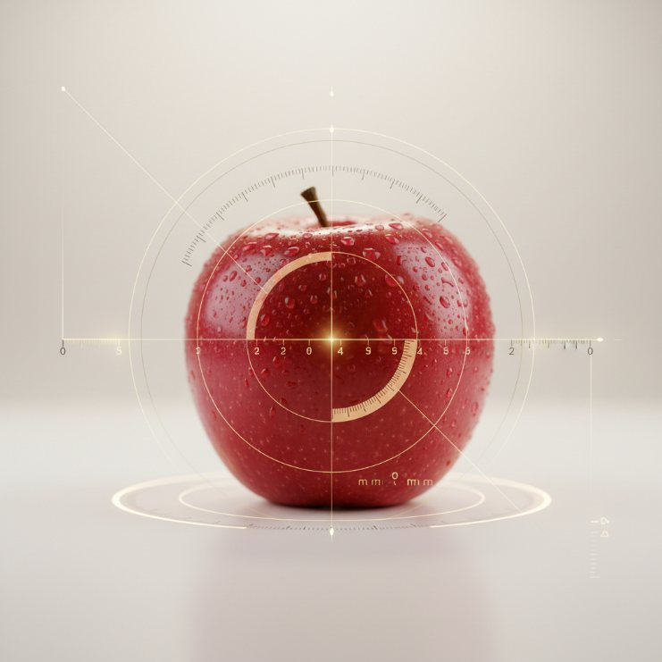

# SM · Unitat 1 · 1. Concepte de mesura

## 📑 Índice de Contenidos

- [1 Definició](#1-definició)
- [2 Mesurar és comparar](#2-mesurar-és-comparar)
- [3 Atributs d'objectes i esdeveniments](#3-atributs-dobjectes-i-esdeveniments)
- [4 El resultat i la unitat](#4-el-resultat-i-la-unitat)
- [5 Mesura directa i mesura indirecta](#5-mesura-directa-i-mesura-indirecta)

---

[← Índex de la unitat](SM_U1_00_INDEX.md)
1[2](SM_U1_02_El_Sistema_Internacional_dUnitats.md "El Sistema Internacional d'Unitats")[3](SM_U1_03_Estructura_dels_sistemes_de_mesura.md "Estructura dels sistemes de mesura")[4](SM_U1_04_Sensors_definicio_i_classificacio.md "Sensors: definició i classificació")[5](SM_U1_05_Caracteristiques_estatiques.md "Característiques estàtiques")[6](SM_U1_06_Caracteristiques_dinamiques.md "Característiques dinàmiques")

Sistemes de Mesura · Unitat 1 · Document 1 de 6

# Concepte de mesura

Dedicació estimada: 9 minuts

> [!NOTE] **Objectius**
>
> 1. Enunciar la definició de mesura i el paper dels seus tres requisits.
> 2. Distingir objecte i atribut, i justificar l'elecció de l'atribut com a decisió de disseny.
> 3. Justificar per què el resultat és inseparable de la unitat.
> 4. Classificar una mesura com a directa o indirecta i relacionar-ho amb la incertesa.

## 1 Definició

Una **mesura** és el resultat d'assignar un nombre a un **atribut** d'un objecte o d'un esdeveniment d'una manera **empírica**, **objectiva** i **representativa**. Cada requisit exclou una família de procediments que superficialment ho semblarien.

- **Empírica**: Fonamentada en l'observació del món real i en la comparació amb un artefacte o procés de referència. Un valor obtingut només per simulació, per exacte que sigui el model, és una predicció i no una mesura.
- **Objectiva**: El resultat depèn del procediment i dels instruments, no de qui mesura. Dos operadors amb el mateix protocol i instruments calibrats han d'obtenir resultats compatibles.
- **Representativa**: L'assignació ha de reflectir les relacions reals entre objectes: si un edifici és més alt, el seu nombre ha de ser més gran. Es defineix respecte d'un atribut concret, no en absolut.

> [!IMPORTANT]
>
> L'objectivitat **no** implica correcció. Un procediment pot ser perfectament objectiu i sistemàticament erroni: els errors que tingui no depenen de l'opinió de l'observador, però hi són. Es formalitza al document 5 amb la veracitat i la fidelitat.

## 2 Mesurar és comparar

Dir que una longitud és 42,3 m significa que conté 42,3 vegades el patró «metre». **El nombre sol no té significat**: només l'adquireix amb la unitat de comparació, qüestió que ocupa el document 2.

D'aquí que s'accepti l'existència d'error. L'atribut existeix al marge del sistema de mesura, que només n'ofereix una aproximació. **Una mesura no és el valor veritable**, sinó un resultat que aspira a estar-hi prou a prop per a la decisió que s'ha de prendre.

> [!TIP] **Les tres preguntes**
>
> 1. **Què es mesura exactament?** Quin atribut, sobre quin objecte o esdeveniment.
> 2. **Amb què es compara?** Quina referència o unitat s'adopta.
> 3. **Quines garanties hi ha** que l'assignació sigui empírica, objectiva i representativa dins d'uns límits acceptables?

## 3 Atributs d'objectes i esdeveniments

Es mesuren **atributs, no objectes**. Un mateix objecte admet moltes mesures segons el context: massa, volum, densitat, color, temperatura, rugositat, rigidesa, conductivitat elèctrica.

*Figura: Figura 1.1 — Un mateix objecte admet mesures de naturalesa diferent.*

Els atributs es poden ordenar per complexitat de mesura. La **massa** es compara directament amb un patró. El **volum** admet procediments diferents —desplaçament de líquid, escaneig geomètric— que mesuren el mateix atribut amb avantatges distints. La **densitat** no es mesura: es calcula a partir de massa i volum. El **color** exigeix decidir prèviament quin model el representa.

El resultat no ha de ser necessàriament un únic escalar. Una càmera calibrada produeix una mesura formada per **molts valors organitzats en píxels**, cadascun amb el seu triplet de components de color: el concepte de mesura s'estén a col·leccions de nombres organitzats.

El raonament val igual per a **esdeveniments**. De la transmissió d'un paquet se'n poden mesurar el retard, la seva variació —el *jitter*—, la taxa d'error de bits, la potència rebuda o la transferència efectiva.

> [!TIP]
>
> **L'elecció de l'atribut és una decisió de disseny** que condiciona tota l'arquitectura del sistema: determina el sensor, el condicionament, el processament i el significat del resultat. Un sistema de mesura és sempre una proposta parcial sobre el món.

## 4 El resultat i la unitat

El resultat s'expressa com una **parella de nombre i unitat**, i els dos elements són inseparables: el nombre sense unitat no té context, i la unitat sense nombre no conté informació quantitativa. El resultat complet respon a tres coses: *quant* (el nombre), *de què* (la unitat i el sistema de referència) i *amb quina confiança* (la incertesa, que s'aborda a la **unitat 2**).

> [!IMPORTANT]
>
> Les unitats implícites en programari són una font documentada d'errors silenciosos. Una variable anomenada `temp` amb valor 298 pot contenir graus Celsius, kelvins o una codificació del fabricant. El cas del document 2 mostra què costa aquesta ambigüitat.

Per adaptar-se a l'ordre de magnitud s'utilitzen múltiples i submúltiples, i per no atribuir al resultat més precisió de la que té s'apliquen les **xifres significatives**: el resultat d'un producte o d'un quocient no en pot tenir més que el factor que menys en té. És una regla pràctica; el tractament rigorós és la propagació d'incerteses de la **unitat 2**.

> [!EXAMPLE] **Exercici resolt — Xifres significatives en una mesura indirecta**
>
> Un voltímetre indica 12,45 V i un amperímetre 0,842 A sobre la mateixa càrrega. Es demana la potència.
>
> 

> 
<b>🔍 Desplegar Resolució</b>

>
> El càlcul directe dona $P$ = 12,45 × 0,842 = 10,4829 W.
>
> El factor amb menys xifres significatives és 0,842, amb tres. El resultat s'ha d'expressar, doncs, com **10,5 W**. Escriure 10,4829 W atribuiria a la mesura una precisió que els instruments no tenen.
>
> 

## 5 Mesura directa i mesura indirecta

El criteri adoptat en aquesta assignatura es defineix **des del punt de vista de l'usuari**:

- **Mesura directa**: S'obté per comparació immediata amb una referència i proporciona el valor final sense càlculs explícits per part de l'usuari. Llegir 12,6 V en un multímetre o la massa en una bàscula calibrada.
- **Mesura indirecta**: S'obté combinant matemàticament una o més mesures directes. Calcular $P$ = $V$ · $I$, o la densitat a partir de massa i volum.

$$
P = V \cdot I \qquad (1.1)
$$

Que el multímetre faci internament mostreig, conversió A/D i visualització no altera la classificació: per a l'usuari el procés és directe. **La classificació no és una propietat de la magnitud sinó del procediment**: amb un wattímetre, la potència passaria a ser directa. Un ohmímetre que injecta un corrent i mesura la tensió és directe per a l'usuari i indirecte per al dissenyador, que ha de conèixer la incertesa de totes dues etapes.

També és indirecta la **mitjana** de  $N$  lectures repetides per reduir el soroll aleatori, perquè s'obté aplicant un algoritme a un conjunt de dades primàries.

> [!TIP]
>
> La distinció és crucial per a la **incertesa**. En una mesura directa prové de l'instrument; en una d'indirecta cal aplicar la llei de propagació d'incerteses (**unitat 2**) per veure com es combinen els errors de cada variable d'entrada.
>
> En una mesura indirecta **la fórmula forma part del procés de mesura**: la qualitat del resultat depèn tant de les mesures d'entrada com de la **validesa de la fórmula** i del model matemàtic emprats. Un model inadequat produeix un resultat erroni encara que totes les mesures directes siguin impecables, i unes dades d'entrada incorrectes es propaguen al resultat per correcta que sigui la fórmula.
>
> Una mesura indirecta pot tenir una incertesa **menor o major** que les que la componen, segons l'estructura de la relació i la correlació entre variables: les mitjanes redueixen la component aleatòria, els productes tendeixen a acumular-la.

> [!TIP] **Síntesi**
>
> 1. Mesura = assignar un nombre a un atribut de manera **empírica, objectiva i representativa**.
> 2. Objectivitat ≠ correcció: un procediment objectiu pot ser sistemàticament erroni.
> 3. Es mesuren **atributs**, no objectes; triar l'atribut és una decisió de disseny.
> 4. El resultat és **nombre + unitat**, i les xifres significatives no han d'excedir les del factor més pobre.
> 5. **Directa** = sense càlculs per a l'usuari; **indirecta** = combinació de mesures directes. És una propietat del procediment, no de la magnitud.

**Sistemes de Mesura** · Grau en Enginyeria Electrònica de Telecomunicacions · ETSETB — UPC

Unitat 1 · Document 1 de 6 · Materials de treball previ · Curs 2026-T

---
[← Tornar Índex de la unitat](SM_U1_00_INDEX.md) • [Document 2 → El Sistema Internacional d'Unitats](SM_U1_02_El_Sistema_Internacional_dUnitats.md)

---

## 📐 Formulario Resumen de Ecuaciones

| Nº / Ref | Expresión Matemática |
| :---: | :--- |
| **(1.1)** | $P = V \cdot I$ |