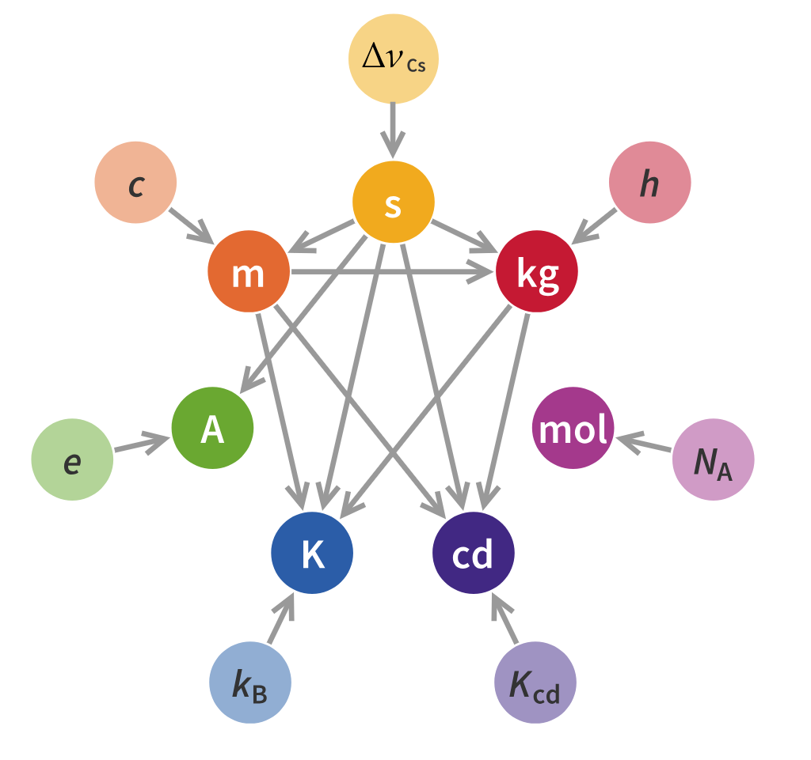

# SM · Unitat 1 · 2. El Sistema Internacional d'Unitats

## 📑 Índice de Contenidos

- [1 De l'artefacte a la constant](#1-de-lartefacte-a-la-constant)
- [2 Unitats base](#2-unitats-base)
- [3 Unitats derivades i coherència](#3-unitats-derivades-i-coherència)
- [4 Les set constants](#4-les-set-constants)
- [5 Prefixos](#5-prefixos)
- [6 El Mars Climate Orbiter](#6-el-mars-climate-orbiter)
- [▤ Annex de consulta](#annex-de-consulta)

---

[← Índex de la unitat](SM_U1_00_INDEX.md)
[1](SM_U1_01_Concepte_de_mesura.md "Concepte de mesura")2[3](SM_U1_03_Estructura_dels_sistemes_de_mesura.md "Estructura dels sistemes de mesura")[4](SM_U1_04_Sensors_definicio_i_classificacio.md "Sensors: definició i classificació")[5](SM_U1_05_Caracteristiques_estatiques.md "Característiques estàtiques")[6](SM_U1_06_Caracteristiques_dinamiques.md "Característiques dinàmiques")

Sistemes de Mesura · Unitat 1 · Document 2 de 6

# El Sistema Internacional d'Unitats

Dedicació estimada: 9 minuts

> [!NOTE] **Objectius**
>
> 1. Enumerar les set unitats base i les particularitats del quilogram, l'ampere i el kelvin.
> 2. Explicar què vol dir que el SI sigui *coherent*.
> 3. Descriure la lògica de la redefinició de 2019.
> 4. Aplicar les regles de notació i d'ús de prefixos.
> 5. Argumentar per què documentar les unitats a les interfícies és una exigència de disseny.

## 1 De l'artefacte a la constant

Com que tota mesura és una comparació, cal un acord universal sobre les referències. El **SI** no és una llista de símbols: és una estructura coherent que connecta les magnituds entre elles i les ancora a constants fonamentals.

Les unitats antigues derivaven de l'anatomia humana i patien de **variabilitat**. El **Sistema Mètric Decimal** (1799) va introduir dos principis: **decimalització** —tots els múltiples són potències de deu— i **referències naturals** —el metre com a fracció del meridià, el quilogram com la massa d'un decímetre cúbic d'aigua. Per fer-lo pràctic es van fabricar **artefactes** de platí, i la **Convenció del Metre** (1875) va crear el BIPM per vetllar per la uniformitat mundial. El nom «Sistema Internacional d'Unitats» data de **1960**.

> [!IMPORTANT]
>
> Els artefactes no eren prou estables: podien canviar amb la temperatura, envellir, guanyar o perdre àtoms, i si es destruïen la unitat es perdia. Per això es van substituir progressivament per fenòmens físics invariants. El **1983** es va fixar la velocitat de la llum com a valor exacte i el metre va passar a dependre del segon.

La reforma final va entrar en vigor el **20 de maig de 2019**: s'abandona tota referència a objectes materials i el SI es defineix fixant el valor numèric exacte de **set constants fonamentals**. Un quilogram ja no és un cilindre sinó la massa necessària perquè la constant de Planck valgui exactament el valor fixat. **L'estàndard ha passat de la caixa forta a les lleis de la física.**

## 2 Unitats base

| Magnitud base | Unitat | Símbol |
|:--- |:--- |:--- |
| Longitud | metre | m |
| Massa | quilogram | kg |
| Temps | segon | s |
| Corrent elèctric | ampere | A |
| Temperatura termodinàmica | kelvin | K |
| Quantitat de substància | mol | mol |
| Intensitat lluminosa | candela | cd |

**Taula 1.1 — Les set unitats base.** Convé conèixer-les de memòria.

- El **quilogram** és l'única unitat base que **incorpora un prefix al nom**. La unitat base és el quilogram i no el gram, cosa que indueix errors de càlcul.
- L'**ampere** connecta el món mecànic amb l'elèctric. El SI va triar el corrent com a base i no la càrrega ni la tensió, per raons pràctiques de realització; des de 2019 es defineix comptant càrregues elementals.
- El **kelvin** és la temperatura termodinàmica. El grau Celsius és una unitat derivada acceptada, però les equacions termodinàmiques rigoroses exigeixen kelvins —per exemple el soroll tèrmic d'una resistència, a la **unitat 4**. La denominació correcta és *kelvin*, mai «grau Kelvin».
- El **mol** compta entitats elementals i connecta el món macroscòpic amb el microscòpic. És essencial en semiconductors i sensors electroquímics.
- La **candela** és l'única unitat base que depèn de la **percepció humana**: pondera la sensibilitat de l'ull als colors. Per això en enginyeria sovint es prefereixen unitats radiomètriques, purament energètiques.

> [!IMPORTANT] **Notació**
>
> - Els **noms** van sempre en minúscula: metre, newton, ampere.
> - Els **símbols** van en minúscula (m, s, kg) excepte si la unitat prové d'un nom propi: A d'Ampère, K de Kelvin, V de Volta, N de Newton.
> - El **litre** admet L i l, excepció tolerada per evitar confondre la ela amb el número u.
>
> No és estil: permet distingir el prefix «m» de mil·li de la unitat «m» de metre.

## 3 Unitats derivades i coherència

Una unitat derivada es forma amb **productes i potències de les unitats base, sense cap factor numèric**. Aquesta propietat és la **coherència**.

> [!TIP]
>
> Gràcies a la coherència, si s'introdueixen valors en unitats coherents en una fórmula física correcta, el resultat surt en la unitat coherent corresponent **sense factors de conversió**. Al sistema imperial, passar de cavalls a lliures-peu per segon exigeix multiplicar per 550, i cada factor és una oportunitat d'error.

Una mateixa unitat derivada admet expressions equivalents: el **volt** és W/A o J/C; l'**ohm** és V/A i el **siemens**, el seu invers, és A/V —el primer mesura resistència i el segon conductància, de manera que no són comparables en magnitud sinó recíprocs. Els noms propis simplifiquen la comunicació: un ampere-segon per volt és un **farad**, un newton-metre un **joule**, un invers de segon un **hertz**.

Dues unitats derivades són adimensionals però conserven nom propi: el **radian** (angle pla, arc dividit per radi), imprescindible per distingir la freqüència angular en rad/s de la freqüència en Hz —un factor 2π omès té conseqüències greus—, i l'**estereoradian** (angle sòlid), important en fotometria i en el guany directiu d'antenes.

La llista d'unitats derivades és a l'[annex](#annex).

## 4 Les set constants

| Constant | Valor fixat | Defineix |
|:--- |:--- |:--- |
| Δ $\nu_{\text{Cs}}$  · transició hiperfina del cesi-133 | 9 192 631 770 Hz | segon |
| $c$  · velocitat de la llum en el buit | 299 792 458 m/s | metre |
| $h$  · constant de Planck | 6,626 070 15 × $10^{-34}$ J·s | quilogram |
| $e$  · càrrega elemental | 1,602 176 634 × $10^{-19}$ C | ampere |
| $k_{B}$  · constant de Boltzmann | 1,380 649 × $10^{-23}$ J/K | kelvin |
| $N_{A}$  · constant d'Avogadro | 6,022 140 76 × $10^{23}$ $mol^{-1}$ | mol |
| $K_{\text{cd}}$  · eficàcia lluminosa a 540 THz | 683 lm/W | candela |

> [!TIP]
>
> L'enfocament **inverteix la lògica tradicional**: abans es tenia un metre patró i es mesurava la velocitat de la llum; ara es fixa la velocitat de la llum i se'n dedueix el metre.

- **Segon**: 9 192 631 770 períodes de la transició entre els dos nivells hiperfins de l'estat fonamental del cesi-133. És la base del GPS i de la sincronització de xarxes.
- **Metre**: el que recorre la llum en 1/299 792 458 s. Deriva del segon.
- **Quilogram**: es realitza amb la balança de Kibbletambé anomenada balança de Watt, que compara potència mecànica i elèctrica; com que la potència elèctrica es mesura amb l'efecte Josephson i l'efecte Hall quàntic, tots dos dependents de  $h$  i  $e$, la massa queda lligada a la constant de Planck.
- **Ampere**: flux d'un nombre determinat de càrregues elementals per segon, molt més intuïtiu que l'antiga definició per forces entre conductors.
- **Kelvin**: es fixa l'energia tèrmica equivalent  $k_{B}$  $T$, cosa que elimina la dependència del punt triple de l'aigua.

*Figura: Figura 1.2 — Constants fonamentals i unitats base. Cada constant defineix una unitat, però les unitats també depenen entre elles.*

La interconnexió fa el sistema robust: una mesura de massa d'alta precisió empra implícitament la freqüència del cesi i la constant de Planck. **El SI ha deixat de ser una col·lecció de patrons independents per ser una xarxa de constants.**

## 5 Prefixos

En electrònica es treballa amb rangs enormes —de picowatts a gigahertzs— i escriure zeros indueix errors de lectura. Els **prefixos decimals** multipliquen la unitat per potències de deu. El 2022 s'hi van afegir **ronna** i **quetta** per als valors grans i **ronto** i **quecto** per als petits, perquè yotta i yocto s'havien quedat curts. La taula completa és a l'[annex](#annex).

> [!IMPORTANT] **Normes**
>
> - **Cap prefix en cascada.** Mai «milimicrofarad»: és nanofarad (nF).
> - **Excepció del quilogram.** Els prefixos s'apliquen al gram: $10^{-6}$ kg és un mil·ligram, no un «microquilogram».
> - **Preferents** els prefixos que són potències de mil. Hecto, deca, deci i centi es desaconsellen en context tècnic, tret d'àrees consolidades com els decibels.
> - **Elecció:** triar el prefix perquè el valor quedi entre **0,1 i 1000**.
>
> El criteri operatiu és la **llegibilitat**: «10 nF» es classifica mentalment a l'instant; «0,00000001 F» obliga a comptar zeros, i cada aturada és una oportunitat d'error.

## 6 El Mars Climate Orbiter

La sonda de la NASA, llançada el desembre de 1998, havia d'inserir-se en òrbita marciana a **226 km** d'altitud. El 23 de setembre de 1999 va passar a **57 km** i es va desintegrar per estrès tèrmic i mecànic.

> [!IMPORTANT]
>
> **Lockheed Martin**, el contractista, lliurava l'impuls dels propulsors en **lliures-força segon**. El programari de navegació del **Jet Propulsion Laboratory** el llegia assumint **newton segon**. El factor entre les dues unitats és 4,45, de manera que cada correcció de rumb es va subestimar per aquest factor durant mesos. Cost: **327,6 milions de dòlars**.

> [!TIP] **Tres principis**
>
> 1. **La unitat és part de la dada.** No s'ha de transmetre, emmagatzemar ni processar mai un número sense certesa absoluta sobre la seva unitat.
> 2. **El risc és a les interfícies.** Els dos programaris eren internament correctes; l'error va passar a la frontera entre subsistemes.
> 3. **Cal verificació d'extrem a extrem.** Hi va haver senyals d'alerta, però sense comprovacions creuades d'unitats no es van interpretar.

> [!TIP] **Síntesi**
>
> 1. **Set unitats base.** El quilogram és l'anomalia: única amb prefix al nom.
> 2. **Coherència** = unitats derivades sense factors numèrics, i per tant sense conversions internes.
> 3. Des de **2019** el SI fixa set **constants fonamentals** en lloc de conservar objectes.
> 4. Notació i prefixos són eines de **prevenció d'errors**, no convencions estètiques.
> 5. El punt crític d'un sistema complex és la **interfície entre subsistemes**.

## ▤ Annex de consulta

| Magnitud | Unitat | Símbol | En unitats base |
|:--- |:--- |:--- |:--- |
| Freqüència | hertz | Hz | $s^{-1}$ |
| Força | newton | N | m·kg·$s^{-2}$ |
| Pressió, tensió mecànica | pascal | Pa | $m^{-1}$·kg·$s^{-2}$ |
| Energia, treball, calor | joule | J | $m^{2}$·kg·$s^{-2}$ |
| Potència | watt | W | $m^{2}$·kg·$s^{-3}$ |
| Angle pla / angle sòlid | radian / estereoradian | rad / sr | 1 (adimensional) |
| Càrrega elèctrica | coulomb | C | s·A |
| Tensió | volt | V | $m^{2}$·kg·$s^{-3}$·$A^{-1}$ |
| Capacitat | farad | F | $m^{-2}$·$kg^{-1}$·$s^{4}$·$A^{2}$ |
| Resistència | ohm | Ω | $m^{2}$·kg·$s^{-3}$·$A^{-2}$ |
| Conductància | siemens | S | $m^{-2}$·$kg^{-1}$·$s^{3}$·$A^{2}$ |
| Flux magnètic | weber | Wb | $m^{2}$·kg·$s^{-2}$·$A^{-1}$ |
| Densitat de flux magnètic | tesla | T | kg·$s^{-2}$·$A^{-1}$ |
| Inductància | henry | H | $m^{2}$·kg·$s^{-2}$·$A^{-2}$ |
| Temperatura Celsius | grau Celsius | °C | K (amb desplaçament) |
| Flux lluminós / il·luminància | lumen / lux | lm / lx | cd·sr / $m^{-2}$·cd |

**Taula 1.2 — Unitats derivades amb nom propi.**

| Factor | Nom | Símbol | Factor | Nom | Símbol |
|:--- |:--- |:--- |:--- |:--- |:--- |
| $10^{1}$ | deca | da | $10^{-1}$ | deci | d |
| $10^{2}$ | hecto | h | $10^{-2}$ | centi | c |
| $10^{3}$ | quilo | k | $10^{-3}$ | mil·li | m |
| $10^{6}$ | mega | M | $10^{-6}$ | micro | µ |
| $10^{9}$ | giga | G | $10^{-9}$ | nano | n |
| $10^{12}$ | tera | T | $10^{-12}$ | pico | p |
| $10^{15}$ | peta | P | $10^{-15}$ | femto | f |
| $10^{18}$ | exa | E | $10^{-18}$ | atto | a |
| $10^{21}$ | zetta | Z | $10^{-21}$ | zepto | z |
| $10^{24}$ | yotta | Y | $10^{-24}$ | yocto | y |
| $10^{27}$ | ronna | R | $10^{-27}$ | ronto | r |
| $10^{30}$ | quetta | Q | $10^{-30}$ | quecto | q |

**Taula 1.3 — Prefixos del SI.** Ressaltats, els més freqüents en electrònica.

**Sistemes de Mesura** · Grau en Enginyeria Electrònica de Telecomunicacions · ETSETB — UPC

Unitat 1 · Document 2 de 6 · Materials de treball previ · Curs 2026-T

---
[← Document 1 Concepte de mesura](SM_U1_01_Concepte_de_mesura.md) • [Document 3 → Estructura dels sistemes de mesura](SM_U1_03_Estructura_dels_sistemes_de_mesura.md)