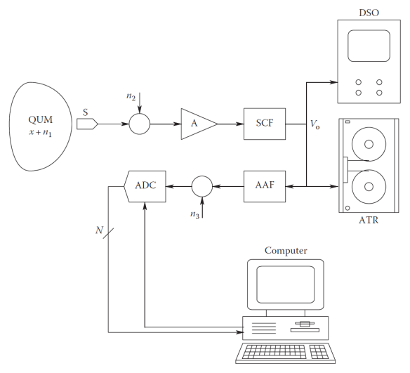

# SM · Unitat 1 · 3. Estructura dels sistemes de mesura

## 📑 Índice de Contenidos

- [1 Del mesurand al resultat](#1-del-mesurand-al-resultat)
- [2 Adquisició i efecte de càrrega](#2-adquisició-i-efecte-de-càrrega)
- [3 Condicionament](#3-condicionament)
  - [3.1 · Pont de Wheatstone](#31-pont-de-wheatstone)
  - [3.2 · Llaç de 4-20 mA i alternativa 0-10 V](#32-llaç-de-4-20-ma-i-alternativa-0-10-v)
- [4 Conversió analògica-digital](#4-conversió-analògica-digital)
  - [4.1 · Mostreig i Nyquist](#41-mostreig-i-nyquist)
  - [4.2 · Quantificació i resolució](#42-quantificació-i-resolució)
- [5 Processament digital](#5-processament-digital)
  - [5.1 · Models de processament](#51-models-de-processament)
  - [5.2 · Sensors virtuals, registre i integració](#52-sensors-virtuals-registre-i-integració)
- [6 Presentació](#6-presentació)

---

[← Índex de la unitat](SM_U1_00_INDEX.md)
[1](SM_U1_01_Concepte_de_mesura.md "Concepte de mesura")[2](SM_U1_02_El_Sistema_Internacional_dUnitats.md "El Sistema Internacional d'Unitats")3[4](SM_U1_04_Sensors_definicio_i_classificacio.md "Sensors: definició i classificació")[5](SM_U1_05_Caracteristiques_estatiques.md "Característiques estàtiques")[6](SM_U1_06_Caracteristiques_dinamiques.md "Característiques dinàmiques")

Sistemes de Mesura · Unitat 1 · Document 3 de 6

# Estructura dels sistemes de mesura

Dedicació estimada: 13 minuts

> [!NOTE] **Objectius**
>
> 1. Distingir mesurand i quantitat sota mesura.
> 2. Identificar les etapes del sistema i la funció de cadascuna.
> 3. Explicar l'efecte de càrrega i com es minimitza.
> 4. Aplicar el criteri de Nyquist i relacionar l'aliàsing amb el filtratge previ.
> 5. Calcular la resolució d'un ADC.
> 6. Comparar models de processament explícits i basats en aprenentatge.

## 1 Del mesurand al resultat

Un **sistema de mesura** transforma una magnitud del món real en una dada útil per decidir. **Cada etapa hi afegeix el seu error**: un sensor excel·lent amb un condicionament deficient dona mesures deficients, i un convertidor de setze bits no aporta res si el senyal ja porta soroll a partir del vuitè.

- **Mesurand**: La magnitud que es vol conèixer, definida amb prou precisió. No n'hi ha prou de dir «temperatura»: cal dir de quin element, en quin punt i en quines condicions.
- **Quantitat sota mesura**: L'atribut físic que el sistema realment detecta. És allò a què el sensor és sensible i, en general, no coincideix amb el mesurand.

Si es vol la temperatura del nucli d'un component i el sensor és a l'encapsulat, entre l'una i l'altra hi ha una resistència tèrmica: la diferència no és soroll, és un **error sistemàtic** derivat del muntatge. Molts errors greus no vénen d'instruments defectuosos sinó d'una **identificació incorrecta del mesurand**: un instrument perfecte que mesura amb exactitud la magnitud equivocada és inservible.

*Figura: Figura 1.3 — Estructura general. Cada bloc transforma el senyal i hi afegeix la seva contribució d'error.*

1. **Adquisició.** El sensor interacciona amb el mesurand i en produeix una representació elèctrica.
2. **Condicionament.** S'adapta el senyal a l'etapa següent.
3. **Conversió.** Mostreig i quantificació.
4. **Processament.** Escalat, correcció, filtratge, càlculs derivats.
5. **Presentació.** Operador, emmagatzematge o llaç de control.

No tots els sistemes tenen les cinc etapes explícites i sovint s'integren en un sol component, però l'esquema serveix com a marc d'anàlisi.

## 2 Adquisició i efecte de càrrega

A l'adquisició es produeix la **transducció**, objecte del document 4. Aquí interessa que **tota mesura pertorba el sistema mesurat**: és l'**efecte de càrrega**, conseqüència inevitable d'haver d'extreure energia o informació del sistema.

- Un voltímetre de resistència d'entrada finita sobre un circuit d'alta impedància forma un divisor amb la font i llegeix menys tensió de la que hi havia.
- Un termoparell de massa considerable en un volum petit de líquid n'absorbeix calor i altera la temperatura que acaba mesurant.

No s'elimina, però es minimitza: el sensor ha d'intercanviar **la mínima energia possible** —impedància d'entrada alta per mesurar tensió, baixa per mesurar corrent, massa tèrmica reduïda per mesurar temperatura.

> [!TIP]
>
> Quan no n'hi ha prou, la segona estratègia és **caracteritzar l'efecte i corregir-lo**. **Un error conegut i quantificat és molt menys perillós que un error petit però ignorat**: el primer es corregeix, el segon es propaga fins a la decisió final.

## 3 Condicionament

El senyal del sensor rarament és utilitzable: pot ser de nivell molt baix —desenes de microvolts en un termoparell—, tenir impedància inadequada, portar mode comú elevat o soroll.

- **Amplificació.** Aprofitar tot el marge de l'etapa següent. Els amplificadors d'instrumentació, coneguts de circuits i sistemes electrònics, es reprenen a la **unitat 6**.
- **Adaptació d'impedàncies** i **filtratge** de components que no són informació útil.
- **Excitació.** Els sensors moduladors modifiquen una propietat elèctrica i no generen energia: necessiten una font externa, i **la seva estabilitat determina l'estabilitat de la mesura**.
- **Linealització analògica**, avui sovint traslladada al domini digital.

### 3.1 · Pont de Wheatstone

Una galga extensomètrica canvia de resistència un 0,1 % del valor nominal, i mesurar-ho directament exigiria resoldre parts per milió sobre un fons molt més gran. El **pont de Wheatstone** —quatre resistències amb sortida nul·la en equilibri— fa que el senyal útil sigui el **desequilibri** i no el valor absolut, cosa que permet amplificar amb guany elevat sense saturar. A més, si totes les resistències són a la mateixa temperatura, **les derives tèrmiques es compensen mútuament**. Les configuracions de quart, mig i pont complet són de la **unitat 6**.

### 3.2 · Llaç de 4-20 mA i alternativa 0-10 V

En instrumentació industrial el senyal es transmet sovint com un **llaç de corrent de 4-20 mA**, amb el mínim del mesurand a 4 mA. Tres avantatges:

1. **Immunitat a la caiguda de tensió**: el corrent en un llaç sèrie és el mateix a tot arreu i la resistència del cable no altera el valor.
2. **Detecció d'avaries**: com que el zero és 4 mA, una lectura de 0 mA indica llaç obert. Un senyal de 0-20 mA no distingiria un mesurand nul d'una **avaria**.
3. **Alimentació pel mateix parell**: els 4 mA de repòs alimenten el transmissor, cosa que permet instal·lacions de dos fils.

L'alternativa és la transmissió en **tensió de 0-10 V**, més senzilla i econòmica, adequada en **distàncies curtes** i entorns benignes, però sense cap de les tres garanties: la caiguda al cable degrada el valor en trajectes llargs i 0 V és ambigu entre mesurand nul i cable tallat.

Convé recordar que **els cables i els connectors formen part del sistema de mesura**: resistència de contacte, unions dissimilars, acoblament capacitiu i moviment mecànic introdueixen errors de transmissió que poden superar els del sensor.

## 4 Conversió analògica-digital

El **convertidor analògic-digital** (ADC) implica dues discretitzacions independents.

### 4.1 · Mostreig i Nyquist

El **mostreig** discretitza el **temps**: el senyal s'avalua cada **període de mostreig**  $T_{s}$, i la **freqüència de mostreig** n'és la inversa.

$$
f_{s} = 1 / T_{s} \qquad (1.2)
$$

El teorema del mostreig, conegut de senyals i sistemes, estableix que si el senyal té contingut fins a  $f_{\max}$, les mostres el determinen completament sempre que

$$
f_{s} > 2f_{\text{\max}} \qquad (1.3)
$$

> [!IMPORTANT]
>
> Conviuen dues convencions. La **freqüència de Nyquist** designa habitualment  $f_{s}$ /2, és a dir **la meitat de la freqüència de mostreig**; la **taxa de Nyquist** designa 2 $f_{\max}$. En aquesta assignatura s'adopta la primera:  $f_{N}$  =  $f_{s}$ /2.

Els components per sobre de  $f_{s}$ /2 no desapareixen: queden **plegats** sobre la banda útil com a components de freqüència més baixa. És l'**aliàsing**, i un component així es diu **aliasat**.

> [!TIP]
>
> L'aliàsing **és irreversible**: un cop preses les mostres, un component aliasat no és separable del contingut genuí. La informació no està degradada, està destruïda.
>
> Per això cal un **filtre antialiàsing analògic** situat necessàriament **abans** del convertidor. Un filtre digital posterior elimina banda alta però no desfà un plegament ja produït.

### 4.2 · Quantificació i resolució

La **quantificació** discretitza l'**amplitud**. Per a  $n$  bits i fons d'escala  $V_{\text{FE}}$, hi ha $2^{n}$ nivells i la **resolució** val

$$
q = V_{\text{FE}} / 2^{n} \qquad (1.4)
$$

L'**error de quantificació** està acotat per ± $q$ /2: a diferència de l'aliàsing, és predictible. **Augmentar bits no millora indefinidament**: si el soroll del senyal supera  $q$, els bits inferiors només codifiquen soroll. I resolució no és exactitud: un convertidor pot resoldre molt fi i tenir un error sistemàtic considerable (document 5).

> [!EXAMPLE] **Exercici resolt — Dimensionament d'una cadena d'adquisició**
>
> Un sensor de pressió lliura 0-5 V per a 0-10 bar, amb components fins a 400 Hz i 2 mV de soroll eficaç.
>
> 

> 
<b>🔍 Desplegar Resolució</b>

>
> **Mostreig.** Nyquist exigeix $f_{s}$ > 800 Hz; amb el marge habitual de dues a cinc vegades —els filtres reals no tallen abruptament— s'adopten **2 kHz**.
>
> **Bits.** No té sentit resoldre per sota del soroll: 5 / 0,002 ≈ 2500 nivells distingibles, poc més d'11 bits. Amb **12 bits**, $q$ = 5/4096 = 1,22 mV, del mateix ordre que el soroll. Amb 16 bits, $q$ = 76 µV i els quatre bits inferiors només serien soroll.
>
> **En unitats del mesurand.** 10 bar / 4096 = 2,4 mbar. Si l'aplicació demana distingir 10 mbar hi ha marge; si en demana 1, cal replantejar convertidor i condicionament.
>
> 

## 5 Processament digital

Les **dades primàries** —o dades brutes— són els valors que surten del convertidor, en comptes i codis, no en unitats físiques. Operacions habituals:

- **Escalat.** El codi binari de l'ADC no és una temperatura: només adquireix significat físic quan el PC o el microcontrolador hi aplica els paràmetres de la funció de resposta.
- **Linealització** per funció inversa, polinomi d'ajust o taula de consulta amb interpolació.
- **Correcció d'errors coneguts**: error de zero, deriva tèrmica, efecte de càrrega quantificat. Els dos primers es defineixen al document 5.
- **Filtratge digital i estadística** per reduir la component aleatòria.
- **Càlcul de magnituds derivades**, és a dir mesures indirectes.

> [!IMPORTANT]
>
> En cadenes senzilles i lineals la propagació dels errors és previsible i calculable analíticament. Quan el processament és **fortament no lineal** o encadena moltes operacions, un error d'entrada petit pot amplificar-se de manera difícil d'anticipar. L'anàlisi rigorosa és la **unitat 2**.

### 5.1 · Models de processament

La manera de passar de dades primàries a resultat és el **model de processament**, i n'hi ha dues famílies.

- **Model explícit**: Equacions derivades de la física del sensor i de la cadena, amb paràmetres obtinguts per calibratge, operació que es defineix al document 5. Cada terme té significat identificable i es pot revisar quines operacions transformen les dades.
- **Model basat en aprenentatge**: La relació s'infereix de dades d'entrenament sense formular les lleis físiques. Útil quan la relació és complexa o hi ha variables acoblades —estimar la concentració d'un gas amb sensors poc selectius.

Els models apresos funcionen com una **caixa negra**: la relació existeix i pot ser precisa, però no és inspeccionable en termes de causes físiques. D'aquí dues conseqüències:

1. **Dificulten la traçabilitat**, és a dir la possibilitat de lligar el resultat a patrons de referència per una cadena documentada de comparacions. No es pot descompondre el resultat en contribucions atribuïbles a patrons, cosa que complica el càlcul rigorós de la **incertesa**.
2. **Extrapolen malament.** Són fiables dins del domini d'entrenament; fora, poden produir resultats arbitràriament erronis *sense cap indicació*, cosa perillosa en aplicacions de seguretat. El biaix del conjunt d'entrenament es trasllada al resultat.

> [!TIP]
>
> No queden invalidats, però exigeixen una **validació** molt més exhaustiva: caracteritzar el domini de validesa, comprovar els límits i comparar amb un mètode de referència independent. El criteri és que **el model sigui tan explícit com la física permeti i tan après com la complexitat obligui**.

### 5.2 · Sensors virtuals, registre i integració

Un **sensor virtual** o *soft sensor* estima una magnitud a partir d'altres de mesurades i d'un model: la temperatura interna d'un motor a partir del corrent, la velocitat i la temperatura ambient, o l'estat de càrrega d'una bateria. Estalvia maquinari i accedeix a magnituds inaccessibles, però **hereta la incertesa de totes les mesures que hi intervenen i, a més, la del model**.

El **registre de dades** —*data logging*— exigeix decidir quines magnituds es guarden, amb quina cadència i durant quant de temps. Guardar-ho tot no sempre és viable, i una decisió mal presa pot deixar un episodi anòmal fora de les dades quan cal analitzar-lo.

Els **sensors intel·ligents** integren en un encapsulat el transductor, el condicionament, la conversió, el processament i una interfície digital. **No deixen de ser sistemes de mesura**: contenen les mateixes etapes, només que no accessibles per separat. Ofereixen autocalibratge i diagnòstic, però traslladen al fabricant decisions que abans prenia el dissenyador. Un **oscil·loscopi digital** (DSO) és igualment una cadena completa de condicionament, conversió, processament i presentació: no és un sensor sinó un sistema de mesura de senyals elèctrics.

## 6 Presentació

- **Xifres significatives.** Mostrar-ne més de les que la incertesa justifica enganya l'operador.
- **Unitats.** Formen part del resultat i no són opcionals.
- **Estats anòmals.** Cal distingir valor vàlid, valor fora de marge i absència de mesura per avaria.
- **Latència.** En un llaç de control, el retard forma part del comportament dinàmic (document 6).

> [!TIP] **Síntesi**
>
> 1. **Mesurand** = el que es vol conèixer; **quantitat sota mesura** = el que el sistema capta. La diferència és error sistemàtic.
> 2. Cinc etapes, i **cadascuna aporta el seu error**.
> 3. L'**efecte de càrrega** és inevitable: es minimitza i, si cal, es caracteritza per corregir-lo.
> 4. **Wheatstone** mesura desequilibris i compensa derives; **4-20 mA** és immune a la caiguda de tensió i detecta avaries.
> 5. $f_{s}$  > 2 $f_{\max}$;  $f_{N}$  =  $f_{s}$ /2. L'**aliàsing** és irreversible i només s'evita amb filtre analògic previ.
> 6. Error de quantificació acotat per ± $q$ /2. Més bits no serveixen si el soroll supera  $q$.
> 7. Models **explícits** = traçabilitat; **apresos** = flexibilitat a canvi d'opacitat i validació exhaustiva.

**Sistemes de Mesura** · Grau en Enginyeria Electrònica de Telecomunicacions · ETSETB — UPC

Unitat 1 · Document 3 de 6 · Materials de treball previ · Curs 2026-T

---
[← Document 2 El Sistema Internacional d'Unitats](SM_U1_02_El_Sistema_Internacional_dUnitats.md) • [Document 4 → Sensors: definició i classificació](SM_U1_04_Sensors_definicio_i_classificacio.md)

---

## 📐 Formulario Resumen de Ecuaciones

| Nº / Ref | Expresión Matemática |
| :---: | :--- |
| **(1.2)** | $f_{s} = 1 / T_{s}$ |
| **(1.3)** | $f_{s} > 2f_{\text{\max}}$ |
| **(1.4)** | $q = V_{\text{FE}} / 2^{n}$ |