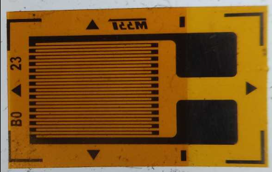
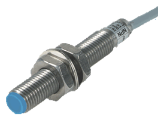
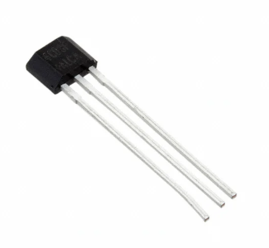
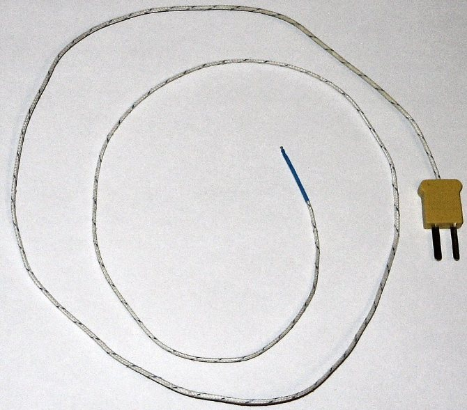

# SM · Unitat 1 · 4. Sensors: definició i classificació

## 📑 Índice de Contenidos

- [1 Sensor, transductor i actuador](#1-sensor-transductor-i-actuador)
- [2 Classificacions](#2-classificacions)
  - [2.1 · Per aportació d'energia](#21-per-aportació-denergia)
  - [2.2 · Per tipus de sortida i per referència](#22-per-tipus-de-sortida-i-per-referència)
- [3 Principis de transducció](#3-principis-de-transducció)
  - [3.1 · Resistius](#31-resistius)
  - [3.2 · Capacitius i inductius](#32-capacitius-i-inductius)
  - [3.3 · Efecte Hall](#33-efecte-hall)
  - [3.4 · Termoparell](#34-termoparell)
  - [3.5 · Òptics i electroquímics](#35-òptics-i-electroquímics)
- [4 Model elèctric](#4-model-elèctric)
- [5 Sensibilitat creuada](#5-sensibilitat-creuada)
- [6 Selecció](#6-selecció)

---

[← Índex de la unitat](SM_U1_00_INDEX.md)
[1](SM_U1_01_Concepte_de_mesura.md "Concepte de mesura")[2](SM_U1_02_El_Sistema_Internacional_dUnitats.md "El Sistema Internacional d'Unitats")[3](SM_U1_03_Estructura_dels_sistemes_de_mesura.md "Estructura dels sistemes de mesura")4[5](SM_U1_05_Caracteristiques_estatiques.md "Característiques estàtiques")[6](SM_U1_06_Caracteristiques_dinamiques.md "Característiques dinàmiques")

Sistemes de Mesura · Unitat 1 · Document 4 de 6

# Sensors: definició i classificació

Dedicació estimada: 11 minuts

> [!NOTE] **Objectius**
>
> 1. Distingir sensor, transductor i actuador.
> 2. Classificar un sensor pels diferents criteris i saber què aporta cadascun.
> 3. Explicar el principi de transducció de cada família.
> 4. Deduir del model elèctric les exigències sobre el condicionament.
> 5. Identificar la sensibilitat creuada i les seves estratègies de compensació.

> [!TIP]
>
> Aquest document és el **mapa** dels sensors. L'estudi detallat de cada família —models, circuits, limitacions— és el nucli de bona part de l'assignatura, i s'indica en quina unitat es reprèn cada cas.

## 1 Sensor, transductor i actuador

- **Transductor**: Qualsevol dispositiu que converteix una forma d'energia en una altra. És el terme general.
- **Sensor**: Transductor destinat a obtenir informació. Es dissenya per maximitzar la fidelitat de la representació, no l'eficiència energètica.
- **Actuador**: Transductor invers: converteix un senyal, habitualment elèctric, en una acció física. Tanca el llaç de control.

Els criteris de disseny són **oposats**: al sensor interessa extreure energia mínima —per limitar l'efecte de càrrega— i màxima reproductibilitat; a l'actuador, transferir energia amb el màxim rendiment. Alguns dispositius fan les dues funcions: un element **piezoelèctric** genera càrrega quan es deforma i es deforma quan se li aplica tensió, reversibilitat que és la base dels transductors ultrasònics.

## 2 Classificacions

No hi ha una única classificació vàlida; se n'utilitzen diverses en paral·lel i cadascuna aporta una cosa diferent.

- **Per magnitud mesurada**: Temperatura, pressió, posició, cabal. És la dels catàlegs i la més útil per a l'usuari final. No determina el circuit de lectura: dos sensors de temperatura poden exigir electròniques ben diferents.
- **Per principi físic**: Resistiu, capacitiu, inductiu, piezoelèctric, termoelèctric, fotoelèctric. Permet preveure les vulnerabilitats a interferències: un principi magnètic patirà camps externs; un de capacitiu, la humitat i la proximitat d'objectes.
- **Per model elèctric**: Resistència, reactància, font de tensió, de corrent o de càrrega. És la del dissenyador del condicionament i permet reutilitzar topologies per a magnituds diferents.

### 2.1 · Per aportació d'energia

És la de més conseqüències pràctiques, perquè determina el tipus de condicionament.

|  | Moduladors (passius) | Generadors (actius) |
|:--- |:--- |:--- |
| Què fan | Modifiquen una propietat elèctrica —R, C, L— en funció del mesurand | Produeixen tensió, corrent o càrrega a partir de l'energia del mesurand |
| Alimentació | **Necessiten excitació externa** | No en necessiten |
| Risc dominant | La deriva de l'excitació entra directament al resultat | Senyals molt febles i impedàncies altes o reactives |

> [!IMPORTANT]
>
> La terminologia «passiu/actiu» és desafortunada perquè en electrònica de circuits significa una altra cosa. Convé recordar que un sensor **passiu és el que necessita alimentació externa**, cosa que sorprèn per contraintuïtiva.

### 2.2 · Per tipus de sortida i per referència

Els **analògics** lliuren una magnitud contínua; els **digitals**, un codi, sigui perquè el fenomen és discret —un codificador òptic— o perquè integren la conversió. Els de sortida **en freqüència** codifiquen la informació al període i no a l'amplitud, cosa que els dona immunitat a interferències i a atenuacions del cable; els mètodes de conversió són de la **unitat 8**.

Un sensor **absolut** mesura respecte d'una referència fixa i universal —un termistor respecte del zero absolut, un sensor de pressió absoluta respecte del buit. Un **diferencial** mesura la diferència entre dos punts sense determinar cap dels dos, i **cancel·la per construcció les pertorbacions comunes**. Aquest rebuig de mode comú es reprèn a la **unitat 3** i a la **unitat 6**.

## 3 Principis de transducció

### 3.1 · Resistius

- **Galga extensomètrica**: la **deformació** altera longitud i secció del conductor i, en materials piezoresistius, també la resistivitat. Mesura força, parell, pressió o massa. Les variacions són molt petites —de l'ordre del **0,1 %** en una galga metàl·lica—, cosa que obliga al pont del document 3.
- **RTD**: la resistència d'un metall pur, típicament platí, augmenta amb la temperatura amb un **coeficient de temperatura positiu** i gairebé constant, cosa que els fa molt lineals.
- **Termistors**: la resistència d'un semiconductor varia molt més abruptament. Els **NTC** tenen coeficient negatiu. Sensibilitat molt superior a la dels RTD a canvi d'una **no-linealitat pronunciada**.
- **LDR**: la resistència disminueix en augmentar la il·luminació. Mostra que aquestes famílies comparteixen el *model elèctric*, no el fenomen físic.

*Figura: Figura 1.4 — Galga extensomètrica. El ziga-zaga augmenta la longitud sensible a la deformació.*

Sensors resistius: **unitat 5**. Condicionament en contínua: **unitat 6**.

### 3.2 · Capacitius i inductius

Als **capacitius** el mesurand modifica la capacitat actuant sobre la superfície enfrontada, la distància entre armadures o la permitivitat del **dielèctric**. Aquest darrer mecanisme permet detectar presència de materials o nivell de líquid sense contacte elèctric.

Als **inductius** el mesurand altera la inductància d'una bobina o l'acoblament entre bobines. La proximitat d'un objecte metàl·lic canvia el camp, cosa que permet detectar posició **sense contacte mecànic**. Un cas molt estès és el **LVDT**, transformador amb nucli mòbil en què la posició del nucli fixa l'acoblament entre primari i secundaris; s'usa per a **posició i desplaçament lineal** amb resolució elevada i sense fregament. Els sensors inductius de proximitat comercials solen incorporar a l'encapsulat l'**oscil·lador** que els excita i el detector.

*Figura: Figura 1.5 — Sensor inductiu de proximitat.*

> [!TIP]
>
> Tots dos són moduladors i comparteixen una limitació que condiciona el disseny: **la seva impedància només és observable en règim altern**. Cal excitar-los amb un senyal altern i extreure la informació de l'amplitud o de la fase. Sensors: **unitat 7**; condicionament: **unitat 8**.

### 3.3 · Efecte Hall

Quan un **corrent de polarització** circula per una làmina immersa en un camp magnètic perpendicular, la força de Lorentz desvia els portadors i genera una **tensió transversal** proporcional al producte del corrent i del camp. Sense corrent de polarització no hi ha portadors en moviment i **no apareix cap tensió de Hall** per intens que sigui el camp: el sensor Hall és, doncs, modulador tot i que la sortida sigui una tensió.

*Figura: Figura 1.6 — Sensor d'efecte Hall integrat.*

Permet mesurar camps, però l'aplicació més freqüent és indirecta: com que el camp que envolta un conductor és proporcional al corrent, **mesura corrent sense interrompre el circuit ni contacte galvànic**. També detecta posició angular amb imants solidaris a l'eix. **Unitat 7**.

### 3.4 · Termoparell

L'**efecte Seebeck** estableix que en un circuit de dos metalls diferents apareix una força electromotriu quan les dues unions són a temperatures diferents. És un sensor **generador**: no necessita alimentació, cosa que el fa útil en forns industrials. Ofereix marge de temperatura molt ampli, robustesa mecànica i resposta ràpida per la seva massa tèrmica petita, a canvi d'una sensibilitat molt baixa —**desenes de microvolts per grau**— i una no-linealitat apreciable.

*Figura: Figura 1.7 — Termoparell.*

> [!IMPORTANT] **La unió freda**
>
> El termoparell **no mesura una temperatura sinó una diferència** entre la unió de mesura i la de referència, anomenada **unió freda**. Històricament es mantenia en gel a 0 °C; avui es mesura la seva temperatura amb un segon sensor i s'aplica la **compensació de unió freda**. Resulta paradoxal però inevitable: **per fer servir un termoparell cal un altre termòmetre**, i l'exactitud del conjunt queda limitada per la del sensor de compensació.

Termoparells i sensors generadors: **unitat 9**.

### 3.5 · Òptics i electroquímics

El **fotodíode** genera un corrent proporcional al flux lluminós. És generador, però la sortida és un **corrent de l'ordre de nanoamperes**, cosa que obliga a un amplificador de **transimpedància** que el converteix en tensió mantenint el fotodíode a tensió pràcticament nul·la. Mesurar-lo amb un simple **voltímetre** sobre una resistència de càrrega degrada linealitat i ample de banda.

Els **sensors electroquímics** aprofiten que una reacció entre l'espècie a detectar i un elèctrode genera un potencial relacionat amb la seva **concentració**: elèctrode de pH, oxigen dissolt, detectors de gasos. Tenen impedàncies de font molt altes i **selectivitat limitada**, de manera que la sensibilitat creuada sol ser el factor limitant.

Amplificadors de transimpedància, electromètrics i de càrrega: **unitat 10**.

## 4 Model elèctric

| Família | Model equivalent | Exigència sobre el condicionament |
|:--- |:--- |:--- |
| Resistiu (galga, RTD, termistor, LDR) | Resistència variable | Excitació estable; mesura del desequilibri |
| Capacitiu / inductiu | Reactància variable | Excitació alterna; detecció d'amplitud o fase |
| Termoparell | Font de tensió molt petita, resistència sèrie baixa | Guany elevat, deriva baixa, compensació de unió freda |
| Fotodíode | Font de corrent amb capacitat en paral·lel | Amplificador de transimpedància |
| Piezoelèctric | Font de càrrega amb capacitat en paral·lel | Amplificador de càrrega; inservible per a mesures estàtiques |

**Taula 1.4 — Model elèctric per família.**

> [!TIP]
>
> **Sensor i condicionament no es trien per separat.** Un termoparell exigeix deriva molt baixa perquè el senyal és de microvolts; un fotodíode exigeix una topologia completament diferent perquè lliura corrent i no tensió. Per això l'assignatura alterna unitats de sensors amb unitats de condicionament.

## 5 Sensibilitat creuada

Cap sensor real respon exclusivament al mesurand. La **sensibilitat creuada** és la resposta indesitjada a altres magnituds. L'exemple canònic és la galga: la resistència canvia amb la deformació i també amb la temperatura, i les dues variacions són indistingibles a la sortida, de manera que un canvi ambiental produeix una lectura de força inexistent.

1. **Compensació estructural.** Dissenyar el muntatge perquè l'efecte es cancel·li per construcció, com el pont de Wheatstone amb galgues en configuració diferencial.
2. **Mesura i correcció.** Un segon sensor per a la magnitud interferent, com la compensació de unió freda.
3. **Estabilització de l'entorn.** Termostatar el sensor. És l'opció més cara, però en metrologia de precisió resulta inevitable.

> [!IMPORTANT]
>
> La sensibilitat creuada és **un problema de definició del mesurand abans que d'instrument**: si el sensor respon a dues magnituds i només se n'observa una sortida, no hi ha manera d'inferir dues incògnites d'una equació. Les tres estratègies consisteixen, respectivament, a anul·lar la segona incògnita, afegir una segona equació o fixar-ne el valor.

## 6 Selecció

Criteris habituals: marge de mesura i sobrecàrrega admissible, exactitud i resolució (document 5), comportament dinàmic (document 6), condicions ambientals, facilitat de condicionament —que sovint domina el cost total per damunt del preu del sensor— i cost, disponibilitat i periodicitat del calibratge.

El pes relatiu depèn del **domini d'aplicació**:

- **Automoció**: marge de temperatura i resistència a la vibració, sovint per damunt de l'exactitud.
- **Mèdic**: aïllament elèctric del pacient i biocompatibilitat, abans que cap consideració metrològica.
- **Aeroespacial**: traçabilitat documentada i fiabilitat estadística per damunt del cost unitari.
- **IoT**: mida, consum i connectivitat per damunt de la resolució.

El termoparell i el RTD il·lustren el compromís: el primer cobreix més marge i respon més ràpid però té sensibilitat baixa, linealitat pitjor i exigeix compensació; el segon és més exacte i lineal però més lent, més car i, com a modulador, necessita excitació estable i pateix autoescalfament. **Cap dels dos és millor en abstracte.**

> [!TIP] **Síntesi**
>
> 1. **Transductor** és el terme general; sensor i actuador en són dues classes amb criteris de disseny oposats.
> 2. **Moduladors** necessiten excitació i n'hereten l'estabilitat; **generadors** no, però lliuren senyals febles.
> 3. Un sensor **diferencial** cancel·la per construcció les pertorbacions comunes.
> 4. Cada família aprofita un fenomen distint: variació de **R**, de **reactància**, efecte **Hall**, efecte **Seebeck**, generació fotoelèctrica o reacció electroquímica.
> 5. Un termoparell mesura una **diferència** i exigeix **compensació de unió freda**.
> 6. El **model elèctric** determina la topologia del condicionament.
> 7. La **sensibilitat creuada** es combat cancel·lant, mesurant i corregint, o fixant la magnitud interferent.

**Sistemes de Mesura** · Grau en Enginyeria Electrònica de Telecomunicacions · ETSETB — UPC

Unitat 1 · Document 4 de 6 · Materials de treball previ · Curs 2026-T

---
[← Document 3 Estructura dels sistemes de mesura](SM_U1_03_Estructura_dels_sistemes_de_mesura.md) • [Document 5 → Característiques estàtiques](SM_U1_05_Caracteristiques_estatiques.md)