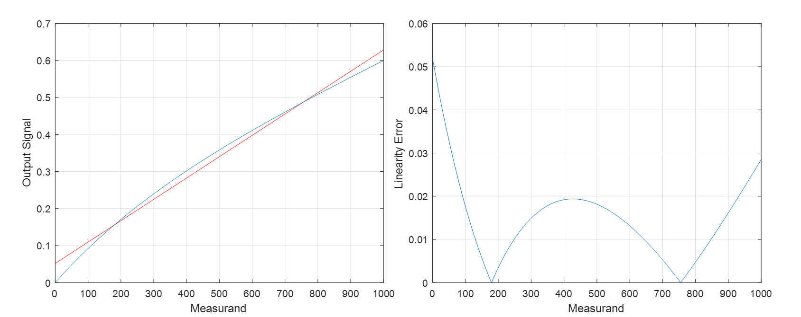
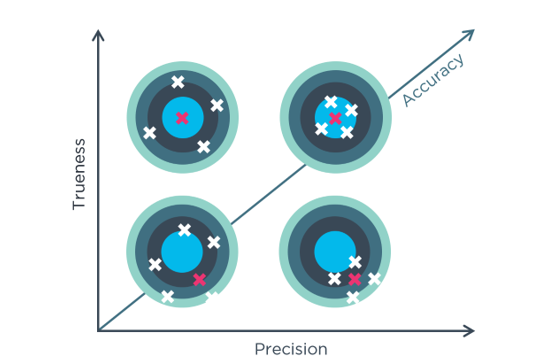

# SM · Unitat 1 · 5. Característiques estàtiques

## 📑 Índice de Contenidos

- [1 Règim permanent i funció de resposta](#1-règim-permanent-i-funció-de-resposta)
- [2 Sensibilitat i error de zero](#2-sensibilitat-i-error-de-zero)
- [3 Error de linealitat](#3-error-de-linealitat)
- [4 Exactitud, veracitat i fidelitat](#4-exactitud-veracitat-i-fidelitat)
- [5 Errors sistemàtics i aleatoris](#5-errors-sistemàtics-i-aleatoris)
- [6 Histèresi, zona morta i resolució](#6-histèresi-zona-morta-i-resolució)

---

[← Índex de la unitat](SM_U1_00_INDEX.md)
[1](SM_U1_01_Concepte_de_mesura.md "Concepte de mesura")[2](SM_U1_02_El_Sistema_Internacional_dUnitats.md "El Sistema Internacional d'Unitats")[3](SM_U1_03_Estructura_dels_sistemes_de_mesura.md "Estructura dels sistemes de mesura")[4](SM_U1_04_Sensors_definicio_i_classificacio.md "Sensors: definició i classificació")5[6](SM_U1_06_Caracteristiques_dinamiques.md "Característiques dinàmiques")

Sistemes de Mesura · Unitat 1 · Document 5 de 6

# Característiques estàtiques

Dedicació estimada: 12 minuts

> [!NOTE] **Objectius**
>
> 1. Definir la funció de resposta i justificar per què la invertibilitat condiciona el disseny.
> 2. Calcular sensibilitat i error de zero, i referir els errors a l'entrada.
> 3. Distingir les tres rectes d'aproximació i per què l'error de linealitat depèn de l'elecció.
> 4. Usar amb rigor exactitud, veracitat i fidelitat.
> 5. Estimar biaix i desviació estàndard identificant prèviament els valors aberrants.
> 6. Definir histèresi, zona morta i resolució.

## 1 Règim permanent i funció de resposta

Les **característiques estàtiques** descriuen el sistema quan el mesurand és constant o varia prou lentament perquè s'assoleixi el **règim permanent**. Sota aquesta hipòtesi el temps no hi intervé. **Deixen de descriure el sistema quan el mesurand varia ràpidament**, cas del document 6: aplicar una especificació estàtica —«exactitud ±0,1 %»— a una mesura dinàmica és l'error més comú en la lectura d'un full de característiques.

La **funció de resposta** lliga mesurand i indicació en règim permanent, i es determina per calibratge:

$$
y = f(x) \qquad (1.5)
$$

A la pràctica s'aproxima per un **model lineal**:

$$
y = S \cdot x + y_{0} \qquad (1.6)
$$

> [!TIP]
>
> La raó de fons per preferir la linealitat no és la comoditat sinó la **inversió**. L'objectiu no és obtenir  $y$  sinó estimar  $x$  a partir de  $y$:
>
>

$$
x = (y - y_{0}) / S \qquad (1.7)
$$

>
> Amb un model lineal la inversió són dues operacions; amb un polinomi de grau elevat o una exponencial caldrien mètodes numèrics iteratius, cosa rellevant en sistemes encastats amb bateria. **Tot disseny d'un sistema de mesura és, en el fons, un problema d'inversió.**

## 2 Sensibilitat i error de zero

La **sensibilitat absoluta** és la **derivada** de la funció de resposta:

$$
S = \frac{\mathrm{d}y}{\mathrm{d}x} \qquad (1.8)
$$

Les seves unitats són les de la sortida dividides per les de l'entrada: mV/°C, Ω/kg, pF/mm. En un sistema **lineal la derivada és constant** i el sensor respon igual a un canvi d'un grau a −20 °C i a +100 °C. En un de no lineal,  $S$  és funció de  $x$: un termistor NTC té sensibilitat molt alta a temperatures baixes i molt baixa a temperatures altes.

La **sensibilitat relativa** normalitza respecte de la sortida:

$$
S_{r} = (\frac{1}{y}) \cdot \frac{\mathrm{d}y}{\mathrm{d}x} \qquad (1.9)
$$

És útil quan l'error és proporcional a la lectura —l'especificació «error de l'1 % de la lectura»— però **no té les mateixes unitats que l'absoluta**. Als catàlegs, «sensibilitat» sense qualificar designa l'absoluta.

L'**error de zero** —també **offset**— és l'ordenada a l'origen  $y_{0}$: la indicació quan el mesurand val zero. És sistemàtic i, per tant, **corregible**: un cop estimat per calibratge, n'hi ha prou de restar-ne el valor com a constant. És el que fa la tara d'una bàscula.

> [!NOTE]
>
> Cal expressar-lo **referit a l'entrada**, dividint per la sensibilitat. Un error de 20 mV no significa res; amb  $S$  = 100 mV/°C equival a 0,2 °C, xifra que ja es pot comparar amb l'exigència de l'aplicació.

## 3 Error de linealitat

$$
e_{L}(x) = f(x) - (S \cdot x + y_{0}) \qquad (1.10)
$$

*Figura: Figura 1.8 — Error de linealitat. El full de característiques en dona el màxim.*

> [!IMPORTANT]
>
> **L'error de linealitat no és un nombre sinó una funció de  $x$.** Per consignar-lo se'n pren el màxim en valor absolut i s'expressa en percentatge del fons d'escala:
>
>

$$
e_{\text{L,\max}} (\% FSO) = 100 \cdot \max|e_{L}(x)| / y_{\text{FE}} \qquad (1.11)
$$

>
> Si interessa la bondat global i no el pitjor cas, s'usa el valor eficaç en lloc del màxim.

**L'error depèn de quina recta s'hagi triat**, i totes tres són legítimes:

- **Recta tangent**: Desenvolupament de Taylor al voltant d'un punt de treball. Minimitza l'error en aquest punt i el fa créixer als extrems. Natural si el sistema treballa sempre en un entorn reduït.
- **Recta de dos punts**: Passa pels extrems del rang —zero i span. Només necessita dos punts de calibratge, però força l'error a zero als extrems i el concentra al centre, on sovint arriba al màxim.
- **Mínims quadrats**: Minimitza la suma dels quadrats de les desviacions sobre tots els punts mesurats. Millor compromís global.

Comparar la linealitat de dos sensors de fabricants diferents exigeix comprovar que tots dos l'han definit sobre el mateix tipus de recta.

> [!EXAMPLE] **Exercici resolt 1 — Caracterització amb dos punts**
>
> Un sistema de temperatura lliura 2,02 V a 20 °C i 10,02 V a 100 °C. Es vol modelar com  $y$  = S x +  $y_{0}$.
>
> 

> 
<b>🔍 Desplegar Resolució</b>

>
> **Sensibilitat.** $S$ = (10,02 − 2,02)/(100 − 20) = 0,100 V/°C = **100 mV/°C**.
>
> **Error de zero.** $y_{0}$ = 2,02 − 0,100 × 20 = **0,020 V**. El model és $y$ = 0,100 $x$ + 0,020. Referit a l'entrada, $x_{0}$ = 20 mV / 100 mV/°C = **0,2 °C**: el termòmetre indica sistemàticament dues dècimes de més.
>
> **Linealitat en un tercer punt.** A 60 °C el sistema lliura 6,03 V i el model prediu 6,020 V, de manera que $e_{L}$ = 10 mV, és a dir **0,1 °C** referit a l'entrada.
>
> Tots els errors s'han expressat **referits a l'entrada**: dir «10 mV d'error» no informa de res fins que no es coneix la sensibilitat.
>
> 

## 4 Exactitud, veracitat i fidelitat

Al carrer «precís» i «exacte» són sinònims; en metrologia no, i tenen definicions normalitzades per la ISO 5725 i el vocabulari internacional de metrologia.

- **Exactitud**: Proximitat al valor veritable. Concepte global i qualitatiu. Quan un fabricant en dona xifra, es refereix a l'error total del pitjor cas.
- **Veracitat**: Proximitat entre la tendència central de moltes mesures repetides i el valor veritable. Absència d'errors sistemàtics. La seva manca es quantifica amb el biaix.
- **Fidelitat**: Proximitat entre resultats en les mateixes condicions, és a dir dispersió, amb independència que siguin correctes. Limitada pels errors aleatoris.

*Figura: Figura 1.9 — Analogia de la diana. Agrupats = fidelitat; centrats = veracitat. Exactitud = veracitat + fidelitat.*

> [!IMPORTANT]
>
> La combinació més perillosa és **molt fidel i poc veraç**. Repetir una mesura mil vegades i obtenir sempre el mateix transmet una confiança injustificada: un instrument descalibrat pot ser extraordinàriament fidel mentre menteix de manera consistent. És l'expressió quantitativa d'una idea del document 1: **l'objectivitat no garanteix la correcció**.

La fidelitat s'avalua en dues condicions normatives. La **repetibilitat** manté deliberadament constants operador, instrument, procediment, lloc i un interval curt: mesura la dispersió intrínseca. La **reproductibilitat** canvia operador, instrument, laboratori o moment. La reproductibilitat és sempre igual o pitjor, i una diferència gran entre ambdues indica que el resultat depèn de factors no controlats pel procediment.

## 5 Errors sistemàtics i aleatoris

|  | Error sistemàtic | Error aleatori |
|:--- |:--- |:--- |
| Es manifesta com | Biaix de la mitjana | Dispersió al voltant de la mitjana |
| Afecta | La veracitat | La fidelitat |
| En repetir | Es manté | Canvia de signe i de valor |
| Es redueix | Corregint-lo per calibratge | Promitjant lectures |
| Origen típic | Descalibratge, error de zero, efecte de càrrega | Soroll electrònic, turbulència, arrodoniment |

El **biaix** estima l'error sistemàtic comparant la mitjana d'un nombre elevat de lectures amb la sortida que hauria de donar el sistema:

$$
b = \bar{y} - y_{\text{ref}} \qquad (1.12)
$$

- **$\bar{y}$**: Mitjana de les $N$ lectures vàlides obtingudes en aplicar un patró de referència a l'entrada.
- **$y_{\text{ref}}$**: La sortida que produiria, per a aquest mateix patró, un sistema sense biaix. És el valor que es dedueix de la funció de resposta de referència, $y_{\text{ref}}$ = $S$ · $x_{p}$ + $y_{0}$, on $x_{p}$ és el valor convencionalment veritable del patró.

> [!IMPORTANT]
>
> Els dos termes de l'equació (1.12) han de ser **homogenis**: tots dos són sortides. Restar directament el valor del patró a la mitjana de les lectures només és correcte quan la sortida ja ve expressada en unitats del mesurand —el cas d'una bàscula que indica quilograms—, i és una font d'error habitual quan no ho és.
>
> Com amb l'error de zero, el biaix es pot expressar **referit a l'entrada** dividint-lo per la sensibilitat,  $b_{x}$  =  $b$ / $S$, que és la forma que permet comparar-lo amb l'exigència de l'aplicació.

La **dispersió** s'estima amb la desviació estàndard experimental de les lectures vàlides:

$$
s = \sqrt{\sum (y_{i} - \bar{y})^2 / (N - 1)} \qquad (1.13)
$$

El **calibratge** estableix la relació entre les indicacions i els valors de patrons de referència: **no modifica l'instrument, el caracteritza**. L'ajust posterior sí que el modifica. Cal repetir-lo periòdicament per la **deriva**: la variació lenta de les característiques amb el temps, la temperatura o l'ús.

Un **valor aberrant** —*outlier*— és una lectura incompatible amb la resta, atribuïble a una causa singular i no a la variabilitat normal. Descartar-lo és legítim si se'n justifica la causa o si ho avalen criteris fixats **abans** de mirar les dades; eliminar dades perquè no encaixen és manipulació. El que mai és admissible és **incloure'l sense revisar-lo**: distorsiona alhora la mitjana i la desviació estàndard, i per tant falseja el diagnòstic de veracitat i el de fidelitat.

## 6 Histèresi, zona morta i resolució

- **Histèresi**: Diferència entre les indicacions per a un mateix mesurand segons si s'hi arriba des de valors inferiors o superiors: la sortida depèn de la història prèvia. Prové de fregament, folgances, romanència magnètica, deformacions no elàstiques i absorció d'humitat o gasos. No es corregeix amb un simple calibratge, perquè caldria conèixer el sentit de l'aproximació.
- **Zona morta**: Interval del mesurand dins del qual una variació de l'entrada no produeix cap canvi apreciable de sortida. Apareix per fregaments estàtics o llindars de detecció. El sistema esdevé cec a variacions petites, cosa crítica en aplicacions d'alarma.
- **Resolució**: Canvi més petit del mesurand que produeix un canvi perceptible de la indicació. En sistemes digitals ve fixada pel bit menys significatiu.

> [!IMPORTANT]
>
> **Resolució, fidelitat i exactitud són tres coses diferents i cap implica les altres.** La resolució és el pas mínim representable; la fidelitat, com de juntes queden les lectures repetides; l'exactitud, com de prop queden del valor veritable. Afegir dígits a una indicació sorollosa només afegeix xifres sense contingut.

> [!EXAMPLE] **Exercici resolt 2 — Caracterització d'una bàscula**
>
> Amb un pes patró de 10,000 kg es prenen 11 lectures:
>
> 10,58 · 10,63 · 3,00 · 10,52 · 10,65 · 10,48 · 10,70 · 10,51 · 10,55 · 10,61 · 10,57 (kg)
>
> 

> 
<b>🔍 Desplegar Resolució</b>

>
> **Resolució.** Totes tenen dos decimals i el dígit menys significatiu varia d'unitat en unitat: **0,01 kg = 10 g**, deduït de les dades i no del catàleg.
>
> **Valor aberrant.** La tercera lectura, **3,00 kg**, és incompatible amb un objecte de 10 kg. Es descarta i queden $N$ = 10. Sense descartar-la la mitjana cauria a 9,89 kg i s'hauria conclòs, erròniament, que la bàscula és gairebé veraç: **un sol outlier hauria invertit el diagnòstic**.
>
> **Biaix i dispersió.** La bàscula indica directament en quilograms, de manera que la sortida de referència per al patró és $y_{\text{ref}}$ = 10,000 kg. Amb $\bar{y}$ = 10,580 kg resulta $b$ = **+0,58 kg**; $s$ = **0,068 kg**. El **biaix positiu** indica que la bàscula **sobreestima** el mesurand: indica sistemàticament 580 g de més. Veracitat molt baixa, fidelitat raonable.
>
> **Diagnòstic.** El biaix és vuit vegades la dispersió: domina l'error **sistemàtic**, i és bona notícia perquè es corregeix restant 0,58 kg.
>
> **Observació final.** La pantalla mostra dos decimals —resolució 0,01 kg— però la dispersió real és 0,068 kg, set vegades més. **El segon decimal no conté informació fiable**: està dominat pel soroll i no pel pes.
>
> 

Un sistema ideal tindria resposta lineal, sensibilitat alta i constant, error de zero nul, biaix nul, soroll nul, histèresi i zona morta nul·les i resolució infinita. Com que no existeix, la feina de l'enginyer és el millor compromís per a cada aplicació: **no hi ha sensors bons en abstracte, hi ha sensors adequats a un problema**.

> [!TIP] **Síntesi**
>
> 1. Descriuen el **règim permanent** i deixen de valer si el mesurand varia ràpid.
> 2. S'aproxima per una recta sobretot perquè la **inversió** sigui trivial.
> 3. **Sensibilitat** = pendent; **error de zero** = ordenada a l'origen. Els errors, referits a l'entrada.
> 4. L'**error de linealitat** és funció de  $x$  i depèn de la recta: tangent, dos punts o **mínims quadrats**.
> 5. **Exactitud = veracitat + fidelitat.** Biaix i dispersió les quantifiquen.
> 6. El **sistemàtic** es corregeix per calibratge; l'**aleatori**, promitjant.
> 7. Un **outlier** no tractat pot invertir el diagnòstic d'un instrument.

**Sistemes de Mesura** · Grau en Enginyeria Electrònica de Telecomunicacions · ETSETB — UPC

Unitat 1 · Document 5 de 6 · Materials de treball previ · Curs 2026-T

---
[← Document 4 Sensors: definició i classificació](SM_U1_04_Sensors_definicio_i_classificacio.md) • [Document 6 → Característiques dinàmiques](SM_U1_06_Caracteristiques_dinamiques.md)

---

## 📐 Formulario Resumen de Ecuaciones

| Nº / Ref | Expresión Matemática |
| :---: | :--- |
| **(1.5)** | $y = f(x)$ |
| **(1.6)** | $y = S \cdot x + y_{0}$ |
| **(1.7)** | $x = (y - y_{0}) / S$ |
| **(1.8)** | $S = \frac{\mathrm{d}y}{\mathrm{d}x}$ |
| **(1.9)** | $S_{r} = (\frac{1}{y}) \cdot \frac{\mathrm{d}y}{\mathrm{d}x}$ |
| **(1.10)** | $e_{L}(x) = f(x) - (S \cdot x + y_{0})$ |
| **(1.11)** | $e_{\text{L,\max}} (\% FSO) = 100 \cdot \max\|e_{L}(x)\| / y_{\text{FE}}$ |
| **(1.12)** | $b = \bar{y} - y_{\text{ref}}$ |
| **(1.13)** | $s = \sqrt{\sum (y_{i} - \bar{y})^2 / (N - 1)}$ |