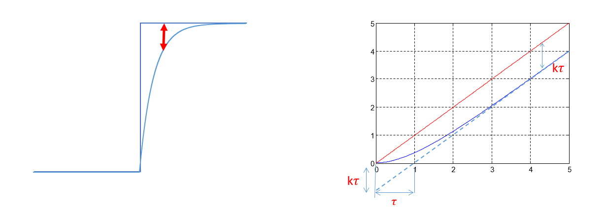
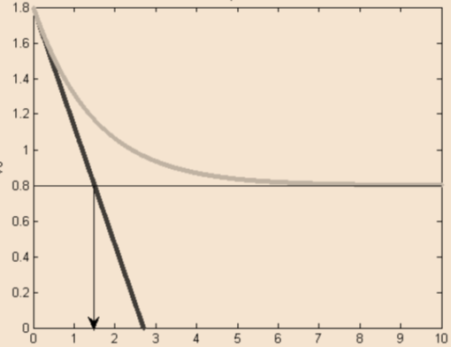
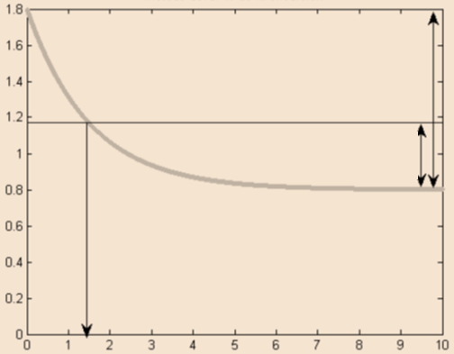
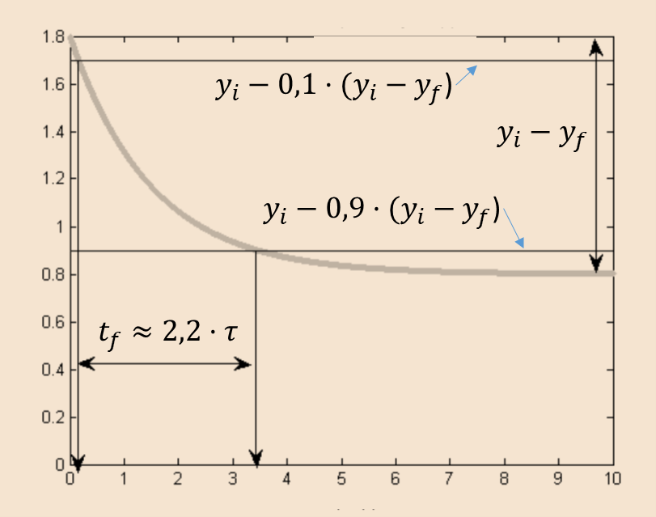
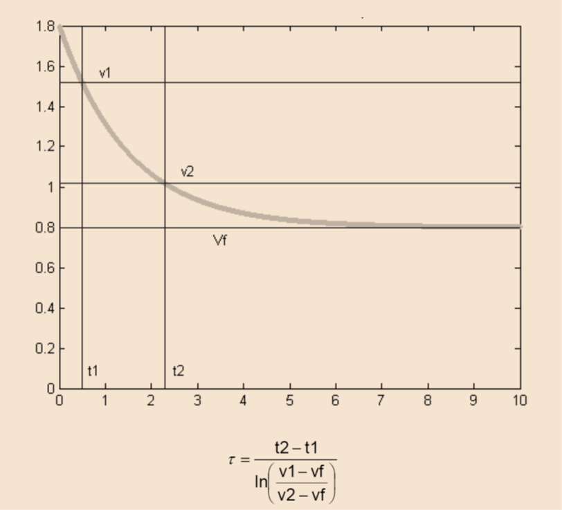

# SM · Unitat 1 · 6. Característiques dinàmiques

## 📑 Índice de Contenidos

- [1 Quan el mesurand varia](#1-quan-el-mesurand-varia)
- [2 Tres models](#2-tres-models)
- [3 Resposta del sistema de primer ordre](#3-resposta-del-sistema-de-primer-ordre)
- [4 Estimació de la constant de temps d'un primer ordre](#4-estimació-de-la-constant-de-temps-dun-primer-ordre)
- [5 Una excepció](#5-una-excepció)

---

[← Índex de la unitat](SM_U1_00_INDEX.md)
[1](SM_U1_01_Concepte_de_mesura.md "Concepte de mesura")[2](SM_U1_02_El_Sistema_Internacional_dUnitats.md "El Sistema Internacional d'Unitats")[3](SM_U1_03_Estructura_dels_sistemes_de_mesura.md "Estructura dels sistemes de mesura")[4](SM_U1_04_Sensors_definicio_i_classificacio.md "Sensors: definició i classificació")[5](SM_U1_05_Caracteristiques_estatiques.md "Característiques estàtiques")6

Sistemes de Mesura · Unitat 1 · Document 6 de 6

# Característiques dinàmiques

Dedicació estimada: 9 minuts

> [!NOTE] **Objectius**
>
> 1. Decidir quan el model estàtic continua sent vàlid.
> 2. Distingir ordre zero, primer ordre i segon ordre.
> 3. Relacionar la constant de temps amb la freqüència de tall i amb l'error dinàmic.
> 4. Justificar per què un primer ordre no segueix mai una rampa sense error.
> 5. Estimar la constant de temps d'una resposta a esglaó registrada.

## 1 Quan el mesurand varia

El document 5 pressuposa el mesurand constant. A la pràctica molts són dinàmics: la pressió d'una canonada en obrir una vàlvula, la temperatura d'un component en engegar, l'acceleració en un impacte. Llavors el sistema **no pot seguir el mesurand instantàniament** i la sortida és una versió distorsionada en el temps de l'entrada.

> [!TIP]
>
> **Si la dinàmica del sistema és molt més ràpida que la del mesurand**, el model estàtic val i aquest document és innecessari. **Si no**, cal modelar-lo com un sistema dinàmic lineal i caracteritzar-lo per la resposta freqüencial o per les respostes a esglaó i a rampa. Si no és lineal hi ha mètodes més sofisticats, fora de l'abast del curs.

Aquest error és de naturalesa distinta: un sistema perfectament calibrat, amb error de zero nul i linealitat impecable, pot lliurar una indicació completament incorrecta si el mesurand varia massa ràpid. **Cap característica estàtica no ho detecta**, perquè totes suposen el mesurand quiet.

## 2 Tres models

> [!TIP]
>
> **Tot sistema de mesura real té limitacions de sistema passa-baix.** Cap dispositiu físic no pot respondre instantàniament, perquè qualsevol element que emmagatzemi energia —una massa tèrmica, una inèrcia mecànica, una capacitat paràsita, l'ample de banda finit d'un amplificador— introdueix un retard. Per damunt d'una certa freqüència, doncs, **tot sistema de mesura atenua i desfasa**.
>
> Per això el model d'ordre zero és una **idealització**: descriu bé un sistema real només dins d'una banda de freqüències prou per sota del seu límit.
>
> La pregunta pertinent no és, per tant, si el sistema és passa-baix, sinó *on* té el límit i si el mesurand hi queda prou per sota.

| Model | Caracterització | Comportament |
|:--- |:--- |:--- |
| **Ordre zero** | Només la sensibilitat  $S$ | Ideal: resposta plana, sense retard ni distorsió, error dinàmic nul. Un potenciòmetre de posició s'hi aproxima. |
| **Primer ordre** | Una **constant de temps**  $\tau$ | **Filtre passa-baix**: segueix bé les variacions lentes i atenua les ràpides. És el més freqüent. |
| **Segon ordre** | Freqüència natural  $\omega_{n}$  i amortiment  $\zeta$ | Dos elements d'emmagatzematge d'energia. Pot oscil·lar. Acceleròmetres, micròfons, manòmetres de tub. |

$$
y(t) = S \cdot x(t) \qquad (1.14)
$$

$$
H(s) = S / (1 + \tau s) \qquad (1.15)
$$

$$
H(s) = S \cdot \omega _{n}^2 / (s^2 + 2 \zeta \omega _{n}s + \omega _{n}^2) \qquad (1.16)
$$

Corresponen a primer ordre els termòmetres —on  $\tau$  depèn de la massa tèrmica i del coeficient de transferència de calor— i, en general, qualsevol sistema amb una sola capacitat i una sola resistència. Al segon ordre el comportament depèn de l'amortiment: amb  $\zeta$  petit oscil·la i presenta pic a la resposta freqüencial; amb  $\zeta$  gran no oscil·la però respon lentament. El compromís habitual en instrumentació és  $\zeta$  ≈ 0,7.

## 3 Resposta del sistema de primer ordre

> [!IMPORTANT]
>
> Tot el que segueix en aquesta secció —la constant de temps, la freqüència de tall, el 63,2 % i el retard davant d'una rampa— **val exclusivament per a sistemes de primer ordre**. Un sistema de segon ordre no queda descrit per un únic paràmetre temporal: necessita la freqüència natural i el coeficient d'amortiment, i la seva resposta a un esglaó pot presentar sobreoscil·lació, cosa que cap expressió d'aquesta secció no recull.

La resposta d'un sistema de primer ordre a un esglaó és una exponencial:

$$
y(t) = y_{f} + (y_{i} - y_{f}) \cdot e^{-t/ \tau} \qquad (1.17)
$$

*Figura: Figura 1.10 — Resposta d'un primer ordre a un esglaó i a una rampa.*

> [!NOTE]
>
> La **constant de temps** és el temps per recórrer el **63,2 %** de l'excursió total, o equivalentment per reduir al 36,8 % el que quedava. Després de **5 $\tau$**  la resposta ha recorregut més del 99 % i es considera assentada.

$$
f_{c} = \frac{1}{2 \pi \tau } \qquad (1.18)
$$

Aquesta és la **freqüència de tall del primer ordre**, i la relació és inversa: **reduir  $\tau$  eixampla l'ample de banda**. Un termòmetre amb  $\tau$  = 2 s té  $f_{c}$  = 0,08 Hz i no serveix per registrar fluctuacions d'un hertz per exacte que sigui en règim permanent.

> [!IMPORTANT]
>
> Davant d'una **rampa**, passat el transitori la sortida creix amb la mateixa pendent però **desplaçada un retard constant igual a  $\tau$**. L'error de seguiment **no s'anul·la mai**: un primer ordre **no atrapa mai una rampa**, assoleix la seva velocitat però no la seva posició. En un llaç de control amb consigna creixent, el regulador treballa permanentment amb informació desfasada.

L'**error dinàmic** és la diferència entre el valor indicat i el real, atribuïble només a la incapacitat de seguir les variacions. El **concepte és general** i s'aplica a qualsevol ordre; el que és propi del primer ordre és la seva quantificació mitjançant una única constant de temps. Té tres propietats:

1. **No és constant**: depèn de l'instant i de la forma d'ona, i no es pot resumir en una xifra de catàleg.
2. **No es corregeix per calibratge**: no prové d'un desajust sinó d'una limitació d'ample de banda.
3. **És predictible** si es coneixen el model i l'entrada. En això s'assembla a un error sistemàtic i es diferencia del soroll.

Aquesta previsibilitat permet **compensar el retard per processament digital**, tot i que la compensació amplifica el soroll d'alta freqüència i el marge de millora queda limitat per la qualitat del senyal.

## 4 Estimació de la constant de temps d'un primer ordre

Els cinc mètodes següents pressuposen que el sistema és de **primer ordre**; aplicats a un de segon ordre amb amortiment baix donen resultats sense sentit. Aixecar tota la resposta freqüencial exigiria injectar sinusoides una per una; en canvi **una sola resposta a esglaó registrada conté tota la informació**. Cinc mètodes, de més senzill a més robust, sobre un esglaó descendent:

1. **Pendent inicial.** Es traça la tangent en l'instant de l'esglaó i es prolonga fins al valor final; l'abscissa de la intersecció és  $\tau$.
2. **63 % de l'excursió.** Es busca l'instant en què la resposta n'ha recorregut el 63,2 %.
3. **Temps de transició 10 %–90 %.** Per a un primer ordre la relació és fixa. No cal determinar l'instant de l'esglaó, cosa còmoda sobre l'oscil·loscopi.
4. **Dos instants arbitraris.** Mètode general per logaritmes. Serveix amb qualsevol parell de punts, però **exigeix conèixer  $y_{f}$  amb precisió**, i aquesta dependència és el seu punt feble.
5. **Mínims quadrats.** S'ajusta el model exponencial complet sobre totes les dades.

$$
t_{10-90} \approx 2{,}2 \tau \implies \tau \approx t_{10-90} / 2{,}2 \qquad (1.19)
$$

$$
\tau = (t_{2} - t_{1}) / \ln[(y_{1} - y_{f}) / (y_{2} - y_{f})] \qquad (1.20)
$$

*Figura: Figura 1.11 — Mètode del pendent inicial.*

*Figura: Figura 1.12 — Mètode del 63 % de l'excursió.*

*Figura: Figura 1.13 — Mètode del temps de transició 10 %–90 %.*

*Figura: Figura 1.14 — Mètode dels dos instants arbitraris.*

> [!TIP]
>
> Amb soroll, els quatre primers donen valors lleugerament diferents perquè cadascun depèn d'uns pocs punts. Els **mètodes 1 a 4 són gràfics i ràpids**, per estimar sobre la marxa amb l'oscil·loscopi; el **cinquè és numèric i robust**, perquè utilitza tota la informació registrada, i és el que correspon quan el resultat ha de sostenir una decisió. Cal situar l'esglaó a l'origen de temps i considerar només les mostres posteriors.

## 5 Una excepció

Tot sistema té un límit superior de banda, però alguns en tenen també un d'inferior. Els sensors **piezoelèctrics** i **piroelèctrics** són **passa-banda**, perquè tenen **resposta nul·la en contínua**. Un piezoelèctric no pot mesurar una magnitud constant: davant d'una força estàtica genera una càrrega inicial que es descarrega per la resistència de fuita fins que la indicació torna a zero, tot i que la força continuï. Són excel·lents per a vibracions, impactes i transitoris, i inservibles per a mesures estàtiques.

> [!TIP] **Síntesi**
>
> 1. Calen quan la dinàmica del mesurand no és molt més lenta que la del sistema. **Tot sistema real és passa-baix** per damunt d'alguna freqüència.
> 2. **Ordre zero** (ideal), **primer ordre** (una constant de temps), **segon ordre** (freqüència natural i amortiment).
> 3. Per al **primer ordre**:  $\tau$  = temps per recórrer el **63,2 %**, i a 5 $\tau$  es considera assentada.
> 4. $f_{c}$  = 1/(2π $\tau$ ): reduir  $\tau$  eixampla l'ample de banda.
> 5. Davant d'una **rampa**, el primer ordre queda endarrerit  $\tau$  permanentment.
> 6. L'**error dinàmic** no és constant ni es corregeix per calibratge, però **és predictible**.
> 7. Els **piezoelèctrics** són passa-banda i no serveixen per a mesures estàtiques.

**Sistemes de Mesura** · Grau en Enginyeria Electrònica de Telecomunicacions · ETSETB — UPC

Unitat 1 · Document 6 de 6 · Materials de treball previ · Curs 2026-T

---
[← Document 5 Característiques estàtiques](SM_U1_05_Caracteristiques_estatiques.md) • [Has acabat → Torna a l'índex de la unitat](SM_U1_00_INDEX.md)

---

## 📐 Formulario Resumen de Ecuaciones

| Nº / Ref | Expresión Matemática |
| :---: | :--- |
| **(1.14)** | $y(t) = S \cdot x(t)$ |
| **(1.15)** | $H(s) = S / (1 + \tau s)$ |
| **(1.16)** | $H(s) = S \cdot \omega _{n}^2 / (s^2 + 2 \zeta \omega _{n}s + \omega _{n}^2)$ |
| **(1.17)** | $y(t) = y_{f} + (y_{i} - y_{f}) \cdot e^{-t/ \tau}$ |
| **(1.18)** | $f_{c} = \frac{1}{2 \pi \tau }$ |
| **(1.19)** | $t_{10-90} \approx 2{,}2 \tau \implies \tau \approx t_{10-90} / 2{,}2$ |
| **(1.20)** | $\tau = (t_{2} - t_{1}) / \ln[(y_{1} - y_{f}) / (y_{2} - y_{f})]$ |