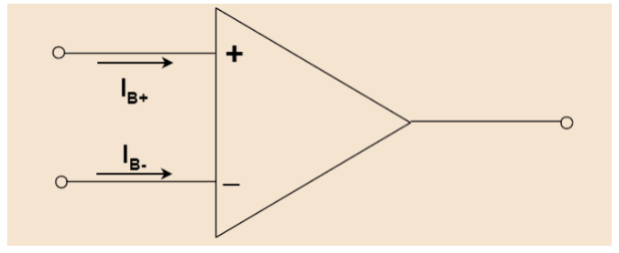
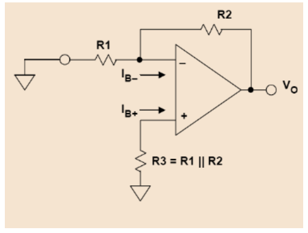
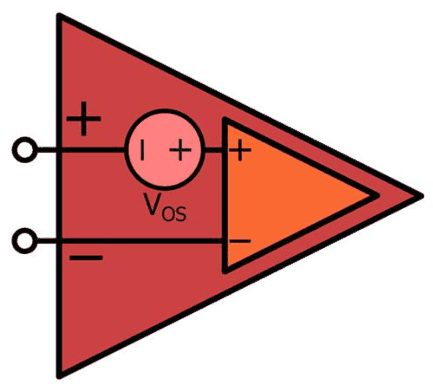

# Condicionament singular: sensors, l'operacional real i les seves derives

## 📑 Índice de Contenidos

- [1 Sensors singulars](#1-sensors-singulars)
  - [El límit de l'amplificador de propòsit general](#el-límit-de-lamplificador-de-propòsit-general)
- [2 L'operacional real: errors estàtics](#2-loperacional-real-errors-estàtics)
- [3 Derives: temperatura i envelliment](#3-derives-temperatura-i-envelliment)
- [4 Soroll: blanc i 1/f](#4-soroll-blanc-i-1f)
- [5 Tecnologies d'entrada](#5-tecnologies-dentrada)

---

Sistemes de Mesura · **Unitat 10 — Condicionament singular de senyals** · Document 1 de 5

# Condicionament singular: sensors, l'operacional real i les seves derives

Dedicació estimada: 12 minuts

> [!NOTE] **Objectius d'aprenentatge**
>
> - Justificar per què determinats sensors exigeixen una electrònica de condicionament amb prestacions especials.
> - Classificar un sensor singular segons si el problema dominant és el nivell de senyal o la impedància de sortida.
> - Identificar les fonts d'error estàtiques d'un amplificador operacional real i quantificar-ne l'efecte a la sortida.
> - Relacionar la tecnologia de l'etapa d'entrada amb l'ordre de magnitud de l'offset, del corrent de polarització, de les derives i del soroll.
> - Distingir el soroll blanc del soroll 1/f i situar la freqüència de cantonada.

Hi ha mesures on les topologies genèriques de condicionament —amplificadors inversors i no inversors amb un operacional de propòsit general, ponts resistius— no arriben: la temperatura d'un forn industrial amb un termoparell, una radiació infraroja feble amb un sensor piroelèctric, el corrent d'un fotodíode en un espectrofotòmetre o les vibracions d'un rodament amb un acceleròmetre piezoelèctric. La tensió a amplificar pot quedar soterrada sota els errors de contínua de l'electrònica; la impedància de sortida del sensor pot ser prou alta perquè qualsevol amplificador convencional el carregui i en faci desaparèixer el senyal; o el mesurand pot venir representat per una càrrega elèctrica que fuig per qualsevol camí resistiu mal dimensionat. L'objectiu del condicionament, en tots tres casos, és preservar la relació entre el mesurand i el senyal elèctric que arriba al convertidor, de manera que l'electrònica no hi introdueixi una deformació dominant.

## 1 Sensors singulars

> [!WARNING] **Sensor singular**
>
> Sensor que, **per les característiques elèctriques de la seva sortida**, exigeix una electrònica amb prestacions especials i escollida amb cura. La singularitat és una propietat del senyal elèctric que lliura —nivell, impedància o càrrega—, i és compatible amb topologies de circuit d'aparença modesta.

Aquesta classificació és electrònica i complementa la classificació física habitual —termoparells, piezoelèctrics, piroelèctrics, fotodíodes—, que agrupa els sensors per la magnitud que mesuren i pel fenomen que hi intervé. Des del punt de vista del circuit, els sensors d'interès es reparteixen en dos blocs segons quin sigui el problema dominant.

| Bloc | Exemples | Problema dominant |
|:--- |:--- |:--- |
| **Tensió molt petita fins a la contínua** | Termoparells; ponts de galgues extensiomètriques piezorresistives en mesures d'esforços reduïts. | El senyal útil, de microvolts a alguns mil·livolts i concentrat entre la contínua i fraccions d'hertz, conviu amb els errors de contínua i les derives lentes de l'electrònica. Un canvi de la tensió d'offset és indistingible d'un canvi del mesurand. El soroll 1/f hi és màxim. |
| **Impedància de sortida molt elevada** | Piezoelèctrics, piroelèctrics, fotodíodes i fototransistors; sondes de pH i elèctrodes de ió selectiu, amb impedàncies de desenes de MΩ a alguns GΩ. | L'entrada de l'amplificador carrega el sensor i en redueix la sensibilitat efectiva. Com que la impedància del sensor sovint és capacitiva, la càrrega també en deforma la resposta freqüencial. Cal, alhora, gestionar les capacitats i les fuites paràsites del cablejat i de la placa. |

Els dos blocs porten a tres famílies de circuits: els **amplificadors de baixes derives**, per a tensions molt petites amb contingut fins a la contínua; els **amplificadors electromètrics i de transimpedància**, per a impedàncies de sortida extraordinàriament elevades; i els **amplificadors de càrrega**, que donen una tensió proporcional a la càrrega generada pel sensor i s'empren sobretot amb piezoelèctrics i piroelèctrics.

### El límit de l'amplificador de propòsit general

Un amplificador de propòsit general és un operacional pensat per a un ventall ampli d'aplicacions, amb prestacions equilibrades: guany en llaç obert de l'ordre de $10^{5}$, tensió d'offset que pot arribar a alguns mil·livolts, corrent de polarització de desenes o centenars de nanoampers amb entrada bipolar i de picoampers amb entrada FET, i amplada de banda d'alguns MHz. Per a moltíssimes aplicacions aquestes prestacions són suficients, i deixen de ser-ho en tres situacions representatives.

| Mesura | Senyal útil | Error de l'electrònica |
|:--- |:--- |:--- |
| Termoparell tipus K, resolució d'una dècima de grau | Sensibilitat de 41 μV/°C: cal discriminar 4 μV | Una tensió d'offset típica de 3 mV és tres ordres de magnitud més gran. Fins i tot ajustada, petits canvis de temperatura del circuit integrat en desplacen el valor desenes o centenars de μV. |
| Fotodíode en mode fotoconductor | Corrents fotogenerats molt reduïts, amb corrents d'obscuritat d'alguns pA | Un corrent de polarització de 100 nA és desenes de milers de vegades superior al senyal, i les seves variacions són ja de l'ordre del corrent que es vol mesurar. |
| Sensor piezoelèctric | Càrrega sobre una capacitat d'alguns nF amb resistència de fuita molt elevada | La impedància d'entrada de l'amplificador carrega el sensor, en redueix la sensibilitat efectiva i n'altera la resposta freqüencial. |

Quan el senyal útil és comparable als errors intrínsecs del component, o quan la impedància del sensor és prou alta perquè l'amplificador hi interfereixi apreciablement, calen circuits especialitzats amb prestacions millorades en aspectes molt concrets: tensió d'offset i les seves derives, corrent de polarització, impedància d'entrada, soroll i estabilitat temporal. El que fa singulars aquests circuits és l'elecció acurada dels components, les xarxes de compensació, l'ús d'operacionals especials i, sovint, tècniques de disseny físic —guardes, apantallaments, cables triboelèctricament estables, control de la humitat— innecessàries en aplicacions convencionals.

> [!WARNING] **Punt de partida del disseny**
>
> L'arquitectura es tria a partir del **model elèctric del sensor** —nivell de senyal, impedància de sortida i la seva naturalesa, banda útil— i del paràmetre d'error que hi domina. El guany, el repartiment en etapes i la banda passant se'n deriven.

## 2 L'operacional real: errors estàtics

Al símbol de l'amplificador operacional ideal, el model real hi afegeix una font de tensió en sèrie amb una de les entrades, que modela la tensió d'offset  $V_{\text{os}}$; dues fonts de corrent que modelen els corrents de polarització  $I_{B+}$  i  $I_{B-}$  que entren pels terminals no inversor i inversor; fonts de soroll de tensió i de corrent referides a l'entrada; i un guany diferencial en llaç obert  $A_{\text{OL}}$  modelat com una funció de transferència amb un o diversos pols.

*Figura: Figura 10.1 Modelització dels corrents de polarització.*

> [!WARNING] **Corrent de polarització i corrent d'offset**
>
> El **corrent de polarització**  $I_B$  és la mitjana dels corrents que entren pels dos terminals d'entrada. El **corrent d'offset**  $I_{\text{OS}}$  és la **diferència** entre tots dos, i té l'origen en les asimetries del parell diferencial d'entrada. Tots dos són corrents: es mesuren en ampers.

L'ordre de magnitud d'aquests corrents depèn dràsticament de la tecnologia de l'etapa d'entrada. En operacionals d'entrada bipolar,  $I_B$  arriba a centenars de nanoampers en dispositius antics —el μA741 té una  $I_B$  típica de 80 nA— i baixa a alguns nanoampers amb tècniques de cancel·lació interna. Amb etapa d'entrada JFET o CMOS,  $I_B$  és de l'ordre de picoampers, i de femtoampers en components electromètrics específics. La relació entre tots dos corrents també hi canvia: en bipolars,  $I_{\text{OS}}$  sol quedar entre el 10 % i el 25 % de  $I_B$; en FET i CMOS,  $I_B$  és ja tan petit que les asimetries el fan comparable a  $I_{\text{OS}}$.

*Figura: Figura 10.2 Efecte dels corrents de polarització associat a les resistències del circuit.*

Els corrents de polarització es tradueixen en error de contínua només quan circulen per les resistències del circuit. Amb  $R_1$  i  $R_2$  a la xarxa de realimentació i una resistència  $R_3$  entre el terminal no inversor i massa, la tensió d'error a la sortida és

$$
V_{out,err} = -I_B^{+}\cdot R_3\cdot\left(1+\frac{R_2}{R_1}\right) + I_B^{-}\cdot R_2 \qquad (10.1)
$$

Escollint  $R_3 = R_1\|R_2$, els dos termes es compensen fins a deixar només la part deguda a l'asimetria:

$$
V_{out,err} = -I_{\text{OS}}\cdot R_2 \qquad (10.2)
$$

La reducció és real quan  $I_B \gg I_{\text{OS}}$, és a dir, en amplificadors d'entrada bipolar. En qualsevol cas, el producte del corrent per la resistència apareix a la sortida com un terme additiu —un desplaçament del zero— el valor del qual depèn de les resistències externes del circuit.

*Figura: Figura 10.3 Modelització de la tensió d'offset.*

La tensió d'offset es modela com una font de tensió referida a l'entrada, de manera que a la sortida hi apareix multiplicada pel guany que el circuit aplica a una tensió present entre els terminals d'entrada. Els bipolars presenten típicament desenes de microvolts a alguns mil·livolts; els JFET i CMOS, centenars de microvolts fins a desenes de mil·livolts en el pitjor cas; els de precisió, desenes de microvolts; i els chopper i autozero baixen per sota del microvolt.

## 3 Derives: temperatura i envelliment

Els errors de contínua no són constants. Un error constant es calibra una vegada i es corregeix numèricament; un error que deriva exigeix correcció dinàmica o estratègies de mesura especials. La deriva tèrmica de  $V_{\text{os}}$  és el paràmetre que separa les famílies d'amplificadors, i recorre tres ordres de magnitud entre els bipolars de propòsit general i els dispositius de correcció dinàmica.

L'envelliment provoca canvis lents de  $V_{\text{os}}$, quantificats en μV/mes o μV per cada 1000 h. En sistemes de llarga durada —monitorització industrial, equipament mèdic— aquests canvis són rellevants i imposen calibratges periòdics: el zero d'avui no és el zero d'un any vista.

El corrent de polarització també deriva. En bipolars,  $I_B$  disminueix lleugerament amb la temperatura. En JFET i CMOS creix exponencialment, doblant-se aproximadament cada 10 °C: un component electromètric amb 5 fA a 25 °C arriba a uns tres-cents femtoampers a 85 °C.

## 4 Soroll: blanc i 1/f

El soroll aleatori dels components interns es modela com una font de tensió en sèrie amb l'entrada i dues fonts de corrent en paral·lel amb cada terminal d'entrada. Les seves densitats espectrals tenen dues contribucions.

| Contribució | Densitat espectral | Origen |
|:--- |:--- |:--- |
| **Soroll blanc** | Plana amb la freqüència; domina a freqüències mitjanes i altes | Soroll tèrmic de les resistències internes del parell diferencial i soroll de *shot* dels corrents de base o de porta. |
| **Soroll 1/f** | Inversament proporcional a la freqüència; domina a freqüències baixes | Captures i alliberaments aleatoris de portadors en defectes de les interfícies Si-$SiO_{2}$ i en imperfeccions de les unions. |

> [!WARNING] **Freqüència de cantonada**
>
> Freqüència a la qual les densitats espectrals de les dues contribucions s'igualen (*corner frequency*). És un paràmetre característic de cada amplificador i separa a la pràctica la zona dominada pel soroll 1/f de la dominada pel soroll blanc.

El que arriba a la sortida és la **integral** de la densitat espectral sobre la banda passant del sistema, i és aquesta tensió de soroll RMS la que s'ha de comparar amb la resolució de mesura. D'aquí surt un criteri de disseny que travessa tota la unitat: la banda útil es limita al necessari per capturar la dinàmica del mesurand, perquè eixamplar-la afegeix soroll sense afegir informació. Per a senyals lents —el condicionament de termoparells n'és el cas paradigmàtic— el soroll 1/f s'integra sobre tota la banda útil i se suma a les derives lentes.

## 5 Tecnologies d'entrada

| Tecnologia | $V_{\text{os}}$  típic | Deriva | $I_B$  típic | Soroll de tensió @1 kHz | Soroll 1/f |
|:--- |:--- |:--- |:--- |:--- |:--- |
| Bipolar general | 1–5 mV | 5–20 μV/°C | 10–500 nA | 10–30 nV/√Hz | Moderat |
| Bipolar precisió | 10–50 μV | 0,1–1 μV/°C | 1–20 nA | 2–10 nV/√Hz | Baix |
| JFET | 0,5–5 mV | 5–20 μV/°C | 10–100 pA | 10–30 nV/√Hz | Moderat |
| CMOS | 1–20 mV | 5–30 μV/°C | 0,1–10 pA | 20–100 nV/√Hz | Alt |
| CMOS precisió | 50–500 μV | 1–5 μV/°C | 0,1–5 pA | 10–30 nV/√Hz | Moderat |
| Chopper / autozero | 0,1–5 μV | 0,005–0,05 μV/°C | 1–100 pA | 20–60 nV/√Hz | Negligible |

Cap tecnologia és òptima en tots els paràmetres alhora, i l'elecció depèn de quin domina en l'aplicació concreta. Els valors concrets varien notablement entre dispositius d'una mateixa família, de manera que el full de característiques del component escollit és la font vàlida per al pressupost d'error.

En les aplicacions d'aquesta unitat, les limitacions crítiques són les **estàtiques i el soroll**, perquè els senyals són de molt baix nivell i de baixa freqüència. Les limitacions dinàmiques hi tenen un paper concret: el guany en llaç obert finit i la seva caiguda amb la freqüència condicionen la resposta freqüencial dels amplificadors de càrrega i l'estabilitat de les topologies d'alta impedància.

> [!TIP] **Síntesi**
>
> Un sensor és singular per les característiques elèctriques de la seva sortida, i es classifica segons si el problema dominant és el nivell de senyal —tensions de microvolts amb contingut fins a la contínua— o la impedància de sortida, sovint capacitiva. El model de l'operacional real hi afegeix  $V_{\text{os}}$,  $I_{B+}$  i  $I_{B-}$, fonts de soroll de tensió i de corrent i un guany en llaç obert finit amb pols. Els corrents de polarització es tradueixen en error només en circular per resistències, i amb  $R_3 = R_1\|R_2$  l'error residual queda en  $I_{\text{OS}}\cdot R_2$. Els errors de contínua deriven amb la temperatura i amb l'envelliment: l'error constant es calibra, el que deriva exigeix correcció dinàmica. El soroll té una component blanca i una component 1/f que s'igualen a la freqüència de cantonada, i el que compta és la seva integral sobre la banda útil. La tecnologia de l'etapa d'entrada fixa simultàniament offset, corrent de polarització, deriva i soroll, sense que cap sigui òptima en tots alhora.

[2. Amplificadors de baixes derives: compensació de la polarització i ajust d'offset →](02_Unitat10_Amplificadors_de_baixes_derives.md)

---

## 📐 Formulario Resumen de Ecuaciones

| Nº / Ref | Expresión Matemática |
| :---: | :--- |
| **(10.1)** | $V_{out,err} = -I_B^{+}\cdot R_3\cdot\left(1+\frac{R_2}{R_1}\right) + I_B^{-}\cdot R_2$ |
| **(10.2)** | $V_{out,err} = -I_{\text{OS}}\cdot R_2$ |