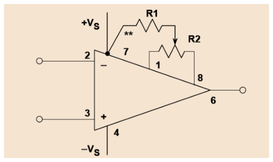
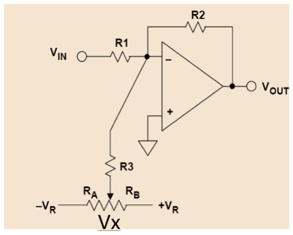
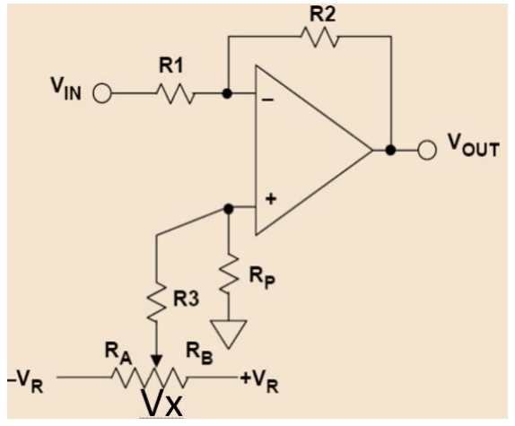
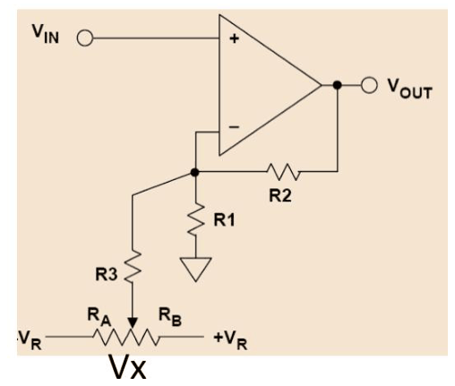

# Amplificadors de baixes derives: compensació de la polarització i ajust d'offset

## 📑 Índice de Contenidos

- [1 L'especificació del problema](#1-lespecificació-del-problema)
- [2 Compensació dels corrents de polarització](#2-compensació-dels-corrents-de-polarització)
- [3 Compensació de la tensió d'offset](#3-compensació-de-la-tensió-doffset)
  - [Ajust intern](#ajust-intern)
  - [Compensació externa](#compensació-externa)
  - [Tria de la tensió de referència](#tria-de-la-tensió-de-referència)

---

Sistemes de Mesura · **Unitat 10 — Condicionament singular de senyals** · Document 2 de 5

# Amplificadors de baixes derives: compensació de la polarització i ajust d'offset

Dedicació estimada: 10 minuts

> [!NOTE] **Objectius d'aprenentatge**
>
> - Escriure les condicions que ha de satisfer un amplificador destinat a un senyal de microvolts amb contingut fins a la contínua.
> - Decidir si la compensació dels corrents de polarització amb una resistència auxiliar és aplicable a una tecnologia d'entrada donada.
> - Reconèixer el guany de soroll com el factor que multiplica la tensió d'offset a la sortida.
> - Dimensionar una xarxa externa de compensació d'offset i la seva tensió de referència.
> - Justificar les limitacions de qualsevol compensació estàtica davant d'excursions tèrmiques i d'envelliment.

La mesura de temperatura amb termoparells és l'aplicació industrial més estesa del problema que motiva aquest document: amplificar una tensió contínua amb variacions de l'ordre del microvolt sense que els errors i les derives de l'electrònica enfosqueixin el senyal útil.

## 1 L'especificació del problema

Les sensibilitats dels termoparells van d'uns 5 μV/°C per al tipus B (platí-rodi) a uns 60 μV/°C per al tipus E (crom-constantà), amb els valors intermedis dels tipus K (41 μV/°C), J (52 μV/°C), T (43 μV/°C) i N (39 μV/°C). Resoldre una dècima de grau amb un tipus K vol dir discriminar canvis de 4,1 μV; resoldre una centèsima —exigència gens excepcional en metrologia o en calorimetria— desplaça la resolució a 0,41 μV, ja dins del terreny on el soroll tèrmic d'una resistència de pocs kΩ i l'agitació tèrmica del parell diferencial d'entrada són comparables al senyal.

El contingut freqüencial del senyal agreuja el problema. Les dinàmiques tèrmiques dels forns industrials, dels processos químics, dels rodaments d'una màquina o d'un cos humà rarament presenten variacions significatives per sobre d'alguns hertzs, de manera que gran part de la potència espectral es concentra entre la contínua i fraccions d'hertz. Aquesta és exactament la regió on l'operacional real presenta els seus pitjors defectes: les derives d'offset són contínues per definició i ocupen exactament la mateixa banda que el senyal útil —de manera que la separació entre totes dues per filtratge lineal queda descartada—, el soroll 1/f hi és màxim i els errors associats als corrents de polarització són estrictament de contínua. Amb derives d'uns quants μV/°C i sensibilitats de μV/°C, la lectura final pot acabar informant de la temperatura de la pròpia electrònica.

> [!WARNING] **Especificació de l'amplificador**
>
> Entrada diferencial  $V_{\text{in}}(t)$  contínua o de molt baixa freqüència, de microvolts a desenes de microvolts, portada al rang d'un convertidor A/D (0–3,3 V, 0–5 V o ±10 V) amb un guany  $G$  que sovint se situa entre 100 i 1000, repartit en una cascada de diverses etapes. La resposta freqüencial ha d'incloure la contínua i l'amplada de banda útil es limita a uns quants hertzs, que és on hi ha el senyal. Cinc condicions simultànies:
>
> 1. La tensió d'offset referida a l'entrada ha de ser molt menor que el senyal mínim a detectar, típicament almenys deu vegades menor.
> 2. La deriva d $V_{\text{os}}$ /d $T$, multiplicada per l'excursió tèrmica previsible de l'electrònica, ha d'introduir un error inferior a la resolució desitjada.
> 3. Els corrents  $I_{B+}$,  $I_{B-}$  i  $I_{\text{OS}}$, multiplicats per les resistències del circuit, han de produir errors de contínua menyspreables davant del senyal útil.
> 4. El soroll integrat sobre la banda passant del sistema ha de ser menor que la resolució de mesura.
> 5. Les derives amb l'envelliment s'han de mantenir per sota del llindar acceptable entre calibratges successius.

Si la resolució requerida és  $r$  i el guany  $G$, la primera condició es tradueix en  $V_{\text{os}} \ll r/G$: el criteri de tolerància es refereix sempre a l'entrada i es compara amb el senyal mínim que es vol distingir. Les estratègies disponibles es poden ordenar per complexitat creixent: compensació amb components passius sobre operacionals discrets de qualitat raonable, ajust d'offset intern amb els pins de *trimming* que ofereixen alguns dispositius, i amplificadors de molt baixes derives que corregeixen dinàmicament els errors. Una solució del primer tipus exigeix recalibratge periòdic, però és molt més econòmica.

## 2 Compensació dels corrents de polarització

La tècnica més clàssica afegeix una resistència auxiliar  $R_3$  en sèrie amb el terminal no inversor, de valor igual al paral·lel de les resistències que veu el terminal inversor. Substitueix un error proporcional a  $I_B$  per un error proporcional a  $I_{\text{OS}}$, i per tant és efectiva exactament quan  $I_{\text{OS}}$  és apreciablement menor que  $I_B$.

| Tecnologia d'entrada | Relació  $I_{\text{OS}}/I_B$ | Conseqüència |
|:--- |:--- |:--- |
| Bipolar | 0,1 a 0,25 | La substitució redueix l'error entre quatre i deu vegades. És la situació en què la tècnica té sentit. |
| FET i CMOS | Del mateix ordre que 1 | $I_B$  és ja molt reduït (pA o fA) i les asimetries del parell diferencial fan  $I_{\text{OS}}$  comparable. Es prefereix ometre  $R_3$  i triar un amplificador amb  $I_B$  prou petit perquè els errors siguin acceptables. |

La resistència afegida té dos costos propis: aporta el seu soroll tèrmic i pot captar interferències electromagnètiques, especialment si el seu valor és elevat. En amplificadors de precisió moderns amb cancel·lació interna de polarització la tècnica ha perdut bona part del seu interès; era crucial en bipolars antics com el μA741 i continua essent necessària per comprendre disseny heretat i per a projectes on l'amplificador escollit no disposa de cancel·lació interna.

## 3 Compensació de la tensió d'offset

> [!WARNING] **Guany de soroll**
>
> Factor pel qual queda multiplicada, a la sortida, una tensió present entre els terminals d'entrada de l'amplificador. Per a les topologies inversora i no inversora amb  $R_1$  i  $R_2$  val  $1 + R_2/R_1$. La tensió d'offset i les fonts de soroll de tensió referides a l'entrada hi queden afectades, mentre que el senyal d'entrada rep el guany de senyal, que en la topologia inversora és  $-R_2/R_1$.

Amb guanys alts, l'efecte de  $V_{\text{os}}$  a la sortida pot consumir una part significativa del rang dinàmic o portar a la saturació un amplificador realimentat. Hi ha dues famílies d'estratègies d'ajust: interna, dins del mateix integrat, i externa, amb una xarxa de components addicionals.

### Ajust intern

*Figura: Figura 10.4 Compensació interna de $V_{\text{os}}$ amb potenciòmetre extern.*

Alguns amplificadors —típicament els de precisió en càpsules DIP de 8 pins— disposen de dos pins addicionals d'*offset null*, tradicionalment l'1 i el 8. S'hi connecta un potenciòmetre extern, habitualment de 10 a 100 kΩ, amb el terminal central a l'alimentació negativa o positiva segons el fabricant. Ajustant-lo amb les entrades curtcircuitades es modifiquen les tensions en nodes interns del parell diferencial d'entrada i s'anul·la  $V_{\text{os}}$  amb una precisió típica de centenars de nanovolts. L'operació és senzilla i eficaç a una temperatura donada, i té dues limitacions rellevants.

- **Degradació tèrmica.** L'ajust elimina  $V_{\text{os}}$  a la temperatura del calibratge. Si la temperatura del xip canvia,  $V_{\text{os}}$  reapareix amb un coeficient d $V_{\text{os}}$ /d $T$  que sovint és més gran que el del dispositiu sense ajustar: el fabricant especifica el coeficient en la configuració sense ajust, i l'ajust el pot empitjorar fins a un factor 2 o 3.
- **Marge d'ajust finit i intervenció manual.** Requereix accés físic al potenciòmetre, i si l'envelliment porta  $V_{\text{os}}$  fora del marge d'ajust la correcció deixa de ser possible.

L'ajust intern és, doncs, recomanable en aplicacions amb temperatura ambient estable —laboratoris, instrumentació de camp amb recintes termostatitzats— i amb recalibratges planificats. Per a aplicacions industrials amb excursions tèrmiques amples, les estratègies dinàmiques donen millor resultat.

### Compensació externa

La compensació externa injecta, a través d'una xarxa de resistències, una petita tensió de correcció al terminal adequat, dissenyada per cancel·lar l'efecte de  $V_{\text{os}}$. S'implementa amb un potenciòmetre format per dues resistències  $R_A$  i  $R_B$  alimentat entre dues tensions simètriques  $+V_r$  i  $-V_r$  derivades d'una referència estable. La tensió del punt central,  $V_x$, s'introdueix al circuit a través d'una resistència  $R_3$  de valor molt superior a  $R_A$  i  $R_B$. Funciona amb qualsevol amplificador operacional, sense necessitat de pins de *trimming* específics.

*Figura: Figura 10.5 Compensació externa de $V_{\text{os}}$ en un amplificador inversor.*

Per a l'amplificador inversor de guany  $-R_2/R_1$, la superposició de  $V_{\text{in}}$,  $V_x$  i  $V_{\text{os}}$  dona

$$
V_{\text{out}} = -V_{\text{in}}\cdot\frac{R_2}{R_1} - V_x\cdot\frac{R_2}{R_3} + V_{\text{OS}}\cdot\left(1+\frac{R_2}{R_1}\right) \qquad (10.3)
$$

El segon i el tercer terme s'anul·len mútuament quan

$$
V_x = V_{\text{OS}}\cdot\frac{R_3}{R_2}\cdot\left(1+\frac{R_2}{R_1}\right) \qquad (10.4)
$$

i, sempre que  $V_x$  caigui dins del marge d'ajust  $(-V_r, +V_r)$, la sortida recupera el guany de senyal nominal:

$$
V_{\text{out}} = -V_{\text{in}}\cdot\frac{R_2}{R_1} \qquad (10.5)
$$

*Figura: Figura 10.6 Compensació externa simultània de $V_{\text{os}}$ i dels corrents de polarització.*

Una versió més completa incorpora alhora la correcció del corrent de polarització amb una resistència  $R_p$  al terminal no inversor, on ara arriba també la tensió de correcció. La superposició dona

$$
V_{\text{out}} = -V_{\text{in}}\cdot\frac{R_2}{R_1} + V_x\cdot\frac{R_p}{R_p+R_3}\cdot\left(1+\frac{R_2}{R_1}\right) + V_{\text{OS}}\cdot\left(1+\frac{R_2}{R_1}\right) \qquad (10.6)
$$

i la compensació de l'offset es produeix quan

$$
V_x = -V_{\text{OS}}\cdot\left(1+\frac{R_3}{R_p}\right) \qquad (10.7)
$$

Triant  $R_p = R_1\|R_2 \ll R_3$, l'efecte dels corrents de polarització queda cancel·lat fins al residu  $I_{\text{OS}}\cdot R_2$. La topologia ofereix, doncs, doble compensació simultània, i és la indicada per a amplificadors bipolars antics o per a aplicacions on tots dos errors són rellevants.

*Figura: Figura 10.7 Compensació externa de $V_{\text{os}}$ en un amplificador no inversor.*

Per a l'amplificador no inversor, amb  $V_{\text{in}}$  al terminal no inversor i  $V_x$  introduïda al terminal inversor a través de  $R_3$, sota la condició  $R_3 \gg R_1$:

$$
V_{\text{out}} = V_{\text{in}}\cdot\left(1+\frac{R_2}{R_1}\right) - V_x\cdot\frac{R_2}{R_3} + V_{\text{OS}}\cdot\left(1+\frac{R_2}{R_1}\right) \qquad (10.8)
$$

La compensació requereix

$$
V_x = V_{\text{OS}}\cdot\frac{R_3}{R_2}\cdot\left(1+\frac{R_2}{R_1}\right) \qquad (10.9)
$$

que és la mateixa condició que en el cas inversor.

### Tria de la tensió de referència

El marge d'ajust de  $V_x$  ha de cobrir qualsevol  $V_{\text{os}}$  dins de l'interval especificat pel fabricant, amb els dos signes. Si  $V_{os\,\max}$  és el valor màxim especificat:

$$
V_r \geq |V_{OS\,\max}|\cdot\frac{R_3}{R_2}\cdot\left(1+\frac{R_2}{R_1}\right) \qquad (10.10)
$$

El marge d'ajust queda lligat, doncs, a les resistències de la mateixa xarxa d'amplificació. A la pràctica es tria  $V_r$  amb un marge addicional del 20 % al 50 % per absorbir derives temporals i dispersions de producció, i s'obté d'una referència de tensió estable —LM4040, REF02 o equivalents— en comptes dels busos d'alimentació: qualsevol soroll o variació de  $V_r$  entra al senyal com un error propi de la correcció.

> [!WARNING] **Abast de qualsevol compensació estàtica**
>
> L'ajust —intern o extern— cancel·la  $V_{\text{os}}$  a la temperatura i en l'instant del calibratge. La deriva tèrmica d $V_{\text{os}}$ /d $T$  del propi amplificador i l'envelliment tornen a generar error quan les condicions canvien, de manera que el pressupost d'error i la periodicitat de recalibratge s'han de calcular igualment.

> [!TIP] **Síntesi**
>
> Amplificar microvolts amb contingut fins a la contínua imposa cinc condicions simultànies sobre offset, deriva tèrmica, corrents de polarització, soroll integrat i envelliment, amb el criteri de tolerància referit sempre a l'entrada. La resistència auxiliar  $R_3 = R_1\|R_2$  canvia un error proporcional a  $I_B$  per un de proporcional a  $I_{\text{OS}}$, cosa que compensa en bipolars, on  $I_{\text{OS}}/I_B$  val entre 0,1 i 0,25, i aporta soroll tèrmic propi. La tensió d'offset queda multiplicada pel guany de soroll  $1+R_2/R_1$, i amb guanys alts pot consumir rang dinàmic o saturar la sortida. L'ajust intern amb pins d'*offset null* anul·la  $V_{\text{os}}$  en un punt de treball i pot empitjorar la deriva tèrmica fins a un factor 2 o 3; la compensació externa injecta  $V_x$  a través de  $R_3$  i funciona amb qualsevol operacional, amb la mateixa condició de compensació en les topologies inversora i no inversora. La tensió de referència del potenciòmetre ha de ser estable i el seu marge ha de cobrir el pitjor offset especificat més un marge del 20 % al 50 %.

[← 1. Condicionament singular: sensors, l'operacional real i les seves derives](01_Unitat10_Condicionament_singular_i_limits_de_loperacional.md)[3. Amplificadors chopper i amplificadors amb autozero →](03_Unitat10_Chopper_i_autozero.md)

---

## 📐 Formulario Resumen de Ecuaciones

| Nº / Ref | Expresión Matemática |
| :---: | :--- |
| **(10.3)** | $V_{\text{out}} = -V_{\text{in}}\cdot\frac{R_2}{R_1} - V_x\cdot\frac{R_2}{R_3} + V_{\text{OS}}\cdot\left(1+\frac{R_2}{R_1}\right)$ |
| **(10.4)** | $V_x = V_{\text{OS}}\cdot\frac{R_3}{R_2}\cdot\left(1+\frac{R_2}{R_1}\right)$ |
| **(10.5)** | $V_{\text{out}} = -V_{\text{in}}\cdot\frac{R_2}{R_1}$ |
| **(10.6)** | $V_{\text{out}} = -V_{\text{in}}\cdot\frac{R_2}{R_1} + V_x\cdot\frac{R_p}{R_p+R_3}\cdot\left(1+\frac{R_2}{R_1}\right) + V_{\text{OS}}\cdot\left(1+\frac{R_2}{R_1}\right)$ |
| **(10.7)** | $V_x = -V_{\text{OS}}\cdot\left(1+\frac{R_3}{R_p}\right)$ |
| **(10.8)** | $V_{\text{out}} = V_{\text{in}}\cdot\left(1+\frac{R_2}{R_1}\right) - V_x\cdot\frac{R_2}{R_3} + V_{\text{OS}}\cdot\left(1+\frac{R_2}{R_1}\right)$ |
| **(10.9)** | $V_x = V_{\text{OS}}\cdot\frac{R_3}{R_2}\cdot\left(1+\frac{R_2}{R_1}\right)$ |
| **(10.10)** | $V_r \geq \|V_{OS\,\max}\|\cdot\frac{R_3}{R_2}\cdot\left(1+\frac{R_2}{R_1}\right)$ |