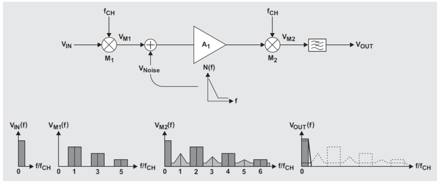

# Amplificadors chopper i amplificadors amb autozero

## 📑 Índice de Contenidos

- [1 Amplificadors chopper](#1-amplificadors-chopper)
- [2 Amplificadors amb autozero](#2-amplificadors-amb-autozero)
- [3 Criteris de selecció](#3-criteris-de-selecció)

---

Sistemes de Mesura · **Unitat 10 — Condicionament singular de senyals** · Document 3 de 5

# Amplificadors chopper i amplificadors amb autozero

Dedicació estimada: 10 minuts

> [!NOTE] **Objectius d'aprenentatge**
>
> - Explicar per què modular el senyal a una freqüència de commutació redueix l'efecte dels errors de baixa freqüència.
> - Seguir el senyal i els errors al llarg de la cadena d'un amplificador chopper, en el temps i en la freqüència.
> - Deduir el guany en llaç tancat d'un chopper i relacionar-lo amb el d'un amplificador convencional.
> - Descriure les dues fases d'un amplificador amb autozero i obtenir-ne la tensió d'offset efectiva.
> - Aplicar un procediment de selecció d'amplificador a partir de l'error dominant i de les restriccions pràctiques.

Quan ni la compensació passiva ni el *trimming* intern redueixen les derives al nivell requerit, cal recórrer a amplificadors que corregeixin dinàmicament els seus propis errors. Els dos grans tipus són els amplificadors chopper i els amplificadors amb autozero.

## 1 Amplificadors chopper

La idea dels amplificadors chopper, o trossejats, és traslladar el senyal útil a una zona freqüencial lliure dels errors de baixa freqüència de l'amplificador, amplificar-lo allà i tornar-lo a la banda base.

*Figura: Figura 10.8 Diagrama intern d'un amplificador chopper i senyals interns.*

> [!WARNING] **Freqüència de commutació**
>
> Freqüència  $f_{\text{ch}}$  de l'oscil·lador intern que governa els dos commutadors, habitualment entre algunes centenes de Hz i algunes desenes de kHz. Se selecciona prou alta perquè el senyal modulat quedi lluny de la zona de soroll 1/f i de les derives.

El commutador d'entrada modula  $V_{\text{in}}$  amb un senyal quadrat de freqüència  $f_{\text{ch}}$  i converteix la component contínua o de baixa freqüència en una oscil·lació a  $f_{\text{ch}}$  d'amplitud proporcional a  $V_{\text{in}}$. L'amplificador intern  $A_1$  l'amplifica amb un guany elevat, i hi afegeix els seus propis errors de contínua, derives i soroll 1/f, que apareixen com a contínua o baixa freqüència a la seva sortida. Un segon commutador, el desmodulador síncron, opera amb la mateixa fase que el primer: retorna el senyal útil a contínua i, simultàniament, trasllada els errors de banda base cap a  $f_{\text{ch}}$  i els seus harmònics. Un filtre passabaixes posterior els elimina juntament amb els residus de la modulació. Com que el gruix del guany correspon a  $A_1$, els errors de baixa freqüència del filtre de sortida —sobretot els de  $A_2$  si el filtre és actiu— gairebé no afecten la deriva de la tensió de sortida.

| Punt | Contingut |
|:--- |:--- |
| $V_1$ | Ona quadrada que pren el valor  $V_{\text{in}}$  durant el 50 % del temps i  $V_{\text{out}}\cdot R_1/(R_1+R_2)$  l'altre 50 %; valor mitjà  $[V_{\text{in}} + V_{\text{out}}R_1/(R_1+R_2)]/2$. |
| $V_2$ | La mateixa ona després del desacoblament de contínua: quadrada sense component contínua, de valors  $\pm[V_{\text{in}} - V_{\text{out}}R_1/(R_1+R_2)]/2$. |
| $V_3$ | $A_1 V_2 + e_3$, on  $e_3$  recull els errors de contínua, les derives i el soroll 1/f referits a la sortida de  $A_1$. |
| $V_4$ | Idealment  $A_1 V_2$, després del filtratge passaalt que retira  $e_3$. |
| $V_5$ | Ona quadrada de sortida del desmodulador, de valor mínim 0 i valor màxim  $A_1 V_{2\,\max}$; el seu valor mitjà,  $A_1 V_{2\,\max}/2$, és el senyal de sortida després del filtre passabaixes. |

D'aquí,  $V_{\text{out}} = A_1\cdot[V_{\text{in}} - V_{\text{out}}R_1/(R_1+R_2)]/2$  i, aïllant,

$$
V_{\text{out}} = \frac{A_1/2}{1 + A_1\cdot R_1/[2(R_1+R_2)]}\cdot V_{\text{in}} \qquad (10.11)
$$

que amb  $A_1 \gg 1$, com correspon al guany en llaç obert d'un operacional real, tendeix a

$$
V_{\text{out}} = V_{\text{in}}\cdot\left(1+\frac{R_2}{R_1}\right) \qquad (10.12)
$$

És l'expressió del guany d'un amplificador no inversor convencional: l'arquitectura chopper hi afegeix la cancel·lació dels errors de contínua i el guany en llaç tancat continua fixat per la xarxa de realimentació externa.

*Figura: Figura 10.9 Amplificador chopper en el domini freqüencial.*

En el domini freqüencial, la modulació converteix  $V_{\text{in}}$  —continu o de molt baixa freqüència— en un senyal amb contingut a  $f_{\text{ch}}$  i als seus harmònics imparells. Els errors i el soroll de baixa freqüència de l'amplificador se sumen en banda base, mentre que el senyal útil amplificat es troba centrat a  $f_{\text{ch}}$. El desmodulador síncron, multiplicant de nou per l'ona quadrada, porta el senyal útil de tornada a contínua i puja els errors cap a  $f_{\text{ch}}$  i harmònics; el filtre passabaixes, amb freqüència de tall molt per sota de  $f_{\text{ch}}$, deixa passar només el senyal útil recuperat i atenua dràsticament tant els errors com els residus de modulació. Com que el soroll 1/f cau a mesura que s'allunya de la contínua i la modulació l'envia a freqüències de l'ordre del kHz, la potència residual en banda base és extraordinàriament reduïda.

| Limitació | Abast |
|:--- |:--- |
| **Amplada de banda útil** | Queda limitada a una fracció de  $f_{\text{ch}}$, perquè el filtre de sortida ha de tallar molt per sota de la freqüència de commutació. Amb  $f_{\text{ch}}$  = 10 kHz, la banda útil és típicament inferior a 1 kHz. Per a senyals més ràpids cal triar dispositius amb  $f_{\text{ch}}$  elevada. |
| **Soroll blanc efectiu** | Pot ser una mica més alt que en amplificadors convencionals equivalents, perquè el procés de modulació i desmodulació plega soroll de bandes laterals cap a la banda base. |
| **Residus de commutació** | La commutació interna deixa a la sortida artefactes o *ripple* a  $f_{\text{ch}}$  i harmònics, que el filtre atenua i que cal considerar en sistemes de molt alta resolució. |

## 2 Amplificadors amb autozero

Els amplificadors amb autozero resten dinàmicament els errors de zero dels seus amplificadors interns mitjançant un sistema de doble fase i emmagatzematge capacitiu de les correccions.

*Figura: Figura 10.10 Principi de funcionament dels amplificadors amb autozero.*

El circuit consta de dos amplificadors interns: el principal  $A_m$  (*main*) i el de correcció o de *nulling*,  $A_n$. Cadascun té una entrada diferencial per al senyal i una entrada unipolar de correcció d'offset — $V_{c1}$  per a  $A_n$  i  $V_{c2}$  per a  $A_m$ —, i dos condensadors, externs o integrats, hi emmagatzemen aquestes tensions entre cicles. Es caracteritzen pel guany diferencial ( $A_m$,  $A_n$ ) i pel guany respecte de la tensió d'ajust unipolar ( $B_m$  per a  $A_m$  i  $-B_n$  per a  $A_n$, amb signe oposat per raons de correcció). El disseny imposa  $A_m = A_n = A$,  $B_m = B_n = B$  i  $B \gg 1$.

Un oscil·lador intern alterna dues fases a una freqüència de l'ordre del kHz. En la **fase d'autozero**, amb els commutadors a la posició 1,  $A_n$  té les entrades curtcircuitades internament i la seva sortida val

$$
V_{c1} = A_n\cdot V_{\text{osn}} - B_n\cdot V_{c1} \qquad (10.13)
$$

d'on

$$
V_{c1} = V_{\text{osn}}\cdot\frac{A_n}{1+B_n} \qquad (10.14)
$$

En la **fase d'amplificació**, amb els commutadors a la posició 2,  $A_n$  mesura  $V_{\text{in}} + V_{\text{osn}}$  i actualitza  $V_{c2}$:

$$
V_{c2} = A_n\cdot(V_{\text{in}}+V_{\text{osn}}) - B_n\cdot V_{c1} \qquad (10.15)
$$

Substituint-hi  $V_{c1}$,

$$
V_{c2} = A_n\cdot V_{\text{in}} + A_n\cdot V_{\text{osn}}\cdot\frac{1}{1+B_n} \qquad (10.16)
$$

La tensió de sortida no canvia entre les dues fases, perquè les entrades d' $A_m$  no commuten:

$$
V_{\text{out}} = A_m\cdot(V_{\text{in}}+V_{\text{osm}}) + B_m\cdot V_{c2} \qquad (10.17)
$$

i amb  $V_{c2}$  substituïda,

$$
V_{\text{out}} = A_m\cdot(V_{\text{in}}+V_{\text{osm}}) + B_m\cdot A_n\cdot V_{\text{in}} + \frac{B_m\cdot A_n\cdot V_{\text{osn}}}{1+B_n} \qquad (10.18)
$$

Agrupant termes,

$$
V_{\text{out}} = (A_m + B_m\cdot A_n)\cdot V_{\text{in}} + A_m\cdot V_{\text{osm}} + \frac{B_m\cdot A_n\cdot V_{\text{osn}}}{1+B_n} \qquad (10.19)
$$

i imposant  $A_m = A_n = A$,  $B_m = B_n = B$  amb  $B \gg 1$,

$$
V_{\text{out}} \approx A\cdot B\cdot V_{\text{in}} + A\cdot(V_{\text{osm}}+V_{\text{osn}}) \qquad (10.20)
$$

Escrit en la forma estàndard  $V_{\text{out}} \approx k\cdot(V_{\text{in}}+V_{\text{oeff}})$, el guany de senyal és  $k = A\cdot B$  i

$$
V_{\text{oeff}} = \frac{V_{\text{osm}}+V_{\text{osn}}}{B} \qquad (10.21)
$$

La tensió d'offset efectiva és un factor  $B$  més petita que la dels amplificadors interns: amb  $B$  = 1000, un  $V_{\text{osm}}$  d'1 mV es redueix a 1 μV. El guany del conjunt,  $A\cdot B$, és extraordinàriament gran, i per fer-lo servir com a amplificador operacional cal tancar una xarxa de realimentació entre  $V_{\text{out}}$  i l'entrada, que és qui fixa el guany en llaç tancat.

> [!WARNING] **Arquitectures híbrides**
>
> Molts amplificadors comercials moderns combinen autozero i chopper en el mateix dispositiu —*chopper stabilized*, o amplificadors de zero estabilitzat—, i n'aprofiten els avantatges respectius. El fabricant no sempre en detalla l'arquitectura interna; el resultat és una oferta de components amb  $V_{\text{os}}$  de l'ordre del microvolt i derives de desenes de nanovolts per grau. Un exemple clàssic, el LTC1050, dona  $V_{\text{os}}$  màxima de 5 μV, deriva de 0,05 μV/°C,  $I_B$  típica d'1 pA, soroll d'1,6 μV pic a pic a la banda de 0,1 a 10 Hz i freqüència interna de modulació d'uns 500 Hz.

| Aspecte | Chopper | Autozero |
|:--- |:--- |:--- |
| Mecanisme | Modulació del senyal a  $f_{\text{ch}}$, amplificació i desmodulació síncrona. | Mesura periòdica de l'error de zero i resta dinàmica amb dos amplificadors interns. |
| On es guarda la correcció | El desplaçament freqüencial no en necessita cap: els errors surten de la banda amb la desmodulació. | En dos condensadors, que conserven les tensions  $V_{c1}$  i  $V_{c2}$  entre fases. |
| Efecte sobre el soroll 1/f | El senyal s'amplifica fora de la zona de pitjor soroll, i el residu en banda base és molt petit. | La resta periòdica de l'error cancel·la també la component lenta. |
| Guany en llaç tancat | El fixa la xarxa de realimentació externa en totes dues arquitectures. |  |
| Preu a pagar | Banda útil limitada a una fracció de  $f_{\text{ch}}$, plegament de soroll de bandes laterals i residus de commutació. | Artefactes de la commutació entre fases i corrent de polarització de picoampers, procedent dels commutadors i dels condensadors. |

## 3 Criteris de selecció

1. **Tensió d'offset màxima tolerable**, a partir del nivell mínim de senyal i del guany del circuit: amb resolució  $r$  i guany  $G$,  $V_{\text{os}} \ll r/G$.
2. **Deriva tèrmica** multiplicada per l'excursió tèrmica previsible, amb el mateix criteri.
3. **Corrent de polarització** en relació amb les impedàncies del circuit —sensor i xarxa de guany—. Si el producte  $I_B\cdot R$  és comparable al nivell de senyal, cal optar per tecnologies FET o CMOS, o afegir la compensació amb resistència auxiliar en bipolars.
4. **Soroll integrat** sobre la banda passant del sistema, amb atenció particular al soroll 1/f si la banda inclou freqüències molt baixes. La banda del condicionador s'ha de limitar al necessari, també en dispositius de correcció dinàmica.
5. **Compatibilitat de les tensions d'alimentació** amb l'arquitectura del sistema.
6. **Consum, cost i disponibilitat comercial**, que formen part dels criteris reals de selecció al costat de les especificacions metrològiques. La solució de menor deriva i la més econòmica rarament coincideixen.

| Situació | Família indicada |
|:--- |:--- |
| Termoparells amb resolucions millors que 0,1 °C en marges tèrmics ambientals amplis | Autozero, com a primera opció, per l'estabilitat de zero. |
| Temperatura ambient controlada | Bipolar de precisió, alternativa vàlida i sovint més econòmica. |
| Sensors d'impedància alta, on domina el corrent de polarització | FET o CMOS, escollits pel seu  $I_B$. |

> [!TIP] **Síntesi**
>
> Els amplificadors chopper modulen el senyal a la freqüència de commutació  $f_{\text{ch}}$, l'amplifiquen lluny de la zona de soroll 1/f i el retornen a banda base amb un desmodulador síncron, mentre els errors de l'etapa interna es traslladen a  $f_{\text{ch}}$  i els elimina el filtre passabaixes. El guany en llaç tancat continua essent  $1+R_2/R_1$, fixat per la xarxa externa. A canvi, la banda útil queda limitada a una fracció de  $f_{\text{ch}}$, el soroll blanc efectiu pot pujar pel plegament de bandes laterals i la commutació deixa residus a la sortida. Els amplificadors amb autozero alternen una fase de mesura de l'error de zero i una d'amplificació, guarden les correccions en condensadors i deixen una tensió d'offset efectiva  $(V_{\text{osm}}+V_{\text{osn}})/B$, un factor  $B$  per sota de la dels amplificadors interns. La selecció d'un dispositiu concret encadena sis criteris: offset tolerable referit a l'entrada, deriva per l'excursió tèrmica, corrent de polarització per les impedàncies del circuit, soroll integrat a la banda, alimentació, i consum, cost i disponibilitat.

[← 2. Amplificadors de baixes derives: compensació de la polarització i ajust d'offset](02_Unitat10_Amplificadors_de_baixes_derives.md)[4. Amplificadors electromètrics i de transimpedància →](04_Unitat10_Electrometrics_i_transimpedancia.md)

---

## 📐 Formulario Resumen de Ecuaciones

| Nº / Ref | Expresión Matemática |
| :---: | :--- |
| **(10.11)** | $V_{\text{out}} = \frac{A_1/2}{1 + A_1\cdot R_1/[2(R_1+R_2)]}\cdot V_{\text{in}}$ |
| **(10.12)** | $V_{\text{out}} = V_{\text{in}}\cdot\left(1+\frac{R_2}{R_1}\right)$ |
| **(10.13)** | $V_{c1} = A_n\cdot V_{\text{osn}} - B_n\cdot V_{c1}$ |
| **(10.14)** | $V_{c1} = V_{\text{osn}}\cdot\frac{A_n}{1+B_n}$ |
| **(10.15)** | $V_{c2} = A_n\cdot(V_{\text{in}}+V_{\text{osn}}) - B_n\cdot V_{c1}$ |
| **(10.16)** | $V_{c2} = A_n\cdot V_{\text{in}} + A_n\cdot V_{\text{osn}}\cdot\frac{1}{1+B_n}$ |
| **(10.17)** | $V_{\text{out}} = A_m\cdot(V_{\text{in}}+V_{\text{osm}}) + B_m\cdot V_{c2}$ |
| **(10.18)** | $V_{\text{out}} = A_m\cdot(V_{\text{in}}+V_{\text{osm}}) + B_m\cdot A_n\cdot V_{\text{in}} + \frac{B_m\cdot A_n\cdot V_{\text{osn}}}{1+B_n}$ |
| **(10.19)** | $V_{\text{out}} = (A_m + B_m\cdot A_n)\cdot V_{\text{in}} + A_m\cdot V_{\text{osm}} + \frac{B_m\cdot A_n\cdot V_{\text{osn}}}{1+B_n}$ |
| **(10.20)** | $V_{\text{out}} \approx A\cdot B\cdot V_{\text{in}} + A\cdot(V_{\text{osm}}+V_{\text{osn}})$ |
| **(10.21)** | $V_{\text{oeff}} = \frac{V_{\text{osm}}+V_{\text{osn}}}{B}$ |