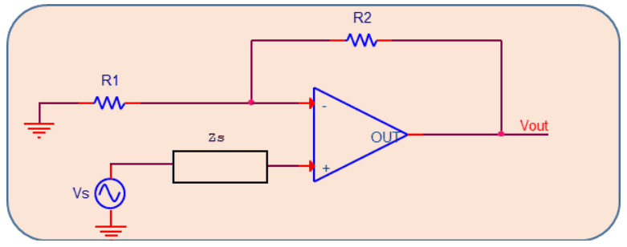
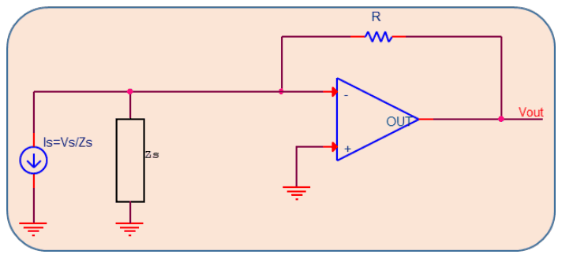
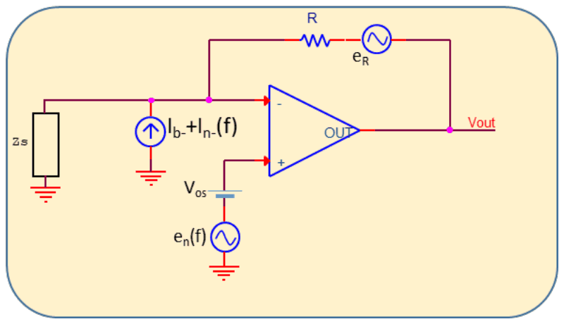
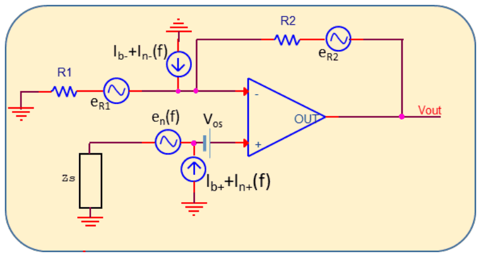
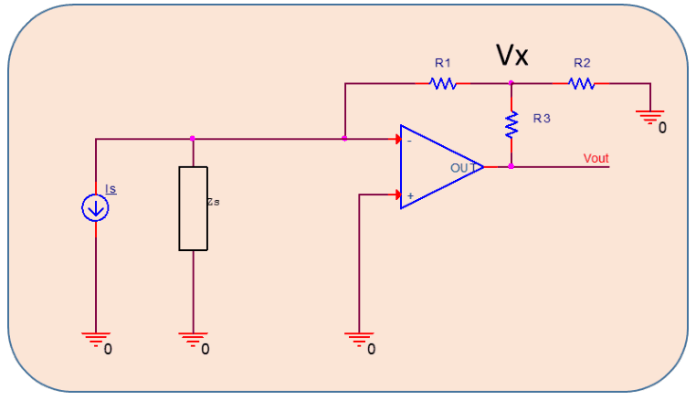
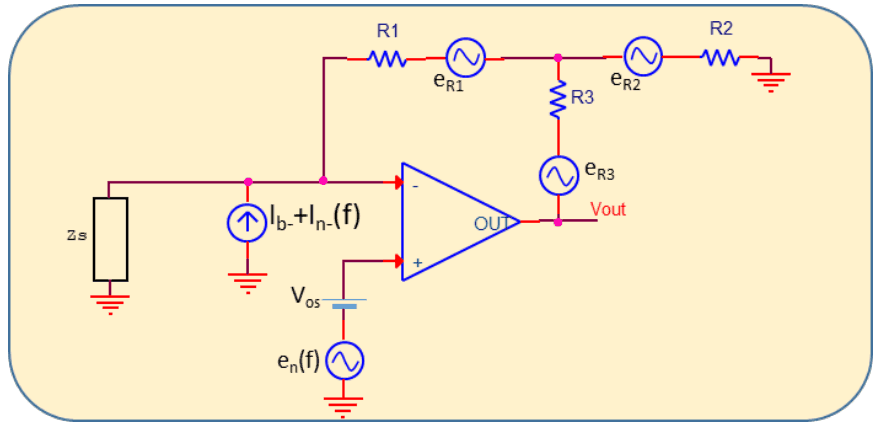

# Amplificadors electromètrics i de transimpedància

## 📑 Índice de Contenidos

- [1 Thevenin o Norton: quina topologia](#1-thevenin-o-norton-quina-topologia)
- [2 Amplificadors electromètrics](#2-amplificadors-electromètrics)
- [3 Amplificadors de transimpedància](#3-amplificadors-de-transimpedància)
  - [Errors de contínua i soroll](#errors-de-contínua-i-soroll)
- [4 La xarxa en T](#4-la-xarxa-en-t)
- [5 Disseny físic del node d'alta impedància](#5-disseny-físic-del-node-dalta-impedància)

---

Sistemes de Mesura · **Unitat 10 — Condicionament singular de senyals** · Document 4 de 5

# Amplificadors electromètrics i de transimpedància

Dedicació estimada: 14 minuts

> [!NOTE] **Objectius d'aprenentatge**
>
> - Triar entre el model de Thevenin i el de Norton d'un sensor d'alta impedància segons la topologia de condicionament.
> - Enunciar les condicions de funcionament d'un amplificador electromètric i el seu efecte sobre la resposta freqüencial.
> - Obtenir la relació entrada–sortida d'un amplificador de transimpedància i identificar-ne les fonts d'error de contínua i de soroll.
> - Calcular la transimpedància equivalent d'una xarxa en T i valorar-ne el cost en offset i en soroll.
> - Justificar les tècniques de disseny físic que fan viable una mesura a impedàncies de teraohms.

D'aquests sensors, el que condiciona el disseny no és el nivell de tensió —que pot ser de desenes de mil·livolts o de volts, perfectament manejable— sinó que qualsevol amplificador convencional, en connectar-s'hi, els carrega dràsticament: imposa una impedància de càrrega paral·lela comparable o menor a la de sortida del sensor, que desvia gran part del senyal cap a massa. Els exemples canònics són els sensors piezoelèctrics i piroelèctrics, modelables com a fonts de tensió o de càrrega amb una capacitat i una resistència de fuita molt elevada en paral·lel; els fotodíodes, que en certs modes es comporten com a fonts de corrent d'impedància molt alta; els fototransistors; i els sensors químics com les sondes de pH o els elèctrodes de ió selectiu, amb impedàncies internes que poden arribar als gigaohms.

Amb impedàncies d'entrada de MΩ i corrents de polarització de nanoampers, l'operacional de propòsit general hi falla per partida doble: el producte  $I_B\cdot R$  del propi amplificador supera la tensió útil del sensor, i la impedància d'entrada deriva el senyal cap a massa fins a fer-lo desaparèixer. Quan la impedància de sortida és capacitiva, el conjunt sensor–amplificador es comporta a més com un filtre passaalt la freqüència de tall del qual depèn dels paràmetres paràsits del cablejat i de l'entrada, de manera que les components lentes del senyal poden quedar filtrades. Cal, doncs, impedàncies d'entrada de l'ordre de TΩ, corrents de polarització de fA o pA i un bon control de les capacitats i fuites paràsites del circuit imprès.

## 1 Thevenin o Norton: quina topologia

Qualsevol sensor lineal admet les dues representacions equivalents: font de tensió  $V_s$  amb  $Z_s$  en sèrie, o font de corrent  $I_s = V_s/Z_s$  amb  $Z_s$  en paral·lel. Són dues descripcions del mateix sensor, i la tria és de conveniència: amb  $Z_s$  petita el model Thevenin és el natural, i amb  $Z_s$  gran, que és el cas dels sensors d'alta impedància, el model Norton sol resultar més útil perquè  $I_s$  és un paràmetre relativament estable i ben caracteritzat.

| Model | Què es demana a l'amplificador | Topologia |
|:--- |:--- |:--- |
| **Thevenin** ( $V_s$,  $Z_s$  en sèrie) | Impedància d'entrada molt més gran que  $Z_s$, perquè el divisor de tensió no degradi el senyal. | Amplificador **electromètric** en configuració no inversora o seguidora, amb  $Z_{\text{in}}$  de TΩ. |
| **Norton** ( $I_s$,  $Z_s$  en paral·lel) | Impedància d'entrada molt petita, idealment un curtcircuit, perquè tot  $I_s$  flueixi cap a l'amplificador. | Amplificador de **transimpedància**, basat en el curtcircuit virtual de l'operacional. |

Sota hipòtesis generoses les dues topologies són equivalents, i triar-ne una o l'altra depèn de les prestacions concretes de l'operacional disponible. A la pràctica, la de transimpedància és la més utilitzada amb fotodíodes i amb sensors piezoelèctrics en règim de corrent, pels avantatges que presenta en resposta freqüencial.

## 2 Amplificadors electromètrics

*Figura: Figura 10.11 Amplificador electromètric.*

Un amplificador electromètric és un operacional no inversor on el component escollit presenta una impedància d'entrada extraordinàriament elevada —TΩ o superior— i un corrent de polarització molt reduït, de fA a pA. Aquestes prestacions s'aconsegueixen gairebé sempre amb etapes d'entrada FET o CMOS, sovint amb tècniques addicionals. El funcionament correcte demana dues condicions.

- La impedància d'entrada de l'amplificador ha de superar  $Z_s$  com a mínim en dos o tres ordres de magnitud, de manera que el divisor format per  $Z_s$  i  $Z_{\text{in}}$  no degradi apreciablement el senyal.
- El corrent  $I_{B+}$  ha de ser prou petit perquè la caiguda  $I_{B+}\cdot R_s$, amb  $R_s$  la part resistiva de  $Z_s$  en contínua, deixi prou marge dinàmic per amplificar  $V_s$.

Sota aquestes hipòtesis el comportament és el d'un no inversor convencional:

$$
V_{\text{out}} = V_s\cdot\left(1+\frac{R_2}{R_1}\right) \qquad (10.22)
$$

Si la impedància d'entrada finita és comparable a  $Z_s$, la tensió efectiva del sensor passa a ser

$$
V_{s\,eff} = V_s\cdot\frac{Z_{\text{in}}}{Z_s+Z_{\text{in}}} \qquad (10.23)
$$

i, quan  $Z_s$  i  $Z_{\text{in}}$  tenen dependències freqüencials diferents, el sistema deixa de tenir resposta plana.

| Magnitud | Valor |
|:--- |:--- |
| Sensibilitat teòrica a 25 °C (equació de Nernst) | 59,16 mV/pH |
| Excursió de sortida entre pH 0 i pH 14 | de +414 mV a −414 mV |
| Impedància de sortida de l'elèctrode de vidre | de 10 MΩ a 1 GΩ |
| Error de contínua amb  $I_B$  = 40 fA sobre 1 GΩ | 40 μV |

El senyal no demana gaire amplificació per poder-se digitalitzar; el problema és la impedància, que varia amb el disseny, l'envelliment i la temperatura. Amb un error de contínua de desenes de microvolts davant de centenars de mil·livolts de senyal, un component electromètric hi és perfectament adequat, connectat en configuració seguidora —guany unitat— per desacoblar la sonda de la resta del sistema, i amplificant i digitalitzant després amb tècniques convencionals.

## 3 Amplificadors de transimpedància

*Figura: Figura 10.12 Amplificador de transimpedància.*

L'amplificador de transimpedància (TIA) és una configuració inversora on el corrent del sensor s'injecta directament al terminal inversor i la realimentació es tanca amb una resistència  $R$  entre la sortida i aquest mateix terminal; el terminal no inversor va a massa. Amb les dues hipòtesis de l'operacional ideal —cap corrent entra pels terminals d'entrada i la tensió entre ells és zero—, el node inversor queda virtualment a massa, el sensor hi veu una impedància d'entrada nul·la, tot el corrent  $I_s$  circula per  $R$  i la llei d'Ohm dona

$$
V_{\text{out}} = I_s\cdot R \qquad (10.24)
$$

> [!WARNING] **Transimpedància**
>
> Constant de conversió corrent–tensió del circuit, igual a  $R$  en el cas resistiu ideal. La funció de transferència és un quocient V/I, és a dir una impedància, i es mesura en ohms o, més generalment, en volts per ampere.

El TIA anul·la l'efecte de  $Z_s$  sobre el guany de senyal, cosa que el fa particularment útil quan  $Z_s$  és capacitiva i, per tant, dependent de la freqüència. L'operacional real, però, té un guany en llaç obert finit que decreix amb la freqüència, un corrent de polarització no nul, una capacitat d'entrada paràsita  $C_{\text{in}}$  i soroll propi. La combinació de  $R$  amb les capacitats del node inversor forma un pol al llaç de realimentació que pot provocar inestabilitat, i per això és habitual afegir una capacitat  $C_f$  en paral·lel amb  $R$, que estabilitza el circuit i limita la banda útil. Se'n deriven dues conseqüències pràctiques: l'amplada de banda útil del TIA sovint és força inferior a la de l'operacional subjacent, especialment amb  $Z_s$  molt capacitiva; i el soroll a la sortida augmenta a altes freqüències pel factor  $1+C_s/C_f$  —el *noise gain peak*—, cosa que reforça la conveniència de limitar la banda al mínim necessari.

### Errors de contínua i soroll

*Figura: Figura 10.13 Model per a l'anàlisi dels errors de contínua i del soroll en un amplificador de transimpedància.*

Aplicant superposició amb el senyal útil anul·lat, la tensió de sortida deguda als errors és

$$
V_{\text{out}} = V_{\text{OS}}\cdot\left(1+\frac{R}{Z_s}\right) - I_{B-}\cdot R \qquad (10.25)
$$

El primer terme queda pròxim a  $V_{\text{OS}}$  perquè  $Z_s$  sol ser molt més gran que  $R$. El segon,  $I_{B-}\cdot R$, és sovint el dominant en amplificadors FET i CMOS d'alta impedància, i és la raó principal per la qual s'exigeixen corrents de polarització de femtoampers quan  $R$  és molt gran: amb  $I_B$  = 1 pA i  $R$  = 1 GΩ, l'error de contínua a la sortida és d'1 mV.

*Figura: Figura 10.14 Model per a l'anàlisi dels errors de contínua i del soroll en un amplificador electromètric.*

Per a l'amplificador electromètric no inversor, l'anàlisi anàloga dona

$$
V_{\text{out}} = V_{\text{OS}}\cdot\left(1+\frac{R_2}{R_1}\right) + I_{B+}\cdot R_s\cdot\left(1+\frac{R_2}{R_1}\right) - I_{B-}\cdot R_2 \qquad (10.26)
$$

on el terme  $I_{B+}\cdot R_s\cdot(1+R_2/R_1)$  pot dominar quan  $R_s$  és molt gran, cosa habitual en elèctrodes de pH i en sensors piezoelèctrics. La tensió d'offset hi és present amb el guany de soroll, com en qualsevol topologia realimentada.

El soroll de sortida del TIA té tres contribucions principals: el soroll de tensió de l'amplificador  $e_n(f)$, amplificat pel guany de soroll  $1+R/Z_s(f)$, que amb  $Z_s$  capacitiva creix amb la freqüència; el soroll de corrent de l'entrada inversora  $I_{n-}(f)$, multiplicat per  $R$  i molt baix —de l'ordre de fA/√Hz— en amplificadors JFET o CMOS de baixa  $I_B$; i el soroll tèrmic de la resistència,  $e_R = \sqrt{4kTR}$. La densitat espectral total a la sortida és

$$
e_{\text{nout}}(f) = \sqrt{e_n(f)^2\left(1+\frac{R}{Z_s(f)}\right)^{2} + I_{n-}(f)^2 R^{2} + e_R^{2}} \qquad (10.27)
$$

El soroll tèrmic creix amb  $\sqrt{R}$  mentre que el senyal creix amb  $R$: augmentar la transimpedància millora la relació senyal-soroll, i és una de les raons per les quals els TIA tendeixen a valors de  $R$  grans. El soroll de la resistència pot ser rellevant igualment, especialment a freqüències baixes.

Per a l'amplificador electromètric, el model de la figura 10.14 dona

$$
e_{\text{nout}}(f) = \sqrt{\left(e_n(f)^2 + (I_{n+}(f)Z_s(f))^2\right)\left(1+\frac{R_2}{R_1}\right)^{2} + I_{n-}(f)^2 R_2^{2} + e_{R1}^{2}\left(\frac{R_2}{R_1}\right)^{2} + e_{R2}^{2}} \qquad (10.28)
$$

Com que  $R_1$  i  $R_2$  no acostumen a tenir valors extraordinàriament grans, el soroll hi sol estar dominat per les fonts de l'operacional, i la seva elecció és primordial per a un disseny de baix soroll. El terme  $I_{n+}(f)\cdot Z_s(f)$  mostra que els corrents de soroll d'entrada, multiplicats per una impedància de sensor molt elevada, hi contribueixen de manera apreciable.

Integrant qualsevol d'aquestes densitats espectrals sobre la banda útil s'obté la tensió de soroll RMS a la sortida, que és la magnitud que permet calcular la relació senyal-soroll del sistema.

> [!WARNING] **Criteri de tria**
>
> Per a fotodíodes, piezoelèctrics i piroelèctrics el TIA és superior, perquè cancel·la l'efecte de  $C_s$  en contínua i a baixes freqüències. Per a sensors resistius d'alta impedància, com els de pH, l'amplificador electromètric és preferible, perquè estalvia el soroll addicional de la resistència de transimpedància. La decisió es pren comparant el model del sensor, la banda i les fonts dominants d'error i de soroll; per a corrents molt petits, la selecció de l'operacional ha d'incloure alhora corrent de polarització, soroll de corrent, soroll de tensió i producte guany-amplada de banda.

## 4 La xarxa en T

Aconseguir valors molt grans de  $R$  és un dels reptes pràctics del TIA: convertir 1 pA en 10 mV demana una transimpedància de 10 GΩ. Les resistències físiques per sobre de 100 MΩ presenten toleràncies estàndard del 5 % al 10 %, coeficients de temperatura que poden arribar a 500 ppm/°C, fuites per la superfície del component i de la placa que poden ser comparables al seu propi valor en ambients humits, soroll d'excés per sobre del tèrmic teòric —especialment les de pel·lícula de carboni— i un cost elevat amb disponibilitat limitada.

*Figura: Figura 10.15 Amplificador de transimpedància amb xarxa en T.*

La xarxa en T substitueix la resistència única per tres:  $R_1$  entre el terminal inversor i un node intern  $V_x$,  $R_3$  entre aquest node i la sortida, i  $R_2$  entre el node i massa. Pel curtcircuit virtual, tot el corrent que entra pel node inversor circula per  $R_1$  cap al node intern, de manera que  $V_x = I_s\cdot R_1$  en valor absolut. Aplicant la llei de corrents de Kirchhoff al node  $V_x$,

$$
\frac{V_{\text{out}}-V_x}{R_3} = \frac{V_x}{R_2} + I_s \qquad (10.29)
$$

i resolent,

$$
V_{\text{out}} = I_s\cdot\left[R_3 + R_1\left(1+\frac{R_3}{R_2}\right)\right] = I_s\cdot R_{\text{eq}} \qquad (10.30)
$$

amb la transimpedància equivalent

$$
R_{\text{eq}} = R_3 + R_1\cdot\left(1+\frac{R_3}{R_2}\right) \qquad (10.31)
$$

Amb  $R_3 \gg R_2$  es poden sintetitzar transimpedàncies enormes amb components de valors moderats: amb  $R_1 = R_3$  = 1 MΩ i  $R_2$  = 100 Ω, la transimpedància equivalent és d'uns 10 GΩ. El valor depèn, doncs, de la relació entre les resistències que formen el divisor intern de la T.

*Figura: Figura 10.16 Model per a l'anàlisi dels errors de contínua i del soroll en una xarxa en T.*

La xarxa té un preu. La superposició dona, per als errors de contínua,

$$
V_{\text{out}} = V_{\text{OS}}\left[\left(1+\frac{R_1}{R_s}\right)\left(1+\frac{R_3}{R_2}\right)+\frac{R_3}{R_s}\right] - I_{B-}\cdot R_{\text{eq}} \qquad (10.32)
$$

i, quan la resistència del sensor és molt més gran que  $R_3$,

$$
V_{\text{out}} \approx V_{\text{OS}}\left(1+\frac{R_3}{R_2}\right) - I_{B-}\cdot R_{\text{eq}} \qquad (10.33)
$$

La tensió d'offset queda multiplicada pel factor  $1+R_3/R_2$, que per disseny de la xarxa és molt més gran que 1: amb amplificadors FET i CMOS això pot donar ràpidament tensions capaces de saturar la sortida. I com que la transimpedància equivalent és molt gran, el corrent de polarització continua havent de ser molt baix. L'anàlisi de soroll dona

$$
e_{\text{nout}}(f) \approx \sqrt{e_n(f)^2\left(1+\frac{R_3}{R_2}\right)^{2} + I_{n-}(f)^2 R_{\text{eq}}^{2} + e_{R1}^{2}\left(1+\frac{R_3}{R_2}\right)^{2} + e_{R2}^{2}\left(\frac{R_3}{R_2}\right)^{2} + e_{R3}^{2}} \qquad (10.34)
$$

La diferència respecte del TIA amb una sola resistència és que ara la densitat espectral de soroll de tensió de l'operacional queda multiplicada per un factor molt superior a 1, i que les densitats de  $R_1$  i  $R_2$  hi entren també amb guanys grans. A igualtat de fonts de soroll de l'operacional, la xarxa en T és una solució més sorollosa; el seu lloc és allà on una resistència física del valor requerit resulta impracticable.

## 5 Disseny físic del node d'alta impedància

A les impedàncies que es manegen aquí —fins a TΩ—, les fuites superficials de la placa, l'absorció d'humitat dels dielèctrics i les interferències electromagnètiques són problemes de primer ordre, capaços de degradar un disseny teòricament correcte.

| Tècnica | Descripció |
|:--- |:--- |
| **Guarda** | Pista de placa que envolta el node d'alta impedància, mantinguda al mateix potencial que el pin sensible, habitualment amb un buffer. Actua com a pantalla activa: les fuites superficials i les capacitats paràsites es refereixen al potencial de la guarda i, com que la diferència de tensió respecte del node sensible és pràcticament nul·la, el corrent parasitari que hi circula és molt petit. Com més a prop del node sensible, més efectiva. |
| **Apantallament** | Blindatge conductor al voltant del cablejat d'alta impedància —cable coaxial o triaxial— que intercepta les interferències electromagnètiques i les deriva cap a un potencial de referència. En cable triaxial, la malla interna porta la guarda activa i l'externa fa de pantalla connectada a la referència, de manera que les dues funcions conviuen en el mateix cable. |
| **Aïllants d'alta qualitat** | Plaques de tefló (PTFE), poliimida o materials ceràmics a les zones crítiques. En casos extrems, els components es munten a l'aire sobre terminals de tefló per minimitzar les fuites. |
| **Neteja de la placa** | Els residus de flux, les sals i els greixos formen camins conductors mesurables a l'escala del picoampere i del femtoampere. Es netegen amb alcohol isopropílic i, idealment, amb bany ultrasònic. |
| **Control d'humitat** | La humitat absorbida pels dielèctrics redueix significativament les resistències d'aïllament. En aplicacions crítiques el circuit se segella amb un recobriment hidròfob o es munta en un recinte hermètic amb dessecant. |

> [!TIP] **Síntesi**
>
> El model Thevenin porta a l'amplificador electromètric, que demana  $Z_{\text{in}} \gg Z_s$  i dona  $V_{\text{out}} = V_s(1+R_2/R_1)$; el model Norton porta al de transimpedància, que imposa un curtcircuit virtual al sensor i dona  $V_{\text{out}} = I_s R$, amb la transimpedància mesurada en ohms o en V/A. El TIA cancel·la l'efecte de  $Z_s$  sobre el guany, a canvi d'una banda sovint més estreta que la de l'operacional i d'un guany de soroll  $1+R/Z_s$  que creix amb la freqüència quan  $Z_s$  és capacitiva; la capacitat  $C_f$  hi estabilitza el llaç i en limita la banda. Els errors de contínua estan dominats per  $I_{B-}R$  al TIA i per  $I_{B+}R_s(1+R_2/R_1)$  a l'electromètric. La xarxa en T sintetitza transimpedàncies de gigaohms amb resistències moderades,  $R_{\text{eq}} = R_3 + R_1(1+R_3/R_2)$, i en paga el preu multiplicant l'offset i el soroll de l'operacional pel factor  $1+R_3/R_2$. A impedàncies de teraohms, guardes, apantallaments, aïllants de qualitat, neteja i control d'humitat formen part del disseny tant com l'elecció del component.

[← 3. Amplificadors chopper i amplificadors amb autozero](03_Unitat10_Chopper_i_autozero.md)[5. Amplificadors de càrrega →](05_Unitat10_Amplificadors_de_carrega.md)

---

## 📐 Formulario Resumen de Ecuaciones

| Nº / Ref | Expresión Matemática |
| :---: | :--- |
| **(10.22)** | $V_{\text{out}} = V_s\cdot\left(1+\frac{R_2}{R_1}\right)$ |
| **(10.23)** | $V_{s\,eff} = V_s\cdot\frac{Z_{\text{in}}}{Z_s+Z_{\text{in}}}$ |
| **(10.24)** | $V_{\text{out}} = I_s\cdot R$ |
| **(10.25)** | $V_{\text{out}} = V_{\text{OS}}\cdot\left(1+\frac{R}{Z_s}\right) - I_{B-}\cdot R$ |
| **(10.26)** | $V_{\text{out}} = V_{\text{OS}}\cdot\left(1+\frac{R_2}{R_1}\right) + I_{B+}\cdot R_s\cdot\left(1+\frac{R_2}{R_1}\right) - I_{B-}\cdot R_2$ |
| **(10.27)** | $e_{\text{nout}}(f) = \sqrt{e_n(f)^2\left(1+\frac{R}{Z_s(f)}\right)^{2} + I_{n-}(f)^2 R^{2} + e_R^{2}}$ |
| **(10.28)** | $e_{\text{nout}}(f) = \sqrt{\left(e_n(f)^2 + (I_{n+}(f)Z_s(f))^2\right)\left(1+\frac{R_2}{R_1}\right)^{2} + I_{n-}(f)^2 R_2^{2} + e_{R1}^{2}\left(\frac{R_2}{R_1}\right)^{2} + e_{R2}^{2}}$ |
| **(10.29)** | $\frac{V_{\text{out}}-V_x}{R_3} = \frac{V_x}{R_2} + I_s$ |
| **(10.30)** | $V_{\text{out}} = I_s\cdot\left[R_3 + R_1\left(1+\frac{R_3}{R_2}\right)\right] = I_s\cdot R_{\text{eq}}$ |
| **(10.31)** | $R_{\text{eq}} = R_3 + R_1\cdot\left(1+\frac{R_3}{R_2}\right)$ |
| **(10.32)** | $V_{\text{out}} = V_{\text{OS}}\left[\left(1+\frac{R_1}{R_s}\right)\left(1+\frac{R_3}{R_2}\right)+\frac{R_3}{R_s}\right] - I_{B-}\cdot R_{\text{eq}}$ |
| **(10.33)** | $V_{\text{out}} \approx V_{\text{OS}}\left(1+\frac{R_3}{R_2}\right) - I_{B-}\cdot R_{\text{eq}}$ |
| **(10.34)** | $e_{\text{nout}}(f) \approx \sqrt{e_n(f)^2\left(1+\frac{R_3}{R_2}\right)^{2} + I_{n-}(f)^2 R_{\text{eq}}^{2} + e_{R1}^{2}\left(1+\frac{R_3}{R_2}\right)^{2} + e_{R2}^{2}\left(\frac{R_3}{R_2}\right)^{2} + e_{R3}^{2}}$ |