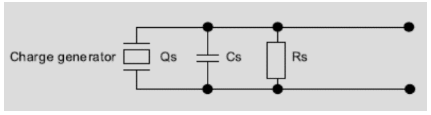
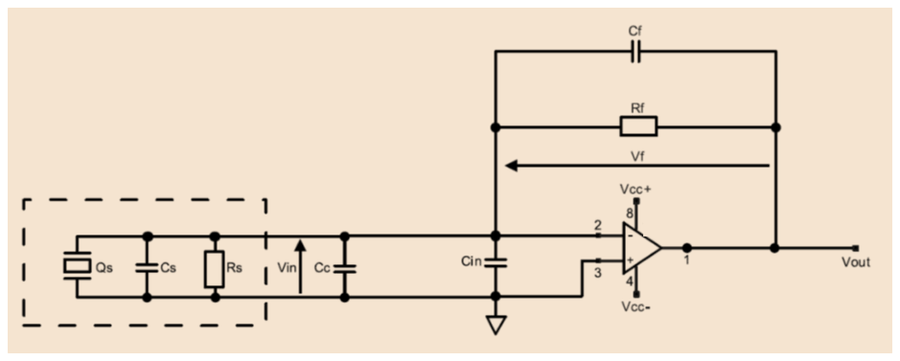

# Amplificadors de càrrega

## 📑 Índice de Contenidos

- [1 Model del sensor en càrrega](#1-model-del-sensor-en-càrrega)
- [2 L'amplificador de càrrega](#2-lamplificador-de-càrrega)
- [3 La resistència de realimentació](#3-la-resistència-de-realimentació)
- [4 Errors de contínua](#4-errors-de-contínua)
- [5 L'efecte triboelèctric](#5-lefecte-triboelèctric)

---

Sistemes de Mesura · **Unitat 10 — Condicionament singular de senyals** · Document 5 de 5

# Amplificadors de càrrega

Dedicació estimada: 8 minuts

> [!NOTE] **Objectius d'aprenentatge**
>
> - Escriure el model elèctric en càrrega d'un sensor piezoelèctric o piroelèctric i identificar-ne les capacitats paràsites associades.
> - Deduir la relació càrrega–tensió d'un amplificador de càrrega i l'abast de la seva independència respecte de les capacitats paràsites.
> - Dimensionar la resistència de realimentació a partir de la freqüència mínima d'interès.
> - Avaluar l'offset de sortida degut a la tensió d'offset i al corrent de polarització, i decidir la tecnologia d'entrada.
> - Reconèixer l'efecte triboelèctric i les mesures que el mitiguen.

Els sensors piezoelèctrics generen un desplaçament de càrregues proporcional a la deformació del material, i els piroelèctrics en generen en resposta a una variació de flux tèrmic. En tots dos casos la magnitud primària que descriu la física del sensor és la **càrrega**  $Q_s$, i no la tensió ni el corrent. Els amplificadors de càrrega parteixen d'aquesta lectura i donen a la sortida una tensió proporcional a la càrrega generada, amb una constant de conversió que depèn d'un condensador de realimentació  $C_f$  i que és essencialment independent de les capacitats paràsites del sensor, del cablejat i de l'entrada de l'operacional. És l'estàndard de facto en instrumentació piezoelèctrica.

## 1 Model del sensor en càrrega

*Figura: Figura 10.17 Model de sensor generador amb sortida en càrrega.*

| Element | Valors típics | Significat |
|:--- |:--- |:--- |
| $Q_s$ | — | Càrrega generada en resposta al mesurand: força mecànica als piezoelèctrics, flux tèrmic als piroelèctrics. |
| $C_s$ | Desenes de pF a alguns nF | Capacitat intrínseca del sensor, associada a la geometria de les cares metal·litzades i a la constant dielèctrica del material. |
| $R_s$ | GΩ o TΩ | Pèrdues finites del dielèctric del material. |
| $C_c$ | 50–100 pF per metre | Capacitat del cable que uneix el sensor i l'amplificador. Amb cables de diversos metres pot assolir centenars de pF i dominar  $C_s$. |
| $C_{\text{in}}$ | Alguns pF | Capacitat d'entrada de l'operacional. |

En una topologia que depengués de  $C_s$  —un seguidor electromètric simple, per exemple— aquestes capacitats paràsites introduirien una dependència freqüencial i, sobretot, una dependència de la longitud del cable, de manera que caldria recalibrar el sistema cada vegada que es modifiqués la instal·lació.

## 2 L'amplificador de càrrega

El punt de partida és la relació entre càrrega i corrent. El corrent és la derivada temporal de la càrrega, cosa que en el domini freqüencial es tradueix en un factor  $j\omega$:

$$
I(j\omega) = j\omega\cdot Q(j\omega) \qquad (10.35)
$$

Si el circuit converteix el corrent  $I$  lliurat pel sensor en una tensió proporcional a  $I/(j\omega)$, el resultat serà una tensió proporcional a  $Q$; i la funció de transferència  $\frac{1}{j\omega}$  és precisament la d'un integrador ideal.

*Figura: Figura 10.18 Amplificador de càrrega.*

La topologia és estructuralment idèntica a la de transimpedància, amb una sola diferència crítica: en lloc d'una resistència a la realimentació s'hi col·loca un condensador  $C_f$, en paral·lel amb una resistència  $R_f$  d'alt valor que polaritza l'operacional. El sensor es connecta al terminal inversor i el terminal no inversor va a massa. Sota la hipòtesi d'operacional ideal, el node inversor es manté virtualment a massa:  $C_s$,  $C_c$  i  $C_{\text{in}}$, totes connectades entre aquest terminal i massa, tenen els dos extrems al mateix potencial i no hi flueix cap corrent. Tot el corrent que surt de la font de càrrega circula per  $C_f$  —suposant  $R_f$  infinita— i

$$
V_{\text{out}}(j\omega) = -\frac{I(j\omega)}{j\omega\cdot C_f} = -\frac{Q(j\omega)}{C_f} \qquad (10.36)
$$

La tensió de sortida és directament proporcional a la càrrega del sensor, amb un factor de proporcionalitat  $-\frac{1}{C_f}$: augmentar  $C_f$  redueix la tensió obtinguda per unitat de càrrega. Aquesta independència respecte de  $C_s$,  $C_c$  i  $C_{\text{in}}$  es basa en la hipòtesi de guany en llaç obert infinit, que és la que manté el node inversor al potencial de massa. A freqüències on aquest guany ha decrescut significativament, les capacitats paràsites hi tornen a tenir efecte, de manera que la tria de l'operacional ha de garantir un guany en llaç obert elevat en tota la banda d'interès.

## 3 La resistència de realimentació

Un integrador ideal acumula indefinidament sobre  $C_f$  qualsevol corrent de contínua no nul present a l'entrada, i porta la sortida a la saturació en un temps finit. La resistència  $R_f$  en paral·lel amb  $C_f$  proporciona un camí de fuita per a la càrrega acumulada i estabilitza el punt de treball en contínua. Perquè no tingui cap efecte apreciable dins de la banda d'interès —cosa que faria que la transferència deixés de ser un integrador pur—, la seva impedància ha de ser molt més gran que la de  $C_f$  a la freqüència mínima d'interès  $f_{\min}$:

$$
R_f \gg \frac{1}{2\pi\cdot f_{\min}\cdot C_f} \qquad (10.37)
$$

Amb aquesta condició, per a freqüències superiors a  $f_{\min}$  la resistència es comporta com un circuit obert i la transferència recupera la forma  $-Q/C_f$. Per a freqüències molt inferiors a  $\frac{1}{2\pi R_f C_f}$, en canvi,  $R_f$  domina: el circuit esdevé un amplificador de transimpedància d'aproximadament  $R_f$  ohms i respon proporcionalment a la derivada de la càrrega, de manera que la resposta a càrrega constant és nul·la. La freqüència de tall inferior del conjunt queda, doncs, fixada pel producte  $R_f C_f$. És la contrapartida necessària per a la viabilitat pràctica del circuit, i és compatible amb el fet que els sensors piezoelèctrics i piroelèctrics no tenen resposta útil en contínua.

## 4 Errors de contínua

En contínua tots els condensadors del model són circuits oberts, de manera que el punt de treball el fixen els camins resistius. La tensió a la sortida és

$$
V_{\text{out}} = V_{\text{OS}}\cdot\left(1+\frac{R_f}{R_s}\right) + I_{B-}\cdot R_f \qquad (10.38)
$$

| Condició | Resultat |
|:--- |:--- |
| $R_f$  = 1 GΩ amb  $R_s$  = 100 GΩ | Factor 1,01 sobre  $V_{\text{OS}}$ |
| $R_f$  = 1 GΩ amb  $R_s$  = 10 MΩ | Factor 101: una  $V_{\text{OS}}$  d'1 mV dona 101 mV d'offset |
| $R_f$  = 1 GΩ amb  $I_{B-}$  = 10 pA | 10 mV d'offset, tolerable |
| $R_f$  = 1 GΩ amb  $I_{B-}$  = 10 nA | 10 V d'offset, inacceptable |

El primer terme multiplica  $V_{\text{OS}}$  per un factor d'offset que creix quan  $R_s$  baixa. A més,  $R_s$  és la combinació en paral·lel de la resistència intrínseca del sensor amb totes les fuites del sistema —placa, connectors i entrada de l'operacional—, de manera que controlar-la exigeix les mateixes tècniques de disseny físic que qualsevol node d'alta impedància: guardes, neteja, aïllants de qualitat i segellat contra la humitat.

El segon terme és directament proporcional al corrent de polarització i a la resistència de realimentació, i és el que fixa la tecnologia d'entrada. Amb els valors habituals de  $R_f$, els nanoampers dels bipolars són incompatibles amb el marge dinàmic de sortida, de manera que l'operacional d'un amplificador de càrrega ha de tenir etapa d'entrada JFET o CMOS. Els fabricants especialitzats en instrumentació piezoelèctrica ofereixen components amb  $I_b$  de femtoampers i  $V_{\text{OS}}$  moderada —típicament de mil·livolts— dissenyats específicament per a aquesta aplicació.

## 5 L'efecte triboelèctric

> [!WARNING] **Efecte triboelèctric**
>
> Generació de càrregues elèctriques paràsites pel frec mecànic entre el dielèctric i els conductors d'un cable coaxial quan aquest es flexiona. En un sistema que detecta càrregues de l'ordre del picocoulomb, aquestes càrregues poden ser ordres de magnitud més grans que el senyal útil.

Els fabricants especialitzats ofereixen **cables de baix soroll triboelèctric**: cables coaxials amb un recobriment conductor de grafit entre el dielèctric i la malla externa, que curtcircuita les càrregues generades per fricció i les retorna a terra abans que arribin al conductor de senyal. Són identificables per la seva major flexibilitat i pel seu tacte gomós característic. A més, el cable s'ha de fixar mecànicament al llarg del seu recorregut amb brides o suports, de manera que les vibracions ambientals no el facin oscil·lar i generin senyals espuris: el control mecànic del cablejat forma part del disseny de la mesura tant com l'elecció del component.

> [!TIP] **Síntesi**
>
> El sensor piezoelèctric o piroelèctric es modela com una font de càrrega  $Q_s$  amb una capacitat  $C_s$  i una resistència de fuita  $R_s$  en paral·lel, a les quals el muntatge real afegeix la capacitat del cable i la d'entrada de l'operacional, comparables o superiors a  $C_s$. Partint de  $I(j\omega)=j\omega Q(j\omega)$, un integrador amb  $C_f$  a la realimentació dona  $V_{\text{out}}=-Q/C_f$, independent de les capacitats paràsites mentre el guany en llaç obert mantingui el node inversor a massa virtual, i amb sensibilitat inversament proporcional a  $C_f$. La resistència  $R_f$  en paral·lel evita la saturació per acumulació i fixa la freqüència de tall inferior; per conservar el comportament integrador dins de la banda útil, la seva impedància ha de superar àmpliament la de  $C_f$  a  $f_{\min}$. En contínua, els condensadors s'obren i la sortida queda amb  $V_{\text{OS}}(1+R_f/R_s)+I_{B-}R_f$: el primer terme obliga a controlar totes les fuites que redueixen  $R_s$  i el segon imposa entrada JFET o CMOS. L'efecte triboelèctric del cable flexionat es mitiga amb cables de baix soroll i amb la seva fixació mecànica.

[← 4. Amplificadors electromètrics i de transimpedància](04_Unitat10_Electrometrics_i_transimpedancia.md)

---

## 📐 Formulario Resumen de Ecuaciones

| Nº / Ref | Expresión Matemática |
| :---: | :--- |
| **(10.35)** | $I(j\omega) = j\omega\cdot Q(j\omega)$ |
| **(10.36)** | $V_{\text{out}}(j\omega) = -\frac{I(j\omega)}{j\omega\cdot C_f} = -\frac{Q(j\omega)}{C_f}$ |
| **(10.37)** | $R_f \gg \frac{1}{2\pi\cdot f_{\min}\cdot C_f}$ |
| **(10.38)** | $V_{\text{out}} = V_{\text{OS}}\cdot\left(1+\frac{R_f}{R_s}\right) + I_{B-}\cdot R_f$ |