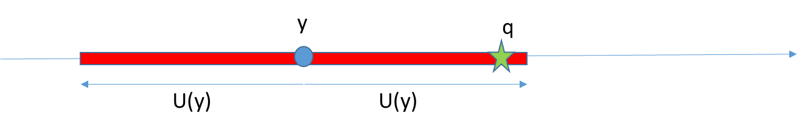

# U2·02 Marc teòric i definicions fonamentals

## 📑 Índice de Contenidos

- [1 El resultat de mesura com a variable aleatòria](#1-el-resultat-de-mesura-com-a-variable-aleatòria)
- [2 Valor veritable, estimació i interval de confiança](#2-valor-veritable-estimació-i-interval-de-confiança)
- [3 Paràmetres estadístics fonamentals](#3-paràmetres-estadístics-fonamentals)
- [4 Incertesa típica, incertesa expandida i factor de cobertura](#4-incertesa-típica-incertesa-expandida-i-factor-de-cobertura)

---

> [!NOTE] **Objectius d'aprenentatge**
>
> - Justificar per què, en metrologia moderna, el resultat d'una mesura s'interpreta com una **variable aleatòria** i identificar-ne les fonts de variabilitat.
> - Distingir la millor estimació del mesurand ( $y$ ) del valor veritable incognoscible ( $q$ ).
> - Diferenciar la **dispersió de les lectures** ( $s$ ) de la **dispersió de la mitjana** ( $s/\sqrt{N}$ ).
> - Definir amb precisió la incertesa típica, la incertesa expandida, el factor de cobertura i l'interval de confiança.

## 1 El resultat de mesura com a variable aleatòria

Un dels canvis conceptuals més importants de la instrumentació moderna és acceptar que el resultat d'una mesura no és un valor determinista, sinó la manifestació d'un procés subjecte a variabilitat. Dit d'una altra manera: el resultat d'una mesura s'ha d'entendre com una **variable aleatòria**.

Això no és un recurs retòric, sinó una conseqüència directa del funcionament físic dels instruments. En qualsevol mesura hi intervenen múltiples fonts de variació: soroll aleatori als circuits electrònics (per exemple, soroll tèrmic), quantització en els sistemes digitals (passos finits de l'ADC i de la visualització), interferències externes (camps electromagnètics, acoblaments), variacions ambientals (temperatura, humitat, vibració) i variabilitat del procediment (operador, connexions, contacte mecànic). Així, encara que el mesurand fos perfectament constant, repetir la mesura moltes vegades produiria una *distribució* de resultats: un núvol de valors al voltant d'un centre, amb una dispersió que depèn de la qualitat del sistema i de les condicions.

La GUM formalitza aquesta visió assumint que qualsevol resultat de mesura és una realització d'una variable aleatòria associada al procés. Convé no confondre *variabilitat estadística* amb *manca de rigor*: al contrari, el rigor metrològic consisteix precisament a modelar la variabilitat, estimar-ne la magnitud i documentar-la.

## 2 Valor veritable, estimació i interval de confiança

Denotem el valor veritable del mesurand com  $q$. Aquest valor és el que obtindria un sistema de mesura perfecte, i la idea central és que  **$q$  no es pot conèixer exactament**: si es conegués, la mesura seria innecessària; i fins i tot els patrons primaris tenen incertesa, de manera que només permeten aproximar  $q$, mai revelar-lo. Per això el treball metrològic no consisteix a «trobar  $q$ », sinó a produir una **estimació** del mesurand —que denotem  $y$ — i associar-li un interval amb una probabilitat explícita que contingui  $q$.

*Figura: Figura 2.1. Il·lustració del concepte d'incertesa a la mesura. A partir del coneixement del procediment, la GUM permet estimar un interval al voltant de $y$ que conté el valor veritable $q$ amb una probabilitat determinada.*

En termes pràctics,  $y$  pot ser una lectura directa d'un instrument (mesura directa) o el resultat d'una funció que combina diverses lectures i paràmetres (mesura indirecta), mitjançant un model de mesura  $Y=f(X_1,X_2,\dots)$  que s'estudia al document següent. En tots dos casos,  $y$  és la millor estimació disponible sota la informació i les condicions existents: si es fan  $N$  observacions repetides sense biaix, el millor estimador habitual és la mitjana aritmètica; si es fa una mesura única amb informació del fabricant o de calibratge,  $y$  continua essent la millor estimació, però la incertesa s'infereix per altres vies (avaluació de tipus B). Aquest plantejament és coherent amb la **Unitat 1**: un sistema pot tenir error sistemàtic (biaix) i soroll aleatori, i un bon procés corregeix el biaix i caracteritza el soroll.

## 3 Paràmetres estadístics fonamentals

Un cop acceptat que el resultat s'ha d'interpretar probabilísticament, cal quantificar la dispersió dels resultats possibles. Suposem  $N$  observacions repetides del mateix mesurand, en condicions comparables,  $x_1,\dots,x_N$. La **mitjana aritmètica** és:

$$
\bar{x}=\frac{1}{N}\sum_{i=1}^{N} x_i \qquad (2.2)
$$

Quan la distribució és simètrica i no hi ha biaix,  $\bar{x}$  és un estimador natural del valor del mesurand. La **variància mostral** (amb l'estimador no esbiaixat, que utilitza  $N-1$  al denominador) és:

$$
s^2=\frac{1}{N-1}\sum_{i=1}^{N}\left(x_i-\bar{x}\right)^2 \qquad (2.3)
$$

i la **desviació estàndard mostral**:

$$
s=\sqrt{\frac{1}{N-1}\sum_{i=1}^{N}\left(x_i-\bar{x}\right)^2} \qquad (2.4)
$$

Aquests dos paràmetres descriuen la dispersió de les observacions *individuals* al voltant de la mitjana. Ara bé, en metrologia sovint el resultat que es reporta no és una observació individual, sinó la mitjana  $\bar{x}$. El dubte rellevant és aleshores: quant variaria  $\bar{x}$  si repetíssim l'experiment complet amb un altre conjunt de  $N$  mesures? Sota la hipòtesi d'observacions independents, la **desviació estàndard de la mitjana** és:

$$
s_{\bar{x}}=\frac{s}{\sqrt{N}} \qquad (2.5)
$$

A diferència de  $s$, aquesta dispersió **es redueix** en augmentar  $N$. El resultat es fonamenta en una propietat clau —la variància de la suma de variables aleatòries independents és la suma de les variàncies—, que és precisament el que fa tan útil expressar la incertesa com una desviació estàndard, perquè després permet combinar incerteses. L'expressió (2.5) és la base de l'avaluació de la incertesa de tipus A, que es tracta al document corresponent.

## 4 Incertesa típica, incertesa expandida i factor de cobertura

La GUM defineix la **incertesa típica** (o estàndard) com la desviació estàndard dels possibles resultats de mesura. Si el resultat es modela com una variable aleatòria  $Y$, la incertesa típica és:

$$
u(y)=\sigma[Y] \qquad (2.6)
$$

En la pràctica,  $\sigma[Y]$  no és coneguda i s'estima. El primer pas de qualsevol avaluació és, doncs, estimar la desviació estàndard associada al resultat: aquest valor és la incertesa típica, i s'expressa sempre en les mateixes unitats que el mesurand (mai com un simple percentatge).

La incertesa típica té un significat estadístic clar, però per a moltes decisions d'enginyeria es prefereixen intervals amb probabilitats més elevades que el 68 % aproximat associat a una desviació estàndard en el cas normal. Per això es defineix la **incertesa expandida**  $U$  com el producte de la incertesa típica combinada per un **factor de cobertura**  $k$:

$$
U=k\,u_c(y) \qquad (2.7)
$$

i l'interval de confiança que en resulta,

$$
y-U \;\leq\; q \;\leq\; y+U \qquad (2.8)
$$

conté el valor veritable  $q$  amb una probabilitat preestablerta anomenada **nivell de confiança**. Com més gran és el nivell de confiança, més ample ha de ser l'interval i, per tant, més gran ha de ser  $k$. No existeix, doncs, una «incertesa única» independent del context: el mateix resultat es pot comunicar amb diferents  $k$  segons si interessa un 90 %, un 95 % o un 99 % de confiança. El factor  $k$  és el multiplicador que connecta la incertesa típica amb un interval d'un determinat nivell, i el seu valor depèn de la distribució de probabilitat assumida; la seva determinació s'aborda al document sobre la incertesa expandida.

> [!TIP] **Síntesi**
>
> El resultat de mesura s'interpreta com una variable aleatòria: encara amb un mesurand constant, múltiples fonts (soroll, quantització, interferències, ambient, procediment) en dispersen les lectures. El valor veritable  $q$  és incognoscible; el treball metrològic produeix una estimació  $y$  i un interval que conté  $q$  amb una probabilitat coneguda. Cal distingir la dispersió de les lectures  $s$  de la dispersió de la mitjana  $s/\sqrt{N}$, que sí que decreix amb  $N$. La incertesa típica és una desviació estàndard; multiplicada per un factor de cobertura  $k$  dona la incertesa expandida  $U$, que defineix l'interval  $y\pm U$  amb el nivell de confiança desitjat.

[← 1. Concepte d'incertesa, la GUM i la diferència entre error i incertesa](2_01_introduccio.md)[Índex de la unitat](2_00_index.md)[3. El model matemàtic de la mesura →](2_03_model_matematic.md)

---

## 📐 Formulario Resumen de Ecuaciones

| Nº / Ref | Expresión Matemática |
| :---: | :--- |
| **(2.2)** | $\bar{x}=\frac{1}{N}\sum_{i=1}^{N} x_i$ |
| **(2.3)** | $s^2=\frac{1}{N-1}\sum_{i=1}^{N}\left(x_i-\bar{x}\right)^2$ |
| **(2.4)** | $s=\sqrt{\frac{1}{N-1}\sum_{i=1}^{N}\left(x_i-\bar{x}\right)^2}$ |
| **(2.5)** | $s_{\bar{x}}=\frac{s}{\sqrt{N}}$ |
| **(2.6)** | $u(y)=\sigma[Y]$ |
| **(2.7)** | $U=k\,u_c(y)$ |
| **(2.8)** | $y-U \;\leq\; q \;\leq\; y+U$ |