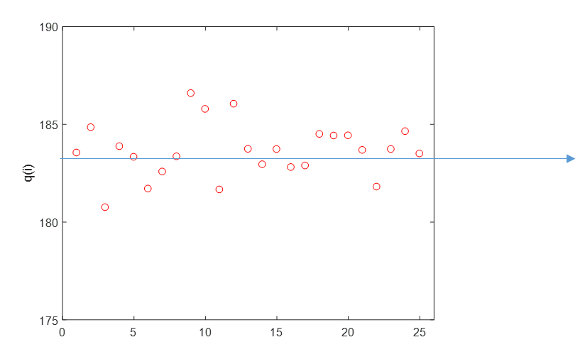

# U2·04 Avaluació de la incertesa de tipus A

## 📑 Índice de Contenidos

- [1 Requisits per aplicar l'avaluació de tipus A](#1-requisits-per-aplicar-lavaluació-de-tipus-a)
- [2 Neteja de dades: valors aberrants](#2-neteja-de-dades-valors-aberrants)
- [3 Estimació del mesurand i dispersions](#3-estimació-del-mesurand-i-dispersions)
- [4 La incertesa típica de tipus A](#4-la-incertesa-típica-de-tipus-a)
  - [D'on surt l'expressió](#don-surt-lexpressió)
- [5 La llei de l'arrel de N i els seus límits](#5-la-llei-de-larrel-de-n-i-els-seus-límits)

---

> [!NOTE] **Objectius d'aprenentatge**
>
> - Enunciar els tres requisits per aplicar l'avaluació de tipus A: repetibilitat, independència estadística i absència de biaix.
> - Reconèixer l'efecte dels valors aberrants i la necessitat de netejar les dades.
> - Calcular la incertesa típica de tipus A com  $u_A=s/\sqrt{N}$  i distingir la dispersió de les lectures de la dispersió de la mitjana.
> - Deduir l'expressió  $u_A=s/\sqrt{N}$  i comprendre el paper crític de la hipòtesi d'independència.
> - Interpretar la llei de  $\sqrt{N}$  i els seus límits pràctics.

L'avaluació de tipus A utilitza l'estadística per transformar una sèrie de lectures repetides en una estimació del mesurand i una quantificació del seu dubte. Es basa en una premissa: el millor predictor del comportament futur d'un sistema és el seu comportament passat observat estadísticament. Perquè la incertesa calculada tingui sentit, però, cal que es compleixin certes condicions.

## 1 Requisits per aplicar l'avaluació de tipus A

- **Condicions de repetibilitat.** Les mesures s'han de prendre en un període curt, pel mateix operador, amb el mateix instrument, al mateix lloc i sota condicions ambientals constants, de manera que l'única font de variació sigui l'error aleatori. Si les condicions canvien (per exemple, si la temperatura puja durant l'experiment), la dispersió ja no reflectirà només l'aleatorietat, sinó una deriva sistemàtica, i invalidarà l'anàlisi.
- **Independència estadística.** El valor d'una lectura no ha de condicionar el de la següent; el soroll ha de ser «blanc» (sense memòria). Si el sistema té una constant de temps llarga i mesurem molt de pressa, les lectures estaran correlacionades i l'estadística estàndard *subestimarà* greument la incertesa real.
- **Mesura sense biaix.** Perquè l'estimació del mesurand i la incertesa siguin representatives, el sistema no ha de tenir cap biaix (o aquest ha d'haver estat corregit prèviament).

Si es compleixen aquestes condicions, la dispersió dels resultats és una mesura directa de la qualitat del sistema i, juntament amb el nombre de mesures, determina la incertesa de tipus A.

## 2 Neteja de dades: valors aberrants

Abans d'estimar res, cal netejar les dades. En qualsevol sèrie poden aparèixer valors anòmals (*outliers*) causats per errors grollers. Un outlier té un efecte devastador sobre la mitjana i, especialment, sobre la desviació estàndard (els errors s'eleven al quadrat): un sol valor aberrant pot multiplicar la incertesa aparent per un factor de 10 o 100 sense cap justificació real. Un cop identificats —per inspecció visual o per criteris estadístics—, s'han d'eliminar del conjunt abans de procedir.

## 3 Estimació del mesurand i dispersions

Amb  $N$  dades vàlides i independents, si el sistema no té biaix el millor estimador del mesurand és la mitjana aritmètica, que serà el nostre resultat  $y$:

$$
\bar{x}=\frac{1}{N}\sum_{i=1}^{N} x_i \qquad (2.11)
$$

Els errors aleatoris, positius i negatius amb igual probabilitat, tendeixen a cancel·lar-se en sumar moltes mesures. Ara cal distingir dos conceptes de dispersió ben diferents:

- **Dispersió de la mostra** ( $s$ ): quant s'allunyen els punts individuals de la mitjana; ens diu com de sorollós és l'instrument. Si fem més mesures, no es redueix, sinó que s'estabilitza al voltant del soroll real del procés. Es calcula com la desviació estàndard experimental:

$$
s=\sqrt{\frac{1}{N-1}\sum_{i=1}^{N}\left(x_i-\bar{x}\right)^2} \qquad (2.12)
$$

- **Dispersió de la mitjana** ( $s_{\bar{x}}$ ): quant variaria la mitjana calculada si repetíssim tot l'experiment moltes vegades. Aquesta dispersió *sí* que es redueix en augmentar  $N$.

La incertesa de la mesura no es refereix a com de dispersa és una lectura individual, sinó a quant dubtem del resultat final, que és la mitjana. Per tant, la magnitud rellevant és la dispersió de la mitjana.

*Figura: Figura 2.2. Il·lustració del procediment de l'avaluació de tipus A: 25 lectures independents (punts) i la seva mitjana (línia). Si es repetís el procediment, la mitjana es desplaçaria; la incertesa de tipus A estima, a partir d'una sola sèrie, la desviació estàndard d'aquests possibles valors de la mitjana.*

## 4 La incertesa típica de tipus A

La GUM defineix la incertesa típica de tipus A com la desviació estàndard de la mitjana experimental:

$$
u_A=\frac{s}{\sqrt{N}} \qquad (2.13)
$$

on  $s$  és la desviació estàndard de les lectures individuals i  $N$  el nombre de mesures vàlides. Aquesta equació ens diu que podem reduir la incertesa del resultat augmentant  $N$, fins i tot amb un instrument sorollós.

### D'on surt l'expressió

Considerem que cada mesura  $X_i$  és una variable aleatòria; totes provenen del mateix procés (repetibilitat) i tenen la mateixa desviació estàndard teòrica  $\sigma$. El resultat és la mitjana:

$$
\bar{X}=\frac{1}{N}\sum_{i=1}^{N} X_i \qquad (2.14)
$$

Volem la variància de  $\bar{X}$. Aplicant l'operador variància:

$$
\mathrm{Var}\!\left[\bar{X}\right]=\mathrm{Var}\!\left[\frac{1}{N}\sum_{i=1}^{N} X_i\right] \qquad (2.15)
$$

Com que la variància d'una constant per una variable és la constant al quadrat per la variància:

$$
\mathrm{Var}\!\left[\bar{X}\right]=\frac{1}{N^2}\,\mathrm{Var}\!\left[\sum_{i=1}^{N} X_i\right] \qquad (2.16)
$$

Aquí entra la hipòtesi clau: si les  $X_i$  són **estadísticament independents**, la variància de la seva suma és igual a la suma de les variàncies, perquè els termes de covariància creuada són nuls:

$$
\mathrm{Var}\!\left[\sum_{i=1}^{N} X_i\right]=\sum_{i=1}^{N}\mathrm{Var}\!\left[X_i\right] \qquad (2.17)
$$

Com que totes les mesures es fan en les mateixes condicions i tenen la mateixa variància  $\sigma^2$:

$$
\mathrm{Var}\!\left[\sum_{i=1}^{N} X_i\right]=N\sigma^2 \qquad (2.18)
$$

Substituint en (2.16):

$$
\mathrm{Var}\!\left[\bar{X}\right]=\frac{1}{N^2}\,N\sigma^2=\frac{\sigma^2}{N} \qquad (2.19)
$$

La desviació estàndard és l'arrel quadrada de la variància:

$$
\sigma_{\bar{X}}=\frac{\sigma}{\sqrt{N}} \qquad (2.20)
$$

i, substituint el paràmetre poblacional  $\sigma$  pel seu estimador mostral  $s$, s'arriba a l'expressió pràctica de la incertesa de tipus A:

$$
u_A=\frac{s}{\sqrt{N}} \qquad (2.21)
$$

La demostració evidencia per què la independència és crítica: si les mesures no fossin independents, els termes de covariància no s'anul·larien, l'expressió (2.17) deixaria de ser vàlida i la fórmula  $s/\sqrt{N}$  subestimaria la incertesa real.

## 5 La llei de l'arrel de N i els seus límits

La millora de la incertesa va amb  $\sqrt{N}$: augmentar  $N$  és molt eficaç al principi, però esdevé ràpidament ineficient (multiplicar  $N$  per quatre només redueix  $u_A$  a la meitat). Matemàticament, si  $N\to\infty$,  $u_A\to 0$; a la pràctica, això és fals. Mai reduirem la incertesa a zero només fent mitjanes: sempre hi haurà límits imposats per errors sistemàtics residuals (incertesa de tipus B), deriva temporal o resolució finita. **La incertesa de tipus A només combat la component aleatòria; no soluciona un mal calibratge.**

> [!TIP] **Síntesi**
>
> L'avaluació de tipus A estima la incertesa a partir de  $N$  lectures repetides, sempre que es compleixin repetibilitat, independència i absència de biaix, i després d'eliminar els valors aberrants. El resultat és la mitjana (2.11), i la incertesa típica és la desviació estàndard de la mitjana,  $u_A=s/\sqrt{N}$  (2.13), que cal no confondre amb la dispersió de les lectures  $s$. La deducció (2.14)–(2.21) mostra que la independència és el que permet sumar variàncies; sense ella, els termes de covariància no s'anul·len i  $s/\sqrt{N}$  subestimaria la incertesa. La reducció segueix la llei de  $\sqrt{N}$, amb rendiments decreixents, i mai elimina el biaix ni les components de tipus B.

[← 3. El model matemàtic de la mesura](2_03_model_matematic.md)[Índex de la unitat](2_00_index.md)[5. Avaluació de la incertesa de tipus B →](2_05_tipus_B.md)

---

## 📐 Formulario Resumen de Ecuaciones

| Nº / Ref | Expresión Matemática |
| :---: | :--- |
| **(2.11)** | $\bar{x}=\frac{1}{N}\sum_{i=1}^{N} x_i$ |
| **(2.12)** | $s=\sqrt{\frac{1}{N-1}\sum_{i=1}^{N}\left(x_i-\bar{x}\right)^2}$ |
| **(2.13)** | $u_A=\frac{s}{\sqrt{N}}$ |
| **(2.14)** | $\bar{X}=\frac{1}{N}\sum_{i=1}^{N} X_i$ |
| **(2.15)** | $\mathrm{Var}\!\left[\bar{X}\right]=\mathrm{Var}\!\left[\frac{1}{N}\sum_{i=1}^{N} X_i\right]$ |
| **(2.16)** | $\mathrm{Var}\!\left[\bar{X}\right]=\frac{1}{N^2}\,\mathrm{Var}\!\left[\sum_{i=1}^{N} X_i\right]$ |
| **(2.17)** | $\mathrm{Var}\!\left[\sum_{i=1}^{N} X_i\right]=\sum_{i=1}^{N}\mathrm{Var}\!\left[X_i\right]$ |
| **(2.18)** | $\mathrm{Var}\!\left[\sum_{i=1}^{N} X_i\right]=N\sigma^2$ |
| **(2.19)** | $\mathrm{Var}\!\left[\bar{X}\right]=\frac{1}{N^2}\,N\sigma^2=\frac{\sigma^2}{N}$ |
| **(2.20)** | $\sigma_{\bar{X}}=\frac{\sigma}{\sqrt{N}}$ |
| **(2.21)** | $u_A=\frac{s}{\sqrt{N}}$ |