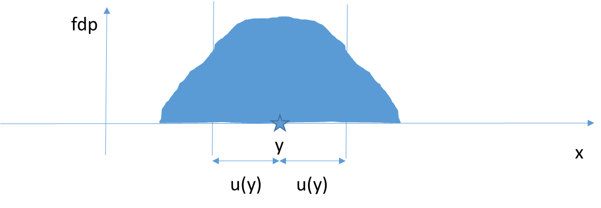
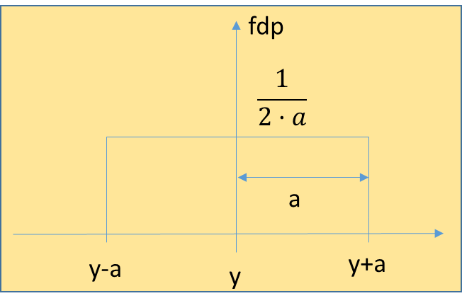
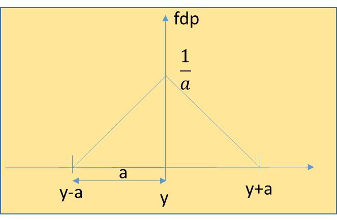
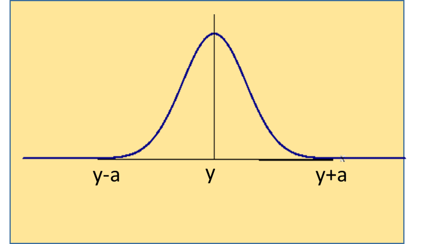
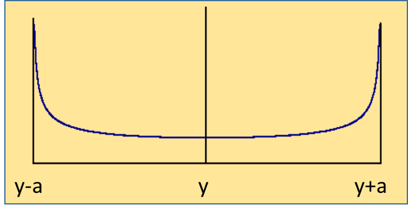

# U2·05 Avaluació de la incertesa de tipus B

## 📑 Índice de Contenidos

- [1 Fonts d'informació](#1-fonts-dinformació)
- [2 Com escollir la distribució: màxima entropia](#2-com-escollir-la-distribució-màxima-entropia)
- [3 Les quatre distribucions](#3-les-quatre-distribucions)
  - [Distribució uniforme (rectangular)](#distribució-uniforme-rectangular)
  - [Distribució triangular](#distribució-triangular)
  - [Distribució normal (gaussiana)](#distribució-normal-gaussiana)
  - [Distribució en forma de U (arcsinus)](#distribució-en-forma-de-u-arcsinus)
- [4 Comparació per a un mateix semi-interval](#4-comparació-per-a-un-mateix-semi-interval)

---

> [!NOTE] **Objectius d'aprenentatge**
>
> - Reconèixer les fonts d'informació per a una avaluació de tipus B i el paper del judici científic.
> - Assignar una funció de densitat de probabilitat (fdp) segons la informació disponible, aplicant el principi de màxima entropia.
> - Convertir toleràncies, especificacions i certificats en una incertesa típica equivalent.
> - Aplicar els divisors característics de les distribucions uniforme ( $\sqrt{3}$ ), triangular ( $\sqrt{6}$ ), normal ( $k$ ) i en U ( $\sqrt{2}$ ).
> - Comparar la dispersió que aporta cada distribució per a un mateix semi-interval d'error.

Sovint no és possible ni pràctic fer múltiples lectures per caracteritzar cada variable. Si fem servir una resistència patró, no la mesurarem mil vegades: confiarem en el valor nominal i la tolerància del fabricant. Aquí entra l'**avaluació de tipus B**, que no es basa en l'estadística de noves observacions, sinó en el judici científic i el coneixement previ. Segons la GUM, una incertesa de tipus B no és menys rigorosa que una de tipus A; de fet, en molts calibratges industrials és la component dominant. El repte és traduir informació qualitativa o semiquantitativa en una desviació estàndard equivalent  $u$.

A diferència del tipus A, partim d'una **única estimació** del mesurand (una lectura, un valor nominal) i li associem una fdp centrada en aquesta estimació, generalment simètrica. La desviació estàndard d'aquesta fdp és la incertesa típica de tipus B.

*Figura: Figura 2.3. Procés d'avaluació de la incertesa de tipus B: a partir d'una mesura $y$ s'assigna una fdp centrada al voltant seu, i la seva desviació típica $u(y)$ és la incertesa típica.*

## 1 Fonts d'informació

La GUM llista diverses fonts vàlides que l'avaluador ha d'explorar i documentar:

- **Especificacions del fabricant** (datasheets): garanties d'exactitud o tolerància. És la font més habitual en electrònica.
- **Certificats de calibratge**: proporcionen l'error mesurat i, crucialment, la incertesa expandida  $U$  i el factor de cobertura  $k$. Són informació de màxima qualitat.
- **Dades de mesures anteriors**: històrics de control de qualitat o caracteritzacions prèvies (per exemple, una deriva coneguda d'un termoparell).
- **Lleis físiques i constants de referència**: valors amb incerteses publicades. Ara bé, les constants fonamentals que *defineixen* el SI, usades amb tots els seus dígits, no tenen incertesa associada.
- **Experiència i coneixement general**: comportament conegut dels materials (histèresi, coeficients tèrmics) o de l'operador.

## 2 Com escollir la distribució: màxima entropia

Com que no tenim un histograma de dades reals, hem de suposar com es distribueixen els valors possibles dins de l'interval d'incertesa. El principi rector és el **criteri de màxima entropia** (principi d'indiferència): triar la distribució que incorpori tota la informació que tenim, però *cap informació que no tinguem*. Afegir hipòtesis no justificades per reduir la incertesa seria inventar informació.

- Si només coneixem uns límits  $\pm a$  i res més, no hi ha motiu per pensar que el centre és més probable que els extrems: la distribució de màxima entropia és la **uniforme**.
- Si tenim raons físiques per creure que els valors centrals són més probables (un procés que apunta al centre), es justifica la **triangular**.
- Si coneixem una dispersió característica i l'error és suma de moltes causes petites, el teorema del límit central porta a la **normal**.

## 3 Les quatre distribucions

### Distribució uniforme (rectangular)

És l'opció «per defecte» quan la informació prové de fulls de dades o toleràncies que només donen uns límits  $\pm a$  sense nivell de confiança. Assumeix que el valor pot trobar-se amb igual probabilitat en qualsevol punt de l'interval. La incertesa típica és:

$$
u=\frac{a}{\sqrt{3}} \qquad (2.22)
$$

*Figura: Figura 2.4. Distribució uniforme.*

Per exemple, un voltímetre digital que mostra «5,000 V» té un error de quantificació limitat a mig dígit de l'últim dígit. Si la resolució és d'1 mV, la semiamplada és  $a=0{,}5$  mV i la incertesa típica de resolució és  $u=0{,}5/\sqrt{3}\approx 0{,}29$  mV. De la mateixa manera, una resistència de 1 kΩ amb tolerància del ±5 % té una semiamplada  $a=50$  Ω, de manera que  $u=50/\sqrt{3}\approx 29$  Ω.

### Distribució triangular

S'utilitza quan tenim uns límits  $\pm a$  però tenim evidència que els valors extrems són molt menys probables que els centrals; la probabilitat creix linealment des dels extrems fins al centre. La incertesa típica és:

$$
u=\frac{a}{\sqrt{6}} \qquad (2.23)
$$

*Figura: Figura 2.5. Distribució triangular.*

La incertesa resultant és menor que en la uniforme perquè estem «premiant» la informació sobre la centralitat. És adequada, per exemple, en una lectura analògica interpolada (l'ull tendeix a centrar la lectura), en la suma de dues variables uniformes de la mateixa amplada (la convolució de dos rectangles és un triangle) o en un ajust manual on l'operador apunta al centre.

### Distribució normal (gaussiana)

S'assigna quan la informació de partida ja ve en termes probabilístics, típicament amb un nivell de confiança o un factor de cobertura. No té límits estrictes (les cues s'estenen a l'infinit). Si ens donen una incertesa expandida  $U$  i un factor  $k$, desfem el camí:

$$
u=\frac{U}{k} \qquad (2.24)
$$

*Figura: Figura 2.6. Distribució normal.*

Si ens donen  $U$  al 95 % de confiança prenem  $k\approx 2$  (més exactament 1,96); si ens el donen al 99,7 % («3 sigma»), prenem  $k=3$. Cada cop és més freqüent que els fabricants indiquin el factor de cobertura per poder aplicar (2.24). La norma ISO/IEC 17025 obliga els laboratoris a reportar  $U$  i  $k$. Un altre cas natural és el soroll Johnson-Nyquist d'una resistència: com que és resultat de milions de col·lisions aleatòries d'electrons, pel teorema del límit central segueix una distribució normal, i la seva incertesa típica és igual al valor eficaç (RMS) del soroll.

### Distribució en forma de U (arcsinus)

Menys comuna, però crucial en instrumentació elèctrica: apareix quan la variable oscil·la sinusoidalment entre dos límits i es mostreja en un instant aleatori. És molt més probable trobar el valor a prop dels pics (on el sinus es mou a poc a poc) que al pas per zero. Per a una amplitud de pic  $A$, la incertesa típica (valor RMS) és:

$$
u=\frac{A}{\sqrt{2}} \qquad (2.25)
$$

*Figura: Figura 2.7. Distribució en forma de U.*

És la distribució amb més dispersió de totes per a una mateixa cota. Un cas típic és una interferència de xarxa (50 Hz) d'amplitud  $A$  superposada a un senyal de contínua que l'instrument no filtra completament: l'error màxim és  $A$  i la incertesa típica,  $A/\sqrt{2}$.

## 4 Comparació per a un mateix semi-interval

Per a un mateix semi-interval d'error  $a$, la incertesa típica varia segons el que sabem de la distribució:

| Distribució | Coneixement implícit | Incertesa típica |
|:--- |:--- |:--- |
| En U | Valors extrems més probables (oscil·lació) | $a/\sqrt{2}\approx 0{,}707\,a$ |
| Uniforme | Cap coneixement (màxima entropia) | $a/\sqrt{3}\approx 0{,}577\,a$ |
| Triangular | Valors centrals més probables | $a/\sqrt{6}\approx 0{,}408\,a$ |
| Normal | Probabilitat definida ( $U$,  $k$ ) | $U/k$  (variable) |

La taula il·lustra la importància del judici: davant una mateixa especificació de «error màxim», un enginyer que esculli la distribució en U estimarà una incertesa gairebé el doble de gran que un que pugui justificar una triangular. La GUM recomana la uniforme quan no hi ha informació per decantar-se, i insisteix a **documentar sempre la fdp emprada**: així, si més endavant es troba que no era l'adient, es pot recuperar el semi-interval  $a$  i recalcular la incertesa amb una altra distribució.

> [!TIP] **Síntesi**
>
> L'avaluació de tipus B tradueix informació prèvia (datasheets, certificats, històrics, lleis, experiència) en una incertesa típica, assignant una fdp centrada en l'estimació segons el principi de màxima entropia. Els quatre models bàsics donen  $u=a/\sqrt{3}$  (uniforme),  $u=a/\sqrt{6}$  (triangular),  $u=U/k$  (normal) i  $u=A/\sqrt{2}$  (en U). Per a un mateix semi-interval, la distribució en U és la més dispersa i la triangular la menys. Cal documentar sempre la distribució escollida per poder revisar el càlcul.

[← 4. Avaluació de la incertesa de tipus A](2_04_tipus_A.md)[Índex de la unitat](2_00_index.md)[6. Combinació d'incerteses en mesures indirectes →](2_06_combinacio.md)

---

## 📐 Formulario Resumen de Ecuaciones

| Nº / Ref | Expresión Matemática |
| :---: | :--- |
| **(2.22)** | $u=\frac{a}{\sqrt{3}}$ |
| **(2.23)** | $u=\frac{a}{\sqrt{6}}$ |
| **(2.24)** | $u=\frac{U}{k}$ |
| **(2.25)** | $u=\frac{A}{\sqrt{2}}$ |