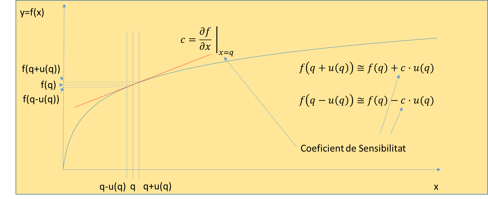
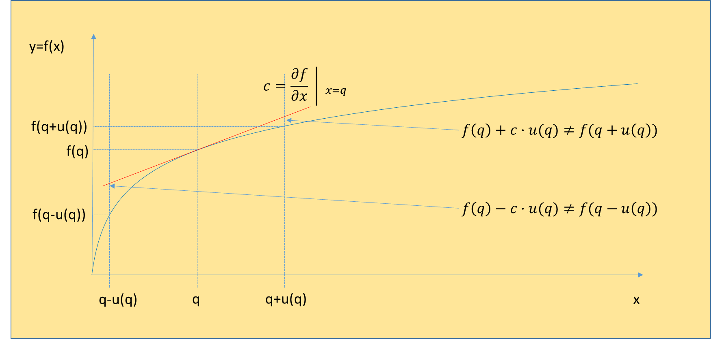

# U2·06 Combinació d'incerteses en mesures indirectes

## 📑 Índice de Contenidos

- [1 Linealització del model](#1-linealització-del-model)
- [2 Coeficients de sensibilitat](#2-coeficients-de-sensibilitat)
- [3 La incertesa típica combinada](#3-la-incertesa-típica-combinada)
- [4 Variables correlacionades: termes de covariància](#4-variables-correlacionades-termes-de-covariància)
- [5 Quan la linealització no és fiable: Monte Carlo](#5-quan-la-linealització-no-és-fiable-monte-carlo)

---

> [!NOTE] **Objectius d'aprenentatge**
>
> - Deduir la llei de propagació de la incertesa a partir de la linealització de Taylor del model de mesura.
> - Calcular els coeficients de sensibilitat i interpretar-ne la magnitud, el signe i les unitats.
> - Combinar les contribucions en quadratura per a variables independents.
> - Reconèixer quan cal afegir termes de covariància i quin efecte hi té el signe de la correlació.
> - Identificar les situacions en què la linealització deixa de ser fiable i què aporta el mètode de Monte Carlo.

La majoria de mesures s'obtenen de manera indirecta: mesurem diverses magnituds  $X_i$  i les combinem mitjançant un model per obtenir el resultat  $Y$. Ja sabem estimar la incertesa de cada variable (tipus A o B); ara abordem el problema central: com es combinen aquestes incerteses individuals per obtenir la incertesa del resultat final. El procés s'anomena **combinació d'incerteses** i es fonamenta en la **llei de propagació de la incertesa**.

## 1 Linealització del model

El fonament teòric és el càlcul diferencial. Suposem uns valors mesurats  $x_i$  (les millors estimacions) i el resultat  $y=f(x_1,\dots,x_N)$. Si el valor real de cada entrada es desvia lleugerament del mesurat, el de la sortida també ho farà. Per trobar la relació, expandim  $f$  en sèrie de Taylor al voltant del punt de mesura i ens quedem amb els termes de primer ordre:

$$
\Delta y \approx \sum_{i=1}^{N}\frac{\partial f}{\partial x_i}\,\Delta x_i \qquad (2.26)
$$

Aquesta aproximació és vàlida sempre que les incerteses siguin petites comparades amb la curvatura (no-linealitat) de  $f$.

*Figura: Figura 2.8. Definició dels coeficients de sensibilitat: la funció $f$ s'aproxima per la recta tangent en el punt nominal, i el seu pendent determina com la incertesa d'entrada es transmet al resultat.*

## 2 Coeficients de sensibilitat

Les derivades parcials que apareixen en l'expansió reben el nom de **coeficients de sensibilitat**:

$$
c_i=\frac{\partial f}{\partial x_i} \qquad (2.27)
$$

Cada  $c_i$  es calcula derivant el model respecte a la variable  $x_i$  i substituint-hi després els valors nominals. Per exemple, si mesurem potència amb  $P=V\cdot I$, aleshores  $c_V=\partial P/\partial V=I$  i  $c_I=\partial P/\partial I=V$.

El coeficient  $c_i$  indica com de sensible és el resultat als errors d'aquella variable: si  $c_i$  és gran, una petita incertesa en  $x_i$  provocarà una gran incertesa en  $y$  (variable crítica); si és petit, aquella variable afecta poc. Les seves unitats són les del mesurand dividides per les de l'entrada (per exemple, W/V = A per al coeficient de la tensió en calcular la potència): així, quan multipliquem la incertesa d'entrada  $u(x_i)$  pel seu coeficient, el producte  $c_i\,u(x_i)$  queda en les unitats de sortida.

## 3 La incertesa típica combinada

Si les variables d'entrada són independents, la variància total és la suma de les variàncies individuals ponderades pels quadrats dels coeficients de sensibilitat:

$$
u_c^2(y)=\sum_{i=1}^{N} c_i^{\,2}\,u^2(x_i) \qquad (2.28)
$$

i la incertesa típica combinada és l'arrel quadrada d'aquesta suma (suma en quadratura):

$$
u_c(y)=\sqrt{\sum_{i=1}^{N} c_i^{\,2}\,u^2(x_i)} \qquad (2.29)
$$

Aquesta fórmula és la pedra angular de la GUM. Pressuposa **independència** entre les variables d'entrada (en el curs, dissenyem els experiments per assegurar-la) i té una propietat important: **penalitza els termes grans**. Si una font és molt més gran que les altres (per exemple, 10 enfront d'1), la petita esdevé insignificant en la suma quadràtica ( $\sqrt{10^2+1^2}=\sqrt{101}\approx 10{,}05$ ). Això indica on cal focalitzar els esforços: reduir la incertesa dominant és l'única manera eficaç de millorar el sistema.

## 4 Variables correlacionades: termes de covariància

Quan les variables d'entrada **no** són independents —per exemple, si es mesuren amb el mateix instrument, que té una deriva tèrmica, o si depenen d'una referència comuna—, la suma simple de variàncies falla i cal afegir termes que tinguin en compte la correlació:

$$
u_c^2(y)=\sum_{i=1}^{N} c_i^{\,2}\,u^2(x_i)+2\sum_{i=1}^{N-1}\sum_{j=i+1}^{N} c_i\,c_j\,u(x_i,x_j) \qquad (2.30)
$$

on  $u(x_i,x_j)=r(x_i,x_j)\,u(x_i)\,u(x_j)$  és la **covariància** entre  $x_i$  i  $x_j$, i  $r$  el coeficient de correlació. L'efecte del terme creuat depèn del signe:

- Si la correlació és **positiva** i els coeficients de sensibilitat tenen el **mateix signe**, el terme creuat és positiu i la incertesa combinada *augmenta* respecte al cas independent.
- Si la correlació és **negativa** (o els coeficients tenen signes oposats), el terme creuat és negatiu i les contribucions es poden *compensar parcialment*, de manera que la incertesa combinada es redueix. Aquesta compensació és parcial: no anul·la la incertesa.

La GUM no prohibeix tractar variables correlacionades, sinó que en proporciona la formulació completa (2.30). Ara bé, en la pràctica habitual d'enginyeria —i en aquest curs, llevat que es digui el contrari— dissenyem els experiments per assegurar la independència i utilitzem la fórmula simplificada (2.29).

## 5 Quan la linealització no és fiable: Monte Carlo

Hi ha situacions en què la propagació basada en derivades no és fiable: quan el model és fortament no lineal respecte a la magnitud de les incerteses (la curvatura és important dins de l'interval d'error), quan la fdp de sortida no s'assembla a una normal (per límits físics abruptes) o quan el càlcul de derivades parcials és intractable.

*Figura: Figura 2.9. Exemple on la linealització no és vàlida: amb una incertesa gran en $x$, l'aproximació lineal és errònia i l'interval de sortida no queda centrat en $f(q)$.*

En aquests casos, la GUM (suplement 1) recomana el **mètode de Monte Carlo**, que propaga incerteses sense substituir el model per una aproximació lineal. El procediment és conceptualment senzill: s'assigna una fdp a cada magnitud d'entrada (amb valor mitjà igual al nominal i desviació igual a  $u(x_i)$ ); es generen moltes realitzacions aleatòries de les entrades, on cada conjunt representa possibles valors reals de les magnituds; es calcula el resultat amb el model *exacte* per a cada conjunt; i s'analitza l'histograma dels milers de resultats. D'aquest histograma s'obtenen directament la **mitjana** (millor estimació del mesurand), la **desviació estàndard** (que és la incertesa típica combinada  $u_c$ ) i els **percentils** (per exemple, 2,5 % i 97,5 % per a un interval del 95 %).

El mètode és universal i, a més, mostra la forma real de la distribució de sortida —si és simètrica, asimètrica o multimodal—, cosa que la fórmula analítica no pot veure. Quan diverses fonts independents es combinen, el teorema del límit central fa que la sortida s'aproximi a una normal; però si una única font domina, la distribució pot conservar trets de la seva fdp. Per a incerteses petites, Monte Carlo i la llei de propagació coincideixen gairebé perfectament, cosa que valida l'ús de la fórmula analítica —més ràpida— per al dia a dia.

> [!TIP] **Síntesi**
>
> La llei de propagació linealitza el model amb una sèrie de Taylor de primer ordre. Els coeficients de sensibilitat  $c_i=\partial f/\partial x_i$  mesuren com cada entrada afecta la sortida i homogeneïtzen les unitats. Per a variables independents, les contribucions  $c_i\,u(x_i)$  es combinen en quadratura fins a  $u_c(y)=\sqrt{\sum c_i^2 u^2(x_i)}$, fórmula que penalitza les fonts grans i assenyala on convé millorar. Si hi ha correlació cal afegir termes de covariància (2.30): una correlació positiva amb coeficients del mateix signe augmenta la incertesa, i una de negativa la pot compensar parcialment. Quan la linealització falla —forta no-linealitat, distribucions no normals o derivades intractables— s'utilitza el mètode de Monte Carlo, que assigna una fdp a cada entrada, genera moltes realitzacions i n'obté la mitjana, la desviació estàndard ( $u_c$ ) i els percentils a partir de l'histograma de sortida.

[← 5. Avaluació de la incertesa de tipus B](2_05_tipus_B.md)[Índex de la unitat](2_00_index.md)[7. Incertesa expandida, factor de cobertura i graus de llibertat →](2_07_incertesa_expandida.md)

---

## 📐 Formulario Resumen de Ecuaciones

| Nº / Ref | Expresión Matemática |
| :---: | :--- |
| **(2.26)** | $\Delta y \approx \sum_{i=1}^{N}\frac{\partial f}{\partial x_i}\,\Delta x_i$ |
| **(2.27)** | $c_i=\frac{\partial f}{\partial x_i}$ |
| **(2.28)** | $u_c^2(y)=\sum_{i=1}^{N} c_i^{\,2}\,u^2(x_i)$ |
| **(2.29)** | $u_c(y)=\sqrt{\sum_{i=1}^{N} c_i^{\,2}\,u^2(x_i)}$ |
| **(2.30)** | $u_c^2(y)=\sum_{i=1}^{N} c_i^{\,2}\,u^2(x_i)+2\sum_{i=1}^{N-1}\sum_{j=i+1}^{N} c_i\,c_j\,u(x_i,x_j)$ |