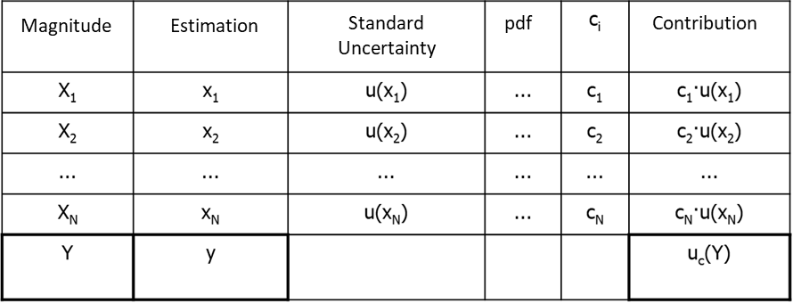

# U2·08 Expressió final del resultat i balanç d'incertesa

## 📑 Índice de Contenidos

- [1 El balanç d'incertesa](#1-el-balanç-dincertesa)
- [2 Anàlisi de dominància](#2-anàlisi-de-dominància)
- [3 Regles de format del resultat final](#3-regles-de-format-del-resultat-final)

---

> [!NOTE] **Objectius d'aprenentatge**
>
> - Construir un balanç d'incertesa i interpretar-ne la columna de contribucions per identificar la font dominant.
> - Calcular la incertesa combinada com l'arrel de la suma de quadrats de les contribucions.
> - Aplicar les regles d'arrodoniment i de format en l'expressió final del resultat.

La documentació del procés és tan important com el resultat numèric. Un sol número final no permet a ningú auditar el procés, detectar errors o saber què cal millorar. Per això la GUM recomana presentar els resultats en forma de **balanç d'incertesa** (*uncertainty budget*): una taula que mostra, fila per fila, com cada magnitud d'entrada contribueix a la incertesa final.

## 1 El balanç d'incertesa

Les columnes estàndard són: la **magnitud** d'entrada; la seva **estimació** (valor nominal); la seva **incertesa típica**  $u(x_i)$; la **fdp** que se li presumeix; el **coeficient de sensibilitat**  $c_i$; i la **contribució**, producte (en valor absolut) de la incertesa típica pel coeficient de sensibilitat, que indica com la incertesa de cada magnitud es propaga cap a la sortida. A l'última fila s'hi indica l'estimació de la mesura indirecta  $y$, obtinguda substituint els valors nominals en el model.

*Figura: Figura 2.10. Taula genèrica per al balanç d'incertesa.*

| Magnitud | Estimació | $u(x_i)$ | fdp | $c_i$ | Contribució  $|c_i|\,u(x_i)$ |
|:--- |:--- |:--- |:--- |:--- |:--- |
| $x_1$ | $x_1$ | $u(x_1)$ | — | $c_1$ | $|c_1|\,u(x_1)$ |
| $x_2$ | $x_2$ | $u(x_2)$ | — | $c_2$ | $|c_2|\,u(x_2)$ |
| $\vdots$ |  |  |  |  | $\vdots$ |
| $y$ | $f(x_1,x_2,\dots)$ |  |  |  | $u_c(y)$ |

La cel·la inferior dreta no és la suma aritmètica, sinó l'arrel quadrada de la suma de quadrats de la columna de contribucions:

$$
u_c(y)=\sqrt{\sum_{i=1}^{N}\left[\,c_i\,u(x_i)\,\right]^2} \qquad (2.34)
$$

## 2 Anàlisi de dominància

El valor principal de la taula és visual: permet una anàlisi de dominància immediata mirant la columna de contribucions. Si una contribució és, per exemple, de 5 unitats i la següent d'1, la suma quadràtica és  $\sqrt{5^2+1^2}\approx 5{,}10$: la font petita és pràcticament irrellevant. Per millorar el sistema cal atacar primer la font principal. Així, el balanç transforma la metrologia d'una tasca burocràtica en una eina de disseny: indica exactament on invertir (un sensor millor, més control de temperatura) i on es pot estalviar (un component més barat sense empitjorar la qualitat global).

## 3 Regles de format del resultat final

El resultat s'ha d'escriure seguint unes regles estrictes per evitar ambigüitats:

- La incertesa expandida  $U$  s'arrodoneix, normalment, a dues xifres significatives (per exemple, 0,012 V, no 0,01234 V). No té sentit donar cinc decimals sobre un dubte.
- El resultat  $y$  s'arrodoneix per tenir el mateix dígit menys significatiu que la incertesa. Si  $U=0{,}012$  V, aleshores  $y$  ha de tenir tres decimals (per exemple 1,530 V, no 1,5304 V ni 1,53 V).
- Sempre s'ha d'indicar el factor de cobertura  $k$  utilitzat (i, convé, el nivell de confiança associat).

Un exemple de report adequat seria: «El valor mesurat de la resistència és  $R=84{,}9\pm 2{,}9$  kΩ. La incertesa expandida es basa en una incertesa típica multiplicada per un factor de cobertura  $k=2$, que proporciona un nivell de confiança d'aproximadament el 95 %.» Amb aquesta frase, dades disperses s'han convertit en una afirmació tècnica precisa, acotada i útil per a la presa de decisions.

> [!TIP] **Síntesi**
>
> El balanç d'incertesa documenta, fila per fila, l'estimació, la incertesa típica, la fdp, el coeficient de sensibilitat i la contribució de cada magnitud d'entrada. La incertesa combinada és l'arrel de la suma de quadrats de les contribucions (2.34), i la columna de contribucions permet identificar la font dominant i decidir on millorar. El resultat final s'expressa arrodonint  $U$  a dues xifres significatives, ajustant  $y$  al mateix dígit menys significatiu i indicant sempre el factor de cobertura  $k$.

[← 7. Incertesa expandida, factor de cobertura i graus de llibertat](2_07_incertesa_expandida.md)[Índex de la unitat](2_00_index.md)

---

## 📐 Formulario Resumen de Ecuaciones

| Nº / Ref | Expresión Matemática |
| :---: | :--- |
| **(2.34)** | $u_c(y)=\sqrt{\sum_{i=1}^{N}\left[\,c_i\,u(x_i)\,\right]^2}$ |