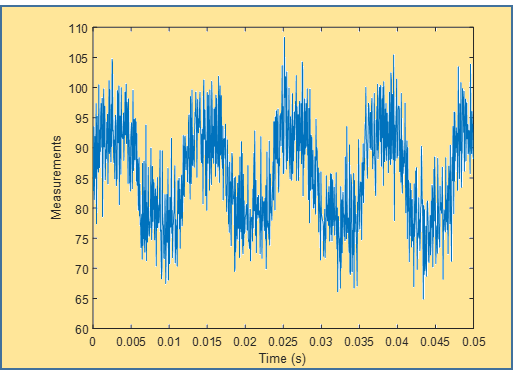
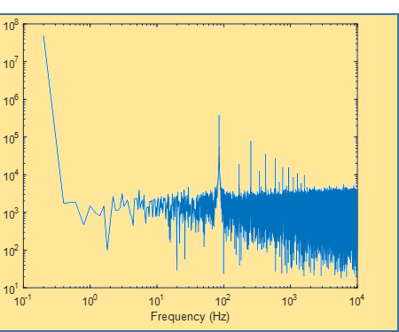

# U3 · 1. Fonaments i classificació de les interferències

## 📑 Índice de Contenidos

- [1 Soroll i interferència en la mesura](#1-soroll-i-interferència-en-la-mesura)
  - [Representació temporal i espectral](#representació-temporal-i-espectral)
- [2 Compatibilitat electromagnètica](#2-compatibilitat-electromagnètica)
  - [El marc normatiu](#el-marc-normatiu)
- [3 Classificació per origen de la font](#3-classificació-per-origen-de-la-font)
  - [Interferències naturals](#interferències-naturals)
  - [Interferències artificials](#interferències-artificials)
- [4 Classificació per canal de transmissió](#4-classificació-per-canal-de-transmissió)
  - [Interferències conduïdes](#interferències-conduïdes)
  - [Interferències radiades: camp proper i camp llunyà](#interferències-radiades-camp-proper-i-camp-llunyà)

---

> [!NOTE] **Objectius d'aprenentatge**
>
> - Distingir el **soroll** de la **interferència** per la seva naturalesa, origen, espectre i estratègia de reducció.
> - Descriure l'estructura **font–canal–receptor** de tot problema electromagnètic i el marc normatiu de compatibilitat electromagnètica (EMC).
> - Classificar una interferència pel seu **origen** (natural o artificial; intencionada o involuntària) i pel seu **canal de transmissió** (conduïda o radiada).
> - Situar el problema en **camp proper** o **llunyà** a partir de la freqüència i la distància, i anticipar la separació entre acoblament capacitiu i inductiu.

En tot sistema electrònic de mesura, el senyal desitjat es superposa sempre amb efectes no desitjats que en deterioren la qualitat. Aquests efectes es classifiquen en dues grans categories — el **soroll** i les **interferències** — que, tot i tractar-se sovint conjuntament, tenen orígens, característiques i metodologies de reducció fonamentalment diferents. Aquesta unitat s'ocupa de les interferències; el soroll es tracta en la unitat 4.

## 1 Soroll i interferència en la mesura

El **soroll** es defineix com la presència de variacions aleatòries i impredictibles en els senyals del sistema de mesura. Sorgeix de fenòmens físics de naturalesa estocàstica, tant en els components electrònics com en els transductors i els cables. Es pot modelar com una superposició de tensions i corrents de valor mitjà nul. Les seves característiques principals són:

- **Espectre ample:** ocupa una amplada de banda molt més gran que la de les interferències periòdiques. En el cas particular del **soroll blanc**, la seva densitat espectral de potència és pràcticament constant amb la freqüència i està present a tota la banda de mesura.
- **Naturalesa contínua:** a diferència dels esdeveniments impulsius, afecta el sistema de manera constant.

Les estratègies de reducció del soroll són complementàries: seleccionar components de baix soroll (encara que siguin més cars), integrar el senyal per reduir l'efecte estadístic de les fluctuacions, i limitar l'amplada de banda del sistema al mínim necessari mitjançant filtratge, atès que un sistema de banda més estreta capta menys soroll. Com a exemple, si es mesura una tensió contínua d'1 V en presència de soroll blanc de desviació estàndard 10 mV, cada lectura individual pot variar aproximadament entre 0,97 V i 1,03 V; en canvi, la mitjana de 100 mesures redueix la incertesa típica a l'entorn d'1 mV, ja que en promitjar *N* lectures independents la desviació típica del promig es divideix per l'arrel de *N*.

Una **interferència electromagnètica** (EMI, *Electromagnetic Interference*) es defineix com qualsevol senyal periòdic — no necessàriament sinusoïdal, sinó compost genèricament per una freqüència fonamental i una sèrie d'harmònics — que no és emprat pel sistema per fer la mesura, però que en pot pertorbar el resultat. Tradicionalment també s'hi inclouen els esdeveniments impulsius externs que, tot i ser rars, per la seva gran amplitud poden afectar esporàdicament la mesura; com que les seves estratègies de mitigació són radicalment diferents, les interferències impulsives s'estudien en cursos superiors i aquesta unitat es limita a les **interferències periòdiques**. Les seves característiques distintives són:

- **Origen habitualment humà i extern:** exemples típics són la xarxa de distribució a 50 Hz (60 Hz en altres països), les emissions de telefonia mòbil de l'ordre dels gigahertz, l'encesa elèctrica de motors o l'electrònica industrial.
- **Espectre estret:** concentrat en una freqüència fonamental i alguns harmònics (múltiples enters de la fonamental), a diferència de la banda ampla del soroll blanc.
- **Periodicitat:** presenten una estructura periòdica ben definida, expressable com una sèrie de Fourier amb un nombre limitat de components significatius.

La interferència no prové sempre de fonts externes. En una placa de circuit imprès, una pista que transporta un rellotge digital pot acoblar-se a una pista de la cadena de mesura: encara que aquest senyal és necessari per al funcionament del sistema, se suma de manera no desitjada al senyal d'interès i, per tant, actua com a interferència interna.

Perquè soroll i interferència determinen estratègies de reducció completament divergents. La reducció de soroll se centra a minimitzar les fonts internes i condicionar el senyal; la reducció d'interferència se centra, típicament, a **bloquejar el canal de transmissió** entre la font i el receptor. La taula 3.1 en resumeix les diferències.

| Aspecte | Soroll | Interferència periòdica |
|:--- |:--- |:--- |
| Naturalesa | Aleatòria, impredictible | Periòdica, determinista |
| Origen típic | Intern del sistema de mesura | Generalment extern, d'origen humà |
| Espectre | Amplada de banda gran (blanc: constant en freqüència) | Estret (fonamental i harmònics) |
| Reducció | Components de baix soroll, filtres passa-baix, mitjana | Modificació del canal de transmissió, filtres de banda eliminada |

La presència simultània de soroll i interferència degrada la **repetibilitat** del sistema: mentre un sistema ideal donaria sempre el mateix valor, un de real proporciona lectures que varien al voltant del valor veritable. Millorar la repetibilitat exigeix reduir alhora soroll i interferència, cosa que sol comportar solucions més costoses o complexes; el disseny és, doncs, una negociació constant entre cost i qualitat. Si es vol mesurar un senyal de 100 µV en presència d'1 mV de soroll i interferència combinats, l'efecte pertorbador és deu vegades més gran que el senyal i el sistema no el pot detectar de manera fiable sense reduir-lo abans.

### Representació temporal i espectral

Un senyal observat es pot descompondre com la suma del senyal útil, la interferència i el soroll:

$$
x(t) = s(t) + i(t) + n(t) \qquad (3.1)
$$

on

$$
s(t)
$$

  és el senyal d'interès,

$$
i(t)
$$

  la interferència superposada i

$$
n(t)
$$

  el soroll additiu. En el **domini temporal**, el senyal d'interès varia lentament o amb una freqüència ben definida; la interferència apareix com una oscil·lació periòdica clara (per exemple, els 50 Hz de la xarxa); i el soroll es manifesta com una fluctuació aleatòria contínua sense patró reconeixible. La figura 3.1 mostra un senyal continu d'unes 87 unitats contaminat per una interferència d'amplitud ±15 unitats a prop de 100 Hz i per soroll blanc de ±2–3 unitats; el resultat oscil·la entre 65 i 109 unitats.

*Figura: Figura 3.1. Superposició d'un senyal continu amb interferència periòdica i soroll, en el domini temporal.*

En el **domini de la freqüència** (mitjançant la transformada de Fourier o qualsevol estimador d'espectre de potència) les distincions es fan encara més evidents: el senyal d'interès ocupa una banda baixa i concentrada; la interferència apareix com a **pics espectrals discrets** a la freqüència fonamental i als seus harmònics; i el soroll es distribueix com un **nivell de base continu** (*spectral floor*) per tota la banda. La figura 3.2 mostra la densitat espectral de potència (PSD) del senyal de la figura 3.1: un nivell molt elevat en contínua, pics a 100, 200, 300 Hz… (fonamental i harmònics) i un terra de soroll a l'entorn de les $10^{3}$ unitats de densitat espectral.

*Figura: Figura 3.2. Densitat espectral de potència de la superposició de la figura 3.1: pics discrets de la interferència sobre el terra de soroll.*

## 2 Compatibilitat electromagnètica

Per gestionar de manera efectiva els problemes d'interferència cal entendre l'estructura bàsica de qualsevol problema electromagnètic, que implica tres elements inseparables (figura 3.3).

*Figura: Figura 3.3. Estructura bàsica per a l'anàlisi d'interferències electromagnètiques: font, canal i receptor.*

La **font** o generador d'interferència és qualsevol equip o procés que genera energia electromagnètica que no és el senyal útil (xarxa elèctrica, motors, telèfons, commutadors electrònics). Es caracteritza per una freqüència fonamental i harmònics amb amplituds determinades i es pot descriure per la seva PSD. El **canal** és la via física per la qual l'energia viatja de la font al receptor: cables de mesura, un medi dielèctric com l'aire, o una combinació d'ambdós; el canal típicament atenua la interferència. El **receptor** és el sistema electrònic que intenta mesurar el senyal útil però que també és sensible a la interferència; l'impacte dependrà de la seva impedància d'entrada, amplada de banda i aïllament.

En teoria es pot actuar sobre qualsevol dels tres elements, però l'estratègia més eficaç consisteix generalment a actuar sobre el **canal**, modificant la manera com la interferència s'introdueix en el sistema: blindatges, cables coaxials, filtratge o millora de les connexions.

### El marc normatiu

A escala comercial i legal, els problemes d'interferència s'aborden mitjançant les normatives de **compatibilitat electromagnètica (EMC)**, que asseguren que els dispositius no causin interferències excessives i que en tolerin adequadament les presents en el seu entorn operatiu. A la Unió Europea, la **Directiva 2014/30/UE** (anteriorment 89/336/CEE) exigeix que tots els aparells elèctrics i electrònics comercialitzats compleixin els estàndards de la sèrie **IEC 61000**, subdividida en parts: generalitats i guies (61000-1), entorn electromagnètic (61000-2), límits d'emissió (61000-3), tècniques de prova d'immunitat (61000-4), protecció i instal·lacions (61000-5) i normes genèriques (61000-6). Altres regions segueixen normatives anàlogues: la FCC als Estats Units o l'ISED al Canadà.

Per comercialitzar un equip a la Unió Europea cal superar dues bateries de proves complementàries. Les **proves d'emissió** mesuren el nivell d'interferència que l'equip genera en funcionament normal — emissió conduïda pels cables d'alimentació i de dades i emissió radiada —, i s'han de mantenir per sota dels límits segons la classe (residencial, comercial o industrial). Les **proves d'immunitat** mesuren la capacitat de l'equip de tolerar les interferències del seu entorn (impulsos ràpids, transitoris, variacions de tensió de xarxa, camps radiats) sense deixar de funcionar correctament.

Els límits són fruit de negociacions internacionals que equilibren la viabilitat tècnica, la coexistència de múltiples equips i el risc sobre equips crítics (comunicacions, salut). Cal remarcar que **complir la normativa no garanteix l'absència de problemes** a la pràctica: les proves no cobreixen totes les configuracions possibles, diversos equips conformes poden sumar interferències que superin els nivells tolerables, l'usuari pot fer-ne un ús no previst i l'envelliment o les avaries poden augmentar-ne l'emissió.

## 3 Classificació per origen de la font

L'origen determina les característiques dinàmiques de la interferència: si és periòdica o impulsiva, l'espectre que ocupa, l'amplitud i l'estabilitat temporal. És el primer pas de l'anàlisi. Les interferències poden tenir origen **natural** o **artificial**.

### Interferències naturals

Es manifesten típicament com a senyals **impulsius** més que periòdics. Tot i ser menys freqüents en laboratoris urbans moderns que les artificials, la seva magnitud i potencial destructiu són considerables, i poden tenir origen terrestre o extraterrestre.

Entre les **terrestres** destaquen les descàrregues de llamps — un dels fenòmens electromagnètics més energètics de la natura — i les **descàrregues electrostàtiques (ESD)**, més comunes en entorns de treball. Les ESD es generen en contactes amb materials no conductors i, malgrat durar microsegons, contenen prou energia per danyar irreversiblement components semiconductors, especialment en tecnologies de canal estret: ruptura de dielèctrics en portes CMOS, danys d'unió PN en díodes i degradació latent que es manifesta setmanes o mesos després.

Entre les **extraterrestres** destaquen les **tempestes solars**, que constitueixen un risc d'EMC a escala global: una erupció solar pot alterar la magnetosfera i induir transitoris en línies de transmissió separades per centenars de quilòmetres. La **radiació còsmica** primària és una font contínua per als sistemes en altes altituds: protons i partícules alfa produeixen ionització secundària als semiconductors i poden invertir bits en memòries, un problema crític en satèl·lits i, creixentment, en circuits nanomètrics a nivell de terra.

### Interferències artificials

La immensa majoria de les interferències pràctiques procedeix de fonts creades per l'home. Es categoritzen segons si la radiació és una funció **desitjada** de l'equip (interferència intencionada) o una manifestació **no desitjada** del seu funcionament (interferència involuntària).

Les **intencionades** provenen de transmissors de comunicació — ràdio, televisió, telefonia mòbil, radar —, que emeten deliberadament energia amb potències significatives (de quilowatts a megawatts). Tot i operar dins de bandes designades, la radiació sempre es propaga més enllà de l'antena i pot contaminar sistemes propers que operin a freqüències pròximes o amb marges de separació insuficients; s'acoblen als receptors per mecanismes capacitius i inductius.

Les **involuntàries** sorgeixen com a productes secundaris d'altres sistemes. La **interferència de xarxa** n'és l'exemple més omnipresent: la distribució elèctrica de l'edifici és una font ubiqua que no es limita als 50 Hz, ja que els components no lineals de les fonts commutades, els rectificadors i els inductors saturats generen harmònics a múltiples de la fonamental. Els **motors elèctrics**, sobretot amb variadors de freqüència (VFD), combinen components de baixa freqüència (modulació de la velocitat) i d'alta freqüència i banda ampla (commutació de l'electrònica de potència). Les **eines elèctriques** produeixen interferència per arcs elèctrics, amb espectres de banda ampla de centenars de Hz a centenars de MHz; el seu caràcter impulsiu les fa especialment perilloses perquè, malgrat durar poc, distribueixen energia en una banda molt gran. Finalment, els **sistemes d'ignició** d'automòbils generen impulsos de tensió a les bobines primàries que s'acoblen als sistemes propers.

## 4 Classificació per canal de transmissió

El canal de transmissió és el camí físic pel qual l'energia viatja de la font al receptor, i és el criteri més útil per al disseny i la mitigació, ja que identifica **on** actuar. Es distingeix entre interferències **conduïdes** i **radiades**; a baixes freqüències, les radiades es poden separar en **capacitives** (de camp elèctric) i **inductives** (de camp magnètic).

### Interferències conduïdes

Les interferències **conduïdes** (o resistives) sorgeixen quan corrents elèctrics no desitjats circulen pels mateixos conductors que transporten el senyal útil, o pels conductors de terra i retorn comuns. L'energia es propaga de forma guiada, no lliure per l'espai. El mecanisme fonamental és el següent: quan un corrent interferent

$$
I_f
$$

  circula per un conductor de terra o retorn amb impedància

$$
Z_\mathrm{terra}
$$

, hi apareix una caiguda de tensió

$$
V_\mathrm{interferent} = I_f \cdot Z_\mathrm{terra} \qquad (3.2)
$$

Si el senyal útil està referit al mateix conductor de terra en un **punt diferent**, la diferència de potencial entre els dos punts de terra contamina la mesura. Aquesta impedància compartida entre els circuits de la font d'interferència i del receptor sol ser el conductor de protecció de terra de la instal·lació. El seu caràcter varia amb la freqüència: a 50 o 100 Hz és predominantment **resistiu** (un conductor d'1 m i 1 mm² té una resistència d'alguns mil·liohms), però a partir dels quilohertz domina la **inductància**. Un conductor d'1 m presenta una inductància de l'ordre d'1 µH, que a 100 kHz equival a una impedància

$$
Z = j\,\omega L = j\,2\pi \cdot 10^{5}\,\mathrm{Hz} \cdot 10^{-6}\,\mathrm{H} \approx j\,0{,}63\ \Omega
$$

Per això els transitoris de commutació ràpida (amb

$$
\frac{\mathrm{d}i}{\mathrm{d}t}
$$

  elevat) s'acoblen molt més fàcilment que la freqüència fonamental lenta de la xarxa. L'anàlisi detallada del model circuital d'una interferència conduïda, amb les impedàncies dels cables i el bucle de massa, es desenvolupa al document 2.

### Interferències radiades: camp proper i camp llunyà

Les interferències **radiades** són fruit dels camps electromagnètics de la font, i la seva anàlisi depèn de la freqüència i de la separació entre font i receptor. La longitud d'ona d'un senyal de freqüència

$$
f
$$

  és

$$
\lambda = \frac{c}{f} \qquad (3.3)
$$

on

$$
c
$$

  és la velocitat de la llum. Així, a 50 Hz

$$
\lambda \approx 6\,000
$$

  km; a 1 MHz,

$$
\lambda \approx 300
$$

  m; i a 1 GHz,

$$
\lambda \approx 0{,}3
$$

  m. La frontera entre camp proper i llunyà se situa aproximadament a

$$
r \approx \lambda/2\pi \approx 0{,}16\,\lambda
$$

. Els sistemes de mesura típics (de centímetres a metres) estan gairebé sempre en **camp proper** respecte a interferències de freqüència baixa (per sota d'uns 100 MHz).

La distinció és fonamental. En **camp proper**, els camps elèctric

$$
E
$$

  i magnètic

$$
H
$$

  són independents: pot existir energia de camp elèctric sense camp magnètic apreciable (acoblament capacitiu pur) o a l'inrevés (acoblament inductiu pur). En **camp llunyà**, en canvi,

$$
E
$$

  i

$$
H
$$

  estan lligats per la impedància característica de l'espai, que al buit val

$$
E/H = 377\ \Omega
$$

. Com que en els sistemes de mesura els problemes solen correspondre a camp proper, és lícit separar l'anàlisi en interferències capacitives i inductives, que es tracten als documents 3 i 4 respectivament.

> [!TIP] **Síntesi**
>
> Soroll i interferència degraden tots dos la mesura, però el soroll és aleatori, de banda ampla i intern, mentre que la interferència és periòdica, d'espectre estret i generalment externa i humana; per això es redueixen amb estratègies oposades i la interferència s'ataca, sobretot, tallant el canal. Tot problema electromagnètic s'estructura en font, canal i receptor, i el marc EMC (Directiva 2014/30/UE, sèrie IEC 61000) en fixa límits d'emissió i immunitat sense garantir l'absència de problemes reals. Les interferències es classifiquen per origen — naturals (llamps, ESD, tempestes solars, radiació còsmica) o artificials, intencionades o involuntàries — i per canal — conduïdes o radiades —; en camp proper, on operen gairebé sempre els sistemes de mesura, el camp elèctric i el magnètic són independents i permeten separar l'anàlisi capacitiva de la inductiva.

[← Índex](00_index.md)[2. Mode diferencial i comú. Interferències conduïdes →](02_doc.md)

Sistemes de Mesura (230920) · Grau en Enginyeria Electrònica de Telecomunicació · ETSETB – UPC
Material de lectura prèvia · Unitat 3: Interferències en Sistemes de Mesura

---

## 📐 Formulario Resumen de Ecuaciones

| Nº / Ref | Expresión Matemática |
| :---: | :--- |
| **(3.1)** | $x(t) = s(t) + i(t) + n(t)$ |
| **(3.2)** | $V_\mathrm{interferent} = I_f \cdot Z_\mathrm{terra}$ |
| **(3.3)** | $\lambda = \frac{c}{f}$ |