# U3 · 2. Mode diferencial i comú. Interferències conduïdes

## 📑 Índice de Contenidos

- [1 Mode diferencial i mode comú](#1-mode-diferencial-i-mode-comú)
  - [Rebuig de mode comú (CMRR)](#rebuig-de-mode-comú-cmrr)
- [2 Interferències conduïdes externes](#2-interferències-conduïdes-externes)
  - [Cas 1: font a terra + mesura a terra](#cas-1-font-a-terra-mesura-a-terra)
  - [Cas 2: font flotant + mesura a terra](#cas-2-font-flotant-mesura-a-terra)
  - [Cas 3: font a terra + mesura flotant](#cas-3-font-a-terra-mesura-flotant)
  - [Cas 4: font flotant + mesura flotant](#cas-4-font-flotant-mesura-flotant)
- [3 Interferències conduïdes internes](#3-interferències-conduïdes-internes)
- [4 Tècniques de mitigació de les interferències conduïdes](#4-tècniques-de-mitigació-de-les-interferències-conduïdes)

---

> [!NOTE] **Objectius d'aprenentatge**
>
> - Definir la tensió en **mode diferencial** i en **mode comú** i relacionar-les amb el senyal útil i amb la interferència.
> - Interpretar el **rebuig de mode comú (CMRR)**, convertir-lo entre decibels i factor lineal, i explicar-ne la dependència amb la freqüència.
> - Analitzar els **quatre casos** de connexió a terra de font i sistema de mesura, i calcular la tensió interferent i el CMRR de cada configuració.
> - Distingir les interferències conduïdes **externes** (corrent de fuita per terra) de les **internes** (transformador d'alimentació) i enumerar-ne les tècniques de mitigació.

Al document anterior s'ha vist que una interferència es pot classificar pel canal de transmissió i que les **conduïdes** es propaguen de manera guiada pels conductors. Abans d'analitzar-les en detall cal introduir com apareix una tensió interferent als terminals d'entrada del receptor, és a dir, el **mode d'acoblament**.

## 1 Mode diferencial i mode comú

El receptor d'interferència — el sistema de mesura — es modela com una impedància d'entrada

$$
Z_d
$$

  i un node de **referència** de tensió respecte al qual es mesuren totes les tensions. El mode d'acoblament determina quina tensió provoca la interferència en bornes de

$$
Z_d
$$

, i és decisiu perquè cada mode exigeix estratègies de mitigació diferents.

Una interferència en **mode diferencial** (o mode sèrie, o normal) es manifesta directament com una tensió entre els dos terminals de mesura (figura 3.4):

$$
V_d = V_A - V_B \qquad (3.4)
$$

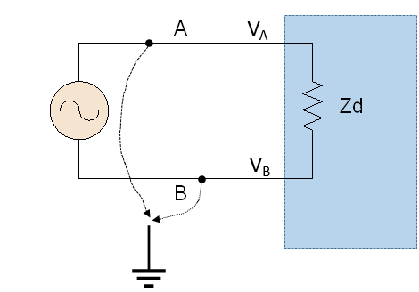

*Figura: Figura 3.4. Acoblament d'interferència en mode diferencial: el generador modela la interferència, en sèrie amb el senyal, entre els terminals A i B.*

És el mode d'acoblament més directe, perquè la interferència actua exactament com la magnitud que el circuit està dissenyat per mesurar: una diferència de potencial entre dos punts. Quan s'introdueix, se suma al senyal útil i un amplificador no la pot discriminar basant-se només en la tensió diferencial; només se'n pot rebutjar si té característiques temporals o espectrals que la diferenciïn del senyal. Per exemple, un convertidor analògic–digital **integrador** ofereix rebuig de mode sèrie (SMRR) a freqüències concretes: si integra durant un temps

$$
T
$$

, el seu guany per a una interferència sinusoïdal de freqüència

$$
f
$$

  és proporcional a

$$
g(f) \propto \frac{\sin(\pi f T)}{\pi f T} \qquad (3.5)
$$

que s'anul·la quan

$$
fT
$$

  és un nombre enter. Per això els multímetres digitals que integren durant 20 ms (un període complet de xarxa a 50 Hz) rebutgen tan bé la interferència de xarxa: el temps d'integració conté un nombre enter de períodes de la interferència.

La **tensió de mode comú** es defineix, respecte al node de referència, com la mitjana de les tensions dels dos terminals:

$$
V_c = \frac{V_A + V_B}{2} \qquad (3.6)
$$

Tota interferència diferencial porta associat, en general, un cert mode comú, excepte en el cas particular

$$
V_A = -V_B
$$

. Una interferència en **mode comú** (o transversal) afecta ambdós terminals amb aproximadament la mateixa tensió i fase (figura 3.5) i, idealment, no s'hauria de manifestar en el senyal detectat, perquè la diferència de tensió a l'entrada seria nul·la.

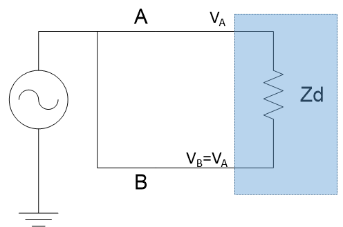

*Figura: Figura 3.5. Acoblament d'interferència en mode comú: ambdós terminals es desplacen alhora (

$$
V_B = V_A
$$

 ) respecte a la referència.*

A la pràctica, però, cap circuit real rebutja perfectament el mode comú: les impedàncies dels cables són baixes però no nul·les ni idèntiques per als dos terminals, de manera que part del mode comú es converteix en mode diferencial. A més, la impedància entre cada node i la referència no és infinita.

### Rebuig de mode comú (CMRR)

El **rebuig de mode comú** es defineix com la relació entre el guany del sistema per al mode diferencial i el guany, no volgut, per al mode comú:

$$
\mathrm{CMRR} = \frac{A_d}{A_c}, \qquad \mathrm{CMRR}_{\mathrm{dB}} = 20\log_{10}\frac{A_d}{A_c} \qquad (3.7)
$$

de manera que el factor lineal es recupera com

$$
\mathrm{CMRR} = 10^{\,\mathrm{CMRR}_{\mathrm{dB}}/20}
$$

. Així, una interferència de mode comú d'1 V en un sistema amb un CMRR de 80 dB es manifesta com una pertorbació diferencial equivalent de només 0,1 mV.

El CMRR **no és constant en freqüència**: típicament disminueix en pujar la freqüència, sobretot per als acoblaments capacitius. Un amplificador amb 100 dB en contínua pot quedar-se en 60 dB a 1 kHz i 40 dB a 10 kHz. La causa és la capacitat paràsita de mode comú, que crea una via de fuita per als senyals ràpids; per això, en sistemes diferencials ben dissenyats, les impedàncies de mode comú dels dos camins es mantenen **simètriques**, ja que qualsevol desequilibri converteix mode comú en mode diferencial irrebutjable.

## 2 Interferències conduïdes externes

Les interferències conduïdes es transmeten a través dels conductors (de senyal, d'alimentació o de terra) i tenen el seu mecanisme en una **impedància comuna** entre la font d'interferència i el receptor. En un edifici, la xarxa de distribució interconnecta molts equips; quan diversos es posen a terra en punts diferents, la impedància del conductor de protecció fa que el potencial de terra no sigui idèntic a tot arreu, i els corrents de fuita que hi circulen generen tensions interferents. La figura 3.6 mostra el model d'anàlisi.

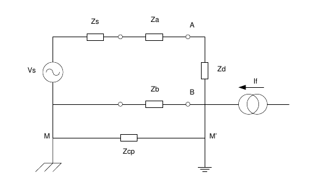

*Figura: Figura 3.6. Model elèctric per a l'anàlisi d'interferències conduïdes. Es vol mesurar

$$
V_s
$$

 (amb impedància

$$
Z_s
$$

 ) amb un sistema

$$
Z_d
$$

; els cables tenen impedàncies

$$
Z_a
$$

 i

$$
Z_b
$$

, i entre les dues referències de terra M i M' hi ha la impedància del conductor de protecció

$$
Z_{\text{cp}}
$$

. El corrent de fuita

$$
I_f
$$

 tanca el circuit per terra.*

Els ordres de magnitud de les impedàncies condicionen tota l'anàlisi. La impedància de sortida de la font

$$
Z_s
$$

  sol ser baixa en instruments (50 Ω o menys), però pot arribar a MΩ o GΩ en alguns sensors. Els cables de mesura d'1 m i 1 mm² presenten

$$
Z_a, Z_b
$$

  de l'ordre de 0,01–0,1 Ω a baixa freqüència. La impedància d'entrada

$$
Z_d
$$

  és molt alta (MΩ), cosa que fa que els corrents de fuita retornin gairebé tots pel conductor baix i no per

$$
Z_d
$$

. Finalment, el conductor de protecció

$$
Z_{\text{cp}}
$$

  (coure, resistivitat ≈ 0,017 Ω·mm²/m a 25 °C) pot valer de 0,1 a 1 Ω o més en instal·lacions grans, i el seu caràcter passa de resistiu a inductiu en pujar la freqüència.

Aquestes interferències s'originen en els **corrents de fuita a terra**: corrents que van, de manera no intencionada, del circuit d'alimentació d'un equip al conductor de protecció, per capacitats paràsites de les fonts, filtres de xarxa amb condensadors a terra, aïllament degradat o contactes accidentals. En una oficina o laboratori amb 5–10 equips solen acumular 50–200 mA eficaços a 50 Hz, i en instal·lacions industrials, diversos amperes. El conductor de protecció és imprescindible per **seguretat** — manté les parts metàl·liques accessibles a potencial de terra i força la desconnexió en cas de defecte —, però la seva impedància distribuïda és, precisament, l'origen del problema de mesura.

L'impacte depèn de la classe de seguretat dels equips interconnectats (figura 3.7 i 3.8). Els equips de **classe I** connecten les parts metàl·liques accessibles al conductor de protecció (cable de tres conductors); les seves fonts commutades injecten corrents de fuita de 0,5 a 2 mA eficaços i, per tant, són la causa de les interferències conduïdes externes: són equips *posats a terra* (oscil·loscopis, generadors de funcions; qualsevol equip amb connectors BNC). Els equips de **classe II** es protegeixen amb **doble aïllament**, són *flotants* (la seva massa és independent de la terra de la instal·lació) i tenen connectors de banana amb aïllament reforçat (multímetres i fonts de laboratori); aquest reforç n'encareix el preu. Els de **classe III** s'alimenten a tensió de seguretat molt baixa (≤ 50 V en alterna) i no generen corrents de fuita significatius.

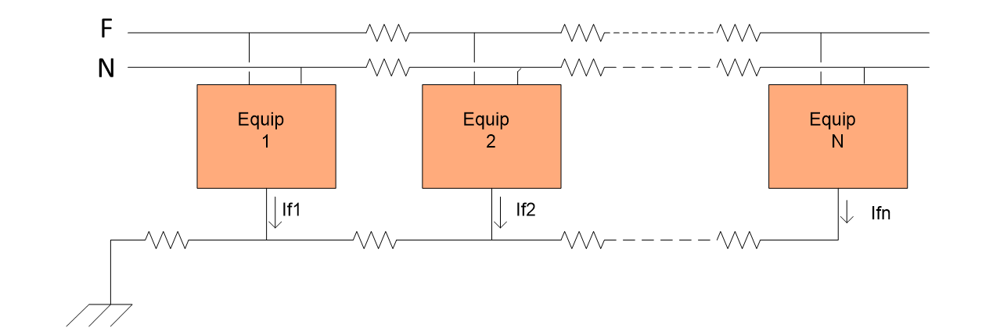

*Figura: Figura 3.7. Conjunt d'equips connectats a la xarxa (fase, neutre i terra): part del corrent de fase es desvia cap al conductor de protecció com a corrent de fuita.*

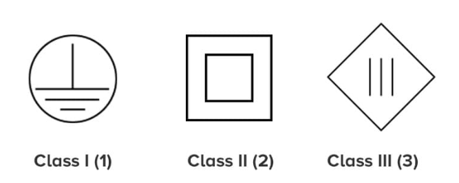

*Figura: Figura 3.8. Símbols identificadors de les classes de seguretat elèctrica: classe I (posada a terra), classe II (doble aïllament) i classe III (tensió de seguretat molt baixa).*

L'efecte de la interferència depèn de com es connectin font i sistema de mesura respecte a terra. S'analitzen els quatre casos rellevants.

### Cas 1: font a terra + mesura a terra

És el cas més simple i sovint el més problemàtic, ja que representa la majoria d'equips de classe I (per exemple, un generador de funcions connectat a un oscil·loscopi). El corrent de fuita

$$
I_f
$$

  arriba al node M' i es reparteix entre tres camins en paral·lel: per

$$
Z_{\text{cp}}
$$

, per

$$
Z_b
$$

  i, de manera negligible, per

$$
Z_d
$$

  (perquè

$$
Z_d+Z_a+Z_s \gg Z_{\text{cp}}, Z_b
$$

 ). Prescindint de signes (senyals d'alterna), la tensió entre masses és

$$
V_{MM'} = I_f \,(Z_b \parallel Z_{\text{cp}}) = I_f\,\frac{Z_b\,Z_{\text{cp}}}{Z_b + Z_{\text{cp}}} \qquad (3.8)
$$

i, com que

$$
Z_d \gg Z_a + Z_s
$$

, gairebé tota aquesta tensió apareix a l'entrada:

$$
V_d|_{I_f} = V_{MM'}\,\frac{Z_d}{Z_d + Z_a + Z_s} \approx V_{MM'} \qquad (3.9)
$$

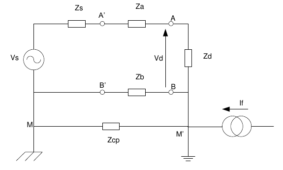

*Figura: Figura 3.9. Cas 1: font i sistema de mesura posats a terra en punts diferents (M i M').*

**Exemple.** Amb

$$
Z_s = 50\ \Omega
$$

,

$$
Z_a = 1\ \Omega
$$

,

$$
Z_d = 1\ \mathrm{M\Omega}
$$

,

$$
Z_b = 1\ \Omega
$$

,

$$
Z_{\text{cp}} = 0{,}1\ \Omega
$$

  i

$$
I_f = 20\ \mathrm{mA}
$$

  eficaços, el paral·lel val

$$
Z_b \parallel Z_{\text{cp}} = (1)(0{,}1)/(1{,}1) \approx 0{,}091\ \Omega
$$

  i la tensió interferent a l'entrada és

$$
V_d \approx 20\ \mathrm{mA} \times 0{,}091\ \Omega \approx 1{,}82\ \mathrm{mV}
$$

  eficaços. Una interferència prou gran per contaminar mesures de baix nivell.

### Cas 2: font flotant + mesura a terra

Quan la font s'aïlla de terra (bateries o transformador d'aïllament), entre la seva massa i terra apareix una impedància paràsita

$$
Z_A
$$

  deguda a capacitats paràsites (10–100 pF), aïllament imperfecte o contactes accidentals. Es comporta com a resistiva a molt baixa freqüència (10–100 MΩ a 50 Hz, fins a GΩ en contínua) i cau a l'ordre de kΩ per sobre d'1 MHz. Com que

$$
Z_A \gg Z_{\text{cp}}
$$

, el corrent de fuita circula pràcticament sencer per

$$
Z_{\text{cp}}
$$

, i la tensió de mode comú és

$$
V_c = V_{MM'} = I_f Z_{\text{cp}}
$$

. Aquesta tensió es reparteix pel divisor

$$
Z_b
$$

 –

$$
Z_A
$$

:

$$
V_d|_{I_f} = V_c\,\frac{Z_b}{Z_b + Z_A} \approx V_c\,\frac{Z_b}{Z_A} = \frac{V_c}{\mathrm{CMRR}}, \qquad \mathrm{CMRR} = \frac{Z_A}{Z_b} \qquad (3.10)
$$

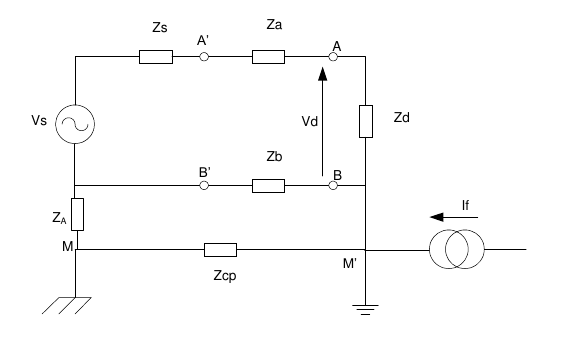

*Figura: Figura 3.10. Cas 2: font flotant (impedància d'aïllament

$$
Z_A
$$

 ) i sistema de mesura posat a terra.*

Aquesta configuració converteix la interferència en una tensió de **mode comú** que el CMRR del circuit atenua. La millora respecte al cas 1 és enorme: si al cas 1 s'identifica

$$
V_c = I_f Z_{\text{cp}}
$$

, el seu CMRR efectiu és només

$$
\mathrm{CMRR}_{\mathrm{cas 1}} = 1 + Z_{\text{cp}}/Z_b
$$

, amb

$$
Z_{\text{cp}}
$$

  i

$$
Z_b
$$

  comparables (factor proper a 2). En canvi, amb

$$
Z_b = 0{,}1\ \Omega
$$

  i

$$
Z_A = 10\ \mathrm{M\Omega}
$$

  a 50 Hz, el cas 2 dóna

$$
\mathrm{CMRR} = 10^{8}
$$

, és a dir **160 dB**: el mode comú s'atenua en vuit ordres de magnitud.

### Cas 3: font a terra + mesura flotant

Ara és el sistema de mesura el que està aïllat de terra (per exemple, un generador connectat a un multímetre); l'aïllament del mesurador es modela amb una impedància

$$
Z_{\text{bt}}
$$

, anàloga a

$$
Z_A
$$

. El corrent de fuita torna a circular per

$$
Z_{\text{cp}}
$$

  creant

$$
V_c = I_f Z_{\text{cp}}
$$

, que ara es reparteix entre

$$
Z_b
$$

  i

$$
Z_{\text{bt}}
$$

:

$$
V_d|_{I_f} = V_c\,\frac{Z_b}{Z_{\text{bt}}} = \frac{V_c}{\mathrm{CMRR}}, \qquad \mathrm{CMRR} = \frac{Z_{\text{bt}}}{Z_b} \qquad (3.11)
$$

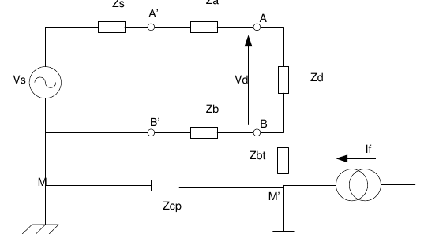

*Figura: Figura 3.11. Cas 3: font posada a terra i sistema de mesura flotant (impedància d'aïllament

$$
Z_{\text{bt}}
$$

 ).*

Els fabricants de multímetres solen informar de

$$
Z_{\text{bt}}
$$

  de manera indirecta, donant el CMRR a diverses freqüències per a una impedància de desequilibri

$$
Z_b
$$

  elevada (típicament 1 kΩ).

**Exemple.** Si un fabricant declara un CMRR de 100 dB en contínua i de 70 dB a 50 Hz per a

$$
Z_b = 1\ \mathrm{k\Omega}
$$

, la resistència d'aïllament és

$$
Z_{\text{bt}} = 1\ \mathrm{k\Omega} \times 10^{100/20} = 1\ \mathrm{k\Omega} \times 10^{5} = 100\ \mathrm{M\Omega}
$$

. A 50 Hz, el mòdul ja ha baixat a

$$
1\ \mathrm{k\Omega} \times 10^{70/20} \approx 3{,}16\ \mathrm{M\Omega}
$$

, dominat per la component capacitiva; aquesta reactància de 3,16 MΩ a 50 Hz correspon a una capacitat d'aïllament

$$
C = \frac{1}{2\pi \cdot 50 \cdot 3{,}16\times10^{6}} \approx 1\ \mathrm{nF}
$$

.

### Cas 4: font flotant + mesura flotant

És la configuració més favorable per a mesures de baix nivell i baixa freqüència, tot i que la millora respecte als casos 2 i 3 no és gran, perquè el CMRR el dicta la més gran de les dues impedàncies d'aïllament. El corrent torna a circular per

$$
Z_{\text{cp}}
$$

  i la tensió a l'entrada és

$$
V_d|_{I_f} = I_f\,Z_{\text{cp}}\,\frac{Z_b}{Z_A + Z_{\text{bt}}} \qquad (3.12)
$$

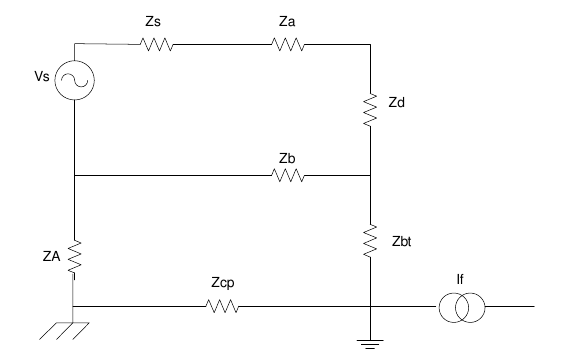

*Figura: Figura 3.12. Cas 4: font i sistema de mesura tots dos flotants. El CMRR ve donat pel quocient entre la suma de les impedàncies d'aïllament i la impedància del cable baix.*

## 3 Interferències conduïdes internes

Les interferències conduïdes **internes** no travessen el conductor de protecció, sinó que penetren pel propi cable d'alimentació de l'equip. La xarxa, nominalment a 230 V i 50 Hz, transporta també harmònics d'equips no lineals, interferències acoblades i transitoris de commutació, amb freqüències que arriben a centenars de kHz o MHz. Aquestes pertorbacions entren a l'equip per acoblament **capacitiu** a través del transformador de la font d'alimentació.

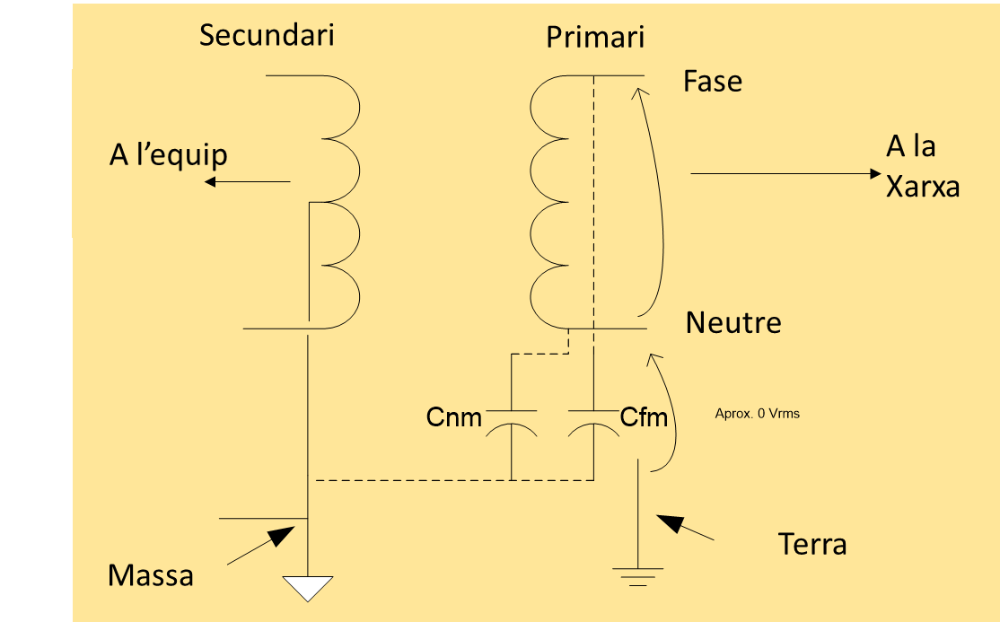

*Figura: Figura 3.13. Transformador de la font d'alimentació. Les capacitats paràsites

$$
C_{\text{fm}}
$$

 (fase–massa) i

$$
C_{\text{nm}}
$$

 (neutre–massa) entre primari i secundari permeten el pas de corrents d'alta freqüència de la xarxa cap als circuits de baix nivell.*

Idealment el transformador aïllaria completament primari i secundari, però la proximitat dels debanats crea capacitats paràsites

$$
C_{\text{fm}}
$$

  (fase–massa del secundari) i

$$
C_{\text{nm}}
$$

  (neutre–massa). En transformadors amb nucli de ferrita valen de 100 pF a 10 nF; els **transformadors d'aïllament amb pantalla de blindatge** les redueixen a només 5–10 pF. La pertorbació predomina per

$$
C_{\text{fm}}
$$

  (representada per

$$
Z_{\text{fm}}
$$

 ), perquè la fase transporta la tensió principal, mentre que el neutre, referenciat a terra, aporta menys. El model de Norton equivalent considera la font

$$
V_f
$$

  amb impedància

$$
Z_{\text{fm}} \parallel Z_{\text{nm}}
$$

  (figura 3.14 representa el cas típic on s'interconnecta una font posada a terra amb un sistema de mesura flotant).

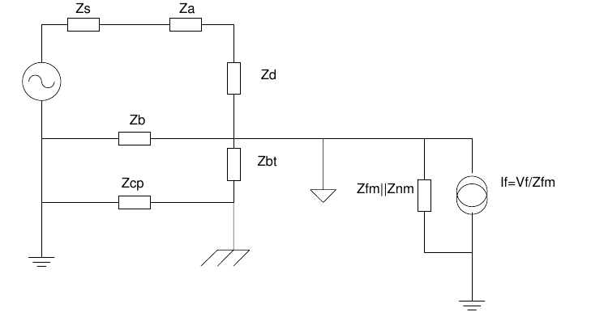

*Figura: Figura 3.14. Equivalent Norton per a l'anàlisi de l'efecte de les interferències del conductor de fase, amb

$$
I_f = V_f/Z_{\text{fm}}
$$

.*

Com que

$$
Z_b \ll Z_d+Z_a+Z_s
$$

,

$$
Z_b \ll Z_{\text{bt}}+Z_{\text{cp}}
$$

  i

$$
Z_b \ll Z_{\text{fm}}\parallel Z_{\text{nm}}
$$

, el corrent circula majoritàriament per

$$
Z_b
$$

  i la tensió a l'entrada és

$$
V_d|_{V_f} = \frac{V_f}{Z_{\text{fm}}}\,Z_b \qquad (3.13)
$$

Com més alta és la freqüència, més petita és

$$
Z_{\text{fm}}
$$

  i, per tant, més gran l'efecte de la interferència interna.

## 4 Tècniques de mitigació de les interferències conduïdes

L'objectiu és reduir la tensió que apareix en bornes de

$$
Z_d
$$

. Per a les interferències **externes**, l'estratègia més bàsica és **minimitzar les impedàncies dels camins de retorn**: augmentar la secció del cable baix (passar d'1 a 4 mm² en divideix la resistència per quatre, amb més cost i pes) o — sovint més efectiu econòmicament — escurçar-lo (reduir-ne la longitud a la meitat en divideix la impedància a la meitat sense cost de material).

Una segona via és **reduir el corrent de fuita total**

$$
I_f
$$

, desconnectant de la xarxa els equips no essencials: els de classe I injecten corrent de fuita fins i tot en *standby*, perquè la font commutada segueix activa. Té límits, però: en sales amb 20–30 instruments els corrents acumulats són inevitables, i afegir interruptors individuals encareix el sistema i introdueix punts de fallida.

La tàctica **més efectiva** és emprar sistemes de mesura **flotants** (classe II) en lloc de connectats a terra (classe I). En un sistema flotant, la tensió

$$
I_f Z_{\text{cp}}
$$

  apareix com a mode comú a l'entrada, i el CMRR del sistema determina quina fracció es converteix en tensió diferencial: un CMRR elevat atenua dràsticament l'efecte, tal com quantifiquen els casos 2 i 4. Les interferències **internes** es combaten, sobretot, amb transformadors d'aïllament amb pantalla, que redueixen les capacitats paràsites

$$
C_{\text{fm}}
$$

  i

$$
C_{\text{nm}}
$$

  i, per tant, augmenten

$$
Z_{\text{fm}}
$$

.

A l'entrada d'alimentació dels equips també s'hi afegeixen elements dedicats. Els **filtres de xarxa** (filtres EMI) combinen bobines en sèrie amb la fase i condensadors entre fase, neutre i terra: aquests condensadors ofereixen un camí de baixa impedància que deriva a terra els corrents interferents d'alta freqüència, mentre deixen passar el senyal de 50 Hz gairebé sense atenuar. La seva banda de rebuig s'estén d'uns pocs kHz a centenars de MHz, amb atenuacions de 30–60 dB per sobre de 100 kHz. Contra els **transitoris** de la xarxa (llamps, connexió i desconnexió de motors), que poden assolir centenars o milers de volts durant microsegons, s'empren **supressors de transitoris**: varistors d'òxid de metall (**MOV**) i díodes supressors (**TVS**), que desvien ràpidament la sobretensió a terra i limiten la tensió que arriba als circuits a un valor segur. Aquests supressors no filtren la interferència periòdica — ni tenen res a veure amb el guany de l'amplificador —, sinó que protegeixen l'equip de l'energia impulsiva. Finalment, quan la interferència no s'ha pogut eliminar del tot, encara es pot **filtrar el senyal mesurat** (analògicament o digitalment) i promitjar diverses mesures, sempre que la interferència no hagi saturat abans cap etapa de la cadena.

> [!TIP] **Síntesi**
>
> Una interferència s'acobla en mode diferencial (entre terminals, se suma al senyal i només es rebutja per criteris temporals o espectrals, com l'ADC integrador a 20 ms) o en mode comú (desplaça els dos terminals alhora i el rebutja el CMRR, que es mesura en dB i cau amb la freqüència). Les interferències conduïdes externes neixen del corrent de fuita a terra que circula per la impedància del conductor de protecció; la seva magnitud depèn de com es connectin font i sistema de mesura, i els quatre casos mostren que flotar qualsevol dels dos equips converteix la interferència en mode comú i n'eleva enormement el CMRR (fins a 160 dB en el cas 2). Les interferències internes entren pel transformador d'alimentació a través de les capacitats paràsites

$$
C_{\text{fm}}
$$

  i

$$
C_{\text{nm}}
$$

. La mitigació passa per minimitzar les impedàncies de retorn, reduir el corrent de fuita, emprar sistemes flotants d'alt CMRR i transformadors d'aïllament amb pantalla.

[← 1. Fonaments i classificació de les interferències](01_doc.md)[3. Interferències capacitives i blindatge →](03_doc.md)

Sistemes de Mesura (230920) · Grau en Enginyeria Electrònica de Telecomunicació · ETSETB – UPC
Material de lectura prèvia · Unitat 3: Interferències en Sistemes de Mesura

---

## 📐 Formulario Resumen de Ecuaciones

| Nº / Ref | Expresión Matemática |
| :---: | :--- |
| **(3.4)** | $V_d = V_A - V_B$ |
| **(3.5)** | $g(f) \propto \frac{\sin(\pi f T)}{\pi f T}$ |
| **(3.6)** | $V_c = \frac{V_A + V_B}{2}$ |
| **(3.7)** | $\mathrm{CMRR} = \frac{A_d}{A_c}, \qquad \mathrm{CMRR}_{\mathrm{dB}} = 20\log_{10}\frac{A_d}{A_c}$ |
| **(3.8)** | $V_{MM'} = I_f \,(Z_b \parallel Z_{\text{cp}}) = I_f\,\frac{Z_b\,Z_{\text{cp}}}{Z_b + Z_{\text{cp}}}$ |
| **(3.9)** | $V_d\|_{I_f} = V_{MM'}\,\frac{Z_d}{Z_d + Z_a + Z_s} \approx V_{MM'}$ |
| **(3.10)** | $V_d\|_{I_f} = V_c\,\frac{Z_b}{Z_b + Z_A} \approx V_c\,\frac{Z_b}{Z_A} = \frac{V_c}{\mathrm{CMRR}}, \qquad \mathrm{CMRR} = \frac{Z_A}{Z_b}$ |
| **(3.11)** | $V_d\|_{I_f} = V_c\,\frac{Z_b}{Z_{\text{bt}}} = \frac{V_c}{\mathrm{CMRR}}, \qquad \mathrm{CMRR} = \frac{Z_{\text{bt}}}{Z_b}$ |
| **(3.12)** | $V_d\|_{I_f} = I_f\,Z_{\text{cp}}\,\frac{Z_b}{Z_A + Z_{\text{bt}}}$ |
| **(3.13)** | $V_d\|_{V_f} = \frac{V_f}{Z_{\text{fm}}}\,Z_b$ |