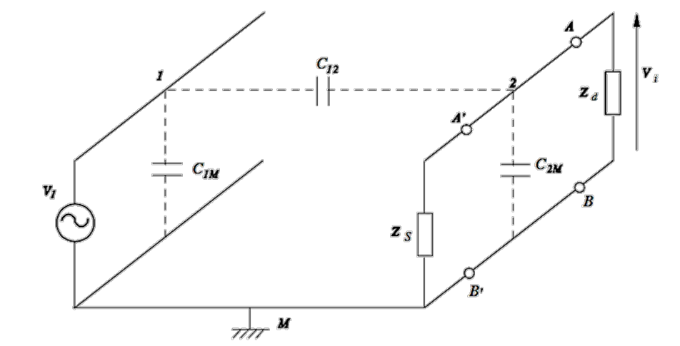
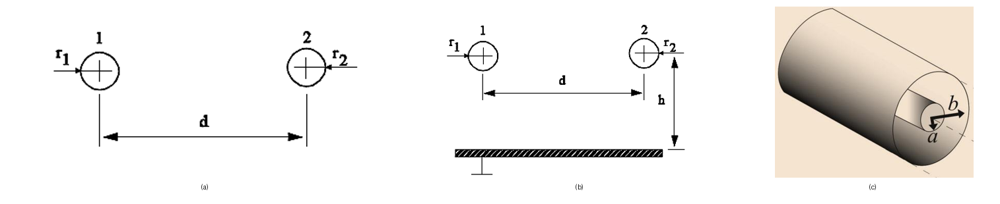
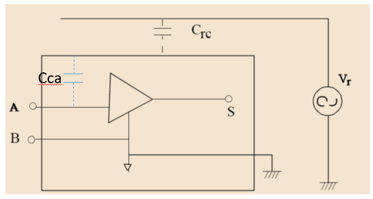
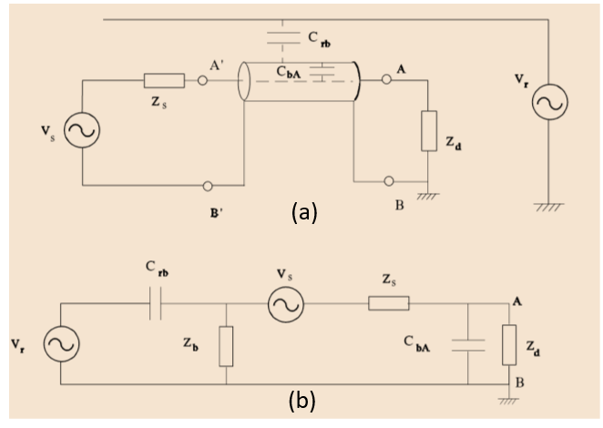
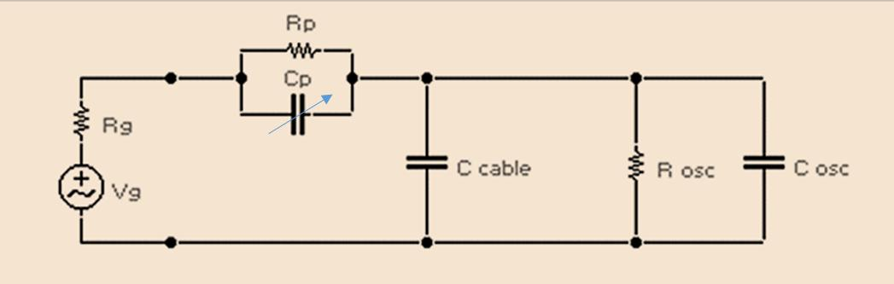

# U3 · 3. Interferències capacitives i blindatge

## 📑 Índice de Contenidos

- [1 Mecanisme de l'acoblament capacitiu](#1-mecanisme-de-lacoblament-capacitiu)
  - [Geometries habituals](#geometries-habituals)
- [2 Blindatge](#2-blindatge)
- [3 Cable coaxial i limitació d'amplada de banda](#3-cable-coaxial-i-limitació-damplada-de-banda)
- [4 Sondes atenuadores compensades](#4-sondes-atenuadores-compensades)

---

> [!NOTE] **Objectius d'aprenentatge**
>
> - Explicar el mecanisme de l'**acoblament capacitiu** com un corrent de desplaçament proporcional a

$$
\frac{\mathrm{d}V}{\mathrm{d}t}
$$

  a través d'una capacitat paràsita.
> - Estimar la tensió interferent amb el model de capacitats i relacionar-la amb la impedància d'entrada i la freqüència (

$$
Z_C = \frac{1}{j2\pi fC}
$$

 ).
> - Justificar el **blindatge** com a gàbia de Faraday i la importància de connectar-lo a la referència correcta.
> - Analitzar la limitació d'amplada de banda del **cable coaxial** i com la **sonda atenuadora compensada** l'estén a canvi d'atenuar el senyal.

Al camp proper, el camp elèctric i el magnètic són independents (document 1), de manera que l'acoblament radiat es pot separar en capacitiu i inductiu. Aquest document tracta l'**acoblament capacitiu** — de camp elèctric — i la tècnica principal per combatre'l, el blindatge.

## 1 Mecanisme de l'acoblament capacitiu

Entre dos conductors qualssevol separats per un dielèctric sempre hi ha una capacitat. Si un dels conductors està a un potencial **variable**

$$
V(t)
$$

  respecte a terra i l'altre forma part del circuit de mesura, per la capacitat hi circula un **corrent de desplaçament**

$$
i_C = C\,\frac{dV}{dt} \qquad (3.14)
$$

La dependència de

$$
\frac{\mathrm{d}V}{\mathrm{d}t}
$$

  és essencial: l'acoblament el provoca la *variació* de tensió de la font interferent, no un corrent elevat; una tensió constant, per gran que sigui, no acobla res. Per la mateixa raó, com més alta és la freqüència, més gran és el corrent injectat.

**Exemple.** Una capacitat de 50 pF — valor típic entre un cable de xarxa i un conductor de senyal separats 10 cm al llarg d'1 m — sotmesa a la tensió de xarxa de 230 V eficaços a 50 Hz injecta

$$
i_C = 50\ \mathrm{pF}\times 2\pi\times 50\ \mathrm{Hz}\times 230\ \mathrm{V} \approx 3{,}6\ \mathrm{\mu A}
$$

. Si aquest corrent entra en un circuit d'alta impedància (1 MΩ), hi desenvolupa

$$
V = 3{,}6\ \mathrm{\mu A}\times 1\ \mathrm{M\Omega} = 3{,}6\ \mathrm{V}
$$

. Amb una capacitat minúscula, la tensió interferent és de volts: per això els circuits d'alta impedància són tan susceptibles a l'acoblament capacitiu — a igualtat de corrent, com més alta és la impedància d'entrada, més gran és la tensió interferent, no pas menor.

Per analitzar-ho quantitativament es modelen dos conductors (1 i 2) amb una massa comuna M (figura 3.15). La capacitat

$$
C_{1M}
$$

  queda en paral·lel amb la font d'interferència

$$
V_1
$$

  i no afecta la tensió a

$$
Z_d
$$

; la capacitat

$$
C_{2M}
$$

  modifica la impedància equivalent del receptor; i el **canal** que acobla la interferència és la capacitat paràsita

$$
C_{12}
$$

  entre els dos conductors, el valor de la qual depèn de la geometria.

*Figura: Figura 3.15. Model d'acoblament capacitiu entre la font d'interferència

$$
V_1
$$

 (conductor 1) i el circuit receptor (conductor 2, amb

$$
Z_s
$$

 i

$$
Z_d
$$

 ). El canal és la capacitat paràsita

$$
C_{12}
$$

.*

La impedància de la capacitat d'acoblament és

$$
Z_{C_{12}} = \frac{1}{j\,2\pi f\,C_{12}} \qquad (3.15)
$$

— que disminueix en pujar la freqüència — i, resolent el divisor, la tensió interferent a l'entrada resulta

$$
V_i|_{V_1} = V_1\,\frac{j\,2\pi f\,C_{12}}{\,j\,2\pi f\,(C_{12}+C_{2M}) + \frac{Z_d+Z_s}{Z_d\,Z_s}\,} \qquad (3.16)
$$

Aquestes capacitats paràsites apareixen a tot arreu — entre els cables de xarxa i els de mesura, entre la carcassa i les entrades, dins dels transformadors, entre pistes d'una placa — amb valors que van de picofarads (circuits ben dissenyats) a nanofarads (transformadors mal blindats).

### Geometries habituals

El valor de

$$
C_{12}
$$

  depèn de la geometria i de la permitivitat del dielèctric (figura 3.16). Per a dos conductors cilíndrics paral·lels de radis

$$
r_1, r_2
$$

  separats una distància

$$
d \gg r
$$

  al llarg d'una longitud

$$
\ell
$$

,

$$
C_{12} \approx \frac{\pi\,\varepsilon_r\,\varepsilon_0\,\ell}{\ln\!(d/\sqrt{r_1 r_2})} \qquad (3.17)
$$

amb

$$
\varepsilon_0 = 8{,}854\times10^{-12}
$$

  F/m i

$$
\varepsilon_r
$$

  la constant dielèctrica relativa. Per a dos conductors sobre un pla de massa a distància

$$
h
$$

  l'expressió inclou un factor addicional que depèn de

$$
h
$$

  i

$$
d
$$

, i per a un **cable coaxial** de radi intern

$$
a
$$

  i malla de radi

$$
b
$$

,

$$
C_{12} \approx \frac{2\pi\,\varepsilon_r\,\varepsilon_0\,\ell}{\ln(b/a)} \qquad (3.18)
$$

*Figura: Figura 3.16. Geometries habituals: (a) dos conductors paral·lels; (b) dos conductors sobre un pla de massa; (c) cable coaxial.*

## 2 Blindatge

Quan les tensions interferents estimades són inacceptables, cal actuar sobre el canal reduint

$$
C_{12}
$$

. El **blindatge** és la tècnica més efectiva: consisteix a envoltar completament la zona que es vol protegir amb un conductor connectat a una referència de potencial adequada. El blindatge es comporta com una **gàbia de Faraday** — les càrregues es distribueixen a la superfície de manera que el camp interior és nul — i les càrregues induïdes per la font es deriven directament a la referència del blindatge sense circular pel circuit de senyal.

*Figura: Figura 3.17. Blindatge d'un circuit sensible enfront de la interferència de xarxa. La capacitat blindatge–xarxa

$$
C_{\text{rc}}
$$

 queda en paral·lel amb

$$
V_r
$$

 i no afecta; en canvi, la capacitat residual blindatge–entrada

$$
C_{\text{ca}}
$$

 forma un passa-baixes amb la resistència de la font.*

La connexió a la referència correcta és **determinant**: per a interferències de la instal·lació, el blindatge s'ha de connectar a la terra de la instal·lació, de manera que les càrregues induïdes es derivin a terra; per a interferències internes (per exemple, un rellotge que s'acobla a una pista de baix nivell), s'ha de connectar a la massa de la font d'interferència. Un blindatge mal referenciat no protegeix. El blindatge té, però, un límit visible a la figura 3.17: entre el blindatge i el node d'entrada A queda una capacitat residual

$$
C_{\text{ca}}
$$

  que, amb la resistència de sortida de la font

$$
R_s
$$

, forma un filtre passa-baixes de freqüència de tall

$$
f_{-3\,\mathrm{dB}} = \frac{1}{2\pi R_s C_{\text{ca}}} \qquad (3.19)
$$

El blindatge adopta moltes formes: la carcassa metàl·lica exterior (efectiva només si els segments es contacten amb baixa impedància), gàbies internes de malla en plaques, làmines separadores i, sobretot, els **plans de massa** de les plaques multicapa, que actuen alhora com a referència única, com a gàbia de Faraday entre capes i com a retorn de baixa impedància. Un blindatge ben fet atenua 40–80 dB a baixa i mitjana freqüència, però cal preservar-ne la **continuïtat elèctrica**: les obertures — per exemple, per a ventilació — i els conductors que han de sortir *redueixen* la seva efectivitat.

## 3 Cable coaxial i limitació d'amplada de banda

Per interconnectar font i sistema de mesura enfront d'interferències capacitives s'empra cable **coaxial**: el conductor central porta el senyal i la malla actua de blindatge, connectada — en un únic punt, per evitar bucles de massa — a la referència de la font d'interferència (figura 3.18). Si la connexió de la malla és bona, la capacitat malla–xarxa

$$
C_{\text{rb}}
$$

  queda en paral·lel amb

$$
V_r
$$

  i la interferència residual és molt petita.

*Figura: Figura 3.18. Cable coaxial apantallat: (a) connexió; (b) circuit equivalent. La malla (B'–B) connecta les referències i el conductor central (A'–A) porta el senyal;

$$
C_{\text{bA}}
$$

 és la capacitat entre malla i conductor central.*

**Exemple (interferència residual).** Amb un generador (

$$
Z_s = 50\ \Omega
$$

 ) connectat per coaxial a un oscil·loscopi (1 MΩ ∥ 13 pF), capacitat malla–central

$$
C_{\text{bA}} = 150\ \mathrm{pF}
$$

, resistència de malla i contacte

$$
Z_b = 0{,}07\ \Omega
$$

  i capacitat malla–xarxa

$$
C_{\text{rb}} = 15\ \mathrm{pF}
$$

: a 50 Hz,

$$
|Z_{C_{\text{rb}}}| = \frac{1}{2\pi\cdot 50\cdot 15\,\mathrm{pF}} \approx 212\ \mathrm{M\Omega} \gg Z_b
$$

, de manera que la interferència a l'entrada és

$$
V_{\text{AB}}|_{V_r} \approx 230\ \mathrm{V}\times \dfrac{0{,}07\ \Omega}{212\ \mathrm{M\Omega}} \approx 76\ \mathrm{nV}
$$

: l'apantallament la fa negligible.

Ara bé, el coaxial introdueix un problema propi. La seva capacitat (100–150 pF/m) se suma a la d'entrada de l'oscil·loscopi i, amb la resistència de la font, forma un passa-baixes que **retalla l'amplada de banda**.

**Exemple (amplada de banda).** Amb

$$
R_s \approx 50\ \Omega
$$

  (

$$
Z_s \parallel Z_d
$$

 ) i

$$
C_{\text{osc}}+C_{\text{bA}} = 13 + 150 = 163\ \mathrm{pF}
$$

, la freqüència de tall és

$$
f_{-3\,\mathrm{dB}} = \frac{1}{2\pi\cdot 50\ \Omega\cdot 163\ \mathrm{pF}} \approx 19{,}5\ \mathrm{MHz}
$$

. Encara que l'oscil·loscopi tingui 100 MHz d'amplada de banda, el cable ja la limita a uns 20 MHz.

## 4 Sondes atenuadores compensades

Per recuperar amplada de banda s'empren **sondes atenuadores** (la típica sonda x10). La punta afegeix una impedància en sèrie — el paral·lel d'una resistència

$$
R_p
$$

  (MΩ) i un condensador ajustable

$$
C_p
$$

  (pocs pF) — abans del cable i l'entrada de l'oscil·loscopi (figura 3.19). La funció de transferència

$$
V_{\text{in}}/V_s = Z_1/(Z_1+Z_2)
$$

, amb

$$
Z_1
$$

  el paral·lel de l'entrada de l'oscil·loscopi i el cable i

$$
Z_2
$$

  la impedància de la punta, esdevé **d'ordre zero** (independent de la freqüència) si es compleix la **condició de compensació**

$$
R_p\,C_p = R_{\text{osc}}\,(C_{\text{cable}}+C_{\text{osc}}) \qquad (3.20)
$$

*Figura: Figura 3.19. Model d'una sonda atenuadora: la punta (

$$
R_p \parallel C_p
$$

 ) en sèrie amb el cable (

$$
C_{\text{cable}}
$$

 ) i l'entrada de l'oscil·loscopi (

$$
R_{\text{osc}} \parallel C_{\text{osc}}
$$

 ).*

Amb

$$
R_p = (A-1)R_{\text{osc}}
$$

, la compensació exigeix

$$
C_p = (C_{\text{cable}}+C_{\text{osc}})/(A-1)
$$

, i aleshores la transferència és constant a totes les freqüències:

$$
H_{\text{comp}} = \frac{1}{A} \qquad (3.21)
$$

És a dir, el senyal s'**atenua** per un factor

$$
A
$$

  (10 en una sonda x10, de vegades 100). Cal subratllar que una sonda ben compensada *no* és un passa-baixes fortament dependent de la freqüència: precisament la compensació elimina aquesta dependència i deixa un guany pla. Incloent la resistència de sortida de la font

$$
R_g
$$

  (i amb

$$
R_g \ll R_p
$$

 ), el conjunt és un passa-baixes de primer ordre amb guany en contínua

$$
\approx \frac{1}{A}
$$

  i freqüència de tall

$$
f_{-3\,\mathrm{dB}} = \frac{A}{2\pi\,(C_{\text{osc}}+C_{\text{cable}})\,R_g} \qquad (3.22)
$$

**Exemple.** Amb

$$
R_{\text{osc}} = 1\ \mathrm{M\Omega}
$$

,

$$
C_{\text{osc}} = 13\ \mathrm{pF}
$$

,

$$
C_{\text{cable}} = 150\ \mathrm{pF}
$$

,

$$
R_g = 50\ \Omega
$$

  i una sonda x10 (

$$
A=10
$$

 ): la punta ha de tenir

$$
R_p = 9\ \mathrm{M\Omega}
$$

  i

$$
C_p = 163/9 \approx 18{,}1\ \mathrm{pF}
$$

. La freqüència de tall passa a

$$
f_{-3\,\mathrm{dB}} = 10/(2\pi\cdot 163\ \mathrm{pF}\cdot 50\ \Omega) \approx 195\ \mathrm{MHz}
$$

: l'amplada de banda s'estén per un factor igual a l'atenuació (deu vegades) respecte al cable coaxial sol, a canvi de dividir l'amplitud per deu.

> [!TIP] **Síntesi**
>
> L'acoblament capacitiu injecta un corrent de desplaçament

$$
i_C = C\,\frac{\mathrm{d}V}{\mathrm{d}t}
$$

  a través d'una capacitat paràsita: depèn de la *variació* de tensió i de la freqüència, i és més perjudicial com més alta és la impedància d'entrada del receptor. La impedància d'acoblament

$$
Z_C = \frac{1}{j2\pi fC}
$$

  disminueix amb la freqüència, i el valor de la capacitat depèn de la geometria (conductors paral·lels, sobre pla de massa, coaxial). La defensa principal és el blindatge, una gàbia de Faraday que ha d'anar connectada a la referència correcta i mantenir la continuïtat elèctrica, ja que obertures i sortides de cable en redueixen l'eficàcia. El cable coaxial protegeix però afegeix capacitat que, amb la resistència de la font, limita l'amplada de banda; la sonda atenuadora compensada (

$$
R_pC_p = R_{\text{osc}}(C_{\text{cable}}+C_{\text{osc}})
$$

 ) recupera una resposta plana i estén la banda per un factor igual a l'atenuació

$$
A
$$

, a costa de reduir el senyal a

$$
\frac{1}{A}
$$

.

[← 2. Mode diferencial i comú. Interferències conduïdes](02_doc.md)[4. Interferències inductives i efecte sobre la mesura →](04_doc.md)

Sistemes de Mesura (230920) · Grau en Enginyeria Electrònica de Telecomunicació · ETSETB – UPC
Material de lectura prèvia · Unitat 3: Interferències en Sistemes de Mesura

---

## 📐 Formulario Resumen de Ecuaciones

| Nº / Ref | Expresión Matemática |
| :---: | :--- |
| **(3.14)** | $i_C = C\,\frac{dV}{dt}$ |
| **(3.15)** | $Z_{C_{12}} = \frac{1}{j\,2\pi f\,C_{12}}$ |
| **(3.16)** | $V_i\|_{V_1} = V_1\,\frac{j\,2\pi f\,C_{12}}{\,j\,2\pi f\,(C_{12}+C_{2M}) + \frac{Z_d+Z_s}{Z_d\,Z_s}\,}$ |
| **(3.17)** | $C_{12} \approx \frac{\pi\,\varepsilon_r\,\varepsilon_0\,\ell}{\ln\!(d/\sqrt{r_1 r_2})}$ |
| **(3.18)** | $C_{12} \approx \frac{2\pi\,\varepsilon_r\,\varepsilon_0\,\ell}{\ln(b/a)}$ |
| **(3.19)** | $f_{-3\,\mathrm{dB}} = \frac{1}{2\pi R_s C_{\text{ca}}}$ |
| **(3.20)** | $R_p\,C_p = R_{\text{osc}}\,(C_{\text{cable}}+C_{\text{osc}})$ |
| **(3.21)** | $H_{\text{comp}} = \frac{1}{A}$ |
| **(3.22)** | $f_{-3\,\mathrm{dB}} = \frac{A}{2\pi\,(C_{\text{osc}}+C_{\text{cable}})\,R_g}$ |