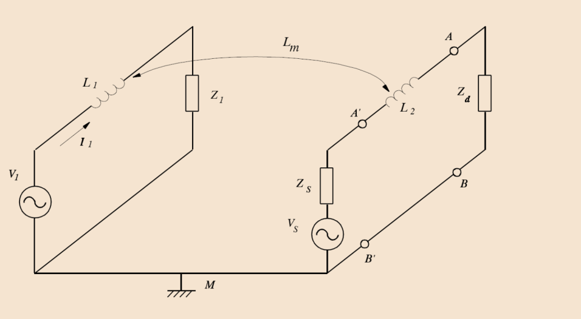
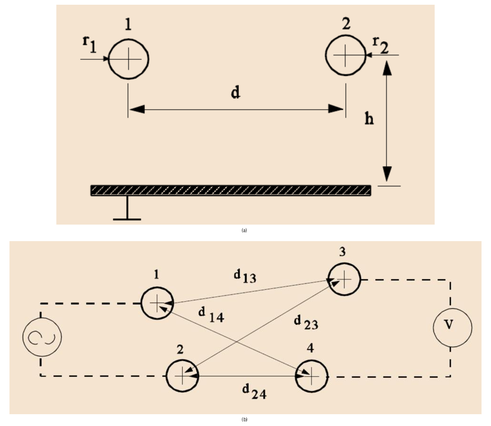
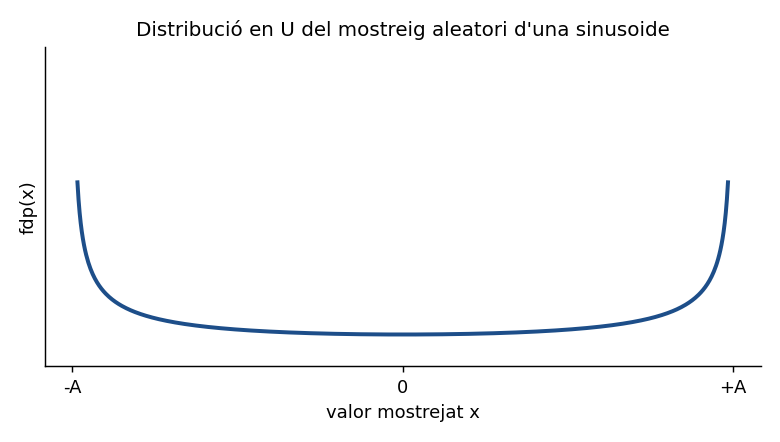

# U3 · 4. Interferències inductives i efecte sobre la mesura

## 📑 Índice de Contenidos

- [1 Acoblament inductiu](#1-acoblament-inductiu)
  - [Geometria de la inductància mútua](#geometria-de-la-inductància-mútua)
- [2 Mitigació de les interferències inductives](#2-mitigació-de-les-interferències-inductives)
- [3 Efecte de les interferències sobre el resultat de mesura](#3-efecte-de-les-interferències-sobre-el-resultat-de-mesura)
  - [Distribució del mostreig d'una sinusoide](#distribució-del-mostreig-duna-sinusoide)
  - [Mesura d'una magnitud constant: promitjat](#mesura-duna-magnitud-constant-promitjat)
  - [Mesura d'un valor eficaç: biaix](#mesura-dun-valor-eficaç-biaix)
- [4 Diagnosi i selecció de la mitigació](#4-diagnosi-i-selecció-de-la-mitigació)

---

> [!NOTE] **Objectius d'aprenentatge**
>
> - Explicar l'**acoblament inductiu** per la llei de Faraday i la inductància mútua, i la seva dependència de

$$
\frac{\mathrm{d}I}{\mathrm{d}t}
$$

  i de la geometria.
> - Distingir la mitigació magnètica (blindatge d'alta permeabilitat, **trenat**, minimització de l'àrea de bucle) de l'elèctrica, i entendre per què la interferència magnètica és independent de la impedància del receptor.
> - Modelar l'efecte d'una interferència sobre el resultat: **valor mitjà nul**, relació

$$
\sigma = V_{\text{rms}}
$$

, distribució en U del mostreig i incertesa associada.
> - Quantificar el rebuig per **promitjat** i el **biaix** en mesures de valor eficaç, i sistematitzar la **diagnosi** font–canal–receptor.

Al camp proper, l'acoblament magnètic es pot analitzar separadament de l'elèctric (document 3). Aquest darrer document tracta les interferències **inductives**, la seva mitigació i, finalment, com afecta qualsevol interferència el resultat numèric d'una mesura.

## 1 Acoblament inductiu

Les interferències inductives es produeixen quan un corrent **variable** en un circuit indueix una tensió en un altre de proper. A diferència de l'acoblament capacitiu, el mecanisme és el camp magnètic: cal que circuli un corrent variable per la font — *no* n'hi ha prou amb una tensió elevada sense corrent associat. Tot corrent genera un camp magnètic; si aquest camp, variable, travessa l'àrea d'una malla del circuit de mesura, hi indueix una tensió en sèrie proporcional a la derivada del flux (llei de Faraday):

$$
V_i = -\frac{\partial \Phi}{\partial t} = -\frac{\partial}{\partial t}(B\,S\cos\theta) \qquad (3.23)
$$

on

$$
\theta
$$

  és l'angle entre el camp

$$
B
$$

  i l'àrea

$$
S
$$

  de la malla. L'acoblament entre els dos circuits es quantifica amb la **inductància mútua**

$$
L_m
$$

, de manera que

$$
V_i = -L_m\,\frac{dI_1}{dt} \qquad (3.24)
$$

essent

$$
I_1
$$

  el corrent de la font d'interferència. La inductància mútua depèn de la longitud en què els circuits discorren paral·lels, de la separació entre ells, de les dimensions dels conductors i de la permeabilitat del medi (aire,

$$
\mu_r \approx 1
$$

 ). La figura 3.20 mostra el model circuital, amb les autoinductàncies dels conductors

$$
L_1
$$

  i

$$
L_2
$$

  i la mútua

$$
L_m
$$

.

*Figura: Figura 3.20. Model d'acoblament inductiu: el corrent

$$
I_1
$$

 de la font (

$$
V_1
$$

,

$$
Z_1
$$

 ) indueix, per la mútua

$$
L_m
$$

, una tensió al circuit receptor (

$$
V_s
$$

,

$$
Z_s
$$

,

$$
Z_d
$$

 ).*

La tensió induïda

$$
V_i
$$

  queda en sèrie dins la malla de mesura, i la que arriba a l'entrada es reparteix amb la impedància de la font i l'autoinductància dels cables:

$$
V_d = V_i\,\frac{Z_d}{Z_d + Z_s + j\,2\pi f\,L_2} \qquad (3.25)
$$

Com que la derivada d'un corrent sinusoïdal introdueix un factor

$$
2\pi f
$$

, **doblar la freqüència del corrent interferent duplica la tensió induïda** a igualtat d'amplitud. Per això els transitoris de commutació i els harmònics d'alta freqüència de la xarxa s'acoblen inductivament amb molta més facilitat que els 50 Hz, i els **motors** i **transformadors de potència**, amb corrents elevats, en són fonts rellevants.

### Geometria de la inductància mútua

Per a geometries típiques existeixen aproximacions de

$$
L_m
$$

  (figura 3.21). Per a dos conductors paral·lels a alçada

$$
h
$$

  sobre un pla de massa comú i separats

$$
d
$$

  al llarg d'una longitud

$$
\ell
$$

,

$$
L_m \approx \ell\,\frac{\mu_r \mu_0}{4\pi}\,\ln\!(1+\frac{4h^2}{d^2}) \qquad (3.26)
$$

amb

$$
\mu_0 = 4\pi\times10^{-7}
$$

  H/m. La mútua creix amb la longitud de paral·lelisme

$$
\ell
$$

  i amb l'alçada

$$
h
$$

, i decreix en separar els conductors (

$$
d
$$

 ). Per a dues malles — conductors 1–2 (font) i 3–4 (receptor) —,

$$
L_m \approx \ell\,\frac{\mu_r \mu_0}{4\pi}\,\ln\!(\frac{d_{14}\,d_{23}}{d_{13}\,d_{24}}) \qquad (3.27)
$$

*Figura: Figura 3.21. Geometries d'acoblament inductiu: (a) dos conductors sobre un pla de massa; (b) dues malles (font 1–2, receptor 3–4).*

Aquesta expressió suggereix com **minimitzar** la interferència: fer que

$$
d_{14}
$$

  s'aproximi a

$$
d_{24}
$$

  i

$$
d_{23}
$$

  a

$$
d_{13}
$$

, cosa que s'aconsegueix acostant molt els conductors 1–2 entre si i els 3–4 entre si, és a dir, **minimitzant l'àrea de les malles**. Convé recordar que qualsevol malla tancada travessada per un camp magnètic variable pateix tensió induïda: fins i tot el bucle de massa entre dos punts de terra, sense corrent de fuita, capta un camp extern que apareix com a mode comú.

Una diferència fonamental amb l'acoblament capacitiu: la tensió inductiva en mode sèrie **no depèn de la impedància del receptor**. Per això augmentar la impedància d'entrada *no* elimina una tensió induïda magnèticament. Se sol dir que les interferències magnètiques afecten circuits de baixa impedància, però realment poden afectar-ne de qualsevol; el que passa és que, en circuits d'alta impedància, hi predomina l'acoblament capacitiu, perquè la caiguda deguda als corrents capacitius s'hi fa més gran.

## 2 Mitigació de les interferències inductives

El **blindatge magnètic** funciona per un principi diferent de l'elèctric: no n'hi ha prou amb un conductor connectat a una referència, sinó que cal un material que reculli el flux. La seva eficàcia depèn de la permeabilitat relativa: materials amb

$$
\mu_r \gg 1
$$

  (ferro, acer i, sobretot, **mu-metal** i permalloy, amb

$$
\mu_r
$$

  de fins a desenes de milers) redirigeixen les línies de camp a través seu i les aparten de la zona protegida. El mu-metal s'usa precisament perquè té una permeabilitat *molt alta*. La freqüència és decisiva: a alta freqüència (

$$
\geq 1
$$

  MHz) qualsevol metall serveix, perquè els corrents de Foucault induïts creen camps que s'oposen a l'incident; però a baixa freqüència calen materials d'alta permeabilitat, ja que a 50 Hz el coure o l'alumini (

$$
\mu_r \approx 1
$$

 ) gairebé no proporcionen blindatge magnètic.

La tècnica més característica per als cables és el **trenat** del parell de conductors. En cada volta els dos conductors intercanvien la seva posició relativa respecte a la font, de manera que la tensió induïda en una meitat de volta es cancel·la, aproximadament, amb la de signe oposat de l'altra meitat; el resultat és una inductància mútua neta pràcticament nul·la. Complementàriament, **minimitzar l'àrea dels bucles** de corrent (mantenir junts anada i retorn) redueix directament el flux captat. En plaques de circuit imprès, on el blindatge magnètic complet és difícil, s'apliquen plans de massa, disposició acurada dels components i reducció de l'àrea de les malles.

## 3 Efecte de les interferències sobre el resultat de mesura

La interferència se superposa al senyal útil de manera additiva. Si

$$
V_s(t)
$$

  és la tensió útil i

$$
V_i(t)
$$

  la interferent, la tensió observada és

$$
V_d(t) = V_s(t) + V_i(t) \qquad (3.28)
$$

vàlida mentre el sistema sigui lineal; si una etapa **satura** per l'amplitud de la interferència, la descomposició deixa de ser aplicable. Una propietat clau de les interferències periòdiques és que el seu **valor mitjà sobre un nombre sencer de períodes és nul**: no introdueixen cap desplaçament de contínua permanent, però sí que augmenten la variabilitat del senyal, cosa que degrada la repetibilitat.

Per a un senyal de mitjana nul·la, la desviació estàndard i el valor eficaç **coincideixen**. Per a una interferència sinusoïdal d'amplitud de pic

$$
A_p
$$

,

$$
\sigma = V_{\text{rms}} = \frac{A_p}{\sqrt{2}} \qquad (3.29)
$$

Aquesta

$$
\sigma
$$

  és, precisament, la magnitud que determina la incertesa típica quan la interferència es tracta com a font d'incertesa aleatòria.

### Distribució del mostreig d'una sinusoide

Quan una interferència sinusoïdal es mesura en instants **no sincronitzats** amb la seva freqüència, els valors obtinguts no segueixen una distribució normal, sinó una distribució en **forma de U** tal com es va veure al tema 2: com que la sinusoide passa més temps a prop de les crestes (on la derivada és petita) que prop del zero (derivada màxima), és més probable observar valors extrems que valors propers a zero. La seva funció de densitat de probabilitat és

$$
\mathrm{fdp}(x) = \frac{1}{\pi\sqrt{A^2 - x^2}}, \qquad |x| < A \qquad (3.30)
$$

*Figura: Figura 3.22. Densitat de probabilitat en forma de U del mostreig aleatori d'una sinusoide d'amplitud

$$
A
$$

: mínima al centre i divergent als extrems

$$
\pm A
$$

.*

La incertesa típica associada a la interferència, tractada com a magnitud aleatòria, és igual al seu valor eficaç:

$$
u_{\mathrm{interf}}(y) = \sigma_{\mathrm{interf}} \qquad (3.31)
$$

### Mesura d'una magnitud constant: promitjat

Si es mesura una tensió contínua

$$
V_{\text{dc}}
$$

  en un instant arbitrari, la interferència present en aquell moment afecta el resultat; mesures repetides en instants aleatoris es dispersen dins del rang

$$
[V_{\text{dc}}-A,\ V_{\text{dc}}+A]
$$

. Per reduir-ho es pot **promitjar** durant un temps d'integració

$$
T
$$

. Amb

$$
V_d(t) = V_{\text{dc}} + A\cos(2\pi f t)
$$

,

$$
\overline{V_d} = V_{\text{dc}} + A\,\frac{\sin(2\pi f T)}{2\pi f T} \qquad (3.32)
$$

Si s'escull

$$
T = N/f
$$

  amb

$$
N
$$

  enter, el terme de la interferència s'anul·la exactament i el promig és igual a

$$
V_{\text{dc}}
$$

: la interferència queda completament rebutjada. Aquest rebuig només és exacte per a un nombre **sencer** de períodes; promitjar durant una durada arbitrària — o durant mitja volta, independentment de la fase — *no* elimina la interferència. A la pràctica

$$
N
$$

  no és mai exactament enter, però com més gran és

$$
T
$$

, menor és l'efecte residual. És el fonament del rebuig de xarxa dels multímetres integradors (document 2).

### Mesura d'un valor eficaç: biaix

Quan es mesura el valor eficaç d'un senyal altern, una interferència sinusoïdal de freqüència diferent introdueix un **error sistemàtic**. Si el senyal útil té valor eficaç

$$
\sigma_s
$$

  i la interferència

$$
\sigma_i
$$

, el valor eficaç mesurat és

$$
\sigma_d = \sqrt{\sigma_s^2 + \sigma_i^2} \qquad (3.33)
$$

Ara la interferència no degrada la repetibilitat, sinó que provoca un **biaix** sempre positiu (mai alterna de signe), que pot ser important si la interferència és comparable al senyal. En resum: sobre una magnitud constant la interferència es percep com a **falta de repetibilitat** proporcional a la seva magnitud; sobre un valor eficaç, com un **error sistemàtic** sempre positiu.

## 4 Diagnosi i selecció de la mitigació

Una diagnosi racional d'un problema d'interferència comença identificant els tres elements del problema (document 1): la **font**, el **canal d'acoblament** i el **receptor** afectat. Un cop identificat el canal, la mitigació més eficaç sol ser la que hi actua:

- **Conduïda:** minimitzar les impedàncies de retorn, reduir el corrent de fuita i, sobretot, emprar sistemes flotants d'alt CMRR (document 2).
- **Capacitiva:** blindar amb un conductor ben referenciat i, quan escaigui, cable coaxial; augmentar la impedància d'entrada *empitjora* aquest cas (document 3).
- **Inductiva:** trenar els conductors, minimitzar l'àrea de bucle i, a baixa freqüència, blindar amb material d'alta permeabilitat; aquí augmentar la impedància d'entrada no ajuda, perquè la tensió induïda n'és independent.

Com a orientació, en circuits d'alta impedància acostuma a dominar l'acoblament capacitiu i en circuits de baixa impedància, l'inductiu. Quan la interferència no es pot eliminar del tot, encara es pot atacar en el processament: filtratge (analògic o digital) i promitjat, sempre que cap etapa prèvia no hagi saturat.

> [!TIP] **Síntesi**
>
> L'acoblament inductiu indueix, per la llei de Faraday, una tensió en sèrie

$$
V_i = -L_m\,dI_1/dt
$$

  que exigeix un corrent variable a la font, creix amb la freqüència i depèn de la geometria (longitud de paral·lelisme, separació, àrea de bucle), però **no** de la impedància del receptor. Es mitiga trenant els conductors, minimitzant l'àrea de les malles i, a baixa freqüència, amb blindatge d'alta permeabilitat (mu-metal), ja que a 50 Hz els metalls de

$$
\mu_r \approx 1
$$

  no blinden magnèticament. Sobre el resultat, una interferència periòdica té valor mitjà nul, la seva

$$
\sigma = V_{\text{rms}} = A_p/\sqrt{2}
$$

  fixa la incertesa típica, i el mostreig aleatori d'una sinusoide segueix una distribució en U. En mesures de contínua, el promitjat sobre un nombre sencer de períodes la rebutja completament (i mai una durada arbitrària); en mesures de valor eficaç, hi afegeix un biaix positiu

$$
\sigma_d = \sqrt{\sigma_s^2+\sigma_i^2}
$$

. Tota intervenció comença per identificar font, canal i receptor, i actua preferentment sobre el canal.

[← 3. Interferències capacitives i blindatge](03_doc.md)[Índex →](00_index.md)

Sistemes de Mesura (230920) · Grau en Enginyeria Electrònica de Telecomunicació · ETSETB – UPC
Material de lectura prèvia · Unitat 3: Interferències en Sistemes de Mesura

---

## 📐 Formulario Resumen de Ecuaciones

| Nº / Ref | Expresión Matemática |
| :---: | :--- |
| **(3.23)** | $V_i = -\frac{\partial \Phi}{\partial t} = -\frac{\partial}{\partial t}(B\,S\cos\theta)$ |
| **(3.24)** | $V_i = -L_m\,\frac{dI_1}{dt}$ |
| **(3.25)** | $V_d = V_i\,\frac{Z_d}{Z_d + Z_s + j\,2\pi f\,L_2}$ |
| **(3.26)** | $L_m \approx \ell\,\frac{\mu_r \mu_0}{4\pi}\,\ln\!(1+\frac{4h^2}{d^2})$ |
| **(3.27)** | $L_m \approx \ell\,\frac{\mu_r \mu_0}{4\pi}\,\ln\!(\frac{d_{14}\,d_{23}}{d_{13}\,d_{24}})$ |
| **(3.28)** | $V_d(t) = V_s(t) + V_i(t)$ |
| **(3.29)** | $\sigma = V_{\text{rms}} = \frac{A_p}{\sqrt{2}}$ |
| **(3.30)** | $\mathrm{fdp}(x) = \frac{1}{\pi\sqrt{A^2 - x^2}}, \qquad \|x\| < A$ |
| **(3.31)** | $u_{\mathrm{interf}}(y) = \sigma_{\mathrm{interf}}$ |
| **(3.32)** | $\overline{V_d} = V_{\text{dc}} + A\,\frac{\sin(2\pi f T)}{2\pi f T}$ |
| **(3.33)** | $\sigma_d = \sqrt{\sigma_s^2 + \sigma_i^2}$ |