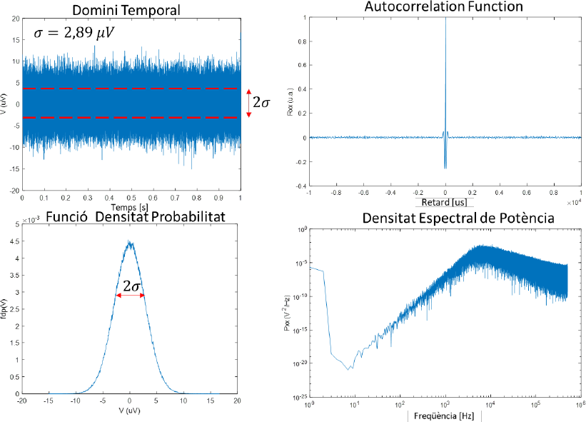

# Introducció al soroll i caracterització estadística

## 📑 Índice de Contenidos

- [1 Què és el soroll en un sistema de mesura](#1-què-és-el-soroll-en-un-sistema-de-mesura)
  - [Soroll intrínsec i extrínsec](#soroll-intrínsec-i-extrínsec)
  - [El soroll fixa el límit de detecció](#el-soroll-fixa-el-límit-de-detecció)
  - [Mitjana, variància i valor eficaç](#mitjana-variància-i-valor-eficaç)
  - [Funció de densitat de probabilitat](#funció-de-densitat-de-probabilitat)
  - [Parseval i densitats espectrals](#parseval-i-densitats-espectrals)

---

Sistemes de Mesura · **Unitat 4 — Soroll** · Document 1 de 6

# Introducció al soroll i caracterització estadística

Dedicació estimada: 8 minuts

> [!NOTE] **Objectius d'aprenentatge**
>
> - Distingir el soroll dels errors sistemàtics i de les interferències, i relacionar-lo amb la incertesa de mesura.
> - Separar el soroll *intrínsec* del *extrínsec* i entendre per què el soroll fixa el límit de detecció.
> - Descriure el soroll com un procés estocàstic estacionari i ergòdic, i estimar-ne mitjana, variància i valor eficaç d'una sola realització.
> - Interpretar la FDP, l'autocorrelació i l'espectre de potència, i reconèixer un procés blanc.
> - Relacionar la variància amb l'àrea de l'espectre (Parseval) i obtenir valors eficaços de densitats en V/√Hz i A/√Hz.

## 1 Què és el soroll en un sistema de mesura

En un sistema de mesura real, el senyal observat mai coincideix exactament amb la magnitud que volem mesurar. Els errors **sistemàtics** (offset, no-linealitat, deriva, guany) es poden caracteritzar i corregir amb calibratge. El **soroll**, en canvi, és un component *aleatori* superposat al senyal que fa que cada mesura sigui lleugerament diferent encara que la magnitud sigui constant; per això no s'elimina calibrant.

Anomenem soroll un senyal aleatori, de mitjana habitualment nul·la, associat a limitacions físiques del sistema o de l'entorn. És inevitable i s'ha d'integrar en el càlcul de la incertesa: **si el soroll és additiu, de mitjana nul·la i no correlacionat amb el senyal, la seva incertesa típica és igual al seu valor eficaç (RMS) a la sortida**. Que la mitjana sigui nul·la no vol dir que no contribueixi a la incertesa: la contribució la fixa la dispersió, no la mitjana. És la font principal de la incertesa típica de *tipus A*, la que surt de la variabilitat en repetir una mesura en condicions idèntiques.

### Soroll intrínsec i extrínsec

El **soroll intrínsec** es genera *dins* del sistema: agitació tèrmica a les resistències, soroll dels semiconductors, soroll de contacte, soroll 1/f dels dispositius actius. Es pot modificar redissenyant el circuit o triant components. El **soroll extrínsec** prové de fonts *externes*: interferències electromagnètiques, acoblament de la xarxa, transitoris. Sovint és determinista (el 50 Hz de la xarxa, ràdiofreqüències, acoblaments capacitius o inductius) i es va tractar a la Unitat 3. Una interferència de 50 Hz captada de la xarxa **no** és soroll tèrmic de les resistències internes, encara que totes dues contribucions se sumin a la sortida. En el model de circuit, el soroll extrínsec també es representa com una tensió o corrent addicional que se suma al senyal, però el seu origen i les tècniques de mitigació són diferents; reduir l'un no garanteix reduir l'altre.

### El soroll fixa el límit de detecció

El soroll total d'un sistema imposa un límit inferior de magnitud detectable. Augmentar el guany *no* millora per si sol la relació senyal-soroll (SNR): el soroll d'entrada s'amplifica igual que el senyal. Un sistema pot tenir molt de guany i, alhora, ser inadequat per a senyals petits si el soroll referit a l'entrada és massa gran; per sota del fons de soroll, cap variació del senyal té significació estadística. La SNR empitjora sempre que el valor eficaç del soroll creix sense que augmenti el senyal.

L'amplada de banda hi és clau: en ampliar-la, integrem més soroll. Per a soroll blanc, el valor eficaç creix amb l'**arrel quadrada** de la banda (duplicar la banda el multiplica per √2, no per 2). Per detectar senyals petits sovint cal limitar la banda al mínim compatible amb la dinàmica del senyal —un compromís entre velocitat i soroll que reprendrem als documents 3 i 6.

## 2 El soroll com a procés estocàstic

El soroll es modela com un procés **estocàstic**  $x(t)$
: una família de funcions, cadascuna amb una certa probabilitat. Una **realització** és el registre temporal concret d'una mesura —una d'aquestes funcions, no el conjunt de totes. En repetir l'experiment obtenim realitzacions diferents amb la mateixa estadística subjacent.

Sovint el soroll és **estacionari** (les propietats estadístiques —mitjana, variància, espectre— no canvien amb el temps; no varien periòdicament) i **ergòdic** (podem substituir la mitjana sobre moltes realitzacions per una mitjana temporal sobre una sola realització prou llarga). L'ergodicitat permet estimar variància i FDP a partir d'una única sèrie mostrejada, sense necessitat de moltes realitzacions independents. A la pràctica tenim  $x[n]=x(nT_s)$
, amb període de mostreig  $T_s$
 i freqüència de mostreig  $f_s=\frac{1}{T_s}$
.

### Mitjana, variància i valor eficaç

La **mitjana**  $\mu$
 és l'esperança; en soroll electrònic s'assumeix sovint  $\mu=0$
. La **variància**  $\sigma^2$
 és l'esperança del *quadrat* de la desviació respecte a la mitjana; amb mitjana nul·la, l'esperança de  $x^2$
. La desviació estàndard  $\sigma$
 **coincideix amb el valor eficaç (RMS)** per a soroll de mitjana nul·la. Amb  $N$
 mostres:

$$
\sigma \approx \sqrt{\frac{1}{N-1}\sum_{i=0}^{N-1} x[i]^2} \qquad (4.1)
$$

Per això, en aquest tema, «desviació estàndard» i «valor eficaç del soroll» s'usen indistintament, i  $\sigma$
 és directament la incertesa típica associada al soroll.

### Funció de densitat de probabilitat

La **FDP** descriu com es reparteixen els valors *instantanis* del soroll. S'estima amb un **histograma**, que cal **normalitzar** (àrea total = 1) perquè sigui una densitat de probabilitat. Amb prou mostres convergeix cap a la FDP real.

En molts sorolls físics, especialment el tèrmic, la FDP és **normal** de mitjana nul·la, per el *teorema central del límit*: el soroll és la suma de moltíssimes contribucions microscòpiques independents (no d'una partícula dominant). El caràcter gaussià relaciona  $\sigma$
 amb intervals de confiança: aproximadament el **68 %** de les mostres cauen dins de  $\pm\sigma$
, el **95 %** dins de  $\pm 2\sigma$
 i el **99,7 %** dins de  $\pm 3\sigma$
 —la base dels factors de cobertura  $k=2$
 (~95 %) i  $k=3$
 (~99,73 %). No tots els sorolls són normals: n'hi ha d'impulsius o amb cues pesades, i llavors cal prudència amb els intervals de confiança.

### Autocorrelació, espectre i soroll blanc

La FDP descriu l'amplitud, però no l'evolució temporal. La **funció d'autocorrelació** mesura la similitud entre el senyal i una còpia retardada  $\tau$
; per a mitjana nul·la,

$$
R_{\text{xx}}(\tau) = E\left[\, x(t)\, x(t+\tau)\,\right]
$$

Si  $R_{\text{xx}}(\tau)=0$
 per a tot  $\tau\neq 0$
, el procés és **blanc**: mostres independents. L'**espectre de potència**  $P_{\text{xx}}(f)$
 descriu com es reparteix la variància en freqüència i, per a processos estacionaris, és la **transformada de Fourier de l'autocorrelació**. En l'estimació pràctica s'aplica sovint una **finestra** (per exemple, de Hann) per reduir les fuites espectrals de l'observació finita.

Un **procés blanc ideal** té autocorrelació nul·la i espectre de potència *constant* (pla) a totes les freqüències; el soroll tèrmic d'una resistència n'és un bon exemple aproximat dins d'una banda finita. El **soroll 1/f**, en canvi, té densitat que decreix amb la inversa de la freqüència: no és blanc perquè la seva densitat *depèn* de la freqüència. En processos blancs, promitjar mostres redueix clarament la incertesa; en processos amb memòria, la reducció és més lenta (document 2).

### Parseval i densitats espectrals

El **teorema de Parseval** iguala la variància a l'àrea sota l'espectre:

$$
\sigma^2 = \int_{0}^{\infty} P_{\text{xx}}(f)\, df \qquad (4.2)
$$

$$
\sigma = \sqrt{\int_{0}^{\infty} P_{\text{xx}}(f)\, df} \qquad (4.3)
$$

(considerant freqüències positives). L'espectre ha d'estar ben normalitzat perquè la igualtat es compleixi. Sovint el soroll s'especifica per la **densitat espectral de tensió**  $e_n(f)$
 (V/√Hz) o de corrent  $i_n(f)$
 (A/√Hz); el valor eficaç s'obté integrant-ne el *quadrat*:

$$
\sigma_V = \sqrt{\int_{f_{\min}}^{f_{\max}} e_n^2(f)\, df}, \qquad \sigma_I = \sqrt{\int_{f_{\min}}^{f_{\max}} i_n^2(f)\, df} \qquad (4.4)
$$

No es pot multiplicar  $e_n$
 (V/√Hz) directament per la banda (Hz): les unitats no quadren. Quan la densitat és *constant* (blanc), n'hi ha prou de multiplicar per  $\sqrt{B}$
, i d'aquí que el valor eficaç del soroll blanc creixi amb  $\sqrt{B}$
. Avançant el document 2: per a una resistència,  $P_{\text{xx}}=4kTR$
 (V²/Hz),  $e_n=\sqrt{4kTR}$
 i  $i_n=\sqrt{\frac{4kT}{R}}$
.

*Figura: Figura 4.1 Caracterització de soroll: senyal temporal ( $\sigma=2{,}89\,\mu\mathrm{V}$
), FDP aproximadament normal, autocorrelació i espectre. Ací l'autocorrelació (no nul·la a retards petits) i l'espectre (no pla) indiquen que el procés no és blanc, tot i tenir FDP gaussiana: gaussià i blanc són propietats independents.*

> [!TIP] **Síntesi**
>
> El soroll és la component aleatòria que, si és additiva, de mitjana nul·la i no correlacionada, té incertesa típica igual al seu valor eficaç. Es distingeix de les interferències (extrínsec) i marca el límit de detecció, que empitjora en ampliar la banda ( $\sigma\propto\sqrt{B}$
> per a blanc). Com a procés estocàstic estacionari i ergòdic, es caracteritza en amplitud per mitjana, variància/RMS i FDP (sovint normal: 68/95/99,7 % dins de  $\pm\sigma,\pm2\sigma,\pm3\sigma$
> ) i en temps/freqüència per l'autocorrelació i l'espectre (TF de l'autocorrelació). Blanc = autocorrelació nul·la i espectre pla. Parseval iguala la variància a l'àrea de l'espectre; les densitats  $e_n$
> (V/√Hz) i  $i_n$
> (A/√Hz) s'integren al quadrat.

[2. Soroll tèrmic →](02_Unitat4_Soroll_termic.md)

---

## 📐 Formulario Resumen de Ecuaciones

| Nº / Ref | Expresión Matemática |
| :---: | :--- |
| **(4.1)** | $\sigma \approx \sqrt{\frac{1}{N-1}\sum_{i=0}^{N-1} x[i]^2}$ |
| **(4.2)** | $\sigma^2 = \int_{0}^{\infty} P_{\text{xx}}(f)\, df$ |
| **(4.3)** | $\sigma = \sqrt{\int_{0}^{\infty} P_{\text{xx}}(f)\, df}$ |
| **(4.4)** | $\sigma_V = \sqrt{\int_{f_{\min}}^{f_{\max}} e_n^2(f)\, df}, \qquad \sigma_I = \sqrt{\int_{f_{\min}}^{f_{\max}} i_n^2(f)\, df}$ |