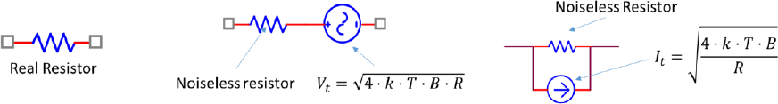

# Soroll tèrmic

## 📑 Índice de Contenidos

- [1 Origen i models del soroll tèrmic](#1-origen-i-models-del-soroll-tèrmic)
  - [Models de Thévenin i de Norton](#models-de-thévenin-i-de-norton)
- [2 Les expressions fonamentals](#2-les-expressions-fonamentals)
  - [Potència de soroll disponible](#potència-de-soroll-disponible)
  - [Densitats espectrals](#densitats-espectrals)
  - [Caràcter blanc, distribució normal i promitjat](#caràcter-blanc-distribució-normal-i-promitjat)
- [3 Soroll en excés i xarxes passives](#3-soroll-en-excés-i-xarxes-passives)
  - [Extensió a xarxes passives](#extensió-a-xarxes-passives)

---

Sistemes de Mesura · **Unitat 4 — Soroll** · Document 2 de 6

# Soroll tèrmic

Dedicació estimada: 7 minuts

> [!NOTE] **Objectius d'aprenentatge**
>
> - Explicar l'origen del soroll tèrmic (Johnson-Nyquist) i per què apareix en qualsevol resistència per sobre del zero absolut.
> - Utilitzar els models de Thévenin i Norton i conèixer-ne l'equivalència.
> - Aplicar  $V_t=\sqrt{4kTBR}$
>,  $I_t=\sqrt{\frac{4kTB}{R}}$
> i les densitats espectrals, i entendre-ne les dependències.
> - Distingir el soroll tèrmic (irreductible) del soroll en excés (evitable) i el paper de la tecnologia.
> - Estendre el càlcul a xarxes passives (part real de la impedància) i relacionar el caràcter blanc amb el promitjat  $1/\sqrt{N}$
>.

## 1 Origen i models del soroll tèrmic

El **soroll tèrmic** (soroll de Johnson o Johnson-Nyquist) és la font de soroll més fonamental en circuits electrònics. El seu origen és l'**agitació tèrmica dels portadors de càrrega**: per sobre del zero absolut, els electrons es mouen aleatòriament, i les fluctuacions microscòpiques de tensió i corrent, sumades, donen un senyal aleatori mesurable als terminals d'una resistència. Com que és tèrmic, apareix *encara que no hi circuli corrent continu*: només depèn de la temperatura. Una resistència ideal a  $T>0$
 genera soroll tèrmic encara que estigui desconnectada, i el seu valor no és nul pel fet de ser petita. Apareix inevitablement en qualsevol resistència real i marca un **límit físic inferior** de sensibilitat: encara que eliminéssim les altres fonts, el soroll tèrmic hi continuaria. Per això, en molt baix soroll (biomèdica, radioastronomia, detectors de partícules) es minimitzen resistència i amplada de banda.

### Models de Thévenin i de Norton

Una resistència real es modela com una **resistència ideal sense soroll** més un generador que representa les fluctuacions tèrmiques, de tensió (Thévenin) o de corrent (Norton). Així es tracten per separat la resistència i el soroll: es pot aplicar superposició i combinar fonts independents per **suma pitagòrica** (arrel quadrada de la suma dels quadrats dels valors eficaços).

*Figura: Figura 4.2 Models de soroll tèrmic d'una resistència: component real (esquerra), Thévenin —resistència ideal en sèrie amb la font de tensió $V_t$
— (centre) i Norton —resistència ideal en paral·lel amb la font de corrent $I_t$
— (dreta), a temperatura absoluta $T$
.*

En el **model de Thévenin**, la resistència es representa com una resistència ideal  $R$
 *en sèrie* amb una font de tensió de soroll  $V_t$
, de mitjana nul·la. Correspon a la tensió en circuit obert i és útil quan la resistència es connecta a una entrada d'alta impedància (preamplificadors, entrada no inversora d'un operacional), perquè  $V_t$
 es propaga multiplicada pel guany. En el **model de Norton**, es representa com  $R$
 ideal *en paral·lel* amb una font de corrent de soroll  $I_t$
; correspon al corrent en curtcircuit i és convenient en nodes de baixa impedància (inversors, transimpedància). Totes dues es relacionen per  $I_t = V_t/R$
.

## 2 Les expressions fonamentals

La tensió eficaç de soroll d'una resistència  $R$
 a temperatura  $T$
 en circuit obert és

$$
V_t = \sqrt{4kTBR} \qquad (4.5)
$$

amb  $k \approx 1{,}38\times 10^{-23}\ \mathrm{J/K}$
 (constant de Boltzmann),  $T$
 en kelvin,  $B$
 l'amplada de banda equivalent de soroll (document 3) i  $R$
 en ohms. Creix amb l'**arrel quadrada** de  $T$
,  $B$
 i  $R$
: reduir el soroll un factor 10 exigiria reduir-ne algun un factor 100. La tensió de soroll *augmenta* amb  $R$
. Per exemple,  $R=100\ \mathrm{k\Omega}$
 a 298 K i  $B=1\ \mathrm{kHz}$
 dona  $V_t\approx 1{,}3\ \mu\mathrm{V}$
 —crític si el senyal útil és de l'ordre del microvolt (ECG, termoparells).

En curtcircuit, el corrent de soroll és

$$
I_t = \sqrt{\frac{4kTB}{R}} \qquad (4.6)
$$

de manera que una resistència gran genera *més* tensió però *menys* corrent de soroll:  $I_t$
 disminueix en augmentar  $R$
 (amb els valors anteriors,  $\approx 13\ \mathrm{pA}$
). Això condiciona la topologia: en alta impedància (domina la tensió) convé  $R$
 petita; en baixa impedància (domina el corrent),  $R$
 gran.

### Potència de soroll disponible

La **potència de soroll disponible** (màxima transferible a una càrrega adaptada) és

$$
P_t = V_t \cdot I_t = \sqrt{4kTBR}\,\sqrt{\frac{4kTB}{R}} = 4kTB \qquad (4.7)
$$

**independent del valor de la resistència** (teorema de màxima transferència).

### Densitats espectrals

El soroll tèrmic és **blanc** fins a freqüències extremadament altes (THz). Les densitats espectrals de potència de tensió i de corrent són

$$
P_{\text{xx}}(f) = 4kTR \quad [\mathrm{V^2/Hz}] \qquad (4.8)
$$

proporcional a la temperatura absoluta. Integrant la constant sobre la banda,

$$
\sigma_V^2 = \int_{f_{\min}}^{f_{\max}} P_{\text{xx}}(f)\, df = 4kTR\,(f_{\max}-f_{\min}) = 4kTRB \qquad (4.9)
$$

i recuperem (4.5). La densitat espectral de potència de corrent és

$$
P_{\text{ii}}(f) = \frac{4kT}{R} \quad [\mathrm{A^2/Hz}] \qquad (4.10)
$$

A la pràctica es fan servir les densitats de tensió i corrent (arrel de les anteriors):

$$
e_n(f) = \sqrt{4kTR} \quad [\mathrm{V/\sqrt{Hz}}] \qquad (4.11)
$$

$$
i_n(f) = \sqrt{\frac{4kT}{R}} \quad [\mathrm{A/\sqrt{Hz}}] \qquad (4.12)
$$

$e_n(f)$
 és el valor eficaç en una banda d'1 Hz. Per al total en una banda  $B$
 cal integrar-ne el *quadrat*; si és constant (blanc), n'hi ha prou de multiplicar per  $\sqrt{B}$
:

$$
V_t = e_n\sqrt{B} = \sqrt{4kTR}\,\sqrt{B} = \sqrt{4kTRB} \qquad (4.13)
$$

Aquest és el format dels fabricants: donen la densitat en V/√Hz o A/√Hz, independent de la banda, i el dissenyador calcula el valor eficaç. Per exemple, a 298 K una resistència de 10 kΩ té  $e_n\approx 12{,}8\ \mathrm{nV/\sqrt{Hz}}$
. La densitat s'integra al *quadrat*; no es multiplica directament per la banda en Hz. (La densitat de corrent de soroll tèrmic és  $i_n=\sqrt{\frac{4kT}{R}}$
, que *disminueix* amb  $R$
, i la de tensió  $e_n=\sqrt{4kTR}$
, que hi *augmenta*.)

### Caràcter blanc, distribució normal i promitjat

Com que és blanc, l'autocorrelació és pràcticament una delta: mostres separades més d'un temps característic (invers de la banda) són independents. Per això, si promitgem  $N$
 mesures d'una magnitud constant afectada per soroll blanc, la incertesa de la mitjana **decreix amb  $1/\sqrt{N}$**. En un procés amb forta correlació temporal, el promitjat redueix la incertesa més lentament. En amplitud, el soroll tèrmic és **normal** de mitjana nul·la (teorema central del límit), amb els factors de cobertura habituals (68/95/99,7 % dins de  $\pm\sigma,\pm2\sigma,\pm3\sigma$
).

## 3 Soroll en excés i xarxes passives

$V_t=\sqrt{4kTBR}$
 és el soroll *mínim* d'una resistència. Moltes en presenten més: el **soroll en excés**, sense origen tèrmic, associat a contactes, defectes o inhomogeneïtats, que apareix *quan hi circula corrent continu*. És important en resistències de **carbó o composició** (el corrent salta entre grans a través de barreres), amb espectre 1/f que creix cap a baixes freqüències (document 4). Les de **pel·lícula metàl·lica** s'acosten al límit tèrmic teòric; per això, en baix soroll es recomana pel·lícula metàl·lica i *no* carbó, sobretot en mesures lentes. El soroll en excés **augmenta amb la tensió (o corrent) contínua** aplicada —al contrari que el tèrmic, independent del corrent— i depèn de la tecnologia i dels defectes; convé, doncs, minimitzar tensions i corrents continus per les resistències crítiques, i en aplicacions extremes seleccionar-les mesurant-ne el soroll.

### Extensió a xarxes passives

Per a una xarxa passiva d'impedància  $Z(f)=R(f)+jX(f)$
, la densitat espectral de tensió de soroll és

$$
P_{\text{xx}}(f) = 4kT\,R(f) \quad [\mathrm{V^2/Hz}] \qquad (4.14)
$$

on  $R(f)$
 és la **part real**: només la component *resistiva* (dissipativa) contribueix al soroll tèrmic. Els components reactius ideals (condensadors, inductors) **no generen soroll tèrmic propi** perquè no dissipen energia, encara que modifiquen l'espectre alterant la impedància. En un filtre RC, per exemple, la part real varia amb la freqüència i la potència total s'obté integrant  $P_{\text{xx}}(f)$
 sobre la banda. En resum, el soroll tèrmic és inevitable però predictible, i el soroll en excés és evitable amb bons components i condicions de funcionament controlades.

> [!TIP] **Síntesi**
>
> El soroll tèrmic (Johnson-Nyquist) prové de l'agitació tèrmica i apareix en qualsevol resistència per sobre del zero absolut, fins i tot sense corrent. Es modela amb Thévenin (font de tensió  $V_t=\sqrt{4kTBR}$
> en sèrie) o Norton (font de corrent  $I_t=\sqrt{\frac{4kTB}{R}}$
> en paral·lel), via  $I_t=V_t/R$
>. La tensió creix amb  $\sqrt{R}$
> i el corrent decreix amb  $\sqrt{R}$
>; la potència disponible  $4kTB$
> és independent de  $R$
>. Densitats:  $4kTR$
> (V²/Hz) i  $4kT/R$
> (A²/Hz); blanc i gaussià, amb promitjat  $1/\sqrt{N}$
>. El soroll en excés (1/f, lligat al corrent continu i a la tecnologia) s'afegeix al tèrmic i és menor en pel·lícula metàl·lica. En xarxes passives, només la part real  $4kT\,R(f)$
> genera soroll.

[← 1. Introducció al soroll i caracterització estadística](01_Unitat4_Introduccio_i_estadistica.md)[3. Amplada de banda equivalent de soroll →](03_Unitat4_Amplada_banda_equivalent.md)

---

## 📐 Formulario Resumen de Ecuaciones

| Nº / Ref | Expresión Matemática |
| :---: | :--- |
| **(4.5)** | $V_t = \sqrt{4kTBR}$ |
| **(4.6)** | $I_t = \sqrt{\frac{4kTB}{R}}$ |
| **(4.7)** | $P_t = V_t \cdot I_t = \sqrt{4kTBR}\,\sqrt{\frac{4kTB}{R}} = 4kTB$ |
| **(4.8)** | $P_{\text{xx}}(f) = 4kTR \quad [\mathrm{V^2/Hz}]$ |
| **(4.9)** | $\sigma_V^2 = \int_{f_{\min}}^{f_{\max}} P_{\text{xx}}(f)\, df = 4kTR\,(f_{\max}-f_{\min}) = 4kTRB$ |
| **(4.10)** | $P_{\text{ii}}(f) = \frac{4kT}{R} \quad [\mathrm{A^2/Hz}]$ |
| **(4.11)** | $e_n(f) = \sqrt{4kTR} \quad [\mathrm{V/\sqrt{Hz}}]$ |
| **(4.12)** | $i_n(f) = \sqrt{\frac{4kT}{R}} \quad [\mathrm{A/\sqrt{Hz}}]$ |
| **(4.13)** | $V_t = e_n\sqrt{B} = \sqrt{4kTR}\,\sqrt{B} = \sqrt{4kTRB}$ |
| **(4.14)** | $P_{\text{xx}}(f) = 4kT\,R(f) \quad [\mathrm{V^2/Hz}]$ |