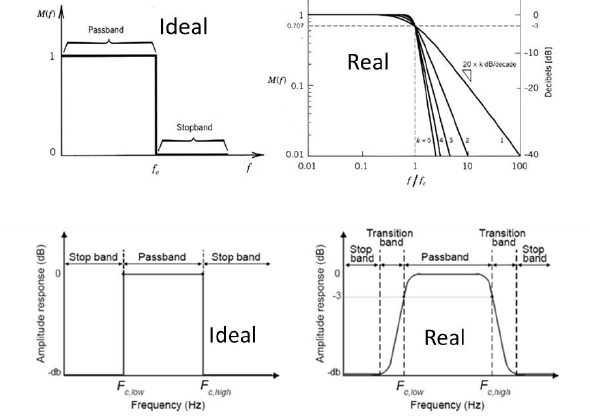
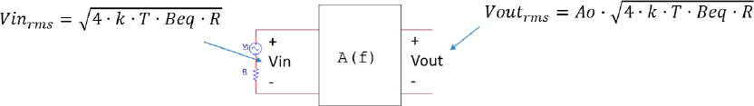

# Amplada de banda equivalent de soroll

## 📑 Índice de Contenidos

- [1 Per què una amplada de banda «equivalent»](#1-per-què-una-amplada-de-banda-equivalent)
  - [Sistemes reals: banda de transició](#sistemes-reals-banda-de-transició)
- [2 Definició formal i càlcul](#2-definició-formal-i-càlcul)
  - [Casos analítics habituals](#casos-analítics-habituals)
- [3 Exemple resolt: soroll tèrmic d'un sensor](#3-exemple-resolt-soroll-tèrmic-dun-sensor)

---

Sistemes de Mesura · **Unitat 4 — Soroll** · Document 3 de 6

# Amplada de banda equivalent de soroll

Dedicació estimada: 11 minuts

> [!NOTE] **Objectius d'aprenentatge**
>
> - Entendre per què cal una amplada de banda equivalent de soroll  $B_{\text{eq}}$
> i què significa geomètricament.
> - Reconèixer que  $B_{\text{eq}}$
> integra el *quadrat* de la resposta en freqüència i que, en sistemes reals, no coincideix amb la freqüència de tall a −3 dB.
> - Aplicar els resultats  $B_{\text{eq}}=\frac{\pi}{2}f_{-3\,\mathrm{dB}}\approx 1{,}57\,f_{-3\,\mathrm{dB}}$
> (1r ordre) i  $B_{\text{eq}}=1{,}11\,f_{-3\,\mathrm{dB}}$
> (Butterworth 2n ordre).
> - Resoldre un càlcul complet de soroll tèrmic a l'entrada i la sortida d'un sistema passabaixes.

## 1 Per què una amplada de banda «equivalent»

El valor eficaç de soroll d'una font —tèrmic o d'un altre tipus— depèn sempre d'un paràmetre anomenat **amplada de banda equivalent de soroll**,  $B_{\text{eq}}$
. És un dels pilars de l'anàlisi de soroll, perquè connecta la resposta freqüencial real d'un sistema amb la potència total de soroll que deixa passar. La idea és substituir la forma complexa de la resposta real per un **filtre ideal rectangular** que produeixi exactament la mateixa potència de soroll a la sortida. Així els càlculs es simplifiquen enormement.

*Figura: Figura 4.3 Amplada de banda equivalent de soroll en sistemes passabaixes (a dalt) i passabanda (a baix). A l'esquerra, les respostes ideals rectangulars; a la dreta, les respostes reals, amb banda de transició i pendents que depenen de l'ordre del sistema.*

Un sistema **passabaixes ideal** presenta guany constant  $A_0$
 des de contínua fins a una freqüència límit  $f_c$
, i guany nul per damunt:

$$
|A(f)| = A_0 \;\;(0\leq f\leq f_c); \qquad |A(f)| = 0 \;\;(f>f_c) \qquad (4.15)
$$

Un sistema **passabanda ideal** té guany  $A_0$
 entre  $f_{c,\min}$
 i  $f_{c,\max}$
 i nul fora d'aquest interval:

$$
|A(f)| = A_0 \;\;(f_{c,\min}\leq f\leq f_{c,\max}); \qquad |A(f)| = 0 \;\;\mathrm{(altrament)} \qquad (4.16)
$$

Un passabanda ideal, doncs, deixa passar les freqüències *compreses entre* les dues freqüències de tall. En aquests casos ideals,  $B_{\text{eq}}$
 coincideix amb l'amplada geomètrica:  $B_{\text{eq}}=f_c$
 (passabaixes) i  $B_{\text{eq}}=f_{c,\max}-f_{c,\min}$
 (passabanda). El problema és que cap sistema físic real té una resposta rectangular perfecta.

### Sistemes reals: banda de transició

Tot sistema real té una **banda de transició** entre la zona de pas i la d'eliminació, on el guany decreix gradualment. La rapidesa depèn de l'ordre: un sistema de primer ordre (un pol) cau a −20 dB/dècada (−6 dB/octava); un de segon ordre a −40 dB/dècada; en general, un d'ordre  $k$
 cau a −20 $k$
 dB/dècada.

La freqüència de tall a −3 dB,  $f_{-3\,\mathrm{dB}}$
, és aquella on el guany ha caigut a  $A_0/\sqrt{2}$
 (la potència s'ha reduït a la meitat). A causa de la banda de transició, usar simplement  $f_{-3\,\mathrm{dB}}$
 com a amplada de banda per als càlculs de soroll condueix a errors sistemàtics —generalment una *subestimació*— perquè les freqüències lleugerament superiors a  $f_{-3\,\mathrm{dB}}$
 encara contribueixen amb soroll. Com més gran és l'ordre, més abrupta és la transició i més s'aproxima la resposta a la ideal; en el límit  $k\to\infty$
,  $B_{\text{eq}}\to f_{-3\,\mathrm{dB}}$
. L'ordre del filtre, per tant, sí que influeix en la relació entre  $B_{\text{eq}}$
 i la freqüència de tall.

## 2 Definició formal i càlcul

L'amplada de banda equivalent de soroll d'un sistema amb resposta  $A(f)$
 i guany màxim  $A_0$
 es defineix com

$$
B_{\text{eq}} = \frac{1}{A_0^2}\int_{0}^{\infty} |A(f)|^2\, df \qquad (4.17)
$$

Geomètricament,  $B_{\text{eq}}$
 és l'amplada d'un rectangle d'alçada  $A_0^2$
 amb la mateixa àrea que la corba  $|A(f)|^2$
:

$$
A_0^2\cdot B_{\text{eq}} = \int_{0}^{\infty} |A(f)|^2\, df \qquad (4.18)
$$

És crucial que la integral involucra el **mòdul al quadrat**, no el mòdul directament: la potència de soroll a la sortida és proporcional a  $|A(f)|^2$
 per a cada component. Per a una font de soroll blanc de densitat  $S_n$
 constant, la potència total a la sortida és

$$
V_{n,out}^2 = \int_{0}^{\infty} S_n\,|A(f)|^2\, df = S_n\,A_0^2\,B_{\text{eq}} \qquad (4.19)
$$

que és exactament la que donaria un filtre ideal rectangular de guany  $A_0$
 i amplada  $B_{\text{eq}}$
:

$$
V_{n,out,\,ideal}^2 = S_n\,A_0^2\,B_{\text{eq}} \qquad (4.20)
$$

Aquesta és la interpretació física:  $B_{\text{eq}}$
 és l'amplada que hauria de tenir un sistema ideal per produir el mateix soroll a la sortida que el sistema real.

*Figura: Figura 4.4 Amplada de banda equivalent aplicada al soroll tèrmic d'una resistència: el soroll d'entrada es propaga pel bloc $A(f)$
i el valor eficaç de sortida s'obté amb $B_{\text{eq}}$
.*

Per al soroll tèrmic d'una resistència  $R$
 a temperatura  $T$
, la tensió eficaç a la sortida queda

$$
V_{n,out} = A_0\sqrt{4kTR\,B_{\text{eq}}} \qquad (4.21)
$$

i, referida a l'entrada dividint pel guany,

$$
V_{n,in} = \sqrt{4kTR\,B_{\text{eq}}} \qquad (4.22)
$$

condicionada per l'amplada de banda equivalent del sistema que fa servir aquesta resistència.

### Casos analítics habituals

Per a un passabaixes de primer ordre amb guany  $A_0$
 i freqüència de tall  $f_0=f_{-3\,\mathrm{dB}}$
:

$$
A(f) = \frac{A_0}{1+j\,f/f_0} \qquad (4.23)
$$

$$
|A(f)|^2 = \frac{A_0^2}{1+(f/f_0)^2} \qquad (4.24)
$$

Substituint a la definició i amb el canvi  $x=f/f_0$
:

$$
B_{\text{eq}} = \frac{1}{A_0^2}\int_{0}^{\infty}\frac{A_0^2}{1+(f/f_0)^2}\,df = f_0\int_{0}^{\infty}\frac{dx}{1+x^2} = f_0\cdot\frac{\pi}{2} \qquad (4.25)
$$

és a dir,

$$
B_{\text{eq}} = \frac{\pi}{2}\,f_{-3\,\mathrm{dB}} \approx 1{,}57\,f_{-3\,\mathrm{dB}} \qquad (4.26)
$$

Un passabaixes de primer ordre deixa passar, doncs, un **57 % més** de potència de soroll que un filtre ideal amb la mateixa freqüència de tall. La causa és la cua que decreix lentament (−20 dB/dècada) i continua deixant passar soroll per damunt de  $f_{-3\,\mathrm{dB}}$
. Per a un **Butterworth de segon ordre** ( $Q=1/\sqrt{2}\approx 0{,}707$
), maximalment pla a la banda de pas,

$$
B_{\text{eq}} = 1{,}11\,f_{-3\,\mathrm{dB}} \qquad (4.27)
$$

només un 11 % superior, reflex de la caiguda molt més ràpida (−40 dB/dècada). Per a segon ordre amb  $Q$
 diferent,  $B_{\text{eq}}$
 depèn de  $Q$
:  $Q$
 alts (amortiment baix) presenten pics de ressonància que augmenten l'àrea sota  $|A(f)|^2$
 i, per tant,  $B_{\text{eq}}$
. En augmentar l'ordre del Butterworth, la relació  $B_{\text{eq}}/f_{-3\,\mathrm{dB}}$
 tendeix a 1.

En sistemes **passabanda** amb  $f_{c,\min}\ll f_{c,\max}$
,  $B_{\text{eq}}$
 s'aproxima per la del passabaixes de freqüència de tall  $f_{c,\max}$
: el límit superior domina l'estimació del soroll blanc integrat, perquè el límit inferior és negligible. Per exemple, un passabanda entre 10 Hz i 1 kHz té una  $B_{\text{eq}}$
 pràcticament igual a la d'un passabaixes de 1 kHz.

## 3 Exemple resolt: soroll tèrmic d'un sensor

> [!EXAMPLE] **Exemple resolt**
>
> Es vol mesurar un sensor modelable com una resistència  $R=100\ \mathrm{k\Omega}$
> amb un sistema que es comporta com un passabaixes de primer ordre amb  $f_0=f_{-3\,\mathrm{dB}}=100\ \mathrm{Hz}$
> i guany en contínua  $A_0=1000$
>. La temperatura del sensor és de 37 °C. Es demana: (a) l'expressió del mòdul de la resposta freqüencial; (b) l'amplada de banda equivalent de soroll; (c) la tensió eficaç de soroll a l'entrada i a la sortida.
>
> 1. Mòdul de la resposta. Amb  $s=j2\pi f$
>,  $A(f)=A_0/(1+jf/f_0)$
>, de manera que
>

$$
|A(f)| = \frac{A_0}{\sqrt{1+(f/f_0)^2}} = \frac{1000}{\sqrt{1+(f/100)^2}}
$$

> Verificació:  $|A(0)|=1000$
> i  $|A(100)|=1000/\sqrt{2}\approx 707$
>, la caiguda de −3 dB esperada.
> 2. Amplada de banda equivalent. Aplicant (4.17) i el canvi  $x=f/f_0$
>,
>

$$
B_{\text{eq}} = f_0\int_{0}^{\infty}\frac{dx}{1+x^2} = f_0\cdot\frac{\pi}{2} = \frac{\pi}{2}\cdot 100\ \mathrm{Hz} = 157\ \mathrm{Hz}
$$

> Malgrat que el sistema talla a 100 Hz, la cua acumula soroll equivalent a una finestra rectangular de 157 Hz.
> 3. Temperatura en kelvin.  $T = 273{,}15 + 37 = 310{,}15\ \mathrm{K}$
>.
> 4. Soroll referit a l'entrada. Amb (4.22),
>

$$
V_{n,in} = \sqrt{4kTR\,B_{\text{eq}}} = \sqrt{4\cdot 1{,}38\times 10^{-23}\cdot 310{,}15\cdot 10^{5}\cdot 157} \approx 0{,}52\ \mu\mathrm{V}
$$

> 5. Soroll referit a la sortida. Multiplicant pel guany,
>

$$
V_{n,out} = A_0\cdot V_{n,in} = 1000\cdot 0{,}52\ \mu\mathrm{V} = 0{,}52\ \mathrm{mV}
$$

> 6. Interpretació. Si el sensor dona un senyal útil de 10 μV, la SNR és d'uns 20 (≈26 dB), modesta per a precisió. Per reduir el soroll: (i) reduir la banda —passar de 100 Hz a 10 Hz baixa  $B_{\text{eq}}$
> a 15,7 Hz i el soroll un factor  $\sqrt{10}\approx 3{,}16$
>, a canvi d'una resposta 10 vegades més lenta—; (ii) reduir  $R$
> si el disseny ho permet; (iii) refrigerar el sensor, poc pràctic normalment.

Aquest exemple mostra el paper central de  $B_{\text{eq}}$
: connecta la resposta freqüencial del sistema amb la potència de soroll observada, i el seu control és una de les eines més potents per optimitzar la qualitat de les mesures. Al document 6 el retrobarem en un cas amb amplificador operacional i condensador de retroalimentació.

> [!TIP] **Síntesi**
>
> L'amplada de banda equivalent de soroll  $B_{\text{eq}}=\frac{1}{A_0^2}\int_0^\infty |A(f)|^2 df$
> és l'amplada d'un filtre rectangular ideal que deixaria passar la mateixa potència de soroll que el sistema real. Integra el mòdul *al quadrat*, i en sistemes reals és més gran que  $f_{-3\,\mathrm{dB}}$
>:  $1{,}57\,f_{-3\,\mathrm{dB}}$
> en primer ordre i  $1{,}11\,f_{-3\,\mathrm{dB}}$
> en Butterworth de segon, tendint a 1 en augmentar l'ordre. El soroll tèrmic referit a l'entrada val  $\sqrt{4kTR\,B_{\text{eq}}}$
> i a la sortida es multiplica per  $A_0$
>. En passabanda amb  $f_{c,\min}\ll f_{c,\max}$
>, domina el límit superior. Reduir la banda redueix el soroll amb  $\sqrt{B_{\text{eq}}}$
> a costa de la velocitat de resposta.

[← 2. Soroll tèrmic](02_Unitat4_Soroll_termic.md)[4. Altres fonts de soroll: shot i 1/f →](04_Unitat4_Soroll_shot_i_1f.md)

---

## 📐 Formulario Resumen de Ecuaciones

| Nº / Ref | Expresión Matemática |
| :---: | :--- |
| **(4.15)** | $\|A(f)\| = A_0 \;\;(0\leq f\leq f_c); \qquad \|A(f)\| = 0 \;\;(f>f_c)$ |
| **(4.16)** | $\|A(f)\| = A_0 \;\;(f_{c,\min}\leq f\leq f_{c,\max}); \qquad \|A(f)\| = 0 \;\;\mathrm{(altrament)}$ |
| **(4.17)** | $B_{\text{eq}} = \frac{1}{A_0^2}\int_{0}^{\infty} \|A(f)\|^2\, df$ |
| **(4.18)** | $A_0^2\cdot B_{\text{eq}} = \int_{0}^{\infty} \|A(f)\|^2\, df$ |
| **(4.19)** | $V_{n,out}^2 = \int_{0}^{\infty} S_n\,\|A(f)\|^2\, df = S_n\,A_0^2\,B_{\text{eq}}$ |
| **(4.20)** | $V_{n,out,\,ideal}^2 = S_n\,A_0^2\,B_{\text{eq}}$ |
| **(4.21)** | $V_{n,out} = A_0\sqrt{4kTR\,B_{\text{eq}}}$ |
| **(4.22)** | $V_{n,in} = \sqrt{4kTR\,B_{\text{eq}}}$ |
| **(4.23)** | $A(f) = \frac{A_0}{1+j\,f/f_0}$ |
| **(4.24)** | $\|A(f)\|^2 = \frac{A_0^2}{1+(f/f_0)^2}$ |
| **(4.25)** | $B_{\text{eq}} = \frac{1}{A_0^2}\int_{0}^{\infty}\frac{A_0^2}{1+(f/f_0)^2}\,df = f_0\int_{0}^{\infty}\frac{dx}{1+x^2} = f_0\cdot\frac{\pi}{2}$ |
| **(4.26)** | $B_{\text{eq}} = \frac{\pi}{2}\,f_{-3\,\mathrm{dB}} \approx 1{,}57\,f_{-3\,\mathrm{dB}}$ |
| **(4.27)** | $B_{\text{eq}} = 1{,}11\,f_{-3\,\mathrm{dB}}$ |