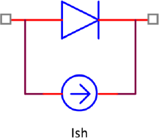

# Altres fonts de soroll: shot i 1/f

## 📑 Índice de Contenidos

- [1 Soroll shot (Schottky)](#1-soroll-shot-schottky)
- [2 Soroll de contacte, soroll en excés i soroll 1/f](#2-soroll-de-contacte-soroll-en-excés-i-soroll-1f)
  - [Integració logarítmica](#integració-logarítmica)

---

Sistemes de Mesura · **Unitat 4 — Soroll** · Document 4 de 6

# Altres fonts de soroll: shot i 1/f

Dedicació estimada: 7 minuts

> [!NOTE] **Objectius d'aprenentatge**
>
> - Explicar l'origen del soroll shot (Schottky) i les dues condicions necessàries perquè aparegui.
> - Aplicar  $S_i=2qI_{\text{dc}}$
> i  $i_{n,rms}=\sqrt{2qI_{\text{dc}}B}$
>, i reconèixer-lo com a soroll blanc.
> - Descriure el soroll de contacte 1/f, el seu espectre  $K/f^\alpha$
> i la seva integració logarítmica.
> - Comprendre per què el soroll 1/f divergeix matemàticament quan  $f_{\min}\to 0$
> però té un efecte pràctic moderat.

A banda del soroll tèrmic (document 2), els dispositius —sobretot els actius— presenten dues fonts més: el **soroll shot** (o Schottky) i el **soroll de contacte 1/f** (flicker). Cal entendre-les per modelar i dissenyar correctament sistemes de baix soroll.

## 1 Soroll shot (Schottky)

El soroll shot és intrínsec a qualsevol dispositiu on hi ha **pas discret de càrrega a través d'una barrera de potencial** quan circula corrent continu. És de naturalesa quàntica, relacionat amb la quantització de la càrrega (càrrega elemental  $q$
) i amb l'estadística de Poisson del pas aleatori de portadors.

En una unió PN polaritzada en directa (díode, unió base-emissor d'un BJT, fotodíode) els portadors creuen la regió de depleció de manera discreta: cada electró o forat aporta una càrrega  $q$
. Encara que el corrent mitjà sigui constant ( $I_{\text{dc}}$
), el nombre d'esdeveniments en un interval curt fluctua aleatòriament: si de mitjana hi passen  $N$
 portadors, la desviació típica és aproximadament  $\sqrt{N}$
. Aquestes fluctuacions es perceben com a soroll. El soroll shot apareix, doncs, sempre que hi ha (1) una barrera de potencial i (2) un corrent continu que la travessa. **Sense corrent DC apreciable, el soroll shot d'aquella unió és negligible** —fet molt útil per reduir soroll a les etapes d'entrada. No té, per tant, el mateix origen que el soroll tèrmic (agitació tèrmica en un conductor, sense barrera) ni la mateixa dependència: el shot no depèn de  $R$
 sinó del corrent.

*Figura: Figura 4.5 Modelització del soroll shot: el corrent continu es modela amb la branca ideal (model exponencial del díode) i el soroll shot s'afegeix com una font de corrent aleatori $i_{\text{sh}}(t)$
en paral·lel amb la unió.*

En anàlisi de petits senyals i de soroll, el soroll shot es modela com una **font de corrent de soroll en paral·lel** amb la unió (o amb el corrent DC equivalent). El mateix esquema serveix per als corrents de col·lector en BJT, els corrents de fuites en díodes i els corrents fotoinduïts en fotodíodes. La densitat espectral de potència de corrent és aproximadament constant amb la freqüència —és a dir, **soroll blanc** dins de la banda de treball:

$$
S_i(f) = 2\,q\,I_{\text{dc}} \quad [\mathrm{A^2/Hz}] \qquad (4.28)
$$

on  $q$
 és la càrrega elemental i  $I_{\text{dc}}$
 el corrent continu. La densitat és *proporcional* al corrent continu. Integrant sobre una amplada de banda equivalent  $B$
:

$$
i_{n,rms}^2 = \int_{f_{\min}}^{f_{\max}} S_i(f)\,df \approx \int_{0}^{B} 2qI_{\text{dc}}\,df = 2qI_{\text{dc}}B \qquad (4.29)
$$

$$
i_{n,rms} = \sqrt{2qI_{\text{dc}}B} \qquad (4.30)
$$

El valor eficaç creix amb l'arrel quadrada del corrent i amb l'arrel quadrada de l'amplada de banda; per tant, *augmenta* en ampliar la banda. Com que la densitat és essencialment constant, es pot considerar blanc en l'interval habitual dels sistemes de mesura (de pocs Hz a centenars de kHz). Els fotodíodes il·luminats presenten també soroll shot, precisament perquè el corrent fotoinduït és un corrent continu que travessa una unió.

**Exemple ràpid.** Un fotodíode amb  $I_{\text{dc}}=10\ \mu\mathrm{A}$
 en un sistema amb  $B=100\ \mathrm{kHz}$
:

$$
i_{n,rms} = \sqrt{2qI_{\text{dc}}B} \approx \sqrt{2\cdot 1{,}6\times 10^{-19}\cdot 10^{-5}\cdot 10^{5}} \approx 570\ \mathrm{pA}
$$

Sembla petit, però amb una transimpedància elevada ( $R_f=100\ \mathrm{k\Omega}$
) donaria dècimes de μV a la sortida, comparable amb el senyal en aplicacions sensibles.

## 2 Soroll de contacte, soroll en excés i soroll 1/f

El **soroll 1/f** (o de contacte, o en excés, o flicker) domina generalment a **baixes freqüències** i té un espectre que decreix aproximadament com  $\frac{1}{f}$
. Apareix típicament quan s'uneixen materials diferents (contactes metall-semiconductor, metall-metall), quan hi ha barreja de materials (resistències de carbó) o quan el material té imperfeccions, defectes o inhomogeneïtats. Com el soroll en excés que vam veure al document 2, necessita que hi circuli un **corrent continu**  $I_{\text{dc}}$
: aquest corrent posa en joc mecanismes de captura i emissió de portadors, migració d'ions i variacions locals de resistivitat que generen fluctuacions lentes.

Escenaris típics: resistències de carbó, contactes mecànics (relés, connectors, potenciòmetres, sobretot amb oxidacions) i dispositius actius (MOSFET, BJT), on les trampes a l'òxid o a la interfície generen soroll 1/f. A diferència del soroll tèrmic —intrínsec i present encara que no circuli corrent—, el soroll 1/f **augmenta amb el corrent continu** i és molt sensible a la tecnologia i la qualitat dels materials; no depèn només de la temperatura ni és independent dels contactes i defectes.

El comportament espectral es modela amb una densitat espectral de potència (per exemple, de tensió)

$$
S_v(f) = \frac{K}{f^{\alpha}} \quad \mathrm{amb } \alpha\approx 1 \qquad (4.31)
$$

on  $K$
 depèn del dispositiu, la tecnologia, el corrent DC i la geometria, i  $\alpha$
 és molt propera a 1. Com que la densitat *canvia* amb la freqüència, és un soroll **no blanc**, especialment rellevant a baixes freqüències, en contrast amb el tèrmic i el shot, que són plans dins de la banda d'interès.

### Integració logarítmica

La variància en una banda  $[f_{\min},f_{\max}]$
 és

$$
v_{n,rms}^2 = \int_{f_{\min}}^{f_{\max}} \frac{K}{f}\,df = K\,\ln\!\left(\frac{f_{\max}}{f_{\min}}\right) \qquad (4.32)
$$

$$
v_{n,rms} = \sqrt{K\,\ln\!\left(\frac{f_{\max}}{f_{\min}}\right)} \qquad (4.33)
$$

La contribució eficaç del soroll 1/f, doncs, depèn del *logaritme* del quocient de freqüències, no de la diferència lineal  $f_{\max}-f_{\min}$
 (això seria el cas blanc). D'aquí dues conseqüències:

- El soroll 1/f **divergeix logarítmicament** quan  $f_{\min}\to 0$
: integrar des de freqüència zero donaria soroll infinit.
- Creix molt **lentament** amb  $f_{\max}$
   (només amb el logaritme), molt més a poc a poc que el soroll blanc, que creix linealment amb la banda.

En un sistema real,  $f_{\max}$
 el fixa l'amplada de banda equivalent (document 3), i  $f_{\min}$
 **no és zero**: el determina el temps total d'observació ( $f_{\min}\approx 1/T_{\text{obs}}$
), els filtres passaaltes del sistema o l'acoblament AC. En una mesura de durada finita no es poden observar fluctuacions de període infinit; la divergència matemàtica no implica un soroll infinit real. Sovint es prenen valors típics de  $f_{\min}$
 de l'ordre de 0,1 Hz o 0,01 Hz per a observacions llargues.

El caràcter logarítmic fa que  $f_{\min}$
 influeixi poc: baixar  $f_{\min}$
 des de 0,1 Hz fins a valors extraordinàriament petits (ordre de  $10^{-20}$
 Hz, períodes comparables a l'edat de l'univers) només augmenta el valor eficaç un factor d'aproximadament **2,4**. Tot i la divergència, doncs, l'efecte pràctic de considerar freqüències tan baixes és moderat.

Els fabricants d'amplificadors solen proporcionar la densitat de soroll blanc  $e_{n,white}$
 (constant per damunt d'una certa freqüència) i la densitat a una freqüència de referència (per exemple,  $e_n(10\ \mathrm{Hz})$
). Amb aquestes dades es descompon la densitat total en una part blanca i una 1/f, i s'integra sobre  $[f_{\min},f_{\max}]$
: ho farem en detall als exemples del document 5. La freqüència on totes dues components s'igualen s'anomena **freqüència corner**, i separa aproximadament la zona dominada pel soroll 1/f (per sota) de la dominada pel soroll blanc (per damunt).

> [!TIP] **Síntesi**
>
> El soroll shot apareix quan un corrent continu travessa una barrera de potencial; es modela com una font de corrent en paral·lel, és blanc, amb densitat  $S_i=2qI_{\text{dc}}$
> i valor eficaç  $i_{n,rms}=\sqrt{2qI_{\text{dc}}B}$
>. Sense corrent DC és negligible. El soroll 1/f (contacte / excés / flicker) domina a baixes freqüències, té densitat  $K/f^\alpha$
> amb  $\alpha\approx 1$
>, és no blanc, augmenta amb el corrent continu i depèn de la tecnologia. La seva variància integra com  $K\ln(f_{\max}/f_{\min})$
>: divergeix quan  $f_{\min}\to 0$
> però creix molt lentament, de manera que  $f_{\min}$
> (fixat pel temps d'observació) hi influeix poc. La freqüència corner separa la zona 1/f de la zona blanca.

[← 3. Amplada de banda equivalent de soroll](03_Unitat4_Amplada_banda_equivalent.md)[5. Modelatge de soroll en dispositius actius →](05_Unitat4_Dispositius_actius.md)

---

## 📐 Formulario Resumen de Ecuaciones

| Nº / Ref | Expresión Matemática |
| :---: | :--- |
| **(4.28)** | $S_i(f) = 2\,q\,I_{\text{dc}} \quad [\mathrm{A^2/Hz}]$ |
| **(4.29)** | $i_{n,rms}^2 = \int_{f_{\min}}^{f_{\max}} S_i(f)\,df \approx \int_{0}^{B} 2qI_{\text{dc}}\,df = 2qI_{\text{dc}}B$ |
| **(4.30)** | $i_{n,rms} = \sqrt{2qI_{\text{dc}}B}$ |
| **(4.31)** | $S_v(f) = \frac{K}{f^{\alpha}} \quad \mathrm{amb } \alpha\approx 1$ |
| **(4.32)** | $v_{n,rms}^2 = \int_{f_{\min}}^{f_{\max}} \frac{K}{f}\,df = K\,\ln\!\left(\frac{f_{\max}}{f_{\min}}\right)$ |
| **(4.33)** | $v_{n,rms} = \sqrt{K\,\ln\!\left(\frac{f_{\max}}{f_{\min}}\right)}$ |