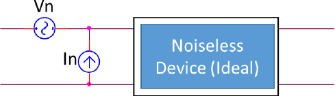
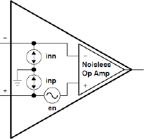
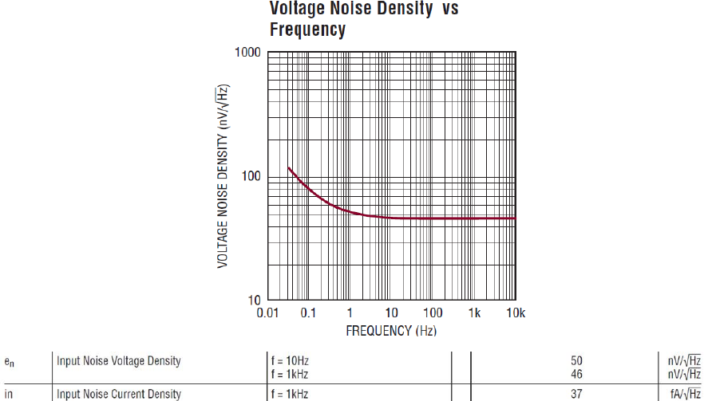

# Modelatge de soroll en dispositius actius

## 📑 Índice de Contenidos

- [1 Model de soroll d'un dispositiu actiu](#1-model-de-soroll-dun-dispositiu-actiu)
  - [Combinació de fonts: suma quadràtica](#combinació-de-fonts-suma-quadràtica)
  - [Quan el datasheet no ho diu tot: hipòtesis i aproximacions](#quan-el-datasheet-no-ho-diu-tot-hipòtesis-i-aproximacions)
- [2 Exemple 1: valor eficaç de soroll d'un operacional](#2-exemple-1-valor-eficaç-de-soroll-dun-operacional)

---

Sistemes de Mesura · **Unitat 4 — Soroll** · Document 5 de 6

# Modelatge de soroll en dispositius actius

Dedicació estimada: 15 minuts

> [!NOTE] **Objectius d'aprenentatge**
>
> - Representar el soroll d'un dispositiu actiu amb el model de quadripol i fonts referides a l'entrada (una de tensió i dues de corrent).
> - Combinar fonts de soroll independents per suma quadràtica.
> - Interpretar les dades de soroll d'un datasheet i separar la component blanca de la 1/f.
> - Calcular el valor eficaç de tensió i corrent de soroll d'un operacional per a diferents amplades de banda (Exemple 1).

## 1 Model de soroll d'un dispositiu actiu

Els dispositius actius —BJT, FET/MOSFET/JFET, amplificadors operacionals i d'instrumentació— són essencials en qualsevol sistema de mesura. A diferència dels passius, que només presenten soroll tèrmic (i, si escau, soroll en excés), els actius generen **simultàniament** diverses fonts internes: soroll tèrmic de resistències internes, soroll shot a totes les unions i soroll 1/f a trampes i interfícies. Modelar-lo bé és fonamental per predir el soroll total, comparar dispositius, identificar la font dominant i establir límits de detecció i SNR.

Un dispositiu actiu es representa de manera genèrica com un **quadripol** (xarxa de dos ports). El dispositiu real té múltiples fonts internes distribuïdes, però per a l'anàlisi externa no cal conèixer-les una a una —ni tan sols cal conèixer cada transistor intern del circuit integrat: n'hi ha prou de caracteritzar-ne l'efecte global vist des dels terminals. El model estàndard consisteix a considerar el dispositiu com un **quadripol ideal sense soroll** i afegir-hi fonts de soroll externes connectades a l'entrada, que representen tot el soroll intern referit a l'entrada.

*Figura: Figura 4.6 Modelització del soroll a dispositius actius genèrics: el bloc és un dispositiu ideal sense soroll, i les fonts de soroll referides a l'entrada en representen tot el soroll intern.*

En el cas d'amplificadors (operacionals o d'instrumentació), el model sol incorporar **una font de tensió de soroll**  $e_n$
 (o  $V_n$
) en sèrie amb un terminal d'entrada —habitualment el no inversor— i **dues fonts de corrent de soroll** que deriven cap a massa, una per terminal.

*Figura: Figura 4.7 Modelització del soroll a amplificadors operacionals: font de tensió $e_n$
en sèrie a l'entrada i dues fonts de corrent $i_{\text{np}}$
, $i_{\text{nn}}$
, una a cada terminal.*

La **font de tensió**  $e_n$
, injectada a l'entrada del dispositiu ideal, produeix a la sortida el mateix efecte de soroll que el dispositiu real. Es caracteritza pel valor eficaç  $v_{n,rms}$
 o, més habitualment, per la densitat espectral  $e_n(f)$
 en **nV/√Hz**. Pot dependre de la freqüència, reflectint soroll blanc (constant) i soroll 1/f (creixent cap a baixes freqüències). Si el guany del dispositiu és  $A_v$
, la contribució a la sortida és  $A_v\cdot e_n$
. Aquesta font engloba soroll tèrmic de resistències internes, soroll shot de corrents interns i soroll 1/f d'interfícies (rellevant en MOSFET) o de la base en BJT.

A més, hi ha **dues fonts de corrent**  $i_{\text{np}}$
 (terminal no inversor) i  $i_{\text{nn}}$
 (terminal inversor), especificades amb una densitat espectral  $i_n(f)$
 en A/√Hz (sovint pA/√Hz o fA/√Hz). Provenen del soroll associat als corrents de polarització d'entrada: en BJT, soroll shot de la corrent de base; en FET/MOSFET, soroll shot i 1/f del corrent de fuita de porta. El model, per tant, *sí* que inclou fonts de corrent a les entrades, i aquestes es relacionen amb els corrents de polarització (no en són independents). Una font de corrent de soroll es converteix en tensió de soroll quan circula per una impedància de font o de retroalimentació; per això, si les impedàncies de font són baixes (pocs ohms) la contribució de les fonts de corrent pot ser negligible davant la de tensió, però amb impedàncies altes pot dominar.

### Combinació de fonts: suma quadràtica

Si tenim diverses fonts de soroll **independents** (no correlacionades), el valor eficaç total es calcula per **suma quadràtica** (pitagòrica) dels valors eficaços:

$$
v_{n,total} = \sqrt{v_{n,1}^2 + v_{n,2}^2 + \dots + v_{n,N}^2} \qquad (4.34)
$$

Això deriva del fet que, per a variables independents de mitjana nul·la, la variància total és la suma de les variàncies. La superposició de fonts de soroll és vàlida en circuits *lineals* de petit senyal: permet estudiar cada font per separat i combinar-ne després les contribucions quadràticament. Els fabricants proporcionen la informació de soroll en forma de gràfiques de  $e_n(f)$
 o  $i_n(f)$
, valors numèrics a freqüències representatives i, ocasionalment, soroll integrat per a una banda concreta —que *no* és aplicable a qualsevol altra banda sense recalcular.

### Quan el datasheet no ho diu tot: hipòtesis i aproximacions

Les dades de catàleg solen ser incompletes: el fabricant pot donar la densitat de tensió  $e_n(f)$
 a un parell de freqüències i la de corrent  $i_n(f)$
 a una de sola, sense indicar com evolucionen amb la freqüència. Per obtenir un valor eficaç cal, doncs, adoptar algunes **hipòtesis explícites**, deixar-les clares i comprovar com afecten el resultat.

Sobre la **densitat espectral de corrent**, quan només se'n coneix un valor a una freqüència prou alta (on el soroll 1/f ja és negligible), es poden considerar dues hipòtesis:

- **Hipòtesi A**: la densitat de corrent és proporcional a la de tensió,  $i_n(f)=k\,e_n(f)$
; totes dues comparteixen la mateixa forma freqüencial (la mateixa proporció de component 1/f).
- **Hipòtesi B**: la densitat de corrent és blanca, igual al valor especificat a totes les freqüències (sense component 1/f,  $K_i=0$
  ).

Per **separar la component blanca de la 1/f** d'una densitat (de tensió o de corrent) en modelem la suma quadràtica,  $e_n(f)=\sqrt{e_{n,white}^2+K_e/f}$
, i n'estimem els dos paràmetres a partir de dades de catàleg. Segons de quins punts disposem, hi ha dues aproximacions:

- **Aproximació 1**: usar dues dades numèriques a freqüències diferents (per exemple, 10 Hz i 1 kHz) i resoldre el sistema per obtenir  $e_{n,white}$
   i  $K_e$
.
- **Aproximació 2**: prendre la component blanca directament del valor a alta freqüència (1 kHz) i estimar  $K_e$
   a partir d'un punt a molt baixa freqüència de la gràfica, on domina el soroll 1/f.

A l'exemple següent es desenvolupa el cas de la **Hipòtesi A amb l'Aproximació 1**, i després es comparen els resultats amb la Hipòtesi B i l'Aproximació 2 (taula 4.1) per veure quan la tria és rellevant i quan no.

## 2 Exemple 1: valor eficaç de soroll d'un operacional

> [!EXAMPLE] **Exemple resolt**
>
> Estimar el valor eficaç de les fonts de tensió i de corrent de soroll d'un amplificador LT6020 per a dues amplades de banda equivalent de soroll: entre 0,1 Hz i 150 kHz, i entre 0,1 Hz i 10 Hz. Del datasheet (figura 4.8):  $e_n(10\ \mathrm{Hz})=50\ \mathrm{nV/\sqrt{Hz}}$
>,  $e_n(1\ \mathrm{kHz})=46\ \mathrm{nV/\sqrt{Hz}}$
> i  $i_n(1\ \mathrm{kHz})=37\ \mathrm{fA/\sqrt{Hz}}$
>.
>
>
>
> *Figura: Figura 4.8 Especificacions de soroll de l'LT6020: densitat espectral de tensió en funció de la freqüència i valors tabulats.*
>
> El fabricant no indica com evoluciona  $i_n$
> amb la freqüència; només en dona un valor a 1 kHz. Se seguirà la **Hipòtesi A** (la densitat de corrent és proporcional a la de tensió) i l'**Aproximació 1** (usar les dades a 10 Hz i 1 kHz per separar les components blanca i 1/f).
>
> 1. Corrent a 10 Hz (Hipòtesi A).
>

$$
i_n(10\ \mathrm{Hz}) = e_n(10\ \mathrm{Hz})\cdot\frac{i_n(1\ \mathrm{kHz})}{e_n(1\ \mathrm{kHz})} = 50\cdot\frac{37}{46} = 40{,}2\ \mathrm{fA/\sqrt{Hz}}
$$

> 2. Model de dues components. A cada freqüència, la densitat és la suma quadràtica de la component blanca (constant) i la 1/f:
>

$$
e_n(f) = \sqrt{e_{n,white}^2 + \frac{K_e}{f}}, \qquad i_n(f) = \sqrt{i_{n,white}^2 + \frac{K_i}{f}}
$$

> 3. Separació de la tensió. De  $(50\ \mathrm{nV})^2=e_{n,white}^2+K_e/10$
> i  $(46\ \mathrm{nV})^2=e_{n,white}^2+K_e/1000$
>, restant s'obté
>

$$
K_e = 3{,}88\times 10^{-15}\ \mathrm{V^2}, \qquad e_{n,white} \approx 46\ \mathrm{nV/\sqrt{Hz}}
$$

> A 1 kHz, doncs, la component dominant és el soroll blanc.
> 4. Valor eficaç de tensió, banda 0,1 Hz–150 kHz.
>

$$
\sigma_{e,white} = e_{n,white}\sqrt{B} \approx 46\ \mathrm{nV}\cdot\sqrt{150\ \mathrm{kHz}} = 17{,}8\ \mu\mathrm{V}
$$

>

$$
\sigma_{e,\frac{1}{f}} = \sqrt{K_e\,\ln\!\left(\frac{150\ \mathrm{kHz}}{0{,}1\ \mathrm{Hz}}\right)} = 0{,}23\ \mu\mathrm{V}
$$

>

$$
\sigma_e = \sqrt{\sigma_{e,white}^2 + \sigma_{e,\frac{1}{f}}^2} \approx 17{,}8\ \mu\mathrm{V}
$$

> 5. Valor eficaç de corrent, mateixa banda. De manera anàloga s'obté  $K_i=2{,}5\times 10^{-27}\ \mathrm{A^2}$
>,  $i_{n,white}\approx 37\ \mathrm{fA/\sqrt{Hz}}$
>, i
>

$$
\sigma_{i,white} = 37\ \mathrm{fA}\cdot\sqrt{150\ \mathrm{kHz}} = 14{,}3\ \mathrm{pA}, \quad \sigma_{i,\frac{1}{f}} = 0{,}2\ \mathrm{pA}, \quad \sigma_i \approx 14{,}3\ \mathrm{pA}
$$

> 6. Banda estreta 0,1 Hz–10 Hz. Repetint els càlculs:
>

$$
\sigma_{e,white} = 46\ \mathrm{nV}\cdot\sqrt{10} = 145\ \mathrm{nV}, \quad \sigma_{e,\frac{1}{f}} = 134\ \mathrm{nV}, \quad \sigma_e = 197\ \mathrm{nV}
$$

>

$$
\sigma_{i,white} = 117\ \mathrm{fA}, \quad \sigma_{i,\frac{1}{f}} = 107\ \mathrm{fA}, \quad \sigma_i = 159\ \mathrm{fA}
$$

> 7. Lectura del resultat. En reduir la banda, el valor eficaç cau (tant de tensió com de corrent) i, alhora, la contribució del soroll 1/f esdevé *comparable* a la del soroll blanc: a banda ampla domina el blanc; a banda estreta i propera a contínua, tots dos hi pesen. La component 1/f, per tant, no es pot ignorar sempre a baixes freqüències.

Si en lloc de la Hipòtesi A s'usa la Hipòtesi B ( $i_n$
 blanc de 37 fA/√Hz, sense component 1/f,  $K_i=0$
), l'única diferència apreciable és el corrent a banda estreta, que baixa a 107 fA. I si s'usa l'Aproximació 2 (estimar la densitat 1/f a partir d'un punt a molt baixa freqüència,  $e_n(0{,}1\ \mathrm{Hz})=80\ \mathrm{nV/\sqrt{Hz}}$
), s'obté un  $K_e$
 força diferent però valors eficaços del mateix ordre. La taula 4.1 resumeix els quatre casos.

| Model de  $i_n$ | $\sigma_e$   (0,1 Hz–150 kHz) | $\sigma_i$   (0,1 Hz–150 kHz) | $\sigma_e$   (0,1 Hz–10 Hz) | $\sigma_i$   (0,1 Hz–10 Hz) |
|:--- |:--- |:--- |:--- |:--- |
| $i_n=k\,e_n$   · 10 Hz+1 kHz | 17,8 μV | 14,3 pA | 197 nV | 159 fA |
| $i_n=37\ \mathrm{fA/\sqrt{Hz}}$   · 10 Hz+1 kHz | 17,8 μV | 14,3 pA | 197 nV | 107 fA |
| $i_n=k\,e_n$   · 0,1 Hz+1 kHz | 17,8 μV | 14,3 pA | 151 nV | 122 fA |
| $i_n=37\ \mathrm{fA/\sqrt{Hz}}$   · 0,1 Hz+1 kHz | 17,8 μV | 14,3 pA | 151 nV | 107 fA |

Per a la banda ampla, qualsevol hipòtesi i aproximació dona el mateix resultat; a baixes freqüències hi ha canvis lleugers deguts a estimacions diferents del soroll 1/f, que —com que prové de defectes i inhomogeneïtats— està sotmès a una alta variabilitat. Aquesta insensibilitat en banda ampla és útil: en la pràctica, per a bandes de mesura amplies n'hi ha prou amb la component blanca del datasheet. Al document 6 aplicarem aquestes idees a un circuit complet amb amplificador inversor.

> [!TIP] **Síntesi**
>
> El soroll d'un amplificador es modela amb fonts referides a l'entrada: una de tensió  $e_n$
> (nV/√Hz) en sèrie i dues de corrent  $i_{\text{np}}, i_{\text{nn}}$
> (pA/fA/√Hz), aquestes lligades als corrents de polarització. Les fonts independents es combinen per suma quadràtica. Del datasheet se separa la component blanca de la 1/f resolent el sistema a dues freqüències. En l'exemple de l'LT6020, a banda ampla (0,1 Hz–150 kHz) domina el soroll blanc ( $\sigma_e\approx 17{,}8\ \mu\mathrm{V}$
>,  $\sigma_i\approx 14{,}3\ \mathrm{pA}$
> ) i el resultat és insensible a les hipòtesis; a banda estreta (0,1 Hz–10 Hz) la component 1/f esdevé comparable a la blanca i el resultat depèn més del model triat.

[← 4. Altres fonts de soroll: shot i 1/f](04_Unitat4_Soroll_shot_i_1f.md)[6. Soroll en amplificadors i disseny de baix soroll →](06_Unitat4_Amplificador_inversor_i_disseny.md)

---

## 📐 Formulario Resumen de Ecuaciones

| Nº / Ref | Expresión Matemática |
| :---: | :--- |
| **(4.34)** | $v_{n,total} = \sqrt{v_{n,1}^2 + v_{n,2}^2 + \dots + v_{n,N}^2}$ |