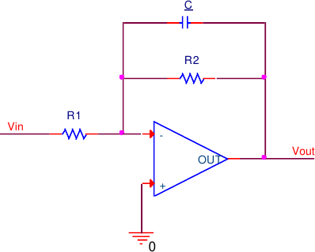
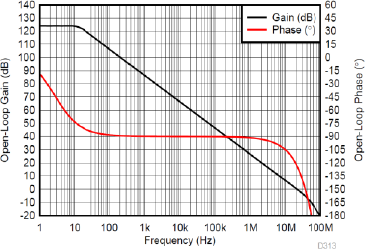
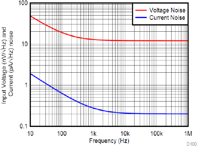

# Soroll en amplificadors i disseny de baix soroll

## 📑 Índice de Contenidos

- [1 Exemple 2: soroll en un amplificador inversor](#1-exemple-2-soroll-en-un-amplificador-inversor)
- [2 Guia de disseny de circuits de baix soroll](#2-guia-de-disseny-de-circuits-de-baix-soroll)
  - [Resistències](#resistències)
  - [Amplada de banda](#amplada-de-banda)
  - [Dispositius actius i arquitectura](#dispositius-actius-i-arquitectura)
  - [Corrents de polarització i temperatura](#corrents-de-polarització-i-temperatura)

---

Sistemes de Mesura · **Unitat 4 — Soroll** · Document 6 de 6

# Soroll en amplificadors i disseny de baix soroll

Dedicació estimada: 14 minuts

> [!NOTE] **Objectius d'aprenentatge**
>
> - Propagar totes les fonts de soroll d'un amplificador inversor cap a la sortida i referir-les a l'entrada.
> - Veure com el producte guany-amplada de banda (GBW) i un condensador de retroalimentació fixen l'amplada de banda i, per tant, el soroll.
> - Identificar la font dominant i el paper del guany de soroll.
> - Sintetitzar una guia de disseny de baix soroll: resistències, amplada de banda, dispositius actius, arquitectura, corrents de polarització i temperatura.

## 1 Exemple 2: soroll en un amplificador inversor

> [!EXAMPLE] **Exemple resolt**
>
> Calcular la tensió eficaç de soroll d'un amplificador inversor amb  $R_1=100\ \Omega$
> i  $R_2=10\ \mathrm{k\Omega}$
> (guany ideal  $-100$
> ), tots els components a 25 °C, referida a la sortida i al terminal no inversor de l'operacional. Es considera primer el cas sense condensador (banda limitada pel GBW) i després amb un condensador  $C=16\ \mathrm{nF}$
> de retroalimentació. Es pren que les resistències només tenen soroll tèrmic. Del datasheet:  $e_{n,white}=12\ \mathrm{nV/\sqrt{Hz}}$
>,  $i_{n,white}=200\ \mathrm{fA/\sqrt{Hz}}$
>,  $e_n(10\ \mathrm{Hz})\approx 50\ \mathrm{nV/\sqrt{Hz}}$
>,  $i_n(10\ \mathrm{Hz})\approx 2\ \mathrm{pA/\sqrt{Hz}}$
>, i GBW amb guany unitari a ~20 MHz.
>
>
>
> *Figura: Figura 4.9 Amplificador inversor. El condensador $C$
> limita l'amplada de banda del circuit.*
>
> 1. Components 1/f del datasheet. Restant quadràticament la part blanca:
>

$$
e_{n,\frac{1}{f}}(10\ \mathrm{Hz}) = \sqrt{50^2-12^2} = 48{,}5\ \mathrm{nV/\sqrt{Hz}} \;\Rightarrow\; e_{n,\frac{1}{f}}(f)=\frac{153\ \mathrm{nV}}{\sqrt{f}}
$$

>

$$
i_{n,\frac{1}{f}}(10\ \mathrm{Hz}) = \sqrt{2^2-0{,}2^2} = 1{,}99\ \mathrm{pA/\sqrt{Hz}} \;\Rightarrow\; i_{n,\frac{1}{f}}(f)=\frac{6{,}3\ \mathrm{pA}}{\sqrt{f}}
$$

> 2. Amplada de banda sense condensador. Amb el pol dominant,  $f_{-3\,\mathrm{dB}}=\mathrm{GBW}/(1+R_2/R_1)$
>. De la corba de guany en llaç obert (figura 4.10), el guany unitari és a ~20 MHz:
>

$$
f_{-3\,\mathrm{dB}} = \frac{20\ \mathrm{MHz}}{101} = 198\ \mathrm{kHz}, \qquad B = \frac{\pi}{2}f_{-3\,\mathrm{dB}} = 311\ \mathrm{kHz}
$$

> Amb el condensador,  $f_{-3\,\mathrm{dB}}=\frac{1}{2\pi R_2 C}=995\ \mathrm{Hz}$
> i  $B=\frac{\pi}{2}\cdot 995=1{,}56\ \mathrm{kHz}$
>.
> 3. Propagació de les cinc fonts a la sortida. Aplicant superposició (cada resistència aporta  $\sqrt{4kTRB}$
>;  $\sigma_{en\,OpAmp}$
> és la tensió de soroll de l'operacional al terminal no inversor;  $\sigma_{inx\,OpAmp}$
> la font de corrent del terminal  $x$
> cap a massa):
>

$$
\sigma_{en\,R1}(V_{\text{out}}) = \sqrt{4kTR_1 B}\cdot\frac{R_2}{R_1}, \qquad \sigma_{en\,R2}(V_{\text{out}}) = \sqrt{4kTR_2 B}
$$

>

$$
\sigma_{en\,OpAmp}(V_{\text{out}}) = \sigma_{en\,OpAmp}\cdot\left(1+\frac{R_2}{R_1}\right), \quad \sigma_{inp\,OpAmp}(V_{\text{out}}) = 0, \quad \sigma_{inn\,OpAmp}(V_{\text{out}}) = \sigma_{inn\,OpAmp}\cdot R_2
$$

> 4. Fonts de l'operacional (sense C, B=311 kHz).
>

$$
\sigma_{en\,OpAmp,\,white} = 12\ \mathrm{nV}\cdot\sqrt{311\ \mathrm{kHz}} = 6{,}69\ \mu\mathrm{V}, \quad \sigma_{en\,OpAmp,\,\frac{1}{f}} = 153\ \mathrm{nV}\sqrt{\ln\frac{311\,\mathrm{kHz}}{0{,}1\,\mathrm{Hz}}} = 0{,}59\ \mu\mathrm{V}
$$

>

$$
\sigma_{en\,OpAmp} = 6{,}72\ \mu\mathrm{V}, \qquad \sigma_{in\,OpAmp} = \sqrt{(111{,}5\ \mathrm{pA})^2+(24{,}4\ \mathrm{pA})^2} = 114{,}1\ \mathrm{pA}
$$

> (Nota: prendre  $f_{\min}=0{,}1\ \mathrm{Hz}$
> en lloc de l'edat de l'univers només canviaria  $\sigma_{en\,\frac{1}{f}}$
> un factor ~2; la tria no és crítica.)
> 5. Resistències (sense C).
>

$$
\sigma_{en\,R1} = \sqrt{4kTR_1 B} = 715\ \mathrm{nV}, \qquad \sigma_{en\,R2} = \sqrt{4kTR_2 B} = 7{,}15\ \mu\mathrm{V}
$$

> 6. Soroll total a la sortida (sense C).
>

$$
\sigma_{n,total}(V_{\text{out}}) = \sqrt{\left(\sigma_{en\,R1}\frac{R_2}{R_1}\right)^2+\sigma_{en\,R2}^2+\left(\sigma_{en\,OpAmp}(1+\frac{R_2}{R_1})\right)^2+(\sigma_{in\,OpAmp}R_2)^2} = 683\ \mu\mathrm{V}
$$

> La font principal és  $\sigma_{en\,OpAmp}$
>, que es propaga multiplicada per 101. El soroll de  $R_2$
>, tot i tenir un valor eficaç similar, hi pesa menys perquè passa directament a la sortida (guany 1). Referit al terminal no inversor:
>

$$
\sigma_{n,total}(V_+) = \frac{\sigma_{n,total}(V_{\text{out}})}{1+R_2/R_1} = 6{,}8\ \mu\mathrm{V} \approx \sigma_{en\,OpAmp}
$$

> 7. Amb el condensador (B=1,56 kHz). Recalculant amb la banda reduïda:  $\sigma_{en\,OpAmp}=671\ \mathrm{nV}$
>,  $\sigma_{in\,OpAmp}=21{,}1\ \mathrm{pA}$
>,  $\sigma_{en\,R1}=50{,}7\ \mathrm{nV}$
>,  $\sigma_{en\,R2}=507\ \mathrm{nV}$
>, i
>

$$
\sigma_{n,total}(V_{\text{out}}) = 68\ \mu\mathrm{V}, \qquad \sigma_{n,total}(V_+) = 680\ \mathrm{nV} \approx \sigma_{en\,OpAmp}
$$

*Figura: Figura 4.10 Guany en llaç obert de l'amplificador operacional; el guany unitari (0 dB) es dona cap als 20 MHz.*

*Figura: Figura 4.11 Densitat espectral de tensió (en vermell) i de corrent (en blau) de l'amplificador operacional.*

Dos resultats clau. Primer: la font de tensió de soroll de l'operacional es propaga cap a la sortida multiplicada pel **guany de soroll**  $1+R_2/R_1$
 (aquí 101), *no* pel valor absolut del guany de senyal inversor  $R_2/R_1$
 (100). Segon: reduir la banda amb el condensador redueix clarament el soroll (de 683 μV a 68 μV a la sortida), tot i que  $\sigma_{en\,OpAmp}$
 continua sent la font dominant. Cal notar que la resistència de retroalimentació  $R_2$
 *sí* que genera soroll tèrmic que contribueix directament a la sortida —no queda «anul·lada» per estar connectada al node de sortida—, i que afegir el condensador *redueix* el soroll blanc integrat perquè *redueix* la banda. Si es volgués rebaixar el soroll sense tocar la banda, caldria un operacional amb una densitat de tensió de soroll més petita.

## 2 Guia de disseny de circuits de baix soroll

L'objectiu del disseny de baix soroll és reduir el valor eficaç de soroll **referit a l'entrada** fins que sigui clarament inferior al senyal mínim que cal mesurar, mantenint consum, cost i prestacions dins dels requeriments. Cal combinar decisions sobre components passius, dispositius actius, arquitectura i condicions de funcionament.

### Resistències

El soroll tèrmic apareix a totes les resistències i a la part real de qualsevol impedància, amb  $S_v=4kTR$
 i valor eficaç  $v_n=\sqrt{4kTRB_{\text{eq}}}$
. Reduir-lo passa per actuar sobre  $R$
 i sobre  $B_{\text{eq}}$
. Reduir  $R$
 disminueix la tensió de soroll ( $v_n\propto\sqrt{R}$
), però amb una alimentació donada, resistències més petites impliquen més corrent i, per tant, més consum i escalfament: **reduir totes les resistències a zero no és una solució pràctica sense inconvenients**. Directrius: en etapes d'entrada d'alta impedància, resistències de pocs kΩ o menys per limitar la tensió de soroll; en transimpedància (fotodíodes), la resistència de retroalimentació  $R_f$
 (que pot ser de molts MΩ) sol ser una contribució principal de soroll tèrmic i cal buscar un compromís entre soroll i sensibilitat.

També importa la **tecnologia**: la pel·lícula metàl·lica té soroll en excés molt baix i s'acosta al límit tèrmic pur, mentre que el carbó o composició en té molt més, amb espectre 1/f, que degrada les mesures lentes.

### Amplada de banda

Com que el soroll blanc integrat creix amb  $\sqrt{B_{\text{eq}}}$
, limitar l'amplada de banda és una de les estratègies més eficients. Ara bé, una banda massa estreta degrada la resposta temporal (constants de temps llargues). Principis: definir la banda útil del senyal (0,1–100 Hz per a biomèdica, 10 Hz–20 kHz per a àudio); dimensionar el passabaixes perquè  $f_{-3\,\mathrm{dB}}$
 sigui només lleugerament superior a la freqüència màxima útil; si el senyal és en una banda estreta lluny de contínua, usar **filtres passabanda** per limitar alhora el soroll 1/f a molt baixa freqüència i el soroll blanc a alta. Ampliar la banda molt per sobre del contingut útil *empitjora* la SNR. Un condensador de retroalimentació o de desacoblament és una manera pràctica d'ajustar la banda.

### Dispositius actius i arquitectura

Un cop optimitzats resistències i banda, el soroll dels dispositius actius sol ser dominant. Un operacional de baix soroll es caracteritza per una densitat de tensió de soroll baixa (pocs nV/√Hz), una densitat de corrent reduïda (crítica amb resistències de font grans) i una freqüència de corner 1/f tan baixa com sigui possible. Tot i així, **l'operacional amb la menor  $e_n$
 no sempre és òptim**: si la impedància de font és molt alta, pot dominar el soroll de corrent, i llavors interessa una  $i_n$
 baixa (entrades FET o CMOS, amb corrents de polarització mínims). Per triar un dispositiu cal considerar simultàniament  $e_n$
,  $i_n$
, la banda útil, la impedància de font i el soroll 1/f.

L'arquitectura de la cadena té un impacte decisiu. El soroll d'una etapa posterior, referit a l'entrada, es divideix pel guany de les etapes anteriors:

$$
e_{n,tot}^2 \approx e_{n1}^2 + \left(\frac{e_{n2}}{G_1}\right)^2 + \dots \qquad (4.35)
$$

Per tant, una **primera etapa d'alt guany i baix soroll** tan a prop del sensor com sigui possible fa que el soroll de les etapes següents (filtres, amplificadors intermedis, convertidor A/D) sigui minoritari. La regla és: «la primera etapa fixa el soroll del sistema». En canvi, si la primera etapa té guany insuficient o soroll elevat, el de les posteriors pot esdevenir dominant. Per això la primera etapa és *crítica*, no pas poc important pel fet que les posteriors tinguin molt de guany.

### Corrents de polarització i temperatura

El soroll shot i el 1/f estan lligats als corrents continus per unions i contactes. Per al shot,  $i_n=\sqrt{2qI_{\text{dc}}B_{\text{eq}}}$
: reduir  $I_{\text{dc}}$
 el redueix amb l'arrel quadrada. Per al 1/f, limitar corrents continus per resistències crítiques (reconfigurant divisors o usant acoblament AC) ajuda. Però reduir massa els corrents té **compromisos**: menys marge dinàmic, resposta més lenta, més distorsió i menys linealitat. No sempre millora totes les prestacions; cal un punt de funcionament òptim, sovint recomanat pel fabricant.

La temperatura intervé directament en el soroll tèrmic ( $4kTRB_{\text{eq}}$
, amb  $v_n\propto\sqrt{T}$
). El **refredament criogènic** (nitrogen o heli líquids) pot reduir-lo, però comporta cost, complexitat mecànica, requisits de buit, condensació i possible degradació d'altres prestacions; per tant, *no* és una solució senzilla, barata ni habitual en equips docents, ni la primera estratègia en sistemes de baix cost, ni redueix el soroll total a zero. Només es justifica en casos extrems (radioastronomia, detectors de partícules, bolòmetres). En sistemes convencionals, és preferible optimitzar resistències, banda, dispositius i arquitectura a temperatura ambient controlada abans de plantejar refrigeració, i reservar-la per quan el soroll tèrmic és clarament el límit dominant i ja s'han esgotat les altres tècniques.

> [!WARNING] **Recordatori**
>
> El soroll extrínsec (interferències) i l'intrínsec no es redueixen sempre amb les mateixes tècniques: apantallament, disposició de cables i masses per al primer; selecció de components, banda i arquitectura per al segon. Reduir un no garanteix reduir l'altre.

> [!TIP] **Síntesi**
>
> En un amplificador inversor, la tensió de soroll de l'operacional es propaga a la sortida amb el guany de soroll  $1+R_2/R_1$
> i sol ser la font dominant;  $R_2$
> aporta soroll tèrmic directe i un condensador de retroalimentació redueix el soroll en reduir la banda. La guia de baix soroll: resistències petites de pel·lícula metàl·lica als camins crítics (sense caure en consums excessius), banda ajustada al senyal útil ( $\propto\sqrt{B_{\text{eq}}}$
>, amb passabanda si cal), dispositius actius triats considerant  $e_n$
>,  $i_n$
>, corner 1/f i impedància de font, primera etapa d'alt guany i baix soroll ( $e_{n,tot}^2\approx e_{n1}^2+(e_{n2}/G_1)^2$
> ), corrents de polarització mínims amb compromís de linealitat, i refredament només en casos extrems. Reduir soroll intrínsec i extrínsec requereix tècniques diferents.

[← 5. Modelatge de soroll en dispositius actius](05_Unitat4_Dispositius_actius.md)

---

## 📐 Formulario Resumen de Ecuaciones

| Nº / Ref | Expresión Matemática |
| :---: | :--- |
| **(4.35)** | $e_{n,tot}^2 \approx e_{n1}^2 + \left(\frac{e_{n2}}{G_1}\right)^2 + \dots$ |