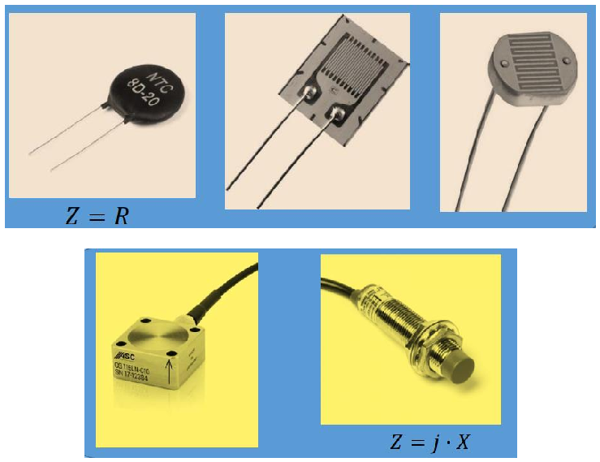

# Sensors moduladors, fonaments físics i model general

## 📑 Índice de Contenidos

- [1 Sensors generadors i moduladors](#1-sensors-generadors-i-moduladors)
- [2 Fonaments físics](#2-fonaments-físics)
  - [Deformació mecànica](#deformació-mecànica)
  - [Dilatació tèrmica](#dilatació-tèrmica)
  - [Origen microscòpic de la resistivitat](#origen-microscòpic-de-la-resistivitat)
- [3 Model general i excitació](#3-model-general-i-excitació)
- [4 Panorama de la unitat](#4-panorama-de-la-unitat)

---

Sistemes de Mesura · **Unitat 5 — Sensors resistius** · Document 1 de 8

# Sensors moduladors, fonaments físics i model general

Dedicació estimada: 7 minuts

> [!NOTE] **Objectius d'aprenentatge**
>
> - Distingir sensors generadors i moduladors, i els resistius dels reactius a partir de  $Z=R+jX$
>.
> - Descompondre una variació de resistència en contribucions de resistivitat, longitud i secció.
> - Explicar, amb  $\sigma=n\,q\,\mu$
>, per què metalls i semiconductors responen de manera oposada a la temperatura.
> - Aplicar el model general  $R(x)=R_0[1+g(x-x_0)]$
> i reconèixer les estratègies d'excitació.

## 1 Sensors generadors i moduladors

- **Generadors**: converteixen energia associada al mesurand en energia elèctrica i no requereixen alimentació externa (termoparells, piezoelèctrics, cèl·lules fotovoltaiques). Unitat 9.
- **Moduladors**: el mesurand no genera cap força electromotriu, sinó que modifica un *paràmetre elèctric passiu* —resistència, capacitat, inductància— que cal excitar per observar-ne la variació.

Els d'aquesta unitat són tots moduladors: **un sensor resistiu no lliura cap senyal per si mateix**; sense excitació, una Pt-100 a 80 °C i una a 0 °C són indistingibles des dels terminals.

$$
Z = R + jX \qquad (5.1)
$$

$$
Z(x) = R(x) + jX(x) \qquad (5.2)
$$

La part imaginària recull capacitats i inductàncies, i en un sensor modulador la impedància depèn del mesurand  $x$
. Segons quina part afecti:

- **Sensors resistius**: afecta sobretot  $R$
; la part imaginària és petita o constant. Es modelen com una resistència variable i sovint n'hi ha prou amb models en contínua i la llei d'Ohm.
- **Sensors reactius**: afecta sobretot  $X$
   —capacitius o inductius. Requereixen excitació alterna i condicionament que tingui en compte el desfasament entre corrent i tensió (unitats 7 i 8).

> [!WARNING] **Matís important**
>
> Que un sensor resistiu admeti model en contínua no vol dir que la seva reactància sigui nul·la: tot dispositiu real té capacitats i inductàncies paràsites. Vol dir que, en les condicions habituals, són negligibles davant de  $R$
>. Quan no ho són —cablejats llargs, freqüències altes, sensors d'humitat excitats en alterna— l'anàlisi en alterna torna a ser necessària.

*Figura: Figura 5.1 Exemples de sensors moduladors. De dalt a baix i d'esquerra a dreta: un termistor (mesura econòmica de temperatura), una galga extensiomètrica (la resistència canvia en estirar-se o comprimir-se), una fotoresistència (la resistència està modulada per la intensitat de fotons incidents dins d'una banda de longituds d'ona), un acceleròmetre capacitiu per a mesura de vibracions i un sensor inductiu de distància sense contacte. Els tres primers són resistius; els dos darrers, reactius.*

## 2 Fonaments físics

$$
R = \rho\,\frac{l}{A} \qquad (5.3)
$$

$$
\frac{\Delta R}{R} \approx \frac{\Delta \rho}{\rho} + \frac{\Delta l}{l} - \frac{\Delta A}{A} \qquad (5.4)
$$

La resistència creix amb la resistivitat  $\rho$
 (en  $\Omega\cdot\mathrm{m}$
) i amb la longitud, i decreix amb la secció: el mesurand pot actuar sobre la **geometria** o sobre la **resistivitat**, i els tres termes de (5.4) poden coexistir.

### Deformació mecànica

Sota una tensió mecànica  $\sigma = F/A$
 apareix una **deformació unitària**  $\varepsilon = \Delta l/l_0$
, lligada a la tensió en zona elàstica per la llei de Hooke:

$$
\sigma = E\,\varepsilon \qquad (5.5)
$$

$\sigma$
 s'expressa en pascals i  $\varepsilon$
 és **adimensional**. En estirar-se, la secció disminueix per **efecte de Poisson**:

$$
\frac{\Delta A}{A} \approx -2\nu\varepsilon \qquad (5.6)
$$

$$
\frac{\Delta R}{R} \approx (1+2\nu)\,\varepsilon \qquad (5.7)
$$

Amb  $\nu \approx 0{,}3$
 el factor geomètric val uns 1,6: en allargar-se la peça, la resistència de la galga augmenta. Als sensors piezoresistius reals s'hi suma una contribució de resistivitat, i el conjunt es recull en el *factor de galga* (document 6).

### Dilatació tèrmica

$$
\frac{\Delta l}{l_0} = \alpha\,\Delta T \qquad (5.8)
$$

$$
\frac{\Delta R}{R} \approx \alpha\Delta T - 2\alpha\Delta T = -\alpha\,\Delta T \qquad (5.9)
$$

Si l'expansió és isòtropa la secció creix uns  $2\alpha\Delta T$
, de manera que amb  $\rho$
 constant la resistència *disminuiria* lleugerament en escalfar-se. L'efecte és molt petit i queda dominat pel canvi de resistivitat, de signe contrari i molt més gran: **en un RTD el mecanisme dominant és la resistivitat, no la geometria**.

### Origen microscòpic de la resistivitat

$$
\sigma = n\,q\,\mu \qquad (5.10)
$$

Amb  $\rho = 1/\sigma$
 i  $n$
 densitat de portadors,  $q$
 càrrega elemental i  $\mu$
 mobilitat, el mesurand pot canviar *quants* portadors hi ha o *com de fàcilment* es mouen.

**En un metall** la densitat d'electrons lliures és molt elevada i pràcticament constant; el que canvia és la mobilitat: en pujar la temperatura la xarxa vibra més, els electrons es dispersen més i  $\rho$
 augmenta. En resulta un **coeficient positiu**, quasi lineal en marges moderats:

$$
R(T) \approx R_0\left[1+\alpha\,(T-T_0)\right] \qquad (5.11)
$$

És el principi dels RTD de platí. La resistivitat d'un metall també canvia amb la deformació i amb camps magnètics en materials anisòtrops.

**En un semiconductor**,  $n$
 i  $\mu$
 varien molt amb la temperatura, la llum o altres estímuls: en escalfar-se, més electrons salten a la banda de conducció i  $n$
 creix marcadament. Això explica els **termistors NTC** (coeficient negatiu), les **fotoresistències** (la llum promou electrons i la resistència pot baixar diversos ordres de magnitud), les **magnetoresistències** (el camp modifica la magnetització i la dispersió) i els **higròmetres resistius** (l'aigua absorbida crea camins iònics). En tots, el mesurand actua sobretot sobre  $n$
 i dona variacions grans i marcadament **no lineals**: els mecanismes més sensibles solen ser els menys lineals.

## 3 Model general i excitació

$$
R(x) = R_0\left[1+g(x-x_0)\right] \qquad (5.12)
$$

amb  $R_0$
 la resistència per a un valor de referència  $x_0$
 i  $g(0)=0$
. **La funció  $g$
 no ha de ser necessàriament lineal**: pot ser una recta, un polinomi (RTD d'alta exactitud), una exponencial (NTC) o una llei de potència (LDR). Els fabricants especifiquen la **resistència nominal** i el **punt de referència** —que no és universal: una Pt-100 s'especifica a 0 °C i un NTC, a 25 °C—, la **funció de resposta** amb coeficients i toleràncies, i el **marge de mesura**, fora del qual el model deixa de descriure el sensor i pot haver-hi dany permanent. La **inversa**  $x = f^{-1}(R)$
 converteix la resistència llegida en el valor de la magnitud física.

> [!WARNING] **Escollir el model: un criteri de sistema**
>
> Un model més complex no millora automàticament la mesura. Si la incertesa del condicionament, el convertidor i el calibratge és molt més gran que l'error de linealització, passar d'un model lineal a un de polinòmic només afegeix càlcul. El criteri és la coherència amb l'exactitud del *sistema complet* (unitat 2), i el mateix val per a la classe d'exactitud del sensor.

Les estratègies d'excitació (unitat 6) es fonamenten en la llei d'Ohm: amb **corrent constant**,  $V = I\,R(x)$
, la tensió és proporcional a la resistència; amb **tensió constant**,  $I = V/R(x)$
, el corrent és *inversament* proporcional; i el **divisor de tensió** és la base del **pont de Wheatstone**, que s'utilitza amb galgues, RTD i magnetoresistències. Les tres determinen la sensibilitat, la linealitat i la **potència dissipada dins del sensor** (document 3).

## 4 Panorama de la unitat

Les famílies es diferencien pel **mecanisme físic** que fa variar la resistència, i cadascuna té la seva pròpia llei  $R(x)$
.

| Família | Mesurand | Mecanisme dominant | Forma de  $R(x)$ | Doc. |
|:--- |:--- |:--- |:--- |:--- |
| RTD (Pt-100, Pt-1000) | Temperatura | Mobilitat en un metall | Polinòmica, quasi lineal | 2 i 3 |
| Termistors NTC | Temperatura | Densitat de portadors en un semiconductor | Exponencial | 4 i 5 |
| Termistors PTC | Temperatura | Transició de fase ceràmica o silici dopat | Abrupta o suau segons el tipus | 5 |
| Galgues i piezoresistències | Deformació, força, pressió, acceleració | Geometria i piezoresistivitat | Lineal en zona elàstica | 6 |
| Magnetoresistències (AMR, GMR, TMR) | Camp magnètic, posició, corrent | Dispersió dependent de la magnetització i de l'espín | No lineal, amb saturació | 7 |
| Fotoresistències (LDR) | Il·luminació | Fotogeneració de portadors | Llei de potència empírica | 8 |
| Higròmetres resistius | Humitat relativa | Conducció iònica en material higroscòpic | Fortament no lineal | 8 |

Un avís que val per a totes: **la temperatura és una magnitud d'influència gairebé universal**. Una galga, una magnetoresistència, una LDR o un higròmetre canvien de resistència amb la temperatura encara que no sigui el mesurand, i distingir les dues contribucions —amb configuracions diferencials, sensors auxiliars o calibratge— és un problema recurrent al llarg de la unitat.

> [!TIP] **Síntesi**
>
> Els sensors resistius són *moduladors*: necessiten excitació externa perquè el mesurand modifica un paràmetre passiu. Dins de  $Z=R+jX$
> n'afecten sobretot la part real. La resistència  $R=\rho l/A$
> varia per geometria, per resistivitat o per tots dos efectes;  $\sigma=nq\mu$
> explica el coeficient positiu i quasi lineal dels metalls i les variacions grans i no lineals dels semiconductors. El model  $R(x)=R_0[1+g(x-x_0)]$
>, amb  $g$
> no necessàriament lineal, es completa amb resistència nominal, punt de referència, funció de resposta i marge.

[2. Detectors de temperatura resistius (RTD) →](02_Unitat5_RTD.md)

---

## 📐 Formulario Resumen de Ecuaciones

| Nº / Ref | Expresión Matemática |
| :---: | :--- |
| **(5.1)** | $Z = R + jX$ |
| **(5.2)** | $Z(x) = R(x) + jX(x)$ |
| **(5.3)** | $R = \rho\,\frac{l}{A}$ |
| **(5.4)** | $\frac{\Delta R}{R} \approx \frac{\Delta \rho}{\rho} + \frac{\Delta l}{l} - \frac{\Delta A}{A}$ |
| **(5.5)** | $\sigma = E\,\varepsilon$ |
| **(5.6)** | $\frac{\Delta A}{A} \approx -2\nu\varepsilon$ |
| **(5.7)** | $\frac{\Delta R}{R} \approx (1+2\nu)\,\varepsilon$ |
| **(5.8)** | $\frac{\Delta l}{l_0} = \alpha\,\Delta T$ |
| **(5.9)** | $\frac{\Delta R}{R} \approx \alpha\Delta T - 2\alpha\Delta T = -\alpha\,\Delta T$ |
| **(5.10)** | $\sigma = n\,q\,\mu$ |
| **(5.11)** | $R(T) \approx R_0\left[1+\alpha\,(T-T_0)\right]$ |
| **(5.12)** | $R(x) = R_0\left[1+g(x-x_0)\right]$ |