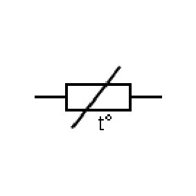
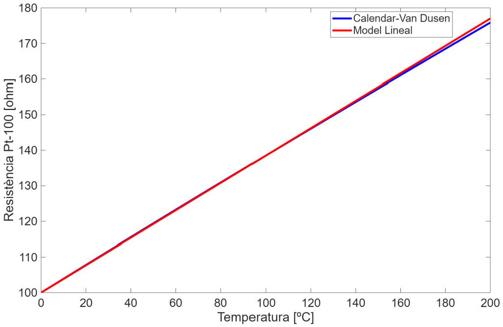
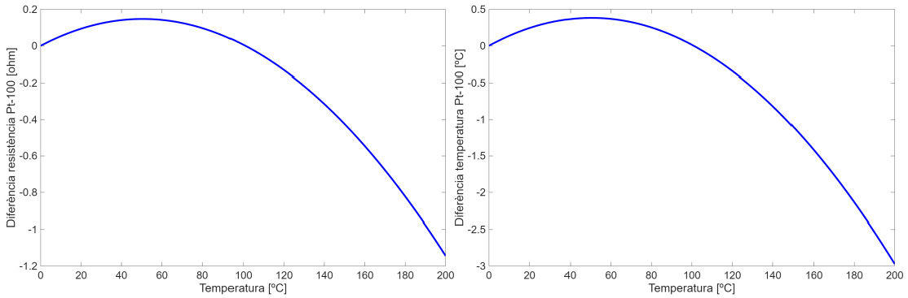
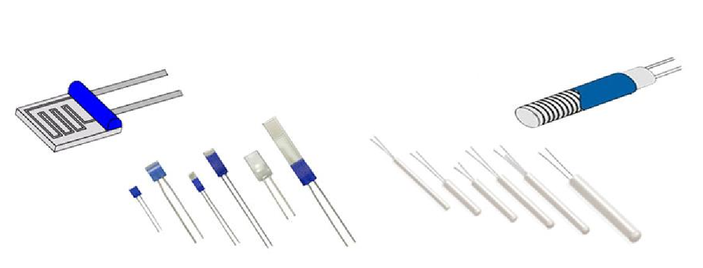

# Detectors de temperatura resistius (RTD)

## 📑 Índice de Contenidos

- [1 Principi de funcionament](#1-principi-de-funcionament)
- [2 Model resistència-temperatura](#2-model-resistència-temperatura)
  - [Model lineal i error de linealització](#model-lineal-i-error-de-linealització)
- [3 Valors nominals, marge i intercanviabilitat](#3-valors-nominals-marge-i-intercanviabilitat)
- [4 Construcció i aplicacions](#4-construcció-i-aplicacions)

---

Sistemes de Mesura · **Unitat 5 — Sensors resistius** · Document 2 de 8

# Detectors de temperatura resistius (RTD)

Dedicació estimada: 8 minuts

> [!NOTE] **Objectius d'aprenentatge**
>
> - Explicar per què la resistència d'un metall augmenta amb la temperatura i per què el terme geomètric és negligible.
> - Aplicar el model de Callendar-Van Dusen i quantificar l'error de l'aproximació lineal.
> - Relacionar resistència nominal, sensibilitat absoluta i sensibilitat relativa en Pt-100, Pt-500 i Pt-1000.
> - Interpretar les classes d'exactitud de la IEC 60751, la intercanviabilitat i les dues construccions típiques.

Un **RTD** (*Resistive Temperature Detector*) és un sensor de temperatura basat en el canvi de resistivitat d'un conductor metàl·lic, habitualment platí. La **IEC 60751** en fixa models, coeficients i classes d'exactitud.

## 1 Principi de funcionament

En un metall, en pujar la temperatura els ions de la xarxa vibren més, els electrons pateixen més col·lisions amb aquestes vibracions (fonons), cau la mobilitat i **augmenta la resistivitat**. El canvi dominant és el de  $\rho$
: els geomètrics per dilatació són molt menors i de signe contrari (equació 5.9). En un RTD el mecanisme dominant no és, doncs, ni la dilatació ni la generació de portadors, que és el que passa en un semiconductor i dona el comportament contrari dels NTC.

$$
R(T) = f(T) \qquad (5.13)
$$

és una funció suau i quasi lineal en marges moderats. Com tot sensor modulador, cal excitar-lo per llegir-lo.

*Figura: Figura 5.2 Símbol d'un RTD. Al símbol d'una resistència s'hi superposa una línia recta diagonal creixent d'esquerra a dreta, que indica que l'increment de resistència amb la temperatura és raonablement lineal i amb coeficient positiu. La marca $t^{o}$
indica que el sensor canvia amb la temperatura.*

El **platí** és el material de referència: alta estabilitat química i mecànica, puresa molt elevada, coeficient constant i ben definit i marge ampli (uns −200 a 800 °C). El **coure** és barat, lineal, però de marge reduït i sensible a l'oxidació; el **níquel**, barat i de coeficient elevat però amb pitjor linealitat. Cap dels dos supera el platí en estabilitat o exactitud metrològica: l'avantatge decisiu del platí és la puresa assolible, que fa que sensors del mateix model tinguin coeficients molt similars i permet models normalitzats.

## 2 Model resistència-temperatura

$$
R(T) = R_0\left[1+\alpha_1\Delta T+\alpha_2(\Delta T)^2+\cdots+\alpha_n(\Delta T)^n\right] \qquad (5.14)
$$

amb  $\Delta T = T-T_0$
 i  $T_0$
 habitualment 0 °C; els coeficients es determinen per calibratge amb ajust per mínims quadrats. A la pràctica s'usen models compactes: Callendar-Van Dusen i la seva aproximació lineal.

La **Pt-100** té  $R_0 = 100\ \Omega$
 **a 0 °C** —no a 25 °C, que és el punt de referència habitual dels termistors—, prou baix per limitar la potència dissipada i prou alt per donar caigudes de tensió mesurables amb corrents modestos. El model normalitzat és, per a  $T \geq 0$
 °C,

$$
R(T) = R_0\left[1+A\,T+B\,T^2\right] \qquad (5.15)
$$

i per a  $T < 0$
 °C,

$$
R(T) = R_0\left[1+A\,T+B\,T^2+C\,(T-100)\,T^3\right] \qquad (5.16)
$$

amb  $T$
 en graus Celsius.

| Coeficient | Valor | Aplicabilitat |
|:--- |:--- |:--- |
| $R_0$ | 100 Ω a 0 °C | Tot el marge |
| $A$ | $3{,}9083\times10^{-3}\ ^\circ\mathrm{C}^{-1}$ | Tot el marge |
| $B$ | $-5{,}775\times10^{-7}\ ^\circ\mathrm{C}^{-2}$ | Tot el marge |
| $C$ | $-4{,}183\times10^{-12}\ ^\circ\mathrm{C}^{-4}$ | Només per a  $T<0$   °C |

El terme **quadràtic hi és sempre** — $B$
 és petit i negatiu, i és el que corba la característica per sota de la recta— i el **cúbic amb  $C$
 només s'aplica per sota de 0 °C**: per a temperatures positives, Callendar-Van Dusen és un polinomi de segon grau.

### Model lineal i error de linealització

$$
R(T) \approx R_0\left(1+\alpha\,T\right) \qquad (5.17)
$$

amb  $\alpha \approx 0{,}00385\ ^\circ\mathrm{C}^{-1}$
: la resistència augmenta un 0,385 % per kelvin, és a dir 100 Ω a 0 °C i uns 138,5 Ω a 100 °C, amb una sensibilitat de **0,385 Ω/°C**.

*Figura: Figura 5.3 Comparació entre el model de Callendar-Van Dusen i el model lineal per a una Pt-100 entre 0 °C i 200 °C. A temperatures elevades, Callendar-Van Dusen prediu resistències inferiors a les del model lineal.*

*Figura: Figura 5.4 Diferència en resistència i en temperatura entre el model de Callendar-Van Dusen i el model lineal. L'error referit a l'entrada, en graus, s'obté dividint la diferència de resistència per la sensibilitat del sensor, aproximadament $R_0\alpha$
.*

Entre 0 i 100 °C l'error és **positiu**, **nul a 0 i a 100 °C** —on les corbes es creuen— i màxim cap a la meitat del marge, amb **0,382 °C**; per sobre de 100 °C canvia de signe i creix fins a prop de 3 °C a 200 °C. El model lineal serveix, doncs, en marges estrets amb errors admissibles de 0,3-0,5 °C; el quadràtic els redueix a dècimes de grau entre −50 i 250 °C; i per a metrologia exigent o temperatures negatives cal la forma completa amb  $C$
. La tria és un criteri de sistema: si l'A/D introdueix una incertesa equivalent a 0,1 °C, un model amb incertesa teòrica de 0,01 °C no millora el resultat.

## 3 Valors nominals, marge i intercanviabilitat

Existeixen també la **Pt-500** i la **Pt-1000** (500 i 1000 Ω a 0 °C). Totes comparteixen el mateix *coeficient de temperatura relatiu*, perquè el material és el mateix; el que escala amb  $R_0$
 és la *sensibilitat absoluta*: una Pt-1000 té uns 3,85 Ω/°C, deu vegades la de la Pt-100, amb el mateix 0,385 %/K. Les nominals altes convenen quan la **resistència dels cables** podria falsejar la mesura —tant més important com més baixa és la nominal, i rellevant en una Pt-100 amb cables llargs— i quan es volen corrents molt baixos. La compensació del cablejat (tres i quatre fils) pertany a la unitat 6.

El **marge** en platí va de −200 a 800 °C en sensors de laboratori i fins a uns 300 °C en molts RTD industrials; els de coure i níquel, de −50 a 150-300 °C. Enfront dels **termoparells**, els RTD tenen més sensibilitat (0,385 Ω/°C davant de poques desenes de µV/°C) i millor linealitat; enfront dels **termistors NTC**, coeficients molt repetibles però *sensibilitat relativa menor* i preu superior: no es trien per tenir resposta abrupta —això ho ofereix una NTC— sinó per la seva previsibilitat. L'error global combina classe d'exactitud, error de model, condicionament, autoescalfament i convertidor.

La IEC 60751 especifica  $R_0$
, els coeficients de referència, diverses **classes d'exactitud** (A, B, etc.) amb els seus límits d'error i els tipus de construcció mínims: formalitza i acota les toleràncies en lloc d'eliminar-les. La conseqüència és la **intercanviabilitat** —dos Pt-100 de la mateixa classe se substitueixen sense recalibrar completament el sistema—, que depèn de la classe d'exactitud i de la proximitat del sensor real a la corba normalitzada. Contrasta amb molts NTC i amb les LDR, on els paràmetres varien significativament entre dispositius i sovint cal calibratge individual.

## 4 Construcció i aplicacions

*Figura: Figura 5.5 RTD de pel·lícula metàl·lica (esquerra) i de fil enrotllat (dreta).*

En un **RTD de pel·lícula metàl·lica** (*thin film*) el platí es diposita en capa fina sobre un substrat ceràmic, amb la pista en serpentina encapsulada amb vidre o resina: dimensions reduïdes, integrable sobre superfícies fins i tot conductores, **resposta ràpida** per la poca massa tèrmica —constants de l'ordre d'1 s— i cost moderat. En un **RTD de fil enrotllat** (*wire-wound*) un fil de platí molt fi s'enrotlla sobre un suport ceràmic recobert de massa ceràmica o acer inoxidable: **més lent**, amb constants de diversos segons, molt **robust** i més car.

> [!WARNING] **Quin dels dos és més ràpid**
>
> El que determina la constant de temps no és el gruix del fil sinó la *massa tèrmica del conjunt* —fil, suport i encapsulat— i la qualitat del contacte tèrmic amb el medi. Per això, amb muntatges comparables, el de pel·lícula metàl·lica sol ser el més ràpid; però un sensor de pel·lícula dins d'una beina industrial gruixuda pot respondre més lentament que un fil enrotllat nu.

En processos químics, alimentaris o farmacèutics —reactors, tancs, canonades i forns, amb marges de −50 a 250 °C i exactituds de dècimes de grau— la solució típica és un fil enrotllat en vareta d'acer inoxidable amb rosca normalitzada. En laboratoris, cambres climàtiques i climatització destaquen els de pel·lícula metàl·lica per rapidesa i facilitat d'integració; la seva estabilitat a llarg termini permet distribuir-ne diversos per controlar la uniformitat de temperatura.

> [!TIP] **Síntesi**
>
> Un RTD mesura temperatura per l'augment de resistivitat d'un metall, degut a la caiguda de mobilitat; la dilatació és negligible i de signe contrari. La Pt-100 té 100 Ω a 0 °C i 0,385 Ω/°C; les Pt-500 i Pt-1000 escalen la sensibilitat absoluta amb el mateix coeficient relatiu de 0,385 %/K. Callendar-Van Dusen és quadràtic per a  $T\geq 0$
> °C i afegeix un terme cúbic només per sota de 0 °C; el model lineal dona un error màxim de 0,382 °C entre 0 i 100 °C i uns 3 °C a 200 °C. Les classes de la IEC 60751 sustenten una intercanviabilitat superior a la de termistors i LDR. La pel·lícula metàl·lica és ràpida i econòmica; el fil enrotllat, lent i robust.

[← 1. Sensors moduladors, fonaments físics i model general](01_Unitat5_Sensors_moduladors_i_model_general.md)[3. Autoescalfament, excitació i resposta dinàmica →](03_Unitat5_Autoescalfament_i_resposta_dinamica.md)

---

## 📐 Formulario Resumen de Ecuaciones

| Nº / Ref | Expresión Matemática |
| :---: | :--- |
| **(5.13)** | $R(T) = f(T)$ |
| **(5.14)** | $R(T) = R_0\left[1+\alpha_1\Delta T+\alpha_2(\Delta T)^2+\cdots+\alpha_n(\Delta T)^n\right]$ |
| **(5.15)** | $R(T) = R_0\left[1+A\,T+B\,T^2\right]$ |
| **(5.16)** | $R(T) = R_0\left[1+A\,T+B\,T^2+C\,(T-100)\,T^3\right]$ |
| **(5.17)** | $R(T) \approx R_0\left(1+\alpha\,T\right)$ |