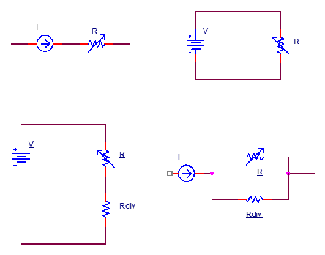

# Autoescalfament, excitació i resposta dinàmica

## 📑 Índice de Contenidos

- [1 Coeficient de dissipació tèrmica](#1-coeficient-de-dissipació-tèrmica)
- [2 Potència dissipada segons l'excitació](#2-potència-dissipada-segons-lexcitació)
- [3 Com limitar-lo](#3-com-limitar-lo)
- [4 Resposta dinàmica](#4-resposta-dinàmica)

---

Sistemes de Mesura · **Unitat 5 — Sensors resistius** · Document 3 de 8

# Autoescalfament, excitació i resposta dinàmica

Dedicació estimada: 8 minuts

> [!NOTE] **Objectius d'aprenentatge**
>
> - Explicar per què un sensor resistiu s'escalfa a si mateix i quin tipus d'error introdueix.
> - Utilitzar el coeficient de dissipació tèrmica  $\delta$
> per estimar l'increment de temperatura.
> - Calcular la potència dissipada en les quatre estratègies d'excitació i localitzar-ne el màxim.
> - Modelar la resposta tèrmica com un sistema de primer ordre.

Per mesurar la resistència d'un sensor cal fer-hi passar corrent, de manera que s'hi dissipa potència i s'escalfa per sobre del medi. És l'**autoescalfament**, un **error sistemàtic** i no soroll aleatori: sempre té el mateix signe i no es cancel·la promitjant lectures. Es descriu aquí amb RTD, però afecta igualment els termistors i qualsevol sensor resistiu alimentat elèctricament.

## 1 Coeficient de dissipació tèrmica

$$
T_{\text{sensor}} = T_{\text{ambient}} + \frac{P_{\text{sensor}}}{\delta} \qquad (5.18)
$$

El **coeficient de dissipació tèrmica**  $\delta$
, en mW/K, indica quanta potència cal dissipar perquè el sensor pugi 1 K per sobre del medi. Les unitats són de potència dividida per temperatura, i el valor depèn sobretot del sensor, del seu encapsulat i del medi, no només del circuit; el fabricant pot donar-ne la inversa, la resistència tèrmica  $R_\theta = 1/\delta$
 en K/mW.

La dependència del medi té un ordre clar: **en buit** la dissipació és només per radiació i és el cas més desfavorable; **en aire quiet** la convecció és limitada i l'autoescalfament important; **en líquids** la transferència és molt millor i l'autoescalfament menor. **Com millor és la transferència tèrmica, menys autoescalfament**: si el sistema es dimensiona per a aire quiet, en immersió l'error serà encara menor.

## 2 Potència dissipada segons l'excitació

*Figura: Figura 5.6 Estratègies d'excitació de sensors resistius. A dalt a l'esquerra, corrent constant; a dalt a la dreta, tensió constant; a baix a l'esquerra, divisor de tensió amb resistència fixa; a baix a la dreta, divisor de corrent.*

$$
P_{\text{sensor}} = I^2 R \qquad (5.19)
$$

$$
P_{\text{sensor}} = \frac{V^2}{R} \qquad (5.20)
$$

Amb **corrent constant** (5.19) la potència és proporcional al **quadrat del corrent** i a la *primera* potència de la resistència —duplicar el corrent la multiplica per quatre—, de manera que en un RTD el pitjor cas és a la temperatura més alta del marge. Amb **tensió constant** (5.20) és **inversament** proporcional a la resistència i, per tant, màxima al valor *mínim* de  $R$
: en un RTD, a la temperatura més baixa. Les dues estratègies situen el pitjor cas en extrems oposats del rang.

Amb **divisor de tensió**, el sensor en sèrie amb una resistència fixa i alimentació  $V$
:

$$
V_R = V\,\frac{R}{R+R_{\text{div}}} \qquad (5.21)
$$

$$
P_{\text{sensor}} = \frac{V^2 R}{(R+R_{\text{div}})^2} \qquad (5.22)
$$

Aquesta expressió no és monòtona: s'anul·la tant per a  $R\to 0$
 com per a  $R\to\infty$
 i té un màxim entremig. Derivant respecte de  $R$
 i imposant la condició de màxim,

$$
R = R_{\text{div}} \qquad (5.23)
$$

L'error màxim es dona, per tant, a la temperatura on la resistència del sensor **iguala la resistència fixa del divisor**: és  $R_{\text{div}}$
 qui fixa on cau el pitjor cas. Si dins del marge no hi ha cap temperatura amb  $R=R_{\text{div}}$
, el màxim cau a l'extrem més proper: en una Pt-100 amb  $R_{\text{div}}=100\ \Omega$
 i rang 0-100 °C, a 0 °C; amb  $R_{\text{div}}=200\ \Omega$
, a 100 °C, perquè els 138,5 Ω són més propers a 200 Ω.

Amb **divisor de corrent**, el sensor en paral·lel amb  $R_{\text{div}}$
 i excitació de corrent constant,

$$
P_{\text{sensor}} = I^2\,\frac{R_{\text{div}}^2\,R}{(R+R_{\text{div}})^2} \qquad (5.24)
$$

que derivant dona la mateixa condició  $R=R_{\text{div}}$
: els dos divisors comparteixen el criteri.

> [!EXAMPLE] **Exemple resolt: autoescalfament d'una Pt-100**
>
> Una Pt-100 en aire quiet, amb  $\delta = 5\ \mathrm{mW/K}$
>, s'alimenta amb un corrent constant d'1 mA. Quin error per autoescalfament s'introdueix a 0 °C? I amb 5 mA?
>
> 1. Potència amb 1 mA. A 0 °C,  $R = R_0 = 100\ \Omega$
>, i per (5.19)  $P = I^2R = 100\ \mu\mathrm{W} = 0{,}1\ \mathrm{mW}$
>.
> 2. Increment de temperatura. Per (5.18),  $\Delta T = P/\delta = 0{,}1/5 = 0{,}02\ \mathrm{K}$
>: negligible en la major part d'aplicacions.
> 3. Amb 5 mA. Com que  $P\propto I^2$
>, la potència es multiplica per 25:  $P = 2{,}5\ \mathrm{mW}$
> i  $\Delta T = 0{,}5\ \mathrm{K}$
>, ja gens negligible si es busquen dècimes de grau.

## 3 Com limitar-lo

- **Reduir el corrent de mesura**: l'impacte és quadràtic, de manera que dividir-lo per dos redueix l'autoescalfament a la quarta part. El límit el posa el soroll.
- **Excitació polsada**: fer circular corrent només durant el temps mínim de lectura *redueix* l'escalfament mitjà respecte d'una excitació contínua equivalent, sempre que el pols sigui curt comparat amb la dinàmica tèrmica; si és llarg, el sensor arriba igualment a l'equilibri.
- **Millorar la dissipació**, amb un encapsulat de  $\delta$
   més gran: contacte directe amb líquids o amb metalls d'alta conductivitat tèrmica.
- **Dissenyar el condicionament** perquè el màxim de potència caigui fora del marge de mesura o en una zona menys sensible a l'error.

Cal avaluar sempre  $P_{\text{sensor}}/\delta$
 en les condicions més desfavorables: la comprovació és barata i evita errors sistemàtics difícils de diagnosticar, perquè no es manifesten com a soroll sinó com una desviació estable.

## 4 Resposta dinàmica

$$
\tau\,\frac{dT_{\text{sensor}}}{dt} + T_{\text{sensor}} = T_{\text{medi}} \qquad (5.25)
$$

La resposta temporal la governen la capacitat tèrmica del sensor i la resistència tèrmica cap al medi, i s'aproxima per un **sistema de primer ordre**: davant d'un salt, el sensor s'hi acosta exponencialment amb la **constant de temps tèrmica**  $\tau$
. No és instantània encara que la resistència elèctrica canviï sense retard: el retard l'introdueix la transferència de calor. Amb encapsulats de diverses capes s'assembla més a un segon ordre sobresmorteït.

$\tau$
 **no és una propietat del material resistiu**: depèn de l'encapsulat, del muntatge i de la transferència de calor amb el medi. És gran en aire quiet, menor amb flux d'aire, molt menor en líquids i curta si el sensor està adherit a un metall. Els RTD de pel·lícula poden estar per sota d'1 s i els de fil enrotllat encapsulats, en diversos segons en aire. Sovint —però no sempre— el procés evoluciona molt més lentament que el sensor i la limitació hi és; en canvis ràpids en fluids, en canvi, la dinàmica del sensor pot ser el factor limitant. El pols d'excitació ha de ser prou llarg perquè la lectura estabilitzi i prou curt perquè el sensor no s'escalfi.

> [!TIP] **Síntesi**
>
> L'autoescalfament és un error sistemàtic de signe conegut que afecta tots els sensors resistius. El coeficient  $\delta$
> relaciona potència i increment de temperatura,  $T_{\text{sensor}}=T_{\text{ambient}}+P/\delta$
>, i depèn de l'encapsulat i del medi: pitjor en buit, dolent en aire quiet, millor en líquids. La potència val  $I^2R$
> amb corrent constant (màxima a  $R$
> màxima) i  $V^2/R$
> amb tensió constant (màxima a  $R$
> mínima); en tots dos divisors és màxima quan  $R=R_{\text{div}}$
>. Es controla reduint el corrent, excitant per polsos curts i millorant la dissipació. Dinàmicament és un sistema de primer ordre amb una constant de temps que depèn del muntatge i del medi.

[← 2. Detectors de temperatura resistius (RTD)](02_Unitat5_RTD.md)[4. Termistors NTC: models i linealització →](04_Unitat5_Termistors_NTC.md)

---

## 📐 Formulario Resumen de Ecuaciones

| Nº / Ref | Expresión Matemática |
| :---: | :--- |
| **(5.18)** | $T_{\text{sensor}} = T_{\text{ambient}} + \frac{P_{\text{sensor}}}{\delta}$ |
| **(5.19)** | $P_{\text{sensor}} = I^2 R$ |
| **(5.20)** | $P_{\text{sensor}} = \frac{V^2}{R}$ |
| **(5.21)** | $V_R = V\,\frac{R}{R+R_{\text{div}}}$ |
| **(5.22)** | $P_{\text{sensor}} = \frac{V^2 R}{(R+R_{\text{div}})^2}$ |
| **(5.23)** | $R = R_{\text{div}}$ |
| **(5.24)** | $P_{\text{sensor}} = I^2\,\frac{R_{\text{div}}^2\,R}{(R+R_{\text{div}})^2}$ |
| **(5.25)** | $\tau\,\frac{dT_{\text{sensor}}}{dt} + T_{\text{sensor}} = T_{\text{medi}}$ |