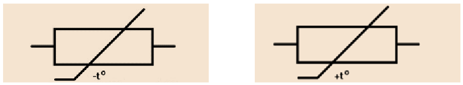
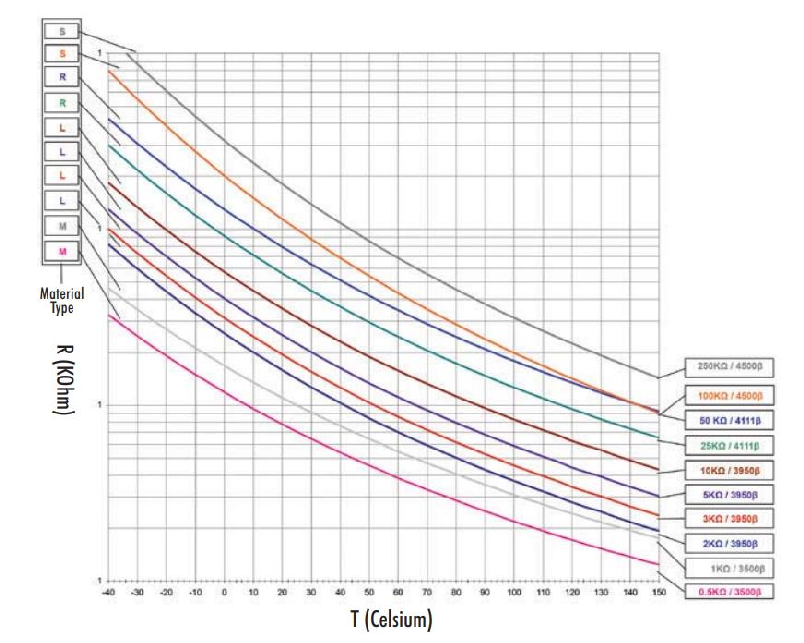
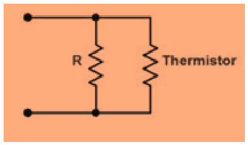
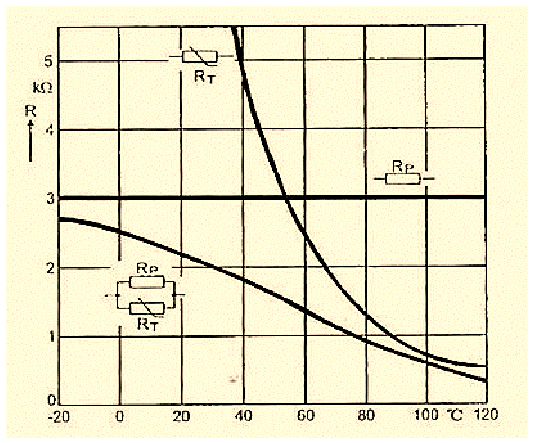
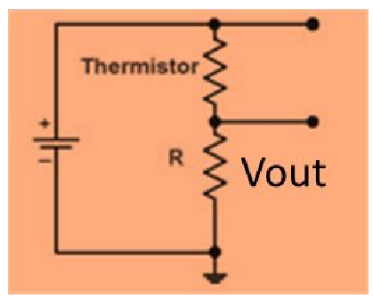
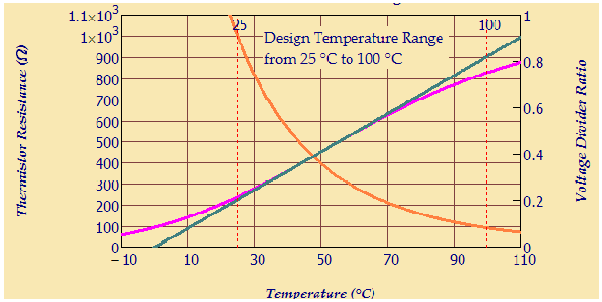

# Termistors NTC: models i linealització

## 📑 Índice de Contenidos

- [1 Model exponencial](#1-model-exponencial)
  - [Linealització local](#linealització-local)
  - [Equació de Steinhart-Hart](#equació-de-steinhart-hart)
- [2 Linealització analògica](#2-linealització-analògica)
  - [Divisor de tensió](#divisor-de-tensió)

---

Sistemes de Mesura · **Unitat 5 — Sensors resistius** · Document 4 de 8

# Termistors NTC: models i linealització

Dedicació estimada: 8 minuts

> [!NOTE] **Objectius d'aprenentatge**
>
> - Distingir termistors NTC i PTC i situar-los enfront dels RTD.
> - Aplicar el model exponencial de dos paràmetres amb les temperatures en kelvin.
> - Obtenir el coeficient de temperatura local i reconèixer l'equació de Steinhart-Hart.
> - Dissenyar la resistència de linealització analògica i avaluar-ne el compromís amb la sensibilitat.

Els **termistors** són sensors resistius de temperatura basats en semiconductors, on la temperatura provoca variacions molt fortes de resistivitat a través del nombre de portadors. Enfront dels RTD de platí tenen **sensibilitat relativa molt més elevada** —el canvi relatiu per grau pot ser vint vegades superior—, **comportament molt menys lineal** (relació aproximadament exponencial), **cost i dimensions molt reduïts** i **pitjor exactitud i intercanviabilitat** sense calibratge individual. Es classifiquen en **NTC** (la resistència decreix amb la temperatura) i **PTC** (creix).

*Figura: Figura 5.7 Símbols de termistors. A l'esquerra, el símbol d'una NTC; a la dreta, el d'una PTC. La línia trencada indica el comportament no lineal, i el signe que acompanya $t^{o}$
distingeix el sentit de la variació.*

Aquest document tracta les NTC, que són les que s'utilitzen com a sensors; les PTC, emprades sobretot com a proteccions, es tracten al document 5.

## 1 Model exponencial

Una NTC és una resistència de material semiconductor —típicament òxids metàl·lics sinteritzats— en què la resistència disminueix en escalfar-se perquè augmenta el nombre de portadors: el mecanisme oposat al d'un RTD metàl·lic, on la densitat de portadors és constant i el que canvia és la mobilitat. S'apliquen en rangs moderats (0-100 °C) amb exactituds d'unes dècimes o d'algun grau.

$$
R_{\text{NTC}}(T) = R_0\,\exp\left[\beta\left(\frac{1}{T}-\frac{1}{T_0}\right)\right] \qquad (5.26)
$$

amb  $R_0$
 la resistència a la temperatura de referència  $T_0$
 —habitualment 298,15 K, és a dir 25 °C— i  $\beta$
 la temperatura característica.

> [!WARNING] **Les temperatures han d'anar en kelvin**
>
> $T$
> i  $T_0$
> són temperatures **absolutes**: introduir-hi graus Celsius no és una aproximació grollera sinó un error greu, perquè els quocients  $\frac{1}{T}$
> canvien completament de valor i el model deixa de tenir sentit prop de 0 °C. El paràmetre  $\beta$
> també s'expressa en **kelvin**. Es fa servir  $T[\mathrm{K}] = T[^\circ\mathrm{C}] + 273{,}15$
>.

$\beta$
 indica com d'abruptament decreix la resistència: **valors grans impliquen una caiguda més ràpida** i més sensibilitat. Es relaciona amb l'energia d'activació de la generació de portadors, i tant  $R_0$
 com  $\beta$
 depenen del procés de fabricació (document 5).

> [!EXAMPLE] **Exemple resolt: ús del model de dos paràmetres**
>
> Un NTC té  $R_0 = 10\ \mathrm{k\Omega}$
> a 25 °C i  $\beta = 4000\ \mathrm{K}$
>. Quina resistència presenta a 35 °C?
>
> 1. Conversió a kelvin i exponent. Amb  $T_0 = 298{,}15\ \mathrm{K}$
> i  $T = 308{,}15\ \mathrm{K}$
>,  $\beta\left(\frac{1}{T}-\frac{1}{T_0}\right) \approx -0{,}4353$
>, negatiu perquè  $T>T_0$
>.
> 2. Resistència.  $R = 10\,000\cdot e^{-0{,}4353} = 6470\ \Omega$
>.
> 3. Interpretació. 10 °C fan baixar la resistència un 35 %; una Pt-100, en el mateix salt, hauria canviat un 3,85 %.

*Figura: Figura 5.8 Variació de la resistència de diversos models de NTC amb la temperatura, per a diferents combinacions de $R_0$
i $\beta$
.*

### Linealització local

En marges de pocs graus al voltant d'una temperatura  $T_x$
, la corba s'aproxima per la recta tangent:

$$
R_{\text{NTC}}(T) \approx R_x\left[1+\alpha\,(T-T_x)\right] \qquad (5.27)
$$

$$
\alpha \approx -\frac{\beta}{T_x^{\,2}} \qquad (5.28)
$$

amb  $R_x = R_{\text{NTC}}(T_x)$
,  $T_x$
 i  $\beta$
 en kelvin. El signe negatiu reflecteix que la resistència decreix amb la temperatura. Amb  $\beta=4000$
 K a 25 °C,  $\alpha \approx -0{,}045\ \mathrm{K^{-1}}$
: un −4,5 %/K, més de deu vegades el +0,385 %/K d'una Pt-100 i de signe contrari. És una aproximació **local**, vàlida en intervals estrets —per exemple temperatura corporal prop de 37 °C—, perquè el que s'aproxima és una exponencial.

### Equació de Steinhart-Hart

Per a marges amplis amb alta exactitud es relaciona la *inversa de la temperatura absoluta* amb un polinomi en el *logaritme de la resistència*:

$$
\frac{1}{T} = a + b\,\ln(R) + c\left[\ln(R)\right]^3 \qquad (5.29)
$$

amb  $a$
,  $b$
 i  $c$
 determinats per calibratge en diversos punts i  $R$
 en ohms. Ajusta la corba amb errors molt petits en un rang ampli a canvi de més càlcul i un calibratge acurat, i es reserva per a aplicacions metrològiques. Relaciona temperatura amb resistència, i el seu interès és descriure un comportament fortament no lineal.

## 2 Linealització analògica

*Figura: Figura 5.9 Linealització analògica d'un termistor amb una resistència fixa en paral·lel.*

Connectant una resistència fixa  $R$
 en paral·lel amb el termistor,

$$
R_{\text{eq}}(T) = \frac{R_{\text{th}}(T)\,R}{R_{\text{th}}(T)+R} \qquad (5.30)
$$

Quan la NTC té resistència molt gran o molt petita, la resistència fixa domina el paral·lel i suavitza la variació relativa, de manera que  $R_{\text{eq}}(T)$
 pot ser molt més lineal en un cert marge. El criteri de disseny és imposar un **punt d'inflexió** —segona derivada nul·la— a la temperatura d'interès  $T_x$
, i derivant dues vegades (5.30) amb el model exponencial s'arriba a

$$
R = R_{\text{th}}(T_x)\,\frac{\beta-2T_x}{\beta+2T_x} \qquad (5.31)
$$

Perquè  $R$
 sigui positiva cal  $\beta > 2T_x$
, cosa que es compleix folgadament amb valors habituals ( $\beta$
 de milers de kelvin i  $2T_x$
 de l'ordre de 600 K a temperatura ambient).

*Figura: Figura 5.10 Resultat de linealitzar un termistor NTC ( $R_T$
) amb una resistència fixa $R_p$
en paral·lel. La resistència equivalent és molt més lineal que la del termistor sol, especialment a les proximitats de 60 °C.*

**El preu a pagar és una disminució de la sensibilitat**: la corba equivalent varia menys amb la temperatura que la NTC nua. Tampoc no s'obté una resposta exactament lineal, perquè el disseny només anul·la la segona derivada en un punt: la millora és local i el marge útil, encara que ampliat, continua sent finit.

### Divisor de tensió

*Figura: Figura 5.11 Linealització analògica d'una NTC amb un divisor de tensió.*

Col·locant la NTC en un divisor i prenent com a sortida la tensió sobre la resistència fixa,

$$
V_{\text{out}}(T) = V\,\frac{R}{R+R_{\text{th}}(T)} \qquad (5.32)
$$

i imposant també aquí un punt d'inflexió a  $T_x$
 s'arriba a

$$
R = R_{\text{th}}(T_x)\,\frac{\beta-2T_x}{\beta+2T_x} \qquad (5.33)
$$

exactament la mateixa expressió que (5.31), perquè la no linealitat que es compensa és la de la mateixa exponencial.

*Figura: Figura 5.12 Exemple de linealització de NTC amb divisor de tensió. La variació de la NTC es mostra amb la corba taronja; la sortida del divisor, normalitzada respecte de la tensió d'alimentació, en púrpura. La recta verda és l'aproximació lineal prop de 50 °C, i la tensió del divisor és raonablement lineal entre 30 °C i 70 °C.*

Té dos avantatges: la sortida ja és una **tensió**, directament utilitzable per un convertidor A/D, i el signe queda invertit respecte de la NTC —si la temperatura puja,  $R_{\text{th}}$
 baixa i la tensió *augmenta*. La sortida depèn del valor de la resistència fixa, que és el paràmetre de disseny. S'utilitza en sistemes econòmics, on es vol una relació aproximadament lineal en un marge reduït sense càlculs complexos al microcontrolador; quan hi ha capacitat de càlcul, l'alternativa és la **linealització digital**, que aplica el model invertit o Steinhart-Hart sense sacrificar sensibilitat.

> [!TIP] **Síntesi**
>
> Les NTC baixen de resistència en escalfar-se perquè augmenta la densitat de portadors, amb sensibilitat relativa molt superior a la dels RTD però resposta exponencial i pitjor intercanviabilitat. El model de dos paràmetres exigeix temperatures absolutes en kelvin, i un  $\beta$
> més gran significa caiguda més abrupta. Localment s'aproxima per una recta amb  $\alpha\approx-\beta/T_x^2$
>, sempre negatiu. Steinhart-Hart relaciona  $\frac{1}{T}$
> amb un polinomi en  $\ln R$
> per a marges amplis. La linealització analògica, en paral·lel o en divisor, dona  $R=R_{\text{th}}(T_x)(\beta-2T_x)/(\beta+2T_x)$
> i millora la linealitat a canvi de perdre sensibilitat.

[← 3. Autoescalfament, excitació i resposta dinàmica](03_Unitat5_Autoescalfament_i_resposta_dinamica.md)[5. Termistors: construcció, PTC i aplicacions →](05_Unitat5_Termistors_construccio_PTC_aplicacions.md)

---

## 📐 Formulario Resumen de Ecuaciones

| Nº / Ref | Expresión Matemática |
| :---: | :--- |
| **(5.26)** | $R_{\text{NTC}}(T) = R_0\,\exp\left[\beta\left(\frac{1}{T}-\frac{1}{T_0}\right)\right]$ |
| **(5.27)** | $R_{\text{NTC}}(T) \approx R_x\left[1+\alpha\,(T-T_x)\right]$ |
| **(5.28)** | $\alpha \approx -\frac{\beta}{T_x^{\,2}}$ |
| **(5.29)** | $\frac{1}{T} = a + b\,\ln(R) + c\left[\ln(R)\right]^3$ |
| **(5.30)** | $R_{\text{eq}}(T) = \frac{R_{\text{th}}(T)\,R}{R_{\text{th}}(T)+R}$ |
| **(5.31)** | $R = R_{\text{th}}(T_x)\,\frac{\beta-2T_x}{\beta+2T_x}$ |
| **(5.32)** | $V_{\text{out}}(T) = V\,\frac{R}{R+R_{\text{th}}(T)}$ |
| **(5.33)** | $R = R_{\text{th}}(T_x)\,\frac{\beta-2T_x}{\beta+2T_x}$ |