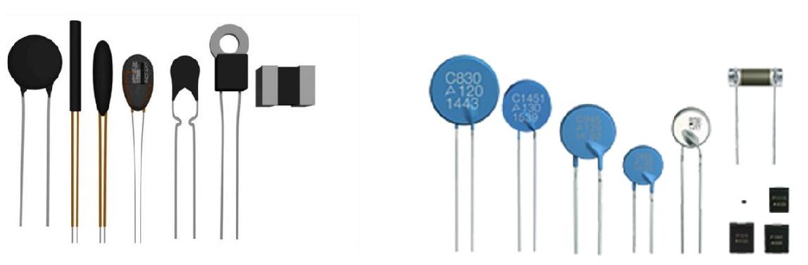
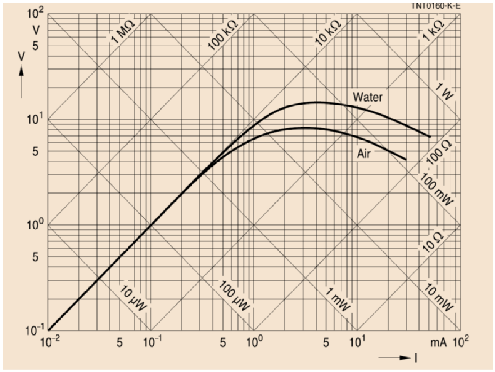
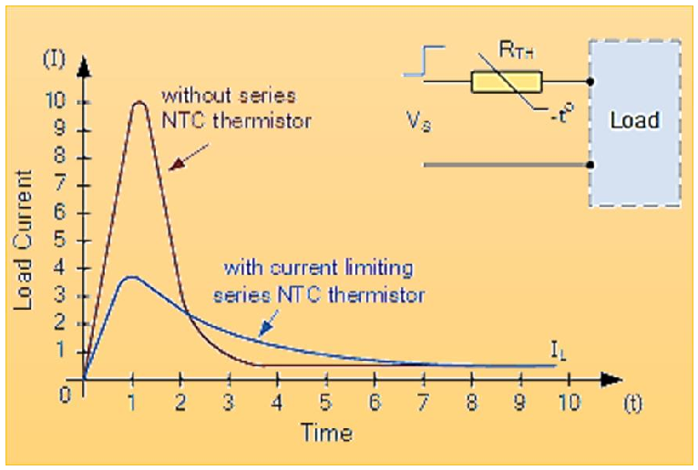
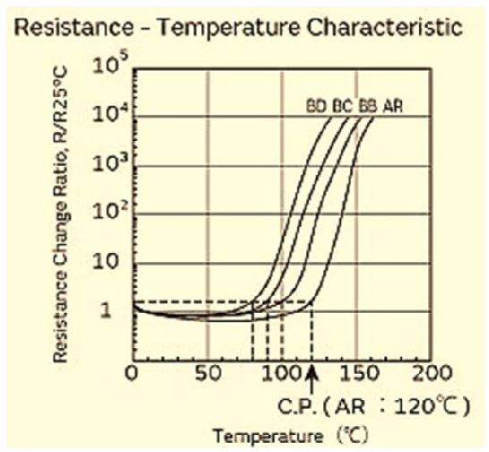
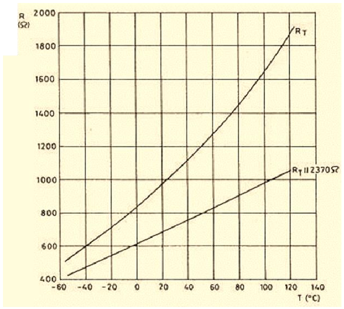
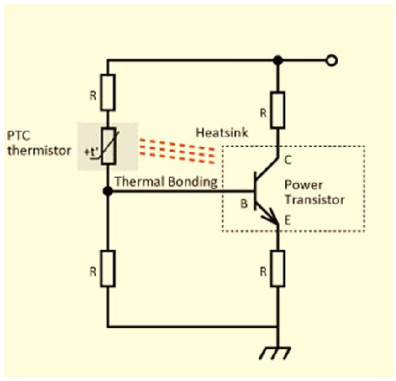
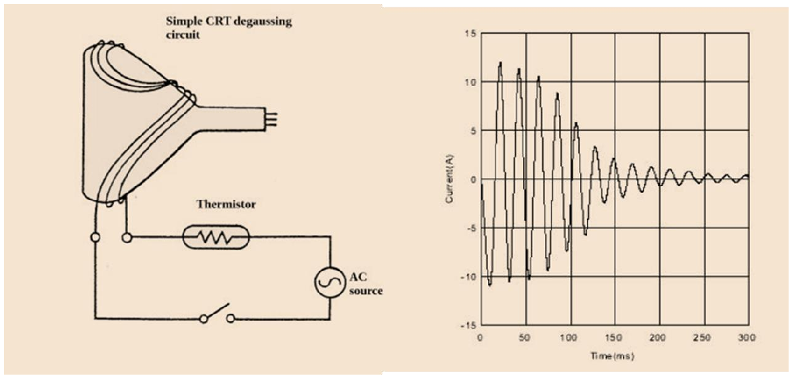

# Termistors: construcció, PTC i aplicacions

## 📑 Índice de Contenidos

- [1 Fabricació i formats de les NTC](#1-fabricació-i-formats-de-les-ntc)
- [2 NTC enfront de RTD](#2-ntc-enfront-de-rtd)
- [3 Aplicacions de les NTC](#3-aplicacions-de-les-ntc)
  - [Detecció de nivell i de flux per autoescalfament](#detecció-de-nivell-i-de-flux-per-autoescalfament)
  - [Limitació de transitoris de corrent](#limitació-de-transitoris-de-corrent)
- [4 Termistors PTC](#4-termistors-ptc)
  - [Aplicacions de les PTC](#aplicacions-de-les-ptc)

---

Sistemes de Mesura · **Unitat 5 — Sensors resistius** · Document 5 de 8

# Termistors: construcció, PTC i aplicacions

Dedicació estimada: 7 minuts

> [!NOTE] **Objectius d'aprenentatge**
>
> - Relacionar el procés de fabricació ceràmica d'una NTC amb la dispersió dels seus paràmetres.
> - Escollir el format i l'encapsulat segons el muntatge, la resposta dinàmica i el medi.
> - Comparar termistors NTC i RTD i explicar l'autoescalfament com a principi de mesura.
> - Distingir posistors i silistors i les aplicacions de protecció de les PTC.

## 1 Fabricació i formats de les NTC

*Figura: Figura 5.13 Exemples d'encapsulats de NTC, tant de muntatge amb forat passant com de muntatge superficial.*

La major part de NTC es fabriquen amb **ceràmiques semiconductores d'òxids metàl·lics** —manganès, níquel, cobalt, coure—: preparació de la pols, premsat o extrusió, **sinterització** a alta temperatura que forma una ceràmica densa amb les propietats buscades, i aplicació d'elèctrodes i terminals.

Els paràmetres  $R_0$
 i  $\beta$
 **depenen fortament de la composició i del cicle de sinterització**: aquesta és l'arrel del problema d'intercanviabilitat. Obtenir NTC intercanviables amb toleràncies estretes exigeix un control molt més estricte i encareix el component; les ordinàries presenten dispersió apreciable entre unitats i sovint cal calibratge individual.

Els NTC de **forat passant** es presenten en **disc** (els clàssics de potència o de mesura general, usats també com a limitadors de transitoris en sèrie amb la línia), en **perla** (massa mínima i constant de temps molt baixa, muntable com a sonda d'immersió, típica en aplicacions mèdiques i climatització domèstica) i en **formats especials** com orella o anella, per cargolar a xassís i dissipadors. L'aïllament superficial i la geometria determinen el coeficient de dissipació  $\delta$
 i la potència màxima admissible.

Els NTC **SMD** s'encapsulen en xips rectangulars o cilíndrics amb capa protectora de vidre o resina. Ofereixen **compatibilitat total amb soldadura per *reflow* i muntatge automatitzat**, dimensions de fracció de mil·límetre amb resposta tèrmica molt ràpida, i integració al costat dels components crítics de la placa.

**Els encapsulats petits tenen menys massa tèrmica i responen més ràpid**, però admeten menys potència: la resposta dinàmica no és una propietat del material sinó del conjunt massa-encapsulat-muntatge.

## 2 NTC enfront de RTD

**Avantatges de les NTC**: cost molt inferior; **sensibilitat elevada**, amb un canvi relatiu per grau fins a vint vegades superior; dimensions i massa reduïdes amb respostes ràpides; i **resistència nominal elevada** —de kΩ a desenes de kΩ a 25 °C—, que minimitza l'efecte de les resistències de cablejat, el problema oposat al de la Pt-100.

**Desavantatges**: forta **no linealitat** exponencial, que obliga a linealitzar o calcular numèricament; **menor exactitud i pitjor intercanviabilitat**, amb  $(R_0,\beta)$
 variables entre dispositius del mateix model, de manera que l'alta exactitud demana calibratge individual o termistors intercanviables més cars; i **més soroll tèrmic i susceptibilitat a interferències**, perquè la resistència elevada implica més soroll Johnson —la densitat  $4kTR$
 de la unitat 4 creix amb  $R$
— i més sensibilitat a interferències capacitatives amb entrades d'alta impedància. La resistència alta elimina, doncs, el problema del cablejat però n'introdueix un altre.

En resum: per a exactitud i estabilitat en entorns exigents, els RTD; per a mesures econòmiques, sensibles i ràpides amb exactitud moderada, les NTC.

## 3 Aplicacions de les NTC

**Mesura de temperatura**: termòmetres digitals corporals (marge de 35-42 °C, fàcil de linealitzar), estacions meteorològiques i electrònica de consum, amb models simplificats o taules de conversió.

### Detecció de nivell i de flux per autoescalfament

Aquesta aplicació capgira el problema del document 3: en lloc de combatre l'autoescalfament, l'utilitza com a *principi de mesura*. El termistor fa alhora de calefactor i de sensor. Amb corrent constant, la temperatura s'ajusta fins que el flux de calor cap al medi iguala  $P=I^2R$
, segons  $\delta$
; si canvia el medi —d'aire a aigua, o si varia el flux— canvia  $\delta$
 i, amb ell, la temperatura d'equilibri i la resistència.

*Figura: Figura 5.14 Corbes corrent-tensió d'un termistor de 10 kΩ a 25 °C exposat a aire quiet i a aigua sense flux. Amb corrents petits la dissipació és tan reduïda que no hi ha autoescalfament i el quocient tensió-corrent val exactament 10 kΩ; en augmentar el corrent, la corba queda per sota de la recta de 10 kΩ perquè la NTC està més calenta que l'entorn.*

Amb 3 mA en aire la tensió en borns és d'uns 7,5 V; submergit en aigua a la mateixa temperatura ambient, la dissipació és molt més efectiva, la temperatura interna baixa, la resistència augmenta i la tensió pot arribar als 15 V. Permet construir **detectors de nivell** i **anemòmetres tèrmics**: a corrent constant, més velocitat d'aire refreda el termistor i n'augmenta la resistència.

### Limitació de transitoris de corrent

*Figura: Figura 5.15 Limitació de transitoris de corrent amb una NTC en sèrie amb la càrrega.*

Amb la NTC **en sèrie amb la càrrega**, a temperatura ambient té resistència elevada i limita el pic de corrent inicial (*inrush*); en circular-hi corrent s'autoescalfa, la resistència *disminueix* i queda molt per sota de la de la càrrega, deixant passar pràcticament el corrent nominal. La NTC comença **freda i resistiva** i acaba **calenta i poc resistiva**. Amb càrrega capacitiva (en paral·lel amb una resistència Rl), en l'encesa la impedància pot ser molt baixa i el corrent enorme; la NTC en limita el valor i, un cop escalfada, el condensador es carrega normalment. És comú en fonts d'alimentació de potència, equips d'àudio i electrònica industrial.

## 4 Termistors PTC

Les PTC s'utilitzen sobretot com a **elements de protecció i compensació**, no com a sensors de precisió, i no substitueixen els RTD de platí en aquest paper.

*Figura: Figura 5.16 Relació temperatura-resistència en una família de posistors.*

Els **posistors**, ceràmics, presenten un canvi **abruptament positiu** de resistència en un marge estret, de l'ordre de 50 °C: a temperatures baixes el coeficient és lleugerament negatiu o dèbilment positiu, i per damunt d'una **temperatura de transició** la resistència pot canviar fins a quatre ordres de magnitud, de manera que la característica no és ni suau ni lineal. L'augment es relaciona amb canvis de fase o de conducció del ceràmic, i al punt alt el corrent queda fortament limitat, que és l'efecte buscat.

*Figura: Figura 5.17 Relació temperatura-resistència d'un silistor sense i amb element de linealització analògica; en aquest cas, una resistència fixa de 2,37 kΩ en paral·lel.*

Els **silistors** són PTC de silici molt dopat, amb un canvi *més suau* que els posistors i sovint amb linealització integrada —la mateixa tècnica de resistència en paral·lel del document 4—, útils per a compensació tèrmica o mesura aproximada quan es vol un coeficient positiu moderat i previsible.

### Aplicacions de les PTC

*Figura: Figura 5.18 Limitació de la potència dissipada per un transistor de potència mitjançant una PTC.*

**Protecció tèrmica d'un transistor de potència.** La PTC es col·loca en contacte tèrmic íntim amb el transistor i forma part del circuit de polarització de base. Si el transistor dissipa massa potència, la temperatura puja, la resistència de la PTC creix i *redueix* el corrent de base; això abaixa el corrent de col·lector i la potència dissipada, i el sistema s'estabilitza per **retroalimentació negativa**. Els processos són lents però suficients en règim quasi estacionari.

*Figura: Figura 5.19 Circuit de desmagnetització amb PTC en sèrie amb el bobinat.*

**Desmagnetització per transitori de corrent decreixent.** Per desmagnetitzar un circuit magnètic —per exemple una pantalla de raigs catòdics— cal un corrent altern de gran amplitud que decreixi fins a zero. Amb una PTC en sèrie amb el bobinat, a l'instant inicial la resistència és baixa i el camp intens; en autoescalfar-se, la resistència augmenta fortament i el corrent cau a valors pràcticament nuls en menys d'un segon. El corrent s'extingeix tot sol, i això és el que fa útil el muntatge, aquí i allà on cal un corrent inicial fort que es redueixi sense control electrònic.

> [!TIP] **Síntesi**
>
> Els paràmetres  $R_0$
> i  $\beta$
> depenen del cicle de sinterització, cosa que explica la dispersió entre dispositius. Els encapsulats petits responen més ràpid però admeten menys potència. Enfront dels RTD, les NTC són més barates, sensibles i petites i menys afectades pel cablejat, però menys lineals, pitjor intercanviables i més sorolloses. Les aplicacions són la mesura en marges moderats, la detecció de nivell i flux per canvi del coeficient de dissipació, i la limitació del corrent d'engegada, on la NTC comença freda i resistiva i acaba calenta i conductora. Les PTC són proteccions: els posistors amb transició abrupta i els silistors, més suaus, per a compensació tèrmica.

[← 4. Termistors NTC: models i linealització](04_Unitat5_Termistors_NTC.md)[6. Sensors piezoresistius i galgues extensiomètriques →](06_Unitat5_Sensors_piezoresistius_i_galgues.md)