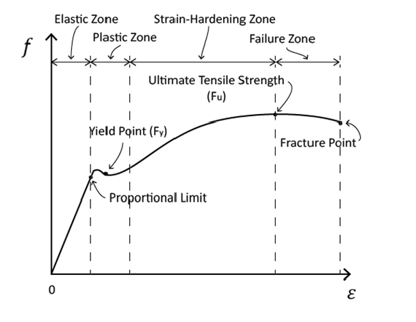
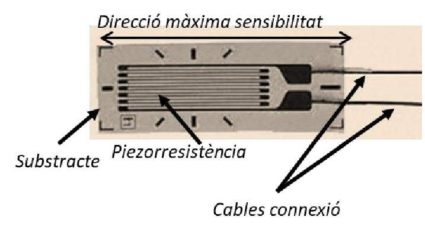
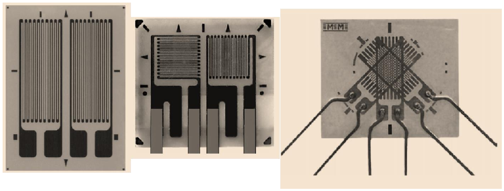
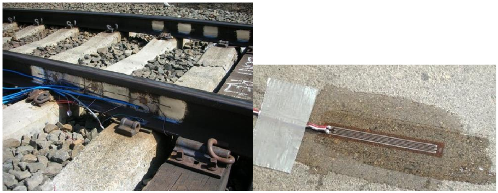
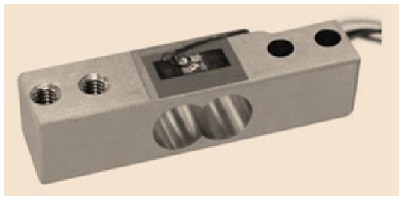
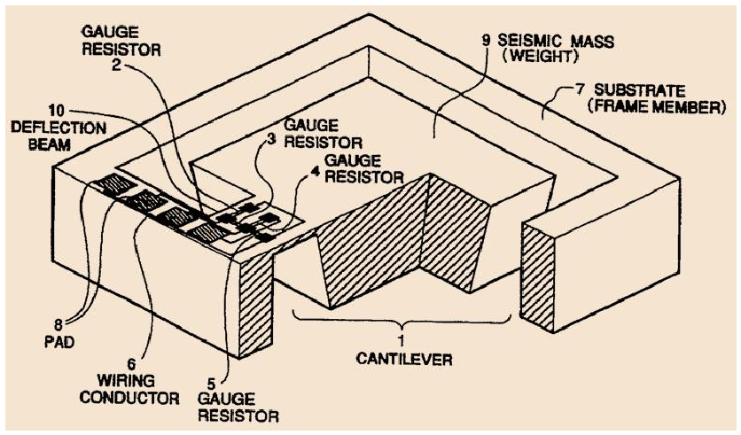

# Sensors piezoresistius i galgues extensiomètriques

## 📑 Índice de Contenidos

- [1 Tensió mecànica i deformació](#1-tensió-mecànica-i-deformació)
- [2 El factor de galga](#2-el-factor-de-galga)
- [3 Construcció i paràmetres geomètrics](#3-construcció-i-paràmetres-geomètrics)
- [4 Temperatura, rosetes i muntatge](#4-temperatura-rosetes-i-muntatge)
- [5 Aplicacions](#5-aplicacions)

---

Sistemes de Mesura · **Unitat 5 — Sensors resistius** · Document 6 de 8

# Sensors piezoresistius i galgues extensiomètriques

Dedicació estimada: 8 minuts

> [!NOTE] **Objectius d'aprenentatge**
>
> - Definir tensió mecànica i deformació unitària i situar les zones elàstica, plàstica i de fallida.
> - Deduir el factor de galga i aplicar  $R=R_0(1+k\varepsilon)$
> dins dels seus límits.
> - Interpretar la sensibilitat longitudinal i transversal i el paper de les rosetes.
> - Identificar els errors de temperatura i de muntatge i descriure les aplicacions típiques.

Un **sensor piezoresistiu** canvia de resistència quan el material es deforma sota una tensió mecànica; dins de la zona elàstica la variació és aproximadament proporcional a la deformació, i coneixent el model i les propietats de la peça se'n dedueixen deformació, força, pressió o acceleració. Es presenten com a **galgues extensiomètriques**: una graella resistiva en ziga-zaga sobre un substrat aïllant, adherit sobre la peça, amb la graella més elàstica que el substrat i aquest més que la peça. És un sensor **modulador**: no genera cap tensió en deformar-se —això seria un sensor piezoelèctric, de la unitat 9— sinó que modifica una resistència que cal excitar.

## 1 Tensió mecànica i deformació

$$
\sigma = \frac{F}{A} \qquad (5.34)
$$

$$
\varepsilon = \frac{\Delta l}{l_0} \qquad (5.35)
$$

La **tensió mecànica** és la força *dividida* per la secció, en pascals (habitualment MPa o GPa); la **deformació unitària** és un quocient de longituds i, per tant, **adimensional**, sovint en microdeformacions (µm/m, és a dir µε):  $1000\ \mu\varepsilon$
 equival a  $10^{-3}$
.

*Figura: Figura 5.20 Relació entre tensió mecànica —representada aquí com a força— i elongació relativa d'un material, amb les zones elàstica, plàstica (que inclou la d'enduriment) i de fallida.*

- **Zona elàstica**: deformacions petites, relació pràcticament lineal i *reversible*.
- **Zona plàstica**: la relació deixa de ser lineal i poden quedar deformacions permanents. Inclou la *zona d'enduriment*, on per estirar més cal una força creixent i el material no s'allarga fins a superar el màxim aplicat abans.
- **Zona de fallida**: a partir de la tensió de trencament, la secció s'escanya de manera no proporcional i el material es pot trencar.

Les galgues s'han de fer treballar **sempre dins de la zona elàstica**: en zona plàstica es perd la reversibilitat i, amb ella, la mesura. Hi val la **llei de Hooke**:

$$
\sigma = E\,\varepsilon \qquad (5.36)
$$

amb  $E$
 el **mòdul de Young**, amb dimensions de pressió, que mesura la *rigidesa* —uns 200 GPa per a l'acer, 70 GPa per a l'alumini, 20-30 GPa per al formigó— i permet convertir deformació en tensió mecànica i, amb la geometria, en força. En estirar-se, la peça s'estreny transversalment per **efecte de Poisson**:

$$
\frac{\Delta A}{A} = -2\,\nu\,\varepsilon \qquad (5.37)
$$

amb  $\nu$
 entre 0,25 i 0,35 per a molts metalls; el signe negatiu indica que la secció *disminueix* quan la peça s'estira.

## 2 El factor de galga

Partint de

$$
R = \rho\,\frac{l}{A} \qquad (5.38)
$$

$$
\frac{\Delta R}{R} \approx \frac{\Delta\rho}{\rho} + \frac{\Delta l}{l} - \frac{\Delta A}{A} \qquad (5.39)
$$

amb els canvis geomètrics en zona elàstica

$$
\frac{\Delta l}{l} = \varepsilon \qquad (5.40)
$$

$$
\frac{\Delta A}{A} = -2\nu\,\varepsilon \qquad (5.41)
$$

i la variació de resistivitat amb la deformació —la piezoresistivitat pròpiament dita, sobretot en materials cristal·lins—

$$
\frac{\Delta\rho}{\rho} = k_1\,\varepsilon \qquad (5.42)
$$

amb  $k_1$
 una constant positiva del material, resulta

$$
\frac{\Delta R}{R} = k_1\varepsilon + \varepsilon + 2\nu\varepsilon = \left(1+2\nu+k_1\right)\varepsilon \qquad (5.43)
$$

La constant de proporcionalitat recull *tots dos* mecanismes, el geomètric i el de resistivitat. Es defineix el **factor de galga**

$$
k = \frac{\Delta R/R}{\varepsilon} \qquad (5.44)
$$

—quant canvia la resistència, en termes relatius, per unitat de deformació— de manera que

$$
k = 1+2\nu+k_1 \qquad (5.45)
$$

En **galgues metàl·liques** el terme geomètric val uns  $1+2\cdot 0{,}3 = 1{,}6$
 i  $k_1$
 és de l'ordre de 0,4 a 1, cosa que dona factors **entre 2 i 3**. En **semiconductores**, l'efecte de la deformació sobre la resistivitat és molt més gran i permet  $k$
 **entre 50 i 150**.

$$
R = R_0\left(1+k\,\varepsilon\right) \qquad (5.46)
$$

El model és lineal en  $\varepsilon$
 i vàlid dins dels límits del fabricant: **metàl·liques**, fins a uns 40 000 µε (4 %); **semiconductores**, de 1000 a 3000 µε. Aquesta és la contrapartida de la sensibilitat: les semiconductores admeten deformacions màximes molt *menors*, i a prop dels límits apareixen no linealitats i histèresi.

## 3 Construcció i paràmetres geomètrics

*Figura: Figura 5.21 Exemple de galga extensiomètrica comercial: substrat aïllant flexible de poliimida o paper reforçat, pel·lícula resistiva en graella de ziga-zaga i zones de connexió soldables.*

La graella té una direcció de màxima sensibilitat, que ha de coincidir amb la direcció principal de deformació: una galga no és indiferent a l'orientació. Es distingeix entre **sensibilitat longitudinal**, en la direcció de la graella, i **sensibilitat transversal**, a deformacions ortogonals, que el fabricant dona com a percentatge de la longitudinal i que ha de ser tan baixa com sigui possible.

La **longitud de la graella** determina la *mitjana espacial* de la deformació i ha de ser petita respecte de la peça. La jerarquia de rigideses ho lliga tot: **el substrat ha de ser més elàstic que la peça**, i l'adhesiu més rígid que el substrat però menys que la peça; un substrat més rígid que la peça n'impediria la deformació lliure.

|  | Metàl·liques | Semiconductores |
|:--- |:--- |:--- |
| Material | Pel·lícules fines d'aliatges com constantan o karma | Silici dopat o ceràmiques semiconductores |
| Resistència nominal | 120 Ω a 350 Ω habitualment | Més elevada |
| Factor de galga  $k$ | 2 a 3 | 50 a 150 |
| Deformació màxima | Fins a 40 000 µε (4 %) | 1000 a 3000 µε (0,1-0,3 %) |
| Linealitat i repetibilitat | Molt bones | Resposta sovint no lineal |
| Intercanviabilitat | Toleràncies baixes; relativament intercanviables | Toleràncies més grans; menys intercanviables |

El constantan i el karma es trien pel seu **coeficient de temperatura molt baix**, primera defensa contra les derives tèrmiques. Les semiconductores convenen quan cal molta sensibilitat i poc rang, com en sensors integrats de pressió o acceleròmetres MEMS —la integració en MEMS admet, doncs, principis piezoresistius—, però **les metàl·liques dominen el mercat** per robustesa i facilitat d'ús.

## 4 Temperatura, rosetes i muntatge

La resistència d'una galga **depèn també de la temperatura** —ser metàl·lica no la immunitza: és el mecanisme dels RTD—, i si no es compensa s'interpreta com deformació. S'usen aliatges de coeficient molt baix; **galgues de referència** no carregades mecànicament connectades en pont, de manera que la seva variació tèrmica *compensi* la de les actives, ja que el pont cancel·la les variacions comunes; i correcció digital amb un sensor de temperatura (unitat 6).

*Figura: Figura 5.22 Configuracions comercials de galgues. Esquerra: dues galgues idèntiques que, en braços oposats d'un pont, dupliquen la sensibilitat. Centre: semi-roseta amb galgues a 0° i 90°, sensibles a direccions ortogonals. Dreta: roseta de tres galgues a 0°, 45° i 90°.*

Quan no es coneix la direcció de la tensió s'usen configuracions multiaxials, que serveixen també per compensar temperatura. La **roseta de tres galgues** permet inferir el mòdul i la direcció de la tensió: coneguts el mòdul de Young i el coeficient de Poisson, les tres lectures resolen les equacions de transformació de tensió plana i donen  $\sigma_1$
,  $\sigma_2$
 i l'angle principal. És fonamental en estructures civils.

El **muntatge físic és crític**: és la instal·lació la que decideix si el factor de galga és aplicable. S'usen cianoacrilats per a assajos curts i epoxis per a estabilitat a llarg termini; cal preparar la superfície, orientar la galga segons la direcció de tensió, aplicar l'adhesiu amb pressió controlada i protegir terminals i soldadures. Cal evitar bombolles d'aire, tensions per flexió del cablejat, gradients tèrmics i sobrecàrregues que treguin la peça de la zona elàstica, perquè degraden la resposta o introdueixen histèresi; els **fils de connexió** poden introduir tensions al punt de soldadura encara que la seva resistència sigui baixa. Això encareix el producte: una galga val unes unitats d'euro, però muntada i calibrada el conjunt puja a desenes o centenars.

## 5 Aplicacions

*Figura: Figura 5.23 Mesura de deformació en aplicacions civils: rails ferroviaris, bigues de formigó, pilars metàl·lics.*

**Mesura de deformació en estructures.** En laboratori, per obtenir corbes tensió-deformació de provetes; en estructures civils, per detectar deformacions inusuals que indiquen danys, sobrecàrrega o fatiga en ponts o edificis.

*Figura: Figura 5.24 Cèl·lula de càrrega. La geometria de la peça metàl·lica està dissenyada perquè es deformi la part on s'instal·len els sensors.*

**Cèl·lules de càrrega.** Una peça mecànica —viga, bloc, anell— amb galgues: la deformació sota càrrega es converteix en variació de resistència i, finalment, en tensió. La peça es dissenya perquè, per al rang de forces especificat, la deformació es mantingui **dins de la zona elàstica**, amb resposta reversible i repetible. Les galgues es connecten sovint en pont de Wheatstone de quatre resistències, que augmenta la sensibilitat i compensa parcialment els efectes tèrmics. S'apliquen a bàscules industrials, balances de precisió, dinamòmetres i bancs d'assaig.

*Figura: Figura 5.25 Acceleròmetre piezoresistiu amb massa inercial sobre un voladís amb galgues.*

**Acceleròmetres piezoresistius.** Una **massa inercial** sobre una estructura elàstica amb galgues: sota acceleració  $a$
 la massa experimenta  $F=ma$
 i deforma el voladís, i un pont converteix la deformació en tensió. S'usen en vibracions, detecció de xocs, control d'estabilitat i aplicacions d'automoció i aeroespacials.

**Transductors de pressió.** Una **membrana deformable**, metàl·lica o de silici, amb galgues o piezoresistències integrades: la pressió sobre un costat la deforma i el model mecànic de la membrana relaciona el canvi de resistència amb la pressió. La cadena causal és pressió → deformació → canvi de resistència. Són comuns en instrumentació industrial, hidràulica, pneumàtica i automoció.

> [!TIP] **Síntesi**
>
> Una galga converteix deformació en variació de resistència i necessita excitació.  $\sigma=F/A$
> va en pascals i  $\varepsilon=\Delta l/l_0$
> és adimensional; en zona elàstica les lliga  $\sigma=E\varepsilon$
>. El factor de galga  $k=(\Delta R/R)/\varepsilon = 1+2\nu+k_1$
> val entre 2 i 3 en metàl·liques i entre 50 i 150 en semiconductores, que admeten deformacions molt menors. El model  $R=R_0(1+k\varepsilon)$
> val en zona elàstica. L'orientació importa i la sensibilitat transversal ha de ser mínima; les rosetes resolen direccions desconegudes. La temperatura es compensa amb aliatges de coeficient baix, galgues de referència en pont o correcció digital. S'hi basen cèl·lules de càrrega, acceleròmetres i transductors de pressió.

[← 5. Termistors: construcció, PTC i aplicacions](05_Unitat5_Termistors_construccio_PTC_aplicacions.md)[7. Magnetoresistències →](07_Unitat5_Magnetoresistencies.md)

---

## 📐 Formulario Resumen de Ecuaciones

| Nº / Ref | Expresión Matemática |
| :---: | :--- |
| **(5.34)** | $\sigma = \frac{F}{A}$ |
| **(5.35)** | $\varepsilon = \frac{\Delta l}{l_0}$ |
| **(5.36)** | $\sigma = E\,\varepsilon$ |
| **(5.37)** | $\frac{\Delta A}{A} = -2\,\nu\,\varepsilon$ |
| **(5.38)** | $R = \rho\,\frac{l}{A}$ |
| **(5.39)** | $\frac{\Delta R}{R} \approx \frac{\Delta\rho}{\rho} + \frac{\Delta l}{l} - \frac{\Delta A}{A}$ |
| **(5.40)** | $\frac{\Delta l}{l} = \varepsilon$ |
| **(5.41)** | $\frac{\Delta A}{A} = -2\nu\,\varepsilon$ |
| **(5.42)** | $\frac{\Delta\rho}{\rho} = k_1\,\varepsilon$ |
| **(5.43)** | $\frac{\Delta R}{R} = k_1\varepsilon + \varepsilon + 2\nu\varepsilon = \left(1+2\nu+k_1\right)\varepsilon$ |
| **(5.44)** | $k = \frac{\Delta R/R}{\varepsilon}$ |
| **(5.45)** | $k = 1+2\nu+k_1$ |
| **(5.46)** | $R = R_0\left(1+k\,\varepsilon\right)$ |