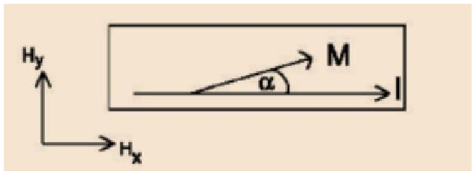
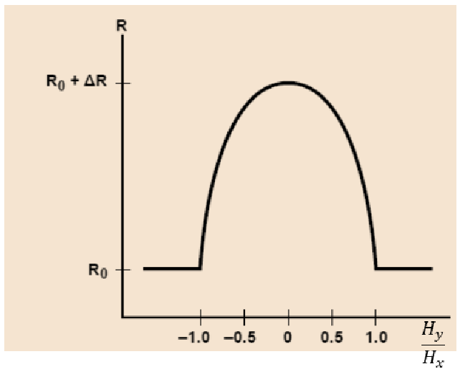
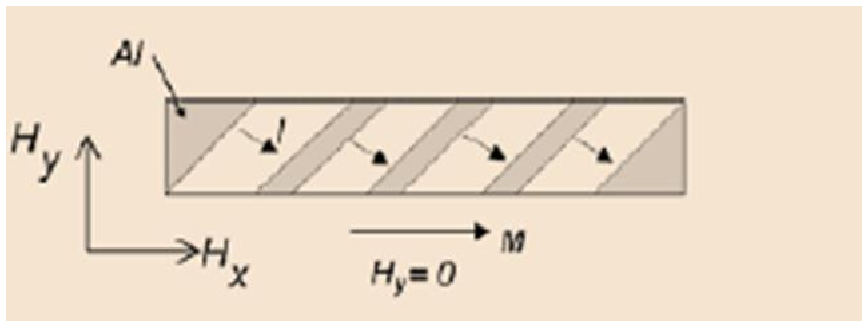
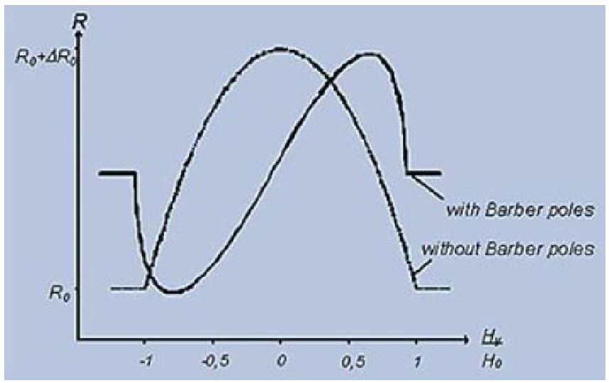
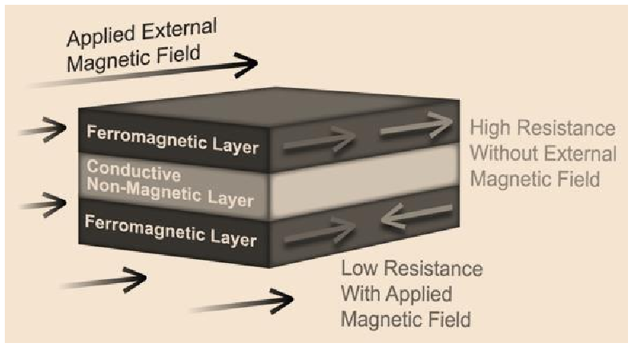
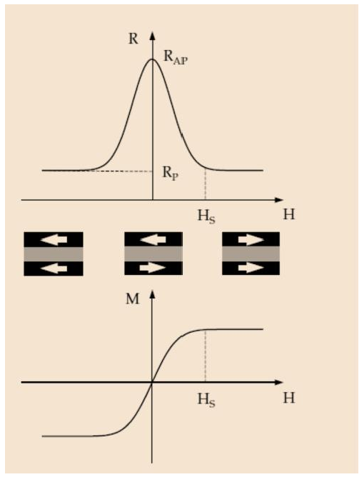
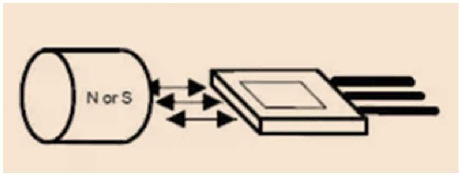
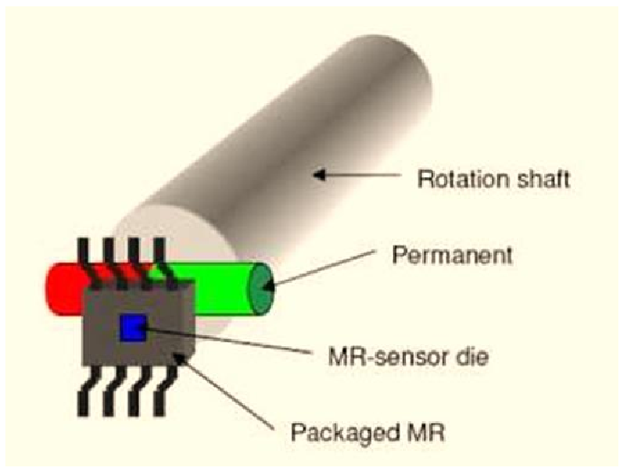
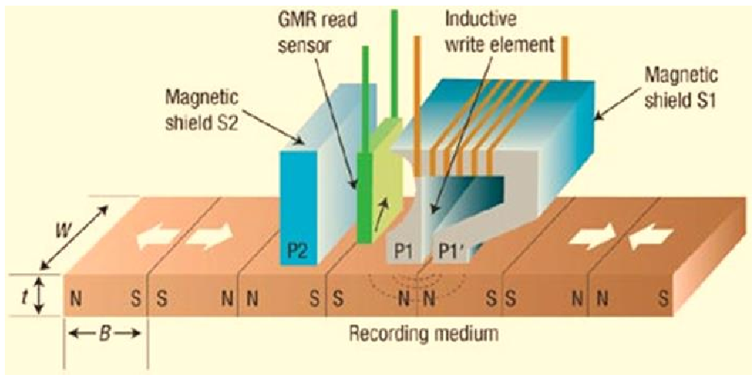
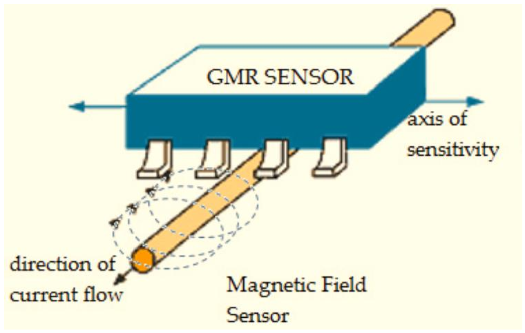

# Magnetoresistències

## 📑 Índice de Contenidos

- [1 Les tres famílies](#1-les-tres-famílies)
- [2 Magnetoresistència anisòtropa (AMR)](#2-magnetoresistència-anisòtropa-amr)
  - [L'estructura *barber pole*](#lestructura-barber-pole)
- [3 Magnetoresistència gegant (GMR)](#3-magnetoresistència-gegant-gmr)
- [4 Temperatura i aplicacions](#4-temperatura-i-aplicacions)

---

Sistemes de Mesura · **Unitat 5 — Sensors resistius** · Document 7 de 8

# Magnetoresistències

Dedicació estimada: 8 minuts

> [!NOTE] **Objectius d'aprenentatge**
>
> - Distingir els mecanismes de les AMR, les GMR i les TMR i els seus ordres de magnitud.
> - Interpretar el model d'una AMR bàsica i explicar per què perd la informació de signe.
> - Relacionar la configuració paral·lela o antiparal·lela d'una GMR amb la resistència.
> - Descriure les aplicacions de posició, velocitat angular, lectura magnètica i mesura de corrent.

Les **magnetoresistències** són sensors **resistius** la resistència dels quals varia amb el camp magnètic. Tots els conductors experimenten una modificació lleu de la resistivitat en presència de camp, però l'efecte només és útil en materials **anisòtrops i ferromagnètics**, on les propietats depenen de la direcció del camp. Responen igualment a camps continus i alterns, i moltes aplicacions —posició amb un imant permanent, mesura de corrent continu— es basen en camps estàtics.

## 1 Les tres famílies

- **AMR** (*Anisotropic Magnetoresistor*): materials ferromagnètics anisòtrops, com el permalloy, travessats per un corrent constant. Variacions relatives d'aproximadament el **2 %** abans de la saturació.
- **GMR** (*Giant Magnetoresistor*): estructures multicapa de ferromagnètic i conductor no ferromagnètic, amb gruixos de pocs nanòmetres. L'efecte, descobert el 1988, dona canvis típics del **20 %**, deu vegades els de l'AMR.
- **TMR** (*Tunnel Magnetoresistor*): evolució de la GMR en què la capa intermèdia esdevé una **aïllant** extremadament fina i el transport té lloc per efecte túnel quàntic, amb variacions encara més altes.

La sensibilitat creix en l'ordre AMR < GMR < TMR, i la **complexitat de fabricació segueix el mateix ordre**: una TMR exigeix un control nanomètric del gruix de la barrera que l'AMR no necessita. Les AMR són suficients per a camps moderats i posició; les GMR, quan cal molta sensibilitat en espais reduïts.

## 2 Magnetoresistència anisòtropa (AMR)

El material de referència és el **permalloy**, aliatge d'un 80 % de níquel i un 20 % de ferro, amb alta permeabilitat, baixa coercitivitat i anisotropia ben definida. La configuració més senzilla és una barra amb corrent constant, que genera un camp de polarització intern  $H_x$
 i una magnetització neta preferent; el camp a mesurar  $H_y$
, ortogonal, la desvia i modifica la resistència.

*Figura: Figura 5.26 Representació d'un sensor AMR bàsic.*

La resistència **depèn de l'angle entre el corrent i la magnetització neta**: els electrons es dispersen de manera diferent segons si circulen paral·lelament o perpendicularment a  $M$
, mentre que el nombre de portadors amb prou feines canvia.

$$
R = R_{\max} - \Delta R\,\frac{(H_y/H_x)^2}{1+(H_y/H_x)^2} \qquad (5.47)
$$

on  $R_{\max}$
 correspon a  $H_y=0$
 i  $\Delta R$
 és la variació màxima. A l'expressió,  $H_y$
 hi apareix **elevat al quadrat**: la funció és parell i, per tant, simètrica respecte de  $H_y=0$
, de manera que l'AMR bàsica en dona **el mòdul però no el signe**.

*Figura: Figura 5.27 Variació de la resistència d'una AMR bàsica amb la intensitat de camp magnètic $H_y$
.*

L'increment relatiu és de l'ordre del 2 % i el rang útil es limita a  $|H_y| \lesssim H_x$
, amb  $H_x$
 de l'ordre de kA/m. Per a camps molt inferiors a  $H_x$
 la sensibilitat cau ràpidament, perquè la corba és **plana al voltant de l'origen**: la sensibilitat màxima es troba en camps de l'ordre de  $H_x$
.

### L'estructura *barber pole*

*Figura: Figura 5.28 AMR amb estructura barber pole: seccions de permalloy intercalades amb seccions d'alumini (paramagnètic), amb contactes inclinats 45° respecte dels extrems.*

El corrent s'injecta per les unions inclinades i, dins del permalloy, té una component a 45° respecte de la barra. Això obliga la magnetització de mínima resistència a un angle determinat i fa la dependència **lineal per a camps petits, amb signe distingible**:

$$
R = R_0 + \frac{\Delta R}{2}\,\frac{(H_y/H_0)}{\sqrt{1+(H_y/H_0)^2}} \qquad (5.48)
$$

amb  $H_0$
 un camp de referència relacionat amb  $H_x$
. Ara  $H_y$
 hi apareix en primera potència i la corba ja no és simètrica,  $R(H_y)\neq R(-H_y)$
, amb sensibilitat màxima prop de  $H_y=0$
: permet mesurar camps molt més petits, útils per a sensors d'angle o de petits desplaçaments.

*Figura: Figura 5.29 Comparació de la resposta entre una AMR amb estructura barber pole i una sense.*

Tots dos comparteixen el mateix ordre de variació (~2 %) i el mateix rang de camps. El *barber pole* és preferible quan cal signe i alta resolució prop de zero; continua requerint el camp de polarització intern i manté la dependència amb la temperatura.

## 3 Magnetoresistència gegant (GMR)

*Figura: Figura 5.30 Estructura d'una GMR: dues capes ferromagnètiques —per exemple de ferro— separades per una capa conductora no ferromagnètica —per exemple de crom—, amb gruixos de pocs nanòmetres, sovint repetides en multicapes.*

Les GMR aprofiten efectes quàntics de l'**espín** en estructures nanomètriques: la probabilitat de dispersió dels electrons de conducció a les capes ferromagnètiques depèn de si el seu espín està alineat amb la magnetització local.

- **Sense camp extern**, les magnetitzacions de les dues capes són oposades; els electrons d'un espín determinat troben molta dispersió en almenys una capa i la **resistència creix**.
- **Amb camp extern**, s'alineen; en arribar al camp de saturació  $H_s$
   són pràcticament paral·leles, la dispersió cau i la **resistència disminueix**.

La correspondència és el nucli de l'efecte: **antiparal·lel → resistència alta; paral·lel → resistència baixa**. El canvi relatiu  $\Delta R/R$
 és de l'ordre del 20 % o més segons el gruix i la qualitat de les capes.

*Figura: Figura 5.31 Resposta d'una GMR i magnetització.*

Com en l'AMR bàsica, la resposta no distingeix el signe del camp sinó el mòdul. La corba transita de resistència alta a baixa al voltant de  $H_s$
; per damunt ja no canvia, de manera que  **$H_s$
 defineix el marge de mesura útil**: la saturació marca el *final* del rang aprofitable, perquè un sensor saturat deixa de donar informació.

|  | Mecanisme | $\Delta R/R$ | Complexitat |
|:--- |:--- |:--- |:--- |
| AMR | Anisotropia de dispersió en un sol material ferromagnètic: la resistivitat depèn de l'angle entre corrent i magnetització | ~2 % | Baixa |
| GMR | Dispersió dependent de l'espín en dues capes ferromagnètiques separades per una capa conductora | ~20 % | Mitjana |
| TMR | Transport per túnel quàntic a través d'una barrera aïllant ultrafina; la probabilitat depèn de l'espín i de la configuració relativa de magnetitzacions | Superior a la GMR | Alta |

## 4 Temperatura i aplicacions

La resistència depèn també de la temperatura, i sense corregir-ho es pot interpretar com un canvi de camp. Els fabricants integren diverses magnetoresistències en un **pont de Wheatstone**, que cancel·la les variacions *comunes* i deixa passar el diferencial, i hi disposen elements de **referència** que vegin la mateixa temperatura però camp nul o constant. La majoria ofereixen mòduls precondicionats amb pont, polarització i amplificador integrats.

*Figura: Figura 5.32 Aplicació d'una magnetoresistència per mesurar posició sense contacte.*

**Detecció de posició sense contacte.** El camp d'un imant, o d'una peça ferromagnètica dins d'un camp fix, varia amb la distància. El marge útil depèn del quocient  $H_y/H_x$
 en AMR o  $H/H_s$
 en GMR: massa a prop el sensor se satura, massa lluny el senyal queda enfonsat en el soroll. És el cas del tancament de porta en neveres o portàtils, on un petit imant fixa un llindar. Evita el contacte mecànic i funciona en entorns bruts o hermètics.

*Figura: Figura 5.33 Mesura de rotació amb magnetoresistència i roda dentada.*

**Velocitat angular i angle.** Amb una **roda dentada ferromagnètica** o un disc amb imants, el pas de cada dent modifica el camp i genera un senyal cíclic del qual es dedueix la velocitat; en AMR *barber pole* el senyal és quasi sinusoïdal i distingeix el signe, útil per a angle continu. S'aplica en ABS, encoders i posicionament d'eixos.

*Figura: Figura 5.34 Aplicació d'una GMR per a la lectura de disc dur.*

**Lectura magnètica.** Els bits d'un disc creen dominis de camp molt petits que l'elevada sensibilitat de la GMR converteix en impulsos elèctrics. L'ús de GMR i, més tard, de TMR ha estat clau per augmentar la densitat d'emmagatzematge.

*Figura: Figura 5.35 Mesura de corrent sense contacte amb una GMR.*

**Mesura de corrent sense contacte.** Un conductor amb corrent crea un camp proporcional a la intensitat (llei de Biot-Savart) que un sensor GMR proper mesura. Aporta **aïllament galvànic complet**, **intrusivitat mínima** —el sensor substitueix la resistència *shunt*, sense haver d'interrompre el conductor— i capacitat de mesurar corrents continus i alterns. Es troba en alimentadors, convertidors de potència i electrònica industrial.

Els grans competidors, sobretot en contínua, són els **sensors d'efecte Hall** (unitat 7): es basen en la força de Lorentz sobre els portadors i generen una tensió transversal, de manera que el principi físic és diferent, però competeixen per les mateixes aplicacions.

> [!TIP] **Síntesi**
>
> Les magnetoresistències responen a camps continus i alterns. Les AMR de permalloy donen variacions del 2 %; el model depèn del quadrat del camp transversal, de manera que la resposta és parell, perd el signe i és plana a camp nul. L'estructura *barber pole* linealitza prop de zero i permet distingir el signe, mantenint la polarització i la deriva tèrmica. A les GMR, multicapes nanomètriques amb dispersió dependent de l'espín, antiparal·lel dona resistència alta i paral·lel, baixa, amb variacions del 20 %; la saturació delimita el marge útil. Les TMR, amb barrera aïllant i transport per túnel, són més sensibles i més complexes. La temperatura es compensa amb ponts i elements de referència. Aplicacions: posició, encoders, lectura magnètica i mesura de corrent amb aïllament galvànic i sense *shunt*.

[← 6. Sensors piezoresistius i galgues extensiomètriques](06_Unitat5_Sensors_piezoresistius_i_galgues.md)[8. Fotoresistències, higròmetres resistius i criteris de selecció →](08_Unitat5_LDR_higrometres_i_criteris.md)

---

## 📐 Formulario Resumen de Ecuaciones

| Nº / Ref | Expresión Matemática |
| :---: | :--- |
| **(5.47)** | $R = R_{\max} - \Delta R\,\frac{(H_y/H_x)^2}{1+(H_y/H_x)^2}$ |
| **(5.48)** | $R = R_0 + \frac{\Delta R}{2}\,\frac{(H_y/H_0)}{\sqrt{1+(H_y/H_0)^2}}$ |