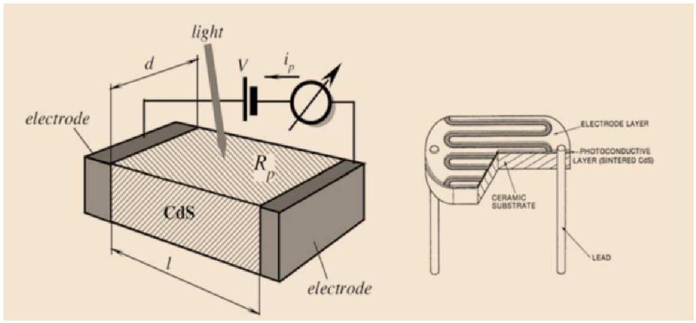
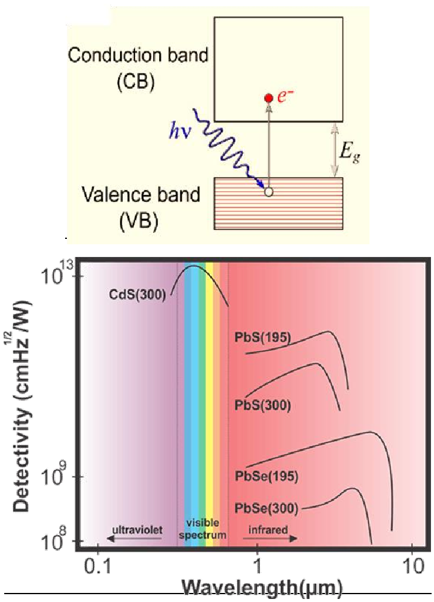
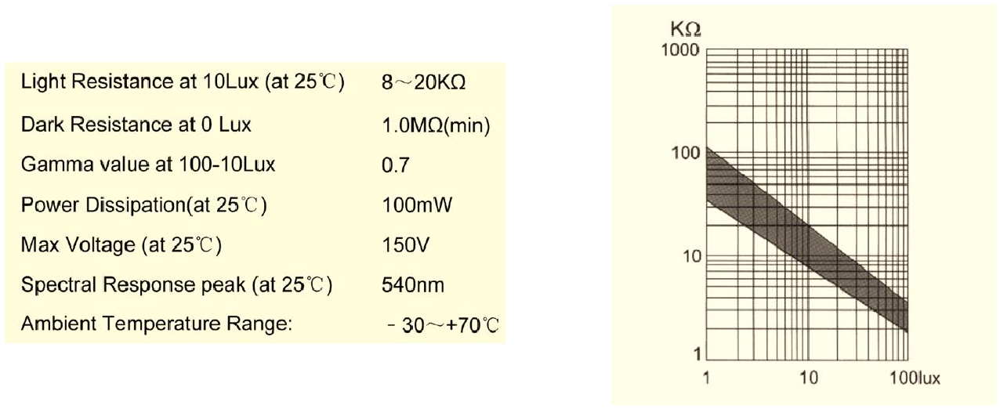
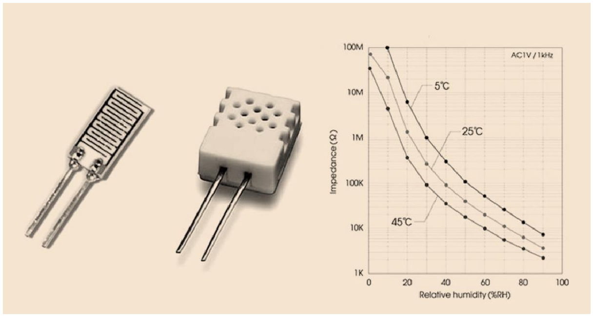

# Fotoresistències, higròmetres resistius i criteris de selecció

## 📑 Índice de Contenidos

- [1 Fotoresistències (LDR)](#1-fotoresistències-ldr)
  - [Mecanisme físic i resposta espectral](#mecanisme-físic-i-resposta-espectral)
  - [Model empíric, limitacions i aplicacions](#model-empíric-limitacions-i-aplicacions)
- [2 Higròmetres resistius](#2-higròmetres-resistius)
- [3 Recapitulació de la unitat](#3-recapitulació-de-la-unitat)

---

Sistemes de Mesura · **Unitat 5 — Sensors resistius** · Document 8 de 8

# Fotoresistències, higròmetres resistius i criteris de selecció

Dedicació estimada: 10 minuts

> [!NOTE] **Objectius d'aprenentatge**
>
> - Explicar l'efecte fotoelèctric intern i la condició energètica que ha de complir un fotó.
> - Relacionar el material d'una LDR amb la resposta espectral i interpretar-ne el model empíric.
> - Descriure el mecanisme de conducció d'un higròmetre resistiu i justificar l'excitació en alterna.
> - Comparar les famílies de sensors resistius i aplicar criteris de selecció.

## 1 Fotoresistències (LDR)

Una **fotoresistència** o LDR (*Light Dependent Resistor*) és un sensor resistiu de semiconductor fotosensible la resistència del qual **disminueix** amb la il·luminació. En foscor gairebé total el material és pràcticament aïllant i la resistència pot superar les desenes de megaohm; sota il·luminació intensa cau diversos ordres de magnitud, fins als kΩ o menys. El material actiu és de banda prohibida estreta —sulfur de cadmi (CdS) o seleniür de cadmi (CdSe)—, i les LDR són senzilles i barates però d'exactitud limitada.

*Figura: Figura 5.36 Estructura típica d'una LDR: substrat ceràmic aïllant, capa fina de semiconductor fotosensible i elèctrodes interdigitats en forma de serpentina.*

La geometria interdigitada fa dues coses alhora: *escurça* el camí de corrent entre elèctrodes i *augmenta* l'àrea de material fotosensible actiu dins d'un xip reduït. La resistència en foscor la determinen la resistivitat intrínseca i la relació longitud/secció del camí conductor.

### Mecanisme físic i resposta espectral

El mecanisme és un **efecte fotoelèctric intern**: un fotó amb energia

$$
E_{fot\acute{o}} = h\nu = \frac{h\,c}{\lambda} \qquad (5.49)
$$

pot promoure un electró de la banda de valència a la de conducció, sempre que la seva energia sigui **superior a l'energia de banda prohibida**  $E_{\text{gap}}$
, creant un parell electró-forat que contribueix a la conducció. En augmentar el flux de fotons absorbits creix el nombre de portadors i la resistència baixa. El procés competeix amb la **recombinació**, amb una constant de temps que depèn dels defectes i les impureses, i això explica la resposta temporal *lenta* davant de canvis bruscos de llum.

*Figura: Figura 5.37 Mecanisme de generació de portadors i resposta espectral de diversos materials, per a diferents longituds d'ona i temperatures (en kelvin, entre parèntesis).*

Hi ha una longitud d'ona òptima de resposta màxima i la corba decau als dos costats: per a  $\lambda$
 massa gran —energia inferior a  $E_{\text{gap}}$
— els fotons no poden promoure electrons i la resposta és pràcticament nul·la; per a  $\lambda$
 massa curta augmenten la recombinació i les absorcions superficials. El material determina on cau el màxim: el **CdS**, clàssic de les LDR del visible, té el pic prop de **540 nm**, a la zona verda, coincidint aproximadament amb la màxima sensibilitat de l'ull humà; el **CdSe** el desplaça cap a longituds d'ona més llargues i el **PbS** cap a l'infraroig. La LDR és, doncs, un **detector espectralment selectiu**, i cal considerar la longitud d'ona de la font de llum.

### Model empíric, limitacions i aplicacions

$$
R_{\text{LDR}} = A\,L^{-\gamma} \qquad (5.50)
$$

amb  $L$
 la intensitat lumínica en lux i  $A$
 i  $\gamma$
 constants *pròpies de cada sensor*, amb toleràncies molt elevades: cal calibrar individualment cada dispositiu.

*Figura: Figura 5.38 Exemple d'especificacions tècniques d'una LDR comercial. Les fitxes donen el rang de resistència a una il·luminació de referència —per exemple de 8 a 20 kΩ a 10 lux, cosa que il·lustra la dispersió entre dispositius del mateix model— i la resistència de foscor, a 0 lux, de l'ordre d'1 MΩ o superior.*

Com que (5.50) prediu resistència infinita en foscor, aquesta es modela amb el paral·lel entre la resistència de foscor i l'expressió. Les fitxes especifiquen també la **potència màxima dissipable** i la **tensió màxima en borns**, ja que la LDR és un element resistiu excitat elèctricament, i les **temperatures de funcionament**. Es llegeix habitualment **en contínua**, amb un divisor de tensió.

Les limitacions són quatre: **no linealitat forta**; **toleràncies grans**, que obliguen a calibrar si es volen intensitats absolutes; **dependència amb la temperatura**, per l'activació tèrmica de portadors i la mobilitat; i **resposta lenta**, de mil·lisegons a segons, *més lenta* que la de fotodíodes o fototransistors. Les LDR no són, doncs, l'opció per a mesura ràpida ni precisa de llum, però són excel·lents per a detecció qualitativa de clar i fosc. Un divisor de tensió amb la LDR detecta quan la il·luminació travessa un **llindar**, activant un comparador: és la base de la **il·luminació automàtica** —fanals que s'encenen al vespre—, dels **detectors de nivell de líquid tèrbol** i de les **barreres lumíniques** d'alarma, on la interrupció del feix produeix una *pujada* brusca de resistència perquè el sensor passa d'il·luminat a fosc.

## 2 Higròmetres resistius

Els **higròmetres resistius** mesuren la **humitat relativa** (HR) a partir de la variació de resistència d'un material dielèctric higroscòpic: certs polímers on l'aigua penetra formant camins conductors microscòpics, i sals higroscòpiques. En sec la resistivitat és molt alta; quan augmenta la HR, les molècules adsorbides **faciliten camins iònics de conducció** i la resistivitat cau dràsticament. El que es mesura és, doncs, un canvi de *conductivitat efectiva*, de diversos ordres de magnitud. El sentit és **més humitat, menys resistència**, i la condició perquè funcioni és que el material pugui absorbir l'aigua.

*Figura: Figura 5.39 Exemple d'higròmetre resistiu. A l'esquerra, la configuració interdigitada bàsica sobre substrat aïllant rígid; al centre, l'encapsulament perforat que exposa el material higroscòpic a la humitat ambient; a la dreta, corbes típiques de relació HR-resistència amb la seva dependència de la temperatura.*

Els elèctrodes interdigitats augmenten la zona de contacte i faciliten mesurar canvis de conductivitat en una capa fina, i **formen també una capacitat paràsita**: molts fabricants especifiquen la component resistiva i la capacitiva. L'higròmetre es llegeix amb un senyal **altern** —per exemple 1 kHz— mesurant la part real de la impedància, cosa que redueix l'electròlisi i la polarització que apareixerien en contínua (unitat 8). El **rang de resistència és molt ampli**, de desenes de megaohm en sec a unitats de kΩ amb HR propera al 100 %: permet detectar humitats amb guanys modestos, però obliga a un circuit de rang dinàmic ampli.

La relació entre resistència i HR és fortament no lineal i depèn del material i de la temperatura, i **no hi ha un model universal senzill**, ni tan sols del tipus llei de potència de les LDR: els fabricants donen corbes  $R(\mathrm{HR})$
 per a diverses temperatures. Cal calibrar amb valors d'HR coneguts —un higròmetre de referència o solucions salines saturades— ajustant models empírics o interpolant sobre **taules de calibratge**. Per a una mateixa HR, la resistència varia fortament amb la temperatura per dues raons que s'acumulen: l'augment de  $T$
 incrementa la conductivitat iònica de l'aigua adsorbida, i la definició d'HR —quocient entre pressió parcial de vapor i pressió de saturació— fa que el contingut d'aigua per volum d'aire canviï amb  $T$
. A HR constant, doncs, escalfar acostuma a *disminuir* la resistència, i la compensació tèrmica continua sent necessària encara que la humitat sigui *relativa*: calen un **sensor de temperatura auxiliar** o un mòdul amb correcció interna.

Les limitacions són el **temps de resposta lent** —la difusió de l'aigua pot trigar de segons a minuts—, la **histèresi** entre cicles d'humitat creixent i decreixent, l'**envelliment** del dielèctric i la **contaminació** per vapors orgànics, pols o aerosols, que altera l'absorció i el calibratge i és una causa principal de deriva. Cal col·locar el sensor en un lloc representatiu però **protegit de la condensació directa** i recalibrar periòdicament. Mesura **humitat relativa**; la pressió absoluta de vapor requereix models addicionals. S'utilitzen en estacions meteorològiques, climatització, indústria alimentària i farmacèutica, i museus i arxius.

## 3 Recapitulació de la unitat

Darrere del terme "sensor resistiu" hi ha fenòmens molt diversos: la mobilitat dels electrons d'un metall (RTD), el nombre de portadors d'un semiconductor (termistors), la geometria i la resistivitat sota deformació (galgues), el camí i l'orientació d'espín dels electrons (magnetoresistències), la fotogeneració de portadors (LDR) i la conductivitat iònica (higròmetres). Malgrat això, **tots codifiquen el mesurand en el valor d'una resistència**: cal excitar-la, convertir-ne el canvi en tensió o corrent i digitalitzar-lo.

Cap família no és lineal pel sol fet d'ampliar el marge: la no linealitat és una propietat del mecanisme físic. Triar un sensor és decidir **quin sacrifici s'accepta**: els RTD de platí donen exactitud i intercanviabilitat a preu alt; les NTC, molta sensibilitat i rapidesa a preu baix amb no linealitat exponencial; les galgues metàl·liques, robustesa i linealitat amb poca sensibilitat, i les semiconductores el contrari; les GMR i TMR, grans canvis amb camps petits però amb fabricació complexa i saturació; les LDR i els higròmetres, senzillesa i preu baix amb toleràncies grans i lentitud.

Algunes regles travessen la unitat. Una sensibilitat elevada **no garanteix exactitud**, i com més gran és la dispersió entre unitats més important esdevé el calibratge individual, mentre que una intercanviabilitat alta l'estalvia. Les toleràncies del sensor i del condicionament formen part de la **incertesa global** (unitat 2). L'excitació en corrent o en tensió afecta alhora la sensibilitat i la potència dissipada. La **resposta dinàmica** la limita el fenomen físic —difusió tèrmica, difusió d'aigua, recombinació—, no la part elèctrica. I la compensació de magnituds d'influència es fa amb sensors auxiliars, configuracions diferencials o calibratge, amb el **pont de Wheatstone** aplicable a galgues, RTD i magnetoresistències.

> [!TIP] **Síntesi**
>
> Una LDR és una fotoresistència de semiconductor —CdS amb pic prop de 540 nm; CdSe o PbS cap a l'infraroig— on els fotons amb energia superior a la banda prohibida generen parells electró-forat i redueixen la resistència. Els elèctrodes interdigitats augmenten l'àrea activa i escurcen el camí de corrent. El model és  $R=AL^{-\gamma}$
> amb paràmetres propis de cada dispositiu; les limitacions són no linealitat, dispersió, deriva tèrmica i lentitud. Un higròmetre resistiu mesura HR perquè l'aigua absorbida crea camins iònics i redueix la resistivitat; s'excita en alterna per evitar electròlisi, té component capacitiva i pateix histèresi, envelliment i contaminació. Totes les famílies codifiquen el mesurand en una resistència que cal excitar, llegir i condicionar, i triar-ne una és un compromís entre exactitud, sensibilitat, cost, velocitat i robustesa.

[← 7. Magnetoresistències](07_Unitat5_Magnetoresistencies.md)

---

## 📐 Formulario Resumen de Ecuaciones

| Nº / Ref | Expresión Matemática |
| :---: | :--- |
| **(5.49)** | $E_{fot\acute{o}} = h\nu = \frac{h\,c}{\lambda}$ |
| **(5.50)** | $R_{\text{LDR}} = A\,L^{-\gamma}$ |