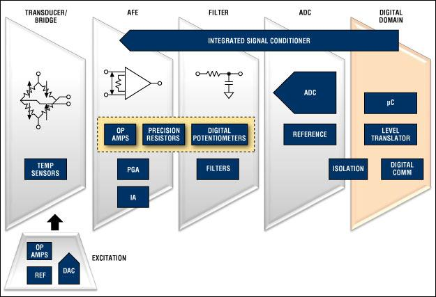
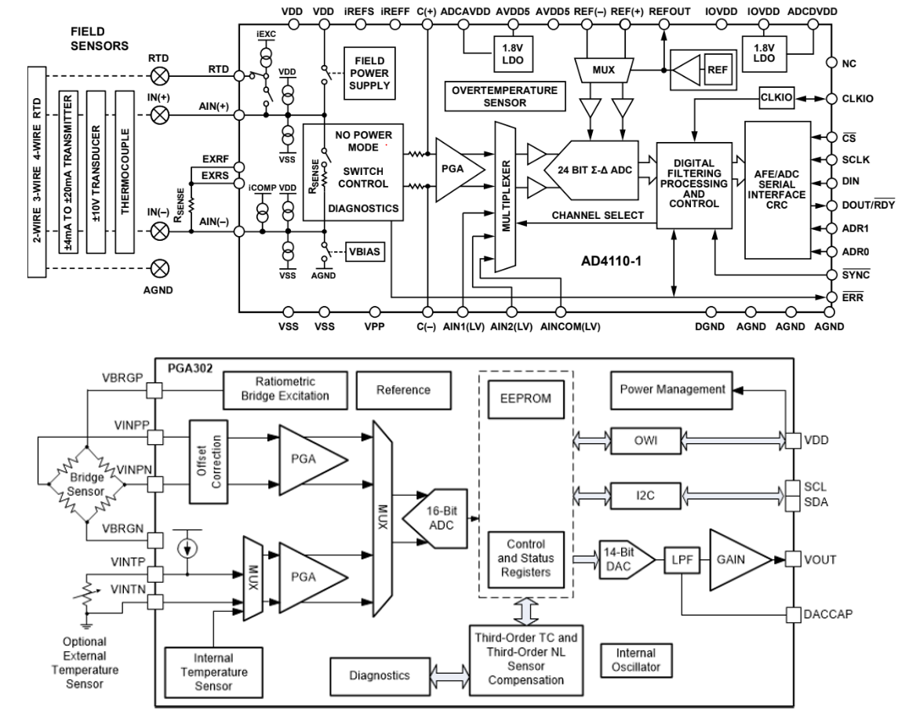

# La cadena de condicionament en contínua

## 📑 Índice de Contenidos

- [1 Sensors de sortida en contínua](#1-sensors-de-sortida-en-contínua)
- [2 L'objectiu: adequar el senyal a l'ADC](#2-lobjectiu-adequar-el-senyal-a-ladc)
- [3 Blocs de la cadena](#3-blocs-de-la-cadena)
- [4 AFE monolítics comercials](#4-afe-monolítics-comercials)
- [5 Model del sensor i objecte de la mesura](#5-model-del-sensor-i-objecte-de-la-mesura)
- [6 Els compromisos que cal tancar](#6-els-compromisos-que-cal-tancar)

---

Sistemes de Mesura · **Unitat 6 — Condicionament de sensors en contínua** · Document 1 de 6

# La cadena de condicionament en contínua

Dedicació estimada: 9 minuts

> [!NOTE] **Objectius d'aprenentatge**
>
> - Delimitar què és un sensor de sortida en contínua i quins criteris de disseny en deriven.
> - Enunciar l'objectiu del condicionador en termes del marge dinàmic de l'ADC.
> - Identificar els blocs de la cadena de condicionament i la funció de cadascun.
> - Escriure el model lineal d'un sensor resistiu i justificar per què interessa  $\Delta R$
> i no  $R_0$
>.
> - Enumerar les contribucions a la incertesa global i els compromisos que les lliguen.

Aquesta unitat és la primera d'un bloc de tres dedicats al condicionament de sensors: el conjunt de circuits que transformen la sortida d'un sensor en un senyal apte per a l'adquisició digital. Aquí es tracta el cas de **sortida en contínua**. Els sensors reactius i el condicionament en alterna es veuen a les unitats 7 i 8, i els condicionadors singulars per a sensors de sensibilitat molt baixa, a la unitat 10.

## 1 Sensors de sortida en contínua

Un sensor té **sortida en contínua** quan la magnitud elèctrica que proporciona —tensió, corrent o resistència equivalent— té un contingut predominantment de baixa freqüència: des de senyals estrictament constants fins a variacions per sota de desenes o centenes d'hertzs. Si el mesurand es manté constant, la sortida elèctrica roman idealment constant; quan varia, ho fa sense components ràpides que exigeixin gran amplada de banda al condicionador.

Aquesta delimitació determina el criteri de disseny. En contínua el disseny se centra en la **precisió DC, la deriva, el soroll de baixa freqüència i l'autoescalfament**, no en la resposta en freqüència a l'escala de kHz o MHz. Quan el sensor genera senyal altern, o quan es decideix excitar-lo en alterna per motius metrològics —sensor reactiu, reducció de derives, detecció síncrona—, els criteris són radicalment diferents: amplada de banda, fase, resposta freqüencial d'amplificadors i filtres i limitacions en freqüència dels interruptors. El camp d'aquesta unitat inclou els sensors resistius excitats amb tensió o corrent continus —galgues extensomètriques, ponts de pressió, RTD, termistors NTC, LDR— i els sensors modelables com a fonts de tensió o de corrent continu.

## 2 L'objectiu: adequar el senyal a l'ADC

El condicionament en contínua té com a objectiu final proporcionar una **tensió analògica** que variï amb el mesurand de manera que, quan aquest recorre el seu rang d'interès, la tensió de sortida s'acosti tant com sigui possible al marge dinàmic utilitzable de l'ADC. D'això en deriven tres conseqüències immediates:

- La cadena ha de **convertir corrent o resistència a tensió**, perquè la majoria d'ADC treballen amb entrades de tensió.
- El **guany global** s'ha de dimensionar perquè el senyal ocupi una fracció elevada del rang de l'ADC, evitant saturacions però reduint el nombre de bits perduts. Un guany més gran no millora sempre la mesura: també amplifica offset, soroll i deriva, i pot excedir el rang admissible.
- Cal repartir les **incerteses** entre sensor, electrònica i ADC perquè cap bloc degradi innecessàriament la precisió global.

## 3 Blocs de la cadena

*Figura: Figura 6.1 Cadena de condicionament de sensors en contínua.*

La **primera etapa de precondicionament** transforma el paràmetre elèctric del sensor en una tensió contínua, generalment diferencial. Fa servir una **excitació** derivada d'una referència de tensió amb amplificadors operacionals, o generada per un convertidor digital a analògic. Al sensor se li injecta un corrent associat a aquesta excitació, o bé es munta en un pont de resistències o en un divisor de tensió. L'excitació ha de ser **tan estable com sigui possible**: qualsevol canvi en ella s'interpreta com un canvi del mesurand. A més, tots els components d'aquesta etapa poden derivar amb la temperatura, i per això no és estrany monitorar la temperatura del condicionador per corregir-ne les derives.

La segona etapa, el **front end analògic** (AFE) pròpiament dit, té al nucli un amplificador diferencial d'altes prestacions: un circuit que amplifica la diferència entre dos terminals i rebutja la component comuna a tots dos. Habitualment és un **amplificador d'instrumentació** (IA), d'impedància d'entrada molt elevada, per limitar l'efecte de càrrega sobre el sensor. Si l'amplificador es comparteix entre diversos canals de mesura, sol ser un **amplificador de guany programable** (PGA), i la selecció de canal es fa amb **multiplexors analògics**. Sigui quin sigui l'amplificador, es construeix sobre amplificadors operacionals amb limitacions en contínua que cal considerar; a més, el **rebuig del mode comú** no depèn només de l'amplificador sinó també de disposar de resistències d'alta precisió.

Un cop amplificada la tensió, la cadena la filtra, la digitalitza i hi opera; aquests darrers blocs no són objectiu del curs.

## 4 AFE monolítics comercials

*Figura: Figura 6.2 Dos condicionadors en contínua comercials: un AFE d'alta integració d'Analog Devices (a dalt) i el PGA302 de Texas Instruments (a baix).*

L'**AD4111** d'Analog Devices supera els 10 dòlars en compres de més de 1000 unitats: descartat en equips de consum, atractiu en sèries curtes amb mesures acurades i desenvolupament ràpid. La part digital arrenca amb un **ADC sigma-delta de 24 bits**, amb processament sincronitzat per rellotge extern i comunicació SPI. L'analògica admet RTD a dos, tres o quatre fils, llaços 4 mA – 20 mA, entrades de ±10 V i termoparells; excita els sensors amb fonts de corrent o de tensió, fa caure els corrents sobre resistències de sensat internes o externes i incorpora diagnòstic per comparació amb tensions generades internament. El nucli que condiciona les prestacions és un **PGA**, envoltat d'interruptors que adrecen els senyals.

El **PGA302** de Texas Instruments és més barat —poc més de 2 dòlars— i menys versàtil: està dedicat a sensors en **ponts de resistències**. Porta un ADC de 16 bits, compensació de derives amb sensor de temperatura intern o extern, i sortida digital (I²C o OWI) o analògica per un DAC de 14 bits, filtre passa-baixes i amplificador per quatre que compensa la diferència de bits entre ADC i DAC. Proporciona l'alimentació del pont, en mesura la sortida diferencial i compensa els errors de zero de l'amplificador. Com que la referència interna pot derivar, hi fa servir una **mesura ratiomètrica**: la mateixa tensió que excita el pont serveix de referència a l'ADC.

## 5 Model del sensor i objecte de la mesura

Per a molts sensors resistius de mesura —galgues, RTD, termistors en rang reduït, LDR en zones acotades— la dependència amb la magnitud física  $x$
 s'escriu com

$$
R_x(x) = R_0\,f(x) \approx R_0\,(1+\alpha x) \qquad (6.1)
$$

on  $R_0$
 és la resistència per al valor de referència  $x=0$
 i  $\alpha$
 és la **sensibilitat relativa**. La linealització val quan el marge de  $x$
 és prou petit o quan  $f(x)$
 és suau; fora d'aquestes condicions introdueix un **error de model** que forma part de la incertesa i que pot superar la contribució de moltes altres fonts. Cal, doncs, avaluar-lo explícitament i, si cal, recórrer a models de grau superior, a linealització analògica o a correcció digital.

En la majoria d'aplicacions l'objectiu **no** és conèixer  $R_x$
 en valor absolut, sinó mesurar petits canvis  $\Delta R = R_x - R_0$
, sovint de l'ordre de  $10^{-3}R_0$
 o menys. D'això en surten tres conseqüències de disseny:

- El condicionador s'ha de dimensionar per ser sensible a  $\Delta R$
   mantenint-se robust davant la incertesa en  $R_0$
   —tolerància del sensor, deriva, dispersió entre dispositius—, que no desapareix pel fet de connectar-lo a un circuit.
- Interessen les topologies que **anul·len la sortida per a  $x=0$**, perquè permeten aplicar guanys elevats sense saturar amb la component contínua de fons.
- L'ús de **més d'un sensor** permet combinacions que eliminen el terme associat a  $R_0$
, reforcen la dependència amb  $\Delta R$
   i compensen pertorbacions; alternativament, es pot mesurar directament la pertorbació i corregir-la per càlcul.

## 6 Els compromisos que cal tancar

Qualsevol circuit que mesuri una resistència hi ha de fer circular corrent o imposar-hi tensió, de manera que el sensor dissipa  $P = I^2R_x$
 o  $P = V^2/R_x$
 i s'escalfa. L'**autoescalfament** és un error sistemàtic, crític quan el sensor mesura precisament la temperatura del medi, i pot alterar les propietats mecàniques de l'estructura on s'adhereix una galga. Limitar el corrent o la tensió d'acord amb el fabricant, encara que costi sensibilitat, forma part del disseny.

La **sensibilitat efectiva** no depèn només del sensor: també del guany del condicionador i del rang de l'ADC. Massa baixa, dominen el soroll i l'error de quantització; massa alta, apareixen saturacions o un ús ineficient del rang. La incertesa total combina la del **sensor** —no-linealitat i dispersió entre dispositius—, la del **condicionador** —errors de guany, biaixos, soroll, efectes de càrrega, resistències paràsites, autoescalfament, derives tèrmiques— i la de l'**ADC** —resolució i no-linealitat integral. Els blocs interactuen, i per això la revisió final del disseny ha de considerar la càrrega que un amplificador imposa a un pont, la propagació d'offsets, les derives de les referències i els errors de commutació. Una mesura **traçable** exigeix precisament això: relacionar cada bloc electrònic amb el seu efecte sobre la incertesa.

La integració en un AFE monolític no dispensa de revisar les especificacions d'offset, soroll, guany i deriva. I el calibratge, que corregeix el que és estable, no elimina les derives tèrmiques posteriors; en un sistema multicanal, cada canal pot requerir les seves pròpies constants.

> [!TIP] **Síntesi**
>
> Un sensor de sortida en contínua té contingut de baixa freqüència, cosa que trasllada el disseny cap a la precisió DC, la deriva, el soroll de baixa freqüència i l'autoescalfament. L'objectiu del condicionador és lliurar a l'ADC una tensió que ocupi una fracció elevada del seu marge dinàmic sense saturar-lo, la qual cosa exigeix convertir resistència o corrent a tensió i dimensionar el guany. La cadena consta d'una etapa d'excitació i conversió, un front end analògic amb amplificador diferencial o d'instrumentació, multiplexors i PGA si hi ha diversos canals, i finalment filtratge i conversió A/D. Els sensors resistius es modelen com  $R_x = R_0(1+\alpha x)$
> i el que interessa mesurar és  $\Delta R$
>, no  $R_0$
>. La incertesa global suma sensor, condicionador i ADC, i les interaccions entre blocs.

[2. Conversió resistència–tensió: cables, fonts de corrent, divisor i pont →](02_Unitat6_Conversio_resistencia_tensio.md)

---

## 📐 Formulario Resumen de Ecuaciones

| Nº / Ref | Expresión Matemática |
| :---: | :--- |
| **(6.1)** | $R_x(x) = R_0\,f(x) \approx R_0\,(1+\alpha x)$ |