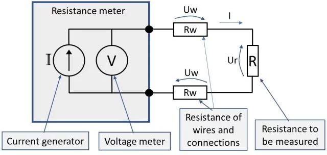
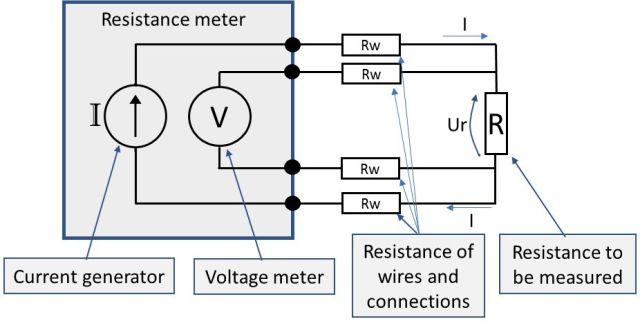
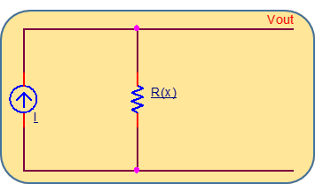
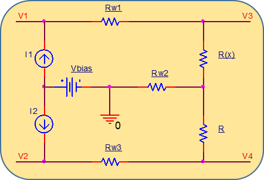
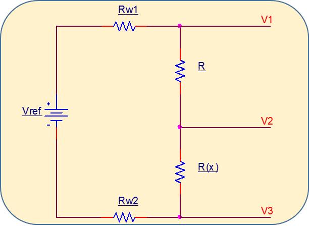
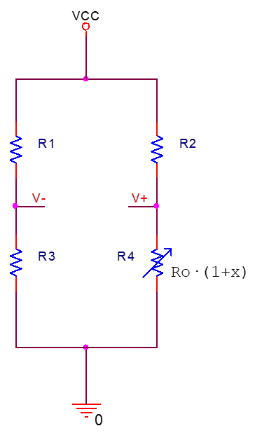

# Conversió resistència–tensió: cables, fonts de corrent, divisor i pont

## 📑 Índice de Contenidos

- [1 Resistència dels cables: mesura a 2, 3 i 4 fils](#1-resistència-dels-cables-mesura-a-2-3-i-4-fils)
- [2 Conversió amb font de corrent](#2-conversió-amb-font-de-corrent)
- [3 Divisor de tensió](#3-divisor-de-tensió)
- [4 El pont de Wheatstone](#4-el-pont-de-wheatstone)
- [5 Ponts amb diversos sensors](#5-ponts-amb-diversos-sensors)

---

Sistemes de Mesura · **Unitat 6 — Condicionament de sensors en contínua** · Document 2 de 6

# Conversió resistència–tensió: cables, fonts de corrent, divisor i pont

Dedicació estimada: 11 minuts

> [!NOTE] **Objectius d'aprenentatge**
>
> - Quantificar el biaix que la resistència dels cables introdueix i decidir entre 2, 3 i 4 fils.
> - Calcular la sensibilitat de la conversió amb font de corrent i explicar-ne la limitació dominant.
> - Justificar per què dues fonts aparellades anul·len la component contínua de fons.
> - Deduir la sensibilitat del divisor de tensió i localitzar-ne el màxim.
> - Analitzar el pont de Wheatstone amb el paràmetre  $k$
> i el compromís entre sensibilitat, linealitat, consum i mode comú.

La conversió de resistència a tensió es fa amb un dels tres mètodes clàssics de mesura de resistència: **injectar un corrent** conegut i mesurar la caiguda de tensió, **muntar el sensor en un divisor de tensió** amb una font de tensió i una resistència fixa, o **incorporar-lo a un pont de resistències**, que fa servir dos divisors i lliura una sortida diferencial. El pont és, per la seva versatilitat, el més emprat en mesures de precisió.

> [!WARNING] **Convenció de notació**
>
> S'escriu  $R_x = R_0(1+\alpha x)$
> quan interessa mantenir explícita la sensibilitat relativa  $\alpha$
> respecte de la magnitud física, i  $R_x = R_0(1+x)$
> quan  $x$
> designa **directament la variació relativa de resistència**, que és la forma que s'adopta en l'anàlisi dels ponts. Els resultats són els mateixos amb el canvi  $x \rightarrow \alpha x$
>.

## 1 Resistència dels cables: mesura a 2, 3 i 4 fils

Quan el sensor és lluny de l'instrument, la resistència vista no és només la seva, sinó la suma amb les resistències de cables, connectors i soldadures del camí del corrent:  $R_{\text{mesura}} = R_x + R_{w,equiv}$
, on  $R_{w,equiv}$
 suma tots els conductors pels quals circula corrent, exclòs el sensor. És un **biaix sistemàtic** que es propaga al mesurand a través del model  $R_x(x)$
. Encara que en valor absolut siguin fraccions d'ohm o uns quants ohms, l'impacte és gran quan el sensor té un **valor baix**: galgues de 120 Ω o 350 Ω, Pt-100 amb cables llargs on uns quants ohms equivalen a desenes de graus aparents, o termistors on una petita variació s'interpreta com un canvi considerable de temperatura. **Com més baixa és la resistència nominal, més crític és l'error de cable**.

*Figura: Figura 6.3 Mesura a 2 fils: el mateix parell de conductors injecta el corrent i serveix per mesurar la tensió.*

En la **mesura a 2 fils**, el corrent  $I$
 circula per les tres resistències en sèrie i la tensió als terminals externs val

$$
V_{\text{mes}} = I\,(R + 2R_w) \qquad (6.2)
$$

$$
R_{\text{mes}} = \frac{V_{\text{mes}}}{I} = R + 2R_w \qquad (6.3)
$$

L'error és exactament  $2R_w$
: les dues caigudes de cable **se sumen**, no es compensen per simetria. Es pot mitigar amb calibratge —mesurar en curtcircuit i restar—, però només val si la resistència dels cables es manté estable amb el temps i amb la temperatura, cosa que no sempre es pot garantir.

*Figura: Figura 6.4 Mesura a 4 fils: camí de corrent i camí de mesura de tensió separats.*

En la **mesura a 4 fils** un parell de cables injecta el corrent i un altre parell, independent, mesura la tensió. La clau és que l'instrument de tensió té una **impedància d'entrada molt elevada**: pel parell de mesura circula corrent pràcticament nul i la caiguda en aquests cables és negligible. Aleshores

$$
R_{\text{mes}} = \frac{V}{I} = R \qquad (6.4)
$$

i l'error de cable s'elimina a la pràctica sempre que la impedància d'entrada del voltímetre sigui molt superior a  $R_w$
. És l'estàndard en metrologia i en sistemes industrials d'alta precisió, sobretot amb sensors llunyans, incertesa exigent en valor absolut o cables sotmesos a condicions ambientals variables.

La **mesura a 3 fils** és el compromís habitual en RTD muntats en pont: un extrem del sensor es connecta amb dos cables i l'altre amb un tercer, de manera que l'efecte dels cables es reparteix entre dues branques del pont. No l'elimina —no equival a una mesura ideal a 4 fils en qualsevol condició de cablejat i simetria—, però el redueix a nivells acceptables en moltes aplicacions industrials. L'elecció depèn de quatre factors, no només del cost del cablejat:

| Factor | Efecte |
|:--- |:--- |
| Valor nominal del sensor | Com més baix, més crític; centenars d'ohms o menys demanen 3 o 4 fils |
| Longitud i secció dels cables | Cables llargs o prims tenen més resistència; distàncies grans demanen 3 o 4 fils |
| Exactitud requerida | Metrologia i control crític porten naturalment cap als 4 fils |
| Cost i complexitat | Amb requisits moderats i calibratge in situ, 2 fils pot ser acceptable |

## 2 Conversió amb font de corrent

*Figura: Figura 6.5 Conversió resistència–tensió amb una font de corrent.*

El mètode més directe injecta un corrent conegut i mesura la tensió que apareix als borns del sensor. Aplicant la llei d'Ohm amb el model lineal,

$$
V_{\text{out}}(x) = I\,R_x(x) = I\,R_0\,(1+\alpha x) \qquad (6.5)
$$

$$
S_V = \frac{\partial V_{\text{out}}}{\partial x} = I\,R_0\,\alpha \qquad (6.6)
$$

La sortida és **proporcional** a la resistència del sensor. La sensibilitat creix amb  $I$
, amb  $R_0$
 i amb  $\alpha$
, però cada increment té el seu preu: més corrent implica més autoescalfament, un  $R_0$
 molt elevat pot limitar el rang útil de tensió i augmentar el soroll tèrmic, i  $\alpha$
 ve fixat pel sensor i pel rang de treball. Es combina habitualment amb la tècnica de 4 fils.

La limitació dominant apareix quan les variacions relatives de  $R_x$
 són molt petites, com en galgues o RTD en rangs estrets. Aleshores  $V_{\text{out}}$
 té una **component contínua gran**  $V_0 = I R_0$
 amb una variació  $\Delta V = I R_0 \alpha \Delta x$
 molt petita superposada. Qualsevol incertesa relativa del corrent —tolerància de la font, deriva, soroll— es tradueix directament en una incertesa proporcional sobre  $V_{\text{out}}$
 que es confon amb un canvi de  $x$
.

*Figura: Figura 6.6 Conversió resistència–tensió amb dues fonts de corrent aparellades.*

La solució és fer servir **dues fonts de corrent aparellades**:  $I_1$
 alimenta el sensor  $R_x$
 i  $I_2 \approx I_1 = I$
 alimenta una resistència de referència  $R$
 de valor fix, sovint similar a  $R_0$
. La sortida útil és la diferència entre les dues branques:

$$
V_3 - V_4 \approx I\,(R_x - R) \qquad (6.7)
$$

La sortida és proporcional a la **diferència**  $R_x - R$
 i és **nul·la** per a  $x=0$
 quan  $R = R_0$
. En mesura a 2 fils, si els cables són del mateix tipus i longitud  $(R_{w1}\approx R_{w2})$
, els seus termes es compensen parcialment:

$$
V_1 - V_2 \approx I\,(R_{w1} + R_x - R - R_{w2}) \approx I\,(R_x - R) \qquad (6.8)
$$

L'avantatge és que la component contínua gran desapareix *sense* restar digitalment valors grans, cosa que permet aplicar guanys elevats sense saturar i millora la resolució efectiva. El mètode de fonts de corrent, en qualsevol de les dues versions, encaixa bé amb sensors de variació relativa gran —termistors NTC, LDR, sensors de posició de marge ampli— i amb integrats que ofereixen fonts programables. Per a variacions relatives petites (galgues, RTD de precisió) sol ser preferible el pont.

## 3 Divisor de tensió

*Figura: Figura 6.7 Conversió resistència–tensió amb divisor de tensió.*

$$
V_{\text{out}} = V_{\text{ref}}\,\frac{R_x}{R+R_x} \qquad (6.9)
$$

$$
V_{\text{out}}(x) = V_{\text{ref}}\,\frac{R_0(1+\alpha x)}{R+R_0(1+\alpha x)} \qquad (6.10)
$$

La relació és **clarament no lineal** en  $x$
, que apareix al numerador i al denominador. La no-linealitat es pot acceptar, restringir a una zona on la corba s'aproximi bé per una recta, o corregir amb topologies passives o digitalment. Derivant,

$$
S = \frac{\partial V_{\text{out}}}{\partial x} = V_{\text{ref}}\cdot\frac{R_0\,\alpha\,R}{\left(R+R_0(1+\alpha x)\right)^2} \qquad (6.11)
$$

que **depèn de  $x$** i decreix a mesura que  $R_x$
 s'allunya del valor òptim. Per a  $x$
 petit la sensibilitat és màxima quan  $R = R_0$
, és a dir, quan la resistència fixa iguala la del sensor al punt de referència:

$$
S_{\max} = V_{\text{ref}}\cdot\frac{\alpha}{4} \qquad (6.12)
$$

La potència dissipada pel sensor val

$$
P_x \approx \frac{V_{\text{ref}}^2\,R_x}{(R+R_x)^2} \qquad (6.13)
$$

i quan  $R \approx R_x \approx R_0$
 és de l'ordre de  $V_{\text{ref}}^2/(4R_0)$
. Augmentar  $V_{\text{ref}}$
 augmenta la sensibilitat *i* l'autoescalfament: el compromís és directe. A la pràctica es tria  $R$
 perquè el sensor treballi en zona segura de potència, la sensibilitat sigui adequada a l'ADC i la no-linealitat sigui compatible amb l'exactitud requerida o amb la correcció digital; amb termistors NTC,  $R$
 es pot escollir per maximitzar la linealitat al voltant d'una temperatura d'interès.

Amb cables llargs,  $V_{\text{out}}$
 depèn també de  $R_{w1}$
 i  $R_{w2}$
. Una millora senzilla és mesurar amb dos cables addicionals sense corrent la **tensió real** que arriba al divisor: així s'elimina l'efecte de les caigudes de cable i es compensa una  $V_{\text{ref}}$
 mal regulada. La relació continua essent no lineal: conèixer la tensió aplicada no substitueix el model del sensor.

## 4 El pont de Wheatstone

Tant la font de corrent simple com el divisor generen una component contínua significativa per a  $x=0$
, sobre la qual se superposa una variació petita. Els **ponts de resistències** permeten dissenyar la sortida perquè sigui nul·la al valor de referència i creixi amb  $x$
. Això permet aplicar guanys elevats sense saturar, redueix la sensibilitat a errors absoluts de l'excitació i facilita integrar diversos sensors. És la topologia més utilitzada a la primera etapa de condicionament de sensors resistius de precisió: galgues, cèl·lules de càrrega, transductors de pressió.

*Figura: Figura 6.8 Pont de Wheatstone: dos divisors de tensió en paral·lel amb sortida diferencial entre els nodes centrals.*

Són **dos divisors de tensió en paral·lel** alimentats per  $V_{\text{cc}}$
, amb sortida **diferencial** entre els punts centrals. Una o diverses resistències són sensors; a la figura,  $R_4 = R_0(1+x)$
.

$$
V_- = V_{\text{cc}}\,\frac{R_3}{R_1+R_3} \qquad (6.14)
$$

$$
V_+ = V_{\text{cc}}\,\frac{R_4}{R_2+R_4} \qquad (6.15)
$$

$$
V_{\text{out}} = V_+ - V_- = V_{\text{cc}}\left(\frac{R_4}{R_2+R_4}-\frac{R_3}{R_1+R_3}\right) \qquad (6.16)
$$

La **condició d'equilibri** a  $x=0$
 és la igualtat de les relacions de divisió de les dues branques, que operant es redueix a

$$
\frac{R_2}{R_0} = \frac{R_1}{R_3} \qquad (6.17)
$$

Es tria  $R_2 = k\,R_0$
, cosa que obliga  $R_1 = k\,R_3$
, i en molts dissenys  $R_3 = R_0$
. Amb  $R_4 = R_0(1+x)$
 s'obté

$$
V_{\text{out}} = V_{\text{cc}}\cdot\frac{k\,x}{(k+1+x)\,(k+1)} \qquad (6.18)
$$

que **no és lineal** amb  $x$
. Un únic paràmetre,  $k$
, controla simultàniament la sensibilitat, el corrent de consum, la tensió en mode comú i la linealitat. Per a  $k+1 \gg x$
 i després per a  $k \gg 1$
:

$$
V_{\text{out}} \approx V_{\text{cc}}\cdot\frac{k\,x}{(k+1)^2} \qquad (6.19)
$$

$$
V_{\text{out}} \approx V_{\text{cc}}\cdot\frac{x}{k} \qquad (6.20)
$$

El corrent per branca en condicions quasi equilibrades i la tensió en **mode comú** a la sortida —el valor mitjà dels dos nodes— valen

$$
I \approx \frac{V_{\text{cc}}}{(k+1)\,R_0} \qquad (6.21)
$$

$$
V_{\text{CM}} \approx \frac{V_{\text{cc}}}{k+1} \qquad (6.22)
$$

Una tensió en mode comú elevada es converteix en **error residual** proporcional a  $V_{\text{CM}}/CMRR$
 quan l'amplificador que llegeix el pont té un rebuig del mode comú finit, cosa que sempre passa. Dissenyar el pont perquè el mode comú sigui petit és, doncs, una estratègia directa per reduir l'error de zero del sistema.

Comparant l'expressió exacta amb l'aproximació lineal s'obté l'**error de no-linealitat**:

$$
E_l = V_{\text{cc}}\cdot\frac{k\,x^2}{(k+1)^2\,(k+1+x)} \qquad (6.23)
$$

$$
E_l \approx V_{\text{cc}}\cdot\frac{x^2}{k^2} \qquad (k \gg 1+x) \qquad (6.24)
$$

és a dir, l'error de no-linealitat **decau** aproximadament com  $\frac{1}{k}^2$
. Multiplicar  $k$
 per 10 el divideix per 100, al preu de dividir per 10 la sensibilitat, però també dividint per 10 el consum de corrent i la tensió en mode comú. Aquest és el compromís central del disseny del pont:

| Magnitud | En augmentar  $k$ | Conseqüència |
|:--- |:--- |:--- |
| Sensibilitat | disminueix  $(\propto \frac{1}{k})$ | Cal més guany posterior |
| Error de no-linealitat | disminueix  $(\propto \frac{1}{k}^2)$ | Millor linealitat |
| Corrent de consum | disminueix | Menys autoescalfament del sensor |
| Tensió en mode comú | disminueix | Menys error per CMRR finit |

Sensibilitat i linealitat, per tant, **no milloren alhora**. En aplicacions on la linealitat és crítica —cèl·lules de càrrega per a pesatge legalment controlat— convé un  $k$
 elevat, compensant la menor sensibilitat amb un amplificador de guany alt i soroll baix.

## 5 Ponts amb diversos sensors

Un pont pot incorporar més d'un element sensible, amb dos objectius. El primer és **augmentar la sensibilitat**: dos sensors idèntics sotmesos al mateix mesurand però en branques adequades dupliquen o multipliquen la variació de tensió per unitat de  $x$
 (mig pont, pont complet). El segon és **compensar pertorbacions**: una galga activa mesura la deformació d'interès i una galga compensadora, a la mateixa temperatura però no sotmesa a la força, permet cancel·lar la deriva tèrmica. La disposició simètrica fa que el mesurand i la pertorbació comuna entrin amb **signes diferents** a la sortida diferencial: aquí és on rau la compensació.

En un **pont complet** simètric amb deformacions oposades,  $R_1 = R_4 = R_0(1+x)$
 i  $R_2 = R_3 = R_0(1-x)$
, les contribucions útils se sumen mentre les variacions uniformes de temperatura es cancel·len, i la sortida esdevé **exactament lineal**:

$$
V_{\text{out}} = V_{\text{cc}}\cdot x \qquad (6.25)
$$

És la configuració habitual de transductors de pressió i cèl·lules de càrrega amb quatre galgues sobre un diafragma. La compensació per simetria no substitueix el calibratge del sistema, però elimina una part de l'error que cap calibratge estàtic corregiria.

> [!TIP] **Síntesi**
>
> La resistència dels cables suma un biaix  $2R_w$
> en mesura a 2 fils, tant més greu com més baixa és la resistència del sensor; els 4 fils l'eliminen separant el camí de corrent del de tensió, i els 3 fils són el compromís habitual en RTD i ponts. La font de corrent dona  $V_{\text{out}}=IR_x$
> amb sensibilitat  $IR_0\alpha$
>, però arrossega una component contínua gran; dues fonts aparellades la cancel·len donant  $I(R_x-R)$
>. El divisor és no lineal, amb sensibilitat màxima  $V_{\text{ref}}\alpha/4$
> quan  $R=R_0$
>, i lliga sensibilitat amb autoescalfament a través de  $V_{\text{ref}}$
>. El pont equilibra dos divisors per anul·lar la sortida al punt de referència; el paràmetre  $k$
> baixa alhora sensibilitat, no-linealitat (com  $\frac{1}{k}^2$
> ), consum i mode comú. Amb pont complet i deformacions oposades la resposta és  $V_{\text{out}}=V_{\text{cc}}x$
>, lineal i amb compensació tèrmica.

[← 1. La cadena de condicionament en contínua](01_Unitat6_Cadena_de_condicionament_en_continua.md)[3. Conversió corrent–tensió i amplificadors diferencials →](03_Unitat6_Conversio_corrent_tensio_i_amplificadors_diferencials.md)

---

## 📐 Formulario Resumen de Ecuaciones

| Nº / Ref | Expresión Matemática |
| :---: | :--- |
| **(6.2)** | $V_{\text{mes}} = I\,(R + 2R_w)$ |
| **(6.3)** | $R_{\text{mes}} = \frac{V_{\text{mes}}}{I} = R + 2R_w$ |
| **(6.4)** | $R_{\text{mes}} = \frac{V}{I} = R$ |
| **(6.5)** | $V_{\text{out}}(x) = I\,R_x(x) = I\,R_0\,(1+\alpha x)$ |
| **(6.6)** | $S_V = \frac{\partial V_{\text{out}}}{\partial x} = I\,R_0\,\alpha$ |
| **(6.7)** | $V_3 - V_4 \approx I\,(R_x - R)$ |
| **(6.8)** | $V_1 - V_2 \approx I\,(R_{w1} + R_x - R - R_{w2}) \approx I\,(R_x - R)$ |
| **(6.9)** | $V_{\text{out}} = V_{\text{ref}}\,\frac{R_x}{R+R_x}$ |
| **(6.10)** | $V_{\text{out}}(x) = V_{\text{ref}}\,\frac{R_0(1+\alpha x)}{R+R_0(1+\alpha x)}$ |
| **(6.11)** | $S = \frac{\partial V_{\text{out}}}{\partial x} = V_{\text{ref}}\cdot\frac{R_0\,\alpha\,R}{\left(R+R_0(1+\alpha x)\right)^2}$ |
| **(6.12)** | $S_{\max} = V_{\text{ref}}\cdot\frac{\alpha}{4}$ |
| **(6.13)** | $P_x \approx \frac{V_{\text{ref}}^2\,R_x}{(R+R_x)^2}$ |
| **(6.14)** | $V_- = V_{\text{cc}}\,\frac{R_3}{R_1+R_3}$ |
| **(6.15)** | $V_+ = V_{\text{cc}}\,\frac{R_4}{R_2+R_4}$ |
| **(6.16)** | $V_{\text{out}} = V_+ - V_- = V_{\text{cc}}\left(\frac{R_4}{R_2+R_4}-\frac{R_3}{R_1+R_3}\right)$ |
| **(6.17)** | $\frac{R_2}{R_0} = \frac{R_1}{R_3}$ |
| **(6.18)** | $V_{\text{out}} = V_{\text{cc}}\cdot\frac{k\,x}{(k+1+x)\,(k+1)}$ |
| **(6.19)** | $V_{\text{out}} \approx V_{\text{cc}}\cdot\frac{k\,x}{(k+1)^2}$ |
| **(6.20)** | $V_{\text{out}} \approx V_{\text{cc}}\cdot\frac{x}{k}$ |
| **(6.21)** | $I \approx \frac{V_{\text{cc}}}{(k+1)\,R_0}$ |
| **(6.22)** | $V_{\text{CM}} \approx \frac{V_{\text{cc}}}{k+1}$ |
| **(6.23)** | $E_l = V_{\text{cc}}\cdot\frac{k\,x^2}{(k+1)^2\,(k+1+x)}$ |
| **(k \gg 1+x)** | $E_l \approx V_{\text{cc}}\cdot\frac{x^2}{k^2} \qquad (6.24)$ |
| **(6.25)** | $V_{\text{out}} = V_{\text{cc}}\cdot x$ |