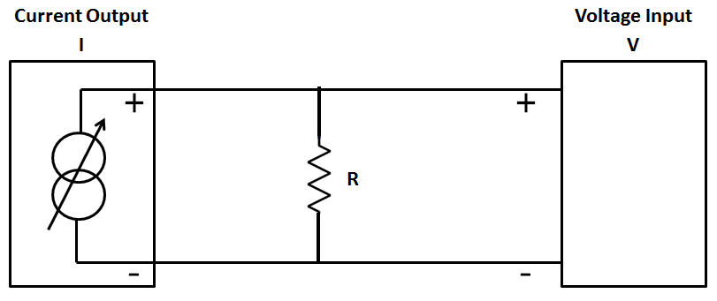
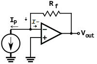
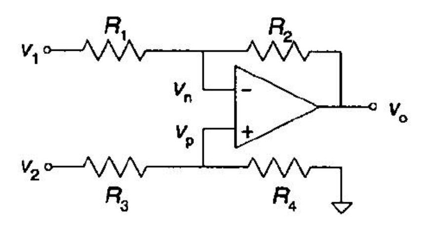
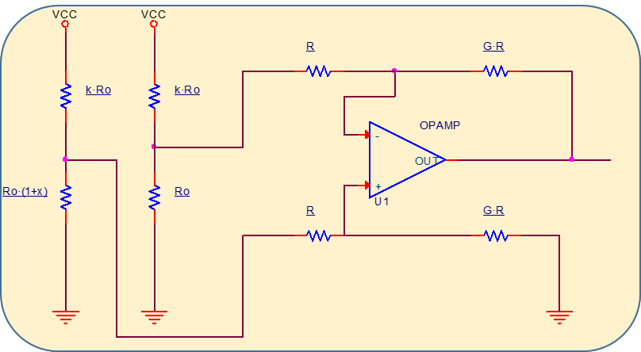
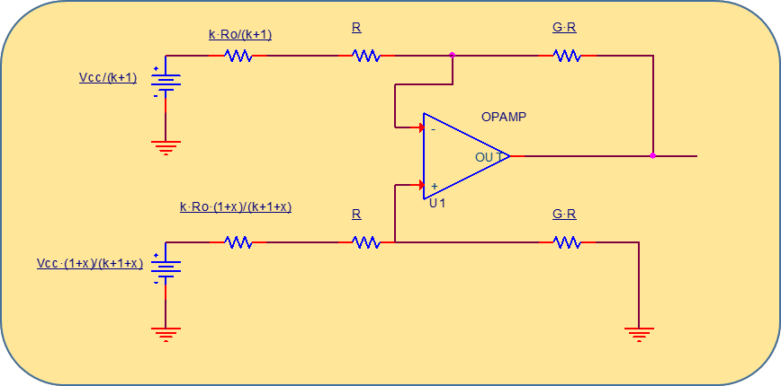

# Conversió corrent–tensió i amplificadors diferencials

## 📑 Índice de Contenidos

- [1 Models de sensor amb sortida en corrent](#1-models-de-sensor-amb-sortida-en-corrent)
- [2 Resistència de càrrega](#2-resistència-de-càrrega)
- [3 Amplificador de transimpedància](#3-amplificador-de-transimpedància)
- [4 L'amplificador diferencial](#4-lamplificador-diferencial)
- [5 Impedàncies d'entrada i efecte de càrrega](#5-impedàncies-dentrada-i-efecte-de-càrrega)

---

Sistemes de Mesura · **Unitat 6 — Condicionament de sensors en contínua** · Document 3 de 6

# Conversió corrent–tensió i amplificadors diferencials

Dedicació estimada: 12 minuts

> [!NOTE] **Objectius d'aprenentatge**
>
> - Distingir els dos models de sensor amb sortida en corrent i les seves conseqüències.
> - Decidir entre resistència de càrrega i amplificador de transimpedància segons el rang de corrent.
> - Deduir el guany diferencial i el guany en mode comú de l'amplificador diferencial de quatre resistències.
> - Combinar el CMRR de les resistències amb el de l'amplificador operacional.
> - Avaluar l'efecte de càrrega d'un amplificador diferencial sobre un pont.

## 1 Models de sensor amb sortida en corrent

Un sensor que lliura un corrent continu proporcional al mesurand admet dos models. El primer és un **model amb offset**, anàleg al dels sensors resistius:

$$
I_x = I_0\,(1+\beta x) \qquad (6.26)
$$

on  $I_0$
 és el corrent per a  $x=0$
 i  $\beta$
 la sensibilitat relativa. Descriu sensors amb un corrent de fons no nul: un sensor de llum amb corrent de foscor, o un transductor amb llaç 4–20 mA que lliura 4 mA al valor mínim del rang i 20 mA al màxim. El segon és el **model proporcional**:

$$
I_x = I_0\cdot x \qquad (6.27)
$$

amb corrent estrictament nul a  $x=0$
, com en fotodíodes o fototransistors en zona lineal: si no hi ha llum, no hi ha corrent. En tots dos casos, l'objectiu del condicionador és transformar el corrent en una tensió amplificable i digitalitzable, preservant la relació amb  $x$
 tan fidelment com sigui possible.

## 2 Resistència de càrrega

*Figura: Figura 6.9 Conversió corrent–tensió amb una resistència fixa.*

La manera més senzilla és fer circular el corrent per una resistència coneguda i mesurar-ne la caiguda:  $V = I_x R = I_0 R(1+\beta x)$
, amb sensibilitat

$$
\frac{\partial V}{\partial x} = I_0\,R\,\beta \qquad (6.28)
$$

Quan el corrent és petit —pA o fA en alguns fotodíodes o sensors electroquímics— cal una resistència molt elevada: un fotodíode de 10 pA que hagi de donar 1 mV demana  $R$
 de l'ordre de 100 MΩ. Valors així porten dos problemes simultanis, tots dos de signe contrari al que se sol suposar:

- **Efecte de càrrega.** La impedància d'entrada de l'etapa posterior pot no ser prou gran respecte de  $R$
: part del corrent es deriva cap a l'instrument en comptes de caure sobre  $R$
, i la lectura queda falsejada.
- **Soroll tèrmic.** El soroll generat per la mateixa resistència **creix** amb l'arrel quadrada del seu valor, i pot arribar a limitar la relació senyal–soroll:

$$
e_n = \sqrt{4\,k_B\,T\,R\,\Delta f} \qquad (6.29)
$$

La resistència de càrrega simple, per tant, només és pràctica quan el corrent és prou gran —microamperes o més— per treballar amb valors moderats, de kΩ a centenars de kΩ.

## 3 Amplificador de transimpedància

*Figura: Figura 6.10 Amplificador de transimpedància.*

És un amplificador operacional amb una resistència de realimentació  $R_f$
 entre la sortida i l'entrada inversora. El sensor es connecta a l'entrada inversora; la no inversora va a massa o a una tensió de referència. Com que el guany en llaç obert és molt gran, la tensió entre les dues entrades és pràcticament nul·la —**curtcircuit virtual**— i el node d'entrada es manté **virtualment a massa** sigui quin sigui el corrent que hi arribi. Tot el corrent del sensor ha de circular per  $R_f$
, perquè no pot entrar a l'amplificador ideal. Això elimina el problema de càrrega i permet resistències de realimentació molt elevades sense degradar la impedància vista pel sensor.

$$
V_{\text{out}} = I_p\,R_f \qquad (6.30)
$$

La sortida és **proporcional** al corrent i a  $R_f$
, que actua com a guany de transimpedància en V/A. El valor de  $R_f$
 es tria per adaptar el rang de corrent del sensor al marge de tensió de l'etapa posterior; per a corrents de pA o fA pot arribar a GΩ o TΩ.

Les limitacions són les de l'amplificador operacional. Els **corrents de polarització** —picoamperes en entrades FET, nanoamperes en bipolars— circulen per  $R_f$
 i generen una tensió d'offset que es confon amb el senyal: el curtcircuit virtual no els cancel·la. S'hi afegeixen la tensió d'offset, les derives tèrmiques, el soroll i el guany en llaç obert finit. Situar-les totes per sota de les variacions de corrent a mesurar exigeix amplificadors molt més propers a l'ideal que els de propòsit general; per això el cas de corrents molt petits es reprèn a la **unitat 10**, dedicada als condicionadors singulars. És la topologia de referència per a fotodíodes, sensors electroquímics i fotodetectors en instrumentació biomèdica.

## 4 L'amplificador diferencial

Els ponts i molts sensors resistius lliuren una **sortida diferencial**: dos terminals amb una diferència de tensió típicament de mV o menys, superposada a un mode comú que pot ser de diversos volts. Cal amplificar la component diferencial fins al marge de l'ADC i rebutjar la comuna, que no conté informació. Els amplificadors unipolars referits a massa no serveixen: no rebutgen prou el mode comú i introdueixen errors si les entrades no comparteixen exactament el mateix potencial de massa.

*Figura: Figura 6.11 Amplificador diferencial amb un amplificador operacional i quatre resistències.*

L'entrada inversora rep  $V_1$
 a través de  $R_1$
, amb  $R_2$
 de realimentació; la no inversora rep  $V_2$
 a través de  $R_3$
, amb  $R_4$
 a massa. Definim

$$
V_d = V_2 - V_1 \qquad (6.31)
$$

$$
V_c = \frac{V_2+V_1}{2} \qquad (6.32)
$$

Resolent per superposició i agrupant termes,

$$
V_o = G_d\,V_d + G_c\,V_c \qquad (6.33)
$$

$$
G_d = \frac{1}{2}\left[\frac{R_2}{R_1}+\left(1+\frac{R_2}{R_1}\right)\frac{R_4}{R_4+R_3}\right] \qquad (6.34)
$$

$$
G_c = \left(1+\frac{R_2}{R_1}\right)\frac{R_4}{R_4+R_3}-\frac{R_2}{R_1} \qquad (6.35)
$$

Idealment voldríem  $G_d$
 finit i  $G_c = 0$
. Imposant  $G_c \approx 0$
 s'arriba a la condició clau:

$$
\frac{R_1}{R_2} = \frac{R_3}{R_4} \qquad (6.36)
$$

Les dues parelles de resistències han d'estar **escalades amb la mateixa relació**: no serveix qualsevol combinació. Quan es compleix, el terme en  $V_c$
 desapareix del model ideal i el guany diferencial queda fixat pel quocient de resistències:

$$
G_d = \frac{R_2}{R_1} \qquad (6.37)
$$

A la pràctica cal resistències de tolerància molt baixa, o bé un integrat amb resistències ajustades conjuntament. La majoria d'amplificadors diferencials comercials es dissenyen amb  $R_1=R_3=R$
 i  $R_2=R_4=G\,R$
.

El desajustament residual dona un CMRR finit associat a les resistències,  $CMRR_R = G_d/G_c$
, infinit només si (6.36) es compleix exactament. Però l'amplificador operacional també té un CMRR finit propi: el mode comú que arriba a les seves entrades s'atenua per  $CMRR_{\text{AO}}$
 i passa a la sortida multiplicat pel guany diferencial. Els dos efectes es combinen com

$$
CMRR_{\text{total}} = \frac{CMRR_R\cdot CMRR_{\text{AO}}}{CMRR_R+CMRR_{\text{AO}}} \qquad (6.38)
$$

> [!WARNING] **Unitats**
>
> L'expressió (6.38) exigeix els CMRR en **unitats lineals**. Els valors en dB no es poden sumar ni multiplicar directament: cal convertir-los a lineal amb  $CMRR = 10^{\,CMRR_{\text{dB}}/20}$
>, combinar-los i tornar a dB al final.

> [!EXAMPLE] **Exemple resolt: CMRR d'un amplificador diferencial amb resistències discretes**
>
> Amb un amplificador operacional de  $CMRR_{\text{AO}} = 90\ \mathrm{dB}$
> i resistències  $R_1 = 1\ \mathrm{k}\Omega$
>,  $R_2 = 10\ \mathrm{k}\Omega$
>,  $R_3 = 999\ \Omega$
>,  $R_4 = 10\ \mathrm{k}\Omega$
>, quin CMRR efectiu s'obté?
>
> 1. Guanys. Amb  $R_2/R_1 = 10$
> i  $R_4/(R_4+R_3) = 10/10{,}999$
>, les expressions (6.34) i (6.35) donen  $G_d = 10{,}0005$
> i  $G_c = 9{,}09\cdot10^{-4}$
>.
> 2. CMRR de les resistències.  $CMRR_R = G_d/G_c = 11\,000$
>, és a dir 80,83 dB. Un desajustament d'un sol ohm en  $R_3$
> ja limita el conjunt.
> 3. Combinació.  $CMRR_{\text{AO}} = 90\ \mathrm{dB} = 31\,623$
> en lineal. Per (6.38),  $CMRR_{\text{total}} = 11\,000\cdot31\,623/(11\,000+31\,623) = 8\,161$
>, és a dir **78,2 dB**.
> 4. Lectura. El resultat queda per sota del pitjor dels dos i el domina el **desajustament de resistències**, no l'amplificador. Amb resistències discretes de l'1 % o del 0,1 % això és el cas habitual; en aplicacions exigents s'utilitzen amplificadors diferencials integrats amb resistències ajustades per làser.

## 5 Impedàncies d'entrada i efecte de càrrega

En un amplificador diferencial integrat el fabricant no sol donar els valors de les resistències internes, sinó les **impedàncies d'entrada** en mode diferencial i en mode comú. Amb  $R_1=R_3=R$
 i  $R_2=R_4=G\,R$
 resulten

$$
Z_d = 2\,R \qquad (6.39)
$$

$$
Z_c = \frac{R\,(G+1)}{2} \qquad (6.40)
$$

Són valors **finits i moderats**: l'entrada d'un amplificador diferencial no és de corrent nul, encara que l'amplificador operacional ho sigui, perquè les resistències hi són. L'INA2143 té guany 10 o 0,1 segons la connexió, CMRR típic de 96 dB a baixa freqüència (mínim 86 dB), offset referit a l'entrada de 100 µV, soroll d'1 µV pic a pic entre 0,1 Hz i 10 Hz i amplada de banda de 150 kHz. Excel·lent en tot, excepte que les impedàncies d'entrada moderades poden causar efecte de càrrega.

*Figura: Figura 6.12 Pont de Wheatstone connectat a un amplificador diferencial.*

Part del corrent que hauria de circular pel pont es deriva cap a les resistències d'entrada de l'amplificador. Per analitzar-ho, cada branca del pont es reemplaça pel seu **equivalent Thevenin**: una font de tensió en sèrie amb la resistència vista des del node central.

*Figura: Figura 6.13 Model equivalent per a l'estudi de l'efecte de càrrega.*

Apareixen dos efectes indesitjats. El primer és que, fins i tot amb  $x$
 nul·la, el guany diferencial no és  $G$
 sinó

$$
G_{\text{load}} = \frac{G\cdot R}{R+k\,R_0/(k+1)} = \frac{G}{1+\frac{k\,R_0}{R\,(k+1)}} < G \qquad (6.41)
$$

és a dir, la càrrega **redueix** el guany efectiu. El segon és que, per a  $x$
 diferent de zero, apareix una diferència entre les resistències vistes per les dues entrades que **creix amb el mesurand**: el CMRR es degrada a mesura que augmenta  $x$
. En aplicacions exigents cal assegurar que la impedància diferencial de l'amplificador sigui molt superior a la resistència Thevenin de qualsevol branca del pont. L'alternativa —més cara, però que estalvia el problema i sovint ofereix guany ajustable— és l'amplificador d'instrumentació.

> [!TIP] **Síntesi**
>
> Els sensors de corrent es modelen amb offset,  $I_0(1+\beta x)$
>, o de manera proporcional,  $I_0 x$
>. La resistència de càrrega serveix amb corrents de µA o més; per sota, la resistència necessària carrega el node i el seu soroll tèrmic creix com  $\sqrt{R}$
>, i cal l'amplificador de transimpedància, que manté l'entrada a massa virtual i dona  $V_{\text{out}}=I_pR_f$
>, amb els corrents de polarització com a limitació dominant. L'amplificador diferencial de quatre resistències amplifica  $V_d=V_2-V_1$
> i rebutja  $V_c=(V_1+V_2)/2$
>; el rebuig ideal exigeix  $R_1/R_2=R_3/R_4$
>, i aleshores  $G_d=R_2/R_1$
>. El CMRR real combina el de les resistències i el de l'amplificador operacional en unitats lineals, i sol quedar dominat pel desajustament resistiu. Les impedàncies d'entrada  $Z_d=2R$
> i  $Z_c=R(G+1)/2$
> són finites i carreguen el pont, reduint el guany efectiu i degradant el CMRR a mesura que creix el mesurand.

[← 2. Conversió resistència–tensió: cables, fonts de corrent, divisor i pont](02_Unitat6_Conversio_resistencia_tensio.md)[4. Amplificadors d'instrumentació →](04_Unitat6_Amplificadors_dinstrumentacio.md)

---

## 📐 Formulario Resumen de Ecuaciones

| Nº / Ref | Expresión Matemática |
| :---: | :--- |
| **(6.26)** | $I_x = I_0\,(1+\beta x)$ |
| **(6.27)** | $I_x = I_0\cdot x$ |
| **(6.28)** | $\frac{\partial V}{\partial x} = I_0\,R\,\beta$ |
| **(6.29)** | $e_n = \sqrt{4\,k_B\,T\,R\,\Delta f}$ |
| **(6.30)** | $V_{\text{out}} = I_p\,R_f$ |
| **(6.31)** | $V_d = V_2 - V_1$ |
| **(6.32)** | $V_c = \frac{V_2+V_1}{2}$ |
| **(6.33)** | $V_o = G_d\,V_d + G_c\,V_c$ |
| **(6.34)** | $G_d = \frac{1}{2}\left[\frac{R_2}{R_1}+\left(1+\frac{R_2}{R_1}\right)\frac{R_4}{R_4+R_3}\right]$ |
| **(6.35)** | $G_c = \left(1+\frac{R_2}{R_1}\right)\frac{R_4}{R_4+R_3}-\frac{R_2}{R_1}$ |
| **(6.36)** | $\frac{R_1}{R_2} = \frac{R_3}{R_4}$ |
| **(6.37)** | $G_d = \frac{R_2}{R_1}$ |
| **(6.38)** | $CMRR_{\text{total}} = \frac{CMRR_R\cdot CMRR_{\text{AO}}}{CMRR_R+CMRR_{\text{AO}}}$ |
| **(6.39)** | $Z_d = 2\,R$ |
| **(6.40)** | $Z_c = \frac{R\,(G+1)}{2}$ |
| **(6.41)** | $G_{\text{load}} = \frac{G\cdot R}{R+k\,R_0/(k+1)} = \frac{G}{1+\frac{k\,R_0}{R\,(k+1)}} < G$ |