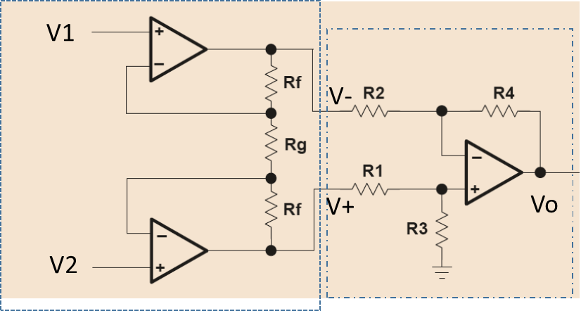
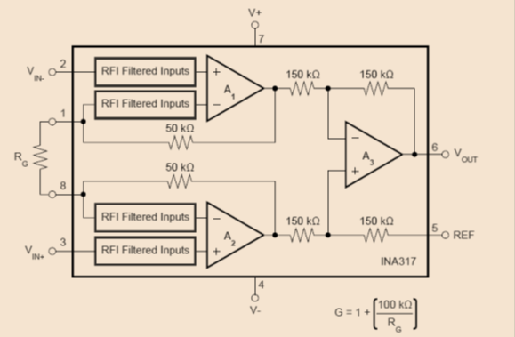

# Amplificadors d'instrumentació

## 📑 Índice de Contenidos

- [1 L'estructura de tres amplificadors operacionals](#1-lestructura-de-tres-amplificadors-operacionals)
- [2 Especificacions que cal llegir](#2-especificacions-que-cal-llegir)
- [3 Un cas concret: l'INA317](#3-un-cas-concret-lina317)
- [4 Criteris de selecció](#4-criteris-de-selecció)

---

Sistemes de Mesura · **Unitat 6 — Condicionament de sensors en contínua** · Document 4 de 6

# Amplificadors d'instrumentació

Dedicació estimada: 8 minuts

> [!NOTE] **Objectius d'aprenentatge**
>
> - Explicar què resol l'amplificador d'instrumentació respecte de l'amplificador diferencial simple.
> - Calcular el guany de l'estructura de tres amplificadors operacionals a partir de  $R_g$
>.
> - Interpretar les especificacions DC d'un amplificador d'instrumentació i el seu efecte sobre la mesura.
> - Seleccionar-ne un a partir del rang de mode comú, el guany, les impedàncies, el CMRR, el PSRR, l'offset, la deriva i el soroll.

L'amplificador diferencial clàssic és simple i econòmic, però en mesures de precisió sobre ponts arrossega tres limitacions: la impedància d'entrada finita carrega el pont, el CMRR depèn fortament del desajustament de resistències —difícil de mantenir alt i estable amb components discrets— i el mateix efecte de càrrega degrada el CMRR en funció del mesurand. L'**amplificador d'instrumentació** (IA) està dissenyat específicament per amplificar senyals diferencials de baixa amplitud amb **alta precisió, alta impedància d'entrada i excel·lent rebuig del mode comú**.

## 1 L'estructura de tres amplificadors operacionals

*Figura: Figura 6.14 Amplificador d'instrumentació amb tres amplificadors operacionals.*

La **primera etapa** té dos amplificadors **no inversors**, un per entrada, que amplifiquen  $V_1$
 i  $V_2$
 respecte de massa. La **segona** és un amplificador diferencial que resta les sortides de la primera. Aquesta segona etapa sol tenir guany unitari, perquè és fàcil garantir  $R_1=R_2=R_3=R_4$
. El guany global es controla amb una **única resistència externa**  $R_g$
: sobre ella cau  $V_2-V_1$
 i el corrent que la travessa és el mateix que circula per les dues  $R_f$
, de manera que

$$
V_+ - V_- = \frac{V_2-V_1}{R_g}\,(R_g+2R_f) = (V_2-V_1)\left(1+\frac{2R_f}{R_g}\right) \qquad (6.42)
$$

$$
G_1 = 1+\frac{2R_f}{R_g} \qquad\qquad G = G_1\cdot G_2 \qquad (6.43)
$$

Ajustar el guany amb **un sol component** —cosa impossible amb l'amplificador diferencial, on cal canviar almenys dues resistències— és un dels atractius principals. Per fixar el guany no cal que les dues  $R_f$
 siguin exactament iguals: el guany és 1 més la seva suma dividida per  $R_g$
. Sí que cal que ho siguin, en canvi, perquè les tensions d'offset, els corrents de polarització i el CMRR finit dels dos amplificadors de la primera etapa es compensin mútuament.

Com que la primera etapa és no inversora, la **impedància d'entrada** és essencialment la de l'amplificador operacional multiplicada per l'efecte de la realimentació: molt elevada. El pont veu una càrrega molt lleugera i la tensió diferencial es manté pràcticament inalterada, de manera que el pont funciona segons el model teòric amb què s'han calculat sensibilitat, consum i mode comú. Això no vol dir que l'IA elimini els errors: l'offset, el soroll i les derives hi continuen essent, i excedir el **rang de mode comú** admissible té conseqüències encara que el guany diferencial sigui petit.

Molts fabricants ofereixen IA optimitzats per a ponts, amb rangs de mode comú compatibles amb la tensió del pont, guanys programables seleccionables per pins o per interfície digital, calibratge de zero i de guany, compensació de temperatura i proteccions. En AFE com el PGA302, aquest bloc és el nucli del front end, envoltat dels circuits d'excitació, les referències, l'ADC i la lògica digital de compensació.

## 2 Especificacions que cal llegir

| Paràmetre | Què descriu i com afecta |
|:--- |:--- |
| Exactitud de guany | Proximitat del guany real al nominal, en % o ppm. Es tradueix en **error de factor d'escala**; sovint es redueix amb calibratge sistemàtic |
| No-linealitat de guany | Desviació respecte d'una relació estrictament proporcional entre entrada diferencial i sortida. Crítica amb calibratge simple |
| Guany màxim i mínim | El mínim el fixa la segona etapa amb  $R_g$   en circuit obert; el màxim, la saturació d'alguna etapa o el consum |
| Tensió d'offset referida a l'entrada | Dona sortida no nul·la amb entrada diferencial zero: **error de zero** igual a l'offset multiplicat pel guany. S'expressa com un terme fix més un que depèn del guany, aquest darrer associat a la segona etapa |
| Corrents de polarització i d'offset | Mitjana i diferència en valor absolut dels corrents d'entrada. Circulen per les resistències de l'equivalent Thevenin del pont i generen tensions que després s'amplifiquen |
| CMRR | Capacitat de rebutjar el mode comú, molt gran en ponts comparat amb el senyal útil. Valors de 100 a 120 dB a baixa freqüència són habituals. **Depèn del guany i de la freqüència** |
| PSRR | Sensibilitat de la sortida a variacions de l'alimentació. Es modela com una font d'error en sèrie amb l'offset |
| Derives tèrmiques | Guany, offset, corrents, CMRR i PSRR depenen de la temperatura, amb coeficients en ppm/°C o µV/°C |
| Soroll | Tensions i corrents de soroll **referits a l'entrada**; la densitat depèn del guany configurat |

$$
\Delta V_{\text{os}} = \frac{\Delta V_{\text{cc}}}{PSRR} \qquad (6.44)
$$

El PSRR pot ser diferent per a l'alimentació positiva i la negativa, i aleshores el fabricant especifica tots dos. En rangs tèrmics amplis pot caldre mesurar la temperatura prop del dispositiu i compensar les derives per càlcul, o triar un IA amb especificacions més estrictes o compensació interna, cosa que encareix el producte.

## 3 Un cas concret: l'INA317

*Figura: Figura 6.15 Estructura interna de l'INA317, amplificador d'instrumentació de baix consum i alta precisió en contínua.*

La segona etapa té guany 1 i cada  $R_f$
 val 50 kΩ, de manera que  $G = 1 + 100\ \mathrm{k}\Omega/R_g$
, ajustable entre 1 i 1000. Les xifres il·lustren com **gairebé tot depèn del guany configurat**:

- **Guany:** exactitud del 0,01 % a guany unitari, que puja al 0,25 % al guany màxim. No-linealitat de 10 ppm, independent del guany. Deriva d'1 ppm/°C a guany unitari, més d'un ordre de magnitud pitjor a guanys alts.
- **Errors de zero:** offset típic de  $10\ \mu\mathrm{V}+25\ \mu\mathrm{V}/G$
, PSRR de  $1\ \mathrm{ppm}+5\ \mathrm{ppm}/G$
. Corrent de polarització típic de 70 pA i corrent d'offset de 50 pA.
- **Entrada:** impedàncies diferencial i en mode comú de 100 GΩ en paral·lel amb 3 pF —quatre ordres de magnitud per sobre de les d'un diferencial de quatre resistències. El mode comú a l'entrada ha de mantenir-se a més de 0,1 V dels dos rails d'alimentació.
- **CMRR:** 90 dB a guany unitari, creixent amb el guany fins a 115 dB a guany 100, valor que ja no millora al guany màxim de 1000.
- **Soroll:** densitat espectral de tensió d'uns 50 nV/√Hz a guany 100 i de corrent de 100 fA/√Hz.

En freqüència, el **producte guany per amplada de banda** es manté raonablement constant, al voltant de 300 kHz, per a guanys diferents d'1; a guany unitari poden aparèixer ressonàncies. El CMRR comença a degradar-se per sobre dels 100 Hz i el PSRR encara abans, i tant més aviat com més baix és el guany. En contínua això rarament limita, però és el motiu pel qual les especificacions s'han de llegir **al rang d'ús** i no com a valors universals.

## 4 Criteris de selecció

Triar un IA no es pot reduir al preu ni al guany màxim del full de dades. Cal comprovar que el **rang de tensió d'entrada i de mode comú** sigui compatible amb la sortida del pont i amb les alimentacions disponibles; que el **guany necessari** s'assoleixi sense penalitzar excessivament l'amplada de banda ni el soroll, i preferiblement amb una sola resistència; que la **impedància d'entrada** sigui prou alta per no carregar el pont, cosa crítica amb sensors de resistència de sortida elevada; que **CMRR i PSRR** siguin suficients perquè les fluctuacions del mode comú i de l'alimentació no es confonguin amb el mesurand; i que **offset, corrents de polarització, derives i soroll** quedin justificats dins del balanç d'incertesa per al rang de mesura previst. Segons l'aplicació, també el consum, el rang de temperatura i l'encapsulat.

> [!TIP] **Síntesi**
>
> L'amplificador d'instrumentació resol les limitacions del diferencial simple en impedància d'entrada i CMRR. L'estructura clàssica de tres amplificadors operacionals té una primera etapa no inversora, d'impedància d'entrada molt alta, amb guany  $G_1 = 1+2R_f/R_g$
> ajustable amb una sola resistència externa, i una segona etapa diferencial de guany habitualment unitari. Les especificacions decisives són exactitud i no-linealitat de guany, tensió d'offset referida a l'entrada, corrents de polarització i d'offset, CMRR i PSRR —tots dos dependents del guany i de la freqüència—, derives tèrmiques, soroll referit a l'entrada i producte guany–amplada de banda. L'INA317 il·lustra la dependència del guany en gairebé tots els paràmetres. La selecció s'ha de fer contra el balanç d'incertesa complet, no contra un únic número.

[← 3. Conversió corrent–tensió i amplificadors diferencials](03_Unitat6_Conversio_corrent_tensio_i_amplificadors_diferencials.md)[5. Interruptors, multiplexors analògics i PGA →](05_Unitat6_Interruptors_multiplexors_i_PGA.md)

---

## 📐 Formulario Resumen de Ecuaciones

| Nº / Ref | Expresión Matemática |
| :---: | :--- |
| **(6.42)** | $V_+ - V_- = \frac{V_2-V_1}{R_g}\,(R_g+2R_f) = (V_2-V_1)\left(1+\frac{2R_f}{R_g}\right)$ |
| **(6.43)** | $G_1 = 1+\frac{2R_f}{R_g} \qquad\qquad G = G_1\cdot G_2$ |
| **(6.44)** | $\Delta V_{\text{os}} = \frac{\Delta V_{\text{cc}}}{PSRR}$ |