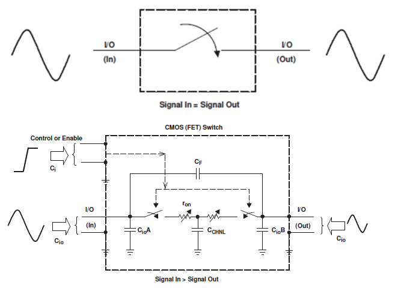
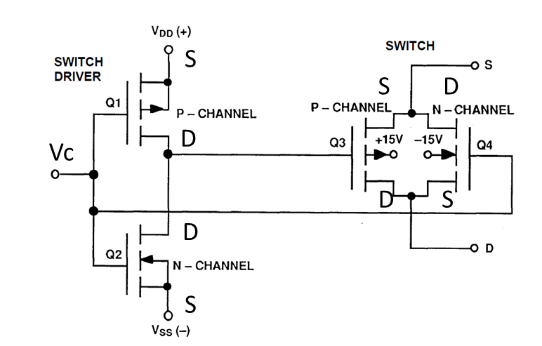
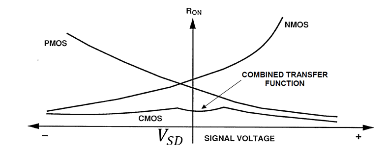
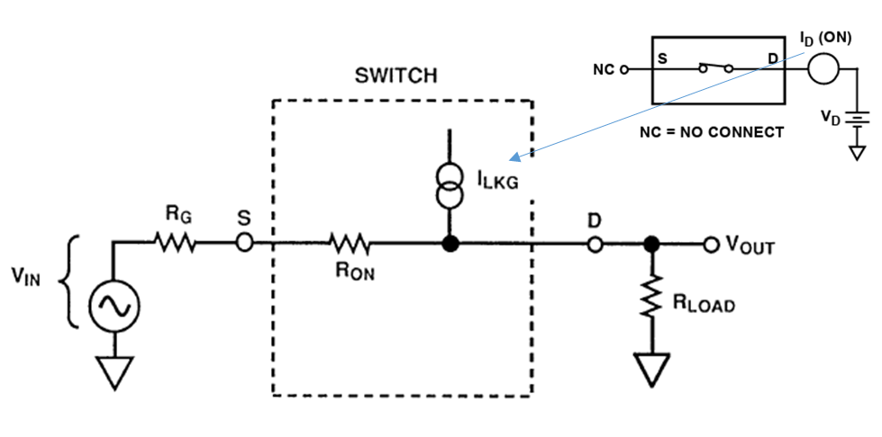
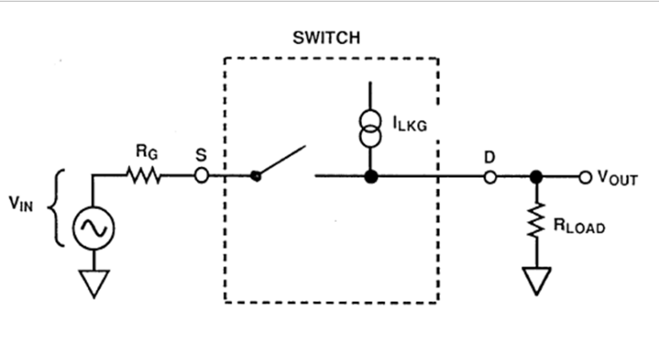
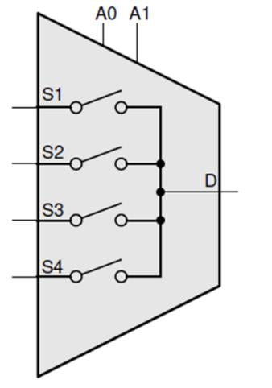
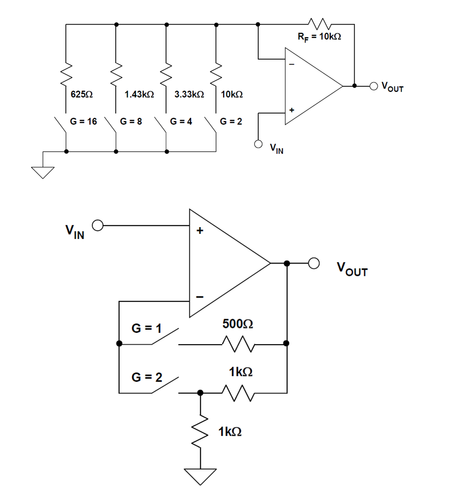

# Interruptors, multiplexors analògics i PGA

## 📑 Índice de Contenidos

- [1 Interruptor ideal i interruptor real](#1-interruptor-ideal-i-interruptor-real)
- [2 De MOSFET a CMOS](#2-de-mosfet-a-cmos)
- [3 Errors en contínua](#3-errors-en-contínua)
- [4 Limitacions en alterna i en commutació](#4-limitacions-en-alterna-i-en-commutació)
- [5 Multiplexors i ús pràctic](#5-multiplexors-i-ús-pràctic)
- [6 Amplificadors de guany programable](#6-amplificadors-de-guany-programable)

---

Sistemes de Mesura · **Unitat 6 — Condicionament de sensors en contínua** · Document 5 de 6

# Interruptors, multiplexors analògics i PGA

Dedicació estimada: 13 minuts

> [!NOTE] **Objectius d'aprenentatge**
>
> - Enumerar les fonts d'error en contínua d'un interruptor analògic real i quantificar-ne l'efecte.
> - Explicar per què un interruptor CMOS té una resistència de conducció menor i més plana que un MOSFET.
> - Dimensionar la resistència de càrrega d'un interruptor com a compromís entre estat tancat i obert.
> - Distingir PGA i VGA i avaluar l'error de guany introduït per  $R_{\text{on}}$
> segons l'arquitectura.

Els amplificadors d'instrumentació i els AFE d'altes prestacions tenen un cost considerable, de manera que resulta atractiu **compartir un únic front end analògic** entre diversos canals. S'aconsegueix interposant interruptors i multiplexors analògics entre els sensors i l'amplificador. L'estratègia redueix cost i complexitat, però introdueix **noves fonts d'error** —resistència de conducció, fuites, capacitats paràsites— i no dispensa de calibrar cada canal.

## 1 Interruptor ideal i interruptor real

*Figura: Figura 6.16 Interruptor ideal (a dalt) comparat amb el model d'un interruptor CMOS real (a baix).*

L'interruptor ideal és circuit obert quan està obert i curtcircuit quan està tancat, amb l'estat controlat per un senyal digital de dos nivells. El model real hi afegeix capacitats cap a massa a l'entrada i a la sortida, una capacitat de fuites entre totes dues, una capacitat associada al canal i, sobretot, una **resistència de conducció**  $R_{\text{on}}$
 en sèrie quan està tancat:

$$
V_{\text{SD}} = I_D\cdot R_{\text{on}} \qquad (6.45)
$$

La tensió de sortida és, doncs, **més petita** que la d'entrada segons la impedància de càrrega:  $R_{\text{on}}$
 interessa que sigui molt menor que la impedància d'entrada de l'etapa següent. Les capacitats no tenen efecte en contínua estricta, però provoquen un **transitori** a cada commutació. I hi ha una segona font d'error que el model dibuixat no recull: la circulació de **corrents de fuites**, que fa que l'aïllament en obert no sigui perfecte.

## 2 De MOSFET a CMOS

Els primers interruptors analògics eren MOSFET: la tensió entre porta i font crea o no el canal, i per sota de la tensió llindar el transistor està en tall. Amb el canal creat i sense curtcircuitar la sortida, el transistor treballa en **zona lineal** i la caiguda entre drenador i font és reduïda, com correspon a un interruptor. La resistència de conducció depèn de la mobilitat dels portadors, de la capacitat i la geometria de la porta i, de manera decisiva, de  $(V_{\text{GS}}-V_T)$
 i de la mateixa  $V_{\text{DS}}$
. Aquesta darrera dependència és el problema:  $R_{\text{on}}$
 **varia amb la tensió del senyal** i, si els canvis són grans, distorsiona.

*Figura: Figura 6.17 Estructura interna d'un interruptor CMOS.*

*Figura: Figura 6.18 Resistència de conducció d'un interruptor CMOS comparada amb la dels MOSFET que el formen.*

Els MOSFET de canal N i de canal P tenen dependències **oposades** amb la tensió del canal. L'interruptor CMOS aprofita aquest fet posant-ne un de cada tipus **en paral·lel i en oposició** —font amb drenador i viceversa—, controlats per un inversor CMOS intern alimentat entre  $V_{\text{DD}}$
 i  $V_{\text{SS}}$
. La resistència resultant és el **paral·lel** de les dues: menor que qualsevol d'elles per separat i molt més estable amb la tensió. No és constant, però sí prou plana. Els valors típics van de dècimes d'ohm a centenars d'ohm segons preu i velocitat de commutació.

## 3 Errors en contínua

*Figura: Figura 6.19 Errors en contínua amb l'interruptor tancat.*

Amb l'interruptor **tancat**, per superposició sobre la resistència de càrrega:

$$
V_{\text{OUT}} = V_{\text{IN}}\,\frac{R_{\text{LOAD}}}{R_{\text{LOAD}}+R_{\text{ON}}+R_G} + I_{\text{LKG}}\,\frac{R_{\text{LOAD}}\,(R_{\text{ON}}+R_G)}{R_{\text{LOAD}}+R_{\text{ON}}+R_G} \qquad (6.46)
$$

Si  $R_{\text{ON}}$
 és molt menor que  $R_{\text{LOAD}}$
, els errors es redueixen i  $V_{\text{OUT}}\approx V_{\text{IN}}$
. Fer  $R_{\text{on}}$
 *més petita* respecte de la càrrega, per tant, **redueix** l'error de caiguda.

*Figura: Figura 6.20 Errors en contínua amb l'interruptor obert.*

Amb l'interruptor **obert** el corrent de fuites persisteix —no desapareix— i produeix una tensió residual:

$$
V_{\text{OUT}} = I_{\text{LKG}}\cdot R_{\text{LOAD}} \qquad (6.47)
$$

Aquest error **augmenta** amb la resistència de càrrega. Els dos requisits són oposats, i d'aquí surt el criteri pràctic: a la sortida dels interruptors es col·loca una resistència de càrrega de **valor de compromís**, prou gran per transmetre bé la tensió en estat tancat i prou petita per limitar la tensió residual en estat obert. Cap dels dos extrems és òptim. Segons el procés de fabricació, els corrents de fuites en estat tancat i en obert poden ser diferents —el fabricant especifica *ON leakage* i *OFF leakage* per separat—, encara que del mateix ordre de magnitud, típicament d'alguns pA a alguns nA.

## 4 Limitacions en alterna i en commutació

Amb l'interruptor **tancat**, el guany en contínua és el divisor  $R_{\text{LOAD}}/(R_{\text{LOAD}}+R_{\text{ON}})$
; en pujar la freqüència, les capacitats de drenador i de càrrega curtcircuiten la resistència de càrrega i apareix un **pol**, i més amunt la capacitat entre drenador i font curtcircuita  $R_{\text{on}}$
 i apareix un **zero**: la resposta no és plana fins a freqüència infinita. Amb l'interruptor **obert**, l'aïllament és infinit en contínua però **empitjora** en pujar la freqüència, a mesura que baixa la impedància de les capacitats.

S'hi afegeixen la **injecció de càrrega** de la commutació dels transistors del driver, que altera temporalment la sortida després d'un canvi d'estat, i el **crosstalk** entre canals propers, rellevant amb senyals variables o commutació ràpida. En sistemes multiplexats ràpids cal verificar que el **temps d'establiment** sigui compatible amb el temps de conversió de l'ADC: no ho és automàticament.

## 5 Multiplexors i ús pràctic

*Figura: Figura 6.21 Multiplexor amb quatre canals d'entrada i una sortida comuna.*

Un multiplexor no és més que un **conjunt d'interruptors** connectats per seleccionar un camí de senyal. L'alimentació pot ser unipolar o dual, generalment simètrica. Els dispositius *rail to rail* admeten tensions d'entrada dins del marge  $[V_{\text{SS}}, V_{\text{DD}}]$
 fins i tot molt a prop dels límits, i alguns encara més optimitzats en toleren de fora, però cap transfereix qualsevol tensió saltant-se tots els límits d'alimentació.

Les especificacions rellevants en contínua són  $R_{\text{on}}$
, la seva **planitud** —com varia amb la tensió del senyal, és a dir amb la tensió entre font i drenador—, el ***$R_{on}$ match*** —com s'assemblen entre canals, cosa que només té sentit en multiplexors— i els corrents de fuites en tots dos estats. Les recomanacions pràctiques que se'n deriven: triar  $R_{\text{on}}$
 petita en relació amb la càrrega, situar l'interruptor en punts de **bona impedància** —la sortida d'un buffer— i no entre el sensor i la referència si això degrada la sensibilitat, afegir la resistència de càrrega de compromís, respectar el rang de tensió d'entrada i preveure els efectes en alterna quan la commutació sigui freqüent. En sistemes multicanal exigents és habitual el **calibratge individual per canal**, per compensar diferències de  $R_{\text{on}}$
, fuites i impedàncies de sensor; és perfectament compatible amb compartir un únic ADC.

## 6 Amplificadors de guany programable

Un amplificador de guany ajustable és necessari quan el sistema té un marge dinàmic ampli o mesura magnituds amb escales diferents: serveix per **ajustar el nivell de senyal al marge dinàmic de l'ADC**. El guany ha de ser molt acurat, perquè el valor digitalitzat s'interpreta com una estimació del mesurand: un error de guany és un error de factor d'escala.

Es parla de **VGA** quan el guany es controla amb un senyal analògic continu —habitualment la tensió de porta d'un MOSFET en zona lineal, la resistència del qual entra a l'expressió del guany—, i de **PGA** quan es fixa amb una **entrada digital**. En un PGA el nombre de guanys és **finit** i sovint reduït, amb salts per dècades (10, 100, 1000) o per octaves (2, 4, 8, 16). Tots dos poden tenir entrades i sortides unipolars o diferencials. Els paràmetres que diferencien els models comercials són com se selecciona el guany, com hi afecta la  $R_{\text{on}}$
, l'exactitud, la linealitat i la deriva tèrmica del guany, la relació entre guany i amplada de banda, els errors de zero, el temps d'establiment en canviar de guany, el soroll i les impedàncies.

*Figura: Figura 6.22 Dues arquitectures d'amplificador no inversor programable: amb l'interruptor en sèrie amb la xarxa de guany (a dalt) i amb l'interruptor en un node sense corrent (a baix).*

A l'arquitectura superior, amb una resistència de realimentació fixa  $R_F$
 i una única resistència  $R$
 commutada cap a massa, el guany real és

$$
G = 1+\frac{R_F}{R+R_{\text{on}}} \qquad (6.48)
$$

La  $R_{\text{on}}$
 queda **en sèrie** amb la resistència que fixa el guany. Pot ser de dècimes d'ohm, però en interruptors econòmics està entre 100 Ω i 500 Ω.

> [!EXAMPLE] **Exemple resolt: error de guany introduït per $R_{\text{on}}$**
>
> Un PGA amb  $R_F = 10\ \mathrm{k}\Omega$
> i interruptors de  $R_{\text{on}} = 25\ \Omega$
>. Quin error relatiu de guany s'obté als guanys nominals 2 i 16?
>
> 1. Guany 2. Cal  $R = 10\ \mathrm{k}\Omega$
>. El guany real és  $1+10\,000/10\,025 = 1{,}9975$
>, amb un error de  $0{,}12\ \%$
>.
> 2. Guany 16. Cal  $R = 666{,}66\ \Omega$
>. El guany real és  $1+10\,000/691{,}66 = 15{,}46$
>, amb un error de  $3{,}39\ \%$
>.
> 3. Tendència. El guany real és sempre **menor** que el nominal, i l'error **creix amb el guany seleccionat**, perquè  $R_{\text{on}}$
> pesa cada cop més sobre una  $R$
> més petita.
> 4. Solució descartada. Es podria reduir l'error augmentant totes les resistències, però és mala idea: el **soroll** del PGA augmentaria.

L'arquitectura inferior resol el problema d'arrel: **situar l'interruptor en un node pel qual no circuli corrent apreciable**. A guany unitari no hi circula corrent i el circuit actua com a seguidor; a guany 2, la tensió d'entrada s'aplica al divisor de dues resistències iguals i la sortida val el doble. En cap cas la  $R_{\text{on}}$
 no afecta el guany, perquè l'únic corrent que hi passa és el de polarització de l'entrada inversora, molt petit amb etapa d'entrada FET. És, per això, l'arquitectura més emprada en PGA comercials.

> [!TIP] **Síntesi**
>
> Compartir un front end entre canals exigeix interruptors i multiplexors, que aporten  $R_{\text{on}}$
>, fuites i capacitats paràsites. L'interruptor CMOS combina canal N i canal P en paral·lel per obtenir una  $R_{\text{on}}$
> menor i molt més plana amb la tensió del senyal. En estat tancat l'error de caiguda es redueix si  $R_{\text{on}}\ll R_{\text{LOAD}}$
>; en estat obert la tensió residual val  $I_{\text{LKG}}R_{\text{LOAD}}$
> i creix amb la càrrega, d'on la resistència de càrrega de compromís. Les especificacions clau són  $R_{\text{on}}$
>, la seva planitud, el *match* entre canals i les fuites en tots dos estats, i el calibratge per canal continua essent necessari. Un PGA fixa el guany amb control digital entre un conjunt finit de valors i un VGA amb control analògic continu. Si la  $R_{\text{on}}$
> queda en sèrie amb la xarxa de guany, l'error creix amb el guany seleccionat; situar l'interruptor en un node sense corrent l'elimina.

[← 4. Amplificadors d'instrumentació](04_Unitat6_Amplificadors_dinstrumentacio.md)[6. Referències de tensió i de corrent i mesures ratiomètriques →](06_Unitat6_Referencies_i_mesures_ratiometriques.md)

---

## 📐 Formulario Resumen de Ecuaciones

| Nº / Ref | Expresión Matemática |
| :---: | :--- |
| **(6.45)** | $V_{\text{SD}} = I_D\cdot R_{\text{on}}$ |
| **(6.46)** | $V_{\text{OUT}} = V_{\text{IN}}\,\frac{R_{\text{LOAD}}}{R_{\text{LOAD}}+R_{\text{ON}}+R_G} + I_{\text{LKG}}\,\frac{R_{\text{LOAD}}\,(R_{\text{ON}}+R_G)}{R_{\text{LOAD}}+R_{\text{ON}}+R_G}$ |
| **(6.47)** | $V_{\text{OUT}} = I_{\text{LKG}}\cdot R_{\text{LOAD}}$ |
| **(6.48)** | $G = 1+\frac{R_F}{R+R_{\text{on}}}$ |