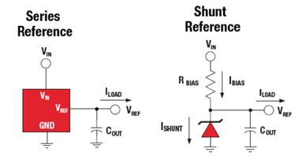
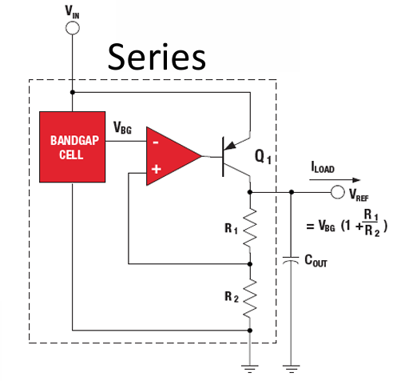
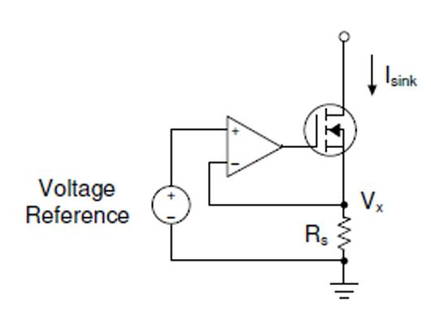
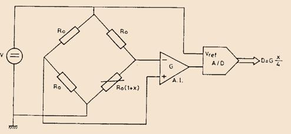

# Referències de tensió i de corrent i mesures ratiomètriques

## 📑 Índice de Contenidos

- [1 Solucions elementals i les seves limitacions](#1-solucions-elementals-i-les-seves-limitacions)
- [2 Referències sèrie i shunt](#2-referències-sèrie-i-shunt)
- [3 Especificacions](#3-especificacions)
- [4 Mesures ratiomètriques](#4-mesures-ratiomètriques)

---

Sistemes de Mesura · **Unitat 6 — Condicionament de sensors en contínua** · Document 6 de 6

# Referències de tensió i de corrent i mesures ratiomètriques

Dedicació estimada: 8 minuts

> [!NOTE] **Objectius d'aprenentatge**
>
> - Justificar per què l'estabilitat de l'excitació limita l'exactitud global del sistema.
> - Distingir referència sèrie i referència shunt, i el principi de la referència bandgap.
> - Diferenciar regulació de línia i regulació de càrrega i les altres especificacions clau.
> - Deduir la cancel·lació ratiomètrica i enunciar-ne les condicions i els límits.

Cada vegada que una magnitud del sensor es converteix en tensió —amb un pont, un divisor o una font de corrent— el resultat depèn d'una excitació que es pressuposa estable. Un pont alimentat per  $V$
 lliura una sortida proporcional a  $V\cdot f(x)$
: si  $V$
 fluctua, el sistema **confon la fluctuació amb el mesurand**. Qualsevol font d'alimentació —bateria, regulador lineal, convertidor DC–DC— varia amb el temps, la temperatura i el corrent de càrrega. La referència és, per tant, un component crític: pot ser el factor que limiti l'exactitud global si s'escull malament.

## 1 Solucions elementals i les seves limitacions

La més simple és un **díode en conducció directa**: uns 0,6 V per a silici, apilables en sèrie. És elemental i econòmica, però té un coeficient de temperatura de −2 mV/°C, de manera que un rang de treball de 50 °C dona una deriva de l'ordre de 100 mV, inacceptable en mesura. A més, el corrent de càrrega ha de ser molt inferior al de polarització o la sortida es desestabilitza, i només es poden generar múltiples de 0,6 V. Per això han caigut en desús.

El **díode Zener**, en conducció inversa, permet tensions ajustables en un rang molt més ampli, fixat per la tensió de ruptura de la unió. Combinant un Zener amb un díode en directa en sèrie es redueix la dependència tèrmica: el coeficient positiu del Zener i el negatiu del díode directe es compensen parcialment si es trien dispositius amb coeficients d'igual mòdul i signe contrari.

## 2 Referències sèrie i shunt

*Figura: Figura 6.23 Referència de tensió de tipus sèrie i de tipus shunt.*

En una referència **shunt**, la càrrega es connecta entre el node de sortida i massa, i una resistència de polarització  $R_{\text{BIAS}}$
 connecta aquest node a una font no regulada:

$$
I_{\text{BIAS}} = \frac{V_{\text{in}}-V_{\text{ref}}}{R_{\text{BIAS}}} = I_{\text{SHUNT}}+I_{\text{LOAD}} \qquad (6.49)
$$

El corrent disponible es **reparteix** entre la càrrega i el dispositiu de referència. Quan la càrrega canvia, canvia el corrent per la referència —que és qui fixa la tensió—, cosa que pot introduir inestabilitat. Per minimitzar-ho es dimensiona  $R_{\text{BIAS}}$
 perquè el corrent per la referència sigui sempre prou gran i el seu canvi relatiu petit dins del rang previst de  $I_{\text{LOAD}}$
.

Una referència **sèrie** regula la tensió entre una entrada i una sortida i **alimenta directament la càrrega** dins d'un rang de corrent especificat.

*Figura: Figura 6.24 Referència de tensió sèrie basada en cel·la bandgap.*

Les referències de **banda prohibida** (bandgap) combinen dos efectes amb coeficients tèrmics **oposats** que s'equilibren. La tensió base–emissor d'un bipolar decreix uns −2 mV/°C, mentre que la diferència  $\Delta V_{\text{BE}}$
 entre dos transistors que operen a densitats de corrent molt diferents creix linealment amb la temperatura absoluta:

$$
\Delta V_{\text{BE}} = \frac{k_B T}{q}\ln(n) \qquad (6.50)
$$

Sumant-los amb els factors adequats s'obté una tensió de deriva molt baixa que tendeix al valor de la banda prohibida del silici, uns 1,25 V, d'on el nom. Aquesta tensió  $V_{\text{BG}}$
 es copia a l'entrada inversora d'un amplificador en llaç tancat i s'escala amb una xarxa resistiva,

$$
V_{\text{ref}} = V_{\text{BG}}\left(1+\frac{R_1}{R_2}\right) \qquad (6.51)
$$

amb un transistor que subministra el corrent de la càrrega en la versió sèrie, o que n'absorbeix el sobrant cap a massa en la versió shunt. S'assoleixen estabilitats tèrmiques d'1 a 50 ppm/°C, i per sota de 10 ppm/°C amb termes de compensació d'ordre superior que corregeixen les no-linealitats residuals.

## 3 Especificacions

| Paràmetre | Què descriu |
|:--- |:--- |
| Tensió nominal i rangs | Valor central en condicions nominals; rang de tensió d'entrada per a les sèrie, rang de corrent de polarització per a les shunt |
| Exactitud inicial | Proximitat al valor nominal a 25 °C. Dona la contribució de tipus B a la incertesa |
| Deriva tèrmica | Variació amb la temperatura, en µV/°C o ppm/°C. En 50 °C, 50 ppm/°C acumulen 2500 ppm (0,25 %), que passen directament a la sortida |
| Estabilitat a llarg termini | Envelliment, en ppm per 1000 hores o per any. Domina en sistemes que han de conservar el calibratge durant mesos |
| Soroll | Soroll de tensió de baixa freqüència, amb component 1/f en les bandgap: rellevant en mesures lentes o quasi estàtiques |
| Regulació de **càrrega** | Variació de  $V_{\text{ref}}$   quan canvia el **corrent** demanat per la càrrega, en ppm/mA |
| Regulació de **línia** | Variació de  $V_{\text{ref}}$   quan canvia la **tensió d'alimentació** dins del rang admissible, en ppm/V |

*Figura: Figura 6.25 Referència de corrent bàsica.*

En mesures a 4 fils, polarització de sensors resistius o excitació de RTD calen **corrents constants** i ben coneguts. La manera més directa d'obtenir-los és forçar una tensió de referència sobre una **resistència de sensat**:

$$
I_{\text{sink}} = \frac{V_{\text{ref}}}{R_s} \qquad (6.52)
$$

—proporcional a  $V_{\text{ref}}$
 i inversament proporcional a  $R_s$
. Perquè la tensió sobre  $R_s$
 sigui efectivament  $V_{\text{ref}}$
 sense importar la càrrega, s'utilitza realimentació negativa amb transistors bipolars o FET. Una font de corrent real només manté les especificacions dins d'un **rang de tensió sobre la càrrega**: fora d'aquest rang deixa de regular. Les especificacions clau són el valor nominal, l'exactitud, aquest rang i les derives tèrmiques.

## 4 Mesures ratiomètriques

*Figura: Figura 6.26 Mesura ratiomètrica: la mateixa tensió excita el pont i serveix de referència a l'ADC.*

En la majoria de circuits estudiats la sortida és proporcional a l'excitació. La idea ratiomètrica és que, en lloc d'estabilitzar la referència fins a nivells de precisió costosos, **s'aprofita que la mateixa incertesa afecta dues parts del circuit** i es cancel·la en la relació que determina el resultat. Amb un pont excitat per  $V$
, un amplificador de guany  $G$
 i un ADC amb  $V_{\text{ref}}=V$
, la sortida de l'amplificador és  $V_{\text{AI}}\approx V\cdot G\cdot f(x;k)$
 i la paraula digital val

$$
D = \left[\frac{V_{\text{AI}}}{V_{\text{ref}}}\cdot 2^{N_{\text{bits}}}\right] = \left[G\cdot f(x;k)\cdot 2^{N_{\text{bits}}}\right] \qquad (6.53)
$$

El resultat **no depèn de  $V$**. Qualsevol canvi de l'excitació —deriva tèrmica de la referència, fluctuació de la font, descàrrega de la bateria— afecta proporcionalment la sortida de l'amplificador i la referència de l'ADC, i la divisió implícita que fa el convertidor els cancel·la. El codi depèn només del guany, del mesurand, del disseny del pont i de la resolució.

> [!WARNING] **Què no cancel·la la ratiometria**
>
> - La cancel·lació exigeix que l'excitació i la referència de l'ADC siguin **la mateixa tensió** o proporcionals amb un factor constant, independent de les fluctuacions. Si varien de manera independent, no hi ha cancel·lació.
> - Exigeix que  $V_{\text{AI}}$
> sigui **estrictament proporcional** a  $V$
>: la saturació o la no-linealitat de l'amplificador la limiten. Saturar no ajuda.
> - Els **errors de zero** —tensió d'offset, corrents de polarització i les seves derives— **no** es cancel·len, perquè no són proporcionals a  $V$
>: cal compensar-los per calibratge.
> - El **soroll ràpid** de la referència pot no ser comú a les dues parts en el mateix instant i introduir incertesa addicional.
> - El guany de l'amplificador **no** desapareix del resultat, a diferència de l'excitació.

La ratiometria, doncs, redueix l'exigència sobre l'*exactitud absoluta* de la referència, i és plenament compatible amb ponts i divisors excitats per la mateixa tensió que serveix de referència a l'ADC —és precisament el seu cas d'ús—, però no dispensa d'analitzar offsets, soroll i no-linealitat, ni de linealitzar el sensor.

> [!TIP] **Síntesi**
>
> L'excitació del sensor ha de ser estable perquè les seves fluctuacions es confonen amb el mesurand. Els díodes en directa no serveixen (−2 mV/°C); els Zener amplien el rang i les referències bandgap combinen  $V_{\text{BE}}$
> i  $\Delta V_{\text{BE}}$
>, de coeficients oposats, per assolir 1–50 ppm/°C al voltant d'1,25 V. Les shunt reparteixen el corrent de polarització entre càrrega i dispositiu; les sèrie alimenten la càrrega directament. Cal llegir exactitud inicial, deriva tèrmica, soroll, estabilitat a llarg termini i les dues regulacions: la de **càrrega** davant canvis de corrent i la de **línia** davant canvis d'alimentació. Una referència de corrent s'obté forçant  $V_{\text{ref}}$
> sobre  $R_s$
>, amb un rang de tensió de càrrega limitat. La mesura ratiomètrica fa que el codi digital no depengui de l'excitació, sempre que aquesta i la referència de l'ADC siguin proporcionals i la cadena sigui lineal; els errors de zero i el soroll no comú hi persisteixen.

[← 5. Interruptors, multiplexors analògics i PGA](05_Unitat6_Interruptors_multiplexors_i_PGA.md)

---

## 📐 Formulario Resumen de Ecuaciones

| Nº / Ref | Expresión Matemática |
| :---: | :--- |
| **(6.49)** | $I_{\text{BIAS}} = \frac{V_{\text{in}}-V_{\text{ref}}}{R_{\text{BIAS}}} = I_{\text{SHUNT}}+I_{\text{LOAD}}$ |
| **(6.50)** | $\Delta V_{\text{BE}} = \frac{k_B T}{q}\ln(n)$ |
| **(6.51)** | $V_{\text{ref}} = V_{\text{BG}}\left(1+\frac{R_1}{R_2}\right)$ |
| **(6.52)** | $I_{\text{sink}} = \frac{V_{\text{ref}}}{R_s}$ |
| **(6.53)** | $D = \left[\frac{V_{\text{AI}}}{V_{\text{ref}}}\cdot 2^{N_{\text{bits}}}\right] = \left[G\cdot f(x;k)\cdot 2^{N_{\text{bits}}}\right]$ |