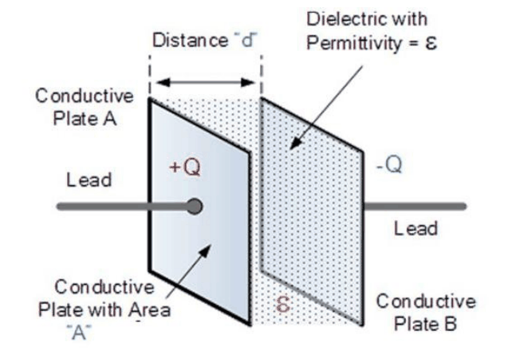
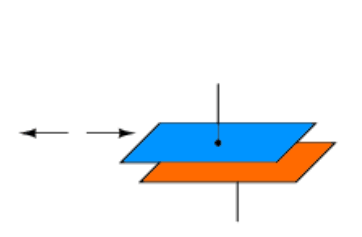
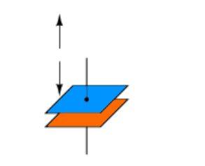
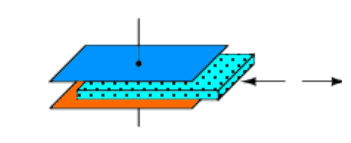
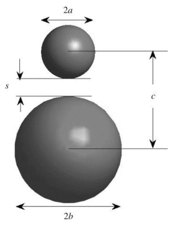
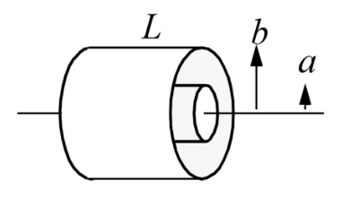
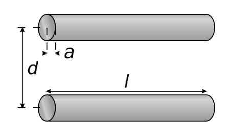
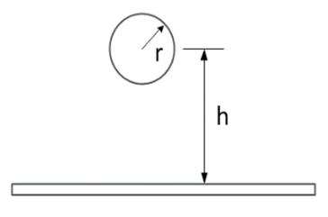

# El sensor capacitiu: model, geometries i linealitat

## 📑 Índice de Contenidos

- [1 La capacitat com a variable de mesura](#1-la-capacitat-com-a-variable-de-mesura)
- [2 El condensador pla](#2-el-condensador-pla)
- [3 Impedància i linealitat](#3-impedància-i-linealitat)
- [4 Les tres variants del condensador pla](#4-les-tres-variants-del-condensador-pla)
  - [Àrea de solapament variable](#àrea-de-solapament-variable)
  - [Separació variable](#separació-variable)
  - [Dielèctric variable](#dielèctric-variable)
- [5 Altres geometries](#5-altres-geometries)
- [6 La tria del dielèctric](#6-la-tria-del-dielèctric)

---

Sistemes de Mesura · **Unitat 7 — Sensors reactius i electromagnètics** · Document 2 de 6

# El sensor capacitiu: model, geometries i linealitat

Dedicació estimada: 8 minuts

> [!NOTE] **Objectius d'aprenentatge**
>
> - Escriure el model del condensador pla i les condicions en què val.
> - Decidir, per a cada paràmetre variable, si la resposta lineal l'ofereix  $C$
> o el mòdul de la impedància.
> - Relacionar cada variant geomètrica del condensador pla amb la seva funció de mesura.
> - Reconèixer les geometries no planes i quan apareixen com a sensor o com a paràsit.
> - Justificar la tria del dielèctric en sensors de precisió.

## 1 La capacitat com a variable de mesura

Un **sensor capacitiu** és un transductor modulador la resposta del qual consisteix en un canvi de la seva capacitat elèctrica en funció de la magnitud que es vol mesurar. Físicament, un condensador és qualsevol configuració de dos conductors separats per un **dielèctric**: un material que no condueix el corrent en condicions normals però que permet l'existència de camps elèctrics al seu interior. Quan s'aplica una diferència de potencial entre els conductors, s'estableix un camp elèctric al dielèctric i s'acumula càrrega a les seves superfícies. La capacitat és la constant de proporcionalitat entre la càrrega acumulada  $Q$
 i la tensió aplicada  $V$
:

$$
C = \frac{Q}{V} \qquad (7.1)
$$

El valor d'aquesta constant depèn **exclusivament de la geometria** del condensador i de la **permitivitat**  $\varepsilon$
 del dielèctric que separa els conductors. Si qualsevol dels dos factors canvia a causa d'una magnitud física externa —un desplaçament, una pressió, un nivell de líquid, la presència d'un material— la capacitat canvia, i mesurar-la dona informació sobre la magnitud que l'ha causat. La relació entre el mesurand  $x$
 i la capacitat és la **funció de mesura**  $C = g(x)$
.

Aquesta funció **pot ser lineal o no lineal** segons la configuració geomètrica del sensor i el mecanisme pel qual  $x$
 actua sobre el condensador. Un cop mesurada  $C$
, o la impedància associada, s'obté  $x$
 invertint  $g$
. Que  $g$
 sigui lineal és desitjable perquè simplifica el circuit de condicionament i redueix els errors sistemàtics associats a la no linealitat.

## 2 El condensador pla

*Figura: Figura 7.1 El condensador pla.*

La configuració més àmpliament emprada és el **condensador pla**: dues plaques conductores planes, de superfície  $A$
 cadascuna, enfrontades paral·lelament i separades una distància  $d$
, amb un dielèctric de permitivitat  $\varepsilon$
 omplint l'espai entre elles. Sota la hipòtesi que les dimensions laterals de les plaques són molt més grans que la separació,  $d \ll l$
, la capacitat és

$$
C = \frac{\varepsilon A}{d} \qquad (7.2)
$$

La capacitat és, doncs, proporcional a l'àrea i a la permitivitat, i inversament proporcional a la separació. Qualsevol magnitud física que modifiqui  $A$
,  $d$
 o  $\varepsilon$
 modifica la capacitat del sensor, i aquesta sola equació cobreix desplaçaments lineals, girs, nivells de líquid i composicions de mescles.

Per fixar l'escala: unes plaques quadrades d'1 cm de costat  $(A = 10^{-4}\,\mathrm{m^2})$
, separades  $d = 1$
 mm i amb aire com a dielèctric  $(\varepsilon \approx \varepsilon_0 = 8{,}854\times10^{-12}\ \mathrm{F/m})$
, donen aproximadament **0,885 pF**. Els sensors capacitius treballen habitualment amb capacitats de desenes a centenars de picofarads, i en tecnologia MEMS baixen fins a uns pocs femtofarads. Aquest ordre de magnitud tan reduït condiciona tot el disseny del circuit de condicionament.

## 3 Impedància i linealitat

Com que el sensor s'opera en alterna a la freqüència de treball  $f_0$
, la variable que el circuit veu és la impedància. Per a un condensador ideal de capacitat  $C$
:

$$
Z_C = \frac{1}{j\,2\pi f C} \qquad (7.3)
$$

que és purament imaginària, i el seu mòdul, particularitzat per al condensador pla, val

$$
|Z| = \frac{1}{2\pi f C} = \frac{d}{2\pi f \varepsilon A} \qquad (7.4)
$$

El mòdul de la impedància és, per tant, **inversament proporcional al producte de la freqüència i la capacitat**, i a freqüència fixada és lineal amb la separació  $d$
 i inversament proporcional a l'àrea i a la permitivitat. D'aquí surt una asimetria fonamental: **la variable que respon linealment al mesurand no és la mateixa segons quin paràmetre variï**.

| El mesurand modifica… | Capacitat  $C$ | Mòdul  $|Z|$ |
|:--- |:--- |:--- |
| l'àrea  $A$   o la permitivitat  $\varepsilon$ | lineal amb  $x$ | inversament proporcional a  $x$ |
| la separació  $d$ | inversament proporcional a  $x$ | lineal amb  $x$ |

Decidir si el condicionador ha de lliurar una sortida proporcional a  $C$
 o a  $|Z|$
 és, doncs, una decisió de disseny amb conseqüències directes sobre la linealitat del sistema complet, i la resposta depèn de quin paràmetre del condensador varia amb el mesurand.

## 4 Les tres variants del condensador pla

### Àrea de solapament variable

*Figura: Figura 7.2 Condensador pla amb àrea variable.*

Una de les plaques es desplaça en direcció **paral·lela** a l'altra, de manera que el solapament passa de  $A_0$
 a  $A(x) = A_0 + \Delta A(x)$
, amb  $\Delta A$
 proporcional a  $x$
:

$$
C(x) = \frac{\varepsilon\,A(x)}{d} \propto x \qquad (7.5)
$$

La capacitat és lineal amb el desplaçament. És la configuració dels sensors d'angle de gir, on el solapament angular entre dues plaques semicirculars varia proporcionalment a l'angle.

### Separació variable

*Figura: Figura 7.3 Condensador pla amb distància variable.*

La placa mòbil es desplaça en direcció **perpendicular**. Si la posició d'equilibri és  $d_0$
 i el desplaçament és  $x$
, la separació passa a ser  $d_0 + x$
 i

$$
C(x) = \frac{\varepsilon A}{d_0 + x} \qquad (7.6)
$$

mentre que el mòdul de la impedància val

$$
|Z(x)| = \frac{d_0 + x}{2\pi f \varepsilon A} \propto d_0 + x \qquad (7.7)
$$

El mòdul de la impedància sí que és lineal amb el desplaçament, i és aquesta particularitat la que s'aprofita en sensors de desplaçament i de pressió, on el condicionament es dissenya per obtenir una tensió proporcional a  $|Z|$
.

### Dielèctric variable

*Figura: Figura 7.4 Condensador pla amb dielèctric variable.*

Dos dielèctrics de permitivitats  $\varepsilon_1$
 i  $\varepsilon_2$
 es distribueixen lateralment entre les plaques i ocupen àrees  $xA$
 i  $(1-x)A$
, amb  $x$
 entre 0 i 1. El sistema es modela com dos condensadors plans en paral·lel:

$$
C(x) = \frac{\varepsilon_1\,xA}{d} + \frac{\varepsilon_2\,(1-x)A}{d} = \frac{A}{d}\left[\varepsilon_2 + (\varepsilon_1-\varepsilon_2)\,x\right] \qquad (7.8)
$$

La capacitat és lineal amb  $x$
 sempre que  $\varepsilon_1 \neq \varepsilon_2$
. És la base dels sensors d'inclinació i de nivell de líquids, on el grau d'ompliment del condensador per part d'un líquid en substitució de l'aire determina el valor de  $x$
.

## 5 Altres geometries

Al costat del condensador pla apareixen geometries que sorgeixen de manera natural en determinades aplicacions, o que s'adopten per adaptar el sensor a una forma constructiva particular. Totes elles serveixen alhora per estimar **capacitats paràsites** del muntatge.

| Geometria | Capacitat | On apareix |
|:--- |:--- |:--- |
| **Dues esferes** radis  $a$   i  $b$, centres separats  $c$ | $C \cong \frac{4\pi\varepsilon}{\frac{a+b}{ab}-\frac{1}{c}}$ | Sensors de proximitat esfèrics; capacitat entre elements conductors arrodonits d'un circuit imprès. |
| **Coaxial** radis  $a$   i  $b$, longitud  $L$ | $C = \frac{2\pi\varepsilon L}{\ln(b/a)}$ | Capacitat entre el conductor viu d'un cable coaxial i la seva malla. Sensors de nivell en tubs coaxials, apreciats per la simetria cilíndrica i la facilitat de neteja. |
| **Dos cables paral·lels** radi  $a$, separació  $d$, longitud  $L$ | $C \cong \frac{\pi\varepsilon}{\ln(d/a)}\,L$ | Cables unifilars que discorren paral·lels, situació habitual entre sensor i condicionador. |
| **Cable sobre pla de massa** radi  $r$, alçada  $h \gg r$, longitud  $L$ | $C = \frac{2\pi\varepsilon L}{\cosh^{-1}(h/r)} \approx \frac{2\pi\varepsilon L}{\ln(2h/r)}$ | Cable no apantallat sobre un pla de massa o una taula metàl·lica. |

*Figura: Figura 7.5 Condensador format per dues esferes conductores.*

*Figura: Figura 7.6 Condensador amb geometria coaxial.*

*Figura: Figura 7.7 Condensador format per dos cables cilíndrics paral·lels.*

*Figura: Figura 7.8 Condensador format per un cable cilíndric i un pla de massa infinit.*

## 6 La tria del dielèctric

La immensa majoria de sensors capacitius comercials fan servir com a dielèctric l'**aire** o un **líquid**.

- L'**aire** és el dielèctric per excel·lència en sensors de desplaçament i posició. La seva permitivitat,  $\varepsilon_{\mathrm{aire}} \approx \varepsilon_0$
, és gairebé independent de la temperatura en el rang habitual d'operació, no contamina i no introdueix pèrdues dielèctriques significatives. Aquesta estabilitat és la que dona als sensors capacitius d'aire la seva notable estabilitat tèrmica.
- Els **líquids** s'aprofiten en sensors de nivell: com que la permitivitat del líquid difereix de la de l'aire, la capacitat creix a mesura que el líquid ocupa l'espai entre les plaques.
- Els **sòlids d'alta permitivitat** —ceràmiques, polímers— són habituals en condensadors d'ús general, però en sensors de mesura precisa s'eviten: la seva permitivitat és sensible a la temperatura, la humitat i l'envelliment, i introdueix derives en la mesura.

La tria de la geometria tampoc no és un aspecte menor, perquè condiciona la sensibilitat, la linealitat de la funció de mesura, la facilitat de fabricació i la vulnerabilitat als efectes paràsits. El dissenyador busca simultàniament el màxim canvi de capacitat per unitat de canvi del mesurand, una relació  $C(x)$
 tan lineal com sigui possible dins del rang d'operació, i una geometria prou robusta per fabricar-se de manera reproduïble.

> [!TIP] **Síntesi**
>
> La capacitat relaciona la càrrega acumulada amb la tensió aplicada i depèn només de la geometria i de la permitivitat del dielèctric; la funció de mesura  $C=g(x)$
> pot ser lineal o no segons la configuració. El condensador pla val  $C=\varepsilon A/d$
> quan  $d \ll l$
>, amb capacitats típiques de pF. El mòdul de la impedància és  $\frac{1}{2\pi f C}$
>: si el mesurand modifica l'àrea o la permitivitat, la resposta lineal l'ofereix  $C$
>; si modifica la separació, l'ofereix  $|Z|$
>. Les tres variants del condensador pla —àrea, separació i dielèctric variables— cobreixen la major part de les aplicacions, i les geometries esfèrica, coaxial, de cables paral·lels i de cable sobre pla serveixen tant de sensor com d'estimació de capacitats paràsites. El dielèctric d'elecció en precisió és l'aire, per la seva estabilitat; els sòlids d'alta permitivitat s'eviten perquè deriven amb temperatura, humitat i envelliment.

[← 1. Fonaments dels sensors reactius](01_Unitat7_Fonaments_dels_sensors_reactius.md)[3. El sensor capacitiu real: vores, guardes, fuita i freqüència de treball →](03_Unitat7_El_sensor_capacitiu_real.md)

---

## 📐 Formulario Resumen de Ecuaciones

| Nº / Ref | Expresión Matemática |
| :---: | :--- |
| **(7.1)** | $C = \frac{Q}{V}$ |
| **(7.2)** | $C = \frac{\varepsilon A}{d}$ |
| **(7.3)** | $Z_C = \frac{1}{j\,2\pi f C}$ |
| **(7.4)** | $\|Z\| = \frac{1}{2\pi f C} = \frac{d}{2\pi f \varepsilon A}$ |
| **(7.5)** | $C(x) = \frac{\varepsilon\,A(x)}{d} \propto x$ |
| **(7.6)** | $C(x) = \frac{\varepsilon A}{d_0 + x}$ |
| **(7.7)** | $\|Z(x)\| = \frac{d_0 + x}{2\pi f \varepsilon A} \propto d_0 + x$ |
| **(7.8)** | $C(x) = \frac{\varepsilon_1\,xA}{d} + \frac{\varepsilon_2\,(1-x)A}{d} = \frac{A}{d}\left[\varepsilon_2 + (\varepsilon_1-\varepsilon_2)\,x\right]$ |