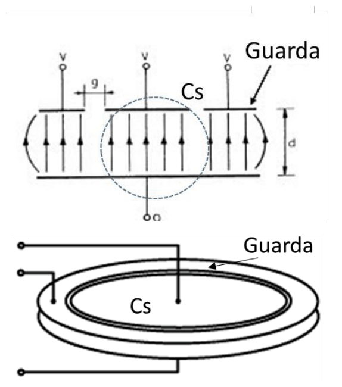
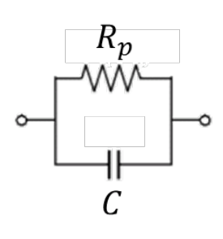
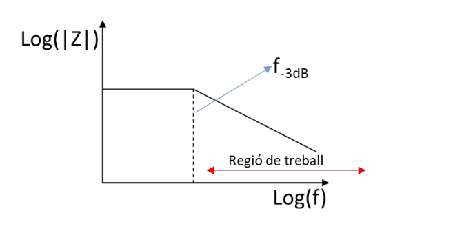

# El sensor capacitiu real: vores, guardes, fuita i freqüència de treball

## 📑 Índice de Contenidos

- [1 Avantatges i limitacions](#1-avantatges-i-limitacions)
- [2 L'efecte de vores](#2-lefecte-de-vores)
- [3 Les guardes de Kelvin](#3-les-guardes-de-kelvin)
- [4 La resistència de fuita del dielèctric](#4-la-resistència-de-fuita-del-dielèctric)
- [5 La tria de la freqüència de treball](#5-la-tria-de-la-freqüència-de-treball)
- [6 Conseqüències per al condicionador](#6-conseqüències-per-al-condicionador)

---

Sistemes de Mesura · **Unitat 7 — Sensors reactius i electromagnètics** · Document 3 de 6

# El sensor capacitiu real: vores, guardes, fuita i freqüència de treball

Dedicació estimada: 12 minuts

> [!NOTE] **Objectius d'aprenentatge**
>
> - Enumerar els avantatges i les limitacions del sensor capacitiu respecte del resistiu.
> - Quantificar l'error de l'efecte de vores i la seva dependència del punt d'operació.
> - Descriure el principi de la guarda de Kelvin i les seves dues configuracions.
> - Escriure el model del condensador amb resistència de fuita i el significat del producte  $R_p C$
>.
> - Justificar la tria de  $f_0$
> a partir de la freqüència de tall i del rang útil d'impedància.

Els models de la secció anterior descriuen el condensador ideal: camp perfectament confinat entre les plaques i dielèctric perfectament aïllant. Els models ideals serveixen per entendre el principi de mesura; el model real hi incorpora les pèrdues i els elements paràsits que fixen les prestacions assolibles i condicionen la tria de la freqüència de treball.

## 1 Avantatges i limitacions

| Avantatge | Fonament |
|:--- |:--- |
| **Estabilitat i reproductibilitat** | La capacitat depèn de magnituds geomètriques i de la permitivitat, de variabilitat molt menor que la resistivitat dels metalls i semiconductors, que depèn de temperatura, microestructura i procés de fabricació. |
| **Baix coeficient tèrmic** | Amb dielèctric d'aire, la permitivitat és pràcticament independent de la temperatura entre −40 °C i +150 °C, davant dels milers de ppm/°C dels materials resistius. Per aquesta mateixa raó els sensors capacitius no s'utilitzen habitualment per mesurar temperatura. |
| **Absència teòrica de soroll** | Un element purament reactiu no dissipa energia i no genera soroll tèrmic. A la pràctica hi ha una resistència paràsita en paral·lel que en genera, però molt menor que el d'una resistència equivalent. |
| **Absència d'autoescalfament** | El sensor capacitiu ideal no dissipa potència i per tant no s'escalfa. |
| **Facilitat de miniaturització** | La capacitat entre conductors plans s'obté en els processos de fabricació de circuits integrats. La tecnologia **MEMS** permet separacions de l'ordre del micròmetre i àrees de mm², amb capacitats d'uns pocs fF a uns centenars de fF reproduïdes amb gran precisió per fotolitografia: acceleròmetres, giroscopis, micròfons i sensors de pressió en silici. |

| Limitació | Efecte |
|:--- |:--- |
| **Efecte de vores** | La capacitat real supera la que prediu  $C = \varepsilon A/d$, amb un error que depèn del punt d'operació. |
| **Resistència de fuita del dielèctric** | Cap dielèctric és perfectament aïllant: apareixen soroll tèrmic i autoescalfament residuals. |
| **Capacitats molt petites** | Amb capacitats de pF o inferiors, qualsevol paràsita en paral·lel —cables, connectors, traces del circuit imprès— s'hi suma directament i pot ser del mateix ordre de magnitud, cosa que introdueix errors sistemàtics a corregir per calibratge. A més no són estables: un cable que es mou, una dilatació del circuit imprès o gotes d'humitat les alteren i produeixen deriva sense que hagi canviat el mesurand. |
| **Alta impedància a baixa freqüència** | Amb capacitats de pF,  $|Z|$   pot arribar a MΩ o GΩ, i un sistema d'alta impedància capta amb facilitat interferències per acoblament capacitiu —la xarxa a 50 Hz, per exemple— que s'injecten a través de les paràsites i emmascaren el senyal. |
| **Necessitat d'apantallament** | Els punts anteriors convergeixen en un disseny acurat del blindatge: pantalla connectada a un potencial de referència estable i condicionador físicament proper al sensor per limitar la longitud de cable i, per tant, les paràsites. |

## 2 L'efecte de vores

L'expressió  $C = \varepsilon A/d$
 s'obté suposant que les línies de camp parteixen perpendicularment d'una placa i arriben perpendicularment a l'altra sense escapar-se del volum que delimiten, hipòtesi que correspon a un condensador de dimensions infinites. En un condensador real, de dimensions finites, les línies que neixen prop dels extrems no resten confinades: és l'**efecte de vores**, i les línies que el manifesten són les **línies de camp de vora**.

L'energia emmagatzemada en aquest camp exterior es reflecteix en capacitat addicional, de manera que la **capacitat real supera** la ideal. L'efecte és tant menys rellevant com més petita és la separació respecte de les dimensions laterals: la condició d'aplicabilitat de la fórmula ideal és  $d \ll l$
, on  $l$
 és la dimensió lateral característica —el costat menor en plaques rectangulars, el diàmetre en plaques circulars.

Per a plaques quadrades de costat  $l$
 i separació  $d$
, amb dielèctric d'aire, Bromwich va demostrar el 1902 que l'error relatiu respecte del valor ideal s'aproxima per

$$
\epsilon_r \approx \frac{d}{\pi l}\left(1 + \ln\frac{2\pi l}{d}\right)\cdot 100\,\% \qquad (7.9)
$$

| Separació  $d$ | $d/l$ | Error  $\epsilon_r$ |
|:--- |:--- |:--- |
| 0,1 mm | 0,01 | ≈ 2,4 % |
| 1 mm | 0,1 | ≈ 16 % |

Una relació separació/costat de només 1/10 ja comporta un error del 16 %. En sensors de desplaçament que operen amb separacions d'entre uns centenars de micròmetres i uns pocs mil·límetres, amb plaques de mida centimètrica, l'error de vores no es pot ignorar en aplicacions de precisió.

L'aspecte especialment problemàtic per a un sensor és que **l'error depèn del punt d'operació**. Com que la separació varia amb el mesurand, l'error de vores hi varia també, i introdueix una **no linealitat addicional** que el model  $C = \varepsilon A/d$
 no recull.

## 3 Les guardes de Kelvin

Quan es requereix elevada exactitud, la primera opció és el **modelat numèric** per elements finits (MEF, o FEM en anglès): la capacitat calculada per simulació incorpora automàticament l'efecte de vores, i comparar-la amb el valor ideal permet establir funcions de correcció. Té límits pràctics, però: exigeix un model geomètric precís, té cost computacional i dona una correcció lligada a la geometria de cada exemplar, poc generalitzable.

Per això la solució preferida és la **guarda de Kelvin**, que elimina l'efecte de vores **físicament** en lloc de corregir-lo a posteriori. La idea, atribuïda a Lord Kelvin (William Thomson, 1824–1907), consisteix a afegir al perímetre de la placa un conductor auxiliar —la guarda— mantingut **exactament al mateix potencial** que la placa sensora.

*Figura: Figura 7.9 Guarda de Kelvin a una cara del condensador. La figura superior mostra un tall amb les variables geomètriques i elèctriques; la inferior, la implementació en un condensador de plaques circulars.*

El principi físic és la **condició de contorn de Dirichlet**: si el conductor perifèric està al mateix potencial que el sensor, no hi ha diferència de potencial entre tots dos i per tant no hi ha camp elèctric a la zona de separació. Les línies que apunten cap a la perifèria no troben cap canvi de potencial en creuar la frontera, de manera que les de la zona central resten rectilínies i la capacitat  $C_s$
 és la d'un condensador pla ideal, sempre que la guarda sigui prou ampla.

A la pràctica, la guarda s'implementa tallant la placa conductora en una zona interior —el sensor  $C_s$
— i una d'exterior —la guarda—, separades per una **ranura molt estreta**: tots dos conductors al mateix pla però elèctricament separats, amb una connexió que mantingui la guarda al potencial de la placa interior en tot moment. Es distingeixen dues configuracions:

- **Guarda en una cara**: la placa superior és el sensor envoltat per la guarda i la inferior és solidària, connectada a massa o al terminal baix del circuit. Les vores de la placa inferior actuen elles mateixes com a guarda per als camps que fugen cap avall.
- **Guarda en les dues cares**: totes dues plaques es divideixen en zona interior i zona perifèrica. Dona el millor confinament de les línies de camp i la menor contribució de vores, a canvi de més complexitat constructiva.

L'error residual d'una guarda ben dissenyada pot fer-se inferior al **0,01 %** si la seva amplada supera dues o tres vegades la separació  $g$
 entre plaques, cosa que la converteix en la solució estàndard en ponts de capacitat de laboratori, sensors de desplaçament nanomètrics i sensors capacitius MEMS d'alta resolució.

## 4 La resistència de fuita del dielèctric

Qualsevol material dielèctric real posseeix una **conductivitat residual**  $\sigma$
, per petita que sigui. Fins i tot l'aire sec en té, a causa dels ions produïts per la radiació còsmica i la radioactivitat natural; els dielèctrics sòlids emprats en suports i encapsulats —poliimides, PTFE, PEEK— presenten conductivitats de l'ordre de  $10^{-16}$
 a  $10^{-12}$
 S/m.

*Figura: Figura 7.10 Model del condensador incorporant la resistència del dielèctric.*

Aquesta conductivitat fa circular entre les plaques un **corrent de fuita** proporcional a la tensió aplicada, de manera que el sensor no es comporta com una capacitat pura sinó com la combinació **en paral·lel** d'una capacitat  $C$
 i una **resistència de fuita**  $R_p$
. Per a un condensador pla,

$$
R_p = \frac{\rho\,d}{A} = \frac{d}{\sigma A} \qquad (7.10)
$$

El corrent de fuita travessa el dielèctric igual que travessaria un material conductor de les mateixes dimensions. Una conseqüència notable és que  $R_p$
 varia **conjuntament** amb  $C$
: si el mesurand modifica la separació, la capacitat disminueix quan  $d$
 augmenta però la resistència de fuita augmenta en la mateixa proporció, de manera que el producte és independent de la geometria:

$$
R_p \cdot C = \frac{d}{\sigma A}\cdot\frac{\varepsilon A}{d} = \frac{\varepsilon}{\sigma} \qquad (7.11)
$$

Aquest producte és la **constant de temps dielèctrica** del material, que depèn únicament de les **propietats del dielèctric**. Si  $C$
 és petita,  $R_p$
 és gran, i a l'inrevés.

La impedància del conjunt paral·lel i el seu mòdul valen

$$
Z = \frac{R_p\cdot\frac{1}{j\omega C}}{R_p+\frac{1}{j\omega C}} = \frac{R_p}{1+j\omega R_p C} \qquad (7.12)
$$

$$
|Z| = \frac{R_p}{\sqrt{1+(2\pi f R_p C)^2}} \qquad (7.13)
$$

## 5 La tria de la freqüència de treball

Per extreure informació sobre  $C$
, i per tant sobre el mesurand, cal que la impedància del sensor estigui dominada per la part capacitiva. La condició és que la reactància del condensador sigui molt menor que la resistència de fuita,  $\frac{1}{\omega_0 C} \ll R_p$
, cosa que situa la freqüència de treball ben per damunt de la **freqüència de tall**

$$
f_{-3\mathrm{dB}} = \frac{1}{2\pi R_p C} = \frac{\sigma}{2\pi\varepsilon} \qquad (7.14)
$$

Per a dielèctrics de qualitat com l'aire o el PTFE,  $\sigma$
 és tan petita que aquesta freqüència pot ser de l'ordre de mHz o μHz, de manera que qualsevol freqüència de treball pràctica hi queda ben per damunt i la hipòtesi d'impedància capacitiva és excel·lent.

*Figura: Figura 7.11 Mòdul de la impedància del sensor en funció de la freqüència.*

El diagrama de Bode del model paral·lel resumeix els dos règims. Per a  $f \ll f_{-3\mathrm{dB}}$
 la impedància és pràcticament resistiva i  $|Z| \approx R_p$
, independent de la freqüència. Per a  $f \gg f_{-3\mathrm{dB}}$
 és pràcticament capacitiva,  $|Z| \approx \frac{1}{2\pi f C}$
, i decreix amb pendent de −20 dB/dècada. Això explica físicament per què no es pot mesurar un sensor capacitiu en contínua: a freqüència zero la impedància és simplement  $R_p$
, que no informa de la capacitat ni, per tant, del mesurand.

Superar  $f_{-3\mathrm{dB}}$
 no és, però, l'únic criteri. Cal també que el mòdul de la impedància tingui un valor manejable per al circuit de condicionament: si  $f_0$
 és massa baixa,  $|Z|$
 arriba a centenars de MΩ o a GΩ i el sistema és molt sensible a interferències; si és massa alta, apareixen efectes inductius paràsits, pèrdues dielèctriques que creixen amb la freqüència i limitacions del propi condicionador. A la pràctica s'escull  $f_0$
 de manera que

$$
100\ \Omega \lesssim |Z(f_0)| \lesssim 1\ \mathrm{M\Omega} \qquad (7.15)
$$

Per a un sensor de 100 pF, aquest rang correspon a freqüències de treball compreses entre uns **1,6 kHz i 16 MHz**. La zona de treball òptima és, doncs, la que queda alhora ben per damunt de  $f_{-3\mathrm{dB}}$
 i dins d'aquest rang d'impedància.

## 6 Conseqüències per al condicionador

La resistència de fuita és responsable dels dos efectes indesitjats ja anticipats. El **soroll tèrmic** podria semblar enorme perquè  $R_p$
 és molt gran (MΩ a GΩ), però queda filtrat per la impedància total del circuit i per una amplada de banda equivalent de soroll proporcional a  $f_{-3\mathrm{dB}}$
; com que  $R_p C = \varepsilon/\sigma$
, el soroll integrat depèn només de les propietats del dielèctric i no de la geometria, de manera que un  $\sigma$
 molt baix dona un soroll molt reduït. L'**autoescalfament residual** prové de la potència dissipada a  $R_p$
 per la tensió d'excitació i, atesa la magnitud de  $R_p$
, és pràcticament inapreciable.

D'aquí surten els requisits del circuit de condicionament, que es desenvolupen a la unitat 8: generar l'excitació sinusoïdal a la freqüència escollida, mesurar la variació de capacitat o de mòdul d'impedància com a canvi d'amplitud o de fase, presentar una impedància d'entrada prou alta per no carregar el sensor i incorporar blindatge actiu per minimitzar les capacitats paràsites del cable.

> [!TIP] **Síntesi**
>
> El sensor capacitiu aporta estabilitat, baix coeficient tèrmic, absència teòrica de soroll i d'autoescalfament i facilitat de miniaturització, i exigeix a canvi gestionar l'efecte de vores, la resistència de fuita, les capacitats paràsites i l'apantallament. L'efecte de vores fa que la capacitat real superi la ideal, amb un error que creix amb  $d/l$
> —del 2,4 % al 16 % en passar de 0,01 a 0,1— i que varia amb el punt d'operació quan el mesurand modifica la separació. Es corregeix per elements finits o, preferiblement, s'elimina amb una guarda de Kelvin al mateix potencial que la placa sensora. El dielèctric real afegeix una resistència de fuita en paral·lel, amb  $R_p = d/(\sigma A)$
> i  $R_p C = \varepsilon/\sigma$
>, que fixa la freqüència de tall  $f_{-3\mathrm{dB}} = \sigma/(2\pi\varepsilon)$
>. La freqüència de treball s'ha de situar ben per damunt d'aquesta i mantenir alhora el mòdul de la impedància entre uns 100 Ω i 1 MΩ.

[← 2. El sensor capacitiu: model, geometries i linealitat](02_Unitat7_El_sensor_capacitiu_model_i_geometries.md)[4. Aplicacions dels sensors capacitius i el condensador diferencial →](04_Unitat7_Aplicacions_capacitives_i_condensador_diferencial.md)

---

## 📐 Formulario Resumen de Ecuaciones

| Nº / Ref | Expresión Matemática |
| :---: | :--- |
| **(7.9)** | $\epsilon_r \approx \frac{d}{\pi l}\left(1 + \ln\frac{2\pi l}{d}\right)\cdot 100\,\%$ |
| **(7.10)** | $R_p = \frac{\rho\,d}{A} = \frac{d}{\sigma A}$ |
| **(7.11)** | $R_p \cdot C = \frac{d}{\sigma A}\cdot\frac{\varepsilon A}{d} = \frac{\varepsilon}{\sigma}$ |
| **(7.12)** | $Z = \frac{R_p\cdot\frac{1}{j\omega C}}{R_p+\frac{1}{j\omega C}} = \frac{R_p}{1+j\omega R_p C}$ |
| **(7.13)** | $\|Z\| = \frac{R_p}{\sqrt{1+(2\pi f R_p C)^2}}$ |
| **(7.14)** | $f_{-3\mathrm{dB}} = \frac{1}{2\pi R_p C} = \frac{\sigma}{2\pi\varepsilon}$ |
| **(7.15)** | $100\ \Omega \lesssim \|Z(f_0)\| \lesssim 1\ \mathrm{M\Omega}$ |