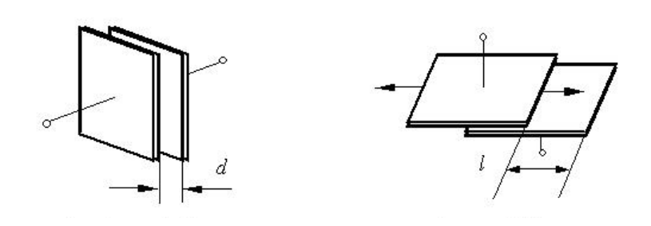
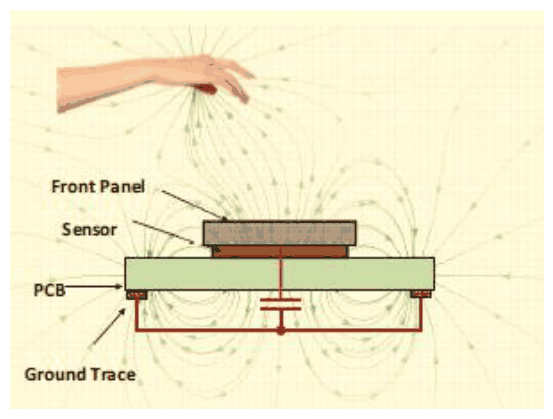
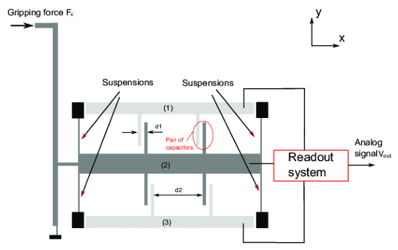
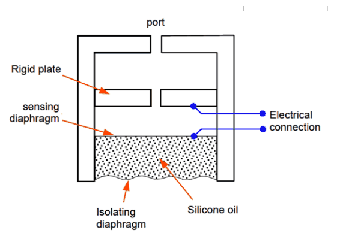
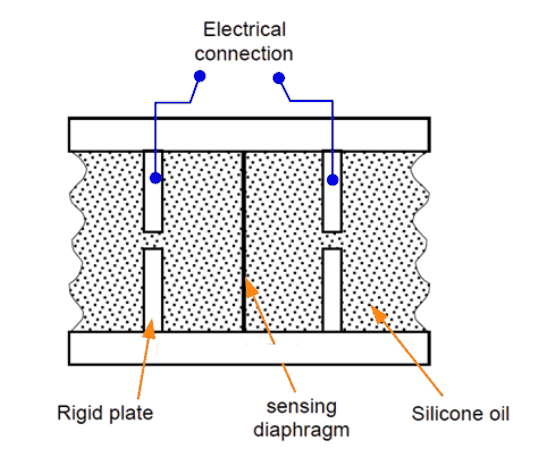
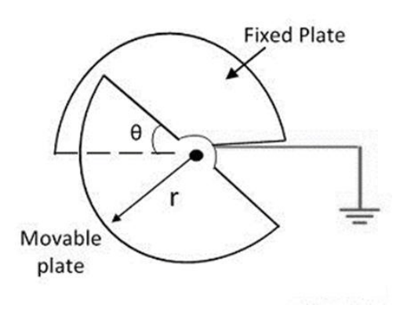
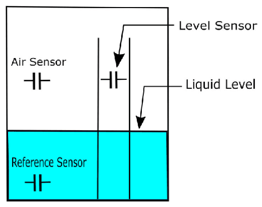
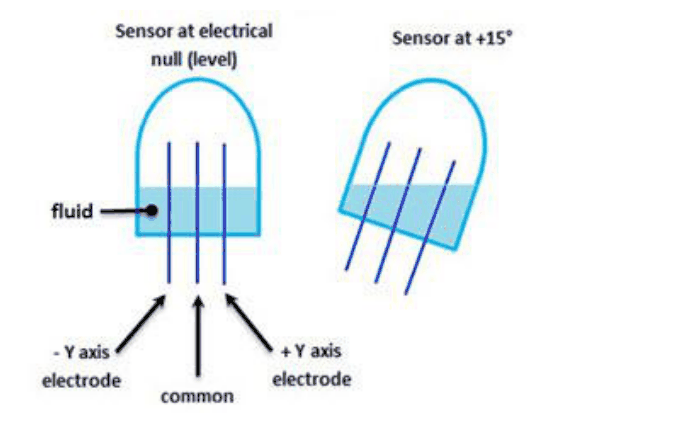
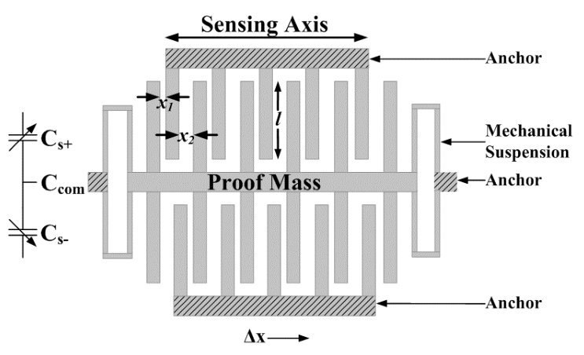

# Aplicacions dels sensors capacitius i el condensador diferencial

## 📑 Índice de Contenidos

- [1 Distància, desplaçament i presència](#1-distància-desplaçament-i-presència)
- [2 Força i pressió](#2-força-i-pressió)
- [3 Angle, nivell i inclinació](#3-angle-nivell-i-inclinació)
- [4 Acceleració: els acceleròmetres MEMS](#4-acceleració-els-acceleròmetres-mems)
- [5 El condensador diferencial](#5-el-condensador-diferencial)

---

Sistemes de Mesura · **Unitat 7 — Sensors reactius i electromagnètics** · Document 4 de 6

# Aplicacions dels sensors capacitius i el condensador diferencial

Dedicació estimada: 8 minuts

> [!NOTE] **Objectius d'aprenentatge**
>
> - Relacionar cada aplicació capacitiva amb el paràmetre del condensador que hi varia.
> - Reconèixer l'element elàstic com a etapa intermèdia en la mesura de força i de pressió.
> - Escriure el model del condensador diferencial i la seva diferència normalitzada.
> - Enumerar els tres avantatges del principi diferencial.

## 1 Distància, desplaçament i presència

*Figura: Figura 7.12 Sensors capacitius per a la mesura de distància i desplaçament.*

És l'aplicació més directa. Un condensador pla amb una placa mòbil respon a qualsevol desplaçament perpendicular a les plaques, que modifica  $d$
, o paral·lel a elles, que modifica el solapament i per tant  $A$
. Aquests sensors assoleixen resolucions de l'ordre del **nanòmetre** en rangs de micròmetres a mil·límetres, i s'utilitzen en màquines de mesura per coordenades i en instruments de nanolitografia.

*Figura: Figura 7.13 Detector de presència capacitiu.*

La **detecció de presència** s'explota d'una manera diferent: en lloc de mesurar un canvi geomètric del sensor, es detecta la **pertorbació** que un objecte conductor o dielèctric provoca en el camp elèctric que l'envolta. Quan un dit s'apropa a una pantalla tàctil, altera la distribució del camp en la matriu de condensadors que la forma, i el circuit de detecció identifica quins elements de la matriu han vist modificada la capacitat. És la base de totes les pantalles tàctils capacitives actuals.

## 2 Força i pressió

El principi de transducció més emprat consisteix a convertir la magnitud mecànica en un **desplaçament** mitjançant un element elàstic —un ressort, una membrana, una biga en voladís— i detectar aquest desplaçament amb un sensor capacitiu. En sensors de pressió, una membrana fina de silici o d'acer inoxidable es deforma sota la pressió i la seva posició es monitora per la variació de capacitat entre la membrana i un elèctrode fix pròxim.

Els sensors de pressió capacitius assoleixen resolucions de l'ordre del pascal en rangs de fins a centenars de kPa, i s'usen en baròmetres d'alta precisió, sensors industrials i mesuradors de buit. La seva resolució i estabilitat tèrmica els fan preferibles a la galga extensomètrica quan les especificacions de soroll i de deriva són exigents.

*Figura: Figura 7.14 Mesura de força fent servir un condensador diferencial.*

La microestructura planar de la figura té una **massa mòbil central** (2) suspesa per quatre suspensions elàstiques entre dos marcs rígids ancorats al substrat, el superior (1) i l'inferior (3), que serveixen de referència mecànica. Quan la força de pinça  $F_c$
 desplaça la massa una distància  $\delta$
, la separació entre (2) i (1) disminueix en  $\delta$
 i la separació entre (2) i (3) augmenta en la mateixa quantitat. La lectura genera una tensió proporcional a  $C_1 - C_2$
, i per tant a  $\delta$
 i, en règim lineal de la suspensió, a la força.

*Figura: Figura 7.15 Mesura de pressió amb condensador variable.*

*Figura: Figura 7.16 Mesura de pressió amb condensador diferencial.*

En el sensor de pressió de condensador únic, el fluid actua pel port superior sobre el **diafragma sensor**, que és un dels elèctrodes: en augmentar la pressió el diafragma s'allunya de la placa rígida i la capacitat disminueix. La versió diferencial situa una **placa rígida a cada costat** del diafragma, de manera que quan la pressió diferencial el deflecta,  $C_1$
 augmenta i  $C_2$
 disminueix. En tots dos casos, l'oli de silicona que omple la cambra actua alhora de transmissor hidrostàtic de la pressió i de protecció mecànica del diafragma davant de fluids agressius i de sobrepressió.

## 3 Angle, nivell i inclinació

*Figura: Figura 7.17 Mesura d'angle amb condensador variable.*

En sensors de posició angular, una placa en forma d'arc de cercle és solidària a l'eix mòbil i l'altra resta fixa. A mesura que l'eix gira, l'àrea de solapament canvia proporcionalment a l'angle i la capacitat hi varia linealment.

*Figura: Figura 7.18 Mesura de nivell amb condensador variable.*

Els sensors de nivell aprofiten la diferència de permitivitat entre el líquid  $(\varepsilon_l \gg \varepsilon_0$
 per a la majoria de líquids polars $)$
 i l'aire. A mesura que el nivell puja, el líquid ocupa progressivament l'espai entre les plaques i la capacitat creix proporcionalment al nivell:

$$
C(h) = C_{\mathrm{aire}} + \left(C_{\mathrm{líquid}} - C_{\mathrm{aire}}\right)\cdot\frac{h}{H} \qquad (7.16)
$$

on  $H$
 és l'alçada total del sensor. La geometria coaxial és molt emprada aquí per la seva simetria cilíndrica i la seva facilitat de neteja. S'utilitzen en indústria química, farmacèutica i alimentària, fins i tot a pressions i temperatures elevades on altres tecnologies resulten impracticables.

*Figura: Figura 7.19 Mesura d'inclinació amb condensador diferencial.*

Els sensors d'**inclinació** aprofiten el desplaçament d'una bombolla d'aire en un tub parcialment ple de líquid, o el moviment d'una massa de mercuri o d'un electròlit entre elèctrodes. Sense inclinació, totes dues capacitats són iguals; amb inclinació positiva, el condensador de la dreta augmenta perquè té més nivell de líquid i el de l'esquerra disminueix, i amb inclinació negativa el canvi és l'oposat.

## 4 Acceleració: els acceleròmetres MEMS

*Figura: Figura 7.20 Mesura d'acceleració amb condensador diferencial.*

El principi s'inspira en la llei de Newton: una massa inercial suspesa per una estructura elàstica —bigues o ressorts en voladís de silici monocristal·lí— es deforma proporcionalment a l'acceleració, i la deformació es tradueix en un canvi de separació o de solapament entre els elèctrodes solidaris a la massa i els elèctrodes fixos del substrat. Un acceleròmetre MEMS típic conté **milers de dents interdigitades**, cadascuna un petit condensador pla entre la pinta mòbil i la fixa: quan la massa es desplaça, totes les capacitats varien alhora i la suma porta la sensibilitat a valors pràctics, de l'ordre de **pF/g**, amb resolucions de fins a μg i rangs de ±2 g en telèfons mòbils a ±200 g en automoció i airbags.

## 5 El condensador diferencial

En moltes de les aplicacions anteriors el sensor no és un condensador únic sinó una **parella** en configuració diferencial: quan el mesurand incrementa la capacitat d'un en una quantitat  $\Delta C$
, disminueix la de l'altre en la mateixa quantitat.

$$
C_1(x) = C_0 + \Delta C(x)\;\qquad C_2(x) = C_0 - \Delta C(x) \qquad (7.17)
$$

on  $C_0$
 és la capacitat de repòs. La diferència  $C_1 - C_2 = 2\Delta C(x)$
 és el doble de sensible que un condensador únic, i la suma  $C_1 + C_2 = 2C_0$
 és idealment constant i independent de  $x$
. Això permet condicionaments que exploten el **quocient diferencial normalitzat**

$$
\frac{C_1-C_2}{C_1+C_2} = \frac{\Delta C}{C_0} \qquad (7.18)
$$

que és lineal amb  $x$
 i independent de les derives de  $C_0$
 amb la temperatura. Els avantatges del principi diferencial són tres:

| Avantatge | Mecanisme |
|:--- |:--- |
| **Sensibilitat doble** | Per al mateix rang de mesura, la variació de la sortida diferencial és el doble de la de qualsevol dels dos condensadors per separat. |
| **Rebuig de mode comú** | Qualsevol pertorbació que afecti igual els dos condensadors —una variació de temperatura, una interferència electromagnètica, un canvi de geometria per desgast— s'elimina en fer la diferència. |
| **Linealitat millorada** | Un sol condensador de separació variable respon com  $C = \varepsilon A/(d_0+x)$. La combinació de dos condensadors, un amb  $d_0+x$   i l'altre amb  $d_0-x$, muntats en un divisor de tensió, dona una resposta diferencial que en primera aproximació sí que és lineal amb  $x$   per a desplaçaments petits respecte de  $d_0$. El desenvolupament d'aquests condicionadors es fa a la unitat 8. |

La compensació és, però, la que permet la simetria constructiva assolida: en un sensor real les dues branques no són idènticament iguals i el calibratge continua essent necessari.

Per aquestes raons, els acceleròmetres capacitius MEMS, els sensors de pressió diferencial, els sensors de posició d'alta precisió i una gran varietat d'instruments de laboratori fan del principi diferencial l'element central del seu disseny.

> [!TIP] **Síntesi**
>
> Les aplicacions capacitives es classifiquen segons el paràmetre que hi varia: la separació o el solapament en distància, desplaçament i angle; la permitivitat efectiva en nivell i inclinació; i la pertorbació del camp exterior en detecció de presència. Força i pressió es mesuren convertint-les primer en desplaçament amb un element elàstic —membrana, ressort o biga en voladís—, i l'acceleració amb una massa inercial suspesa, en acceleròmetres MEMS de milers de dents interdigitades i sensibilitat de l'ordre de pF/g. Moltes d'aquestes aplicacions adopten el condensador diferencial, amb  $C_1 = C_0+\Delta C$
> i  $C_2 = C_0-\Delta C$
>, que duplica la sensibilitat, rebutja les pertorbacions comunes a les dues branques i millora la linealitat mitjançant la diferència normalitzada  $\Delta C/C_0$
>.

[← 3. El sensor capacitiu real: vores, guardes, fuita i freqüència de treball](03_Unitat7_El_sensor_capacitiu_real.md)[5. Sensors inductius i corrents de Foucault →](05_Unitat7_Sensors_inductius_i_corrents_de_Foucault.md)

---

## 📐 Formulario Resumen de Ecuaciones

| Nº / Ref | Expresión Matemática |
| :---: | :--- |
| **(7.16)** | $C(h) = C_{\mathrm{aire}} + \left(C_{\mathrm{líquid}} - C_{\mathrm{aire}}\right)\cdot\frac{h}{H}$ |
| **(7.17)** | $C_1(x) = C_0 + \Delta C(x)\;\qquad C_2(x) = C_0 - \Delta C(x)$ |
| **(7.18)** | $\frac{C_1-C_2}{C_1+C_2} = \frac{\Delta C}{C_0}$ |