# Sensors inductius i corrents de Foucault

## 📑 Índice de Contenidos

- [1 L'autoinductància](#1-lautoinductància)
- [2 Reluctància i entreferro](#2-reluctància-i-entreferro)
- [3 Què fa variar la inductància](#3-què-fa-variar-la-inductància)
- [4 Inductància mútua i necessitat d'excitació alterna](#4-inductància-mútua-i-necessitat-dexcitació-alterna)
- [5 Objectiu metàl·lic: limitació i fortalesa](#5-objectiu-metàllic-limitació-i-fortalesa)
- [6 La tria del nucli i del conductor](#6-la-tria-del-nucli-i-del-conductor)
- [7 Aplicacions dels sensors de bobina](#7-aplicacions-dels-sensors-de-bobina)
- [8 Corrents de Foucault](#8-corrents-de-foucault)

---

Sistemes de Mesura · **Unitat 7 — Sensors reactius i electromagnètics** · Document 5 de 6

# Sensors inductius i corrents de Foucault

Dedicació estimada: 15 minuts

> [!NOTE] **Objectius d'aprenentatge**
>
> - Escriure el model de la inductància d'una bobina i identificar què hi pot fer variar el mesurand.
> - Relacionar reluctància, entreferro i inductància.
> - Distingir el mecanisme dels materials ferromagnètics del dels conductors no ferromagnètics.
> - Contrastar bobina d'aire i bobina amb nucli ferromagnètic com a decisió de disseny.
> - Explicar l'origen dels corrents de Foucault, l'efecte pell i les seves dues aplicacions.

## 1 L'autoinductància

Un **sensor inductiu** és un transductor modulador la resposta del qual consisteix en un canvi de la seva autoinductància, o de la seva inductància mútua amb una altra bobina, en funció de la magnitud que es vol mesurar.

Quan un corrent circula per un conductor enrotllat en bobina, genera un camp magnètic proporcional al corrent. Part d'aquest camp travessa els propis enrotllaments i genera un flux concatenat  $\Phi$
. Per la llei de Faraday, una variació temporal d'aquest flux indueix a la pròpia bobina una força electromotriu que s'oposa a la variació que l'ha causada, que és la llei de Lenz. L'**autoinductància** és la constant de proporcionalitat entre el flux concatenat i el corrent que el genera:

$$
L = \frac{N\Phi}{I} \qquad (7.19)
$$

on  $N$
 és el nombre total de voltes. En aplicacions de sensors, els valors típics es troben entre μH i mH.

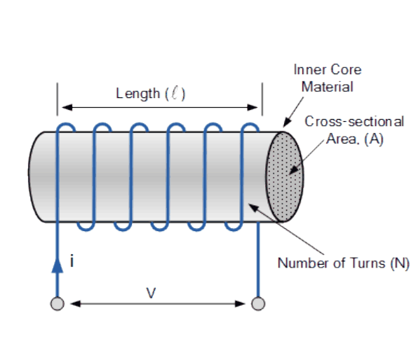

*Figura: Figura 7.21 Solenoide.*

Per a una geometria senzilla com el solenoide, la inductància s'estima com

$$
L = \mu_0\,\mu_r\,n^2\,F_c\,F_g \qquad (7.20)
$$

| Paràmetre | Significat |
|:--- |:--- |
| $\mu_0$ | Permeabilitat magnètica del buit,  $4\pi\times10^{-7}$   T·m/A. |
| $\mu_r$ | Permeabilitat relativa del nucli, adimensional: quantes vegades el material és més permeable al flux que el buit. Val aproximadament 1 per a l'aire i la majoria de materials no magnètics, i de centenars a centenars de milers en ferromagnètics —ferro dolç, ferrites, permalloy. |
| $n$ | Densitat d'enrotllament, en voltes per metre:  $n = N/l$. |
| $F_c$ | Factor de correcció de pèrdues del nucli, per histèresi i per corrents de Foucault. Val 1 en una bobina sense nucli; en nuclis ferromagnètics reals és inferior a 1 i depèn del corrent. |
| $F_g$ | Factor geomètric, que recull la forma del nucli —cilíndric, toroïdal, en U. Per a un solenoide ideal de longitud  $l$   i secció  $A$   val  $F_g = l\cdot A$, el volum de la bobina. |

## 2 Reluctància i entreferro

Una manera equivalent i sovint més còmoda de raonar sobre aquests sensors és mitjançant la **reluctància magnètica**  $\mathcal{R}$
, l'oposició que un camí magnètic ofereix a l'establiment del flux. Per a un tram de longitud  $l$
 i secció  $A$
 de material de permeabilitat  $\mu_0\mu_r$
:

$$
\mathcal{R} = \frac{l}{\mu_0\mu_r A}\;\qquad L = \frac{N^2}{\mathcal{R}} \qquad (7.21)
$$

La inductància és, doncs, **inversament proporcional a la reluctància** del camí magnètic. Un material ferromagnètic que completi el camí de flux hi aporta una permeabilitat elevada i, per tant, **redueix** la reluctància i augmenta la inductància. Els trams d'aire del camí —els **entreferros**— tenen  $\mu_r \approx 1$
 i dominen la reluctància total encara que siguin curts, de manera que qualsevol mesurand que en modifiqui la longitud produeix un canvi gran de la inductància. Aquest és el mecanisme de la major part dels sensors inductius de desplaçament, força i pressió.

## 3 Què fa variar la inductància

- **Canvis geomètrics**: qualsevol desplaçament o deformació que modifiqui la longitud, la secció o el factor geomètric altera la inductància, cosa que permet mesurar desplaçaments, pressions, forces i girs.
- **Canvis del nombre de voltes**: si part del bobinatge es connecta o desconnecta mecànicament,  $n$
   i per tant  $L$
   canvien. Implementació poc habitual, possible en sensors de posició de llarg recorregut.
- **Canvis de permeabilitat del camí**: un material ferromagnètic o conductor a prop de la bobina redistribueix el flux i modifica la inductància efectiva. És la base dels sensors de proximitat i distància sense contacte.

El mecanisme de la distorsió depèn del **tipus de material** objectiu:

| Material proper | Mecanisme i efecte sobre  $L$ |
|:--- |:--- |
| **Ferromagnètic** | Les línies de camp tendeixen a concentrar-se en el material, cosa que modifica el flux concatenat i **augmenta** la inductància efectiva. La magnitud del canvi depèn de la permeabilitat, de la geometria i de la distància. |
| **Conductor no ferromagnètic** (alumini, coure, acer austenític) | Domina la generació de **corrents de Foucault**, que creen un camp contrari al de la bobina i **redueixen** el flux net concatenat i, per tant, la inductància efectiva. |

En tots dos casos la variació d'inductància és funció de la distància entre la bobina i l'objecte, cosa que permet construir sensors de distància o proximitat **sense cap contacte mecànic**.

## 4 Inductància mútua i necessitat d'excitació alterna

Quan dues bobines són prou properes, part del flux generat per la **primària** travessa les voltes de la **secundària** i hi indueix una tensió. La constant de proporcionalitat entre el flux que el primari crea al secundari i el corrent que hi circula és la **inductància mútua**  $M$
, i la tensió induïda val

$$
V_s = j\omega M I_p = j\omega M\,\frac{V_p}{j\omega L_p} = \frac{M}{L_p}\,V_p \qquad (7.22)
$$

Si la posició relativa entre primari i secundari varia —perquè un nucli ferromagnètic mòbil redistribueix el flux entre tots dos—,  $M$
 canvia i amb ella la tensió induïda. Aquest és el principi de la LVDT, el resolver, el synchro i l'inductosyn, que es tracten al document següent.

Els sensors inductius comparteixen amb els capacitius la impossibilitat de mesurar-se en contínua: la impedància d'una inductància ideal en contínua és nul·la i la bobina és simplement un curtcircuit. Cal excitar-la a una freqüència de treball tal que la **reactància inductiva**

$$
X_L = \omega L = 2\pi f_0 L \qquad (7.23)
$$

tingui un valor mesurable. En una bobina real la impedància en contínua és la resistència del bobinatge  $R_{\mathrm{bob}}$
, modelada en sèrie amb l'autoinductància, i cal pujar en freqüència perquè  $\omega L$
 sigui rellevant davant seu. Aquesta mateixa resistència sèrie és l'única font de soroll tèrmic del sensor inductiu real, ja que la inductància ideal no en genera.

Els sensors inductius s'agrupen, per tant, en dues famílies: els **basats en una sola bobina**, en què es mesura la variació de l'autoinductància —sensors de proximitat estàndard i sensors de corrents de Foucault—, i els **basats en transformadors variables**, en què es mesura la variació de la inductància mútua.

## 5 Objectiu metàl·lic: limitació i fortalesa

El principi de funcionament requereix que l'objecte a detectar sigui **metàl·lic**: els materials no metàl·lics —plàstics, gomes, vidre, fustes, ceràmiques seques, líquids no conductors— no pertorben de manera apreciable el camp de la bobina. La limitació és, paradoxalment, una de les fortaleses del sensor en entorns industrials, perquè permet discriminar amb fiabilitat entre objectes metàl·lics i no metàl·lics i fa que pols, oli, aigua, fang, vibracions i vapors químics no afectin la resposta.

La resposta, però, **no és idèntica per a tots els metalls**: la magnitud i el caràcter de la pertorbació depenen de la conductivitat i de la permeabilitat del material objectiu i de la freqüència de treball. Un sensor calibrat per a ferro dolç dona lectures diferents davant d'alumini; en alta precisió cal especificar el material objectiu i calibrar-hi el sensor.

## 6 La tria del nucli i del conductor

|  | Bobina d'aire  $(\mu_r\approx 1)$ | Nucli ferromagnètic  $(\mu_r\gg 1)$ |
|:--- |:--- |:--- |
| **Sensibilitat** | Menor: el flux és molt inferior per al mateix corrent i nombre de voltes, i cal augmentar voltes o excitació. | Major:  $L \propto \mu_r$, de  $10^3$   a  $10^5$, amb molta més variació de  $L$   per unitat de desplaçament a igualtat de dimensions. |
| **Linealitat** | Resposta reversible i lineal en un ampli rang de corrents: sense nucli ferromagnètic no hi ha histèresi magnètica. | La permeabilitat depèn del camp aplicat i presenta histèresi, cosa que introdueix no linealitats i deriva. |
| **Freqüència útil** | Sense pèrdues de nucli, s'excita a diversos MHz sense degradació apreciable. | Les pèrdues per corrents de Foucault al nucli creixen amb el quadrat de la freqüència: per damunt d'uns kHz —i d'uns 20 kHz en nuclis de ferro— dominen, la inductància efectiva cau i el factor de qualitat es degrada. Per a freqüències altes s'usen **ferrites**, ferromagnètics ceràmics de conductivitat molt menor, que permeten treballar fins a centenars de kHz o alguns MHz. |

El conductor del bobinatge sol ser **coure**, per la seva resistivitat molt baixa  $(\rho_{\mathrm{Cu}} \approx 1{,}7\times10^{-8}\ \Omega\cdot\mathrm{m})$
, que minimitza  $R_{\mathrm{bob}}$
 i, amb ella, el soroll i l'autoescalfament. Quan el pes és crític —instruments aeroespacials, sensors embarcats— es prefereix l'**alumini**, unes tres vegades menys dens, a canvi d'una resistivitat superior  $(\rho_{\mathrm{Al}} \approx 2{,}7\times10^{-8}\ \Omega\cdot\mathrm{m})$
 i, per tant, de més soroll i més autoescalfament.

## 7 Aplicacions dels sensors de bobina

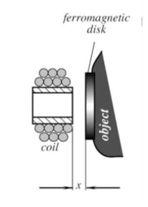

*Figura: Figura 7.22 Mesura de distància amb sensor inductiu amb nucli obert.*

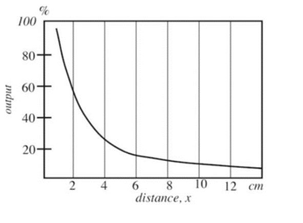

*Figura: Figura 7.23 Variació relativa de la inductància amb la distància.*

En la configuració de **nucli obert**, la variable mesurada és la distància  $x$
 entre la cara frontal de la bobina i un disc ferromagnètic. Quan l'objecte s'acosta, la permeabilitat efectiva del camí magnètic augmenta i la inductància creix. La corba de resposta és **hiperbòlica decreixent**: a la figura 7.23 s'acosta al 100 % per a  $x \to 0$
, cau al 55–60 % cap als 2 cm, al 20–25 % entre 4 i 5 cm, i s'aplana cap al 5–10 % per damunt dels 8–10 cm.

| Configuració | Principi |
|:--- |:--- |
| **Mig nucli toroïdal** (figura 7.24) | Nucli toroïdal amb bobina helicoïdal i un entreferro orientat cap a l'objecte. Les línies de flux surten parcialment per l'entreferro i es tanquen a través de l'objecte ferromagnètic: com més a prop és, més flux s'hi canalitza i més gran és la inductància. El nucli tancat millora la linealitat i la sensibilitat respecte del nucli obert i redueix la influència de pertorbacions externes. |
| **Diferencial en pont** (figura 7.25) | Dues bobines simètriques sobre dos nuclis en U enfrontats, amb una armadura mòbil central. En repòs els dos entreferros són iguals i les inductàncies coincideixen; en desplaçar-se l'armadura cap a  $L_1$, aquesta augmenta i  $L_2$   disminueix. Integrades en un pont de Wheatstone amb dues resistències, en equilibri la sortida és nul·la i el desequilibri dona una tensió proporcional al desplaçament. Les variacions de temperatura o de permeabilitat afecten igual les dues bobines i queden cancel·lades. |
| **Mesura de força** (figures 7.26 a 7.28) | La força es converteix en desplaçament amb un element elàstic. Tres variants: el bobinatge es desplaça respecte d'un **imant permanent** i la interacció entre els dos camps fluctua amb la posició relativa; el desplaçament mou un **nucli ferromagnètic** dins de la bobina, amb un canvi de  $L$   força lineal; o **dos nuclis** se separen entre si, de manera que com més a prop són, més concentrat és el flux i més gran la inductància. |
| **Mesura de gir** (figura 7.29) | Tacòmetre per a rodes dentades, engranatges o discs foradats. La roda ferromagnètica és solidària a l'eix i la bobina té un nucli imantat separat d'ella una distància que depèn de l'angle: el gir provoca augments i disminucions abruptes d'inductància síncrones amb la roda. |
| **Mesura de gruix** (figura 7.30) | Per a materials **no ferromagnètics**, el gruix  $e$   s'interposa com un entreferro d'aire entre el nucli i una base ferromagnètica de referència, i la inductància disminueix en augmentar  $e$   perquè el flux es dispersa. Per a materials **ferromagnètics**, com més gran és  $e$   més flux pot conduir el material i més gran és la inductància. |
| **Mesura de pressió** (figura 7.31) | En repòs el diafragma és pla a una distància nominal i el flux es distribueix uniformement pels tres pols d'un nucli en E, amb inductància màxima. En aplicar pressió, el diafragma es comba cap a l'exterior, l'entreferro creix i la inductància cau. |

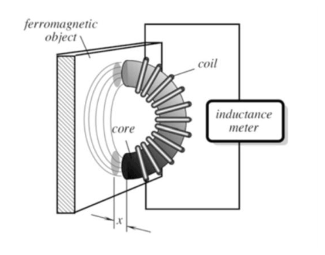

*Figura: Figura 7.24 Mesura de distància amb sensor inductiu amb mig nucli toroïdal.*

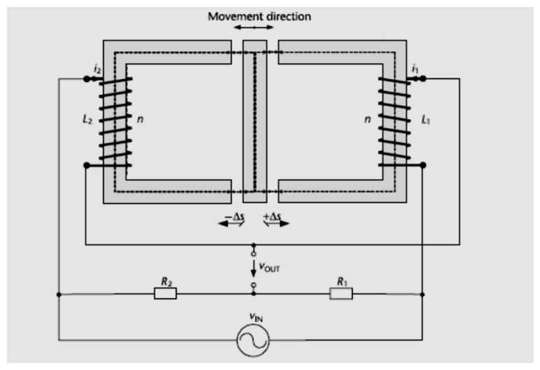

*Figura: Figura 7.25 Mesura de distància amb sensor inductiu diferencial.*

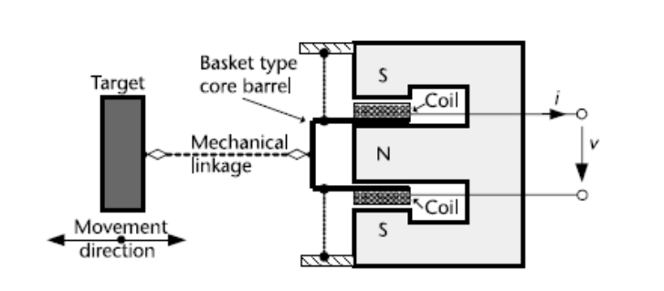

*Figura: Figura 7.26 Mesura de força amb inductància i imant permanent.*

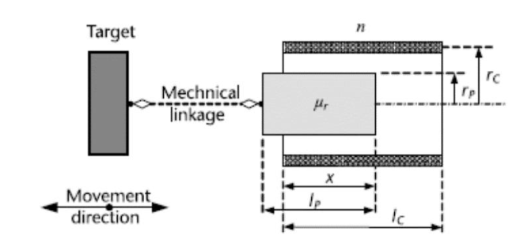

*Figura: Figura 7.27 Mesura de força amb inductància i nucli ferromagnètic mòbil.*

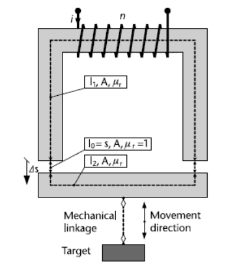

*Figura: Figura 7.28 Mesura de força o distància amb dos nuclis separats per una distància petita.*

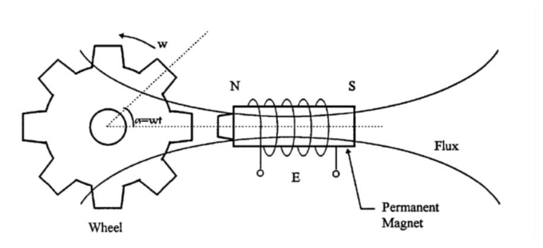

*Figura: Figura 7.29 Mesura inductiva de gir.*

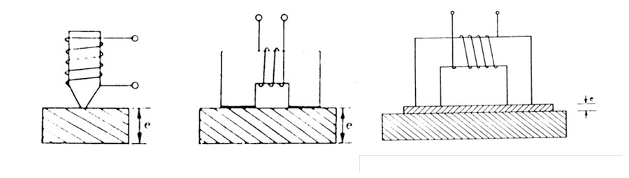

*Figura: Figura 7.30 Mesura inductiva de gruix.*

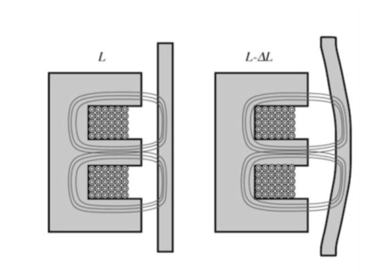

*Figura: Figura 7.31 Mesura inductiva de pressió.*

## 8 Corrents de Foucault

Els **corrents de Foucault** —*eddy currents* en anglès, en honor del físic francès Léon Foucault (1819–1868)— són corrents elèctrics que s'indueixen en la massa d'un conductor quan aquest s'exposa a un **camp magnètic variable en el temps**. És una conseqüència directa de la llei de Faraday: el camp magnètic variable genera un camp elèctric rotacional al conductor que hi fa circular corrent. Si el camp incident és perpendicular a la superfície, el corrent induït forma espirals circulars prop de la superfície del conductor.

Per la llei de Lenz, aquests corrents circulen en el sentit que genera un camp magnètic **contrari** al que els ha causat. La conseqüència directa sobre la bobina que genera el camp és que la seva inductància efectiva **disminueix** en presència del conductor, perquè el camp dels corrents induïts redueix el flux net concatenat.

Els corrents no es distribueixen uniformement pel volum del conductor: per l'**efecte pell** queden confinats en una capa superficial de **profunditat de penetració**

$$
\delta_s = \sqrt{\frac{2}{\omega\mu_0\mu_r\sigma}} = \frac{1}{\sqrt{\pi f \mu_0\mu_r\sigma}} \qquad (7.24)
$$

que decreix amb la freqüència, amb la permeabilitat i amb la conductivitat. Per a l'alumini  $(\sigma \approx 3{,}8\times10^7\ \mathrm{S/m})$
,  $\delta_s \approx 82$
 μm a 1 MHz i  $\approx 26$
 μm a 10 MHz; per al ferro  $(\sigma \approx 10^7\ \mathrm{S/m},\ \mu_r \approx 1000)$
 ja és de  $\approx 160$
 μm a només 1 kHz. La profunditat de penetració determina fins a quina profunditat el sensor és sensible a la microestructura del material i, per tant, la resolució en profunditat per a la detecció de defectes.

La intensitat dels corrents induïts, i per tant la pertorbació que introdueixen en la inductància, és proporcional a la conductivitat del material i a la freqüència del camp incident. D'aquí que aquests sensors treballin a freqüències de l'ordre de **MHz**: a freqüències baixes els corrents serien massa febles per produir una variació detectable, especialment en materials no ferromagnètics de conductivitat moderada. I com que les pèrdues d'un nucli ferromagnètic a MHz en degradarien el funcionament, empren **bobines sense nucli ferromagnètic**: l'absència de nucli redueix la inductància disponible, però l'alta freqüència ho compensa parcialment.

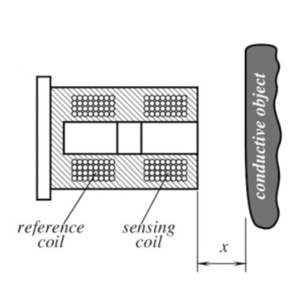

*Figura: Figura 7.32 Mesura de distància amb sensors de corrent de Foucault.*

La primera aplicació és la **mesura de distància i proximitat de conductors no ferromagnètics** —alumini, coure, acer inoxidable austenític—, que els sensors inductius de nucli ferromagnètic no detecten bé. La bobina sensora es munta fixa i el conductor objectiu s'hi aproxima: com menor és la distància, més intensos són els corrents induïts i major la reducció d'inductància. S'hi afegeix habitualment una **bobina de referència**, idèntica però allunyada de l'objecte, en configuració de pont de Wheatstone: la mesura diferencial elimina les derives tèrmiques i les variacions de freqüència d'excitació comunes a les dues branques.

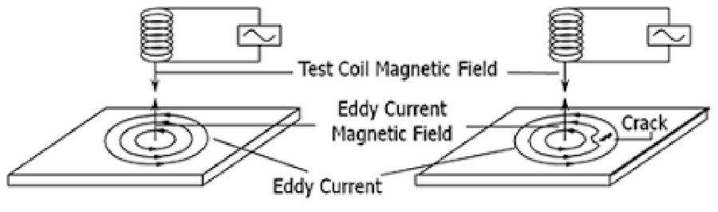

*Figura: Figura 7.33 Mesura de fissures amb sensors de corrent de Foucault.*

La segona és la **inspecció no destructiva** (NDT) de peces metàl·liques per detectar fissures, inclusions i porositats. Quan la bobina es desplaça paral·lelament a una superfície sense defectes, els corrents hi circulen sense interrupció; en arribar a una discontinuïtat no la poden creuar i es **redistribueixen**, cosa que altera el camp que retorna a la bobina i en canvia la inductància de manera detectable. La tècnica detecta fissures de profunditat molt inferior a la de penetració, amb una resolució que depèn de la freqüència, de la geometria de la bobina i del material. S'aplica en peces aeronàutiques, canonades, recipients a pressió, raïls i soldadures estructurals.

> [!TIP] **Síntesi**
>
> L'autoinductància relaciona el flux concatenat amb el corrent que el genera, i per a un solenoide val  $L = \mu_0\mu_r n^2 F_c F_g$
>, o equivalentment  $L = N^2/\mathcal{R}$
>: un ferromagnètic redueix la reluctància i augmenta  $L$
>, i l'entreferro la domina. El mesurand pot actuar sobre la geometria, sobre el nombre de voltes o sobre la permeabilitat del camí, i un conductor no ferromagnètic proper redueix  $L$
> per corrents de Foucault. Com que en contínua només queda  $R_{\mathrm{bob}}$
>, cal excitació alterna a una freqüència que faci  $\omega L$
> rellevant. L'objectiu ha de ser metàl·lic i la resposta depèn de la seva conductivitat i permeabilitat. La bobina d'aire aporta linealitat i freqüència alta; el nucli ferromagnètic, sensibilitat a canvi d'histèresi i de pèrdues creixents amb la freqüència. Els corrents de Foucault, confinats per l'efecte pell a una profunditat  $\delta_s$
> que decreix amb  $f$
>,  $\mu_r$
> i  $\sigma$
>, sostenen la mesura de distància a conductors no ferromagnètics i la inspecció no destructiva de fissures.

[← 4. Aplicacions dels sensors capacitius i el condensador diferencial](04_Unitat7_Aplicacions_capacitives_i_condensador_diferencial.md)[6. Transformadors variables, efecte Hall i magnetostricció →](06_Unitat7_Transformadors_variables_Hall_i_magnetostriccio.md)

---

## 📐 Formulario Resumen de Ecuaciones

| Nº / Ref | Expresión Matemática |
| :---: | :--- |
| **(7.19)** | $L = \frac{N\Phi}{I}$ |
| **(7.20)** | $L = \mu_0\,\mu_r\,n^2\,F_c\,F_g$ |
| **(7.21)** | $\mathcal{R} = \frac{l}{\mu_0\mu_r A}\;\qquad L = \frac{N^2}{\mathcal{R}}$ |
| **(7.22)** | $V_s = j\omega M I_p = j\omega M\,\frac{V_p}{j\omega L_p} = \frac{M}{L_p}\,V_p$ |
| **(7.23)** | $X_L = \omega L = 2\pi f_0 L$ |
| **(7.24)** | $\delta_s = \sqrt{\frac{2}{\omega\mu_0\mu_r\sigma}} = \frac{1}{\sqrt{\pi f \mu_0\mu_r\sigma}}$ |