# Transformadors variables, efecte Hall i magnetostricció

## 📑 Índice de Contenidos

- [1 Transformadors variables](#1-transformadors-variables)
- [2 La LVDT](#2-la-lvdt)
  - [La posició de nul i el signe del desplaçament](#la-posició-de-nul-i-el-signe-del-desplaçament)
  - [Efectes no ideals i freqüència òptima](#efectes-no-ideals-i-freqüència-òptima)
- [3 El resolver](#3-el-resolver)
- [4 Sensors d'efecte Hall](#4-sensors-defecte-hall)
  - [Aplicacions](#aplicacions)
- [5 Sensors magnetostrictius](#5-sensors-magnetostrictius)
  - [Sensor de temps de vol](#sensor-de-temps-de-vol)
  - [Força, pressió i torsió](#força-pressió-i-torsió)

---

Sistemes de Mesura · **Unitat 7 — Sensors reactius i electromagnètics** · Document 6 de 6

# Transformadors variables, efecte Hall i magnetostricció

Dedicació estimada: 17 minuts

> [!NOTE] **Objectius d'aprenentatge**
>
> - Explicar el funcionament diferencial de la LVDT i com se n'obté el signe del desplaçament.
> - Justificar la dependència sinusoïdal del resolver i la necessitat de dos secundaris en quadratura.
> - Escriure la tensió Hall i justificar per què s'empren semiconductors.
> - Distingir els quatre efectes magnetostrictius i les aplicacions que en deriven.

## 1 Transformadors variables

En aquesta família la variable de mesura és la inductància mútua  $M$
 entre una bobina primària, excitada amb una tensió sinusoïdal d'amplitud  $V$
 i freqüència  $f_0$
, i una o més secundàries. A diferència de les autoinductàncies,  $M$
 varia de manera molt ben controlada amb la posició relativa entre bobinatges, cosa que permet gran linealitat i repetibilitat. Els dos casos importants són el **desplaçament lineal** d'un nucli mòbil que acobla primari i secundari —principi de la LVDT— i el **gir angular** entre tots dos, amb dependència  $M \propto \cos\theta$
 —principi del resolver. La freqüència d'excitació, recomanada pel fabricant, ha de garantir una tensió induïda mesurable i la linealitat o la dependència trigonomètrica precisa.

## 2 La LVDT

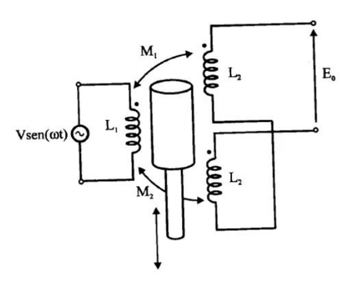

*Figura: Figura 7.34 Model elèctric d'una LVDT.*

La **LVDT** (*Linear Variable Differential Transformer*) consisteix en tres bobines enrotllades coaxialment sobre un cilindre no conductor: una **primària** al centre i dues **secundàries** simètriques als dos costats. Les secundàries es connecten **en sèrie i en oposició** —fil continu, sentit d'enrotllament contrari—, de manera que les tensions induïdes es **resten**. A l'interior es desplaça axialment un **nucli ferromagnètic mòbil**, de ferrita o d'aliatge ferro-níquel de baixa histèresi, unit a l'objecte a mesurar; no toca les bobines i es mou amb fricció gairebé nul·la.

Quan el primari s'excita, el camp es canalitza preferentment pel nucli i la fracció de flux que arriba a cada secundari depèn de la seva posició. Per a desplaçaments  $x$
 petits respecte de la longitud del sensor, la dependència és lineal:

$$
M_1(x) = M_0 + K_1 x\;\qquad M_2(x) = M_0 - K_2 x \qquad (7.25)
$$

on  $M_0$
 és la inductància mútua en la posició central i  $K_1 = K_2 = K$
 en una LVDT simètrica ideal. Les tensions induïdes i la sortida diferencial valen

$$
V_{S1} = j\omega M_1 I\;\qquad V_{S2} = j\omega M_2 I \qquad (7.26)
$$

$$
V_{\mathrm{out}} = V_{S1} - V_{S2} = j\omega (M_1 - M_2) I \qquad (7.27)
$$

i, substituint-hi el corrent del primari  $I \approx V/(j\omega L_1)$
,

$$
V_{\mathrm{out}} \approx \frac{(K_1+K_2)}{L_1}\,x\,V = K\,x\,V \qquad (7.28)
$$

La tensió de sortida és, en l'aproximació lineal, **proporcional al desplaçament i a l'amplitud del senyal d'excitació**. La constant  $K$
 és la sensibilitat de la LVDT, s'expressa en V/mm o V/μm i l'especifica el fabricant.

### La posició de nul i el signe del desplaçament

En la posició central les dues inductàncies mútues són iguals per simetria, les tensions induïdes tenen la mateixa amplitud i, en oposició, es cancel·len: la sortida diferencial és **nul·la**. En una LVDT real, petites imperfeccions constructives hi deixen una tensió residual, la **tensió de nul** (*null voltage*), que un bon sensor manté per sota del 0,1 % del fons d'escala.

El comportament per a desplaçaments positius i negatius és **asimètric en fase**, i això permet recuperar el signe:

| Posició del nucli | Acoblament | Fase de  $V_{\mathrm{out}}$   respecte de l'excitació |
|:--- |:--- |:--- |
| $x>0$   (cap a S1) | $M_1 > M_2$ | 0° |
| $x=0$ | $M_1 = M_2$ | sortida nul·la |
| $x<0$   (cap a S2) | $M_2 > M_1$ | 180° |

En tots dos sentits l'amplitud de sortida és proporcional a  $|x|$
. Per obtenir el signe, el condicionador ha d'incorporar un **detector de fase** o un desmodulador síncron que compari la fase de la sortida amb la de l'excitació. Aquest processament conjunt d'amplitud i fase és propi dels sensors de transformador variable i es desenvolupa a la unitat 8.

### Efectes no ideals i freqüència òptima

| Efecte | Conseqüència |
|:--- |:--- |
| **Resistència dels bobinatges** | La del primari limita el corrent d'excitació i la dels secundaris hi introdueix una caiguda que no és funció de  $M$. En pujar la freqüència,  $\omega L$   creix i el pes relatiu de  $R_{\mathrm{bob}}$   disminueix. |
| **Dependència de la freqüència** | A freqüència molt baixa, les pèrdues resistives del primari redueixen el corrent i la tensió induïda; a freqüència molt alta, les capacitats paràsites entre bobines i les pèrdues del nucli alteren les inductàncies mútues. Existeix, doncs, un rang òptim. |
| **Resistència de càrrega** | Una càrrega finita als secundaris hi forma un divisor i en modifica amplitud i fase segons la freqüència i la posició del nucli. El condicionador ha de presentar impedància d'entrada molt elevada o corregir-ne l'efecte. |

Cada LVDT té, per això, una **freqüència d'excitació òptima** especificada pel fabricant, típicament entre **1 kHz i 20 kHz** segons les dimensions. Una regla pràctica és escollir-la de manera que  $\omega_0 L_1/R_{\mathrm{bob},1} \in [3{,}10]$
: així el corrent del primari és predominantment inductiu i el transformador s'acosta al model ideal, amb sortida estrictament proporcional a  $x$
, desfasament exacte de 0° o 180° i sensibilitat independent de la freqüència.

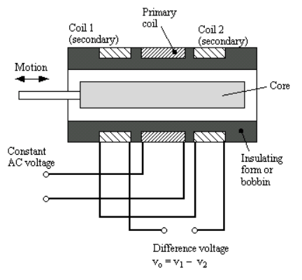

*Figura: Figura 7.35 Exemple de construcció física d'una LVDT.*

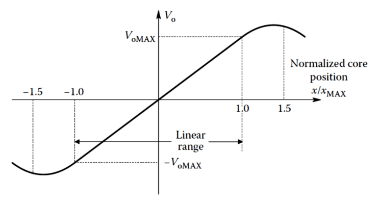

*Figura: Figura 7.36 Funció de resposta d'una LVDT.*

El nucli es connecta per una barra rígida que sobresurt per un extrem, i l'hermeticitat de la carcassa permet construir LVDT per a entorns submergits, alta pressió o temperatures extremes, amb rangs de ±0,25 mm fins a ±250 mm o més. La resolució no té límit mecànic intrínsec, perquè no hi ha contacte entre parts mòbils i fixes, i la limita el soroll del condicionador. Dins del **rang lineal** especificat l'error de linealitat no supera típicament el ±0,1 % o el ±0,25 % del fons d'escala; per damunt de  $x_{\max}$
 la resposta se n'aparta de manera creixent. Aquesta combinació fa de la LVDT un sensor de referència en metrologia de posició: patró de traçabilitat, màquines de mesura per coordenades, assajos de materials, barres de control de centrals nuclears i superfícies de control de vol.

## 3 El resolver

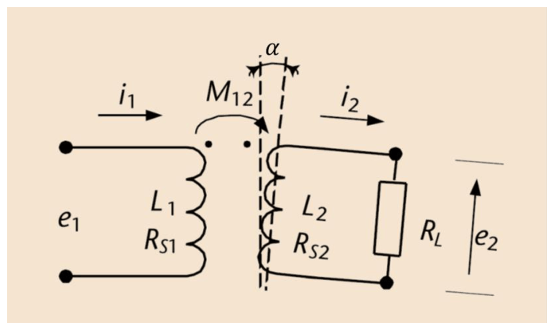

*Figura: Figura 7.37 El potenciòmetre d'inducció o resolver.*

El **potenciòmetre d'inducció**, o *resolver*, és l'equivalent angular de la LVDT: un sensor de transformador variable per a la mesura precisa d'angles de gir, també sense contacte entre primari i secundari. Els dos bobinatges són sobre parts físicament separades —el **rotor**, solidari a l'eix, i l'**estator**, fix— i l'acoblament es produeix a través d'un **entreferro d'aire**.

La clau física és que la inductància mútua depèn de l'alineament relatiu entre bobines: alineades, l'acoblament és màxim; perpendiculars, no hi ha flux net del primari que travessi el secundari. Per a un angle arbitrari  $\alpha$
 la dependència és sinusoïdal,

$$
M(\alpha) = M_{\max}\cos\alpha \qquad (7.29)
$$

i la tensió de sortida val  $V_{\mathrm{out}}(\alpha) = K V\cos\alpha$
, amb  $K = M_{\max}/L_1$
 adimensional i típicament entre 0,3 i 0,9.

Un sol secundari no permet una mesura unívoca en tot el cercle, perquè el cosinus pren el mateix valor per a  $\alpha$
 i per a  $-\alpha$
. Els resolvers comercials incorporen per això **dos secundaris desfasats 90°**, en quadratura:

$$
V_{s1}(\alpha) = KV\cos\alpha\;\qquad V_{s2}(\alpha) = KV\sin\alpha \qquad (7.30)
$$

La combinació dels dos senyals determina l'angle de manera unívoca en qualsevol quadrant mitjançant la funció arctangent de dos arguments,

$$
\alpha = \mathrm{atan2}(V_{s2},\,V_{s1}) \qquad (7.31)
$$

El circuit digital que fa aquesta descodificació és el **RDC** (*Resolver-to-Digital Converter*), component estàndard dels sistemes de control de motors de precisió: interpreta els senyals modulats del resolver i en dona una estimació digital de l'angle.

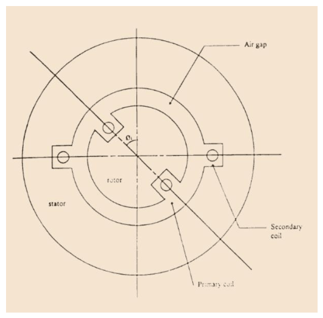

*Figura: Figura 7.38 Implementació física d'un resolver.*

| Efecte | Conseqüència |
|:--- |:--- |
| **Imperfeccions de simetria** | Si els secundaris no són exactament en quadratura, o si les seves sensibilitats no coincideixen, apareix un **error d'harmònic**: un error d'angle que depèn del valor de  $\alpha$. S'especifica en minuts d'arc: per sota de ±1′ en resolvers industrials i de ±10″ en els de precisió científica. |
| **Tensió de desequilibri** | A la posició de desacoblament màxim la tensió residual no és exactament zero, i es manifesta com un error de zero que cal compensar al condicionador. |
| **Dependència de la freqüència** | Sensibilitat i fases relatives depenen de la freqüència d'excitació per les mateixes raons que a la LVDT. Cada resolver té una freqüència òptima recomanada, típicament entre 400 Hz i 20 kHz. |

El resolver és la solució preferida quan la robustesa pesa més que el cost: vibracions, xocs, pols, oli o temperatures extremes el deixen pràcticament indemne. S'usa en control de posició de motors de precisió, robots, màquines-eina de control numèric, navegació inercial i superfícies de vol, de −55 °C a +125 °C i amb immunitat a radiacions ionitzants.

Dues variants completen la família. El **synchro** té un rotor lliure i tres bobinats estàtics desfasats 120°, en què s'indueixen tensions proporcionals a  $\sin\theta$
,  $\sin(\theta+120^\circ)$
 i  $\sin(\theta+240^\circ)$
 que determinen l'angle. L'**inductosyn** és una variant planar amb els bobinats com a pistes conductores sobre un substrat, amb resolucions de micròmetres o de fraccions de segon d'arc.

## 4 Sensors d'efecte Hall

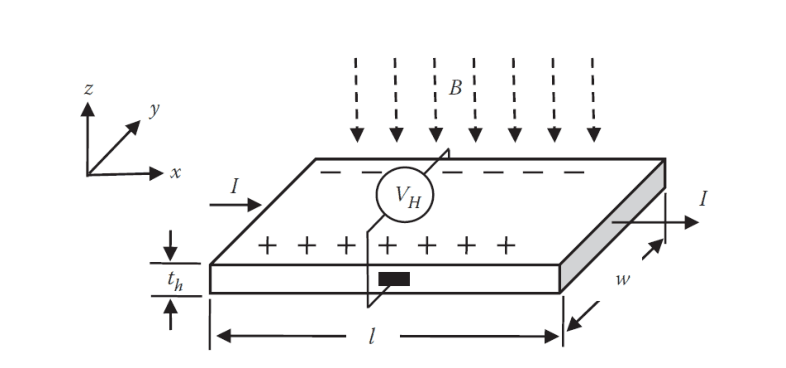

*Figura: Figura 7.39 Efecte Hall.*

L'efecte Hall el va descobrir Edwin Herbert Hall el 1879 en metalls, on és molt feble; la seva aplicació de major impacte ha estat en **semiconductors**, on és centenars de milers de vegades més intens.

El principi és una conseqüència directa de la **força de Lorentz**: un portador de càrrega que es mou amb velocitat  $\mathbf{v}$
 en presència d'un camp magnètic  $\mathbf{B}$
 experimenta una força perpendicular a tots dos vectors,

$$
\mathbf{F}_L = q\,\mathbf{v}\times\mathbf{B} \qquad (7.32)
$$

En una làmina de gruix  $t_h$
 recorreguda per un corrent  $I$
 i sotmesa a un camp  $B_z$
 perpendicular, la força empeny els portadors cap a un extrem transversal, on s'acumulen fins que el camp elèctric resultant l'equilibra. Entre els dos extrems apareix la **tensió Hall**

$$
V_H = \frac{I\,B_z}{q\,N_c\,t_h} \qquad (7.33)
$$

on  $q \cong 1{,}6\times10^{-19}$
 C és la càrrega elemental i  $N_c$
 la densitat volumètrica de portadors. La tensió Hall és, doncs, **proporcional al corrent i al camp perpendicular**, i **inversament proporcional** a la densitat de portadors i al gruix.

> [!WARNING] **Ordres de magnitud**
>
> Amb  $I = 1$
> mA,  $B_z = 0{,}1$
> T i  $t_h = 100$
> μm: en coure, amb  $N_c \approx 8{,}5\times10^{28}\ \mathrm{m^{-3}}$
>, s'obtenen uns **70 pV**, completament indetectables. En GaAs poc dopat, amb  $N_c \approx 10^{21}\ \mathrm{m^{-3}}$
> —vuit ordres de magnitud menys—, s'obtenen uns **6,25 mV**, perfectament mesurables.

La baixa densitat de portadors dels semiconductors és, doncs, la que fa viables aquests sensors. A més,  $N_c$
 és **ajustable pel procés de dopat**: en un semiconductor intrínsec depèn de la temperatura, però amb impureses donadores o acceptadores en concentracions controlades el fabricant hi fixa un valor estable i gairebé independent de la temperatura. Els materials habituals són silici, arsenur de gal·li i arsenur d'indi; l'InAs interessa per a gran sensibilitat per la seva mobilitat elevada, i el GaAs domina en consum per la facilitat d'integració en CMOS.

Reduir el gruix augmenta la tensió Hall, però també la resistència de la làmina en la direcció del corrent,

$$
R_{\mathrm{làmina}} = \frac{\rho\,l}{w\,t_h} = \frac{l}{w\,\mu\,q\,N_c\,t_h} \qquad (7.34)
$$

Una làmina molt prima exigeix més tensió d'alimentació per al mateix corrent, genera més soroll tèrmic —proporcional a  $\sqrt{R}$
— i dissipa més per autoescalfament —proporcional a  $I^2R$
. El disseny és, doncs, un **compromís entre sensibilitat, soroll i dissipació**, que a la pràctica situa els gruixos entre 1 i 10 μm.

El competidor tecnològic principal és la **magnetoresistència** vista a la unitat 5, i en particular les variants gegant (GMR) i de túnel (TMR), de sensibilitat superior en alguns casos. El sensor Hall manté avantatges propis: integració en CMOS estàndard, linealitat de la resposta amb  $B$
 en un ampli rang, conservació de la **polaritat** del camp —de manera que el condicionament en pot recuperar el signe— i robustesa davant de camps intensos que saturarien una magnetoresistència.

### Aplicacions

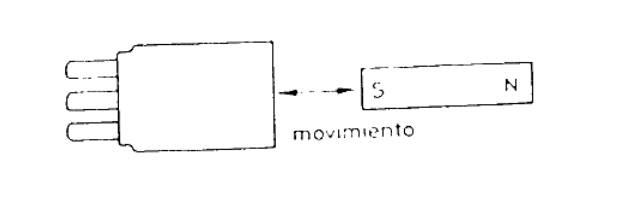

*Figura: Figura 7.40 Detector de moviment amb sensors d'efecte Hall.*

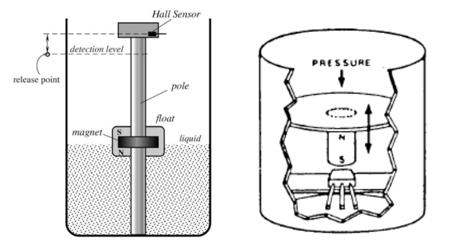

*Figura: Figura 7.41 Mesurador de nivell (esquerra) i sensor de pressió (dreta) amb sensors d'efecte Hall.*

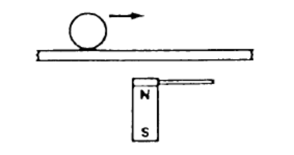

*Figura: Figura 7.42 Detecció de pas d'un objecte ferromagnètic amb sensors d'efecte Hall.*

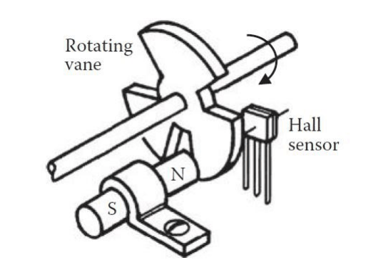

*Figura: Figura 7.43 Sensor de velocitat de rotació basat en sensors d'efecte Hall.*

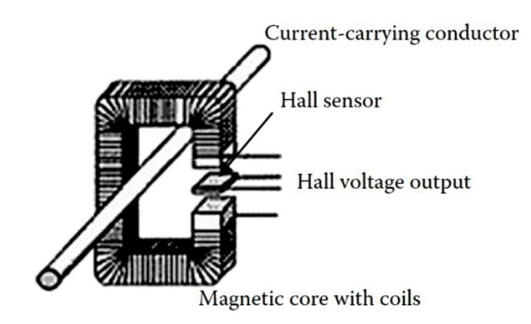

*Figura: Figura 7.44 Sensor de corrent basat en sensors d'efecte Hall.*

Totes les aplicacions mesuren un camp magnètic o les pertorbacions d'un camp preexistent, **inclosos els camps estàtics**, i es reparteixen en tres famílies.

**Presència d'un imant.** Si un imant s'aproxima,  $B$
 a la làmina creix i  $V_H$
 amb ell; un comparador de llindar en dona un senyal discret. És un sensor de proximitat sense parts mòbils ni desgast: botons i tancaments de telèfons, obertura de portelles, limitadors de posició i sensors d'arbre de lleves. Amb l'imant sobre una boia s'obté un detector de nivell de líquid; solidari a un diafragma, un sensor de pressió.

**Pertorbació d'un camp fix.** Amb el sensor situat en el camp d'un imant permanent, els materials ferromagnètics propers en distorsionen les línies. Així es detecta el pas d'una bola ferromagnètica o les dents d'una roda dentada: quan una dent s'interposa entre imant i sensor bloqueja les línies i  $V_H$
 baixa, i quan hi passa una cavitat puja. El resultat és un tren de polsos que permet comptar dents i calcular posició angular i velocitat de rotació.

**Mesura de corrent sense contacte.** Qualsevol corrent genera un camp magnètic al seu voltant, que a una distància  $r$
 d'un conductor rectilini val

$$
B(r) = \frac{\mu_0 I_{\mathrm{mesurat}}}{2\pi r} \qquad (7.35)
$$

Mesurant  $B$
 s'infereix el corrent sense tallar el circuit ni inserir-hi cap element en sèrie. Per a corrents de centenars o milers d'ampers és la solució estàndard, tant per seguretat —la làmina resta al potencial de massa del circuit de mesura, aïllada del conductor d'alta tensió— com per facilitat d'instal·lació. Per guanyar sensibilitat i reduir camps espuris, la làmina s'integra dins d'un **nucli ferromagnètic toroïdal** que hi canalitza i concentra el camp del conductor.

## 5 Sensors magnetostrictius

La **magnetostricció** és l'acoblament bidireccional entre l'estat magnètic i la deformació mecànica d'un material ferromagnètic: es deforma quan s'hi aplica un camp, perquè els dominis magnètics s'orienten i arrosseguen la xarxa cristal·lina, i recíprocament la seva magnetització canvia quan es deforma, perquè la reordenació cristal·lina altera l'orientació dels dominis.

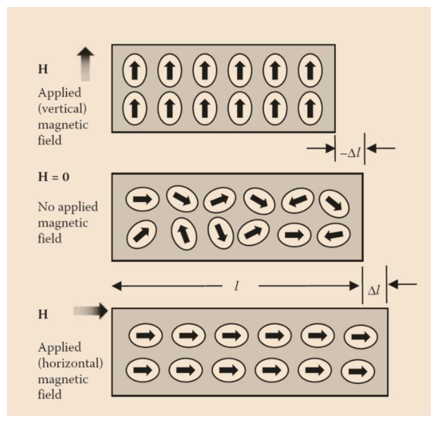

*Figura: Figura 7.45 Efecte Joule magnetostrictiu.*

| Efecte | Descripció |
|:--- |:--- |
| **Joule** (1842) | Efecte directe: un ferromagnètic canvia de forma en aplicar-hi un camp. Sense camp, els dominis estan orientats aleatòriament i les seves deformacions s'anul·len estadísticament; en aplicar-lo s'orienten progressivament i el material s'allarga en la direcció del camp i es comprimeix en les perpendiculars, o a l'inrevés segons el material. La deformació relativa  $\lambda = \Delta l/l$   és el coeficient de magnetostricció. |
| **Villari** (1865) | Invers del Joule: una deformació de tracció o compressió canvia la magnetització i la permeabilitat del material. És la base dels sensors de força i pressió. |
| **Wiedemann** (1858) | Apareix una **torsió** en una barra ferromagnètica travessada simultàniament per un camp longitudinal i per un corrent, que genera un camp circular al seu voltant: la superposició dona un camp en espiral que indueix la torsió mecànica. |
| **Mateucci** | Invers del Wiedemann: una torsió mecànica altera la distribució dels dominis i, per tant, la magnetització del material. |

Tots els ferromagnètics presenten magnetostricció, però amb deformacions que rarament superen les desenes de ppm:  $\lambda_s \approx -7$
 ppm en ferro pur,  $-34$
 ppm en níquel i  $-60$
 ppm en cobalt, on el signe negatiu indica contracció en la direcció del camp. Són valors detectables però insuficients per a la majoria d'aplicacions, que demanen 0,1 % o més. El permalloy (Fe-Ni) i el Metglas, aliatge amorf de ferro, silici i bor, tenen coeficients força majors i s'usen en sensors comercials de força, pressió i vibració. El **Terfenol-D** —aliatge de ferro, terbi i disprosi desenvolupat als anys 1970 per a sonar submarí— els supera de molt:

| Propietat | Valor |
|:--- |:--- |
| Deformació màxima | Fins a 2000 ppm (0,2 %) abans de saturació: entre 50 i 100 vegades la del ferro o el níquel. |
| Velocitat d'ones longitudinals | De 1640 a 1940 m/s, molt inferior a la de l'acer (≈ 5900 m/s), per la densitat alta  $(\rho \approx 9250\ \mathrm{kg/m^3})$   i la baixa rigidesa en la direcció magnetostrictiva. |
| Permeabilitat relativa | Entre 4,5 i 10, baixa per a un ferromagnètic (el ferro dolç arriba a  $\mu_r \approx 5000$  ): limita la inductància de les bobines que l'empren com a nucli, sense afectar les propietats magnetostrictives. |
| Resistivitat elèctrica | $\approx 58\times10^{-8}\ \Omega\cdot\mathrm{m}$, molt superior a la del ferro  $(\approx 10\times10^{-8})$: limita els corrents de Foucault al material i n'estén el rang de freqüències d'operació. |

### Sensor de temps de vol

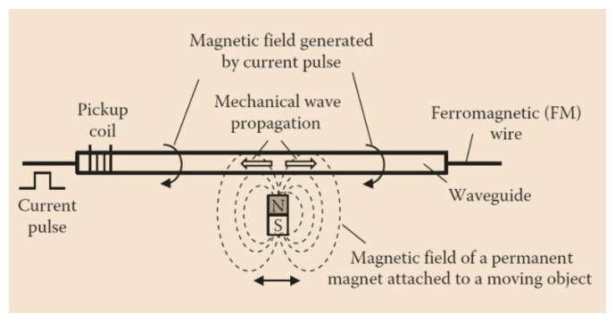

*Figura: Figura 7.46 Sensor de temps de vol magnetostrictiu.*

És una de les tecnologies de mesura de posició lineal de major exactitud entre centímetres i metres, i combina els efectes Wiedemann i Mateucci. El sensor és una barra o fil magnetostrictiu al llarg del qual es desplaça un **imant permanent** solidari a l'element mòbil; en un dipòsit de líquid, l'imant va sobre una boia.

En un extrem del material s'aplica un breu pols de corrent, de l'ordre de microsegons, que genera un camp magnètic circular al voltant del fil. A la posició de l'imant, aquest camp se superposa al camp axial de l'imant i, per l'**efecte Wiedemann**, genera una torsió localitzada que es propaga com una **ona acústica** en ambdues direccions a la velocitat del so en el material. El temps  $\Delta t$
 entre el pols i l'arribada de l'ona al detector dona la distància:

$$
d = v_s\cdot\Delta t \qquad (7.36)
$$

La detecció de l'ona es fa amb un **sensor piezoelèctric** que capta la vibració a l'extrem, o —molt més habitual a la indústria— aprofitant que la vibració canvia localment la permeabilitat del material per **efecte Mateucci**, de manera que una bobina que l'envolta veu un canvi d'inductància i genera un pols de tensió. La resolució típica és d'1 a 50 μm en rangs de fins a 2–3 m, amb linealitat millor del 0,05 % del fons d'escala i repetibilitat inferior al micròmetre.

### Força, pressió i torsió

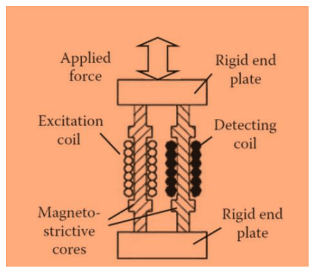

*Figura: Figura 7.47 Sensor de força o pressió magnetostrictiu.*

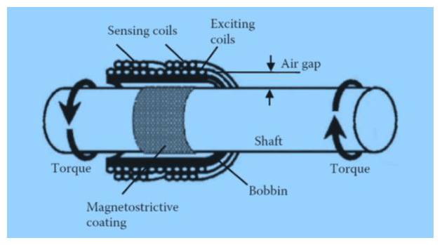

*Figura: Figura 7.48 Sensor de torsió magnetostrictiu.*

La segona aplicació explota l'**efecte Villari**: una tensió mecànica sobre el material en fa variar la permeabilitat i, com que  $L \propto \mu_r$
, el canvi és directament detectable. La configuració té una **bobina generadora** (primari) al voltant del material, excitada en alterna, i una **bobina receptora** (secundari) que capta el flux que l'ha travessat: la variació de permeabilitat modifica la inductància mútua i la tensió induïda en proporció a la força aplicada. A diferència d'un sensor inductiu convencional, aquí la variació prové d'un **canvi intrínsec de propietat del material**, sense desplaçament apreciable.

La tercera és l'anàleg de torsió, per **efecte Mateucci**: un moment torçor altera la permeabilitat en proporció al moment, amb el mateix esquema de dues bobines. Mesuren el parell en arbres de transmissió de potència —automoció, turbines, motors elèctrics—, sobretot quan no es poden connectar cables al rotor. La seva virtut davant de les cel·les de càrrega és mesurar sense contacte i sense distorsionar mecànicament l'element mesurat, que continua transmetent potència.

> [!TIP] **Síntesi**
>
> Els sensors de transformador variable mesuren la inductància mútua. La LVDT té un primari central i dos secundaris en sèrie i oposició, amb sortida  $V_{\mathrm{out}} \approx K x V$
>, nul·la al centre llevat de la tensió de nul, i fase de 0° o 180° que dona el signe del desplaçament; la freqüència òptima, entre 1 i 20 kHz, equilibra resistències de bobinatge i capacitats paràsites. El resolver n'és l'equivalent angular, amb  $M(\alpha) = M_{\max}\cos\alpha$
> i dos secundaris en quadratura que resolen l'angle amb  $\mathrm{atan2}$
> en un RDC. El sensor Hall dona  $V_H = IB_z/(qN_c t_h)$
>: la baixa densitat de portadors dels semiconductors el fa viable i el gruix de la làmina compromet sensibilitat, soroll i dissipació. La magnetostricció acobla estat magnètic i deformació pels efectes Joule, Villari, Wiedemann i Mateucci, amb el Terfenol-D com a material de referència.

[← 5. Sensors inductius i corrents de Foucault](05_Unitat7_Sensors_inductius_i_corrents_de_Foucault.md)

---

## 📐 Formulario Resumen de Ecuaciones

| Nº / Ref | Expresión Matemática |
| :---: | :--- |
| **(7.25)** | $M_1(x) = M_0 + K_1 x\;\qquad M_2(x) = M_0 - K_2 x$ |
| **(7.26)** | $V_{S1} = j\omega M_1 I\;\qquad V_{S2} = j\omega M_2 I$ |
| **(7.27)** | $V_{\mathrm{out}} = V_{S1} - V_{S2} = j\omega (M_1 - M_2) I$ |
| **(7.28)** | $V_{\mathrm{out}} \approx \frac{(K_1+K_2)}{L_1}\,x\,V = K\,x\,V$ |
| **(7.29)** | $M(\alpha) = M_{\max}\cos\alpha$ |
| **(7.30)** | $V_{s1}(\alpha) = KV\cos\alpha\;\qquad V_{s2}(\alpha) = KV\sin\alpha$ |
| **(7.31)** | $\alpha = \mathrm{atan2}(V_{s2},\,V_{s1})$ |
| **(7.32)** | $\mathbf{F}_L = q\,\mathbf{v}\times\mathbf{B}$ |
| **(7.33)** | $V_H = \frac{I\,B_z}{q\,N_c\,t_h}$ |
| **(7.34)** | $R_{\mathrm{làmina}} = \frac{\rho\,l}{w\,t_h} = \frac{l}{w\,\mu\,q\,N_c\,t_h}$ |
| **(7.35)** | $B(r) = \frac{\mu_0 I_{\mathrm{mesurat}}}{2\pi r}$ |
| **(7.36)** | $d = v_s\cdot\Delta t$ |