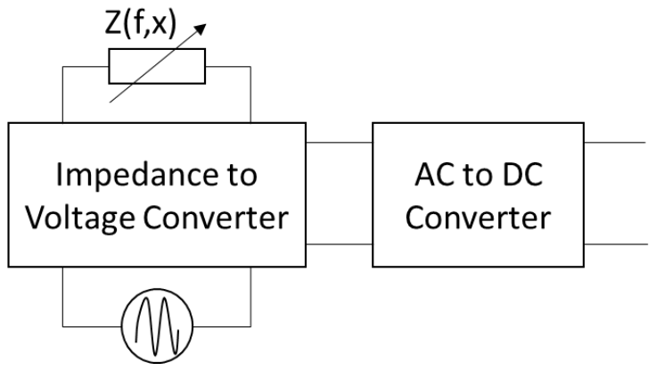
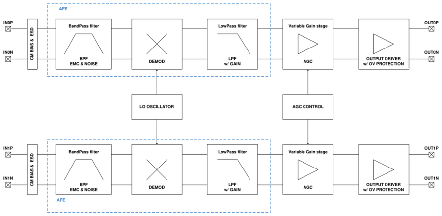
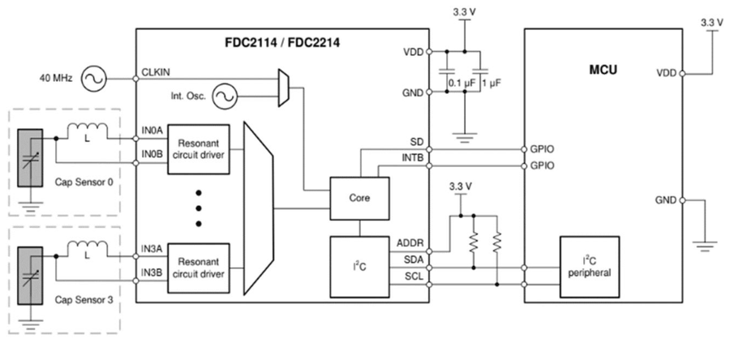

# Sensors reactius, freqüència de treball i cadena de condicionament

## 📑 Índice de Contenidos

- [1 El sensor reactiu com a impedància complexa](#1-el-sensor-reactiu-com-a-impedància-complexa)
- [2 La freqüència de treball](#2-la-freqüència-de-treball)
- [3 Les dues aproximacions al condicionament](#3-les-dues-aproximacions-al-condicionament)
- [4 La cadena de condicionament lineal](#4-la-cadena-de-condicionament-lineal)
- [5 Models canònics del sensor](#5-models-canònics-del-sensor)
- [6 Dos condicionadors integrats](#6-dos-condicionadors-integrats)

---

Sistemes de Mesura · **Unitat 8 — Condicionament de sensors en alterna** · Document 1 de 6

# Sensors reactius, freqüència de treball i cadena de condicionament

Dedicació estimada: 10 minuts

> [!NOTE] **Objectius d'aprenentatge**
>
> - Escriure el model d'impedància complexa d'un sensor reactiu i la condició que el fa tractable com a tal.
> - Justificar l'elecció de la freqüència de treball  $f_0$  a partir del sensor, de les interferències i del soroll  $\frac{1}{f}$.
> - Distingir les dues aproximacions al condicionament en alterna: la lineal i la basada en oscil·ladors.
> - Enumerar els blocs de la cadena de condicionament lineal i la funció de cadascun.
> - Associar cada model canònic de sensor reactiu a la forma en què la seva impedància varia amb el mesurand.

A la unitat 6 s'ha tractat el condicionament de sensors resistius, que treballa en contínua. Els sensors reactius de la unitat 7 —capacitius i inductius— codifiquen el mesurand en la **part imaginària** d'una impedància, i això obliga a excitar-los amb un senyal sinusoïdal i a processar-ne la resposta en alterna. Aquesta unitat tracta l'electrònica que ho fa.

## 1 El sensor reactiu com a impedància complexa

Qualsevol sensor que requereixi condicionament en alterna es modela, en primera aproximació, com una impedància complexa que depèn de la freqüència  $f$  i del mesurand  $x$:

$$
Z(f,x) = R(f,x) + j\,X(f,x) \qquad (8.1)
$$

Un sensor capacitiu ideal tindria  $R=0$  i  $X = -1/(2\pi f C(x))$; un sensor inductiu ideal,  $R=0$  i  $X = 2\pi f L(x)$. Cap sensor real no és purament reactiu: la resistència del fil de coure en els inductius i les pèrdues del dielèctric en els capacitius aporten sempre una part real.

La condició per considerar-lo **reactiu** en sentit estricte és que, a la freqüència de treball, els canvis relatius que el mesurand indueix sobre la part imaginària dominin sobre els que indueix sobre la part real:

$$
\frac{|\Delta X_f(x)|}{|X_0|} \gg \frac{|\Delta R_f(x)|}{|R_0|} \qquad (8.2)
$$

A la pràctica s'accepta el model si  $|R_0| \ll |X_0|$  a la freqüència escollida. Quan es compleix, la part real produeix errors petits que alguns mètodes de condicionament poden corregir o rebutjar.

La freqüència ajuda a complir-ho, però de manera diferent segons el tipus de sensor. En un sensor inductiu,  $X = 2\pi f L(x)$  creix linealment amb la freqüència mentre la resistència del bobinatge es manté, de manera que pujar en freqüència afavoreix la condició. En un sensor capacitiu amb pèrdues, modelat com la capacitat  $C$  en paral·lel amb la resistència del dielèctric  $R_d$:

$$
Z_\mathrm{cap}(f,x) = \frac{R_d}{1 + j\,2\pi f R_d C(x)} \qquad (8.3)
$$

En pujar la freqüència, la part real d'aquesta impedància decreix com l'invers del *quadrat* de la freqüència i la part imaginària com l'invers de la freqüència. Existeix, doncs, per a cada sensor capacitiu, un interval de freqüències on la condició de sensor reactiu es compleix acceptablement.

## 2 La freqüència de treball

La tria de  $f_0$  respon a criteris del sensor i a criteris del sistema, que actuen simultàniament.

| Tipus de sensor | Rang i motiu |
|:--- |:--- |
| **Inductiu amb nucli ferromagnètic** | Com a molt uns pocs kHz. Per damunt d'una certa freqüència, la permeabilitat del nucli disminueix per les pèrdues per histèresi i per corrents de Foucault; aquestes pèrdues modifiquen la part real i converteixen el sensor en majoritàriament resistiu. |
| **Inductiu per corrents de Foucault** | De centenars de kHz a diversos MHz, i fins a desenes o centenars de MHz en sensors de proximitat d'alta resolució. El principi de mesura són els corrents induïts al metall proper, i la seva profunditat de penetració només és prou petita a freqüència elevada. |
| **Capacitiu** | De 10 kHz a 100 MHz per a capacitats d'alguns pF a uns pocs nF. Es busca un mòdul d'impedància entre unes centenes d'ohms i alguns kΩ, que dona alhora prou sensibilitat i prou immunitat a les interferències capacitives. |

| Criteri | Conseqüència sobre  $f_0$ |
|:--- |:--- |
| **Interferències electromagnètiques** | Les fonts dominants —xarxa elèctrica a 50 Hz o 60 Hz, els seus harmònics i els rellotges dels sistemes digitals propers— ocupen bandes ben definides. Triant  $f_0$  allunyada d'aquestes bandes i emprant detecció selectiva en freqüència, la interferència queda molt atenuada. |
| **Soroll  $\frac{1}{f}$  de l'electrònica** | Per sota d'una freqüència característica del dispositiu actiu, el soroll rosa domina sobre el blanc i limita la relació senyal-soroll. Treballant per damunt d'aquesta freqüència, el soroll de l'amplificador és essencialment blanc i, per tant, menor. |

La freqüència de treball ha de ser, doncs, superior al límit inferior que imposa el comportament reactiu del sensor i, alhora, prou elevada per allunyar-se del soroll  $\frac{1}{f}$  i de les interferències de baixa freqüència, sense superar el límit superior del sensor.

## 3 Les dues aproximacions al condicionament

Hi ha dues maneres de convertir la variació d'impedància en una mesura, i el capítol s'estructura al voltant de totes dues.

- **Condicionament lineal.** Un oscil·lador sinusoïdal excita el sensor; un circuit converteix la variació d'impedància en una variació d'amplitud; el senyal s'amplifica selectivament i, finalment, se'n extreu l'amplitud com a tensió contínua. La informació viatja en l'**amplitud**.
- **Mètodes no lineals basats en oscil·ladors.** El sensor s'incorpora dins d'un oscil·lador com a element que en fixa la freqüència. Quan el mesurand canvia, canvia la freqüència d'oscil·lació. La informació viatja en la **freqüència** d'un senyal generalment quadrat, i no cal cap oscil·lador de referència extern.

## 4 La cadena de condicionament lineal

*Figura: Figura 8.1 Cadena de processament del condicionament lineal de sensors en alterna.*

| Bloc | Funció |
|:--- |:--- |
| **Oscil·lador** | Genera la tensió sinusoïdal d'excitació d'amplitud  $V$  i freqüència  $f_0$, i en els sistemes coherents proporciona també la referència de fase. Fa el paper que en contínua fa l'alimentació d'un pont o d'un divisor: qualsevol deriva de la seva amplitud es transmet directament com un error de mesura, i qualsevol deriva de  $f_0$  altera el valor de la impedància del sensor. Per això convé que porti control automàtic d'amplitud o que sigui de molt alta estabilitat. |
| **Convertidor impedància–tensió** | Circuit —divisor de tensió, pont d'alterna o pseudopont— que combina el sensor amb impedàncies fixes de referència i lliura una tensió sinusoïdal a la mateixa freqüència  $f_0$, l'amplitud de la qual és una funció coneguda i monotònica de  $x$. |
| **Amplificador d'alterna** | Amplificador de característica passa-banda centrada a  $f_0$. S'insereix quan el canvi d'amplitud associat al rang de  $x$  és massa petit per a les etapes posteriors, i amplifica el senyal sense amplificar les interferències ni el soroll de fora de la banda. |
| **Convertidor alterna–contínua** | Extreu l'amplitud del senyal sinusoïdal i la lliura com a tensió contínua. Es divideix en **mètodes no coherents** —convertidors de valor eficaç i detectors de pic, que mesuren l'envolupant sense cap referència de fase— i **mètodes coherents** —detecció homodina, rectificació síncrona i mostreig síncron, que multipliquen el senyal per una referència en fase amb l'oscil·lador i poden així discriminar el signe de  $x$, rebutjar components en quadratura i reduir el soroll. |

Per a l'anàlisi dels circuits de conversió impedància–tensió se suposa que l'oscil·lador és ideal: amplitud  $V$  i freqüència  $f_0$  exactament constants, i impedància de sortida nul·la.

## 5 Models canònics del sensor

Per analitzar els circuits de manera sistemàtica se suposa que el sensor és ideal —impedància purament imaginària— i que la seva reactància depèn del mesurand en una de dues formes canòniques: proporcional o inversament proporcional. El paràmetre  $x$  és normalitzat, de manera que  $x=0$  és la situació de referència i sovint  $|x| \ll 1$.

| Model | Element | Impedància | Origen físic |
|:--- |:--- |:--- |:--- |
| **a** | $C_s = C_0(1+x)$ | $Z_s = \frac{1}{j\omega C_0(1+x)}$ | Variació de la constant dielèctrica del material entre plaques o de l'àrea efectiva. El mòdul de la impedància varia com  $\frac{1}{1+x}$. |
| **b** | $C_s = C_0/(1+x)$ | $Z_s = \frac{1+x}{j\omega C_0}$ | Sensors capacitius de distància per variació de la separació entre plaques. El mòdul de la impedància varia linealment amb  $x$. |
| **c** | $L_s = L_0(1+x)$ | $Z_s = j\omega L_0(1+x)$ | El mesurand modifica la permeabilitat del circuit magnètic, el nombre d'enrotllaments efectius o la geometria de la bobina. El mòdul varia linealment amb  $x$. |
| **d** | $L_s = L_0/(1+x)$ | $Z_s = \frac{j\omega L_0}{1+x}$ | Proximitat per corrents de Foucault: l'apropament d'un conductor redueix l'autoinductància de la bobina. El mòdul varia com  $\frac{1}{1+x}$. |

El model determina l'estructura del circuit de conversió. Si la impedància del sensor varia de manera inversament proporcional a  $x$, se solen emprar ponts o pseudoponts per obtenir una sortida lineal; si varia de manera proporcional, un divisor de tensió o un amplificador inversor pot ser suficient.

## 6 Dos condicionadors integrats

És habitual trobar sensors reactius comercialitzats amb l'electrònica de condicionament ja integrada al mateix encapsulat, amb sortida analògica estandarditzada o digital. Aquests **sensors integrats** amaguen la complexitat del condicionament darrere d'una interfície senzilla, però conèixer-ne els principis interns continua essent necessari per triar el sensor adequat, seleccionar-ne els components externs, interpretar-ne les especificacions i diagnosticar problemes. Dos circuits de Texas Instruments il·lustren les dues aproximacions.

*Figura: Figura 8.2 Front end analògic de cada canal del LDC5071-Q1.*

El **LDC5071-Q1** condiciona sensors de rotació per inducció magnètica —un transformador amb el primari en un rotor i dos secundaris a 90°— i implementa el **condicionament lineal**. Un oscil·lador LC intern excita el primari i serveix alhora de referència, de manera que la fase de referència és sempre coherent amb l'excitació: el circuit és un detector homodí de dos canals. Cada canal filtra el senyal amb un passa-banda centrat a la freqüència de treball, el desmodula multiplicant-lo per la referència, en filtra el resultat amb un passa-baixes amb guany —la freqüència de tall del qual fixa l'amplada de banda i el soroll de la mesura— i el normalitza amb un control automàtic de guany, perquè el càlcul de l'angle sigui robust davant de variacions de la distància entre el rotor i el sensor. El microcontrolador posterior obté l'angle absolut aplicant un arctangent al quocient dels dos canals.

*Figura: Figura 8.3 Connexió del FDC2114 amb quatre sensors capacitius.*

El **FDC2114** és un convertidor de capacitat a dades digitals de quatre canals i empra el **mètode basat en freqüència**. Cada sensor capacitiu es munta en sèrie amb una bobina i forma un circuit ressonant de freqüència

$$
f_\mathrm{res} = \frac{1}{2\pi\sqrt{L\,C_s(x)}} \qquad (8.4)
$$

que el circuit mesura comparant-la amb un rellotge de referència extern o amb un oscil·lador intern, i lliura el resultat pel bus I²C. Perquè la mesura sigui correcta la bobina ha de ser de valor conegut i estable i el factor  $Q$  del ressonant prou elevat perquè la freqüència de ressonància quedi ben definida; amb  $Q$  baix la ressonància s'esmorteeix i la mesura perd precisió.

> [!TIP] **Síntesi**
>
> Un sensor reactiu es modela com  $Z(f,x) = R + jX$  i es tracta com a tal quan els canvis relatius de la part imaginària dominen sobre els de la part real a la freqüència de treball. La tria de  $f_0$  combina el que permet el sensor —pocs kHz amb nucli ferromagnètic, centenars de kHz a MHz per corrents de Foucault, de 10 kHz a 100 MHz en capacitius— amb el que exigeix el sistema: allunyar-se de la xarxa i dels seus harmònics i situar-se per damunt del soroll  $\frac{1}{f}$. Hi ha dues aproximacions: la lineal, que codifica el mesurand en l'amplitud i encadena oscil·lador, convertidor impedància–tensió, amplificador d'alterna i convertidor alterna–contínua; i la basada en oscil·ladors, que el codifica en la freqüència. Els quatre models canònics de sensor —capacitiu i inductiu, proporcional i inversament proporcional a  $1+x$ — determinen quin circuit de conversió dona una sortida lineal.

[2. Conversió impedància–tensió: divisors, inversor, ponts i pseudoponts →](02_Unitat8_Conversio_impedancia_tensio.md)

---

## 📐 Formulario Resumen de Ecuaciones

| Nº / Ref | Expresión Matemática |
| :---: | :--- |
| **(8.1)** | $Z(f,x) = R(f,x) + j\,X(f,x)$ |
| **(8.2)** | $\frac{\|\Delta X_f(x)\|}{\|X_0\|} \gg \frac{\|\Delta R_f(x)\|}{\|R_0\|}$ |
| **(8.3)** | $Z_\mathrm{cap}(f,x) = \frac{R_d}{1 + j\,2\pi f R_d C(x)}$ |
| **(8.4)** | $f_\mathrm{res} = \frac{1}{2\pi\sqrt{L\,C_s(x)}}$ |