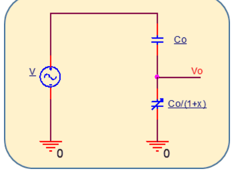
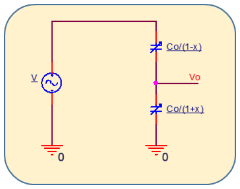
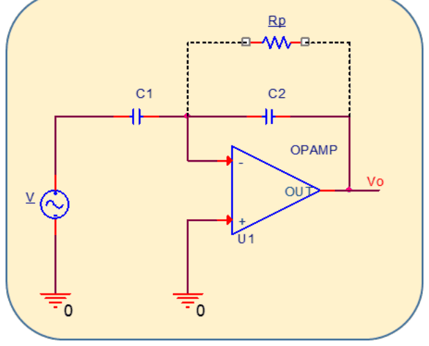
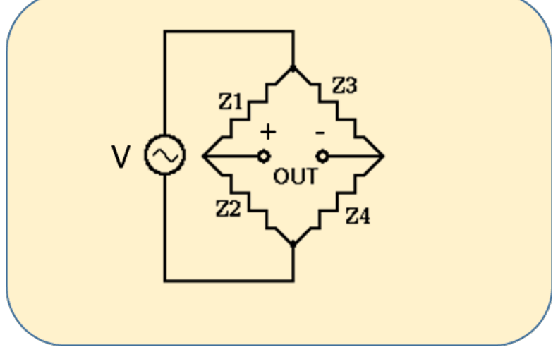
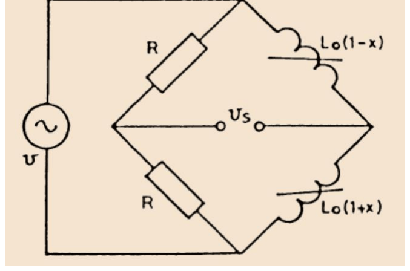
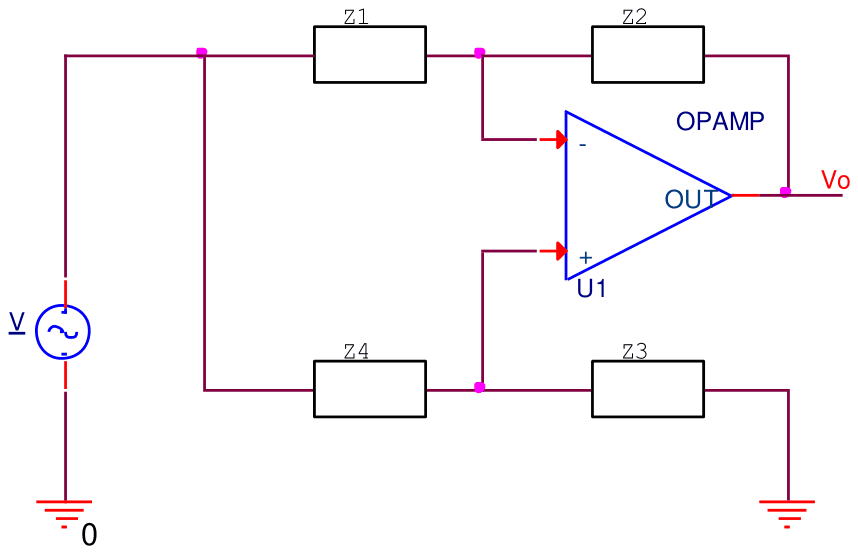
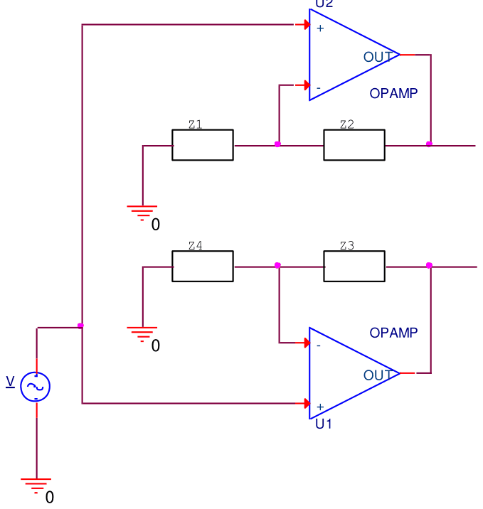

# Conversió impedància–tensió: divisors, inversor, ponts i pseudoponts

## 📑 Índice de Contenidos

- [1 Divisors de tensió](#1-divisors-de-tensió)
- [2 La impedància de sortida del divisor passiu](#2-la-impedància-de-sortida-del-divisor-passiu)
- [3 Amplificador inversor capacitiu](#3-amplificador-inversor-capacitiu)
- [4 Ponts d'alterna](#4-ponts-dalterna)
- [5 Pseudoponts d'alterna](#5-pseudoponts-dalterna)

---

Sistemes de Mesura · **Unitat 8 — Condicionament de sensors en alterna** · Document 2 de 6

# Conversió impedància–tensió: divisors, inversor, ponts i pseudoponts

Dedicació estimada: 9 minuts

> [!NOTE] **Objectius d'aprenentatge**
>
> - Calcular la sortida d'un divisor d'impedàncies i reconèixer quan la freqüència s'hi cancel·la.
> - Explicar per què el divisor capacitiu passiu té una impedància de sortida problemàtica i com es resol.
> - Dimensionar la resistència de polarització d'un amplificador inversor capacitiu a partir de les seves dues condicions.
> - Escriure la condició d'equilibri d'un pont d'alterna i obtenir-ne la tensió diferencial.
> - Justificar els dos avantatges del pseudopont respecte al pont passiu.

El convertidor impedància–tensió és el primer bloc de la cadena lineal: ha de generar un senyal sinusoïdal a  $f_0$  l'amplitud del qual sigui una funció coneguda i monotònica del mesurand. Les quatre topologies d'aquest document són el divisor, l'amplificador inversor, el pont i els pseudoponts, amb les resistències substituïdes per impedàncies avaluades a la freqüència de treball.

## 1 Divisors de tensió

Un oscil·lador d'amplitud  $V$  i freqüència  $f_0$  alimenta la sèrie de dues impedàncies. La tensió als borns de  $Z_2$, connectada entre la sortida i massa, és

$$
V_o = V\,\frac{Z_2}{Z_1+Z_2} \qquad (8.5)
$$

Quan les dues impedàncies són del **mateix tipus** —les dues capacitives, les dues inductives o les dues resistives— el factor  $j\omega$  es cancel·la en el quocient. Amb  $Z_1 = \frac{1}{j\omega C_1}$  i  $Z_2 = \frac{1}{j\omega C_2}$  la relació d'amplituds és simplement  $C_1/(C_1+C_2)$, independent de  $f_0$: el divisor és un sistema d'ordre zero.

*Figura: Figura 8.4 Divisor de tensió amb un sensor capacitiu de model $C_s = C_0/(1+x)$ i un condensador fix.*

Amb el sensor  $C_s = C_0/(1+x)$  en sèrie amb un condensador de referència  $C = C_0$, la tensió als borns del sensor és

$$
V_o = V\,\frac{1+x}{2+x} \qquad (8.6)
$$

La relació no és lineal, perquè el denominador és  $2+x$  i no una constant. Per a variacions petites la resposta s'aproxima a lineal, però per a sensors amb rang ampli l'error de no linealitat pot ser significatiu. Amb  $C = C_0$, la sensibilitat a l'origen val  $dV_o/dx|_{x=0} = V/4$.

*Figura: Figura 8.5 Divisor de tensió amb un sensor capacitiu diferencial.*

Un **sensor capacitiu diferencial** —dues plaques fixes i una placa mòbil entre elles— es modela amb  $C_{s1} = C_0/(1+x)$  i  $C_{s2} = C_0/(1-x)$. Cancel·lant factors:

$$
V_o = V\,\frac{1+x}{2} \qquad (8.7)
$$

La sortida és estrictament lineal amb  $x$, sigui quina sigui la magnitud del canvi, amb constant de proporcionalitat  $V/2$. A més, qualsevol pertorbació que afecti igualment les dues capacitats —per exemple una variació de temperatura que canviï  $C_0$  però deixi  $x$  constant— es cancel·la en el quocient. Aquesta supressió del mode comú és anàloga a la dels ponts de Wheatstone resistius.

## 2 La impedància de sortida del divisor passiu

L'equivalent de Thévenin al node de sortida té com a impedància el paral·lel de les dues capacitats. Per a  $x=0$, totes dues valen  $C_0$:

$$
|Z_\mathrm{out}| = \frac{1}{\omega \cdot 2C_0} \qquad (8.8)
$$

Amb  $C_0 = 100$  pF i a la freqüència de la xarxa, el mòdul és d'uns 16 MΩ. Un node amb aquesta impedància és extremament vulnerable a l'acoblament capacitiu de qualsevol senyal elèctric de l'entorn —cablejat de la xarxa, cables de dades, motors—, i la interferència pot arribar a tenir una amplitud comparable o superior a la del senyal útil.

Les mitigacions passives són el **cable coaxial apantallat** entre el divisor i l'etapa següent, amb la pantalla connectada a massa o a una tensió de guarda, la **proximitat** entre sensor i electrònica, i el **pla de massa** envoltant les pistes que transporten el senyal. Redueixen el problema però no l'eliminen. La solució de fons és intercalar un **amplificador operacional**: gràcies a la realimentació negativa, la seva impedància de sortida és de pocs mil·liohms, cosa que fa el node pràcticament insensible a les interferències capacitives i elimina els efectes de càrrega de les etapes posteriors.

## 3 Amplificador inversor capacitiu

*Figura: Figura 8.6 Amplificador inversor per al condicionament de sensors capacitius.*

És l'amplificador inversor clàssic amb dos condensadors en lloc de dues resistències:  $C_1$  fa d'impedància d'entrada i  $C_2$  d'impedància de realimentació, i un dels dos és el sensor.

Els condensadors bloquegen la contínua, de manera que els corrents de polarització del terminal inversor no tenen camí per circular i acabarien carregant els condensadors fins a saturar l'amplificador. S'hi afegeix per això una **resistència de polarització**  $R_p$  en paral·lel amb  $C_2$, que els proporciona el camí de contínua. La funció de transferència resultant és

$$
H(j\omega) = -\,\frac{j\omega R_p C_1}{1 + j\omega R_p C_2} \qquad (8.9)
$$

A la freqüència de treball, si la impedància de  $R_p$  és molt més gran que la de  $C_2$, el denominador queda dominat pel terme imaginari i la resposta s'aproxima al quocient de capacitats,  $H(j\omega_0) \approx -C_1/C_2$, de manera que  $|V_o| = V\,C_1/C_2$. La condició de disseny és

$$
R_p \gg \frac{1}{2\pi f_0 C_2} \qquad (8.10)
$$

i a la pràctica es recomana  $R_p \geq 10/(2\pi f_0 C_2)$  —impedància deu vegades la de  $C_2$  a  $f_0$ — per mantenir l'error relatiu de l'amplitud de sortida per sota del 0,5 %.

Alhora, els corrents de polarització i d'offset circulen per  $R_p$  i generen a la sortida una tensió contínua de valor  $R_p(I_B + I_{\text{OS}}/2)$, que ocupa part del rang lineal de l'amplificador. Cal, doncs, que

$$
V_\mathrm{sat} - V_{o,\max} > R_p\left(\frac{I_B + I_{\text{OS}}}{2}\right) \qquad (8.11)
$$

on  $V_{o,\max}$  és la màxima amplitud de pic del senyal altern de sortida. Les dues condicions es contraposen: la primera demana  $R_p$  gran i la segona  $R_p$  petita. Amb amplificadors d'entrada FET, de corrents de polarització molt baixos, la restricció es relaxa i es pot triar  $R_p$  molt gran, cosa especialment convenient a freqüències de treball baixes, on  $\frac{1}{2\pi f_0 C_2}$  ja és elevat.

La posició del sensor la fixa la forma funcional de la seva capacitat. Si  $C_s = C_0(1+x)$  se situa a  $C_1$  i llavors  $|V_o| = V C_0(1+x)/C_2$. Si  $C_s = C_0/(1+x)$  se situa a  $C_2$  i llavors  $|V_o| = V C_1(1+x)/C_0$. En tots dos casos l'amplitud de sortida és lineal amb  $x$  i la impedància de sortida és molt baixa.

## 4 Ponts d'alterna

Quan la variació del sensor és petita,  $x \ll 1$, la variació de tensió d'un divisor o d'un inversor és minúscula comparada amb el valor que ja hi ha per a  $x=0$. La solució clàssica és el pont, equivalent en alterna del pont de Wheatstone.

*Figura: Figura 8.7 Estructura general d'un pont d'alterna.*

L'oscil·lador alimenta dos nodes oposats i la sortida es pren entre els dos restants:

$$
V_\mathrm{diff} = V\left(\frac{Z_2}{Z_1+Z_2} - \frac{Z_4}{Z_3+Z_4}\right) \qquad (8.12)
$$

Perquè la freqüència es cancel·li en cada quocient,  $Z_1$  i  $Z_2$  han de ser del mateix tipus d'impedància, i el mateix  $Z_3$  i  $Z_4$. Les dues branques poden ser de tipus diferent entre elles —una resistiva i l'altra inductiva, per exemple—; el que importa és la homogeneïtat dins de cada branca. Per conveni, el pont es dissenya perquè la sortida sigui nul·la a la situació de referència:

$$
\left.\frac{Z_2}{Z_1}\right|_{x=0} = \left.\frac{Z_4}{Z_3}\right|_{x=0} \qquad (8.13)
$$

*Figura: Figura 8.8 Pont d'alterna per al condicionament d'una LVDT.*

Amb un sensor inductiu diferencial — $L_1 = L_0(1-x)$  i  $L_2 = L_0(1+x)$, el cas de la LVDT de la unitat 7— i dues resistències de referència iguals:

$$
V_\mathrm{diff} = V\left(\frac{1+x}{2} - \frac{1}{2}\right) = V\,\frac{x}{2} \qquad (8.14)
$$

La sortida és estrictament lineal amb  $x$, independent de la freqüència i nul·la per a  $x=0$, amb sensibilitat  $|dV_\mathrm{diff}/dx| = V/2$.

El pont passiu arrossega el mateix problema que el divisor. La impedància de sortida diferencial per a  $x=0$  és la sèrie dels dos paral·lels de cada branca:

$$
Z_\mathrm{out} = \frac{j\omega L_0}{2} + \frac{R}{2} \qquad (8.15)
$$

A les freqüències de treball habituals la part inductiva pot ser prou gran per causar errors de càrrega quan s'hi connecta l'amplificador d'instrumentació posterior, i la impedància elevada torna a fer el circuit vulnerable a interferències si els cables no estan apantallats.

## 5 Pseudoponts d'alterna

El pseudopont incorpora amplificadors operacionals al pont i en resol els dos problemes: la sortida es pren als terminals de sortida dels operacionals, de manera que la impedància de sortida és de l'ordre de mΩ en la banda de pas. Té a més un segon avantatge: en basar-se molts en la configuració inversora, la **tensió de mode comú** a l'entrada de l'operacional és nul·la o molt petita, cosa que redueix els errors deguts al CMRR finit a alta freqüència.

*Figura: Figura 8.9 Pseudopont d'alterna amb sortida unipolar.*

La tensió al terminal no inversor surt del divisor  $Z_3$ – $Z_4$, i, pel curtcircuit virtual, el corrent que circula per  $Z_1$  és el mateix que circula per  $Z_2$. Combinant totes dues coses:

$$
V_o = \frac{V}{Z_1}\cdot\frac{Z_3 Z_1 - Z_4 Z_2}{Z_3+Z_4} \qquad (8.16)
$$

La condició de sortida nul·la a  $x=0$  és, doncs,

$$
Z_3 Z_1 = Z_4 Z_2 \Leftrightarrow \left.\frac{Z_4}{Z_3}\right|_{x=0} = \left.\frac{Z_1}{Z_2}\right|_{x=0} \qquad (8.17)
$$

Amb  $Z_2$  el sensor de model  $C_s = C_0/(1-x)$,  $Z_1$  un condensador fix de valor  $C_0$  i  $Z_3 = Z_4 = R$, la tensió al terminal no inversor val  $V/2$  i la sortida resulta  $V_o = (V/2)\,x$: lineal amb  $x$, nul·la a l'origen i de baixa impedància.

*Figura: Figura 8.10 Pseudopont d'alterna amb sortida diferencial.*

Quan la sortida ha de ser diferencial —per connectar-la a un amplificador d'instrumentació d'alterna— s'empren dos operacionals que generen  $V_{o+}$  i  $V_{o-}$, i es pren  $V_\mathrm{diff} = V_{o+} - V_{o-}$. Amb  $Z_2 = (1-x)/(j\omega C_2)$,  $Z_1 = \frac{1}{j\omega C_1}$,  $Z_3 = R_3$  i  $Z_4 = R_4$, amb la condició d'equilibri  $R_3/R_4 = C_1/C_2$, la sortida diferencial és  $V_\mathrm{diff} = V\,x$: lineal, nul·la a l'origen i de baixa impedància en tots dos pins.

> [!TIP] **Síntesi**
>
> El divisor d'impedàncies té la mateixa estructura formal que el resistiu i esdevé d'ordre zero quan les dues impedàncies són del mateix tipus, perquè la freqüència s'hi cancel·la. Amb un sol sensor la resposta és no lineal — $V(1+x)/(2+x)$ — i amb un sensor diferencial és estrictament lineal,  $V(1+x)/2$, amb rebuig de les pertorbacions comunes. El seu punt feble és la impedància de sortida, de l'ordre de megaohms amb capacitats petites, que es resol amb un amplificador operacional. L'amplificador inversor capacitiu dona  $-C_1/C_2$  a  $f_0$  sempre que la resistència de polarització presenti una impedància molt superior a la de  $C_2$, i el seu valor queda acotat per dalt per la tensió contínua que hi generen els corrents de polarització. El pont d'alterna exigeix impedàncies del mateix tipus dins de cada branca, s'equilibra perquè la sortida sigui nul·la a  $x=0$  i dona  $V x/2$  amb un sensor diferencial, però conserva una impedància de sortida elevada. El pseudopont hi afegeix operacionals: impedància de sortida de mil·liohms i tensió de mode comú petita a l'entrada.

[← 1. Sensors reactius, freqüència de treball i cadena de condicionament](01_Unitat8_Sensors_reactius_i_cadena_de_condicionament.md)[3. Amplificadors d'alterna i limitacions dels operacionals →](03_Unitat8_Amplificadors_d_alterna.md)

---

## 📐 Formulario Resumen de Ecuaciones

| Nº / Ref | Expresión Matemática |
| :---: | :--- |
| **(8.5)** | $V_o = V\,\frac{Z_2}{Z_1+Z_2}$ |
| **(8.6)** | $V_o = V\,\frac{1+x}{2+x}$ |
| **(8.7)** | $V_o = V\,\frac{1+x}{2}$ |
| **(8.8)** | $\|Z_\mathrm{out}\| = \frac{1}{\omega \cdot 2C_0}$ |
| **(8.9)** | $H(j\omega) = -\,\frac{j\omega R_p C_1}{1 + j\omega R_p C_2}$ |
| **(8.10)** | $R_p \gg \frac{1}{2\pi f_0 C_2}$ |
| **(8.11)** | $V_\mathrm{sat} - V_{o,\max} > R_p\left(\frac{I_B + I_{\text{OS}}}{2}\right)$ |
| **(8.12)** | $V_\mathrm{diff} = V\left(\frac{Z_2}{Z_1+Z_2} - \frac{Z_4}{Z_3+Z_4}\right)$ |
| **(8.13)** | $\left.\frac{Z_2}{Z_1}\right\|_{x=0} = \left.\frac{Z_4}{Z_3}\right\|_{x=0}$ |
| **(8.14)** | $V_\mathrm{diff} = V\left(\frac{1+x}{2} - \frac{1}{2}\right) = V\,\frac{x}{2}$ |
| **(8.15)** | $Z_\mathrm{out} = \frac{j\omega L_0}{2} + \frac{R}{2}$ |
| **(8.16)** | $V_o = \frac{V}{Z_1}\cdot\frac{Z_3 Z_1 - Z_4 Z_2}{Z_3+Z_4}$ |
| **(8.17)** | $Z_3 Z_1 = Z_4 Z_2 \Leftrightarrow \left.\frac{Z_4}{Z_3}\right\|_{x=0} = \left.\frac{Z_1}{Z_2}\right\|_{x=0}$ |