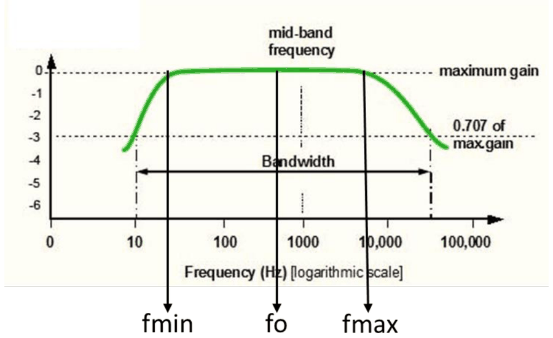
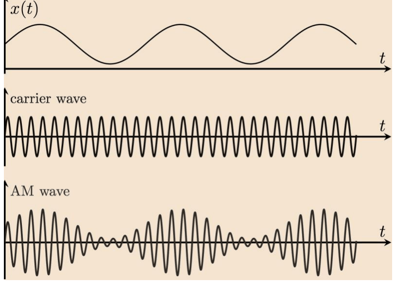
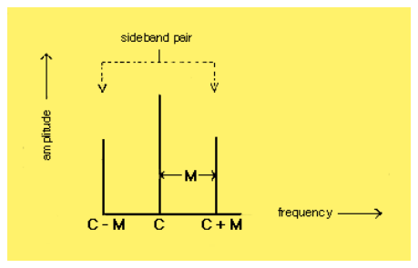
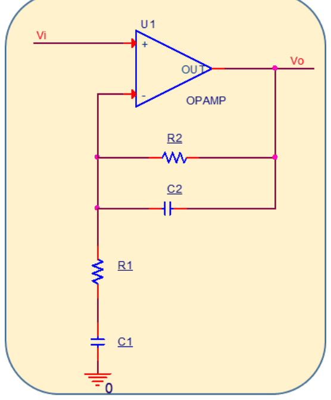
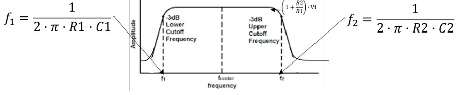
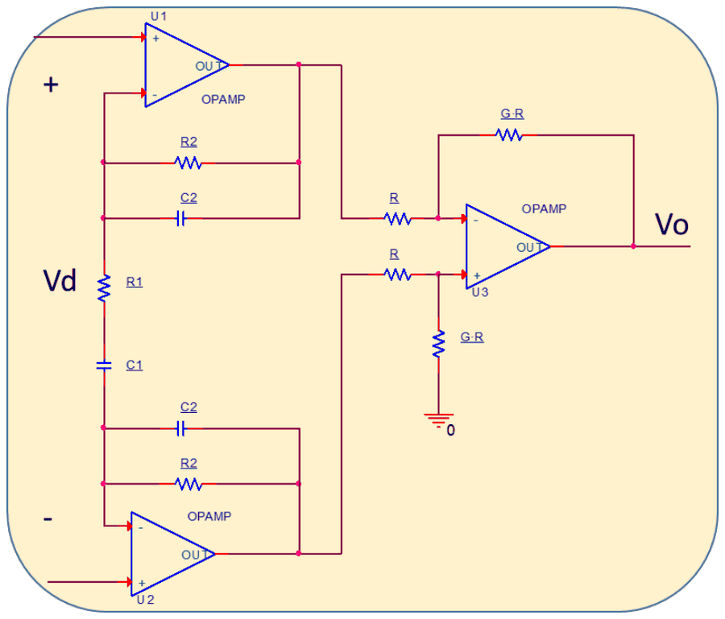
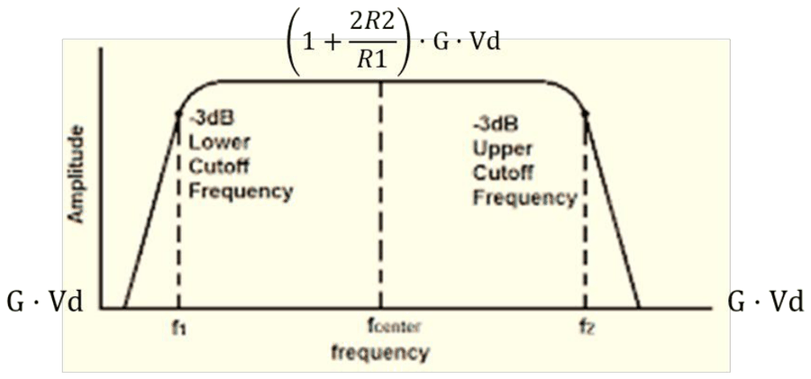
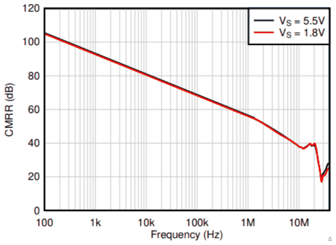
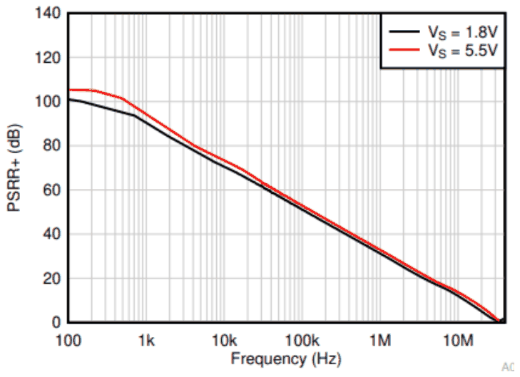
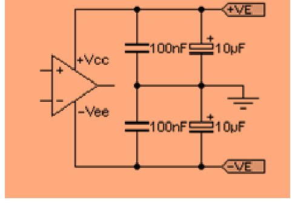

# Amplificadors d'alterna i limitacions dels operacionals

## 📑 Índice de Contenidos

- [1 La banda que ocupa el senyal](#1-la-banda-que-ocupa-el-senyal)
- [2 Centrat i amplada de banda](#2-centrat-i-amplada-de-banda)
- [3 Amplificador d'alterna no inversor](#3-amplificador-dalterna-no-inversor)
- [4 Amplificador d'instrumentació d'alterna](#4-amplificador-dinstrumentació-dalterna)
- [5 Limitacions de l'amplificador operacional](#5-limitacions-de-lamplificador-operacional)
  - [Producte guany × amplada de banda](#producte-guany-amplada-de-banda)
  - [Slew rate](#slew-rate)
  - [Impedància d'entrada i capacitats paràsites](#impedància-dentrada-i-capacitats-paràsites)
  - [CMRR i PSRR a la freqüència de treball](#cmrr-i-psrr-a-la-freqüència-de-treball)

---

Sistemes de Mesura · **Unitat 8 — Condicionament de sensors en alterna** · Document 3 de 6

# Amplificadors d'alterna i limitacions dels operacionals

Dedicació estimada: 12 minuts

> [!NOTE] **Objectius d'aprenentatge**
>
> - Justificar per què l'amplificació del senyal de mesura ha de ser passa-banda i no de banda ampla.
> - Determinar la banda que ocupa el senyal modulat a partir de la dinàmica del mesurand.
> - Aplicar la condició de centrat per mitjana geomètrica i el compromís d'amplada de banda.
> - Relacionar cada condensador de les dues topologies amb la freqüència de tall que fixa.
> - Comprovar si un amplificador operacional concret és adequat quant a GBW, slew rate, capacitat d'entrada i CMRR/PSRR a  $f_0$.

El canvi d'amplitud que el rang complet del mesurand produeix a la sortida del convertidor impedància–tensió pot ser en alguns casos de mil·livolts o fins i tot de microvolts, mentre que la conversió alterna–contínua i la digitalització posteriors demanen senyals de l'ordre de volts. Cal amplificar, però no de qualsevol manera: un amplificador de contínua o de banda ampla amplificaria per igual el senyal, el soroll  $\frac{1}{f}$  i la interferència de xarxa. La solució és un amplificador de característica **passa-banda** centrada a  $f_0$.

*Figura: Figura 8.11 Mòdul de la resposta freqüencial d'un amplificador d'alterna, normalitzat pel guany màxim.*

| Avantatge | Origen |
|:--- |:--- |
| **Supressió dels errors de contínua** | L'offset de tensió i els corrents de polarització de l'operacional generen una tensió contínua a la sortida que pot ser comparable o superior al senyal útil. En la configuració passa-banda la contínua queda fortament atenuada i aquests errors no s'amplifiquen. |
| **Reducció del soroll  $\frac{1}{f}$** | La densitat espectral del soroll rosa creix en baixar la freqüència. Com més elevada és  $f_0$, menor és el soroll  $\frac{1}{f}$  dins de la banda amplificada. |
| **Rebuig de la xarxa** | Com més gran és la distància entre 50 Hz i  $f_0$, més atenuació rep la interferència de la xarxa. |

## 1 La banda que ocupa el senyal

*Figura: Figura 8.12 Mesurand, senyal de l'oscil·lador i sortida del convertidor impedància–tensió, que és l'entrada de l'amplificador d'alterna.*

*Figura: Figura 8.13 Espectre d'un senyal modulat en amplitud amb portadora a $C$ i modulador a $M$.*

La sortida del convertidor impedància–tensió és un senyal modulat en amplitud. Si el mesurand no és constant, l'espectre ja no és una ratlla a  $f_0$: s'expandeix al seu voltant. Amb un mesurand sinusoïdal de freqüència  $f_m$  apareixen tres components —la portadora a  $f_0$  i les dues bandes laterals a  $f_0 \pm f_m$ —; en el cas general, amb un mesurand d'espectre estès fins a  $f_{m,\max}$, el senyal modulat ocupa

$$
f_{\min} = f_0 - f_{m,\max}, \qquad f_{\max} = f_0 + f_{m,\max} \qquad (8.18)
$$

Perquè el mesurand es pugui recuperar sense distorsió, el guany ha de ser essencialment constant en tota aquesta banda. Si  $\delta$  és la màxima variació relativa admissible respecte al guany màxim  $G$:

$$
|H(f_{\min})| \geq G(1-\delta), \qquad |H(f_{\max})| \geq G(1-\delta) \qquad (8.19)
$$

Els extrems de l'espectre **no coincideixen** amb les freqüències de tall a −3 dB:  $f_{-3\mathrm{dB},\min}$  i  $f_{-3\mathrm{dB},\max}$  s'han de situar molt per sota i molt per sobre de  $f_{\min}$  i  $f_{\max}$. Com més petit sigui  $\delta$  i menor l'ordre dels filtres, més gran ha de ser aquesta separació.

## 2 Centrat i amplada de banda

El criteri estàndard per centrar la característica a la freqüència de treball és fer coincidir  $f_0$  amb la **mitjana geomètrica** de les dues freqüències de tall:

$$
f_0 = \sqrt{f_{-3\mathrm{dB},\min}\cdot f_{-3\mathrm{dB},\max}} \qquad (8.20)
$$

La condició és en escala logarítmica:  $f_0$  equidista de totes dues en logaritmes, no en escala lineal. Amb talls a 10 Hz i 30 kHz, la freqüència de treball òptima és de 548 Hz; la mitjana aritmètica hauria donat 15 kHz, molt lluny del màxim real de la característica.

L'amplada de banda fixa alhora dos paràmetres en conflicte. Una banda més **ampla** allunya els extrems de l'espectre de les freqüències de tall i, per tant, redueix l'error de guany; però eixampla la banda equivalent de soroll i atenua menys les interferències. Una banda més **estreta** fa el contrari: millora el rebuig de soroll i introdueix un error de guany als extrems que es percep com un error sistemàtic dependent de la freqüència del mesurand. El compromís és triar l'amplada mínima que garanteixi l'error de guany admissible:

$$
BW = f_{-3\mathrm{dB},\max} - f_{-3\mathrm{dB},\min} \geq 2\,k\,f_{m,\max} \qquad (8.21)
$$

amb  $k>1$, tant més gran com menor es vulgui l'error de guany.

## 3 Amplificador d'alterna no inversor

*Figura: Figura 8.14 Amplificador d'alterna no inversor.*

És la topologia habitual quan la sortida del convertidor impedància–tensió és unipolar referida a massa, com en el divisor o el pseudopont de sortida única. Es construeix sobre l'amplificador no inversor clàssic afegint-hi dos condensadors:  $C_1$  en sèrie amb  $R_1$  i  $C_2$  en paral·lel amb  $R_2$.

| Règim | Comportament dels condensadors | Guany |
|:--- |:--- |:--- |
| **Freqüència molt baixa** | $C_1$  i  $C_2$  són circuits oberts. Amb  $C_1$  obert no circula corrent per  $R_1$  ni per  $R_2$. | Seguidor de tensió, guany 1. Tota tensió contínua a l'entrada es transmet a la sortida amb guany unitari. |
| **Banda de pas ( $f_0$ )** | $C_1$  és curtcircuit davant de  $R_1$;  $C_2$  és circuit obert davant de  $R_2$. | No inversor clàssic,  $G = 1 + R_2/R_1$. |
| **Freqüència molt alta** | $C_2$  curtcircuita  $R_2$  i la realimentació negativa es maximitza. | Seguidor de tensió, guany 1. |

Les freqüències de tall a −3 dB, amb l'operacional suposat ideal, s'obtenen igualant la impedància de cada condensador a la de la resistència que l'acompanya:

$$
f_{-3\mathrm{dB},\min} = \frac{1}{2\pi R_1 C_1}, \qquad f_{-3\mathrm{dB},\max} = \frac{1}{2\pi R_2 C_2} \qquad (8.22)
$$

de manera que la condició de centrat esdevé  $f_0 = \frac{1}{2\pi\sqrt{R_1 C_1 R_2 C_2}}$.

*Figura: Figura 8.15 Resposta freqüencial de l'amplificador d'alterna no inversor.*

El procés de disseny parteix de  $G$  i  $f_0$  com a especificacions: es tria  $R_1$, se'n calcula  $R_2 = R_1(G-1)$, s'escullen les dues freqüències de tall que compleixin el centrat amb un error de guany acceptable, i se n'obtenen  $C_1$  i  $C_2$. Finalment se selecciona l'operacional.

## 4 Amplificador d'instrumentació d'alterna

*Figura: Figura 8.16 Amplificador d'instrumentació d'alterna.*

Quan la sortida del convertidor impedància–tensió és diferencial —pont d'alterna o pseudopont diferencial— cal aquesta topologia. És un amplificador d'instrumentació de tres operacionals amb tres condensadors a la primera etapa:  $C_1$  en sèrie amb la resistència de guany  $R_1$, i dos condensadors  $C_2$, cadascun en paral·lel amb una de les dues resistències  $R_2$. La segona etapa és un amplificador diferencial de guany fix  $G$, sense modificacions freqüencials.

L'anàlisi en els tres règims és anàloga. A freqüència molt baixa la primera etapa té guany diferencial unitari i el guany total és  $G$. A la banda de pas, amb  $C_1$  en curtcircuit i  $C_2$  obert:

$$
G_\mathrm{total} = \left(1 + \frac{2R_2}{R_1}\right)\cdot G \qquad (8.23)
$$

i a freqüència molt alta  $C_2$  curtcircuita  $R_2$  i el guany torna a ser  $G$. Les freqüències de tall coincideixen formalment amb les del cas no inversor, perquè el tall inferior el fixa  $R_1 C_1$  i el superior  $R_2 C_2$; la condició de centrat és, doncs, idèntica.

*Figura: Figura 8.17 Resposta freqüencial de l'amplificador d'instrumentació d'alterna.*

L'avantatge principal és l'elevat **rebuig del mode comú**: en ser l'entrada diferencial, qualsevol senyal comú als dos terminals queda atenuat pel CMRR de l'amplificador. La limitació pràctica és que **no es pot implementar amb un amplificador d'instrumentació comercial**: en els integrats de tres terminals, la resistència  $R_1$  és accessible pels pins de guany, però les  $R_2$  són internes i no tenen pins on connectar-hi els  $C_2$. Cal muntar-lo amb operacionals discrets, amb el cost i la superfície de placa que això implica, a canvi de control total sobre els components.

Les dues etapes no tenen els mateixos requisits de producte guany × amplada de banda. La primera ha de complir  $GBW \gg (1+2R_2/R_1)\,f_{-3\mathrm{dB},\max}$  i la segona  $GBW \gg G\,f_{-3\mathrm{dB},\max}$; com que el guany de la segona sol ser el menor, la seva condició és menys restrictiva.

## 5 Limitacions de l'amplificador operacional

A les freqüències de treball del condicionament de sensors reactius —de centenars de Hz a desenes de MHz— quatre limitacions de l'operacional passen a ser determinants.

### Producte guany × amplada de banda

En un operacional de realimentació de tensió, el producte del guany en llaç tancat per la freqüència de tall és pràcticament constant. La condició de disseny és

$$
GBW \gg G\cdot f_{-3\mathrm{dB},\max} \qquad (8.24)
$$

Amb  $G=100$  i  $f_{-3\mathrm{dB},\max} = 20$  kHz cal  $GBW \gg 2$  MHz, de manera que un operacional d'ús general de 3 MHz queda al límit i en calen de 10–20 MHz. Si la condició no es compleix, el tall superior real ja no el fixen  $R_2$  i  $C_2$  sinó el propi operacional, el  $GBW$  del qual varia fins a un factor 2–3 entre mostres del mateix model i amb la temperatura: el tall esdevé poc controlable i el guany en banda de pas queda per sota del dissenyat. Una alternativa són els amplificadors de realimentació de corrent, en què guany i amplada de banda no estan lligats de la mateixa manera, a canvi d'un soroll intrínsec superior.

### Slew rate

El slew rate és el màxim pendent que la sortida pot lliurar. El pendent màxim d'una sinusoide de sortida d'amplitud  $G\,V_{in,\mathrm{pic}}$  es dona al pas per zero, de manera que

$$
SR \geq 2\pi f_0\, G\, V_{in,\mathrm{pic}} \qquad (8.25)
$$

La condició és tant més exigent com majors són el guany, la freqüència de treball i l'amplitud d'entrada: a 1 MHz amb  $G=10$  i 100 mV de pic ja calen 6,3 V/µs, fora de l'abast dels operacionals d'ús general d'1 V/µs. Si el slew rate limita, la sortida s'aproxima a una ona triangular i apareixen harmònics que interfereixen amb la conversió alterna–contínua posterior.

### Impedància d'entrada i capacitats paràsites

La impedància d'entrada no es pot considerar infinita. La seva component capacitiva —d'1 a 10 pF diferencial i d'1 a 20 pF de mode comú en els operacionals típics— domina en pujar la freqüència:

$$
|Z_{\text{in}}(f)| \approx \frac{1}{2\pi f\, C_{\text{in}}} \qquad (8.26)
$$

Aquesta impedància finita forma un divisor amb la impedància de sortida del bloc anterior i introdueix una atenuació dependent de la freqüència i difícil de predir. A més, les pistes del circuit imprès aporten de 0,5 a 5 pF per centímetre: en una pista que transporti un senyal d'alta impedància, 2 pF paràsits ja poden degradar la resposta. Les mitigacions són minimitzar la longitud de les pistes d'alta impedància, envoltar-les de pla de massa o de guarda, i triar encapsulats de baixa capacitat entre pins.

### CMRR i PSRR a la freqüència de treball

*Figura: Figura 8.18 Variació del CMRR amb la freqüència en un amplificador operacional real.*

*Figura: Figura 8.19 Variació del PSRR de l'alimentació positiva amb la freqüència.*

El CMRR i el PSRR valen 80–120 dB a baixa freqüència, però es degraden a raó de 20 dB/dècada a partir d'una freqüència de cantonada que sol ser de desenes o centenars de Hz. A  $f_0 \gg f_{c,CMRR}$  el rebuig pot haver caigut a 40–60 dB. En un exemple amb 100 mV de mode comú a 10 kHz, CMRR de 80 dB i guany 100, la component d'error a la sortida val 1 mV; i per damunt de la cantonada aquesta component apareix **desfasada 90°** respecte al senyal útil, cosa que la fa rebutjable per la detecció coherent però no pels mètodes no coherents.

El PSRR es degrada igual: tota variació de l'alimentació modifica la tensió d'offset per un factor  $\Delta V_{\text{CC}}/PSRR$  i es reflecteix a la sortida, també desfasada 90° a alta freqüència. El PSRR de l'alimentació negativa sol ser pitjor que el de la positiva. Amb 10 mV superposats a l'alimentació i guany 100, la sortida en pateix 0,32 mV a 10 kHz i 32 mV a 1 MHz, on el PSRR ja ha caigut a uns 30 dB: les fonts commutades són especialment problemàtiques.

Aquestes degradacions pesen sobre els circuits amb tensió de mode comú significativa a l'entrada, com el propi amplificador d'alterna no inversor, on  $V_{\text{CM}} = V_i$; en canvi són irrellevants en els circuits inversors, com el pseudopont, on la tensió de mode comú és nul·la.

*Figura: Figura 8.20 Condensadors de desacoblament als pins d'alimentació.*

La mitigació estàndard davant del PSRR finit és el **desacoblament**: dos condensadors en paral·lel per a cada tensió d'alimentació. L'**electrolític** de 10–100 µF dona baixa impedància a baixa freqüència, però la seva inductància sèrie el fa comportar-se com una bobina per damunt de la seva ressonància pròpia, de desenes de kHz a pocs MHz. El **ceràmic** de 100 nF a 1 µF té la ressonància pròpia a desenes de MHz i cobreix les freqüències que l'electrolític ja no filtra. El muntatge exigeix col·locar el ceràmic el més a prop possible dels pins d'alimentació —menys de 5 mm per damunt de 100 kHz—, pistes curtes i amples per minimitzar-ne la inductància, i un pla de massa continu que redueixi la impedància de retorn dels corrents d'alimentació.

> [!TIP] **Síntesi**
>
> L'amplificador d'alterna és passa-banda perquè així suprimeix els errors de contínua de l'operacional, redueix el soroll  $\frac{1}{f}$  i atenua la xarxa. Ha de deixar passar amb guany pla no només  $f_0$  sinó tota la banda  $f_0 \pm f_{m,\max}$  que ocupa el senyal modulat, amb les freqüències de tall a −3 dB clarament fora d'aquest interval, i es centra fent  $f_0$  igual a la mitjana geomètrica dels dos talls. L'amplada de banda enfronta error de guany contra rebuig de soroll. En les dues topologies, el condensador en sèrie amb  $R_1$  fixa el tall inferior i el condensador en paral·lel amb  $R_2$  el superior; la versió d'instrumentació aporta rebuig de mode comú però no es pot muntar amb un integrat comercial de tres terminals. La tria de l'operacional queda condicionada pel  $GBW$, pel slew rate, per la capacitat d'entrada i de les pistes, i per la degradació de CMRR i PSRR a 20 dB/dècada, que a més genera errors desfasats 90° respecte al senyal útil.

[← 2. Conversió impedància–tensió: divisors, inversor, ponts i pseudoponts](02_Unitat8_Conversio_impedancia_tensio.md)[4. Estimació de l'amplitud: mètodes no coherents →](04_Unitat8_04_Metodes_no_coherents.md)

---

## 📐 Formulario Resumen de Ecuaciones

| Nº / Ref | Expresión Matemática |
| :---: | :--- |
| **(8.18)** | $f_{\min} = f_0 - f_{m,\max}, \qquad f_{\max} = f_0 + f_{m,\max}$ |
| **(8.19)** | $\|H(f_{\min})\| \geq G(1-\delta), \qquad \|H(f_{\max})\| \geq G(1-\delta)$ |
| **(8.20)** | $f_0 = \sqrt{f_{-3\mathrm{dB},\min}\cdot f_{-3\mathrm{dB},\max}}$ |
| **(8.21)** | $BW = f_{-3\mathrm{dB},\max} - f_{-3\mathrm{dB},\min} \geq 2\,k\,f_{m,\max}$ |
| **(8.22)** | $f_{-3\mathrm{dB},\min} = \frac{1}{2\pi R_1 C_1}, \qquad f_{-3\mathrm{dB},\max} = \frac{1}{2\pi R_2 C_2}$ |
| **(8.23)** | $G_\mathrm{total} = \left(1 + \frac{2R_2}{R_1}\right)\cdot G$ |
| **(8.24)** | $GBW \gg G\cdot f_{-3\mathrm{dB},\max}$ |
| **(8.25)** | $SR \geq 2\pi f_0\, G\, V_{in,\mathrm{pic}}$ |
| **(8.26)** | $\|Z_{\text{in}}(f)\| \approx \frac{1}{2\pi f\, C_{\text{in}}}$ |