# Estimació de l'amplitud: mètodes no coherents

## 📑 Índice de Contenidos

- [1 Modulació AM i modulació DSB](#1-modulació-am-i-modulació-dsb)
- [2 Convertidors de valor eficaç](#2-convertidors-de-valor-eficaç)
- [3 Multiplicadors analògics](#3-multiplicadors-analògics)
- [4 Detectors de pic o d'envolupant](#4-detectors-de-pic-o-denvolupant)

---

Sistemes de Mesura · **Unitat 8 — Condicionament de sensors en alterna** · Document 4 de 6

# Estimació de l'amplitud: mètodes no coherents

Dedicació estimada: 12 minuts

> [!NOTE] **Objectius d'aprenentatge**
>
> - Distingir la modulació AM de la DSB i decidir quan un mètode no coherent és suficient.
> - Comparar les tres famílies de convertidors de valor eficaç quant a exactitud, amplada de banda, velocitat i cost.
> - Explicar per què tot mètode no coherent introdueix un biaix positiu davant del soroll i les interferències.
> - Relacionar el nombre de quadrants d'un multiplicador analògic amb la seva aplicació.
> - Dimensionar la constant de temps d'un detector de pic entre les seves dues condicions.

Un cop el convertidor impedància–tensió ha generat el senyal sinusoïdal i l'amplificador d'alterna l'ha portat al nivell adequat, cal extreure'n l'amplitud com a tensió contínua. Quines tècniques són admissibles depèn de com respon el convertidor davant del mesurand, i per això cal distingir abans dos tipus de modulació.

## 1 Modulació AM i modulació DSB

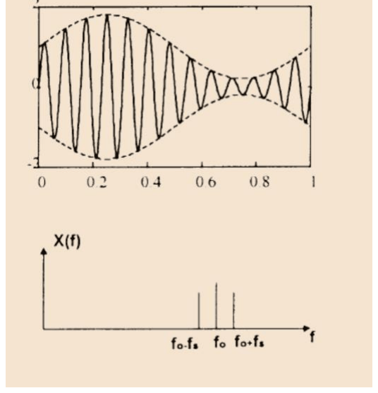

*Figura: Figura 8.21 Modulació d'amplitud clàssica: l'envolupant, en discontinu, no arriba mai a zero.*

En la **modulació d'amplitud clàssica** l'amplitud a la sortida del convertidor és diferent de zero per a qualsevol valor físicament possible del mesurand, i la fase respecte a l'oscil·lador es manté constant —0° o 180°, però no canvia amb  $x$:

$$
v(t) = A(x)\cos(2\pi f_0 t + \varphi_0), \qquad A(x) > 0\ \ \forall x \qquad (8.27)
$$

És el cas de l'amplificador inversor capacitiu amb un sensor  $C_s = C_0(1+x)$: la sortida és proporcional a  $1+x$, estrictament positiva mentre  $x > -1$, i el desfasament de 180° que introdueix l'inversor és constant. Aquí n'hi ha prou amb mesurar l'envolupant, i tots els mètodes no coherents hi són adequats.

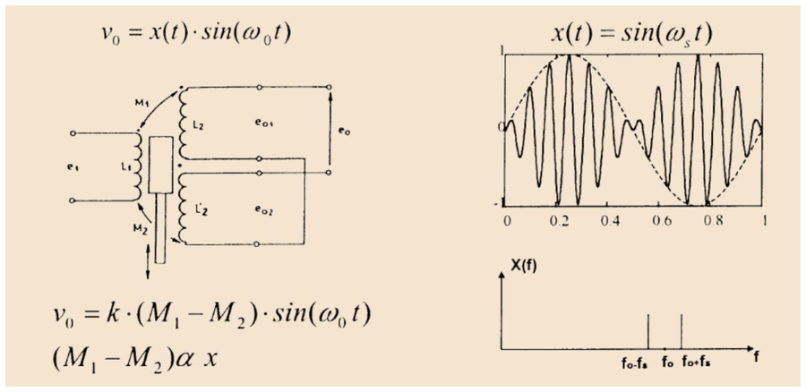

*Figura: Figura 8.22 Modulació de doble banda lateral: l'amplitud s'anul·la a $x=0$ i el signe queda codificat en la fase.*

En la **modulació de doble banda lateral** (DSB) l'amplitud és proporcional a  $x$  i s'anul·la a l'origen,  $v(t) = A\,x(t)\cos(2\pi f_0 t)$. És el cas paradigmàtic del pont o pseudopont diferencial, dissenyat precisament perquè la sortida sigui nul·la a la situació de referència. Quan  $x>0$  la fase respecte a l'oscil·lador és 0°, i quan  $x<0$  passa a 180°. L'envolupant val  $|A\,x(t)|$, sempre positiva: un detector d'envolupant retorna  $|x|$  i **perd el signe**. En una LVDT centrada la sortida és nul·la, i en desplaçar-se el nucli el senyal creix en amplitud però el sentit del desplaçament queda codificat en la fase. Recuperar-lo exigeix detecció coherent.

## 2 Convertidors de valor eficaç

El valor eficaç d'un senyal periòdic de període  $T$  és

$$
V_\mathrm{rms} = \sqrt{\frac{1}{T}\int_0^T v^2(t)\,dt} \qquad (8.28)
$$

i té una interpretació física directa: és la tensió contínua que dissiparia la mateixa potència en una resistència. Un convertidor RMS lliura una tensió contínua i positiva per conveni, igual al valor eficaç de l'entrada.

> [!WARNING] **El límit de tots els mètodes no coherents**
>
> Un convertidor RMS mesura el valor eficaç de tot el que li arriba, sense discriminar la freqüència de treball. Amb senyal útil  $V_s$, interferència  $V_{\text{int}}$  i soroll  $V_n$  a l'entrada, la sortida val
>
>

$$
V_\mathrm{out} = \sqrt{V_s^2 + V_{\text{int}}^2 + V_n^2} \qquad (8.29)
$$

>
> de manera que la interferència i el soroll hi entren de forma quadràtica i generen un biaix **sempre positiu**. El soroll  $V_n$  depèn de l'amplada de banda equivalent de soroll del sistema, fixada generalment per l'amplificador d'alterna.

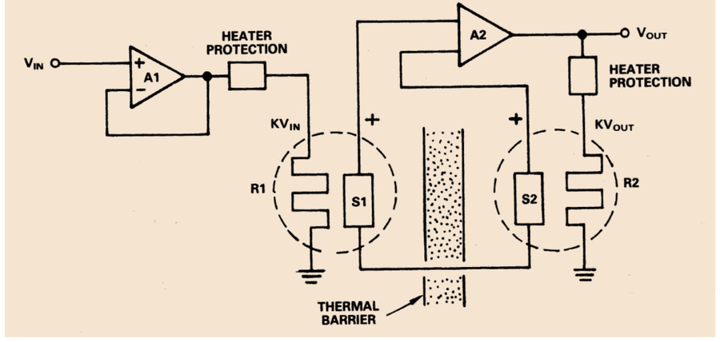

*Figura: Figura 8.23 Convertidor RMS tèrmic.*

El **convertidor tèrmic** materialitza la definició física. El senyal altern escalfa una resistència  $R_1$, la tensió contínua de sortida n'escalfa una altra  $R_2$  de les mateixes característiques, i un amplificador de retroalimentació compara les temperatures mesurades pels dos sensors i ajusta la sortida fins a igualar-les. En estat estacionari les potències dissipades s'igualen i, si  $R_1 = R_2$, la sortida és el valor eficaç de l'entrada.

El **càlcul matemàtic** implementa la fórmula amb circuits analògics, en dues variants.

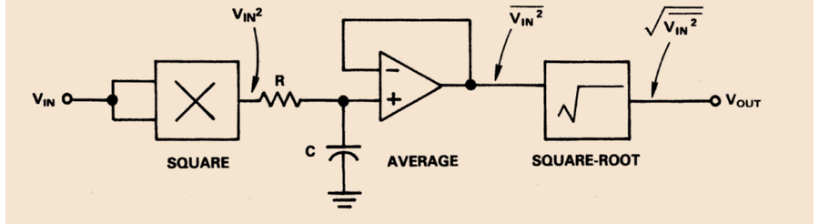

*Figura: Figura 8.24 Convertidor RMS de càlcul explícit.*

En la implementació **explícita** el senyal s'eleva al quadrat amb un multiplicador analògic, es filtra passa-baixes per estimar-ne el valor mitjà i se'n calcula l'arrel quadrada amb un amplificador logarítmic, un divisor per dos i un antilogarítmic. El seu inconvenient és el marge dinàmic: amb entrades grans, el quadrat pot saturar les etapes intermèdies.

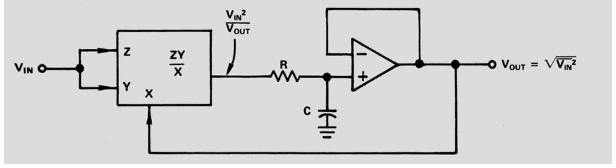

*Figura: Figura 8.25 Convertidor RMS de càlcul implícit.*

En la implementació **implícita** el quadrat es divideix per la pròpia sortida abans de filtrar-lo, i la retroalimentació fa que la sortida s'autoajusti:

$$
V_\mathrm{out} = \overline{\left(\frac{v^2(t)}{V_\mathrm{out}}\right)} \Rightarrow V_\mathrm{out}^2 = \overline{v^2(t)} \Rightarrow V_\mathrm{out} = \sqrt{\overline{v^2(t)}} \qquad (8.30)
$$

La divisió evita la saturació i dona un marge dinàmic més gran, a canvi d'una amplada de banda menor —fins a alguns MHz— i de pitjor exactitud, per les imprecisions del divisor analògic. En totes dues variants, la freqüència de tall del filtre passa-baixes fixa el compromís entre velocitat de resposta i arrissat residual a la sortida: tall baix dona bona estimació del valor mitjà però resposta lenta; tall alt segueix canvis ràpids però deixa arrissat.

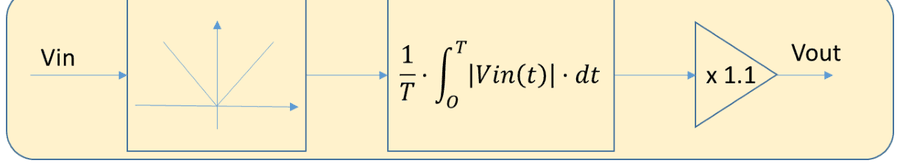

*Figura: Figura 8.26 Convertidor RMS basat en rectificació.*

El tercer mètode rectifica el senyal,troba el valor mitjà i el multiplica per 1,1. Aquest factor es basa en la relació que existeix, per a una forma d'ona donada, entre el valor eficaç i el valor mitjà rectificat: el **factor de forma**. Per a una sinusoide de pic  $V_p$, el valor eficaç és  $V_p/\sqrt{2}$  i el valor mitjà rectificat de doble ona és  $2V_p/\pi$, de manera que

$$
V_\mathrm{rms} = \frac{\pi}{2\sqrt{2}}\,\overline{|v(t)|} \approx 1{,}11\cdot\overline{|v(t)|} \qquad (8.31)
$$

L'arquitectura és, doncs, un rectificador de doble ona —de precisió amb operacionals, si es vol eliminar la caiguda dels díodes—, un filtre passa-baixes i un amplificador de guany 1,11.

| Família | Exactitud i abast | Velocitat i cost |
|:--- |:--- |:--- |
| **Tèrmic** | Valor eficaç veritable de qualsevol forma d'ona, independentment del contingut harmònic. Amplada de banda fins a centenars de MHz, perquè la mesura es basa en efectes tèrmics que no depenen de la freqüència. | Resposta lenta, de dècimes de segon o més, perquè la transmissió de calor ho és. El més car del mercat. |
| **Càlcul matemàtic** | Valor eficaç veritable. L'explícita té més amplada de banda i menys marge dinàmic; la implícita, a l'inrevés. | Molt més ràpid i molt menys costós que el tèrmic. |
| **Rectificació** | El factor de forma 1,11 **només val per a senyals sinusoïdals**: amb distorsió harmònica el factor ja no és aquest i la mesura és errònia. L'amplada de banda la limita la velocitat de commutació dels díodes, que per damunt d'alguns centenars de kHz distorsionen la forma d'ona rectificada. | El més senzill i barat, amb components molt comuns. Resposta ràpida segons el filtre. |

En el condicionament de sensors reactius la portadora a  $f_0$  és sempre sinusoïdal, de manera que la limitació del mètode per rectificació no acostuma a ser un problema pràctic mentre els harmònics siguin negligibles.

## 3 Multiplicadors analògics

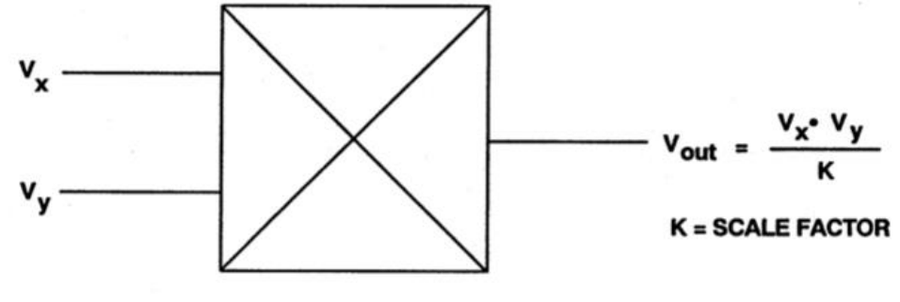

*Figura: Figura 8.27 Multiplicador analògic.*

Els multiplicadors analògics són el bloc central dels convertidors RMS per càlcul matemàtic i, com es veurà, també dels detectors coherents homodins. Implementen el producte instantani de dues entrades:

$$
V_\mathrm{out}(t) = \frac{V_x(t)\cdot V_y(t)}{K} \qquad (8.32)
$$

on  $K$  és un factor d'escala amb unitats de volt que depèn de l'integrat.

| Quadrants | Signes admesos | Aplicació típica |
|:--- |:--- |:--- |
| **Un quadrant** | Les dues entrades sempre positives; sortida sempre positiva. | No pot multiplicar senyals alterns, que canvien de signe. |
| **Dos quadrants** | Una entrada bipolar i l'altra unipolar. La sortida canvia de signe amb l'entrada bipolar. | Modulació d'amplitud, control de guany variable, detecció coherent amb referència unipolar. |
| **Quatre quadrants** | Totes dues entrades bipolars, amb signes independents. | Detecció homodina, on tant el senyal com la referència sinusoïdal canvien de signe. És la norma en condicionament de sensors, perquè els senyals a  $f_0$  canvien de signe cada semiperíode. |

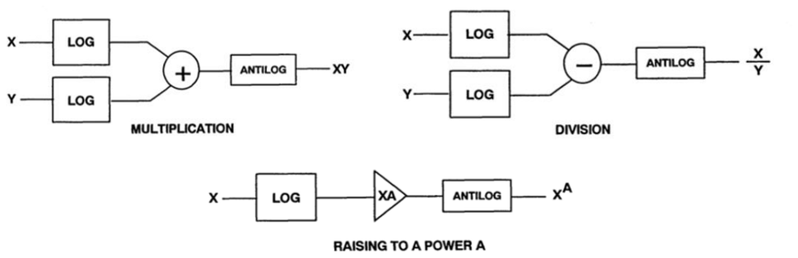

*Figura: Figura 8.28 Operacions no lineals amb amplificadors logarítmics i antilogarítmics.*

La manera més senzilla d'implementar un multiplicador d'**un quadrant** aprofita la propietat dels logaritmes,  $V_x V_y = \exp(\ln V_x + \ln V_y)$: es calcula el logaritme de cada entrada, se sumen i se'n pren l'exponencial. Cada bloc es construeix amb un operacional i una unió p-n que aporta la relació exponencial corrent–tensió.

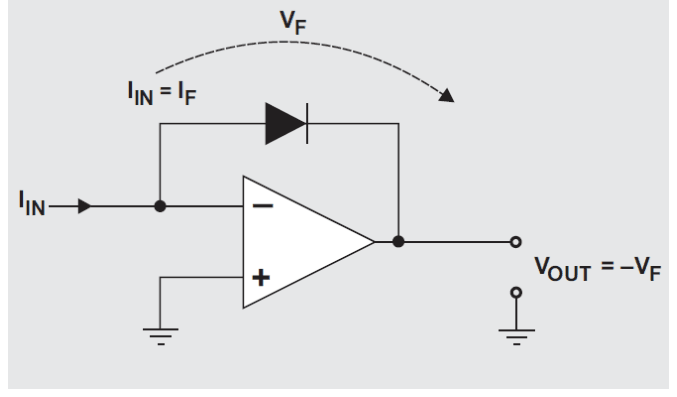

*Figura: Figura 8.29 Amplificador logarítmic amb un díode.*

Amb l'operacional ideal, tot el corrent d'entrada  $V_{\text{in}}/R$  circula pel díode. De la característica  $I_F = I_S(e^{V_F/\eta V_T} - 1)$, amb  $V_T = kT/q$  i  $\eta$  entre 1 i 2 segons el procés de fabricació, i tenint en compte que en conducció directa  $I_F \gg I_S$:

$$
V_\mathrm{out} = -V_F \approx -\eta\,V_T \ln\!\left(\frac{V_{\text{in}}}{I_S R}\right) \qquad (8.33)
$$

El mateix circuit amb un transistor bipolar amb la base a massa —i per tant el col·lector també, pel curtcircuit virtual— dona la mateixa relació, perquè el transistor hi actua com un díode.

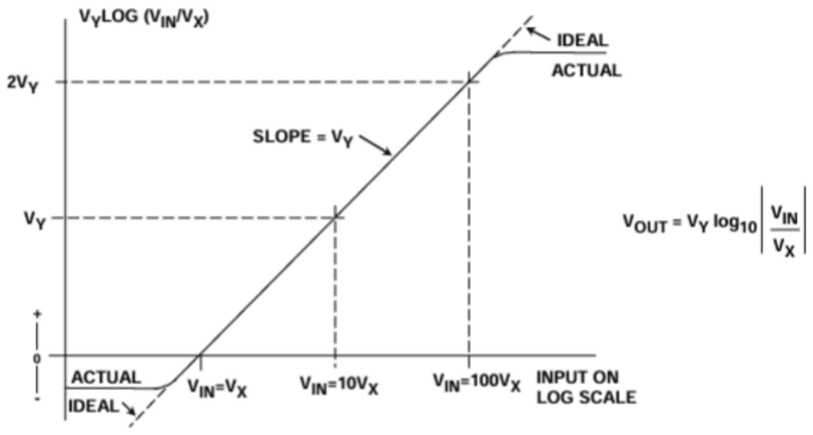

*Figura: Figura 8.30 Característica entrada–sortida d'un amplificador logarítmic.*

Aquests amplificadors també serveixen per convertir magnituds a decibels: posant-hi al darrere un inversor de guany  $-G$, la sortida és proporcional a  $\log_{10}(V_{\text{in}}/V_X)$  amb  $V_X = I_S R$, de manera que s'anul·la per a  $V_{\text{in}} = V_X$. El pendent de la característica val  $G\,\eta\,k\,T/(q\log_{10}e)$  i, per tant, **depèn de la temperatura** de la unió. A més, la saturació de l'operacional i la conducció del transistor acoten per baix i per dalt el rang d'entrada útil.

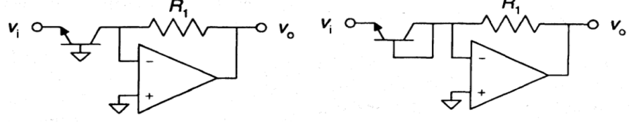

*Figura: Figura 8.31 Amplificador antilogarítmic.*

L'amplificador antilogarítmic fa la funció inversa intercanviant les posicions de la resistència i el transistor, de manera que la sortida és el corrent de col·lector per la resistència de realimentació:

$$
V_\mathrm{out} = I_C R_1 \approx R_1 I_{\text{ES}}\, e^{-V_i/V_T} \qquad (8.34)
$$

i torna a dependre fortament de la temperatura de la unió; hi ha circuits més sofisticats que ho compensen.

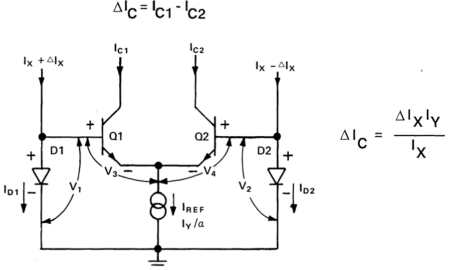

*Figura: Figura 8.32 Cèl·lula de Gilbert.*

El multiplicador logarítmic és d'un sol quadrant, precisament perquè el logaritme només admet una polaritat. Per a dos o quatre quadrants cal la **cèl·lula de Gilbert**, la topologia multiplicadora més emprada en circuits integrats. Combina dos transistors NPN amb dos díodes —o dos transistors en configuració de díode— i aconsegueix alhora el producte analògic, la compensació intrínseca de la dependència amb la temperatura i l'admissió d'una entrada bipolar.

Imposant l'equació de malla a les quatre unions i suposant els transistors i els díodes aparellats i a la mateixa temperatura, els termes  $V_T$  i els corrents de saturació es cancel·len i queda  $I_{c1}/I_{c2} = I_{D1}/I_{D2}$. Escrivint els corrents com un valor mitjà més una desviació,  $I_{c1{,}2} = I_c \pm \Delta I_c$  i  $I_{D1{,}2} = I_x \pm \Delta I_x$, la sortida en corrent diferencial resulta

$$
\Delta I_c = I_Y\cdot\frac{\Delta I_x}{I_x} \qquad (8.35)
$$

on  $I_Y$  és el corrent de polarització de la cèl·lula. Com que  $I_Y$  és sempre positiu, la cèl·lula sola és un multiplicador de **dos quadrants**, amb  $\Delta I_x$  com a entrada bipolar. Les implementacions comercials hi afegeixen xarxes d'atenuació a l'entrada i amplificació a la sortida perquè la cèl·lula treballi sempre en règim lineal.

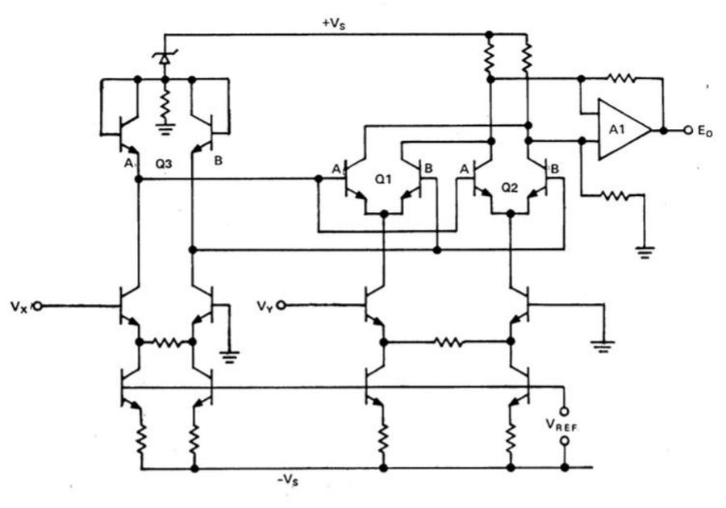

*Figura: Figura 8.33 Multiplicador de quatre quadrants.*

El multiplicador de **quatre quadrants** combina dues cèl·lules de Gilbert amb conversió tensió–corrent a les dues entrades i conversió corrent–tensió a la sortida. Cada entrada s'aplica a un parell diferencial amb resistència entre emissors, que en genera un corrent diferencial proporcional:  $\Delta I_X = V_X/(2R_{\text{EX}})$  i  $\Delta I_{\text{REF}} = V_Y/(2R_{\text{EY}})$. La diferència de corrents de col·lector de les dues cèl·lules és proporcional al producte  $\Delta I_X \cdot \Delta I_{\text{REF}}$  i l'amplificador de sortida la converteix en  $E_o = K\,V_X V_Y$.

## 4 Detectors de pic o d'envolupant

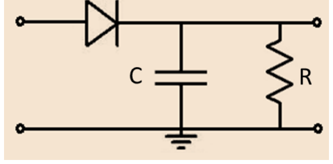

*Figura: Figura 8.34 Detector de pic bàsic.*

Els detectors de pic no calculen el valor eficaç: lliuren una estimació de l'envolupant superior. Quan la tensió d'entrada supera la de sortida més la caiguda del díode, aquest condueix i el condensador es carrega ràpidament cap al pic; quan cau per sota, el díode es talla i el condensador es descarrega lentament per la resistència amb constant de temps  $\tau = RC$.

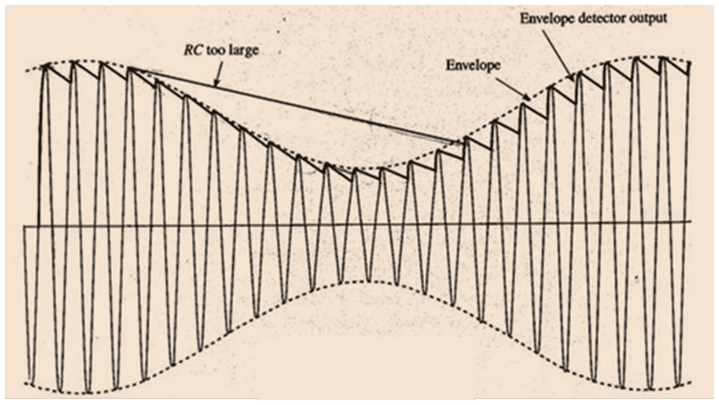

*Figura: Figura 8.35 Entrada, envolupant teòrica i sortida d'un detector d'envolupant.*

La sortida puja de pressa fins al pic i baixa lentament seguint l'exponencial de descàrrega, i mai no supera  $V_p - V_D$: amb  $V_D \approx 0{,}6$  V, el detector passiu no funciona amb senyals d'amplitud inferior. El **detector de pic de precisió** amb operacionals supera aquesta limitació i permet detectar senyals petits.

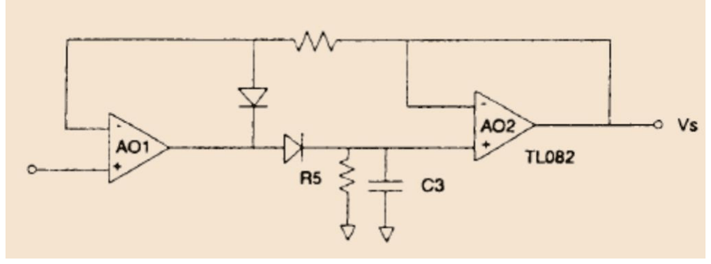

*Figura: Figura 8.36 Detector de pic de precisió.*

La constant de temps és el paràmetre de disseny crític i té dues exigències contraposades. Quan l'amplitud és constant, la sortida ha de ser tan plana com sigui possible: l'**arrissat** entre dues crestes successives val aproximadament

$$
\Delta V \approx \frac{V_p T_0}{\tau} = \frac{V_p}{f_0\,\tau} \qquad (8.36)
$$

de manera que  $\tau \gg \frac{1}{f_0}$, i típicament es recomana  $\tau \geq 10/f_0$. Quan l'amplitud varia, en canvi, el condensador s'ha de poder descarregar prou de pressa per seguir-la, cosa que exigeix  $\tau \leq \frac{1}{2\pi f_{m,\max}}$. El criteri conjunt és

$$
\frac{1}{2\pi f_{m,\max}} \geq \tau \gg \frac{1}{f_0} \qquad (8.37)
$$

L'inconvenient principal dels detectors de pic és la sensibilitat al **soroll impulsiu**. Un pols breu de tensió alta carrega ràpidament el condensador fins a un pic fals molt superior a l'envolupant real i, com que la descàrrega és lenta, l'error persisteix durant molts períodes de la portadora. Per això els detectors de precisió solen incorporar un díode addicional de protecció o una limitació del corrent de càrrega; en entorns molt sorollosos —motors, commutadors de potència, contactes mecànics— la solució preferida és la detecció coherent.

> [!TIP] **Síntesi**
>
> Amb modulació AM clàssica l'amplitud no s'anul·la mai i la fase és constant, de manera que n'hi ha prou amb mesurar l'envolupant; amb modulació DSB l'amplitud s'anul·la a  $x=0$  i el signe queda a la fase, que cap mètode no coherent no pot recuperar. Tots els mètodes no coherents mesuren el que els arriba sense discriminar la freqüència, i per això el soroll i les interferències hi entren quadràticament com a biaix positiu. Els convertidors RMS tèrmics donen el valor eficaç veritable amb gran amplada de banda però són lents i cars; els de càlcul matemàtic són ràpids i econòmics, amb l'explícit limitat pel marge dinàmic i l'implícit per l'amplada de banda; els de rectificació són els més senzills, amb el factor 1,11 vàlid només per a sinusoides. El multiplicador analògic és el bloc comú: d'un quadrant amb logaritmes, i de dos o quatre amb cèl·lules de Gilbert. Els detectors de pic exigeixen una constant de temps prou gran davant del període de la portadora i prou petita davant de la dinàmica del mesurand, i són vulnerables al soroll impulsiu.

[← 3. Amplificadors d'alterna i limitacions dels operacionals](03_Unitat8_Amplificadors_d_alterna.md)[5. Detecció coherent: homodina, rectificació síncrona i mostreig síncron →](05_Unitat8_Deteccio_coherent.md)

---

## 📐 Formulario Resumen de Ecuaciones

| Nº / Ref | Expresión Matemática |
| :---: | :--- |
| **(8.27)** | $v(t) = A(x)\cos(2\pi f_0 t + \varphi_0), \qquad A(x) > 0\ \ \forall x$ |
| **(8.28)** | $V_\mathrm{rms} = \sqrt{\frac{1}{T}\int_0^T v^2(t)\,dt}$ |
| **(8.29)** | $V_\mathrm{out} = \sqrt{V_s^2 + V_{\text{int}}^2 + V_n^2}$ |
| **(8.30)** | $V_\mathrm{out} = \overline{\left(\frac{v^2(t)}{V_\mathrm{out}}\right)} \Rightarrow V_\mathrm{out}^2 = \overline{v^2(t)} \Rightarrow V_\mathrm{out} = \sqrt{\overline{v^2(t)}}$ |
| **(8.31)** | $V_\mathrm{rms} = \frac{\pi}{2\sqrt{2}}\,\overline{\|v(t)\|} \approx 1{,}11\cdot\overline{\|v(t)\|}$ |
| **(8.32)** | $V_\mathrm{out}(t) = \frac{V_x(t)\cdot V_y(t)}{K}$ |
| **(8.33)** | $V_\mathrm{out} = -V_F \approx -\eta\,V_T \ln\!\left(\frac{V_{\text{in}}}{I_S R}\right)$ |
| **(8.34)** | $V_\mathrm{out} = I_C R_1 \approx R_1 I_{\text{ES}}\, e^{-V_i/V_T}$ |
| **(8.35)** | $\Delta I_c = I_Y\cdot\frac{\Delta I_x}{I_x}$ |
| **(8.36)** | $\Delta V \approx \frac{V_p T_0}{\tau} = \frac{V_p}{f_0\,\tau}$ |
| **(8.37)** | $\frac{1}{2\pi f_{m,\max}} \geq \tau \gg \frac{1}{f_0}$ |