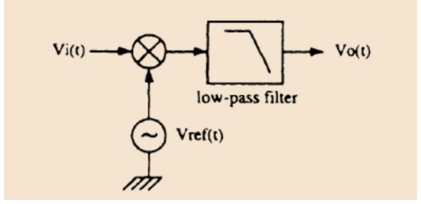
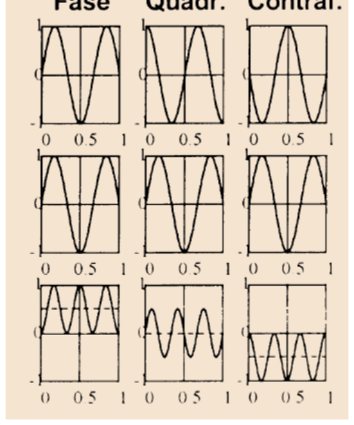
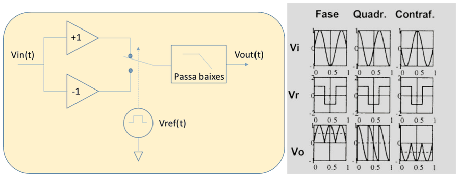
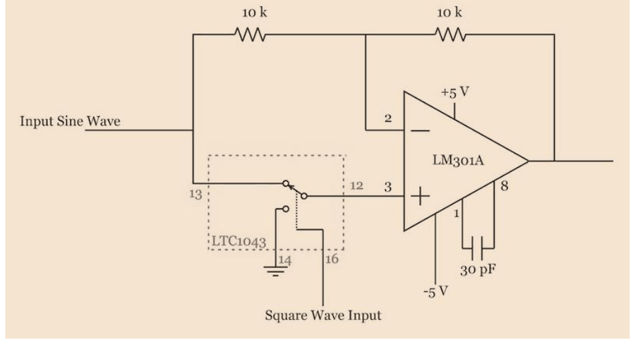
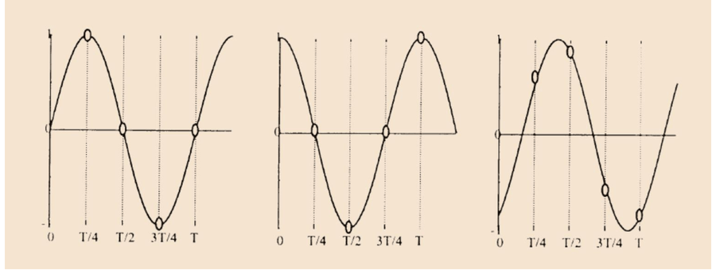

# Detecció coherent: homodina, rectificació síncrona i mostreig síncron

## 📑 Índice de Contenidos

- [1 Principi i avantatges](#1-principi-i-avantatges)
- [2 Detecció homodina](#2-detecció-homodina)
  - [Tria de la freqüència de tall](#tria-de-la-freqüència-de-tall)
- [3 Rectificació síncrona](#3-rectificació-síncrona)
- [4 Mostreig síncron i sub-mostreig](#4-mostreig-síncron-i-sub-mostreig)

---

Sistemes de Mesura · **Unitat 8 — Condicionament de sensors en alterna** · Document 5 de 6

# Detecció coherent: homodina, rectificació síncrona i mostreig síncron

Dedicació estimada: 10 minuts

> [!NOTE] **Objectius d'aprenentatge**
>
> - Enunciar els tres avantatges de la detecció coherent i la condició que ha de complir la referència.
> - Obtenir la sortida d'un detector homodí i interpretar-la en funció del desfasament.
> - Quantificar l'atenuació d'una interferència i la reducció de soroll que aporta el filtre passa-baixes.
> - Justificar per què la rectificació síncrona no necessita multiplicador i quin preu paga per això.
> - Explicar què elimina cada combinació de mostres en el mostreig síncron i quan és vàlid sub-mostrejar.

Els mètodes no coherents mesuren l'envolupant sense cap referència temporal: ignoren la fase i per això la seva sortida és sempre positiva. En termes d'informació, en llencen la meitat —saben quant val l'amplitud, però no en quin sentit apunta el mesurand. La detecció coherent aprofita que l'oscil·lador que excita el convertidor impedància–tensió és, en tot moment, una referència de fase perfectament coneguda.

## 1 Principi i avantatges

Un senyal sinusoïdal té dos paràmetres lliures, l'amplitud i la fase. La tensió d'entrada al detector és

$$
v_i(t) = V_i \cos(2\pi f_0 t + \varphi) \qquad (8.38)
$$

on  $V_i$  depèn del mesurand i  $\varphi$  és el desfasament respecte a la referència. Un convertidor no coherent retorna només  $V_i$; un detector coherent pot retornar  $V_i\cos\varphi$  i  $V_i\sin\varphi$  —les components en fase i en quadratura— i, a partir d'elles, reconstruir tant l'amplitud,  $V_i = \sqrt{V_I^2 + V_Q^2}$, com la fase,  $\varphi = \arctan(V_Q/V_I)$. La configuració més habitual, però, és una sortida única proporcional a  $V_i\cos\varphi$, quan el desfasament de la cadena és conegut i compensat.

L'element diferenciador és el **senyal de referència**. Ha de ser síncron amb l'oscil·lador que excita el convertidor —sovint és literalment el mateix senyal— i la condició imprescindible és que tots dos tinguin exactament la mateixa freqüència  $f_0$. Pot tenir un desfasament conegut respecte a l'oscil·lador, però ha de ser estable i controlat: un desfasament desconegut o variable és una font d'error sistemàtic. La forma d'ona de la referència —sinusoïdal, quadrada o tren d'impulsos— determina el tipus de detector.

| Avantatge | Origen |
|:--- |:--- |
| **Recuperació del signe en DSB** | Amb el pont o pseudopont diferencial, la fase salta de 0° a 180° quan  $x$  canvia de signe. El detector coherent retorna valor positiu per a  $x>0$  i negatiu per a  $x<0$, cosa que el fa imprescindible en sensors de desplaçament bidireccional com la LVDT. |
| **Rebuig de soroll i interferències** | El filtre passa-baixes que segueix la multiplicació estreny l'amplada de banda efectiva de soroll. Amb amplada de banda de l'amplificador d'alterna  $BW_{\text{AC}}$  i tall del filtre  $f_c$, el soroll es comprimeix en un factor  $\sqrt{\frac{f_c}{BW_{\text{AC}}}}$. |
| **Rebuig de la quadratura** | Els errors deguts al CMRR i al PSRR finits apareixen desfasats 90° respecte al senyal útil. Un detector configurat per mesurar la component en fase els rebutja completament, cosa que els mètodes no coherents no poden fer. |

## 2 Detecció homodina

*Figura: Figura 8.37 Detector homodí.*

És el mètode coherent canònic: multiplicar el senyal per una referència de la mateixa freqüència i filtrar el resultat amb un passa-baixes. La multiplicació trasllada part de l'espectre des de  $f_0$  fins a la contínua, on s'extreu el valor del mesurand. Amb una referència  $v_{\text{ref}}(t) = V_r\cos(2\pi f_0 t)$  i la identitat  $\cos\alpha\cos\beta = \frac{1}{2}[\cos(\alpha-\beta) + \cos(\alpha+\beta)]$:

$$
v_i\cdot v_{\text{ref}} = \frac{V_i V_r}{2}\left[\cos\varphi + \cos(4\pi f_0 t + \varphi)\right] \qquad (8.39)
$$

El producte conté un terme constant i un terme al doble de la freqüència de treball. Si el tall del filtre compleix  $f_c \ll 2f_0$, el segon terme s'elimina i la sortida és

$$
V_\mathrm{out} = \frac{V_i V_r}{2}\cos\varphi \qquad (8.40)
$$

*Figura: Figura 8.38 Senyals d'un detector homodí en fase, en quadratura i en contrafase.*

La interpretació és directa. Per a  $\varphi = 0°$  la sortida és màxima i positiva; per a  $\varphi = 180°$, màxima en valor absolut i negativa, que és el cas de  $x<0$  en modulació DSB; i per a  $\varphi = 90°$  o  $270°$  la sortida és nul·la, és a dir, la quadratura queda completament rebutjada.

A la pràctica  $\varphi$  no és exactament zero, pels retards de fase de l'amplificador d'alterna i de les altres etapes. Per a desfasaments petits l'error relatiu és  $(1-\cos\varphi) \approx \varphi^2/2$, de segon ordre i per tant molt petit; si el desfasament és gran però constant, és fàcilment corregible, i si no ho és, cal recórrer a la detecció I/Q.

### Tria de la freqüència de tall

És el paràmetre de disseny clau, i comporta un compromís anàleg al de la constant de temps del detector de pic. Una  $f_c$  baixa dona millor rebuig de soroll —el soroll de sortida és proporcional a  $\sqrt{f_c}$ — però impedeix seguir canvis ràpids del mesurand: si  $x$  varia a una freqüència superior a  $f_c$, la sortida s'atenua i apareix retard de fase.

Una interferència sinusoïdal a  $f_{\text{int}}$  superposada al senyal es trasllada, en multiplicar, a  $|f_{\text{int}}-f_0|$  i a  $f_{\text{int}}+f_0$. L'atenuació que rep la component baixa amb un filtre de primer ordre és

$$
|H(f_{\text{int}}-f_0)| \approx \frac{f_c}{|f_{\text{int}}-f_0|} \qquad \mathrm{per a } |f_{\text{int}}-f_0| \gg f_c \qquad (8.41)
$$

Amb  $f_0 = 100$  kHz, la xarxa a 50 Hz i  $f_c = 10$  Hz, la interferència queda traslladada a prop de 100 kHz i l'atenuació val  $10^{-4}$: la seva amplitud a la sortida és deu mil vegades inferior a la que tindria en un convertidor RMS equivalent. Aquest és l'avantatge de la detecció coherent quan la freqüència de treball s'ha escollit prou allunyada de les interferències.

Pel que fa al soroll, amb  $BW_{\text{AC}} = 1$  kHz i  $f_c = 1$  Hz la reducció és d'un factor  $\sqrt{\frac{1}{1000}} \approx 1/31{,}6$. Valors habituals de 10–100 Hz per a  $f_c$  i d'1–10 kHz per a  $BW_{\text{AC}}$  donen reduccions de 20–40 dB respecte als mètodes no coherents, entre un i dos ordres de magnitud de millora en la resolució.

## 3 Rectificació síncrona

*Figura: Figura 8.39 Rectificador síncron: diagrama de blocs i senyals.*

Comparteix el principi de la detecció homodina —multiplicació seguida de filtratge— però substitueix la referència sinusoïdal per una **ona quadrada** sincronitzada amb l'oscil·lador, que val +1 durant el semiperíode positiu i −1 durant el negatiu. Multiplicar per  $\pm 1$  no és res més que canviar de signe el senyal cada semiperíode, i això **no necessita cap multiplicador analògic**: n'hi ha prou amb un commutador.

*Figura: Figura 8.40 Implementació circuital del rectificador síncron.*

La implementació típica connecta el terminal no inversor d'un operacional alternativament al senyal d'entrada o a massa, segons el nivell de la referència: en el primer cas el circuit actua com a seguidor, i en el segon com a inversor de guany −1. Darrere s'hi situa el mateix filtre passa-baixes del detector homodí.

| Desfasament | Resultat |
|:--- |:--- |
| **0° (en fase)** | El semiperíode positiu del senyal coincideix amb el de la referència. No hi ha inversió on el senyal és positiu i sí on és negatiu: s'obté una rectificació de doble ona sempre positiva, de valor mitjà màxim i proporcional a l'amplitud. |
| **180° (contrafase)** | El resultat és sempre negatiu i la sortida del filtre és màxima en valor absolut i negativa, exactament com en la detecció homodina. |
| **90° (quadratura)** | La simetria del sinus desplaçat 90° respecte als semiperíodes de la referència fa que la integral neta sobre cada semiperíode sigui zero i el valor mitjà sigui nul: la quadratura queda completament rebutjada, igual que en la detecció homodina. |

El preu és un rebuig de soroll lleugerament inferior. La referència quadrada conté, a més de la fonamental a  $f_0$, **harmònics imparells** a  $3f_0, 5f_0, 7f_0,\dots$  amb amplituds  $4/(k\pi)$, de manera que el rectificador és sensible també a components de soroll i d'interferència properes a aquests harmònics, que es traslladen a la contínua i travessen el filtre. L'efecte sol ser negligible si les interferències estan prou allunyades de tots els harmònics de  $f_0$, però és un problema real en entorns amb interferències harmònicament relacionades amb la freqüència de treball.

A canvi, la rectificació síncrona és molt més senzilla d'implementar, és menys sensible a les imperfeccions del circuit de referència —una ona quadrada es genera amb precisió amb circuits digitals— i consumeix menys. Per a la majoria d'aplicacions de condicionament de sensors reactius la degradació del rebuig és irrellevant, i és la solució preferida.

## 4 Mostreig síncron i sub-mostreig

La tercera modalitat pren com a referència un **tren d'impulsos** situats en instants precisos i sincronitzats amb l'oscil·lador, de manera que el mostreig equival a multiplicar el senyal per  $\sum_n \delta(t-t_n)$. Amb  $t_n = n/f_0 + \tau_0$, on  $\tau_0$  és el desplaçament del tren respecte al zero de l'oscil·lador:

$$
v_i(t_n) = V_i\cos(2\pi n + 2\pi f_0\tau_0 + \varphi) = V_i\cos(2\pi f_0\tau_0 + \varphi) \qquad (8.42)
$$

El valor mostrejat és constant —independent de  $n$ — i proporcional a  $V_i\cos(\varphi + \psi)$  amb  $\psi = 2\pi f_0\tau_0$. Variant  $\tau_0$  es pot obtenir la mostra en qualsevol fase del cicle, i mostres preses en instants diferents donen projeccions del senyal en direccions de fase diferents.

*Figura: Figura 8.41 Detecció amb quatre mostres per cicle.*

L'estratègia habitual pren quatre mostres per cicle, espaiades  $T_0/4$. Amb  $B$  l'amplitud d'una component en quadratura —un error de CMRR, per exemple— i  $C$  una tensió d'offset contínua, les quatre mostres valen  $V_i\cos\varphi + B\sin\varphi + C$,  $-V_i\sin\varphi + B\cos\varphi + C$,  $-V_i\cos\varphi - B\sin\varphi + C$  i  $V_i\sin\varphi - B\cos\varphi + C$. Combinant-les:

$$
v_s(0) - v_s(T_0/2) = 2V_i\cos\varphi + 2B\sin\varphi \qquad (8.43)
$$

$$
v_s(T_0/4) - v_s(3T_0/4) = -2V_i\sin\varphi + 2B\cos\varphi \qquad (8.44)
$$

Amb mostreig perfectament en fase, la primera combinació val  $2V_i$  i la segona  $2B$, de manera que senyal útil i quadratura queden separats. En general, per a  $\varphi$  arbitrari, les quatre mostres permeten resoldre el sistema i extreure  $V_i$,  $B$,  $C$  i  $\varphi$  per separat. Amb **dues** mostres per cicle, als instants 0 i  $T_0/2$, s'elimina l'offset però no la quadratura; amb **quatre** s'eliminen totes dues i, a més, es recupera el signe de  $x$.

> [!WARNING] **Què fixa la taxa de mostreig**
>
> El mostreig síncron no pretén reconstruir la sinusoide a  $f_0$, sinó l'envolupant  $V_i(t)\cos\varphi$, que varia molt més lentament: fa implícitament una desmodulació coherent i mostreja després el senyal desmodulat. Per això la condició de Nyquist s'aplica al mesurand,
>
>

$$
f_s \geq 2\,f_{m,\max} \qquad (8.45)
$$

>
> i no a la portadora. La taxa de mostreig pot ser molt inferior a  $f_0$: amb  $f_0 = 10$  kHz i  $f_{m,\max} = 1$  Hz n'hi hauria prou amb una mostra cada 5.000 cicles, tot i que a la pràctica es prefereix  $f_s$  entre 10 i 100 vegades  $f_{m,\max}$  per tenir marge i poder emprar filtres digitals senzills. El **sub-mostreig estricte**,  $f_s < f_0$, és per tant perfectament vàlid.

El sub-mostreig té un avantatge addicional: es poden **promitjar** múltiples mostres preses en el mateix instant de fase del cicle, cosa que redueix el soroll de la mesura.

> [!TIP] **Síntesi**
>
> La detecció coherent multiplica el senyal per una referència síncrona amb l'oscil·lador i de la mateixa freqüència, i n'obté  $V_i\cos\varphi$: recupera el signe del mesurand en modulació DSB, rebutja les components en quadratura i redueix el soroll en un factor  $\sqrt{\frac{f_c}{BW_{\text{AC}}}}$. En la detecció homodina la referència és sinusoïdal i el producte dona un terme en contínua i un altre a  $2f_0$  que el filtre elimina; la freqüència de tall enfronta rebuig de soroll contra velocitat de seguiment, i atenua una interferència en la raó  $f_c/|f_{\text{int}}-f_0|$. La rectificació síncrona substitueix la referència per una ona quadrada i el multiplicador per un commutador, amb el mateix comportament davant la fase, a canvi de sensibilitat als harmònics imparells de  $f_0$. El mostreig síncron pren mostres en instants de fase coneguda: dues per cicle eliminen l'offset, quatre eliminen també la quadratura, i la taxa de mostreig la fixa la dinàmica del mesurand i no la portadora, de manera que el sub-mostreig és vàlid i permet promitjar mostres de la mateixa fase.

[← 4. Estimació de l'amplitud: mètodes no coherents](04_Unitat8_04_Metodes_no_coherents.md)[6. Mètodes basats en oscil·ladors i mesura de freqüència →](06_Unitat8_Oscil_ladors_de_frequencia_variable.md)

---

## 📐 Formulario Resumen de Ecuaciones

| Nº / Ref | Expresión Matemática |
| :---: | :--- |
| **(8.38)** | $v_i(t) = V_i \cos(2\pi f_0 t + \varphi)$ |
| **(8.39)** | $v_i\cdot v_{\text{ref}} = \frac{V_i V_r}{2}\left[\cos\varphi + \cos(4\pi f_0 t + \varphi)\right]$ |
| **(8.40)** | $V_\mathrm{out} = \frac{V_i V_r}{2}\cos\varphi$ |
| **(8.41)** | $\|H(f_{\text{int}}-f_0)\| \approx \frac{f_c}{\|f_{\text{int}}-f_0\|} \qquad \mathrm{per a } \|f_{\text{int}}-f_0\| \gg f_c$ |
| **(8.42)** | $v_i(t_n) = V_i\cos(2\pi n + 2\pi f_0\tau_0 + \varphi) = V_i\cos(2\pi f_0\tau_0 + \varphi)$ |
| **(8.43)** | $v_s(0) - v_s(T_0/2) = 2V_i\cos\varphi + 2B\sin\varphi$ |
| **(8.44)** | $v_s(T_0/4) - v_s(3T_0/4) = -2V_i\sin\varphi + 2B\cos\varphi$ |
| **(8.45)** | $f_s \geq 2\,f_{m,\max}$ |